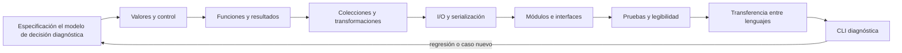

# Parte 5 — Fundamentos de programación

Programar no es traducir frases a sintaxis. Es construir un sistema de valores, decisiones y efectos que mantenga el contrato del problema ante entradas normales, límites y fallos. Esta parte implementa la especificación del modelo de decisión diagnóstica como una **CLI diagnóstica**, una herramienta de línea de comandos que recomienda la siguiente prueba autorizada y explica su decisión.

Python es el lenguaje principal porque permite observar rápidamente cada mecanismo con biblioteca estándar. No se presenta como lenguaje universal: la clase 71 traslada el núcleo a Rust para distinguir semántica del problema de facilidades accidentales del lenguaje.

## Pregunta rectora

> ¿Cómo convertir una especificación contrastable en comportamiento legible, probado y usable desde una terminal?

## Antes del recorrido clase por clase

Cada clase añade una capacidad al mismo programa y conserva cuatro capas:

1. **dominio:** valores y reglas que vienen del modelo de decisión diagnóstica;
2. **núcleo:** funciones y transformaciones sin I/O;
3. **fronteras:** CLI, archivos, JSON, errores y códigos de salida;
4. **evidencia:** ejemplos, pruebas, fallos y comandos reproducibles.

El flujo no autoriza una gran implementación al final. Cada paso debe ejecutar un ejemplo, fallar de forma controlada y dejar una prueba o artefacto que proteja el siguiente cambio.

## Lo que cambia al completar esta parte

Podrás predecir cómo Python evalúa expresiones y control, diseñar funciones con dependencias visibles, tratar errores sin ocultar defectos, elegir colecciones por operaciones, validar JSON, separar módulos, escribir pruebas de consumidor y entregar una CLI con streams y códigos de salida coherentes.

## Guía razonada clase por clase

La CLI diagnóstica materializa la especificación del modelo de decisión diagnóstica sin reducir programación a sintaxis. En
cada clase aparece una decisión concreta de representación, control o frontera; se
explica el mecanismo, se prueba un fallo y se deja un componente que la siguiente clase
debe usar o proteger.

### Bloque 1 — Expresar valores, decisiones y repetición

#### SE-061 — Valores, expresiones, tipos y variables

El programa empieza por decidir qué representa cada valor. La clase separa valor,
representación, expresión, nombre y tipo; muestra que una variable no es una caja
universal y que conversiones implícitas pueden ocultar pérdida o estados inválidos.

La CLI diagnóstica define tipos y validaciones para observaciones, prioridad y autorización. El
estudiante predice expresiones, prueba fronteras y evita usar cadenas como sustituto de
todo el dominio. Esos valores alimentan decisiones que `SE-062` hará explícitas.

#### SE-062 — Control de flujo y decisiones

Una condición selecciona caminos bajo una regla; su orden puede cambiar el resultado
cuando los casos se solapan. La clase trabaja booleanos, cortocircuito, guard clauses,
ramas exhaustivas y tablas de decisión, distinguiendo «no coincide» de entrada inválida.

El estudiante implementa la política de la CLI diagnóstica y demuestra qué regla ganó en límites y
empates. La evidencia incluye una tabla que precede al código. Cuando la misma decisión
debe aplicarse a muchas observaciones o a una estructura anidada, `SE-063` introduce
iteración, recursión y progreso.

#### SE-063 — Iteración, recursión y recorridos

Repetir exige invariante, progreso y condición de salida. La clase compara bucles,
iteradores y recursión, explica por qué modificar una colección durante el recorrido
puede omitir elementos y por qué un grafo necesita visitados aunque la función parezca
correcta sobre un árbol.

La CLI diagnóstica recorre observaciones y dependencias hasta encontrar la primera divergencia. El
estudiante traza estado, reproduce no terminación y establece límites. La regla repetida
necesita una unidad con entradas, salida y efectos claros; `SE-064` la encapsula en
funciones.

#### SE-064 — Funciones, parámetros, retorno y alcance

Una función no es reutilizable por tener nombre: debe declarar contrato, dependencias y
efectos. La clase distingue parámetros de argumentos, retorno de impresión, alcance de
vida útil y cierre de captura accidental. Valores predeterminados mutables muestran cómo
una decisión pequeña conserva estado entre llamadas.

El estudiante separa cálculo puro de observación e I/O y prueba la función de selección
sin terminal. La CLI diagnóstica obtiene una interfaz que permite sustituir datos y registrar
errores. `SE-065` diseña esos fallos como resultados comprensibles en lugar de capturar
cualquier excepción.

### Bloque 2 — Diseñar fronteras de datos y efectos

#### SE-065 — Errores, excepciones y resultados explícitos

Un error de entrada esperable, una dependencia no disponible y un defecto interno no
requieren la misma respuesta. La clase explica propagación, captura específica, causa,
limpieza y resultados tipados. Atrapar todo y continuar puede convertir corrupción en
aparente éxito.

La CLI diagnóstica clasifica sus fallos, conserva contexto seguro y decide qué puede recuperar. El
estudiante prueba ruta feliz, entrada inválida y fallo de I/O, verificando mensaje y
código de salida. Esos resultados operan sobre conjuntos de datos que `SE-066` organiza
según sus operaciones dominantes.

#### SE-066 — Colecciones y transformación de datos

Lista, tupla, conjunto y diccionario ofrecen contratos diferentes de orden, unicidad,
identidad y búsqueda. La clase evita elegir por costumbre: parte de operaciones,
invariantes y tamaño. También separa transformar de mutar para poder razonar sobre
aliasing y orden.

El estudiante modela observaciones de la CLI diagnóstica, elimina duplicados sin perder procedencia
y construye un pipeline que conserva errores. Pruebas de orden, empate y ausencia hacen
visible la elección. `SE-067` lleva esas colecciones a través de archivos y JSON, donde
la representación deja de ser un objeto en memoria.

#### SE-067 — Entrada, salida y serialización

Leer y escribir cruza una frontera falible: encoding, formato, esquema, tamaño,
permisos y escritura parcial importan. La clase distingue serialización de significado,
valida antes de usar y explica escritura atómica mediante archivo temporal y reemplazo
cuando el sistema lo permite.

La CLI diagnóstica acepta `stdin` o archivo y emite JSON estable separado de diagnósticos. El
estudiante reproduce texto inválido, campo ausente y salida interrumpida, y limpia
temporales. `SE-068` evita que estas decisiones contaminen la lógica al separar módulos,
interfaces y adaptadores.

#### SE-068 — Módulos, interfaces y separación de responsabilidades

Dividir por cantidad de líneas no crea arquitectura. La clase separa dominio, puertos y
adaptadores; analiza importaciones, dependencias y superficie pública, y muestra cómo un
módulo «utilidades» puede convertirse en acoplamiento sin propietario.

El estudiante organiza la CLI diagnóstica para que la política no conozca terminal ni sistema de
archivos. Una prueba sustituye el adaptador y confirma dirección de dependencia. Con
fronteras estables, `SE-069` puede diseñar ejemplos antes del cambio y convertirlos en
protección contra regresiones.

### Bloque 3 — Proteger cambio y transferir comprensión

#### SE-069 — Pruebas tempranas y diseño por ejemplos

Una prueba no demuestra ausencia de defectos; concreta un comportamiento bajo datos y
entorno. La clase construye ejemplos normales, límite, inválidos y de regresión,
distingue unidad de integración y evita verificar detalles internos que impidan
refactorizar.

La CLI diagnóstica obtiene una suite que cubre reglas, errores y CLI. El estudiante observa fallar
la prueba por la razón esperada antes de corregir. `SE-070` usa esa red para mejorar
nombres y estructura sin cambiar la conducta visible.

#### SE-070 — Legibilidad, nombres y mantenimiento básico

Legibilidad es reducción de ambigüedad para quien debe cambiar el sistema, no una
preferencia estética universal. La clase relaciona nombres, tamaño, cohesión,
duplicación, comentarios y complejidad; un comentario que repite código no compensa una
regla oculta.

El estudiante refactoriza la CLI diagnóstica en pasos pequeños, ejecuta pruebas y registra por qué
cada cambio mejora una tarea futura. También conserva una versión donde el refactor
rompe semántica para explicar el límite. `SE-071` comprueba si la comprensión sobrevive
al cambiar de lenguaje.

#### SE-071 — Taller: transferir una solución entre lenguajes

Traducir palabra por palabra conserva sintaxis aparente y puede cambiar ownership,
errores, enteros o colecciones. El taller fija primero el contrato observable de
la CLI diagnóstica, implementa una porción en Python y Rust y compara representaciones, fallos y
costos de adaptación.

Las mismas fixtures deben producir resultados equivalentes, pero no se exige arquitectura
idéntica. El estudiante explica cada diferencia y evita benchmarks sin control. La
experiencia revela qué decisiones pertenecen al problema y cuáles al lenguaje;
`SE-072` reúne esas decisiones en una CLI entregable.

#### SE-072 — Proyecto: herramienta de línea de comandos probada

El proyecto integra dominio, adaptadores, configuración, serialización, errores y
pruebas en una CLI que otra persona puede instalar y comprender. Salida de datos y
diagnóstico permanecen separados; ayuda, códigos y limpieza forman parte del contrato,
no de la decoración final.

La aceptación parte de un checkout limpio y prueba éxito, entrada inválida, dependencia
fallida y repetición. El informe declara plataformas verificadas y límites. La CLI diagnóstica deja
una regla estable que la Parte 6 expresará mediante paradigmas distintos para comparar
semántica, no familiaridad.

## Resumen operativo del recorrido

| Clase | Núcleo profesional | Aporte acumulativo a la CLI diagnóstica |
|---|---|---|
| [SE-061](../../classes/part-05-fundamentos-de-programacion/se-061-valores-expresiones-tipos-y-variables/) | Valores, expresiones, tipos y variables | Fija significado de valores y tipos |
| [SE-062](../../classes/part-05-fundamentos-de-programacion/se-062-control-de-flujo-y-decisiones/) | Control de flujo y decisiones | Cubre decisiones y fronteras |
| [SE-063](../../classes/part-05-fundamentos-de-programacion/se-063-iteracion-recursion-y-recorridos/) | Iteración, recursión y recorridos | Recorre sin perder progreso |
| [SE-064](../../classes/part-05-fundamentos-de-programacion/se-064-funciones-parametros-retorno-y-alcance/) | Funciones, parámetros, retorno y alcance | Encapsula reglas y efectos |
| [SE-065](../../classes/part-05-fundamentos-de-programacion/se-065-errores-excepciones-y-resultados-explicitos/) | Errores, excepciones y resultados explícitos | Modela fallos recuperables |
| [SE-066](../../classes/part-05-fundamentos-de-programacion/se-066-colecciones-y-transformacion-de-datos/) | Colecciones y transformación de datos | Elige colecciones por operaciones |
| [SE-067](../../classes/part-05-fundamentos-de-programacion/se-067-entrada-salida-y-serializacion/) | Entrada, salida y serialización | Cruza archivos y JSON con límites |
| [SE-068](../../classes/part-05-fundamentos-de-programacion/se-068-modulos-interfaces-y-separacion-de-responsabilidades/) | Módulos, interfaces y separación de responsabilidades | Separa dominio, adaptadores y CLI |
| [SE-069](../../classes/part-05-fundamentos-de-programacion/se-069-pruebas-tempranas-y-diseno-por-ejemplos/) | Pruebas tempranas y diseño por ejemplos | Diseña por ejemplos y regresiones |
| [SE-070](../../classes/part-05-fundamentos-de-programacion/se-070-legibilidad-nombres-y-mantenimiento-basico/) | Legibilidad, nombres y mantenimiento básico | Refactoriza conservando intención |
| [SE-071](../../classes/part-05-fundamentos-de-programacion/se-071-taller-transferir-una-solucion-entre-lenguajes/) | Taller: transferir una solución entre lenguajes | Contrasta semántica Python/Rust |
| [SE-072](../../classes/part-05-fundamentos-de-programacion/se-072-proyecto-herramienta-de-linea-de-comandos-probada/) | Proyecto: herramienta de línea de comandos probada | Entrega una CLI probada y explicable |

## Hilo pedagógico

Las clases 61 a 64 construyen el núcleo del lenguaje: valores, decisiones, recorridos y funciones. Las clases 65 a 68 definen fronteras y estructura: errores, datos, I/O y módulos. Las clases 69 y 70 protegen cambio mediante pruebas y legibilidad. El taller 71 verifica transferencia; el proyecto 72 integra la CLI.

## Evidencias acumulativas

1. ejemplos ejecutables con predicción y salida;
2. núcleo `choose_next` separado de terminal y archivos;
3. validadores de entrada y resultados de error explícitos;
4. adaptador JSON con límites y escritura recuperable;
5. suite de dominio y CLI con regresiones;
6. comparación Python/Rust basada en fixtures comunes;
7. La CLI diagnóstica operable desde `python -m diagnostic_cli`, con README y matriz de códigos.

## Criterios de aprobación del proyecto

- la CLI implementa el contrato del modelo de decisión diagnóstica y no inventa reglas;
- ayuda, stdout, stderr y códigos de salida son coherentes;
- el núcleo no realiza I/O y puede probarse en aislamiento;
- entrada externa se limita, parsea y valida antes del dominio;
- pruebas cubren normal, vacío, empate, inválido y fallo de frontera;
- el caso degradado se recupera sin archivos parciales;
- otra persona ejecuta la guía desde checkout limpio;
- la entrega declara plataformas realmente probadas y límites.

## Preguntas de control

¿Qué valor y tipo existe?, ¿qué rama falta?, ¿qué progresa?, ¿qué función posee la regla?, ¿quién recupera el error?, ¿qué colección expresa la invariante?, ¿qué bytes cruzan la frontera?, ¿qué módulo puede cambiar solo?, ¿qué prueba protege el contrato?, ¿qué nombre revela intención?, ¿qué cambia en otro lenguaje?

## Fuentes base

- [Python Tutorial](https://docs.python.org/3/tutorial/)
- [Python Language Reference](https://docs.python.org/3/reference/)
- [Python Standard Library](https://docs.python.org/3/library/)
- [The Rust Programming Language](https://doc.rust-lang.org/stable/book/)
- [SWEBOK Guide v4.0a](https://www.computer.org/education/bodies-of-knowledge/software-engineering)

La documentación define mecanismos y APIs. Los snippets de las clases siguen siendo material guiado; el proyecto solo adquiere estados superiores cuando sus artefactos y ejecuciones queden versionados y validados.
