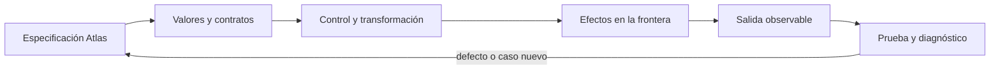

# SE-063 — Iteración, recursión y recorridos

[← SE-062 — Control de flujo y decisiones](../../classes/part-05-fundamentos-de-programacion/se-062-control-de-flujo-y-decisiones/README.md) · [↑ Parte 05](../../classes/part-05-fundamentos-de-programacion/README.md) · [📚 Índice completo](../../classes/README.md) · [🌐 Portal](../../site/classes/SE-063.html) · [SE-064 — Funciones, parámetros, retorno y alcance →](../../classes/part-05-fundamentos-de-programacion/se-064-funciones-parametros-retorno-y-alcance/README.md)

> Estado: **GUIDED** · Clase desarrollada y revisada cualitativamente.

## Antes de empezar

Esta clase construye **Brújula**, la implementación incremental de la especificación Atlas. Recupera `SE-062` y convierte una regla ya modelada en comportamiento ejecutable o comprobable. Trabaja en cambios pequeños: predicción, código, ejecución, evidencia y explicación. Ejecutar sin poder explicar el resultado no completa la práctica.

## Prerrequisitos

- Python 3.11 o posterior disponible como `python` o `python3`; registra la versión real.
- Terminal, editor de texto y Git; no se requieren paquetes externos.
- Comprender el contrato de Atlas: entradas, resultados, errores e invariantes.

## Problema auténtico

Brújula debe recorrer observaciones, dependencias anidadas y eventos hasta hallar la primera divergencia. Un bucle puede saltar elementos al modificar la lista; una recursión puede repetir nodos ante ciclos. El recorrido necesita invariante, progreso y límites.

## Objetivos observables

Al terminar podrás explicar el mecanismo del lenguaje, predecir una ejecución, implementar un caso normal y sus fronteras, diagnosticar un fallo controlado, proteger el comportamiento con evidencia y separar lo transferible de lo específico de Python.

## Mapa conceptual



El código no reemplaza la especificación: la materializa bajo reglas concretas del lenguaje y del entorno. La pregunta de esta clase es: **¿Qué progresa en cada paso y qué condición garantiza que el recorrido termina?**

## Temas y por qué importan

| Lente | Pregunta | Evidencia |
|---|---|---|
| valor | ¿qué representa y qué tipo tiene? | ejemplo inspeccionable |
| control | ¿qué camino o repetición ocurre? | traza de estados |
| contrato | ¿qué acepta, retorna y rechaza? | casos frontera |
| efecto | ¿qué cambia fuera del cálculo? | archivo o stream controlado |
| mantenimiento | ¿cómo se detecta una regresión? | prueba y diff enfocado |

## Conceptos y decisiones

### 1. Iteración definida e indefinida

`for` recorre un iterable; `while` repite mientras una condición sea verdadera. `for` comunica mejor un dominio finito conocido. `while` requiere una variable de progreso visible; depender de un evento externo exige deadline o cancelación.

### 2. Invariante de bucle

Antes de cada iteración se conserva una propiedad. En búsqueda de primera falla: todos los elementos anteriores fueron sanos y `index` apunta al siguiente no clasificado. El invariante explica por qué detenerse produce la respuesta correcta.

### 3. break, continue y else

`break` termina el bucle más cercano; `continue` salta a la siguiente vuelta. Un `else` de bucle se ejecuta si no hubo `break`, útil para expresar «no encontrado», pero puede sorprender. Se usa solo con una lectura clara y pruebas.

### 4. Recursión y pila

La recursión resuelve una estructura mediante subestructuras y caso base. Python no optimiza tail calls y limita profundidad; árboles profundos necesitan pila explícita. Para grafos, `visited` impide ciclos y repetición.

### 5. Modificar mientras se recorre

Eliminar elementos de la lista iterada desplaza índices y omite datos. Se construye una nueva colección, se itera sobre copia o se filtra declarativamente. La estrategia depende de memoria, identidad y necesidad de conservar orden.

## Definiciones de trabajo

- **iterable:** objeto que produce elementos secuencialmente.
- **invariante de bucle:** propiedad cierta antes y después de cada vuelta.
- **progreso:** cambio que acerca a la terminación.
- **caso base:** entrada resuelta sin nueva recursión.
- **visited:** conjunto de identidades ya procesadas.

Estas definiciones describen el uso concreto en Brújula. Cuando Python permita varias conductas, el contrato del programa elige una y la hace visible con validación y pruebas.

## Ejemplo mínimo

```python
first_failure = None
for observation in observations:
    if observation["outcome"] == "ok":
        continue
    first_failure = observation
    break

if first_failure is None:
    print("healthy")
```

Traza un bucle sobre `[ok, ok, tls_error, http_error]`. Escribe el invariante antes de cada vuelta y explica por qué detenerse en TLS devuelve la primera divergencia.

Ejecuta el fragmento en un archivo, no solo en una conversación interactiva. Conserva comando, versión, salida y explicación de cada línea relevante.

## Ejemplo profesional

Brújula recorre un grafo con pila explícita y `visited`. Cada extracción consume un nodo y cada nodo se añade una vez. Un límite de nodos produce `INCOMPLETE` con cursor; no finge resultado completo.

El criterio profesional es que el comportamiento pueda ser consumido, diagnosticado y cambiado sin depender de conocimiento oral ni de estado oculto.

## Práctica guiada

1. elige `for` o `while` y justifica.
2. declara invariante y medida de progreso.
3. traza índices y resultado.
4. reproduce el defecto de borrar durante recorrido.
5. convierte una recursión de árbol a pila.
6. ejecuta `python -m unittest -v` cuando existan pruebas y registra el resultado exacto.

## Ejercicios

1. **Lectura:** predice valor, tipo, rama o efecto de un fragmento antes de ejecutarlo.
2. **Construcción:** añade un caso de Brújula siguiendo el contrato, sin mezclar I/O y cálculo.
3. **Frontera:** incorpora vacío, límite, inválido y error recuperable.
4. **Transferencia:** escribe pseudocódigo o una versión equivalente en otro lenguaje y señala diferencias.

## Reto verificable

Entrega un cambio que incluya comportamiento, caso normal, caso límite, fallo controlado y explicación. Otra persona debe poder ejecutar los comandos desde un checkout limpio y relacionar cada salida con una regla de Atlas.

## Demostración guiada

1. Escribe la entrada y la salida esperada antes del código.
2. Ejecuta el caso mínimo y observa valores intermedios sin dejar prints permanentes en el núcleo.
3. Añade el caso frontera que obligue a decidir, no solo a teclear.
4. Introduce el fallo descrito abajo y confirma que la evidencia lo detecta.
5. Corrige, ejecuta toda la suite y revisa el diff por efectos no deseados.

## Preguntas frecuentes

### ¿Que el programa se ejecute significa que está correcto?

No. Solo demuestra que esa ejecución terminó. La corrección se refiere al contrato y requiere cubrir límites, errores y propiedades relevantes.

### ¿Debo memorizar toda la sintaxis?

No. Debes reconocer valores, control, contratos y efectos, y saber consultar la referencia oficial. Copiar sintaxis sin modelo produce defectos difíciles de diagnosticar.

### ¿Las anotaciones de tipo validan JSON?

No por sí solas. Ayudan a lectores y herramientas; los datos externos requieren parseo y validación en ejecución.

## Fallo controlado y diagnóstico

Recorre una lista de pruebas y elimina las desautorizadas en el mismo `for`. Observa elementos saltados. Sustituye por una comprensión filtrada y prueba orden y cantidad.

Registra mensaje, traceback cuando corresponda, hipótesis, caso mínimo, corrección y prueba de regresión. No ocultes el fallo con un `except` amplio ni cambies la prueba para aceptar el defecto.

## Errores comunes y cómo corregirlos

| Síntoma | Causa | Corrección |
|---|---|---|
| funciona solo con un dato | ejemplo usado como especificación | particiones y casos frontera |
| `None`, vacío y cero se mezclan | truthiness sin semántica | comparaciones explícitas |
| importar ejecuta trabajo | efectos al nivel del módulo | función `main` y composition root |
| error desaparece | captura demasiado amplia | manejar solo lo recuperable |
| refactor rompe consumidores | pruebas de detalle o contrato implícito | probar interfaz pública |

## Entorno y archivos clave

```text
work/SE-063/
├── compass/
│   ├── __init__.py
│   ├── domain.py
│   ├── cli.py
│   └── __main__.py
├── tests/
│   └── test_compass.py
└── README.md
```

No instales dependencias para resolver lo que cubre la biblioteca estándar. `README.md` conserva versión, comandos, entradas, salida, limpieza y límites. Los fragmentos son pedagógicos; intégralos solo después de entender su contrato.

## Seguridad, ética y accesibilidad

- usa fixtures sintéticos y no incluyas tokens, rutas personales ni incidentes reales;
- limita tamaño, profundidad y tiempo de entradas no confiables;
- separa stdout parseable de stderr y redacta datos sensibles;
- ofrece mensajes accionables y no dependas solo de color;
- preserva autorización como regla del núcleo, no como checkbox de UI;
- no uses `eval`, `exec` ni construcción de shell con entrada externa.

## Transferencia

Reimplementa el contrato, no la sintaxis. Identifica cómo el segundo lenguaje representa ausencia, error, mutabilidad y módulos. Conserva fixtures y resultados públicos para detectar una diferencia semántica.

## Evaluación y evidencia

| Criterio | Evidencia para aprobar |
|---|---|
| comprensión | predicción y explicación de ejecución |
| comportamiento | normal, límite e inválido según contrato |
| diseño | cálculo separado de efectos y dependencias visibles |
| diagnóstico | fallo mínimo, causa y regresión |
| reproducibilidad | versión, comandos y salidas desde checkout limpio |

No se asciende a `EXECUTABLE` o `TESTED` solo por incluir snippets y comandos. Esos estados requieren artefactos ejecutados y evidencia verificable más allá de esta guía.

## Fuentes

- [Python Tutorial](https://docs.python.org/3/tutorial/): referencia oficial para el mecanismo y los límites explicados.
- [Python Language Reference](https://docs.python.org/3/reference/): referencia oficial para el mecanismo y los límites explicados.
- [Python Tutorial — Data Structures](https://docs.python.org/3/tutorial/datastructures.html): referencia oficial para el mecanismo y los límites explicados.

La documentación oficial define el lenguaje y la biblioteca; no demuestra que Brújula cumpla su dominio. Esa evidencia vive en contratos, pruebas y ejecución reproducible.

## Límites y siguiente paso

Un recorrido correcto puede ser demasiado costoso y Python impone límites de recursos. La siguiente clase encapsula decisiones mediante funciones y contratos.

## Glosario

- **iterable:** objeto que produce elementos secuencialmente.
- **invariante de bucle:** propiedad cierta antes y después de cada vuelta.
- **progreso:** cambio que acerca a la terminación.
- **caso base:** entrada resuelta sin nueva recursión.
- **visited:** conjunto de identidades ya procesadas.

---

[← SE-062 — Control de flujo y decisiones](../../classes/part-05-fundamentos-de-programacion/se-062-control-de-flujo-y-decisiones/README.md) · [↑ Parte 05](../../classes/part-05-fundamentos-de-programacion/README.md) · [📚 Índice completo](../../classes/README.md) · [🌐 Portal](../../site/classes/SE-063.html) · [SE-064 — Funciones, parámetros, retorno y alcance →](../../classes/part-05-fundamentos-de-programacion/se-064-funciones-parametros-retorno-y-alcance/README.md)
