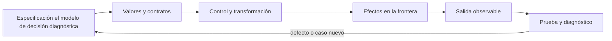

# SE-065 — Errores, excepciones y resultados explícitos

[← SE-064 — Funciones, parámetros, retorno y alcance](../../classes/part-05-fundamentos-de-programacion/se-064-funciones-parametros-retorno-y-alcance/README.md) · [↑ Parte 05](../../classes/part-05-fundamentos-de-programacion/README.md) · [📚 Índice completo](../../classes/README.md) · [🌐 Portal](../../site/classes/SE-065.html) · [SE-066 — Colecciones y transformación de datos →](../../classes/part-05-fundamentos-de-programacion/se-066-colecciones-y-transformacion-de-datos/README.md)


## Punto profesional y fundamento pedagógico

**Punto profesional.** La clase existe para distinguir error esperado, excepción, resultado explícito y fallo irrecuperable.

**Por qué aparece aquí.** Se sitúa después de **Funciones, parámetros, retorno y alcance** y antes de **Colecciones y transformación de datos**: convierte el conocimiento anterior en una decisión observable que la clase siguiente podrá reutilizar. La continuidad se comprueba en el artefacto, no por compartir vocabulario.

**Error conceptual que debe corregir.** Capturar toda excepción y continuar sin preservar causa.

**Secuencia de aprendizaje.** Antes de leer la solución, el estudiante predice el resultado del caso normal y del error conceptual anterior. Luego explica un caso resuelto paso a paso, construye un contraejemplo que cambie la decisión y, sin consultar el texto, reconstruye el mecanismo y lo aplica a una entrada nueva. La secuencia usa predicción, explicación propia, contraste y recuperación. [ICAP](https://icap.education.asu.edu/research) distingue participación de construcción de conocimiento; [How People Learn II](https://nap.nationalacademies.org/catalog/24783/how-people-learn-ii-learners-contexts-and-cultures) exige conectar conocimiento previo, contexto y transferencia; la [práctica de recuperación](https://pubmed.ncbi.nlm.nih.gov/16507066/) respalda producir de nuevo la explicación tras una demora; y [Education for Life and Work](https://nap.nationalacademies.org/resource/13398/dbasse_084153.pdf) exige devolución que explique la causa del error.

**Evidencia de aprendizaje.** Failure-taxonomy.md con propagación, contexto, recuperación y regresión. Debe contener predicción previa, observación, explicación causal, contraejemplo, criterio de aceptación y una nota de qué dato haría cambiar la conclusión.

**Límite de la conclusión.** Ninguna estrategia única sirve para todas las fronteras.

### Trazabilidad fuente → afirmación

| Fuente primaria u oficial | Afirmación que respalda | Lo que no prueba |
|---|---|---|
| [Python Tutorial — Errors and Exceptions](https://docs.python.org/3/tutorial/errors.html) | define la semántica y los límites de la API de Python utilizada en el experimento | No demuestra por sí sola que el artefacto del estudiante sea correcto. |
| [Python Language Reference](https://docs.python.org/3/reference/) | define la semántica y los límites de la API de Python utilizada en el experimento | No demuestra por sí sola que el artefacto del estudiante sea correcto. |
| [The Rust Programming Language](https://doc.rust-lang.org/stable/book/) | documenta ownership, tipos de error, traits y concurrencia usados como contraste semántico | No demuestra por sí sola que el artefacto del estudiante sea correcto. |

## Antes de empezar

Esta clase construye la **CLI diagnóstica**, implementación incremental de la especificación del modelo de decisión diagnóstica. Recupera `SE-064` y convierte una regla ya modelada en comportamiento ejecutable o comprobable. Trabaja en cambios pequeños: predicción, código, ejecución, evidencia y explicación. Ejecutar sin poder explicar el resultado no completa la práctica.

## Prerrequisitos

- Python 3.11 o posterior disponible como `python` o `python3`; registra la versión real.
- Terminal, editor de texto y Git; no se requieren paquetes externos.
- Comprender el contrato del modelo de decisión diagnóstica: entradas, resultados, errores e invariantes.

## Problema auténtico

La CLI diagnóstica atrapa `Exception` y continúa con datos incompletos. El usuario recibe éxito aunque el archivo no se leyó. Se deben distinguir errores de entrada, fallos esperados de I/O, defectos de programación y resultados de dominio.

## Objetivos observables

Al terminar podrás explicar el mecanismo del lenguaje, predecir una ejecución, implementar un caso normal y sus fronteras, diagnosticar un fallo controlado, proteger el comportamiento con evidencia y separar lo transferible de lo específico de Python.

## Mapa conceptual



El código no reemplaza la especificación: la materializa bajo reglas concretas del lenguaje y del entorno. La pregunta de esta clase es: **¿Quién puede recuperarse del fallo y qué información necesita para decidir?**

## Temas y por qué importan

| Lente | Pregunta | Evidencia |
|---|---|---|
| valor | ¿qué representa y qué tipo tiene? | ejemplo inspeccionable |
| control | ¿qué camino o repetición ocurre? | traza de estados |
| contrato | ¿qué acepta, retorna y rechaza? | casos frontera |
| efecto | ¿qué cambia fuera del cálculo? | archivo o stream controlado |
| mantenimiento | ¿cómo se detecta una regresión? | prueba y diff enfocado |

## Conceptos y decisiones

### 1. Sintaxis, excepción y resultado

Un error de sintaxis impide construir el programa. Una excepción interrumpe el flujo hasta un manejador compatible. Un resultado de dominio como `DNS_TIMEOUT` puede ser dato normal del diagnóstico y no una excepción. Mezclarlos produce APIs impredecibles.

### 2. Captura específica

Se captura la excepción que puede tratarse en esa frontera: `FileNotFoundError`, `JSONDecodeError`, `ValueError`. `except Exception` puede registrar y relanzar en un borde superior, pero no debe ocultar defectos. El bloque `try` se mantiene pequeño para no capturar otra operación accidental.

### 3. raise, chaining y contexto

`raise` conserva traceback; `raise ... from error` añade contexto causal sin perder origen. El mensaje explica acción y recurso seguro, pero no secretos. Traducir una excepción de biblioteca a una de dominio estabiliza la interfaz.

### 4. finally y recursos

`finally` se ejecuta haya o no excepción, útil para liberar recursos. Los context managers con `with` expresan adquisición y cierre de archivos de forma más segura. No se retorna desde `finally`, porque puede suprimir errores y resultados.

### 5. Resultado explícito

Cuando ausencia o rechazo es parte esperada del dominio, un resultado etiquetado evita usar excepciones como control ordinario. Python puede usar una estructura `{'ok': False, 'error': ...}` o tipos propios; Rust usa `Result<T,E>`. El contrato debe impedir estados ambiguos con valor y error simultáneos.

## Definiciones de trabajo

- **excepción:** objeto que señala interrupción anormal.
- **manejador:** bloque que trata una excepción compatible.
- **propagación:** búsqueda de un manejador en la pila.
- **chaining:** vínculo causal entre excepciones.
- **resultado explícito:** valor que representa éxito o fallo esperado.

Estas definiciones describen el uso concreto en la CLI diagnóstica. Cuando Python permita varias conductas, el contrato del programa elige una y la hace visible con validación y pruebas.

## Ejemplo mínimo

```python
def load_text(path):
    try:
        return {"ok": True, "value": path.read_text(encoding="utf-8")}
    except FileNotFoundError as error:
        return {"ok": False, "error": "INPUT_NOT_FOUND", "detail": str(error)}
    except OSError as error:
        raise RuntimeError("cannot read diagnostic input") from error
```

Clasifica: argumento inválido, archivo ausente, JSON malformado, permiso denegado y división por cero interna. Decide resultado explícito, excepción traducida o defecto que debe propagarse.

Ejecuta el fragmento en un archivo, no solo en una conversación interactiva. Conserva comando, versión, salida y explicación de cada línea relevante.

## Ejemplo profesional

La CLI diagnóstica devuelve código 2 para uso inválido, 3 para archivo no accesible y 1 para diagnóstico con fallo, reservando 0 para ejecución válida. `stderr` explica el error; `stdout` conserva salida parseable. Los errores internos mantienen traceback en modo debug.

El criterio profesional es que el comportamiento pueda ser consumido, diagnosticado y cambiado sin depender de conocimiento oral ni de estado oculto.

## Práctica guiada

1. enumera fallos por frontera.
2. define quién puede recuperarse.
3. reduce un bloque `try`.
4. añade exception chaining.
5. prueba que éxito no se emite tras fallo.
6. ejecuta `python -m unittest -v` cuando existan pruebas y registra el resultado exacto.

## Ejercicios

1. **Lectura:** predice valor, tipo, rama o efecto de un fragmento antes de ejecutarlo.
2. **Construcción:** añade un caso de la CLI diagnóstica siguiendo el contrato, sin mezclar I/O y cálculo.
3. **Frontera:** incorpora vacío, límite, inválido y error recuperable.
4. **Transferencia:** escribe pseudocódigo o una versión equivalente en otro lenguaje y señala diferencias.

## Reto verificable

Entrega un cambio que incluya comportamiento, caso normal, caso límite, fallo controlado y explicación. Otra persona debe poder ejecutar los comandos desde un checkout limpio y relacionar cada salida con una regla del modelo de decisión diagnóstica.

## Demostración guiada

1. Escribe la entrada y la salida esperada antes del código.
2. Ejecuta el caso mínimo y observa valores intermedios sin dejar prints permanentes en el núcleo.
3. Añade el caso frontera que obligue a decidir, no solo a teclear.
4. Introduce el fallo descrito abajo y confirma que la evidencia lo detecta.
5. Corrige, ejecuta toda la suite y revisa el diff por efectos no deseados.

## Preguntas frecuentes

### ¿Que el programa se ejecute significa que está correcto?

No. Solo demuestra que esa ejecución terminó. La corrección se refiere al contrato y requiere cubrir límites, errores y propiedades relevantes.

### ¿Debo memorizar toda la sintaxis?

No. Debes reconocer valores, control, contratos y efectos, y saber consultar la referencia oficial. Copiar sintaxis sin modelo produce defectos difíciles de diagnosticar.

### ¿Las anotaciones de tipo validan JSON?

No por sí solas. Ayudan a lectores y herramientas; los datos externos requieren parseo y validación en ejecución.

## Fallo controlado y diagnóstico

Captura toda excepción y retorna lista vacía. Una clave mal escrita parece «sin observaciones». Permite que el defecto se propague y captura solo fallos de archivo en la frontera.

Registra mensaje, traceback cuando corresponda, hipótesis, caso mínimo, corrección y prueba de regresión. No ocultes el fallo con un `except` amplio ni cambies la prueba para aceptar el defecto.

## Errores comunes y cómo corregirlos

| Síntoma | Causa | Corrección |
|---|---|---|
| funciona solo con un dato | ejemplo usado como especificación | particiones y casos frontera |
| `None`, vacío y cero se mezclan | truthiness sin semántica | comparaciones explícitas |
| importar ejecuta trabajo | efectos al nivel del módulo | función `main` y composition root |
| error desaparece | captura demasiado amplia | manejar solo lo recuperable |
| refactor rompe consumidores | pruebas de detalle o contrato implícito | probar interfaz pública |

## Entorno y archivos clave

```text
work/SE-065/
├── diagnostic_cli/
│   ├── __init__.py
│   ├── domain.py
│   ├── cli.py
│   └── __main__.py
├── tests/
│   └── test_diagnostic_cli.py
└── README.md
```

No instales dependencias para resolver lo que cubre la biblioteca estándar. `README.md` conserva versión, comandos, entradas, salida, limpieza y límites. Los fragmentos son pedagógicos; intégralos solo después de entender su contrato.

### Laboratorio integrado de la Parte 05

Clasifica los fallos reproducibles de [`labs/part-05-diagnostic-cli`](https://github.com/vladimiracunadev-create/modern-software-engineering-program/tree/main/labs/part-05-diagnostic-cli) como uso, entrada, dominio, I/O o defecto interno. Contrasta `Result.fail` con las excepciones capturadas en `cli.py` y no añadas un `except Exception`: una invariante rota debe seguir siendo visible como defecto. Ejecuta entrada inválida, observación contradictoria y archivo ausente; conserva `stderr`, código de salida y decisión de recuperación en una matriz.

## Seguridad, ética y accesibilidad

- usa fixtures sintéticos y no incluyas tokens, rutas personales ni incidentes reales;
- limita tamaño, profundidad y tiempo de entradas no confiables;
- separa stdout parseable de stderr y redacta datos sensibles;
- ofrece mensajes accionables y no dependas solo de color;
- preserva autorización como regla del núcleo, no como checkbox de UI;
- no uses `eval`, `exec` ni construcción de shell con entrada externa.

## Transferencia

Reimplementa el contrato, no la sintaxis. Identifica cómo el segundo lenguaje representa ausencia, error, mutabilidad y módulos. Conserva fixtures y resultados públicos para detectar una diferencia semántica.

## Evaluación y evidencia

| Criterio | Evidencia para aprobar |
|---|---|
| comprensión | predicción y explicación de ejecución |
| comportamiento | normal, límite e inválido según contrato |
| diseño | cálculo separado de efectos y dependencias visibles |
| diagnóstico | fallo mínimo, causa y regresión |
| reproducibilidad | versión, comandos y salidas desde checkout limpio |


## Fuentes


- [Python Tutorial — Errors and Exceptions](https://docs.python.org/3/tutorial/errors.html) — define la semántica y los límites de la API de Python utilizada en el experimento.
- [Python Language Reference](https://docs.python.org/3/reference/) — define la semántica y los límites de la API de Python utilizada en el experimento.
- [The Rust Programming Language](https://doc.rust-lang.org/stable/book/) — documenta ownership, tipos de error, traits y concurrencia usados como contraste semántico.

La documentación oficial define el lenguaje y la biblioteca; no demuestra que la CLI diagnóstica cumpla su dominio. Esa evidencia vive en contratos, pruebas y ejecución reproducible.

## Límites y siguiente paso

La taxonomía no evita todos los defectos ni reemplaza logs seguros. La siguiente clase representa múltiples observaciones y sus transformaciones.

## Glosario

- **excepción:** objeto que señala interrupción anormal.
- **manejador:** bloque que trata una excepción compatible.
- **propagación:** búsqueda de un manejador en la pila.
- **chaining:** vínculo causal entre excepciones.
- **resultado explícito:** valor que representa éxito o fallo esperado.

---

[← SE-064 — Funciones, parámetros, retorno y alcance](../../classes/part-05-fundamentos-de-programacion/se-064-funciones-parametros-retorno-y-alcance/README.md) · [↑ Parte 05](../../classes/part-05-fundamentos-de-programacion/README.md) · [📚 Índice completo](../../classes/README.md) · [🌐 Portal](../../site/classes/SE-065.html) · [SE-066 — Colecciones y transformación de datos →](../../classes/part-05-fundamentos-de-programacion/se-066-colecciones-y-transformacion-de-datos/README.md)
