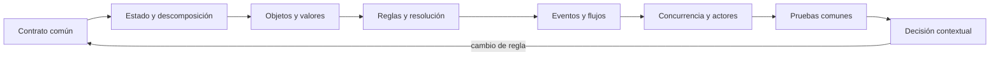

# Parte 06 — Paradigmas de programación

Brújula ya ejecuta una regla, pero una única implementación puede ocultar decisiones accidentales del lenguaje. Prisma toma el mismo dominio —seleccionar la siguiente prueba autorizada— y lo expresa con modelos distintos. La comparación no premia el código más corto: exige equivalencia observable, límites explícitos y una explicación de qué cambio futuro facilita o dificulta cada representación.

## Pregunta rectora

> ¿Qué paradigma hace visibles el estado, las reglas y los efectos de una decisión sin deformar el problema?

## Antes del recorrido clase por clase

Esta parte no presenta paradigmas como etiquetas ni como una competencia de sintaxis. Cada clase vuelve sobre **Prisma**, mantiene un contrato común y cambia deliberadamente el modelo de estado, control, composición o tiempo. Así puede distinguirse una diferencia semántica de una diferencia accidental del lenguaje.

El diagrama muestra la progresión del razonamiento, no una arquitectura recomendada. Las pruebas comunes impiden declarar equivalencia por parecido visual; el retorno obliga a revalidar cuando cambia el contrato.

## Resultados acumulativos

Podrás reconocer dónde vive el estado, quién controla la secuencia, cómo se componen transformaciones y qué forma adopta un fallo en modelos imperativos, procedurales, orientados a objetos, funcionales, declarativos, lógicos, orientados a eventos, reactivos y de actores.

Al finalizar podrás justificar una combinación, señalar adaptadores y pérdidas, y rechazar una elección que no se sostenga ante casos límite o costo operativo.

## Prerrequisitos enlazados

- [Parte 4 — Pensamiento computacional](../../classes/part-04-pensamiento-computacional-y-resolucion-de-problemas/): modelado, invariantes, corrección y complejidad.
- [Parte 5 — Fundamentos de programación](../../classes/part-05-fundamentos-de-programacion/): valores, control, funciones, errores, pruebas y Brújula.
- Python 3.11+, Git y terminal; runtimes adicionales son opcionales y deben declararse.

## Bloques y progresión

1. **Estado y descomposición:** las clases 73–76 localizan mutación, contratos, identidad y composición.
2. **Reglas y resolución:** las clases 77–78 separan descripción, reglas, unificación y búsqueda.
3. **Tiempo, eventos y concurrencia:** las clases 79–81 introducen orden temporal, presión, cancelación y aislamiento.
4. **Comparación y transferencia:** las clases 82–84 comparan, ensayan y justifican una decisión contextual.

## Recorrido clase por clase

| Clase | Capacidad que construye | Pregunta que resuelve | Evidencia acumulativa |
|---|---|---|---|
| [SE-073](../../classes/part-06-paradigmas-de-programacion/se-073-programacion-imperativa-y-estado-mutable/) | Programación imperativa y estado mutable | ¿Cómo cambia una decisión cuando el estado se modifica paso a paso? | Evidencia reproducible para Prisma |
| [SE-074](../../classes/part-06-paradigmas-de-programacion/se-074-programacion-procedural-y-descomposicion-funcional/) | Programación procedural y descomposición funcional | ¿Dónde cortar un procedimiento para que cada paso tenga un contrato comprobable? | Evidencia reproducible para Prisma |
| [SE-075](../../classes/part-06-paradigmas-de-programacion/se-075-orientacion-a-objetos-mensajes-y-encapsulacion/) | Orientación a objetos, mensajes y encapsulación | ¿Cuándo una identidad con comportamiento protege mejor una invariante que un conjunto de funciones? | Evidencia reproducible para Prisma |
| [SE-076](../../classes/part-06-paradigmas-de-programacion/se-076-programacion-funcional-composicion-e-inmutabilidad/) | Programación funcional, composición e inmutabilidad | ¿Qué se gana al expresar la decisión como transformación de valores sin efectos ocultos? | Evidencia reproducible para Prisma |
| [SE-077](../../classes/part-06-paradigmas-de-programacion/se-077-programacion-declarativa-y-basada-en-reglas/) | Programación declarativa y basada en reglas | ¿Qué significa declarar una relación sin fijar todos los pasos para obtenerla? | Evidencia reproducible para Prisma |
| [SE-078](../../classes/part-06-paradigmas-de-programacion/se-078-programacion-logica-y-resolucion/) | Programación lógica y resolución | ¿Cómo produce respuestas un motor lógico a partir de relaciones, variables y búsqueda? | Evidencia reproducible para Prisma |
| [SE-079](../../classes/part-06-paradigmas-de-programacion/se-079-programacion-orientada-a-eventos/) | Programación orientada a eventos | ¿Cómo conservar causalidad y control cuando el flujo lo inicia un evento externo? | Evidencia reproducible para Prisma |
| [SE-080](../../classes/part-06-paradigmas-de-programacion/se-080-programacion-reactiva-y-flujos/) | Programación reactiva y flujos | ¿Cómo modelar un flujo que produce cero, uno o muchos valores y también termina o falla? | Evidencia reproducible para Prisma |
| [SE-081](../../classes/part-06-paradigmas-de-programacion/se-081-programacion-concurrente-y-actores/) | Programación concurrente y actores | ¿Qué garantías ofrece aislar estado por actor y comunicarse mediante mensajes? | Evidencia reproducible para Prisma |
| [SE-082](../../classes/part-06-paradigmas-de-programacion/se-082-seleccion-y-combinacion-responsable-de-paradigmas/) | Selección y combinación responsable de paradigmas | ¿Cómo elegir y combinar paradigmas a partir de fuerzas del problema y evidencia? | Evidencia reproducible para Prisma |
| [SE-083](../../classes/part-06-paradigmas-de-programacion/se-083-taller-una-regla-de-negocio-en-cinco-paradigmas/) | Taller: una regla de negocio en cinco paradigmas | ¿Qué diferencias reales aparecen al implementar la misma regla en cinco modelos? | Evidencia reproducible para Prisma |
| [SE-084](../../classes/part-06-paradigmas-de-programacion/se-084-proyecto-comparacion-semantica-con-pruebas-comunes/) | Proyecto: comparación semántica con pruebas comunes | ¿Cómo sostener una comparación semántica reproducible sin declarar un ganador universal? | Evidencia reproducible para Prisma |

## Proyecto integrador

El proyecto **SE-084** entrega un corpus versionado, al menos dos implementaciones ejecutables, pruebas contractuales compartidas, propiedades, trazas comparables y un informe de decisión para dos cargas distintas. No existe un ganador universal: la recomendación debe vincular fuerzas, evidencia, consecuencias y condición de reversión.

## Criterios de salida

- las doce clases explican todos sus temas mediante mecanismos, ejemplos y límites;
- cada implementación conserva autorización, explicación y errores del contrato;
- el corpus cubre normal, límite, inválido, empate, repetición y secuencia;
- las métricas separan lenguaje, runtime, paradigma y entorno;
- otra persona reproduce comandos y resultados desde checkout limpio;
- el informe declara lo observado, lo inferido y lo no ejecutado.

## Preguntas de control por bloque

- ¿Dónde vive el estado y quién puede cambiarlo?
- ¿Qué estrategia ejecuta una descripción declarativa o una consulta lógica?
- ¿Qué ocurre cuando productor, consumidor y cancelación avanzan a ritmos distintos?
- ¿Qué evidencia cambiaría la elección de paradigma?

## Fuentes de la parte

- [Python Language Reference](https://docs.python.org/3/reference/) — semántica de sentencias, funciones, clases, generadores y corrutinas; autoridad: Python Software Foundation.
- [The Rust Programming Language](https://doc.rust-lang.org/stable/book/) — ownership, enums, traits, errores y concurrencia sin carreras de datos; autoridad: Rust project.
- [SWI-Prolog Reference Manual](https://www.swi-prolog.org/pldoc/man?section=intro) — hechos, reglas, unificación, búsqueda y límites operacionales; autoridad: SWI-Prolog project.
- [ReactiveX Observable Contract](https://reactivex.io/documentation/contract.html) — notificaciones, terminación, errores y control de flujo observable; autoridad: ReactiveX project.
- [Erlang System Documentation: Processes](https://www.erlang.org/doc/system/ref_man_processes.html) — procesos, buzones, envío de mensajes, enlaces y monitores; autoridad: Erlang/OTP project.
- [SWEBOK Guide v4.0a](https://www.computer.org/education/bodies-of-knowledge/software-engineering) — construcción, diseño y fundamentos profesionales; autoridad: IEEE Computer Society.

Las fuentes se vinculan también dentro de cada clase. Definen semántica y mecanismos; la adecuación de Prisma se demuestra con el caso, las pruebas y la comparación.
