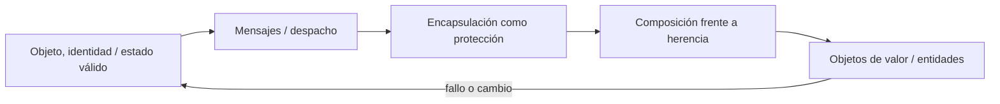

# SE-075 — Orientación a objetos, mensajes y encapsulación

[← SE-074 — Programación procedural y descomposición funcional](../../classes/part-06-paradigmas-de-programacion/se-074-programacion-procedural-y-descomposicion-funcional/README.md) · [↑ Parte 06](../../classes/part-06-paradigmas-de-programacion/README.md) · [📚 Índice completo](../../classes/README.md) · [🌐 Portal](../../site/classes/SE-075.html) · [SE-076 — Programación funcional, composición e inmutabilidad →](../../classes/part-06-paradigmas-de-programacion/se-076-programacion-funcional-composicion-e-inmutabilidad/README.md)


## Punto profesional y fundamento pedagógico

**Punto profesional.** La clase existe para diseñar objetos por responsabilidades, mensajes e invariantes encapsuladas.

**Por qué aparece aquí.** Se sitúa después de **Programación procedural y descomposición funcional** y antes de **Programación funcional, composición e inmutabilidad**: convierte el conocimiento anterior en una decisión observable que la clase siguiente podrá reutilizar. La continuidad se comprueba en el artefacto, no por compartir vocabulario.

**Error conceptual que debe corregir.** Usar clases como contenedores de datos o herencia como reutilización automática.

**Secuencia de aprendizaje.** Antes de leer la solución, el estudiante predice el resultado del caso normal y del error conceptual anterior. Luego explica un caso resuelto paso a paso, construye un contraejemplo que cambie la decisión y, sin consultar el texto, reconstruye el mecanismo y lo aplica a una entrada nueva. La secuencia usa predicción, explicación propia, contraste y recuperación. [ICAP](https://icap.education.asu.edu/research) distingue participación de construcción de conocimiento; [How People Learn II](https://nap.nationalacademies.org/catalog/24783/how-people-learn-ii-learners-contexts-and-cultures) exige conectar conocimiento previo, contexto y transferencia; la [práctica de recuperación](https://pubmed.ncbi.nlm.nih.gov/16507066/) respalda producir de nuevo la explicación tras una demora; y [Education for Life and Work](https://nap.nationalacademies.org/resource/13398/dbasse_084153.pdf) exige devolución que explique la causa del error.

**Evidencia de aprendizaje.** Object-protocol.md con mensajes, estados válidos y sustitución fallida. Debe contener predicción previa, observación, explicación causal, contraejemplo, criterio de aceptación y una nota de qué dato haría cambiar la conclusión.

**Límite de la conclusión.** Encapsular no vuelve correcto ni concurrente al objeto.

### Trazabilidad fuente → afirmación

| Fuente primaria u oficial | Afirmación que respalda | Lo que no prueba |
|---|---|---|
| [Python Language Reference](https://docs.python.org/3/reference/) | Semántica de sentencias, funciones, clases, generadores y corrutinas; autoridad: Python Software Foundation | No demuestra por sí sola que el artefacto del estudiante sea correcto. |
| [The Rust Programming Language](https://doc.rust-lang.org/stable/book/) | Ownership, enums, traits, errores y concurrencia sin carreras de datos; autoridad: Rust project | No demuestra por sí sola que el artefacto del estudiante sea correcto. |
| [SWEBOK Guide v4.0a](https://www.computer.org/education/bodies-of-knowledge/software-engineering) | Construcción, diseño y fundamentos profesionales; autoridad: IEEE Computer Society | No demuestra por sí sola que el artefacto del estudiante sea correcto. |

## Antes de empezar

Esta clase continúa el **motor de reglas comparado de la Parte 06**. Recupera la evidencia de la clase anterior, añade una decisión propia de **Orientación a objetos, mensajes y encapsulación** y deja un artefacto que la clase siguiente deberá consumir. La pregunta activa es: **¿Cuándo una identidad con comportamiento protege mejor una invariante que un conjunto de funciones?**

## Prerrequisitos

- Haber completado la clase anterior o reconstruir su contrato y evidencia.
- Python 3.11 o posterior, terminal, editor y Git; un segundo runtime es opcional y debe declararse.
- Trabajar con fixtures sintéticos: ninguna observación necesita datos de una persona o sistema real.

## Problema auténtico

El motor de reglas comparado pasa diccionarios entre funciones y cualquier consumidor puede crear combinaciones imposibles: una evaluación cerrada acepta nuevas observaciones o una decisión autorizada carece de evidencia.

## Objetivos observables

Al terminar podrás explicar los cinco mecanismos de esta clase, predecir su comportamiento antes de ejecutar, construir un caso normal y uno límite, diagnosticar el fallo controlado, comparar una alternativa y entregar evidencia que otra persona pueda reproducir.

## Mapa conceptual



El mapa se lee como una cadena de razonamiento, no como fases obligatorias del runtime. La flecha de retorno indica que un fallo o cambio de requisito obliga a revisar el modelo inicial; no autoriza a parchear solo la última salida.

## Temas y por qué importan

| Tema | Por qué cambia una decisión profesional | Evidencia mínima |
|---|---|---|
| Objeto, identidad y estado válido | Un objeto reúne identidad, estado y operaciones permitidas durante un ciclo de vida. | Predicción, traza causal y contraejemplo de **Objeto, identidad y estado válido** en `object-protocol.md` |
| Mensajes y despacho | Invocar un método envía una solicitud a un receptor que decide cómo responder según su tipo y estado. | Predicción, traza causal y contraejemplo de **Mensajes y despacho** en `object-protocol.md` |
| Encapsulación como protección | Encapsular no significa esconder campos con getters equivalentes. | Predicción, traza causal y contraejemplo de **Encapsulación como protección** en `object-protocol.md` |
| Composición frente a herencia | La herencia reutiliza un contrato y comportamiento bajo relación de sustitución; la composición ensambla colaboradores. | Predicción, traza causal y contraejemplo de **Composición frente a herencia** en `object-protocol.md` |
| Objetos de valor y entidades | Una duración o resultado puede compararse por valor y ser inmutable; una sesión conserva identidad aunque cambien sus atributos. | Predicción, traza causal y contraejemplo de **Objetos de valor y entidades** en `object-protocol.md` |
## Conceptos y decisiones

### 1. Objeto, identidad y estado válido

Un objeto reúne identidad, estado y operaciones permitidas durante un ciclo de vida. La identidad importa cuando dos instancias con valores iguales representan evaluaciones diferentes. Modelar todo como objeto añade ceremonia si solo existe una transformación de valores sin historia.

### 2. Mensajes y despacho

Invocar un método envía una solicitud a un receptor que decide cómo responder según su tipo y estado. El despacho polimórfico permite sustituir comportamientos detrás de un contrato. No elimina condicionales: los distribuye, y puede volver difícil seguir el flujo si las jerarquías son opacas.

### 3. Encapsulación como protección

Encapsular no significa esconder campos con getters equivalentes. Significa impedir transiciones inválidas y exponer operaciones del dominio como `record_observation` o `close`. Si el consumidor puede reconstruir libremente el estado interno, la invariante sigue fuera del objeto.

### 4. Composición frente a herencia

La herencia reutiliza un contrato y comportamiento bajo relación de sustitución; la composición ensambla colaboradores. Heredar solo para compartir código crea acoplamiento a detalles y jerarquías frágiles. El motor de reglas comparado compone políticas y repositorios, y reserva herencia para tipos realmente sustituibles.

### 5. Objetos de valor y entidades

Una duración o resultado puede compararse por valor y ser inmutable; una sesión conserva identidad aunque cambien sus atributos. Confundirlos produce aliasing, claves inestables o igualdad incorrecta. La distinción se decide por el dominio, no por si se usa `class`.

## Definiciones de trabajo

- **objeto, identidad y estado válido:** un objeto reúne identidad, estado y operaciones permitidas durante un ciclo de vida.
- **mensajes y despacho:** invocar un método envía una solicitud a un receptor que decide cómo responder según su tipo y estado.
- **encapsulación como protección:** encapsular no significa esconder campos con getters equivalentes.
- **composición frente a herencia:** la herencia reutiliza un contrato y comportamiento bajo relación de sustitución; la composición ensambla colaboradores.
- **objetos de valor y entidades:** una duración o resultado puede compararse por valor y ser inmutable; una sesión conserva identidad aunque cambien sus atributos.

Las definiciones son operativas para el motor de reglas comparado. No convierten términos con historia más amplia en sinónimos y deben contrastarse con la documentación primaria enlazada al final.

## Ejemplo mínimo

```python
class Evaluation:
    def __init__(self):
        self._closed = False
        self._evidence = []

    def record(self, item):
        if self._closed:
            raise RuntimeError("evaluation is closed")
        self._evidence.append(item)

    def close(self):
        self._closed = True
```

Antes de ejecutar, predice estado, resultado y error. Después registra versión, comando y salida. Si el fragmento es pseudocódigo o pertenece a otro lenguaje, etiquétalo como tal y no afirmes que fue ejecutado.

## Ejemplo profesional

En el motor de reglas comparado, una recomendación contiene acción, evidencia usada, versión de política y explicación. La implementación de esta clase debe conservar ese contrato aunque cambie la forma interna. El caso profesional no pregunta únicamente si devuelve una cadena: pregunta quién puede producirla, qué estado observa, cómo falla y qué rastro permite disputar una decisión incorrecta.

Compara el caso normal con autorización falsa, evidencia incompleta, empate y repetición. Un mecanismo es apropiado cuando esas diferencias quedan visibles y localizadas; es peligroso cuando dependen de orden accidental, estado oculto o una convención que el consumidor no puede conocer.

## Práctica guiada

1. Copia el contrato de entrada y salida antes de escribir implementación.
2. Predice el caso normal y un límite; identifica la invariante que no puede romperse.
3. Implementa la versión mínima sin I/O dentro del núcleo.
4. Ejecuta el caso y conserva comando, versión y salida bajo `evidence/`.
5. Introduce el fallo controlado, reduce la reproducción y formula dos hipótesis rivales.
6. Corrige la causa, añade regresión y ejecuta el conjunto completo.
7. Compara con otro paradigma o lenguaje indicando qué semántica se preserva.

## Ejercicios

1. **Lectura:** dibuja una traza de cinco pasos y marca dónde cambia estado o control.
2. **Construcción:** añade una regla del motor de reglas comparado sin alterar los fixtures anteriores.
3. **Frontera:** cubre vacío, empate, no autorizado e inválido con resultados distintos.
4. **Contraste:** reescribe una pieza con otro modelo y explica una mejora y una pérdida.

## Reto verificable

Entrega implementación, fixtures, pruebas y un informe corto. Se aprueba si otra persona ejecuta desde checkout limpio, obtiene los mismos resultados y puede relacionar cada rama o transformación con una regla del dominio. No se aprueba por cantidad de archivos ni por usar la sintaxis característica del paradigma.

## Caso conductor

El motor de reglas comparado recibe una observación autorizada, evalúa reglas y devuelve una recomendación explicable. En esta clase, ejecuta el caso `latency_ms=900`, el límite `latency_ms=800`, el contraejemplo `authorized=false` y una entrada incompleta. Cambia después una sola regla y revisa qué archivos, pruebas y trazas debieron modificarse. Esa superficie de cambio alimenta la comparación final de la parte.

## Preguntas frecuentes

### ¿Un paradigma determina toda la arquitectura?

No. Puede organizar un núcleo o una frontera sin dominar el sistema completo. Combinar modelos es válido si los adaptadores preservan identidad, orden, errores y evidencia.

### ¿Menos líneas significan una solución mejor?

No. La brevedad puede quitar duplicación o esconder decisiones. Se evalúan semántica, diagnóstico, costo de cambio y adecuación a la carga.

### ¿Debo instalar todos los lenguajes mencionados?

No. Python basta para la práctica base. Si usas Prolog, Rust o Erlang, registra versión y comandos; si solo analizas notación, decláralo como análisis no ejecutado.

## Fallo controlado y diagnóstico

Expón `_evidence` mediante una propiedad que devuelve la lista original. Un consumidor la modifica después de cerrar. Devuelve una tupla o copia controlada y añade una prueba que intente romper la invariante desde fuera.

Registra síntoma, entrada mínima, hipótesis, observación que descarta cada hipótesis, causa, corrección y prueba de regresión. No cambies simultáneamente implementación, fixture y expectativa.

## Errores comunes y cómo corregirlos

| Síntoma | Causa probable | Corrección |
|---|---|---|
| dos pruebas aisladas pasan y juntas fallan | estado o dependencia compartida | aislar propietario y reiniciar fixture |
| implementación corta pero opaca | semántica delegada sin contrato | documentar transición, error y orden |
| modelos “equivalentes” divergen | fixtures normalizan diferencias reales | comparar contrato antes de presentación |
| reintento duplica resultado | efecto sin identidad ni idempotencia | correlacionar y probar repetición |
| diagrama y código cuentan historias distintas | visual ornamental o desactualizado | trazar el mismo caso en ambos |

## Entorno y archivos clave

```text
work/SE-075/
├── README.md
├── rule_engine/
│   ├── domain.py
│   └── se_075.py
├── fixtures/cases.json
├── tests/test_se_075.py
└── evidence/diagnosis.md
```

El `README` declara plataforma, runtimes, comandos, limpieza y límites. Evita dependencias externas cuando la biblioteca estándar permita observar el mecanismo; si agregas una, fija procedencia y versión.

## Seguridad, ética y accesibilidad

- la autorización forma parte del dominio y no se infiere por ausencia de rechazo;
- no uses `eval`, reglas descargadas ni serialización insegura;
- limita colas, recursión, tamaño de entrada y tiempo de evaluación;
- redacta trazas y conserva una explicación textual además de color o animación;
- una recomendación automatizada debe poder revisarse, impugnarse y corregirse;
- respeta licencias de ejemplos y atribuye adaptaciones.

## Transferencia

Traslada un fixture al segundo modelo o lenguaje. Compara representación de ausencia, error, mutabilidad, orden y cancelación. La transferencia está lograda cuando el contrato se conserva y las diferencias están explicadas, no cuando la sintaxis se parece.

## Evaluación y evidencia

| Criterio | Evidencia para aprobar |
|---|---|
| comprensión | explicación causal de los cinco mecanismos |
| corrección | normal, límite, inválido y contraejemplo |
| diseño | estado, efectos y contrato localizables |
| diagnóstico | reproducción mínima y regresión |
| transferencia | comparación semántica, no estética |
| reproducibilidad | versiones, comandos, salida y límites |


## Fuentes


- [Python Language Reference](https://docs.python.org/3/reference/) — Semántica de sentencias, funciones, clases, generadores y corrutinas; autoridad: Python Software Foundation.
- [The Rust Programming Language](https://doc.rust-lang.org/stable/book/) — Ownership, enums, traits, errores y concurrencia sin carreras de datos; autoridad: Rust project.
- [SWI-Prolog Reference Manual](https://www.swi-prolog.org/pldoc/man?section=intro) — Hechos, reglas, unificación, búsqueda y límites operacionales; autoridad: SWI-Prolog project.
- [ReactiveX Observable Contract](https://reactivex.io/documentation/contract.html) — Notificaciones, terminación, errores y control de flujo observable; autoridad: ReactiveX project.
- [Erlang System Documentation: Processes](https://www.erlang.org/doc/system/ref_man_processes.html) — Procesos, buzones, envío de mensajes, enlaces y monitores; autoridad: Erlang/OTP project.
- [SWEBOK Guide v4.0a](https://www.computer.org/education/bodies-of-knowledge/software-engineering) — Construcción, diseño y fundamentos profesionales; autoridad: IEEE Computer Society.

Cada fuente respalda el mecanismo indicado; ninguna demuestra que la implementación del motor de reglas comparado sea correcta. Esa afirmación depende de fixtures, pruebas, trazas y revisión reproducible.

## Límites y siguiente paso

Los objetos reducen estados inválidos solo si sus fronteras son reales. La siguiente clase elimina identidad innecesaria y razona mediante valores y composición funcional.

## Glosario

- **objeto, identidad y estado válido:** un objeto reúne identidad, estado y operaciones permitidas durante un ciclo de vida.
- **mensajes y despacho:** invocar un método envía una solicitud a un receptor que decide cómo responder según su tipo y estado.
- **encapsulación como protección:** encapsular no significa esconder campos con getters equivalentes.
- **composición frente a herencia:** la herencia reutiliza un contrato y comportamiento bajo relación de sustitución; la composición ensambla colaboradores.
- **objetos de valor y entidades:** una duración o resultado puede compararse por valor y ser inmutable; una sesión conserva identidad aunque cambien sus atributos.

---

[← SE-074 — Programación procedural y descomposición funcional](../../classes/part-06-paradigmas-de-programacion/se-074-programacion-procedural-y-descomposicion-funcional/README.md) · [↑ Parte 06](../../classes/part-06-paradigmas-de-programacion/README.md) · [📚 Índice completo](../../classes/README.md) · [🌐 Portal](../../site/classes/SE-075.html) · [SE-076 — Programación funcional, composición e inmutabilidad →](../../classes/part-06-paradigmas-de-programacion/se-076-programacion-funcional-composicion-e-inmutabilidad/README.md)
