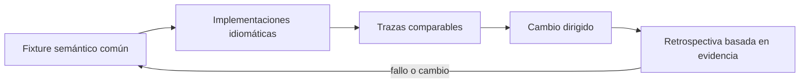

# SE-083 — Taller: una regla de negocio en cinco paradigmas

[← SE-082 — Selección y combinación responsable de paradigmas](../../classes/part-06-paradigmas-de-programacion/se-082-seleccion-y-combinacion-responsable-de-paradigmas/README.md) · [↑ Parte 06](../../classes/part-06-paradigmas-de-programacion/README.md) · [📚 Índice completo](../../classes/README.md) · [🌐 Portal](../../site/classes/SE-083.html) · [SE-084 — Proyecto: comparación semántica con pruebas comunes →](../../classes/part-06-paradigmas-de-programacion/se-084-proyecto-comparacion-semantica-con-pruebas-comunes/README.md)

> Estado: **GUIDED** · Clase desarrollada y revisada cualitativamente.

## Antes de empezar

Esta clase continúa **Prisma**, el caso conductor de la Parte 06. Recupera la evidencia de la clase anterior, añade una decisión propia de **Taller: una regla de negocio en cinco paradigmas** y deja un artefacto que la clase siguiente deberá consumir. La pregunta activa es: **¿Qué diferencias reales aparecen al implementar la misma regla en cinco modelos?**

## Prerrequisitos

- Haber completado la clase anterior o reconstruir su contrato y evidencia.
- Python 3.11 o posterior, terminal, editor y Git; un segundo runtime es opcional y debe declararse.
- Trabajar con fixtures sintéticos: ninguna observación necesita datos de una persona o sistema real.

## Problema auténtico

El equipo discute paradigmas con ejemplos distintos. Prisma fija un solo contrato: dada evidencia autorizada, devolver acción, explicación o error; luego compara imperativo, objetos, funcional, reglas y eventos.

## Objetivos observables

Al terminar podrás explicar los cinco mecanismos de esta clase, predecir su comportamiento antes de ejecutar, construir un caso normal y uno límite, diagnosticar el fallo controlado, comparar una alternativa y entregar evidencia que otra persona pueda reproducir.

## Mapa conceptual



El mapa se lee como una cadena de razonamiento, no como fases obligatorias del runtime. La flecha de retorno indica que un fallo o cambio de requisito obliga a revisar el modelo inicial; no autoriza a parchear solo la última salida.

## Temas y por qué importan

| Tema | Por qué cambia una decisión profesional | Evidencia mínima |
|---|---|---|
| Fixture semántico común | El taller comienza por entradas y salidas canónicas, no por código. | Evidencia o contraejemplo registrado |
| Implementaciones idiomáticas | Equivalencia no exige traducir línea por línea. | Evidencia o contraejemplo registrado |
| Trazas comparables | Se registra entrada normalizada, reglas consideradas, decisión, error y efectos. | Evidencia o contraejemplo registrado |
| Cambio dirigido | Después de lograr equivalencia se introduce una regla nueva y se observa el diff. | Evidencia o contraejemplo registrado |
| Retrospectiva basada en evidencia | La conclusión relaciona claridad, pruebas, diagnóstico y costo de cambio con artefactos concretos. | Evidencia o contraejemplo registrado |

## Conceptos y decisiones

### 1. Fixture semántico común

El taller comienza por entradas y salidas canónicas, no por código. Cada implementación debe cubrir autorización falsa, evidencia vacía, empate y dato inválido. Si un modelo no puede representar un caso, esa imposibilidad es un hallazgo y no se elimina del fixture.

### 2. Implementaciones idiomáticas

Equivalencia no exige traducir línea por línea. Cada versión usa el mecanismo propio: transición explícita, objeto que protege invariantes, composición de valores, tabla de reglas o evento correlacionado. Aun así, no puede inventar una política distinta para lucir mejor.

### 3. Trazas comparables

Se registra entrada normalizada, reglas consideradas, decisión, error y efectos. La traza debe ser estable y no revelar detalles internos irrelevantes. Comparar solo el resultado final oculta por qué dos programas coinciden por accidente.

### 4. Cambio dirigido

Después de lograr equivalencia se introduce una regla nueva y se observa el diff. El objetivo es medir superficie de cambio, no velocidad de tecleo. Una solución que exige tocar cinco lugares revela dispersión aunque conserve el resultado.

### 5. Retrospectiva basada en evidencia

La conclusión relaciona claridad, pruebas, diagnóstico y costo de cambio con artefactos concretos. `Me gustó más` puede registrarse como preferencia, no como evidencia. Las diferencias del lenguaje y librerías quedan separadas de las del paradigma.

## Definiciones de trabajo

- **fixture semántico común:** el taller comienza por entradas y salidas canónicas, no por código.
- **implementaciones idiomáticas:** equivalencia no exige traducir línea por línea.
- **trazas comparables:** se registra entrada normalizada, reglas consideradas, decisión, error y efectos.
- **cambio dirigido:** después de lograr equivalencia se introduce una regla nueva y se observa el diff.
- **retrospectiva basada en evidencia:** la conclusión relaciona claridad, pruebas, diagnóstico y costo de cambio con artefactos concretos.

Las definiciones son operativas para Prisma. No convierten términos con historia más amplia en sinónimos y deben contrastarse con la documentación primaria enlazada al final.

## Ejemplo mínimo

```python
cases = [
    ({"authorized": True, "latency_ms": 900}, {"action": "inspect-transport"}),
    ({"authorized": False, "latency_ms": 900}, {"error": "not-authorized"}),
    ({"authorized": True}, {"error": "insufficient-evidence"}),
]
```

Antes de ejecutar, predice estado, resultado y error. Después registra versión, comando y salida. Si el fragmento es pseudocódigo o pertenece a otro lenguaje, etiquétalo como tal y no afirmes que fue ejecutado.

## Ejemplo profesional

En Prisma, una recomendación contiene acción, evidencia usada, versión de política y explicación. La implementación de esta clase debe conservar ese contrato aunque cambie la forma interna. El caso profesional no pregunta únicamente si devuelve una cadena: pregunta quién puede producirla, qué estado observa, cómo falla y qué rastro permite disputar una decisión incorrecta.

Compara el caso normal con autorización falsa, evidencia incompleta, empate y repetición. Un mecanismo es apropiado cuando esas diferencias quedan visibles y localizadas; es peligroso cuando dependen de orden accidental, estado oculto o una convención que el consumidor no puede conocer.

## Práctica guiada

1. Copia el contrato de entrada y salida antes de escribir implementación.
2. Predice el caso normal y un límite; identifica la invariante que no puede romperse.
3. Implementa la versión mínima sin I/O dentro del núcleo.
4. Ejecuta el caso y conserva comando, versión y salida bajo `evidence/`.
5. Introduce el fallo controlado, reduce la reproducción y formula dos hipótesis rivales.
6. Corrige la causa, añade regresión y ejecuta el conjunto completo.
7. Compara con otro paradigma o lenguaje indicando qué semántica se preserva.

## Ejercicios

1. **Lectura:** dibuja una traza de cinco pasos y marca dónde cambia estado o control.
2. **Construcción:** añade una regla de Prisma sin alterar los fixtures anteriores.
3. **Frontera:** cubre vacío, empate, no autorizado e inválido con resultados distintos.
4. **Contraste:** reescribe una pieza con otro modelo y explica una mejora y una pérdida.

## Reto verificable

Entrega implementación, fixtures, pruebas y un informe corto. Se aprueba si otra persona ejecuta desde checkout limpio, obtiene los mismos resultados y puede relacionar cada rama o transformación con una regla del dominio. No se aprueba por cantidad de archivos ni por usar la sintaxis característica del paradigma.

## Caso conductor

Prisma recibe una observación autorizada, evalúa reglas y devuelve una recomendación explicable. En esta clase, ejecuta el caso `latency_ms=900`, el límite `latency_ms=800`, el contraejemplo `authorized=false` y una entrada incompleta. Cambia después una sola regla y revisa qué archivos, pruebas y trazas debieron modificarse. Esa superficie de cambio alimenta la comparación final de la parte.

## Preguntas frecuentes

### ¿Un paradigma determina toda la arquitectura?

No. Puede organizar un núcleo o una frontera sin dominar el sistema completo. Combinar modelos es válido si los adaptadores preservan identidad, orden, errores y evidencia.

### ¿Menos líneas significan una solución mejor?

No. La brevedad puede quitar duplicación o esconder decisiones. Se evalúan semántica, diagnóstico, costo de cambio y adecuación a la carga.

### ¿Debo instalar todos los lenguajes mencionados?

No. Python basta para la práctica base. Si usas Prolog, Rust o Erlang, registra versión y comandos; si solo analizas notación, decláralo como análisis no ejecutado.

## Fallo controlado y diagnóstico

Permite que la versión basada en eventos responda antes de validar autorización. El fixture de resultado puede pasar por orden favorable; añade traza causal y ejecuta autorización tardía para revelar el defecto.

Registra síntoma, entrada mínima, hipótesis, observación que descarta cada hipótesis, causa, corrección y prueba de regresión. No cambies simultáneamente implementación, fixture y expectativa.

## Errores comunes y cómo corregirlos

| Síntoma | Causa probable | Corrección |
|---|---|---|
| dos pruebas aisladas pasan y juntas fallan | estado o dependencia compartida | aislar propietario y reiniciar fixture |
| implementación corta pero opaca | semántica delegada sin contrato | documentar transición, error y orden |
| modelos “equivalentes” divergen | fixtures normalizan diferencias reales | comparar contrato antes de presentación |
| reintento duplica resultado | efecto sin identidad ni idempotencia | correlacionar y probar repetición |
| diagrama y código cuentan historias distintas | visual ornamental o desactualizado | trazar el mismo caso en ambos |

## Entorno y archivos clave

```text
work/SE-083/
├── README.md
├── prisma/
│   ├── domain.py
│   └── se_083.py
├── fixtures/cases.json
├── tests/test_se_083.py
└── evidence/diagnosis.md
```

El `README` declara plataforma, runtimes, comandos, limpieza y límites. Evita dependencias externas cuando la biblioteca estándar permita observar el mecanismo; si agregas una, fija procedencia y versión.

## Seguridad, ética y accesibilidad

- la autorización forma parte del dominio y no se infiere por ausencia de rechazo;
- no uses `eval`, reglas descargadas ni serialización insegura;
- limita colas, recursión, tamaño de entrada y tiempo de evaluación;
- redacta trazas y conserva una explicación textual además de color o animación;
- una recomendación automatizada debe poder revisarse, impugnarse y corregirse;
- respeta licencias de ejemplos y atribuye adaptaciones.

## Transferencia

Traslada un fixture al segundo modelo o lenguaje. Compara representación de ausencia, error, mutabilidad, orden y cancelación. La transferencia está lograda cuando el contrato se conserva y las diferencias están explicadas, no cuando la sintaxis se parece.

## Evaluación y evidencia

| Criterio | Evidencia para aprobar |
|---|---|
| comprensión | explicación causal de los cinco mecanismos |
| corrección | normal, límite, inválido y contraejemplo |
| diseño | estado, efectos y contrato localizables |
| diagnóstico | reproducción mínima y regresión |
| transferencia | comparación semántica, no estética |
| reproducibilidad | versiones, comandos, salida y límites |

Los snippets no elevan la clase a `EXECUTABLE` o `TESTED`: esos estados requieren artefactos versionados y ejecuciones verificadas fuera de la guía.

## Fuentes

- [Python Language Reference](https://docs.python.org/3/reference/) — Semántica de sentencias, funciones, clases, generadores y corrutinas; autoridad: Python Software Foundation.
- [The Rust Programming Language](https://doc.rust-lang.org/stable/book/) — Ownership, enums, traits, errores y concurrencia sin carreras de datos; autoridad: Rust project.
- [SWI-Prolog Reference Manual](https://www.swi-prolog.org/pldoc/man?section=intro) — Hechos, reglas, unificación, búsqueda y límites operacionales; autoridad: SWI-Prolog project.
- [ReactiveX Observable Contract](https://reactivex.io/documentation/contract.html) — Notificaciones, terminación, errores y control de flujo observable; autoridad: ReactiveX project.
- [Erlang System Documentation: Processes](https://www.erlang.org/doc/system/ref_man_processes.html) — Procesos, buzones, envío de mensajes, enlaces y monitores; autoridad: Erlang/OTP project.
- [SWEBOK Guide v4.0a](https://www.computer.org/education/bodies-of-knowledge/software-engineering) — Construcción, diseño y fundamentos profesionales; autoridad: IEEE Computer Society.

Cada fuente respalda el mecanismo indicado; ninguna demuestra que la implementación de Prisma sea correcta. Esa afirmación depende de fixtures, pruebas, trazas y revisión reproducible.

## Límites y siguiente paso

El taller compara un cambio y una carga pequeña; no demuestra mantenibilidad a largo plazo. El proyecto siguiente amplía pruebas, criterios y reporte para una comparación defendible.

## Glosario

- **fixture semántico común:** el taller comienza por entradas y salidas canónicas, no por código.
- **implementaciones idiomáticas:** equivalencia no exige traducir línea por línea.
- **trazas comparables:** se registra entrada normalizada, reglas consideradas, decisión, error y efectos.
- **cambio dirigido:** después de lograr equivalencia se introduce una regla nueva y se observa el diff.
- **retrospectiva basada en evidencia:** la conclusión relaciona claridad, pruebas, diagnóstico y costo de cambio con artefactos concretos.

---

[← SE-082 — Selección y combinación responsable de paradigmas](../../classes/part-06-paradigmas-de-programacion/se-082-seleccion-y-combinacion-responsable-de-paradigmas/README.md) · [↑ Parte 06](../../classes/part-06-paradigmas-de-programacion/README.md) · [📚 Índice completo](../../classes/README.md) · [🌐 Portal](../../site/classes/SE-083.html) · [SE-084 — Proyecto: comparación semántica con pruebas comunes →](../../classes/part-06-paradigmas-de-programacion/se-084-proyecto-comparacion-semantica-con-pruebas-comunes/README.md)
