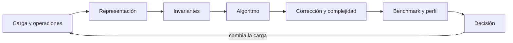

# Parte 07 — Estructuras de datos y algoritmos

Prisma acordó una semántica; Orbe debe ejecutarla sobre miles de casos que llegan, cambian de prioridad, se relacionan y expiran. Esta parte evita el catálogo de estructuras: cada clase modifica el mismo motor de priorización y obliga a explicar operaciones, invariantes, costo teórico, comportamiento empírico y condición en que la elección deja de servir.

## Pregunta rectora

> ¿Qué representación sostiene las operaciones dominantes de una carga real sin perder corrección en los límites?

## Antes del recorrido clase por clase

Esta parte no presenta paradigmas como etiquetas ni como una competencia de sintaxis. Cada clase vuelve sobre **Orbe**, mantiene un contrato común y cambia deliberadamente el modelo de estado, control, composición o tiempo. Así puede distinguirse una diferencia semántica de una diferencia accidental del lenguaje.

El diagrama muestra la progresión del razonamiento, no una arquitectura recomendada. Las pruebas comunes impiden declarar equivalencia por parecido visual; el retorno obliga a revalidar cuando cambia el contrato.

## Resultados acumulativos

Podrás diseñar una representación desde la carga, demostrar invariantes, implementar búsquedas y recorridos, comparar estrategias voraces, dinámicas y de exploración, e interpretar benchmarks y perfiles sin convertir una medición aislada en una afirmación universal.

Al finalizar podrás justificar una combinación, señalar adaptadores y pérdidas, y rechazar una elección que no se sostenga ante casos límite o costo operativo.

## Prerrequisitos enlazados

- [Parte 4 — Pensamiento computacional](../../classes/part-04-pensamiento-computacional-y-resolucion-de-problemas/): modelado, invariantes, corrección y complejidad.
- [Parte 5 — Fundamentos de programación](../../classes/part-05-fundamentos-de-programacion/): valores, control, funciones, errores, pruebas y Brújula.
- Python 3.11+, Git y terminal; runtimes adicionales son opcionales y deben declararse.

## Bloques y progresión

1. **Colecciones fundamentales:** las clases 85–87 contrastan secuencias, colas, prioridades, mapas y conjuntos.
2. **Jerarquías, grafos y búsqueda:** las clases 88–90 modelan jerarquías, grafos, búsqueda, orden y selección.
3. **Estrategias y estructuras avanzadas:** las clases 91–93 estudian decisiones locales, subproblemas, exploración e índices especializados.
4. **Medición y biblioteca:** las clases 94–96 miden, deciden por carga y entregan una biblioteca comparada.

## Recorrido clase por clase

| Clase | Capacidad que construye | Pregunta que resuelve | Evidencia acumulativa |
|---|---|---|---|
| [SE-085](../../classes/part-07-estructuras-de-datos-y-algoritmos/se-085-arreglos-listas-y-secuencias/) | Arreglos, listas y secuencias | ¿Qué cambia al elegir almacenamiento contiguo, secuencia dinámica o nodos enlazados? | Evidencia reproducible para Orbe |
| [SE-086](../../classes/part-07-estructuras-de-datos-y-algoritmos/se-086-pilas-colas-deques-y-prioridades/) | Pilas, colas, deques y prioridades | ¿Cómo cambia el comportamiento cuando la estructura impone LIFO, FIFO o prioridad? | Evidencia reproducible para Orbe |
| [SE-087](../../classes/part-07-estructuras-de-datos-y-algoritmos/se-087-tablas-hash-mapas-y-conjuntos/) | Tablas hash, mapas y conjuntos | ¿Qué exige una búsqueda por clave para seguir siendo correcta y predecible? | Evidencia reproducible para Orbe |
| [SE-088](../../classes/part-07-estructuras-de-datos-y-algoritmos/se-088-arboles-tries-y-estructuras-jerarquicas/) | Árboles, tries y estructuras jerárquicas | ¿Qué invariante convierte una jerarquía en una estructura buscable? | Evidencia reproducible para Orbe |
| [SE-089](../../classes/part-07-estructuras-de-datos-y-algoritmos/se-089-grafos-y-recorridos/) | Grafos y recorridos | ¿Cómo explorar relaciones arbitrarias sin perder visitados, distancia ni causa del camino? | Evidencia reproducible para Orbe |
| [SE-090](../../classes/part-07-estructuras-de-datos-y-algoritmos/se-090-busqueda-ordenamiento-y-seleccion/) | Búsqueda, ordenamiento y selección | ¿Qué precondición permite buscar, ordenar o seleccionar con una garantía concreta? | Evidencia reproducible para Orbe |
| [SE-091](../../classes/part-07-estructuras-de-datos-y-algoritmos/se-091-algoritmos-voraces-y-programacion-dinamica/) | Algoritmos voraces y programación dinámica | ¿Cuándo una elección local es segura y cuándo debe conservarse historia de subproblemas? | Evidencia reproducible para Orbe |
| [SE-092](../../classes/part-07-estructuras-de-datos-y-algoritmos/se-092-backtracking-divide-y-venceras/) | Backtracking, divide y vencerás | ¿Cómo explorar alternativas sin confundir búsqueda exhaustiva, poda y descomposición independiente? | Evidencia reproducible para Orbe |
| [SE-093](../../classes/part-07-estructuras-de-datos-y-algoritmos/se-093-indices-probabilisticas-y-estructuras-persistentes/) | Índices, probabilísticas y estructuras persistentes | ¿Qué garantía se intercambia al usar un índice especializado, probabilidad o versiones persistentes? | Evidencia reproducible para Orbe |
| [SE-094](../../classes/part-07-estructuras-de-datos-y-algoritmos/se-094-complejidad-empirica-benchmarks-y-perfiles/) | Complejidad empírica, benchmarks y perfiles | ¿Cómo medir costo sin convertir ruido, calentamiento o una carga irreal en conclusión? | Evidencia reproducible para Orbe |
| [SE-095](../../classes/part-07-estructuras-de-datos-y-algoritmos/se-095-taller-elegir-por-carga-y-no-por-costumbre/) | Taller: elegir por carga y no por costumbre | ¿Cómo elegir una estructura por perfil de operaciones en lugar de preferencia personal? | Evidencia reproducible para Orbe |
| [SE-096](../../classes/part-07-estructuras-de-datos-y-algoritmos/se-096-proyecto-biblioteca-comparada-con-casos-limite/) | Proyecto: biblioteca comparada con casos límite | ¿Cómo entregar una biblioteca comparada cuya corrección y rendimiento puedan discutirse con evidencia? | Evidencia reproducible para Orbe |

## Proyecto integrador

El proyecto **SE-096** entrega un corpus versionado, al menos dos implementaciones ejecutables, pruebas contractuales compartidas, propiedades, trazas comparables y un informe de decisión para dos cargas distintas. No existe un ganador universal: la recomendación debe vincular fuerzas, evidencia, consecuencias y condición de reversión.

## Criterios de salida

- las doce clases explican todos sus temas mediante mecanismos, ejemplos y límites;
- cada implementación conserva autorización, explicación y errores del contrato;
- el corpus cubre normal, límite, inválido, empate, repetición y secuencia;
- las métricas separan lenguaje, runtime, paradigma y entorno;
- otra persona reproduce comandos y resultados desde checkout limpio;
- el informe declara lo observado, lo inferido y lo no ejecutado.

## Preguntas de control por bloque

- ¿Dónde vive el estado y quién puede cambiarlo?
- ¿Qué estrategia ejecuta una descripción declarativa o una consulta lógica?
- ¿Qué ocurre cuando productor, consumidor y cancelación avanzan a ritmos distintos?
- ¿Qué evidencia cambiaría la elección de paradigma?

## Fuentes de la parte

- [MIT 6.006 Introduction to Algorithms](https://ocw.mit.edu/courses/6-006-introduction-to-algorithms-spring-2020/) — estructuras, algoritmos, corrección y análisis de complejidad; autoridad: MIT OpenCourseWare.
- [Python Data Model](https://docs.python.org/3/reference/datamodel.html) — semántica de secuencias, conjuntos, mappings, igualdad y hash; autoridad: Python Software Foundation.
- [Python Standard Library](https://docs.python.org/3/library/index.html) — deque, heapq, bisect, graphlib y contenedores disponibles; autoridad: Python Software Foundation.
- [Python Debugging and Profiling](https://docs.python.org/3/library/debug.html) — timeit, cProfile y tracemalloc con sus límites; autoridad: Python Software Foundation.
- [Mathematics for Computer Science](https://ocw.mit.edu/courses/6-042j-mathematics-for-computer-science-spring-2015/) — inducción, grafos, conteo y razonamiento discreto; autoridad: MIT OpenCourseWare.
- [SWEBOK Guide v4.0a](https://www.computer.org/education/bodies-of-knowledge/software-engineering) — construcción, medición y fundamentos de ingeniería; autoridad: IEEE Computer Society.

Las fuentes se vinculan también dentro de cada clase. Definen semántica y mecanismos; la adecuación de Orbe se demuestra con el caso, las pruebas y la comparación.
