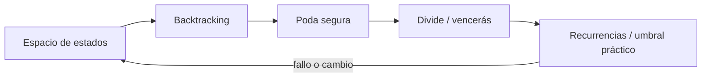

# SE-092 — Backtracking, divide y vencerás

[← SE-091 — Algoritmos voraces y programación dinámica](../../classes/part-07-estructuras-de-datos-y-algoritmos/se-091-algoritmos-voraces-y-programacion-dinamica/README.md) · [↑ Parte 07](../../classes/part-07-estructuras-de-datos-y-algoritmos/README.md) · [📚 Índice completo](../../classes/README.md) · [🌐 Portal](../../site/classes/SE-092.html) · [SE-093 — Índices, probabilísticas y estructuras persistentes →](../../classes/part-07-estructuras-de-datos-y-algoritmos/se-093-indices-probabilisticas-y-estructuras-persistentes/README.md)

> Estado: **GUIDED** · Clase desarrollada y revisada cualitativamente.

## Antes de empezar

Esta clase continúa **Orbe**, el caso conductor de la Parte 07. Recupera la evidencia de la clase anterior, añade una decisión propia de **Backtracking, divide y vencerás** y deja un artefacto que la clase siguiente deberá consumir. La pregunta activa es: **¿Cómo explorar alternativas sin confundir búsqueda exhaustiva, poda y descomposición independiente?**

## Prerrequisitos

- Haber completado la clase anterior o reconstruir su contrato y evidencia.
- Python 3.11 o posterior, terminal, editor y Git; un segundo runtime es opcional y debe declararse.
- Trabajar con fixtures sintéticos: ninguna observación necesita datos de una persona o sistema real.

## Problema auténtico

Orbe debe construir un orden válido de tareas con restricciones. Probar permutaciones encuentra solución, pero crece factorialmente; una poda incorrecta elimina la única ruta válida.

## Objetivos observables

Al terminar podrás explicar los cinco mecanismos de esta clase, predecir su comportamiento antes de ejecutar, construir un caso normal y uno límite, diagnosticar el fallo controlado, comparar una alternativa y entregar evidencia que otra persona pueda reproducir.

## Mapa conceptual



El mapa se lee como una cadena de razonamiento, no como fases obligatorias del runtime. La flecha de retorno indica que un fallo o cambio de requisito obliga a revisar el modelo inicial; no autoriza a parchear solo la última salida.

## Temas y por qué importan

| Tema | Por qué cambia una decisión profesional | Evidencia mínima |
|---|---|---|
| Espacio de estados | Cada nodo representa una decisión parcial y cada arista una elección. | Evidencia o contraejemplo registrado |
| Backtracking | El backtracking elige, avanza, detecta imposibilidad y revierte. | Evidencia o contraejemplo registrado |
| Poda segura | Una poda descarta ramas que no pueden mejorar o satisfacer. | Evidencia o contraejemplo registrado |
| Divide y vencerás | Se divide en subproblemas independientes, se resuelven y combinan. | Evidencia o contraejemplo registrado |
| Recurrencias y umbral práctico | El árbol de recursión explica tiempo y trabajo de combinación. | Evidencia o contraejemplo registrado |

## Conceptos y decisiones

### 1. Espacio de estados

Cada nodo representa una decisión parcial y cada arista una elección. Antes de programar se define estado, acciones, objetivo e invalidez. Si dos rutas producen el mismo estado relevante, pueden memoizarse; si no, fusionarlas pierde historia necesaria.

### 2. Backtracking

El backtracking elige, avanza, detecta imposibilidad y revierte. La restauración debe ser simétrica incluso ante error. Copiar estado simplifica razonamiento pero cuesta; mutar y deshacer exige invariantes y pruebas de que no queda contaminación entre ramas.

### 3. Poda segura

Una poda descarta ramas que no pueden mejorar o satisfacer. Debe derivarse de una cota o restricción necesaria. Una heurística que parece improbable no es poda correcta: puede usarse para ordenar exploración, no para eliminar sin prueba.

### 4. Divide y vencerás

Se divide en subproblemas independientes, se resuelven y combinan. La independencia y el costo de combinar determinan la recurrencia. Llamar divide-and-conquer a cualquier recursión oculta dependencias y resultados duplicados.

### 5. Recurrencias y umbral práctico

El árbol de recursión explica tiempo y trabajo de combinación. En tamaños pequeños, overhead domina y un algoritmo simple puede ganar; implementaciones híbridas usan umbral medido sin cambiar corrección.

## Definiciones de trabajo

- **espacio de estados:** cada nodo representa una decisión parcial y cada arista una elección.
- **backtracking:** el backtracking elige, avanza, detecta imposibilidad y revierte.
- **poda segura:** una poda descarta ramas que no pueden mejorar o satisfacer.
- **divide y vencerás:** se divide en subproblemas independientes, se resuelven y combinan.
- **recurrencias y umbral práctico:** el árbol de recursión explica tiempo y trabajo de combinación.

Las definiciones son operativas para Orbe. No convierten términos con historia más amplia en sinónimos y deben contrastarse con la documentación primaria enlazada al final.

## Ejemplo mínimo

```python
def search(prefix, remaining):
    if not remaining:
        return prefix
    for case in sorted(remaining):
        if prerequisites_met(case, prefix):
            found = search(prefix + [case], remaining - {case})
            if found is not None:
                return found
    return None
```

Antes de ejecutar, predice estado, resultado y error. Después registra versión, comando y salida. Si el fragmento es pseudocódigo o pertenece a otro lenguaje, etiquétalo como tal y no afirmes que fue ejecutado.

## Ejemplo profesional

En Orbe, un caso conserva identidad, prioridad, dependencias, instante de llegada y estado de resolución. La implementación de esta clase debe conservar ese contrato aunque cambie la forma interna. El caso profesional no pregunta únicamente si produce una salida: pregunta quién puede producirla, qué estado observa, cómo falla y qué rastro permite disputar una decisión incorrecta.

Compara el caso normal con autorización falsa, evidencia incompleta, empate y repetición. Un mecanismo es apropiado cuando esas diferencias quedan visibles y localizadas; es peligroso cuando dependen de orden accidental, estado oculto o una convención que el consumidor no puede conocer.

## Práctica guiada

1. Copia el contrato de entrada y salida antes de escribir implementación.
2. Predice el caso normal y un límite; identifica la invariante que no puede romperse.
3. Implementa la versión mínima sin I/O dentro del núcleo.
4. Ejecuta el caso y conserva comando, versión y salida bajo `evidence/`.
5. Introduce el fallo controlado, reduce la reproducción y formula dos hipótesis rivales.
6. Corrige la causa, añade regresión y ejecuta el conjunto completo.
7. Compara con otro paradigma o lenguaje indicando qué semántica se preserva.

## Ejercicios

1. **Lectura:** dibuja una traza de cinco pasos y marca dónde cambia estado o control.
2. **Construcción:** añade una operación dominante y demuestra la invariante que conserva.
3. **Frontera:** cubre vacío, empate, no autorizado e inválido con resultados distintos.
4. **Contraste:** reescribe una pieza con otro modelo y explica una mejora y una pérdida.

## Reto verificable

Entrega implementación, fixtures, pruebas y un informe corto. Se aprueba si otra persona ejecuta desde checkout limpio, obtiene los mismos resultados y puede relacionar cada rama o transformación con una regla del dominio. No se aprueba por cantidad de archivos ni por usar la sintaxis característica del paradigma.

## Caso conductor

Orbe recibe casos de Prisma, mantiene una frontera de trabajo priorizada y explica por qué el siguiente caso es elegible. Ejecuta una carga pequeña trazable, duplicados, prioridades iguales y una dependencia ausente. Cambia después una sola regla o condición y revisa qué archivos, pruebas y trazas debieron modificarse. Esa superficie de cambio alimenta el proyecto final de la parte.

## Preguntas frecuentes

### ¿Un paradigma determina toda la arquitectura?

No. Puede organizar un núcleo o una frontera sin dominar el sistema completo. Combinar modelos es válido si los adaptadores preservan identidad, orden, errores y evidencia.

### ¿Menos líneas significan una solución mejor?

No. La brevedad puede quitar duplicación o esconder decisiones. Se evalúan semántica, diagnóstico, costo de cambio y adecuación a la carga.

### ¿Debo instalar todos los lenguajes mencionados?

No. Python basta para la práctica base. Si usas Prolog, Rust o Erlang, registra versión y comandos; si solo analizas notación, decláralo como análisis no ejecutado.

## Fallo controlado y diagnóstico

Poda una tarea porque hoy no cumple prerrequisitos, aunque otra tarea de la misma rama los satisface antes. Cambia la poda por chequeo de ciclo/imposibilidad demostrable y añade ese orden como regresión.

Registra síntoma, entrada mínima, hipótesis, observación que descarta cada hipótesis, causa, corrección y prueba de regresión. No cambies simultáneamente implementación, fixture y expectativa.

## Errores comunes y cómo corregirlos

| Síntoma | Causa probable | Corrección |
|---|---|---|
| dos pruebas aisladas pasan y juntas fallan | estado o dependencia compartida | aislar propietario y reiniciar fixture |
| implementación corta pero opaca | semántica delegada sin contrato | documentar transición, error y orden |
| modelos “equivalentes” divergen | fixtures normalizan diferencias reales | comparar contrato antes de presentación |
| reintento duplica resultado | efecto sin identidad ni idempotencia | correlacionar y probar repetición |
| diagrama y código cuentan historias distintas | visual ornamental o desactualizado | trazar el mismo caso en ambos |

## Entorno y archivos clave

```text
work/SE-092/
├── README.md
├── orbe/
│   ├── domain.py
│   └── se_092.py
├── fixtures/cases.json
├── tests/test_se_092.py
└── evidence/diagnosis.md
```

El `README` declara plataforma, runtimes, comandos, limpieza y límites. Evita dependencias externas cuando la biblioteca estándar permita observar el mecanismo; si agregas una, fija procedencia y versión.

## Seguridad, ética y accesibilidad

- la autorización forma parte del dominio y no se infiere por ausencia de rechazo;
- no uses `eval`, reglas descargadas ni serialización insegura;
- limita colas, recursión, tamaño de entrada y tiempo de evaluación;
- redacta trazas y conserva una explicación textual además de color o animación;
- una recomendación automatizada debe poder revisarse, impugnarse y corregirse;
- respeta licencias de ejemplos y atribuye adaptaciones.

## Transferencia

Traslada un fixture al segundo modelo o lenguaje. Compara representación de ausencia, error, mutabilidad, orden y cancelación. La transferencia está lograda cuando el contrato se conserva y las diferencias están explicadas, no cuando la sintaxis se parece.

## Evaluación y evidencia

| Criterio | Evidencia para aprobar |
|---|---|
| comprensión | explicación causal de los cinco mecanismos |
| corrección | normal, límite, inválido y contraejemplo |
| diseño | estado, efectos y contrato localizables |
| diagnóstico | reproducción mínima y regresión |
| transferencia | comparación semántica, no estética |
| reproducibilidad | versiones, comandos, salida y límites |

Los snippets no elevan la clase a `EXECUTABLE` o `TESTED`: esos estados requieren artefactos versionados y ejecuciones verificadas fuera de la guía.

## Fuentes

- [MIT 6.006 Introduction to Algorithms](https://ocw.mit.edu/courses/6-006-introduction-to-algorithms-spring-2020/) — Estructuras, algoritmos, corrección y análisis de complejidad; autoridad: MIT OpenCourseWare.
- [Python Data Model](https://docs.python.org/3/reference/datamodel.html) — Semántica de secuencias, conjuntos, mappings, igualdad y hash; autoridad: Python Software Foundation.
- [Python Standard Library](https://docs.python.org/3/library/index.html) — Deque, heapq, bisect, graphlib y contenedores disponibles; autoridad: Python Software Foundation.
- [Python Debugging and Profiling](https://docs.python.org/3/library/debug.html) — Timeit, cprofile y tracemalloc con sus límites; autoridad: Python Software Foundation.
- [Mathematics for Computer Science](https://ocw.mit.edu/courses/6-042j-mathematics-for-computer-science-spring-2015/) — Inducción, grafos, conteo y razonamiento discreto; autoridad: MIT OpenCourseWare.
- [SWEBOK Guide v4.0a](https://www.computer.org/education/bodies-of-knowledge/software-engineering) — Construcción, medición y fundamentos de ingeniería; autoridad: IEEE Computer Society.

Cada fuente respalda el mecanismo indicado; ninguna demuestra que la implementación de Orbe sea correcta. Esa afirmación depende de fixtures, pruebas, trazas y revisión reproducible.

## Límites y siguiente paso

La exploración exacta puede seguir siendo intratable. La siguiente clase presenta índices, estructuras probabilísticas y persistentes con garantías explícitas, no magia de rendimiento.

## Glosario

- **espacio de estados:** cada nodo representa una decisión parcial y cada arista una elección.
- **backtracking:** el backtracking elige, avanza, detecta imposibilidad y revierte.
- **poda segura:** una poda descarta ramas que no pueden mejorar o satisfacer.
- **divide y vencerás:** se divide en subproblemas independientes, se resuelven y combinan.
- **recurrencias y umbral práctico:** el árbol de recursión explica tiempo y trabajo de combinación.

---

[← SE-091 — Algoritmos voraces y programación dinámica](../../classes/part-07-estructuras-de-datos-y-algoritmos/se-091-algoritmos-voraces-y-programacion-dinamica/README.md) · [↑ Parte 07](../../classes/part-07-estructuras-de-datos-y-algoritmos/README.md) · [📚 Índice completo](../../classes/README.md) · [🌐 Portal](../../site/classes/SE-092.html) · [SE-093 — Índices, probabilísticas y estructuras persistentes →](../../classes/part-07-estructuras-de-datos-y-algoritmos/se-093-indices-probabilisticas-y-estructuras-persistentes/README.md)
