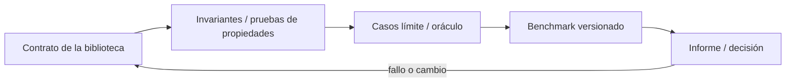

# SE-096 — Proyecto: biblioteca comparada con casos límite

[← SE-095 — Taller: elegir por carga y no por costumbre](../../classes/part-07-estructuras-de-datos-y-algoritmos/se-095-taller-elegir-por-carga-y-no-por-costumbre/README.md) · [↑ Parte 07](../../classes/part-07-estructuras-de-datos-y-algoritmos/README.md) · [📚 Índice completo](../../classes/README.md) · [🌐 Portal](../../site/classes/SE-096.html) · [SE-097 — Editores, IDE y servidores de lenguaje →](../../classes/part-08-entornos-herramientas-y-depuracion/se-097-editores-ide-y-servidores-de-lenguaje/README.md)

> Estado: **PLANNED** · Borrador público conservado íntegramente y sometido a auditoría técnica y pedagógica.

## Punto profesional y fundamento pedagógico

**Punto profesional.** La clase existe para entregar una biblioteca con contratos, casos límite y comparaciones de costo.

**Por qué aparece aquí.** Se sitúa después de **Taller: elegir por carga y no por costumbre** y antes de **Editores, IDE y servidores de lenguaje**: convierte el conocimiento anterior en una decisión observable que la clase siguiente podrá reutilizar. La continuidad se comprueba en el artefacto, no por compartir vocabulario.

**Error conceptual que debe corregir.** Considerar correcta una API porque sus ejemplos pasan.

**Secuencia de aprendizaje.** Antes de leer la solución, el estudiante predice el resultado del caso normal y del error conceptual anterior. Luego explica un caso resuelto paso a paso, construye un contraejemplo que cambie la decisión y, sin consultar el texto, reconstruye el mecanismo y lo aplica a una entrada nueva. La secuencia usa predicción, explicación propia, contraste y recuperación. [ICAP](https://icap.education.asu.edu/research) distingue participación de construcción de conocimiento; [How People Learn II](https://nap.nationalacademies.org/catalog/24783/how-people-learn-ii-learners-contexts-and-cultures) exige conectar conocimiento previo, contexto y transferencia; la [práctica de recuperación](https://pubmed.ncbi.nlm.nih.gov/16507066/) respalda producir de nuevo la explicación tras una demora; y [Education for Life and Work](https://nap.nationalacademies.org/resource/13398/dbasse_084153.pdf) exige devolución que explique la causa del error.

**Evidencia de aprendizaje.** Biblioteca, pruebas de propiedades, benchmarks, documentación y límites. Debe contener predicción previa, observación, explicación causal, contraejemplo, criterio de aceptación y una nota de qué dato haría cambiar la conclusión.

**Límite de la conclusión.** La evidencia local no certifica seguridad ni rendimiento universal.

### Trazabilidad fuente → afirmación

| Fuente primaria u oficial | Afirmación que respalda | Lo que no prueba |
|---|---|---|
| [MIT 6.006 Introduction to Algorithms](https://ocw.mit.edu/courses/6-006-introduction-to-algorithms-spring-2020/) | Estructuras, algoritmos, corrección y análisis de complejidad; autoridad: MIT OpenCourseWare | No demuestra por sí sola que el artefacto del estudiante sea correcto. |
| [Python Data Model](https://docs.python.org/3/reference/datamodel.html) | Semántica de secuencias, conjuntos, mappings, igualdad y hash; autoridad: Python Software Foundation | No demuestra por sí sola que el artefacto del estudiante sea correcto. |
| [Python Debugging and Profiling](https://docs.python.org/3/library/debug.html) | Timeit, cprofile y tracemalloc con sus límites; autoridad: Python Software Foundation | No demuestra por sí sola que el artefacto del estudiante sea correcto. |
| [SWEBOK Guide v4.0a](https://www.computer.org/education/bodies-of-knowledge/software-engineering) | Construcción, medición y fundamentos de ingeniería; autoridad: IEEE Computer Society | No demuestra por sí sola que el artefacto del estudiante sea correcto. |

## Antes de empezar

Esta clase continúa la **biblioteca de estructuras y algoritmos de la Parte 07**. Recupera la evidencia de la clase anterior, añade una decisión propia de **Proyecto: biblioteca comparada con casos límite** y deja un artefacto que la clase siguiente deberá consumir. La pregunta activa es: **¿Cómo entregar una biblioteca comparada cuya corrección y rendimiento puedan discutirse con evidencia?**

## Prerrequisitos

- Haber completado la clase anterior o reconstruir su contrato y evidencia.
- Python 3.11 o posterior, terminal, editor y Git; un segundo runtime es opcional y debe declararse.
- Trabajar con fixtures sintéticos: ninguna observación necesita datos de una persona o sistema real.

## Problema auténtico

La biblioteca de estructuras y algoritmos necesita una interfaz reusable de backlog con implementaciones para historial, prioridad e identidad. El proyecto debe impedir que una optimización cambie desempate o pierda casos límite.

## Objetivos observables

Al terminar podrás explicar los cinco mecanismos de esta clase, predecir su comportamiento antes de ejecutar, construir un caso normal y uno límite, diagnosticar el fallo controlado, comparar una alternativa y entregar evidencia que otra persona pueda reproducir.

## Mapa conceptual



El mapa se lee como una cadena de razonamiento, no como fases obligatorias del runtime. La flecha de retorno indica que un fallo o cambio de requisito obliga a revisar el modelo inicial; no autoriza a parchear solo la última salida.

## Temas y por qué importan

| Tema | Por qué cambia una decisión profesional | Evidencia mínima |
|---|---|---|
| Contrato de la biblioteca | La API define tipos, operaciones, errores, orden y complejidad esperada. | Predicción, traza causal y contraejemplo de **Contrato de la biblioteca** en `biblioteca` |
| Invariantes y pruebas de propiedades | Cada implementación declara invariantes y prueba secuencias generadas: insertar-extraer conserva elementos, prioridad nunca aumenta incorrectamente y duplicado sigue política. | Predicción, traza causal y contraejemplo de **Invariantes y pruebas de propiedades** en `biblioteca` |
| Casos límite y oráculo | Vacío, uno, empates, duplicados, extremos y datos inválidos forman el corpus. | Predicción, traza causal y contraejemplo de **Casos límite y oráculo** en `biblioteca` |
| Benchmark versionado | El runner separa preparación y operación, verifica outputs, registra entorno y emite datos estructurados. | Predicción, traza causal y contraejemplo de **Benchmark versionado** en `biblioteca` |
| Informe y decisión | El README guía a consumidor, el informe explica mecanismos y la matriz recomienda por carga. | Predicción, traza causal y contraejemplo de **Informe y decisión** en `biblioteca` |
## Conceptos y decisiones

### 1. Contrato de la biblioteca

La API define tipos, operaciones, errores, orden y complejidad esperada. Exponer la estructura interna impide sustituirla. Las garantías de costo se expresan con supuestos y no como promesa absoluta de latencia.

### 2. Invariantes y pruebas de propiedades

Cada implementación declara invariantes y prueba secuencias generadas: insertar-extraer conserva elementos, prioridad nunca aumenta incorrectamente y duplicado sigue política. Ejemplos concretos facilitan diagnóstico; propiedades exploran combinaciones.

### 3. Casos límite y oráculo

Vacío, uno, empates, duplicados, extremos y datos inválidos forman el corpus. Una implementación simple sirve como oráculo para tamaños pequeños. La comparación falla fuerte ante divergencia y conserva la secuencia mínima.

### 4. Benchmark versionado

El runner separa preparación y operación, verifica outputs, registra entorno y emite datos estructurados. Los umbrales evitan promesas frágiles entre máquinas; se comparan tendencias o presupuestos cuando son defendibles.

### 5. Informe y decisión

El README guía a consumidor, el informe explica mecanismos y la matriz recomienda por carga. Se declara qué no se midió: concurrencia, producción, otros runtimes o datasets. La honestidad del límite es parte de la entrega.

## Definiciones de trabajo

- **contrato de la biblioteca:** la api define tipos, operaciones, errores, orden y complejidad esperada.
- **invariantes y pruebas de propiedades:** cada implementación declara invariantes y prueba secuencias generadas: insertar-extraer conserva elementos, prioridad nunca aumenta incorrectamente y duplicado sigue política.
- **casos límite y oráculo:** vacío, uno, empates, duplicados, extremos y datos inválidos forman el corpus.
- **benchmark versionado:** el runner separa preparación y operación, verifica outputs, registra entorno y emite datos estructurados.
- **informe y decisión:** el readme guía a consumidor, el informe explica mecanismos y la matriz recomienda por carga.

Las definiciones son operativas para la biblioteca de estructuras y algoritmos. No convierten términos con historia más amplia en sinónimos y deben contrastarse con la documentación primaria enlazada al final.

## Ejemplo mínimo

```python
python -m unittest -v
python -m algorithm_library.benchmark --sizes 100,1000,10000 --repeat 9 --output evidence/results.json
# El runner valida equivalencia antes de registrar tiempos.
```

Antes de ejecutar, predice estado, resultado y error. Después registra versión, comando y salida. Si el fragmento es pseudocódigo o pertenece a otro lenguaje, etiquétalo como tal y no afirmes que fue ejecutado.

## Ejemplo profesional

En la biblioteca de estructuras y algoritmos, un caso conserva identidad, prioridad, dependencias, instante de llegada y estado de resolución. La implementación de esta clase debe conservar ese contrato aunque cambie la forma interna. El caso profesional no pregunta únicamente si produce una salida: pregunta quién puede producirla, qué estado observa, cómo falla y qué rastro permite disputar una decisión incorrecta.

Compara el caso normal con autorización falsa, evidencia incompleta, empate y repetición. Un mecanismo es apropiado cuando esas diferencias quedan visibles y localizadas; es peligroso cuando dependen de orden accidental, estado oculto o una convención que el consumidor no puede conocer.

## Práctica guiada

1. Copia el contrato de entrada y salida antes de escribir implementación.
2. Predice el caso normal y un límite; identifica la invariante que no puede romperse.
3. Implementa la versión mínima sin I/O dentro del núcleo.
4. Ejecuta el caso y conserva comando, versión y salida bajo `evidence/`.
5. Introduce el fallo controlado, reduce la reproducción y formula dos hipótesis rivales.
6. Corrige la causa, añade regresión y ejecuta el conjunto completo.
7. Compara con otro paradigma o lenguaje indicando qué semántica se preserva.

## Ejercicios

1. **Lectura:** dibuja una traza de cinco pasos y marca dónde cambia estado o control.
2. **Construcción:** añade una operación dominante y demuestra la invariante que conserva.
3. **Frontera:** cubre vacío, empate, no autorizado e inválido con resultados distintos.
4. **Contraste:** reescribe una pieza con otro modelo y explica una mejora y una pérdida.

## Reto verificable

Entrega implementación, fixtures, pruebas y un informe corto. Se aprueba si otra persona ejecuta desde checkout limpio, obtiene los mismos resultados y puede relacionar cada rama o transformación con una regla del dominio. No se aprueba por cantidad de archivos ni por usar la sintaxis característica del paradigma.

## Caso conductor

La biblioteca de estructuras y algoritmos recibe casos del motor de reglas comparado, mantiene una frontera de trabajo priorizada y explica por qué el siguiente caso es elegible. Ejecuta una carga pequeña trazable, duplicados, prioridades iguales y una dependencia ausente. Cambia después una sola regla o condición y revisa qué archivos, pruebas y trazas debieron modificarse. Esa superficie de cambio alimenta el proyecto final de la parte.

## Preguntas frecuentes

### ¿Un paradigma determina toda la arquitectura?

No. Puede organizar un núcleo o una frontera sin dominar el sistema completo. Combinar modelos es válido si los adaptadores preservan identidad, orden, errores y evidencia.

### ¿Menos líneas significan una solución mejor?

No. La brevedad puede quitar duplicación o esconder decisiones. Se evalúan semántica, diagnóstico, costo de cambio y adecuación a la carga.

### ¿Debo instalar todos los lenguajes mencionados?

No. Python basta para la práctica base. Si usas Prolog, Rust o Erlang, registra versión y comandos; si solo analizas notación, decláralo como análisis no ejecutado.

## Fallo controlado y diagnóstico

Optimiza la extracción y rompe estabilidad de empates. Una prueba basada solo en conjunto pasa; añade secuencia esperada y propiedad de orden estable antes de aceptar la mejora.

Registra síntoma, entrada mínima, hipótesis, observación que descarta cada hipótesis, causa, corrección y prueba de regresión. No cambies simultáneamente implementación, fixture y expectativa.

## Errores comunes y cómo corregirlos

| Síntoma | Causa probable | Corrección |
|---|---|---|
| dos pruebas aisladas pasan y juntas fallan | estado o dependencia compartida | aislar propietario y reiniciar fixture |
| implementación corta pero opaca | semántica delegada sin contrato | documentar transición, error y orden |
| modelos “equivalentes” divergen | fixtures normalizan diferencias reales | comparar contrato antes de presentación |
| reintento duplica resultado | efecto sin identidad ni idempotencia | correlacionar y probar repetición |
| diagrama y código cuentan historias distintas | visual ornamental o desactualizado | trazar el mismo caso en ambos |

## Entorno y archivos clave

```text
work/SE-096/
├── README.md
├── algorithm_library/
│   ├── domain.py
│   └── se_096.py
├── fixtures/cases.json
├── tests/test_se_096.py
└── evidence/diagnosis.md
```

El `README` declara plataforma, runtimes, comandos, limpieza y límites. Evita dependencias externas cuando la biblioteca estándar permita observar el mecanismo; si agregas una, fija procedencia y versión.

## Seguridad, ética y accesibilidad

- la autorización forma parte del dominio y no se infiere por ausencia de rechazo;
- no uses `eval`, reglas descargadas ni serialización insegura;
- limita colas, recursión, tamaño de entrada y tiempo de evaluación;
- redacta trazas y conserva una explicación textual además de color o animación;
- una recomendación automatizada debe poder revisarse, impugnarse y corregirse;
- respeta licencias de ejemplos y atribuye adaptaciones.

## Transferencia

Traslada un fixture al segundo modelo o lenguaje. Compara representación de ausencia, error, mutabilidad, orden y cancelación. La transferencia está lograda cuando el contrato se conserva y las diferencias están explicadas, no cuando la sintaxis se parece.

## Evaluación y evidencia

| Criterio | Evidencia para aprobar |
|---|---|
| comprensión | explicación causal de los cinco mecanismos |
| corrección | normal, límite, inválido y contraejemplo |
| diseño | estado, efectos y contrato localizables |
| diagnóstico | reproducción mínima y regresión |
| transferencia | comparación semántica, no estética |
| reproducibilidad | versiones, comandos, salida y límites |

Los snippets no elevan la clase a `EXECUTABLE` o `TESTED`: esos estados requieren artefactos versionados y ejecuciones verificadas fuera de la guía.

## Fuentes


- [MIT 6.006 Introduction to Algorithms](https://ocw.mit.edu/courses/6-006-introduction-to-algorithms-spring-2020/) — Estructuras, algoritmos, corrección y análisis de complejidad; autoridad: MIT OpenCourseWare.
- [Python Data Model](https://docs.python.org/3/reference/datamodel.html) — Semántica de secuencias, conjuntos, mappings, igualdad y hash; autoridad: Python Software Foundation.
- [Python Standard Library](https://docs.python.org/3/library/index.html) — Deque, heapq, bisect, graphlib y contenedores disponibles; autoridad: Python Software Foundation.
- [Python Debugging and Profiling](https://docs.python.org/3/library/debug.html) — Timeit, cprofile y tracemalloc con sus límites; autoridad: Python Software Foundation.
- [Mathematics for Computer Science](https://ocw.mit.edu/courses/6-042j-mathematics-for-computer-science-spring-2015/) — Inducción, grafos, conteo y razonamiento discreto; autoridad: MIT OpenCourseWare.
- [SWEBOK Guide v4.0a](https://www.computer.org/education/bodies-of-knowledge/software-engineering) — Construcción, medición y fundamentos de ingeniería; autoridad: IEEE Computer Society.

Cada fuente respalda el mecanismo indicado; ninguna demuestra que la implementación de la biblioteca de estructuras y algoritmos sea correcta. Esa afirmación depende de fixtures, pruebas, trazas y revisión reproducible.

## Límites y siguiente paso

La biblioteca demuestra comportamiento en el corpus y protocolo declarados, no superioridad universal. La Parte 8 tomará un fallo y una regresión de la biblioteca de estructuras y algoritmos para construir un entorno de diagnóstico reproducible.

## Glosario

- **contrato de la biblioteca:** la api define tipos, operaciones, errores, orden y complejidad esperada.
- **invariantes y pruebas de propiedades:** cada implementación declara invariantes y prueba secuencias generadas: insertar-extraer conserva elementos, prioridad nunca aumenta incorrectamente y duplicado sigue política.
- **casos límite y oráculo:** vacío, uno, empates, duplicados, extremos y datos inválidos forman el corpus.
- **benchmark versionado:** el runner separa preparación y operación, verifica outputs, registra entorno y emite datos estructurados.
- **informe y decisión:** el readme guía a consumidor, el informe explica mecanismos y la matriz recomienda por carga.

---

[← SE-095 — Taller: elegir por carga y no por costumbre](../../classes/part-07-estructuras-de-datos-y-algoritmos/se-095-taller-elegir-por-carga-y-no-por-costumbre/README.md) · [↑ Parte 07](../../classes/part-07-estructuras-de-datos-y-algoritmos/README.md) · [📚 Índice completo](../../classes/README.md) · [🌐 Portal](../../site/classes/SE-096.html) · [SE-097 — Editores, IDE y servidores de lenguaje →](../../classes/part-08-entornos-herramientas-y-depuracion/se-097-editores-ide-y-servidores-de-lenguaje/README.md)
