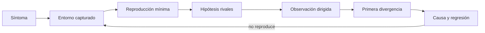

# Parte 08 — Entornos, herramientas y depuración

La biblioteca de estructuras y algoritmos ya tiene invariantes, pruebas y benchmarks, pero una regresión aparece solo en un entorno: prioridades empatadas cambian de orden tras actualizar el runtime. El entorno reproducible de diagnóstico construye una investigación completa. Cada herramienta se introduce por la señal que aporta, su costo de observación y su límite; el objetivo no es coleccionar extensiones, sino explicar la causa y dejar un entorno que otra persona pueda reconstruir.

## Pregunta rectora

> ¿Qué observación permite refutar la hipótesis actual y reproducir el fallo sin depender de mi máquina?

## Antes del recorrido clase por clase

Esta parte no presenta herramientas como una lista de instalaciones. Cada clase vuelve
sobre **entorno reproducible de diagnóstico**, formula una hipótesis, elige la señal menos invasiva que puede refutarla
y conserva el entorno de la observación. Así se distingue una causa reproducible de una
coincidencia introducida por editor, runtime, dependencia o instrumento.

El diagrama representa un ciclo de investigación, no un orden rígido de herramientas.
Si el caso mínimo deja de reproducir, se vuelve al entorno capturado; si una observación
altera el síntoma, se cambia el instrumento y se registra esa perturbación.

## Resultados acumulativos

Podrás configurar edición semántica, detener y observar ejecución, perfilar CPU, memoria e I/O, interpretar análisis estático, explorar sin perder reproducibilidad, fijar runtimes y dependencias, reducir fallos y entregar un entorno accesible, desechable y diagnosticable.

Al finalizar podrás reconstruir un entorno, elegir una observación por hipótesis,
localizar la primera divergencia y entregar un caso mínimo con prueba de regresión,
accesibilidad y limpieza verificables.

## Prerrequisitos enlazados

- [Parte 4 — Pensamiento computacional](../../classes/part-04-pensamiento-computacional-y-resolucion-de-problemas/): modelado, invariantes, corrección y complejidad.
- [Parte 5 — Fundamentos de programación](../../classes/part-05-fundamentos-de-programacion/): valores, control, funciones, errores, pruebas y la CLI diagnóstica.
- Python 3.11+, Git y terminal; runtimes adicionales son opcionales y deben declararse.

## Bloques y progresión

1. **Edición y observación:** las clases 97–99 separan editor, protocolo semántico, debugger y perfiles por señal observable.
2. **Análisis y exploración:** las clases 100–101 combinan análisis estático con exploración controlada.
3. **Aislamiento reproducible:** las clases 102–104 fijan runtime, dependencias y entorno desechable.
4. **Diagnóstico y entrega:** las clases 105–108 reducen, hacen accesible, diagnostican y entregan el entorno.

## Guía razonada clase por clase

El entorno reproducible de diagnóstico investiga una regresión de la biblioteca de estructuras y algoritmos que solo aparece bajo una combinación concreta de
runtime y dependencias. El recorrido va desde la interpretación del workspace hasta un
entorno autocontenido; cada herramienta entra porque responde una pregunta y sale del
camino cuando altera demasiado el fenómeno.

### Bloque 1 — Comprender y observar la ejecución

#### SE-097 — Editores, IDE y servidores de lenguaje

Una importación aparece válida en el editor y falla en CI. La clase separa edición,
integración del proyecto y análisis semántico; explica cómo LSP negocia capacidades y
cómo raíz de workspace, intérprete y configuración determinan el grafo que el servidor
observa. Un subrayado no es evidencia del runtime real.

El estudiante registra intérprete, rutas y configuración desde terminal y editor, y
reproduce la discrepancia sin exportar preferencias personales. El artefacto es un mapa
cliente–servidor–workspace. `SE-098` usa ese contexto para detener el proceso donde el
estado empieza a divergir.

#### SE-098 — Depuradores, breakpoints y observación de estado

Un breakpoint cambia el tiempo y puede ocultar carreras, pero permite inspeccionar
frames, variables y flujo en un punto preciso. La clase distingue depurador, adaptador y
runtime; trabaja breakpoints condicionales, stepping, watchpoints cuando existen y
excepciones, sin convertir la pausa final en causa.

El entorno reproducible de diagnóstico compara una ejecución correcta y otra degradada hasta el primer estado distinto.
El estudiante registra expresión, frame y condición, y limita datos sensibles. Si el
síntoma es costo o acumulación y no un valor incorrecto, `SE-099` cambia de instrumento
a perfiles de recursos.

#### SE-099 — Profilers de CPU, memoria, I/O y red

CPU ocupada, espera de I/O, crecimiento de memoria y latencia de red producen síntomas
parecidos y requieren señales distintas. La clase compara muestreo e instrumentación,
tiempo de pared y CPU, asignación y retención, y advierte que el profiler añade costo y
solo describe la carga observada.

El estudiante perfila la biblioteca de estructuras y algoritmos con corpus fijo, separa preparación de operación y atribuye
el cuello a una función o frontera. Repite sin instrumento para estimar perturbación.
`SE-100` pregunta qué defectos pueden detectarse antes de ejecutar y qué garantías no
ofrece el análisis estático.

### Bloque 2 — Analizar y explorar sin perder reproducibilidad

#### SE-100 — Compiladores, linters, formatters y análisis estático

Compilador, linter, formatter y analizador de tipos operan sobre modelos diferentes. La
clase separa error de sintaxis, incompatibilidad de tipos, regla de estilo y propiedad
semántica aproximada; un reporte limpio no demuestra comportamiento correcto ni ausencia
de vulnerabilidades.

El entorno reproducible de diagnóstico fija versiones y configuración, ejecuta cada herramienta por separado y relaciona
un diagnóstico con el defecto que previene. El estudiante conserva también un falso
positivo o límite. `SE-101` permite explorar hipótesis rápidamente, pero exige volver
explícitos orden y estado.

#### SE-101 — REPL, notebooks y desarrollo exploratorio

REPL y notebooks acortan el ciclo de pregunta y observación, pero el historial y orden
de celdas pueden producir un resultado imposible desde inicio limpio. La clase distingue
exploración de evidencia final, registra semillas y datos y convierte descubrimientos en
scripts y pruebas.

El estudiante reproduce la anomalía del entorno reproducible de diagnóstico en una sesión, reinicia y ejecuta de arriba
abajo; cualquier diferencia se trata como señal. El resultado es un caso exportado y
autónomo. `SE-102` fija el runtime para que esa reproducción no dependa de cuál ejecutable
apareció primero en `PATH`.

### Bloque 3 — Fijar runtime, dependencias y sistema de herramientas

#### SE-102 — Gestores de versiones de runtimes

Instalar varias versiones no garantiza que shell, editor, CI y tareas usen la misma. La
clase explica descubrimiento, shims, archivos de selección, arquitectura y precedencia
de `PATH`; diferencia versión solicitada, resuelta y realmente ejecutada.

El entorno reproducible de diagnóstico añade un manifiesto y un autochequeo que imprime ruta y versión, y prueba entrada
desde terminal e IDE. La evidencia evita depender del gestor concreto. `SE-103` aísla
las dependencias del proyecto sin prometer aislamiento del sistema completo.

#### SE-103 — Entornos virtuales y aislamiento de dependencias

Un entorno virtual selecciona intérprete y rutas de paquetes; comparte kernel,
bibliotecas del sistema y, según configuración, cachés o variables. La clase estudia
creación, activación como conveniencia, ejecución por ruta, resolución y descarte. Copiar
un entorno no sustituye declarar cómo reconstruirlo.

El estudiante crea el entorno reproducible de diagnóstico desde cero, instala dependencias fijadas y demuestra que una
versión distinta reproduce la regresión. Luego elimina y reconstruye. `SE-104` amplía la
captura a herramientas y sistema de usuario mediante un contenedor de desarrollo.

#### SE-104 — Dev Containers y entornos desechables

Un Dev Container describe imagen, características, montajes, usuario y ciclo de vida,
pero builds no fijados, secretos y volúmenes pueden reintroducir estado. La clase
explica frontera host–contenedor, caché, UID, red y privilegios; «contenedor» no equivale
a sandbox hostil.

El entorno reproducible de diagnóstico construye desde checkout limpio con versiones identificables, sin incrustar
credenciales, y verifica eliminación. El estudiante compara resultado local y contenido
y registra lo compartido. Con el entorno capturado, `SE-105` reduce el caso hasta separar
causa de coincidencia.

### Bloque 4 — Reducir, hacer accesible y entregar la investigación

#### SE-105 — Reproducción de errores y reducción de casos

Reducir no significa borrar hasta que el fallo desaparezca, sino conservar el síntoma y
eliminar variables de manera controlada. La clase define firma del fallo, fixture,
automatización y primera divergencia; usa reducción sistemática y restaura elementos para
comprobar causalidad.

El estudiante transforma la regresión de la biblioteca de estructuras y algoritmos en un caso mínimo con comando y resultado
esperado. Una variante que ya no reproduce documenta el límite. `SE-106` revisa si el
entorno y la evidencia pueden ser usados por personas con capacidades y formas de
interacción distintas.

#### SE-106 — Ergonomía, accesibilidad y productividad del entorno

Productividad no se reduce a velocidad de quien configuró la herramienta. La clase
examina teclado, foco, contraste, movimiento, zoom, lectores, carga cognitiva y
personalización; una automatización que oculta su estado puede reducir pulsaciones y
empeorar diagnóstico o accesibilidad.

El entorno reproducible de diagnóstico documenta rutas equivalentes por CLI e interfaz, estados de foco y comandos
observables. El estudiante prueba navegación por teclado y recuperación de errores, sin
declarar conformidad universal. `SE-107` integra herramientas y criterios frente a un
fallo no anunciado.

#### SE-107 — Taller: diagnosticar un fallo desconocido

El taller entrega un síntoma y un repositorio, no la herramienta correcta. El estudiante
captura entorno, reproduce, formula hipótesis y elige entre análisis estático, debugger,
perfil o reducción según la señal necesaria. Cambiar varias variables a la vez invalida
la investigación.

La entrega conserva cronología, intentos descartados, primera divergencia, causa y prueba
de regresión; después limpia procesos y artefactos. Una revisión cruzada intenta repetir
el resultado. `SE-108` empaqueta este método dentro de un entorno autocontenido y
desechable.

#### SE-108 — Proyecto: entorno de desarrollo autocontenido

El proyecto entrega el entorno reproducible de diagnóstico como contrato de incorporación y diagnóstico: runtime,
dependencias, herramientas, configuración mínima, corpus y comandos de prueba. Debe
reconstruirse desde checkout limpio, fallar con mensajes útiles y eliminarse sin dejar
secretos ni procesos.

La aceptación mide tiempo y bloqueos de una persona nueva, reproduce la regresión y
demuestra la prueba que la previene. Se registran host, combinaciones verificadas y
límites del aislamiento. La Parte 9 usará ese entorno para empaquetar la capacidad como
producto consumible y compatible.

## Resumen operativo del recorrido

| Clase | Capacidad que construye | Pregunta que resuelve | Evidencia acumulativa |
|---|---|---|---|
| [SE-097](../../classes/part-08-entornos-herramientas-y-depuracion/se-097-editores-ide-y-servidores-de-lenguaje/) | Editores, IDE y servidores de lenguaje | ¿Qué trabajo pertenece al editor, al IDE y al servidor que entiende el lenguaje? | Mapa editor–LSP–workspace e intérprete efectivo |
| [SE-098](../../classes/part-08-entornos-herramientas-y-depuracion/se-098-depuradores-breakpoints-y-observacion-de-estado/) | Depuradores, breakpoints y observación de estado | ¿Dónde detener la ejecución para observar la primera divergencia y no solo el síntoma final? | Traza comparada de frames y primera divergencia |
| [SE-099](../../classes/part-08-entornos-herramientas-y-depuracion/se-099-profilers-de-cpu-memoria-i-o-y-red/) | Profilers de CPU, memoria, I/O y red | ¿Qué recurso está realmente saturado y qué herramienta puede atribuirlo? | Perfil atribuido y perturbación del instrumento |
| [SE-100](../../classes/part-08-entornos-herramientas-y-depuracion/se-100-compiladores-linters-formatters-y-analisis-estatico/) | Compiladores, linters, formatters y análisis estático | ¿Qué garantía aporta cada herramienta estática y qué no puede concluir sin ejecutar? | Matriz herramienta–garantía–límite con versión |
| [SE-101](../../classes/part-08-entornos-herramientas-y-depuracion/se-101-repl-notebooks-y-desarrollo-exploratorio/) | REPL, notebooks y desarrollo exploratorio | ¿Cómo explorar rápidamente sin convertir estado invisible y orden de celdas en evidencia falsa? | Exploración reiniciable convertida en script y prueba |
| [SE-102](../../classes/part-08-entornos-herramientas-y-depuracion/se-102-gestores-de-versiones-de-runtimes/) | Gestores de versiones de runtimes | ¿Cómo garantizar que terminal, editor, CI y contenedor ejecuten el mismo runtime esperado? | Matriz de runtime solicitado, resuelto y ejecutado |
| [SE-103](../../classes/part-08-entornos-herramientas-y-depuracion/se-103-entornos-virtuales-y-aislamiento-de-dependencias/) | Entornos virtuales y aislamiento de dependencias | ¿Qué aísla realmente un entorno virtual y qué sigue compartiendo con el sistema? | Entorno eliminado y reconstruido desde declaración |
| [SE-104](../../classes/part-08-entornos-herramientas-y-depuracion/se-104-dev-containers-y-entornos-desechables/) | Dev Containers y entornos desechables | ¿Qué debe declarar un Dev Container para ser reconstruible, seguro y prescindible? | Build de contenedor, fronteras y limpieza verificadas |
| [SE-105](../../classes/part-08-entornos-herramientas-y-depuracion/se-105-reproduccion-de-errores-y-reduccion-de-casos/) | Reproducción de errores y reducción de casos | ¿Cuál es el menor caso que conserva el síntoma y separa causa de coincidencia? | Reproducción mínima y variante que no falla |
| [SE-106](../../classes/part-08-entornos-herramientas-y-depuracion/se-106-ergonomia-accesibilidad-y-productividad-del-entorno/) | Ergonomía, accesibilidad y productividad del entorno | ¿Cómo reducir fricción sin imponer una única capacidad física, interfaz o estilo de trabajo? | Recorridos equivalentes y prueba de teclado/foco |
| [SE-107](../../classes/part-08-entornos-herramientas-y-depuracion/se-107-taller-diagnosticar-un-fallo-desconocido/) | Taller: diagnosticar un fallo desconocido | ¿Cómo investigar un fallo desconocido sin saltar de herramienta en herramienta? | Bitácora causal, prueba de regresión y limpieza |
| [SE-108](../../classes/part-08-entornos-herramientas-y-depuracion/se-108-proyecto-entorno-de-desarrollo-autocontenido/) | Proyecto: entorno de desarrollo autocontenido | ¿Qué evidencia demuestra que un entorno de desarrollo puede reconstruirse, diagnosticarse y eliminarse con seguridad? | Entorno autocontenido y ensayo desde checkout limpio |

## Proyecto integrador

El proyecto **SE-108** entrega configuración versionada de runtime, dependencias,
herramientas y contenedor; un corpus mínimo que reproduce la regresión; comandos de
construcción, prueba, diagnóstico y limpieza; y un informe de incorporación desde
checkout limpio. El entorno se considera desechable: debe poder reconstruirse y retirarse.

## Criterios de salida

- las doce clases explican todos sus temas mediante mecanismos, ejemplos y límites;
- editor, terminal, CI y contenedor identifican el runtime y dependencias efectivos;
- el caso mínimo conserva síntoma, resultado esperado y prueba de regresión;
- cada herramienta se vincula a una hipótesis y declara su perturbación o límite;
- otra persona reproduce comandos y resultados desde checkout limpio;
- el informe declara lo observado, lo inferido y lo no ejecutado.

## Preguntas de control por bloque

- ¿Qué componente interpreta el workspace y con qué runtime efectivo?
- ¿Qué señal puede separar las hipótesis sin alterar el síntoma decisivo?
- ¿Qué estado queda fuera del entorno virtual o del contenedor?
- ¿Puede otra persona reconstruir, diagnosticar y limpiar sin conocimiento oral?

## Fuentes de la parte

- [Language Server Protocol 3.18](https://microsoft.github.io/language-server-protocol/specifications/lsp/3.18/specification/) — mensajes, capacidades y sincronización entre editor y servidor; autoridad: Microsoft.
- [Debug Adapter Protocol](https://microsoft.github.io/debug-adapter-protocol/) — breakpoints, frames, variables y negociación de capacidades; autoridad: Microsoft.
- [Python Debugging and Profiling](https://docs.python.org/3/library/debug.html) — pdb, cProfile, timeit, tracemalloc y límites instrumentales; autoridad: Python Software Foundation.
- [Python venv](https://docs.python.org/3/library/venv.html) — aislamiento de intérprete, scripts y entorno virtual; autoridad: Python Software Foundation.
- [Development Container Specification](https://containers.dev/implementors/spec/) — configuración reproducible de herramientas y ciclo de vida del contenedor; autoridad: Dev Container Specification maintainers.
- [Web Content Accessibility Guidelines 2.2](https://www.w3.org/TR/WCAG22/) — percepción, operación por teclado y reducción de barreras en interfaces; autoridad: W3C.

Las fuentes se vinculan también dentro de cada clase. Definen semántica y mecanismos; la adecuación del entorno reproducible de diagnóstico se demuestra con el caso, las pruebas y la comparación.
