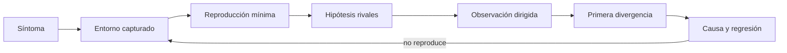

# Parte 08 — Entornos, herramientas y depuración

Orbe ya tiene invariantes, pruebas y benchmarks, pero una regresión aparece solo en un entorno: prioridades empatadas cambian de orden tras actualizar el runtime. Lupa construye una investigación completa. Cada herramienta se introduce por la señal que aporta, su costo de observación y su límite; el objetivo no es coleccionar extensiones, sino explicar la causa y dejar un entorno que otra persona pueda reconstruir.

## Pregunta rectora

> ¿Qué observación permite refutar la hipótesis actual y reproducir el fallo sin depender de mi máquina?

## Antes del recorrido clase por clase

Esta parte no presenta paradigmas como etiquetas ni como una competencia de sintaxis. Cada clase vuelve sobre **Lupa**, mantiene un contrato común y cambia deliberadamente el modelo de estado, control, composición o tiempo. Así puede distinguirse una diferencia semántica de una diferencia accidental del lenguaje.

El diagrama muestra la progresión del razonamiento, no una arquitectura recomendada. Las pruebas comunes impiden declarar equivalencia por parecido visual; el retorno obliga a revalidar cuando cambia el contrato.

## Resultados acumulativos

Podrás configurar edición semántica, detener y observar ejecución, perfilar CPU, memoria e I/O, interpretar análisis estático, explorar sin perder reproducibilidad, fijar runtimes y dependencias, reducir fallos y entregar un entorno accesible, desechable y diagnosticable.

Al finalizar podrás justificar una combinación, señalar adaptadores y pérdidas, y rechazar una elección que no se sostenga ante casos límite o costo operativo.

## Prerrequisitos enlazados

- [Parte 4 — Pensamiento computacional](../../classes/part-04-pensamiento-computacional-y-resolucion-de-problemas/): modelado, invariantes, corrección y complejidad.
- [Parte 5 — Fundamentos de programación](../../classes/part-05-fundamentos-de-programacion/): valores, control, funciones, errores, pruebas y Brújula.
- Python 3.11+, Git y terminal; runtimes adicionales son opcionales y deben declararse.

## Bloques y progresión

1. **Edición y observación:** las clases 97–99 separan editor, protocolo semántico, debugger y perfiles por señal observable.
2. **Análisis y exploración:** las clases 100–101 combinan análisis estático con exploración controlada.
3. **Aislamiento reproducible:** las clases 102–104 fijan runtime, dependencias y entorno desechable.
4. **Diagnóstico y entrega:** las clases 105–108 reducen, hacen accesible, diagnostican y entregan el entorno.

## Recorrido clase por clase

| Clase | Capacidad que construye | Pregunta que resuelve | Evidencia acumulativa |
|---|---|---|---|
| [SE-097](../../classes/part-08-entornos-herramientas-y-depuracion/se-097-editores-ide-y-servidores-de-lenguaje/) | Editores, IDE y servidores de lenguaje | ¿Qué trabajo pertenece al editor, al IDE y al servidor que entiende el lenguaje? | Evidencia reproducible para Lupa |
| [SE-098](../../classes/part-08-entornos-herramientas-y-depuracion/se-098-depuradores-breakpoints-y-observacion-de-estado/) | Depuradores, breakpoints y observación de estado | ¿Dónde detener la ejecución para observar la primera divergencia y no solo el síntoma final? | Evidencia reproducible para Lupa |
| [SE-099](../../classes/part-08-entornos-herramientas-y-depuracion/se-099-profilers-de-cpu-memoria-i-o-y-red/) | Profilers de CPU, memoria, I/O y red | ¿Qué recurso está realmente saturado y qué herramienta puede atribuirlo? | Evidencia reproducible para Lupa |
| [SE-100](../../classes/part-08-entornos-herramientas-y-depuracion/se-100-compiladores-linters-formatters-y-analisis-estatico/) | Compiladores, linters, formatters y análisis estático | ¿Qué garantía aporta cada herramienta estática y qué no puede concluir sin ejecutar? | Evidencia reproducible para Lupa |
| [SE-101](../../classes/part-08-entornos-herramientas-y-depuracion/se-101-repl-notebooks-y-desarrollo-exploratorio/) | REPL, notebooks y desarrollo exploratorio | ¿Cómo explorar rápidamente sin convertir estado invisible y orden de celdas en evidencia falsa? | Evidencia reproducible para Lupa |
| [SE-102](../../classes/part-08-entornos-herramientas-y-depuracion/se-102-gestores-de-versiones-de-runtimes/) | Gestores de versiones de runtimes | ¿Cómo garantizar que terminal, editor, CI y contenedor ejecuten el mismo runtime esperado? | Evidencia reproducible para Lupa |
| [SE-103](../../classes/part-08-entornos-herramientas-y-depuracion/se-103-entornos-virtuales-y-aislamiento-de-dependencias/) | Entornos virtuales y aislamiento de dependencias | ¿Qué aísla realmente un entorno virtual y qué sigue compartiendo con el sistema? | Evidencia reproducible para Lupa |
| [SE-104](../../classes/part-08-entornos-herramientas-y-depuracion/se-104-dev-containers-y-entornos-desechables/) | Dev Containers y entornos desechables | ¿Qué debe declarar un Dev Container para ser reconstruible, seguro y prescindible? | Evidencia reproducible para Lupa |
| [SE-105](../../classes/part-08-entornos-herramientas-y-depuracion/se-105-reproduccion-de-errores-y-reduccion-de-casos/) | Reproducción de errores y reducción de casos | ¿Cuál es el menor caso que conserva el síntoma y separa causa de coincidencia? | Evidencia reproducible para Lupa |
| [SE-106](../../classes/part-08-entornos-herramientas-y-depuracion/se-106-ergonomia-accesibilidad-y-productividad-del-entorno/) | Ergonomía, accesibilidad y productividad del entorno | ¿Cómo reducir fricción sin imponer una única capacidad física, interfaz o estilo de trabajo? | Evidencia reproducible para Lupa |
| [SE-107](../../classes/part-08-entornos-herramientas-y-depuracion/se-107-taller-diagnosticar-un-fallo-desconocido/) | Taller: diagnosticar un fallo desconocido | ¿Cómo investigar un fallo desconocido sin saltar de herramienta en herramienta? | Evidencia reproducible para Lupa |
| [SE-108](../../classes/part-08-entornos-herramientas-y-depuracion/se-108-proyecto-entorno-de-desarrollo-autocontenido/) | Proyecto: entorno de desarrollo autocontenido | ¿Qué evidencia demuestra que un entorno de desarrollo puede reconstruirse, diagnosticarse y eliminarse con seguridad? | Evidencia reproducible para Lupa |

## Proyecto integrador

El proyecto **SE-108** entrega un corpus versionado, al menos dos implementaciones ejecutables, pruebas contractuales compartidas, propiedades, trazas comparables y un informe de decisión para dos cargas distintas. No existe un ganador universal: la recomendación debe vincular fuerzas, evidencia, consecuencias y condición de reversión.

## Criterios de salida

- las doce clases explican todos sus temas mediante mecanismos, ejemplos y límites;
- cada implementación conserva autorización, explicación y errores del contrato;
- el corpus cubre normal, límite, inválido, empate, repetición y secuencia;
- las métricas separan lenguaje, runtime, paradigma y entorno;
- otra persona reproduce comandos y resultados desde checkout limpio;
- el informe declara lo observado, lo inferido y lo no ejecutado.

## Preguntas de control por bloque

- ¿Dónde vive el estado y quién puede cambiarlo?
- ¿Qué estrategia ejecuta una descripción declarativa o una consulta lógica?
- ¿Qué ocurre cuando productor, consumidor y cancelación avanzan a ritmos distintos?
- ¿Qué evidencia cambiaría la elección de paradigma?

## Fuentes de la parte

- [Language Server Protocol 3.18](https://microsoft.github.io/language-server-protocol/specifications/lsp/3.18/specification/) — mensajes, capacidades y sincronización entre editor y servidor; autoridad: Microsoft.
- [Debug Adapter Protocol](https://microsoft.github.io/debug-adapter-protocol/) — breakpoints, frames, variables y negociación de capacidades; autoridad: Microsoft.
- [Python Debugging and Profiling](https://docs.python.org/3/library/debug.html) — pdb, cProfile, timeit, tracemalloc y límites instrumentales; autoridad: Python Software Foundation.
- [Python venv](https://docs.python.org/3/library/venv.html) — aislamiento de intérprete, scripts y entorno virtual; autoridad: Python Software Foundation.
- [Development Container Specification](https://containers.dev/implementors/spec/) — configuración reproducible de herramientas y ciclo de vida del contenedor; autoridad: Dev Container Specification maintainers.
- [Web Content Accessibility Guidelines 2.2](https://www.w3.org/TR/WCAG22/) — percepción, operación por teclado y reducción de barreras en interfaces; autoridad: W3C.

Las fuentes se vinculan también dentro de cada clase. Definen semántica y mecanismos; la adecuación de Lupa se demuestra con el caso, las pruebas y la comparación.
