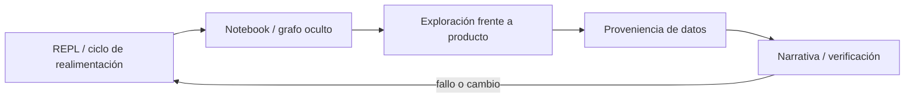

# SE-101 — REPL, notebooks y desarrollo exploratorio

[← SE-100 — Compiladores, linters, formatters y análisis estático](../../classes/part-08-entornos-herramientas-y-depuracion/se-100-compiladores-linters-formatters-y-analisis-estatico/README.md) · [↑ Parte 08](../../classes/part-08-entornos-herramientas-y-depuracion/README.md) · [📚 Índice completo](../../classes/README.md) · [🌐 Portal](../../site/classes/SE-101.html) · [SE-102 — Gestores de versiones de runtimes →](../../classes/part-08-entornos-herramientas-y-depuracion/se-102-gestores-de-versiones-de-runtimes/README.md)


## Punto profesional y fundamento pedagógico

**Punto profesional.** La clase existe para usar REPL y notebooks para explorar conservando orden, estado y transición a artefactos reproducibles.

**Por qué aparece aquí.** Se sitúa después de **Compiladores, linters, formatters y análisis estático** y antes de **Gestores de versiones de runtimes**: convierte el conocimiento anterior en una decisión observable que la clase siguiente podrá reutilizar. La continuidad se comprueba en el artefacto, no por compartir vocabulario.

**Error conceptual que debe corregir.** Creer que celdas visibles documentan el orden ejecutado.

**Secuencia de aprendizaje.** Antes de leer la solución, el estudiante predice el resultado del caso normal y del error conceptual anterior. Luego explica un caso resuelto paso a paso, construye un contraejemplo que cambie la decisión y, sin consultar el texto, reconstruye el mecanismo y lo aplica a una entrada nueva. La secuencia usa predicción, explicación propia, contraste y recuperación. [ICAP](https://icap.education.asu.edu/research) distingue participación de construcción de conocimiento; [How People Learn II](https://nap.nationalacademies.org/catalog/24783/how-people-learn-ii-learners-contexts-and-cultures) exige conectar conocimiento previo, contexto y transferencia; la [práctica de recuperación](https://pubmed.ncbi.nlm.nih.gov/16507066/) respalda producir de nuevo la explicación tras una demora; y [Education for Life and Work](https://nap.nationalacademies.org/resource/13398/dbasse_084153.pdf) exige devolución que explique la causa del error.

**Evidencia de aprendizaje.** Exploration-log.md con kernel limpio, orden, dependencia oculta y script extraído. Debe contener predicción previa, observación, explicación causal, contraejemplo, criterio de aceptación y una nota de qué dato haría cambiar la conclusión.

**Límite de la conclusión.** Una sesión interactiva no es por sí sola un pipeline reproducible.

### Trazabilidad fuente → afirmación

| Fuente primaria u oficial | Afirmación que respalda | Lo que no prueba |
|---|---|---|
| [Python Debugging and Profiling](https://docs.python.org/3/library/debug.html) | Pdb, cprofile, timeit, tracemalloc y límites instrumentales; autoridad: Python Software Foundation | No demuestra por sí sola que el artefacto del estudiante sea correcto. |
| [Python venv](https://docs.python.org/3/library/venv.html) | Aislamiento de intérprete, scripts y entorno virtual; autoridad: Python Software Foundation | No demuestra por sí sola que el artefacto del estudiante sea correcto. |
| [Python interactive mode](https://docs.python.org/3/tutorial/interpreter.html) | documenta el modo interactivo y su estado de sesión | No demuestra por sí sola que el artefacto del estudiante sea correcto. |
| [Jupyter messaging protocol](https://jupyter-client.readthedocs.io/en/stable/messaging.html) | define mensajes y canales entre cliente y kernel | No demuestra por sí sola que el artefacto del estudiante sea correcto. |

## Antes de empezar

Esta clase continúa el **entorno reproducible de diagnóstico de la Parte 08**. Recupera la evidencia de la clase anterior, añade una decisión propia de **REPL, notebooks y desarrollo exploratorio** y deja un artefacto que la clase siguiente deberá consumir. La pregunta activa es: **¿Cómo explorar rápidamente sin convertir estado invisible y orden de celdas en evidencia falsa?**

## Prerrequisitos

- Haber completado la clase anterior o reconstruir su contrato y evidencia.
- Python 3.11 o posterior, terminal, editor y Git; un segundo runtime es opcional y debe declararse.
- Trabajar con fixtures sintéticos: ninguna observación necesita datos de una persona o sistema real.

## Problema auténtico

Una persona demuestra el fallo en notebook, pero `Run all` no lo reproduce: una celda antigua modificó datos y una importación conserva código previo.

## Objetivos observables

Al terminar podrás explicar los cinco mecanismos de esta clase, predecir su comportamiento antes de ejecutar, construir un caso normal y uno límite, diagnosticar el fallo controlado, comparar una alternativa y entregar evidencia que otra persona pueda reproducir.

## Mapa conceptual



El mapa se lee como una cadena de razonamiento, no como fases obligatorias del runtime. La flecha de retorno indica que un fallo o cambio de requisito obliga a revisar el modelo inicial; no autoriza a parchear solo la última salida.

## Temas y por qué importan

| Tema | Por qué cambia una decisión profesional | Evidencia mínima |
|---|---|---|
| REPL y ciclo de realimentación | Read-eval-print permite probar expresiones y observar tipos o invariantes con baja fricción. | Predicción, traza causal y contraejemplo de **REPL y ciclo de realimentación** en `exploration-log.md` |
| Notebook y grafo oculto | Visualmente las celdas tienen orden, pero pueden ejecutarse en otra secuencia. | Predicción, traza causal y contraejemplo de **Notebook y grafo oculto** en `exploration-log.md` |
| Exploración frente a producto | Explorar tolera caminos muertos y visualización provisional; producto necesita interfaz, pruebas y ownership. | Predicción, traza causal y contraejemplo de **Exploración frente a producto** en `exploration-log.md` |
| Proveniencia de datos | Toda tabla o gráfico debe indicar origen, transformación, versión y filtros. | Predicción, traza causal y contraejemplo de **Proveniencia de datos** en `exploration-log.md` |
| Narrativa y verificación | Una explicación ordena pregunta, método, resultado y límite. | Predicción, traza causal y contraejemplo de **Narrativa y verificación** en `exploration-log.md` |
## Conceptos y decisiones

### 1. REPL y ciclo de realimentación

Read-eval-print permite probar expresiones y observar tipos o invariantes con baja fricción. El proceso conserva nombres, imports y mutaciones. Una sesión útil termina convirtiendo la observación en script o prueba que empieza desde estado limpio.

### 2. Notebook y grafo oculto

Visualmente las celdas tienen orden, pero pueden ejecutarse en otra secuencia. Salidas persistidas tampoco prueban qué código las produjo. Reiniciar kernel y ejecutar todo revela dependencias; parametrizar separa entrada de estado interactivo.

### 3. Exploración frente a producto

Explorar tolera caminos muertos y visualización provisional; producto necesita interfaz, pruebas y ownership. Pasar de uno a otro requiere extraer funciones, datos pequeños y un comando reproducible, no desplegar el notebook sin revisión.

### 4. Proveniencia de datos

Toda tabla o gráfico debe indicar origen, transformación, versión y filtros. Copiar datos manualmente destruye trazabilidad. El entorno reproducible de diagnóstico usa fixtures sintéticos guardados y hashes cuando la fuente es externa autorizada.

### 5. Narrativa y verificación

Una explicación ordena pregunta, método, resultado y límite. Output rico puede ocultar stderr o truncamiento. Se conserva también una representación textual accesible y una aserción que haga fallar la conclusión incorrecta.

## Definiciones de trabajo

- **repl y ciclo de realimentación:** read-eval-print permite probar expresiones y observar tipos o invariantes con baja fricción.
- **notebook y grafo oculto:** visualmente las celdas tienen orden, pero pueden ejecutarse en otra secuencia.
- **exploración frente a producto:** explorar tolera caminos muertos y visualización provisional; producto necesita interfaz, pruebas y ownership.
- **proveniencia de datos:** toda tabla o gráfico debe indicar origen, transformación, versión y filtros.
- **narrativa y verificación:** una explicación ordena pregunta, método, resultado y límite.

Las definiciones son operativas para el entorno reproducible de diagnóstico. No convierten términos con historia más amplia en sinónimos y deben contrastarse con la documentación primaria enlazada al final.

## Ejemplo mínimo

```text
>>> from algorithm_library.priority import key
>>> key({"priority": 5, "arrival": 2})
(-5, 2)
>>> # El hallazgo se traslada a una prueba desde proceso limpio.
```

Antes de ejecutar, predice estado, resultado y error. Después registra versión, comando y salida. Si el fragmento es pseudocódigo o pertenece a otro lenguaje, etiquétalo como tal y no afirmes que fue ejecutado.

## Ejemplo profesional

En el entorno reproducible de diagnóstico, una investigación conserva síntoma, entorno, reproducción, hipótesis, observaciones, causa, corrección y regresión. La implementación de esta clase debe conservar ese contrato aunque cambie la forma interna. El caso profesional no pregunta únicamente si produce una salida: pregunta quién puede producirla, qué estado observa, cómo falla y qué rastro permite disputar una decisión incorrecta.

Compara el caso normal con autorización falsa, evidencia incompleta, empate y repetición. Un mecanismo es apropiado cuando esas diferencias quedan visibles y localizadas; es peligroso cuando dependen de orden accidental, estado oculto o una convención que el consumidor no puede conocer.

## Práctica guiada

1. Copia el contrato de entrada y salida antes de escribir implementación.
2. Predice el caso normal y un límite; identifica la invariante que no puede romperse.
3. Implementa la versión mínima sin I/O dentro del núcleo.
4. Ejecuta el caso y conserva comando, versión y salida bajo `evidence/`.
5. Introduce el fallo controlado, reduce la reproducción y formula dos hipótesis rivales.
6. Corrige la causa, añade regresión y ejecuta el conjunto completo.
7. Compara con otro paradigma o lenguaje indicando qué semántica se preserva.

## Ejercicios

1. **Lectura:** dibuja una traza de cinco pasos y marca dónde cambia estado o control.
2. **Construcción:** añade una observación que refute una hipótesis sin cambiar simultáneamente el sistema.
3. **Frontera:** cubre vacío, empate, no autorizado e inválido con resultados distintos.
4. **Contraste:** reescribe una pieza con otro modelo y explica una mejora y una pérdida.

## Reto verificable

Entrega implementación, fixtures, pruebas y un informe corto. Se aprueba si otra persona ejecuta desde checkout limpio, obtiene los mismos resultados y puede relacionar cada rama o transformación con una regla del dominio. No se aprueba por cantidad de archivos ni por usar la sintaxis característica del paradigma.

## Caso conductor

El entorno reproducible de diagnóstico parte de una inversión de empates en la biblioteca de estructuras y algoritmos, captura versión y entrada mínima, compara un entorno sano con uno afectado y conserva la primera divergencia observable. Cambia después una sola regla o condición y revisa qué archivos, pruebas y trazas debieron modificarse. Esa superficie de cambio alimenta el proyecto final de la parte.

## Preguntas frecuentes

### ¿Una técnica o herramienta determina toda la arquitectura?

No. Puede organizar un núcleo o una frontera sin dominar el sistema completo. Combinar técnicas es válido si las fronteras preservan identidad, orden, errores y evidencia.

### ¿Más automatización o menos líneas significan una solución mejor?

No. La brevedad puede quitar duplicación o esconder decisiones. Se evalúan semántica, diagnóstico, costo de cambio y adecuación a la carga.

### ¿Debo instalar todas las herramientas mencionadas?

No. Instala solo lo necesario para la práctica elegida. Registra versión y comandos; si solo analizas una notación o salida, decláralo como análisis no ejecutado.

## Fallo controlado y diagnóstico

Ejecuta celdas fuera de orden hasta que la variable `cases` contiene un fixture antiguo. Reinicia, `Run all`, extrae el caso mínimo a JSON y añade una prueba.

Registra síntoma, entrada mínima, hipótesis, observación que descarta cada hipótesis, causa, corrección y prueba de regresión. No cambies simultáneamente implementación, fixture y expectativa.

## Errores comunes y cómo corregirlos

| Síntoma | Causa probable | Corrección |
|---|---|---|
| dos pruebas aisladas pasan y juntas fallan | estado o dependencia compartida | aislar propietario y reiniciar fixture |
| implementación corta pero opaca | semántica delegada sin contrato | documentar transición, error y orden |
| modelos “equivalentes” divergen | fixtures normalizan diferencias reales | comparar contrato antes de presentación |
| reintento duplica resultado | efecto sin identidad ni idempotencia | correlacionar y probar repetición |
| diagrama y código cuentan historias distintas | visual ornamental o desactualizado | trazar el mismo caso en ambos |

## Entorno y archivos clave

```text
work/SE-101/
├── README.md
├── diagnostic_environment/
│   ├── domain.py
│   └── se_101.py
├── fixtures/cases.json
├── tests/test_se_101.py
└── evidence/diagnosis.md
```

El `README` declara plataforma, runtimes, comandos, limpieza y límites. Evita dependencias externas cuando la biblioteca estándar permita observar el mecanismo; si agregas una, fija procedencia y versión.

## Seguridad, ética y accesibilidad

- la autorización forma parte del dominio y no se infiere por ausencia de rechazo;
- no uses `eval`, reglas descargadas ni serialización insegura;
- limita colas, recursión, tamaño de entrada y tiempo de evaluación;
- redacta trazas y conserva una explicación textual además de color o animación;
- una recomendación automatizada debe poder revisarse, impugnarse y corregirse;
- respeta licencias de ejemplos y atribuye adaptaciones.

## Transferencia

Traslada un fixture al segundo modelo, herramienta, plataforma o lenguaje. Compara representación de ausencia, error, mutabilidad, orden y cancelación. La transferencia está lograda cuando el contrato se conserva y las diferencias están explicadas, no cuando la interfaz se parece.

## Evaluación y evidencia

| Criterio | Evidencia para aprobar |
|---|---|
| comprensión | explicación causal de los cinco mecanismos |
| corrección | normal, límite, inválido y contraejemplo |
| diseño | estado, efectos y contrato localizables |
| diagnóstico | reproducción mínima y regresión |
| transferencia | comparación semántica, no estética |
| reproducibilidad | versiones, comandos, salida y límites |


## Fuentes


- [Language Server Protocol 3.18](https://microsoft.github.io/language-server-protocol/specifications/lsp/3.18/specification/) — Mensajes, capacidades y sincronización entre editor y servidor; autoridad: Microsoft.
- [Debug Adapter Protocol](https://microsoft.github.io/debug-adapter-protocol/) — Breakpoints, frames, variables y negociación de capacidades; autoridad: Microsoft.
- [Python Debugging and Profiling](https://docs.python.org/3/library/debug.html) — Pdb, cprofile, timeit, tracemalloc y límites instrumentales; autoridad: Python Software Foundation.
- [Python venv](https://docs.python.org/3/library/venv.html) — Aislamiento de intérprete, scripts y entorno virtual; autoridad: Python Software Foundation.
- [Development Container Specification](https://containers.dev/implementors/spec/) — Configuración reproducible de herramientas y ciclo de vida del contenedor; autoridad: Dev Container Specification maintainers.
- [Web Content Accessibility Guidelines 2.2](https://www.w3.org/TR/WCAG22/) — Percepción, operación por teclado y reducción de barreras en interfaces; autoridad: W3C.

Cada fuente respalda el mecanismo indicado; ninguna demuestra que la implementación del entorno reproducible de diagnóstico sea correcta. Esa afirmación depende de fixtures, pruebas, trazas y revisión reproducible.

## Límites y siguiente paso

Un proceso limpio aún puede usar otra versión de runtime. La siguiente clase fija instalación y selección del intérprete sin esconder el mecanismo.

## Glosario

- **repl y ciclo de realimentación:** read-eval-print permite probar expresiones y observar tipos o invariantes con baja fricción.
- **notebook y grafo oculto:** visualmente las celdas tienen orden, pero pueden ejecutarse en otra secuencia.
- **exploración frente a producto:** explorar tolera caminos muertos y visualización provisional; producto necesita interfaz, pruebas y ownership.
- **proveniencia de datos:** toda tabla o gráfico debe indicar origen, transformación, versión y filtros.
- **narrativa y verificación:** una explicación ordena pregunta, método, resultado y límite.

---

[← SE-100 — Compiladores, linters, formatters y análisis estático](../../classes/part-08-entornos-herramientas-y-depuracion/se-100-compiladores-linters-formatters-y-analisis-estatico/README.md) · [↑ Parte 08](../../classes/part-08-entornos-herramientas-y-depuracion/README.md) · [📚 Índice completo](../../classes/README.md) · [🌐 Portal](../../site/classes/SE-101.html) · [SE-102 — Gestores de versiones de runtimes →](../../classes/part-08-entornos-herramientas-y-depuracion/se-102-gestores-de-versiones-de-runtimes/README.md)
