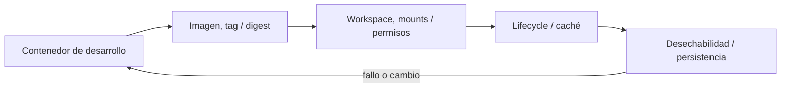

# SE-104 — Dev Containers y entornos desechables

[← SE-103 — Entornos virtuales y aislamiento de dependencias](../../classes/part-08-entornos-herramientas-y-depuracion/se-103-entornos-virtuales-y-aislamiento-de-dependencias/README.md) · [↑ Parte 08](../../classes/part-08-entornos-herramientas-y-depuracion/README.md) · [📚 Índice completo](../../classes/README.md) · [🌐 Portal](../../site/classes/SE-104.html) · [SE-105 — Reproducción de errores y reducción de casos →](../../classes/part-08-entornos-herramientas-y-depuracion/se-105-reproduccion-de-errores-y-reduccion-de-casos/README.md)


## Punto profesional y fundamento pedagógico

**Punto profesional.** La clase existe para declarar un entorno de desarrollo desechable por imagen, features, mounts y ciclo de vida.

**Por qué aparece aquí.** Se sitúa después de **Entornos virtuales y aislamiento de dependencias** y antes de **Reproducción de errores y reducción de casos**: convierte el conocimiento anterior en una decisión observable que la clase siguiente podrá reutilizar. La continuidad se comprueba en el artefacto, no por compartir vocabulario.

**Error conceptual que debe corregir.** Confundir reconstrucción con estado persistente o imagen con configuración completa.

**Secuencia de aprendizaje.** Antes de leer la solución, el estudiante predice el resultado del caso normal y del error conceptual anterior. Luego explica un caso resuelto paso a paso, construye un contraejemplo que cambie la decisión y, sin consultar el texto, reconstruye el mecanismo y lo aplica a una entrada nueva. La secuencia usa predicción, explicación propia, contraste y recuperación. [ICAP](https://icap.education.asu.edu/research) distingue participación de construcción de conocimiento; [How People Learn II](https://nap.nationalacademies.org/catalog/24783/how-people-learn-ii-learners-contexts-and-cultures) exige conectar conocimiento previo, contexto y transferencia; la [práctica de recuperación](https://pubmed.ncbi.nlm.nih.gov/16507066/) respalda producir de nuevo la explicación tras una demora; y [Education for Life and Work](https://nap.nationalacademies.org/resource/13398/dbasse_084153.pdf) exige devolución que explique la causa del error.

**Evidencia de aprendizaje.** Devcontainer-evidence.md con build, create, post-create, rebuild y limpieza. Debe contener predicción previa, observación, explicación causal, contraejemplo, criterio de aceptación y una nota de qué dato haría cambiar la conclusión.

**Límite de la conclusión.** La reproducibilidad depende también de imágenes y registros externos.

### Trazabilidad fuente → afirmación

| Fuente primaria u oficial | Afirmación que respalda | Lo que no prueba |
|---|---|---|
| [Development Container Specification](https://containers.dev/implementors/spec/) | Configuración reproducible de herramientas y ciclo de vida del contenedor; autoridad: Dev Container Specification maintainers | No demuestra por sí sola que el artefacto del estudiante sea correcto. |
| [Python venv](https://docs.python.org/3/library/venv.html) | Aislamiento de intérprete, scripts y entorno virtual; autoridad: Python Software Foundation | No demuestra por sí sola que el artefacto del estudiante sea correcto. |

## Antes de empezar

Esta clase continúa el **entorno reproducible de diagnóstico de la Parte 08**. Recupera la evidencia de la clase anterior, añade una decisión propia de **Dev Containers y entornos desechables** y deja un artefacto que la clase siguiente deberá consumir. La pregunta activa es: **¿Qué debe declarar un Dev Container para ser reconstruible, seguro y prescindible?**

## Prerrequisitos

- Haber completado la clase anterior o reconstruir su contrato y evidencia.
- Python 3.11 o posterior, terminal, editor y Git; un segundo runtime es opcional y debe declararse.
- Trabajar con fixtures sintéticos: ninguna observación necesita datos de una persona o sistema real.

## Problema auténtico

El entorno reproducible de diagnóstico funciona en un contenedor antiguo creado manualmente. Al reconstruir, una etiqueta flotante cambia herramientas y el bind mount expone credenciales del host.

## Objetivos observables

Al terminar podrás explicar los cinco mecanismos de esta clase, predecir su comportamiento antes de ejecutar, construir un caso normal y uno límite, diagnosticar el fallo controlado, comparar una alternativa y entregar evidencia que otra persona pueda reproducir.

## Mapa conceptual



El mapa se lee como una cadena de razonamiento, no como fases obligatorias del runtime. La flecha de retorno indica que un fallo o cambio de requisito obliga a revisar el modelo inicial; no autoriza a parchear solo la última salida.

## Temas y por qué importan

| Tema | Por qué cambia una decisión profesional | Evidencia mínima |
|---|---|---|
| Contenedor de desarrollo | Un dev container describe imagen, features, mounts, usuario, puertos y lifecycle para trabajar en un entorno aislado. | Predicción, traza causal y contraejemplo de **Contenedor de desarrollo** en `devcontainer-evidence.md` |
| Imagen, tag y digest | Una imagen aporta filesystem y metadata por capas. | Predicción, traza causal y contraejemplo de **Imagen, tag y digest** en `devcontainer-evidence.md` |
| Workspace, mounts y permisos | Bind mounts comparten archivos del host y heredan diferencias de permisos, case sensitivity y rendimiento. | Predicción, traza causal y contraejemplo de **Workspace, mounts y permisos** en `devcontainer-evidence.md` |
| Lifecycle y caché | Crear, iniciar y adjuntar disparan comandos distintos. | Predicción, traza causal y contraejemplo de **Lifecycle y caché** en `devcontainer-evidence.md` |
| Desechabilidad y persistencia | El contenedor debe poder borrarse sin perder código; volúmenes persistentes se enumeran y limpian con cuidado. | Predicción, traza causal y contraejemplo de **Desechabilidad y persistencia** en `devcontainer-evidence.md` |
## Conceptos y decisiones

### 1. Contenedor de desarrollo

Un dev container describe imagen, features, mounts, usuario, puertos y lifecycle para trabajar en un entorno aislado. Reutiliza tecnología de contenedores, pero su objetivo es experiencia de desarrollo, no demostrar paridad productiva.

### 2. Imagen, tag y digest

Una imagen aporta filesystem y metadata por capas. Un tag puede moverse; un digest identifica contenido. Fijar digest mejora repetibilidad, pero también exige proceso de actualización por seguridad. El Dockerfile o Containerfile documenta pasos propios.

### 3. Workspace, mounts y permisos

Bind mounts comparten archivos del host y heredan diferencias de permisos, case sensitivity y rendimiento. Montar socket del motor o home concede capacidades amplias. Se usa el mínimo y se prueba ownership de archivos generados.

### 4. Lifecycle y caché

Crear, iniciar y adjuntar disparan comandos distintos. Un `postCreate` debe poder repetirse o declarar efectos. Cache acelera builds, pero una reconstrucción sin cache ayuda a descubrir dependencia oculta.

### 5. Desechabilidad y persistencia

El contenedor debe poder borrarse sin perder código; volúmenes persistentes se enumeran y limpian con cuidado. Datos importantes viven en repositorio o backup explícito. `funciona en mi contenedor` sigue siendo local si nadie puede reconstruirlo.

## Definiciones de trabajo

- **contenedor de desarrollo:** un dev container describe imagen, features, mounts, usuario, puertos y lifecycle para trabajar en un entorno aislado.
- **imagen, tag y digest:** una imagen aporta filesystem y metadata por capas.
- **workspace, mounts y permisos:** bind mounts comparten archivos del host y heredan diferencias de permisos, case sensitivity y rendimiento.
- **lifecycle y caché:** crear, iniciar y adjuntar disparan comandos distintos.
- **desechabilidad y persistencia:** el contenedor debe poder borrarse sin perder código; volúmenes persistentes se enumeran y limpian con cuidado.

Las definiciones son operativas para el entorno reproducible de diagnóstico. No convierten términos con historia más amplia en sinónimos y deben contrastarse con la documentación primaria enlazada al final.

## Ejemplo mínimo

```json
{
  "name": "diagnostic_environment-algorithm_library",
  "image": "mcr.microsoft.com/devcontainers/python:3.12",
  "remoteUser": "vscode",
  "postCreateCommand": "python -m unittest -v"
}
```

Antes de ejecutar, predice estado, resultado y error. Después registra versión, comando y salida. Si el fragmento es pseudocódigo o pertenece a otro lenguaje, etiquétalo como tal y no afirmes que fue ejecutado.

## Ejemplo profesional

En el entorno reproducible de diagnóstico, una investigación conserva síntoma, entorno, reproducción, hipótesis, observaciones, causa, corrección y regresión. La implementación de esta clase debe conservar ese contrato aunque cambie la forma interna. El caso profesional no pregunta únicamente si produce una salida: pregunta quién puede producirla, qué estado observa, cómo falla y qué rastro permite disputar una decisión incorrecta.

Compara el caso normal con autorización falsa, evidencia incompleta, empate y repetición. Un mecanismo es apropiado cuando esas diferencias quedan visibles y localizadas; es peligroso cuando dependen de orden accidental, estado oculto o una convención que el consumidor no puede conocer.

## Práctica guiada

1. Copia el contrato de entrada y salida antes de escribir implementación.
2. Predice el caso normal y un límite; identifica la invariante que no puede romperse.
3. Implementa la versión mínima sin I/O dentro del núcleo.
4. Ejecuta el caso y conserva comando, versión y salida bajo `evidence/`.
5. Introduce el fallo controlado, reduce la reproducción y formula dos hipótesis rivales.
6. Corrige la causa, añade regresión y ejecuta el conjunto completo.
7. Compara con otro paradigma o lenguaje indicando qué semántica se preserva.

## Ejercicios

1. **Lectura:** dibuja una traza de cinco pasos y marca dónde cambia estado o control.
2. **Construcción:** añade una observación que refute una hipótesis sin cambiar simultáneamente el sistema.
3. **Frontera:** cubre vacío, empate, no autorizado e inválido con resultados distintos.
4. **Contraste:** reescribe una pieza con otro modelo y explica una mejora y una pérdida.

## Reto verificable

Entrega implementación, fixtures, pruebas y un informe corto. Se aprueba si otra persona ejecuta desde checkout limpio, obtiene los mismos resultados y puede relacionar cada rama o transformación con una regla del dominio. No se aprueba por cantidad de archivos ni por usar la sintaxis característica del paradigma.

## Caso conductor

El entorno reproducible de diagnóstico parte de una inversión de empates en la biblioteca de estructuras y algoritmos, captura versión y entrada mínima, compara un entorno sano con uno afectado y conserva la primera divergencia observable. Cambia después una sola regla o condición y revisa qué archivos, pruebas y trazas debieron modificarse. Esa superficie de cambio alimenta el proyecto final de la parte.

## Preguntas frecuentes

### ¿Una técnica o herramienta determina toda la arquitectura?

No. Puede organizar un núcleo o una frontera sin dominar el sistema completo. Combinar técnicas es válido si las fronteras preservan identidad, orden, errores y evidencia.

### ¿Más automatización o menos líneas significan una solución mejor?

No. La brevedad puede quitar duplicación o esconder decisiones. Se evalúan semántica, diagnóstico, costo de cambio y adecuación a la carga.

### ¿Debo instalar todas las herramientas mencionadas?

No. Instala solo lo necesario para la práctica elegida. Registra versión y comandos; si solo analizas una notación o salida, decláralo como análisis no ejecutado.

## Fallo controlado y diagnóstico

Monta el socket del motor para resolver un comando y observa la ampliación de privilegios. Elimina el mount o documenta una alternativa aislada; valida desde rebuild sin cache.

Registra síntoma, entrada mínima, hipótesis, observación que descarta cada hipótesis, causa, corrección y prueba de regresión. No cambies simultáneamente implementación, fixture y expectativa.

## Errores comunes y cómo corregirlos

| Síntoma | Causa probable | Corrección |
|---|---|---|
| dos pruebas aisladas pasan y juntas fallan | estado o dependencia compartida | aislar propietario y reiniciar fixture |
| implementación corta pero opaca | semántica delegada sin contrato | documentar transición, error y orden |
| modelos “equivalentes” divergen | fixtures normalizan diferencias reales | comparar contrato antes de presentación |
| reintento duplica resultado | efecto sin identidad ni idempotencia | correlacionar y probar repetición |
| diagrama y código cuentan historias distintas | visual ornamental o desactualizado | trazar el mismo caso en ambos |

## Entorno y archivos clave

```text
work/SE-104/
├── README.md
├── diagnostic_environment/
│   ├── domain.py
│   └── se_104.py
├── fixtures/cases.json
├── tests/test_se_104.py
└── evidence/diagnosis.md
```

El `README` declara plataforma, runtimes, comandos, limpieza y límites. Evita dependencias externas cuando la biblioteca estándar permita observar el mecanismo; si agregas una, fija procedencia y versión.

## Seguridad, ética y accesibilidad

- la autorización forma parte del dominio y no se infiere por ausencia de rechazo;
- no uses `eval`, reglas descargadas ni serialización insegura;
- limita colas, recursión, tamaño de entrada y tiempo de evaluación;
- redacta trazas y conserva una explicación textual además de color o animación;
- una recomendación automatizada debe poder revisarse, impugnarse y corregirse;
- respeta licencias de ejemplos y atribuye adaptaciones.

## Transferencia

Traslada un fixture al segundo modelo, herramienta, plataforma o lenguaje. Compara representación de ausencia, error, mutabilidad, orden y cancelación. La transferencia está lograda cuando el contrato se conserva y las diferencias están explicadas, no cuando la interfaz se parece.

## Evaluación y evidencia

| Criterio | Evidencia para aprobar |
|---|---|
| comprensión | explicación causal de los cinco mecanismos |
| corrección | normal, límite, inválido y contraejemplo |
| diseño | estado, efectos y contrato localizables |
| diagnóstico | reproducción mínima y regresión |
| transferencia | comparación semántica, no estética |
| reproducibilidad | versiones, comandos, salida y límites |


## Fuentes


- [Language Server Protocol 3.18](https://microsoft.github.io/language-server-protocol/specifications/lsp/3.18/specification/) — Mensajes, capacidades y sincronización entre editor y servidor; autoridad: Microsoft.
- [Debug Adapter Protocol](https://microsoft.github.io/debug-adapter-protocol/) — Breakpoints, frames, variables y negociación de capacidades; autoridad: Microsoft.
- [Python Debugging and Profiling](https://docs.python.org/3/library/debug.html) — Pdb, cprofile, timeit, tracemalloc y límites instrumentales; autoridad: Python Software Foundation.
- [Python venv](https://docs.python.org/3/library/venv.html) — Aislamiento de intérprete, scripts y entorno virtual; autoridad: Python Software Foundation.
- [Development Container Specification](https://containers.dev/implementors/spec/) — Configuración reproducible de herramientas y ciclo de vida del contenedor; autoridad: Dev Container Specification maintainers.
- [Web Content Accessibility Guidelines 2.2](https://www.w3.org/TR/WCAG22/) — Percepción, operación por teclado y reducción de barreras en interfaces; autoridad: W3C.

Cada fuente respalda el mecanismo indicado; ninguna demuestra que la implementación del entorno reproducible de diagnóstico sea correcta. Esa afirmación depende de fixtures, pruebas, trazas y revisión reproducible.

## Límites y siguiente paso

Un contenedor estable no reduce automáticamente un fallo. La siguiente clase aplica delta debugging manual y control de variables para obtener un caso mínimo.

## Glosario

- **contenedor de desarrollo:** un dev container describe imagen, features, mounts, usuario, puertos y lifecycle para trabajar en un entorno aislado.
- **imagen, tag y digest:** una imagen aporta filesystem y metadata por capas.
- **workspace, mounts y permisos:** bind mounts comparten archivos del host y heredan diferencias de permisos, case sensitivity y rendimiento.
- **lifecycle y caché:** crear, iniciar y adjuntar disparan comandos distintos.
- **desechabilidad y persistencia:** el contenedor debe poder borrarse sin perder código; volúmenes persistentes se enumeran y limpian con cuidado.

---

[← SE-103 — Entornos virtuales y aislamiento de dependencias](../../classes/part-08-entornos-herramientas-y-depuracion/se-103-entornos-virtuales-y-aislamiento-de-dependencias/README.md) · [↑ Parte 08](../../classes/part-08-entornos-herramientas-y-depuracion/README.md) · [📚 Índice completo](../../classes/README.md) · [🌐 Portal](../../site/classes/SE-104.html) · [SE-105 — Reproducción de errores y reducción de casos →](../../classes/part-08-entornos-herramientas-y-depuracion/se-105-reproduccion-de-errores-y-reduccion-de-casos/README.md)
