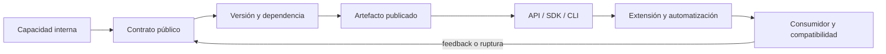

# Parte 09 — Bibliotecas, paquetes, SDK y automatización

Orbe resolvió estructuras y Lupa hizo reproducible su diagnóstico. Constelación convierte esa capacidad en un paquete con API, SDK y CLI. La parte sigue al consumidor: descubre el producto, instala dependencias, ejecuta un primer caso, automatiza, amplía con plugins y actualiza. Cada paso hace visible compatibilidad, procedencia, error y recuperación.

## Pregunta rectora

> ¿Qué contrato consume otra persona y qué evidencia demuestra que una nueva versión no la rompe?

## Antes del recorrido clase por clase

Esta parte no presenta paradigmas como etiquetas ni como una competencia de sintaxis. Cada clase vuelve sobre **Constelación**, mantiene un contrato común y cambia deliberadamente el modelo de estado, control, composición o tiempo. Así puede distinguirse una diferencia semántica de una diferencia accidental del lenguaje.

El diagrama muestra la progresión del razonamiento, no una arquitectura recomendada. Las pruebas comunes impiden declarar equivalencia por parecido visual; el retorno obliga a revalidar cuando cambia el contrato.

## Resultados acumulativos

Podrás distinguir biblioteca, framework, runtime, plataforma y SDK; declarar una API pública; razonar SemVer y resolución; construir y publicar paquetes; diseñar CLI y scripts idempotentes; aislar plugins y generación; verificar licencias, procedencia y experiencia de desarrollador con pruebas desde el consumidor.

Al finalizar podrás justificar una combinación, señalar adaptadores y pérdidas, y rechazar una elección que no se sostenga ante casos límite o costo operativo.

## Prerrequisitos enlazados

- [Parte 4 — Pensamiento computacional](../../classes/part-04-pensamiento-computacional-y-resolucion-de-problemas/): modelado, invariantes, corrección y complejidad.
- [Parte 5 — Fundamentos de programación](../../classes/part-05-fundamentos-de-programacion/): valores, control, funciones, errores, pruebas y Brújula.
- Python 3.11+, Git y terminal; runtimes adicionales son opcionales y deben declararse.

## Bloques y progresión

1. **Producto reusable y contrato:** las clases 109–112 delimitan producto, contrato, versión, resolución y publicación.
2. **Distribución e interfaz:** las clases 113–114 diseñan CLI, configuración y automatización idempotente.
3. **Extensión y procedencia:** las clases 115–117 gobiernan extensiones, generación, licencias y procedencia.
4. **Experiencia y compatibilidad:** las clases 118–120 prueban DX, empaquetan y verifican SDK+CLI entre versiones.

## Recorrido clase por clase

| Clase | Capacidad que construye | Pregunta que resuelve | Evidencia acumulativa |
|---|---|---|---|
| [SE-109](../../classes/part-09-bibliotecas-paquetes-sdk-y-automatizacion/se-109-biblioteca-framework-runtime-plataforma-y-sdk/) | Biblioteca, framework, runtime, plataforma y SDK | ¿Qué papel cumple cada capa reusable y quién controla el flujo? | Evidencia reproducible para Constelación |
| [SE-110](../../classes/part-09-bibliotecas-paquetes-sdk-y-automatizacion/se-110-semver-compatibilidad-y-contratos-publicos/) | SemVer, compatibilidad y contratos públicos | ¿Qué constituye la API pública y cuándo un cambio exige migración? | Evidencia reproducible para Constelación |
| [SE-111](../../classes/part-09-bibliotecas-paquetes-sdk-y-automatizacion/se-111-resolucion-de-dependencias-y-lockfiles/) | Resolución de dependencias y lockfiles | ¿Cómo convierte un resolvedor restricciones declaradas en una instalación concreta? | Evidencia reproducible para Constelación |
| [SE-112](../../classes/part-09-bibliotecas-paquetes-sdk-y-automatizacion/se-112-paquetes-modulos-y-publicacion/) | Paquetes, módulos y publicación | ¿Qué transforma un árbol fuente en artefactos instalables, inmutables y verificables? | Evidencia reproducible para Constelación |
| [SE-113](../../classes/part-09-bibliotecas-paquetes-sdk-y-automatizacion/se-113-cli-flags-configuracion-y-codigos-de-salida/) | CLI, flags, configuración y códigos de salida | ¿Cómo diseñar una CLI consumible por personas y automatizaciones sin mezclar datos con diagnóstico? | Evidencia reproducible para Constelación |
| [SE-114](../../classes/part-09-bibliotecas-paquetes-sdk-y-automatizacion/se-114-scripting-repetible-y-tareas-idempotentes/) | Scripting repetible y tareas idempotentes | ¿Qué debe ocurrir al ejecutar una automatización dos veces, interrumpirla o retomarla? | Evidencia reproducible para Constelación |
| [SE-115](../../classes/part-09-bibliotecas-paquetes-sdk-y-automatizacion/se-115-plugins-extensiones-y-puntos-de-integracion/) | Plugins, extensiones y puntos de integración | ¿Cómo ampliar un sistema sin convertir cada extensión en dependencia privilegiada e incompatible? | Evidencia reproducible para Constelación |
| [SE-116](../../classes/part-09-bibliotecas-paquetes-sdk-y-automatizacion/se-116-generacion-de-codigo-y-metaprogramacion/) | Generación de código y metaprogramación | ¿Cuándo generar código reduce duplicación y cuándo crea una segunda fuente imposible de reconciliar? | Evidencia reproducible para Constelación |
| [SE-117](../../classes/part-09-bibliotecas-paquetes-sdk-y-automatizacion/se-117-licencias-procedencia-y-reutilizacion/) | Licencias, procedencia y reutilización | ¿Qué derecho permite reutilizar cada componente y qué evidencia conserva su procedencia? | Evidencia reproducible para Constelación |
| [SE-118](../../classes/part-09-bibliotecas-paquetes-sdk-y-automatizacion/se-118-diseno-de-experiencia-para-desarrolladores/) | Diseño de experiencia para desarrolladores | ¿Qué fricción encuentra una persona desde el primer contacto hasta diagnosticar y migrar? | Evidencia reproducible para Constelación |
| [SE-119](../../classes/part-09-bibliotecas-paquetes-sdk-y-automatizacion/se-119-taller-empaquetar-una-capacidad-reusable/) | Taller: empaquetar una capacidad reusable | ¿Cómo demostrar que una capacidad reusable sobrevive a build, instalación y uso externo? | Evidencia reproducible para Constelación |
| [SE-120](../../classes/part-09-bibliotecas-paquetes-sdk-y-automatizacion/se-120-proyecto-sdk-y-cli-con-compatibilidad-verificada/) | Proyecto: SDK y CLI con compatibilidad verificada | ¿Qué conjunto mínimo de artefactos y pruebas sostiene un SDK y CLI listos para consumidores reales? | Evidencia reproducible para Constelación |

## Proyecto integrador

El proyecto **SE-120** entrega un corpus versionado, al menos dos implementaciones ejecutables, pruebas contractuales compartidas, propiedades, trazas comparables y un informe de decisión para dos cargas distintas. No existe un ganador universal: la recomendación debe vincular fuerzas, evidencia, consecuencias y condición de reversión.

## Criterios de salida

- las doce clases explican todos sus temas mediante mecanismos, ejemplos y límites;
- cada implementación conserva autorización, explicación y errores del contrato;
- el corpus cubre normal, límite, inválido, empate, repetición y secuencia;
- las métricas separan lenguaje, runtime, paradigma y entorno;
- otra persona reproduce comandos y resultados desde checkout limpio;
- el informe declara lo observado, lo inferido y lo no ejecutado.

## Preguntas de control por bloque

- ¿Dónde vive el estado y quién puede cambiarlo?
- ¿Qué estrategia ejecuta una descripción declarativa o una consulta lógica?
- ¿Qué ocurre cuando productor, consumidor y cancelación avanzan a ritmos distintos?
- ¿Qué evidencia cambiaría la elección de paradigma?

## Fuentes de la parte

- [Semantic Versioning 2.0.0](https://semver.org/spec/v2.0.0.html) — API pública, versiones, prereleases y compatibilidad declarada; autoridad: Semantic Versioning project.
- [Python Packaging User Guide: Specifications](https://packaging.python.org/en/latest/specifications/) — metadata, nombres, versiones, dependencias y artefactos de distribución; autoridad: Python Packaging Authority.
- [pylock.toml Specification](https://packaging.python.org/en/latest/specifications/pylock-toml/) — lock files para instalaciones reproducibles y selección por entorno; autoridad: Python Packaging Authority.
- [Python Standard Library](https://docs.python.org/3/library/index.html) — argparse, importlib.metadata, subprocess y APIs de automatización; autoridad: Python Software Foundation.
- [SPDX Specification 3.0](https://spdx.dev/use/specifications/) — identificadores, SBOM y procedencia legible por máquinas; autoridad: Linux Foundation.
- [REUSE Specification](https://reuse.software/spec-3.3/) — declaración inequívoca y verificable de copyright y licencias por archivo; autoridad: Free Software Foundation Europe.

Las fuentes se vinculan también dentro de cada clase. Definen semántica y mecanismos; la adecuación de Constelación se demuestra con el caso, las pruebas y la comparación.
