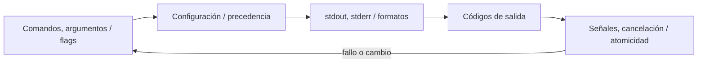

# SE-113 — CLI, flags, configuración y códigos de salida

[← SE-112 — Paquetes, módulos y publicación](../../classes/part-09-bibliotecas-paquetes-sdk-y-automatizacion/se-112-paquetes-modulos-y-publicacion/README.md) · [↑ Parte 09](../../classes/part-09-bibliotecas-paquetes-sdk-y-automatizacion/README.md) · [📚 Índice completo](../../classes/README.md) · [🌐 Portal](../../site/classes/SE-113.html) · [SE-114 — Scripting repetible y tareas idempotentes →](../../classes/part-09-bibliotecas-paquetes-sdk-y-automatizacion/se-114-scripting-repetible-y-tareas-idempotentes/README.md)

> Estado: **GUIDED** · Clase desarrollada y revisada cualitativamente.

## Antes de empezar

Esta clase continúa **Constelación**, el caso conductor de la Parte 09. Recupera la evidencia de la clase anterior, añade una decisión propia de **CLI, flags, configuración y códigos de salida** y deja un artefacto que la clase siguiente deberá consumir. La pregunta activa es: **¿Cómo diseñar una CLI consumible por personas y automatizaciones sin mezclar datos con diagnóstico?**

## Prerrequisitos

- Haber completado la clase anterior o reconstruir su contrato y evidencia.
- Python 3.11 o posterior, terminal, editor y Git; un segundo runtime es opcional y debe declararse.
- Trabajar con fixtures sintéticos: ninguna observación necesita datos de una persona o sistema real.

## Problema auténtico

La CLI imprime progreso y JSON en stdout, acepta flag y variable con precedencia implícita y devuelve cero aunque falle un plugin. Scripts consumidores no pueden distinguir éxito parcial.

## Objetivos observables

Al terminar podrás explicar los cinco mecanismos de esta clase, predecir su comportamiento antes de ejecutar, construir un caso normal y uno límite, diagnosticar el fallo controlado, comparar una alternativa y entregar evidencia que otra persona pueda reproducir.

## Mapa conceptual



El mapa se lee como una cadena de razonamiento, no como fases obligatorias del runtime. La flecha de retorno indica que un fallo o cambio de requisito obliga a revisar el modelo inicial; no autoriza a parchear solo la última salida.

## Temas y por qué importan

| Tema | Por qué cambia una decisión profesional | Evidencia mínima |
|---|---|---|
| Comandos, argumentos y flags | Un comando expresa acción; argumentos suelen identificar operandos y flags modifican comportamiento. | Evidencia o contraejemplo registrado |
| Configuración y precedencia | Defaults, archivo, entorno y CLI necesitan orden documentado y opción de explicar valor efectivo sin revelar secreto. | Evidencia o contraejemplo registrado |
| stdout, stderr y formatos | stdout transporta resultado consumible; stderr contiene diagnóstico. | Evidencia o contraejemplo registrado |
| Códigos de salida | Cero indica éxito contractual; valores no cero clasifican uso inválido, datos rechazados, dependencia fallida o error interno según matriz publicada. | Evidencia o contraejemplo registrado |
| Señales, cancelación y atomicidad | Ctrl+C solicita cancelación y debe limpiar archivos temporales o dejar estado recuperable. | Evidencia o contraejemplo registrado |

## Conceptos y decisiones

### 1. Comandos, argumentos y flags

Un comando expresa acción; argumentos suelen identificar operandos y flags modifican comportamiento. Nombres, defaults y ayuda forman contrato. Flags booleanos deben permitir intención inequívoca y no interpretar `false` textual mediante truthiness.

### 2. Configuración y precedencia

Defaults, archivo, entorno y CLI necesitan orden documentado y opción de explicar valor efectivo sin revelar secreto. Configuración inválida falla antes de producir efectos. Ausencia, vacío y cero se distinguen.

### 3. stdout, stderr y formatos

stdout transporta resultado consumible; stderr contiene diagnóstico. Modo humano y JSON pueden coexistir de forma explícita. Un esquema/version de salida evita que cambiar redacción rompa parsers.

### 4. Códigos de salida

Cero indica éxito contractual; valores no cero clasifican uso inválido, datos rechazados, dependencia fallida o error interno según matriz publicada. El código no transporta detalle completo; stderr o JSON estructurado lo complementan.

### 5. Señales, cancelación y atomicidad

Ctrl+C solicita cancelación y debe limpiar archivos temporales o dejar estado recuperable. Escribir a temporal y reemplazar reduce parciales. Capturar toda excepción para devolver cero destruye observabilidad.

## Definiciones de trabajo

- **comandos, argumentos y flags:** un comando expresa acción; argumentos suelen identificar operandos y flags modifican comportamiento.
- **configuración y precedencia:** defaults, archivo, entorno y cli necesitan orden documentado y opción de explicar valor efectivo sin revelar secreto.
- **stdout, stderr y formatos:** stdout transporta resultado consumible; stderr contiene diagnóstico.
- **códigos de salida:** cero indica éxito contractual; valores no cero clasifican uso inválido, datos rechazados, dependencia fallida o error interno según matriz publicada.
- **señales, cancelación y atomicidad:** ctrl+c solicita cancelación y debe limpiar archivos temporales o dejar estado recuperable.

Las definiciones son operativas para Constelación. No convierten términos con historia más amplia en sinónimos y deben contrastarse con la documentación primaria enlazada al final.

## Ejemplo mínimo

```shell
constellation choose --input cases.json --format json
constellation config explain --redact
# stdout: resultado; stderr: diagnóstico; códigos documentados.
```

Antes de ejecutar, predice estado, resultado y error. Después registra versión, comando y salida. Si el fragmento es pseudocódigo o pertenece a otro lenguaje, etiquétalo como tal y no afirmes que fue ejecutado.

## Ejemplo profesional

En Constelación, un release contiene contrato público, artefactos inmutables, dependencias, procedencia, ejemplos, errores y ruta de migración. La implementación de esta clase debe conservar ese contrato aunque cambie la forma interna. El caso profesional no pregunta únicamente si produce una salida: pregunta quién puede producirla, qué estado observa, cómo falla y qué rastro permite disputar una decisión incorrecta.

Compara el caso normal con autorización falsa, evidencia incompleta, empate y repetición. Un mecanismo es apropiado cuando esas diferencias quedan visibles y localizadas; es peligroso cuando dependen de orden accidental, estado oculto o una convención que el consumidor no puede conocer.

## Práctica guiada

1. Copia el contrato de entrada y salida antes de escribir implementación.
2. Predice el caso normal y un límite; identifica la invariante que no puede romperse.
3. Implementa la versión mínima sin I/O dentro del núcleo.
4. Ejecuta el caso y conserva comando, versión y salida bajo `evidence/`.
5. Introduce el fallo controlado, reduce la reproducción y formula dos hipótesis rivales.
6. Corrige la causa, añade regresión y ejecuta el conjunto completo.
7. Compara con otro paradigma o lenguaje indicando qué semántica se preserva.

## Ejercicios

1. **Lectura:** dibuja una traza de cinco pasos y marca dónde cambia estado o control.
2. **Construcción:** añade una capacidad pública y prueba el comportamiento desde un proyecto consumidor.
3. **Frontera:** cubre vacío, empate, no autorizado e inválido con resultados distintos.
4. **Contraste:** reescribe una pieza con otro modelo y explica una mejora y una pérdida.

## Reto verificable

Entrega implementación, fixtures, pruebas y un informe corto. Se aprueba si otra persona ejecuta desde checkout limpio, obtiene los mismos resultados y puede relacionar cada rama o transformación con una regla del dominio. No se aprueba por cantidad de archivos ni por usar la sintaxis característica del paradigma.

## Caso conductor

Constelación empaqueta el motor de Orbe como `constellation`, expone `choose_next`, una CLI y un punto de extensión. Ejecuta instalación limpia, entrada válida, configuración ausente, plugin incompatible y actualización entre dos versiones. Cambia después una sola regla o condición y revisa qué archivos, pruebas y trazas debieron modificarse. Esa superficie de cambio alimenta el proyecto final de la parte.

## Preguntas frecuentes

### ¿Una técnica o herramienta determina toda la arquitectura?

No. Puede organizar un núcleo o una frontera sin dominar el sistema completo. Combinar técnicas es válido si las fronteras preservan identidad, orden, errores y evidencia.

### ¿Más automatización o menos líneas significan una solución mejor?

No. La brevedad puede quitar duplicación o esconder decisiones. Se evalúan semántica, diagnóstico, costo de cambio y adecuación a la carga.

### ¿Debo instalar todas las herramientas mencionadas?

No. Instala solo lo necesario para la práctica elegida. Registra versión y comandos; si solo analizas una notación o salida, decláralo como análisis no ejecutado.

## Fallo controlado y diagnóstico

Envía un warning a stdout antes del JSON. El consumidor falla al parsear. Mueve diagnóstico a stderr y prueba streams por separado.

Registra síntoma, entrada mínima, hipótesis, observación que descarta cada hipótesis, causa, corrección y prueba de regresión. No cambies simultáneamente implementación, fixture y expectativa.

## Errores comunes y cómo corregirlos

| Síntoma | Causa probable | Corrección |
|---|---|---|
| dos pruebas aisladas pasan y juntas fallan | estado o dependencia compartida | aislar propietario y reiniciar fixture |
| implementación corta pero opaca | semántica delegada sin contrato | documentar transición, error y orden |
| modelos “equivalentes” divergen | fixtures normalizan diferencias reales | comparar contrato antes de presentación |
| reintento duplica resultado | efecto sin identidad ni idempotencia | correlacionar y probar repetición |
| diagrama y código cuentan historias distintas | visual ornamental o desactualizado | trazar el mismo caso en ambos |

## Entorno y archivos clave

```text
work/SE-113/
├── README.md
├── constelación/
│   ├── domain.py
│   └── se_113.py
├── fixtures/cases.json
├── tests/test_se_113.py
└── evidence/diagnosis.md
```

El `README` declara plataforma, runtimes, comandos, limpieza y límites. Evita dependencias externas cuando la biblioteca estándar permita observar el mecanismo; si agregas una, fija procedencia y versión.

## Seguridad, ética y accesibilidad

- la autorización forma parte del dominio y no se infiere por ausencia de rechazo;
- no uses `eval`, reglas descargadas ni serialización insegura;
- limita colas, recursión, tamaño de entrada y tiempo de evaluación;
- redacta trazas y conserva una explicación textual además de color o animación;
- una recomendación automatizada debe poder revisarse, impugnarse y corregirse;
- respeta licencias de ejemplos y atribuye adaptaciones.

## Transferencia

Traslada un fixture al segundo modelo, herramienta, plataforma o lenguaje. Compara representación de ausencia, error, mutabilidad, orden y cancelación. La transferencia está lograda cuando el contrato se conserva y las diferencias están explicadas, no cuando la interfaz se parece.

## Evaluación y evidencia

| Criterio | Evidencia para aprobar |
|---|---|
| comprensión | explicación causal de los cinco mecanismos |
| corrección | normal, límite, inválido y contraejemplo |
| diseño | estado, efectos y contrato localizables |
| diagnóstico | reproducción mínima y regresión |
| transferencia | comparación semántica, no estética |
| reproducibilidad | versiones, comandos, salida y límites |

Los snippets no elevan la clase a `EXECUTABLE` o `TESTED`: esos estados requieren artefactos versionados y ejecuciones verificadas fuera de la guía.

## Fuentes

- [Semantic Versioning 2.0.0](https://semver.org/spec/v2.0.0.html) — Api pública, versiones, prereleases y compatibilidad declarada; autoridad: Semantic Versioning project.
- [Python Packaging User Guide: Specifications](https://packaging.python.org/en/latest/specifications/) — Metadata, nombres, versiones, dependencias y artefactos de distribución; autoridad: Python Packaging Authority.
- [pylock.toml Specification](https://packaging.python.org/en/latest/specifications/pylock-toml/) — Lock files para instalaciones reproducibles y selección por entorno; autoridad: Python Packaging Authority.
- [Python Standard Library](https://docs.python.org/3/library/index.html) — Argparse, importlib.metadata, subprocess y apis de automatización; autoridad: Python Software Foundation.
- [SPDX Specification 3.0](https://spdx.dev/use/specifications/) — Identificadores, sbom y procedencia legible por máquinas; autoridad: Linux Foundation.
- [REUSE Specification](https://reuse.software/spec-3.3/) — Declaración inequívoca y verificable de copyright y licencias por archivo; autoridad: Free Software Foundation Europe.

Cada fuente respalda el mecanismo indicado; ninguna demuestra que la implementación de Constelación sea correcta. Esa afirmación depende de fixtures, pruebas, trazas y revisión reproducible.

## Límites y siguiente paso

Una CLI clara puede ejecutar efectos repetidos de forma peligrosa. La siguiente clase diseña scripts idempotentes, precondiciones y recuperación.

## Glosario

- **comandos, argumentos y flags:** un comando expresa acción; argumentos suelen identificar operandos y flags modifican comportamiento.
- **configuración y precedencia:** defaults, archivo, entorno y cli necesitan orden documentado y opción de explicar valor efectivo sin revelar secreto.
- **stdout, stderr y formatos:** stdout transporta resultado consumible; stderr contiene diagnóstico.
- **códigos de salida:** cero indica éxito contractual; valores no cero clasifican uso inválido, datos rechazados, dependencia fallida o error interno según matriz publicada.
- **señales, cancelación y atomicidad:** ctrl+c solicita cancelación y debe limpiar archivos temporales o dejar estado recuperable.

---

[← SE-112 — Paquetes, módulos y publicación](../../classes/part-09-bibliotecas-paquetes-sdk-y-automatizacion/se-112-paquetes-modulos-y-publicacion/README.md) · [↑ Parte 09](../../classes/part-09-bibliotecas-paquetes-sdk-y-automatizacion/README.md) · [📚 Índice completo](../../classes/README.md) · [🌐 Portal](../../site/classes/SE-113.html) · [SE-114 — Scripting repetible y tareas idempotentes →](../../classes/part-09-bibliotecas-paquetes-sdk-y-automatizacion/se-114-scripting-repetible-y-tareas-idempotentes/README.md)
