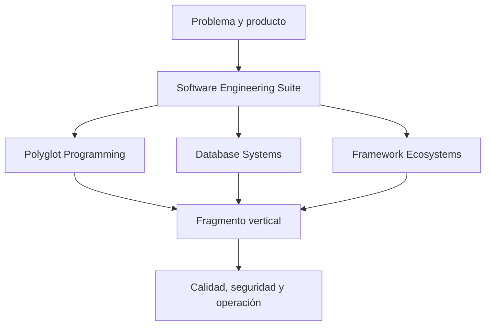

# Arquitectura de la suite

## Función del integrador

La suite define el ciclo: necesidad → requisitos → diseño → construcción → pruebas → entrega → operación → aprendizaje. Los repositorios especializados resuelven profundidad y comparación en su área.

## Artefactos compartidos

- productos y dominios canónicos;
- contratos externos;
- atributos de calidad;
- ADR;
- criterios de aceptación;
- estrategia de pruebas;
- modelo de amenazas;
- telemetría y SLO;
- evidencia de recuperación;
- rúbrica de portafolio.

## Anticorrupción pedagógica

Cada repositorio puede usar su vocabulario, pero la integración traduce a resultados observables. Una “entidad” de ORM, un documento y una entidad de dominio no se fusionan por comodidad.

## Versionado

El manifiesto posee versión de esquema. Los contratos canónicos se versionan cuando cambia semántica. Las rutas formativas pueden evolucionar sin fijar herramientas, mientras los laboratorios registran sus versiones verificadas.

## Ruta de validación

Cada repositorio valida localmente. Un cambio transversal se considera integrado solo después de ejecutar las validaciones de todos los propietarios afectados.
