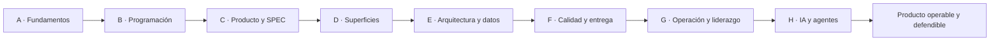

# Arquitectura del programa profesional

Estado: **fases 3 y 4 en reconstrucción cualitativa** · Línea base: **2026-09-30**

## Propósito

La suite forma a una persona para descubrir, especificar, construir, verificar,
entregar, operar, recuperar y evolucionar productos de software. No es un catálogo
de tecnologías ni un conjunto de textos desconectados: cada clase debe producir una
decisión, práctica o evidencia reutilizable en un producto.

## Escala canónica

`curriculum.yaml` es la vista generada del programa y `catalog.json` publica sus
conteos actuales. La fuente editable está en `scripts/build_program_blueprint.py`.

| Elemento | Cantidad | Estado en fase 1 |
| --- | ---: | --- |
| Etapas | 8 | especificadas |
| Partes | 40 | especificadas |
| Clases | 480 | 120 `GUIDED`; 240 borradores de fases 3–4; 120 scaffolds |
| Clases por parte | 12 | 10 núcleo + taller + proyecto |
| Horas estimadas | 2.160 | sujetas a validación al construir contenido |

Las cifras no significan que las clases estén escritas. Una clase solo podrá pasar
de `PLANNED` a `GUIDED`, `EXECUTABLE`, `TESTED`, `INTEGRATED` u `OPERABLE` cuando
exista la evidencia correspondiente.

## Ocho etapas

1. **Fundamentos de la profesión:** disciplina, computadores, sistemas operativos,
   redes y resolución de problemas.
2. **Programación y construcción:** fundamentos, paradigmas, algoritmos, entornos,
   paquetes y automatización.
3. **Producto, requisitos y especificación:** descubrimiento, economía, requisitos,
   contratos, UX, procesos, colaboración y documentación.
4. **Superficies y formas de software:** CLI, web, backend, móvil, escritorio,
   embedded, IoT y dominios especializados.
5. **Diseño, arquitectura, datos e integración:** patrones, arquitectura, datos,
   eventos, distribución y cloud.
6. **Calidad, seguridad y entrega:** pruebas, calidad, resiliencia, seguridad,
   supply chain y CI/CD.
7. **Operación, evolución y liderazgo:** observabilidad, SRE, incidentes, legacy,
   gestión y práctica profesional.
8. **Ingeniería nativa con IA:** asistencia, contexto, evaluaciones, SPEC, agentes,
   MCP, multiagente, seguridad y gobernanza.

## Contrato de una parte

Cada parte contiene doce clases:

- clases 1–10: conceptos y prácticas nucleares;
- clase 11: taller de diagnóstico o integración;
- clase 12: proyecto que produce evidencia de portafolio.

Una parte define prerrequisitos, competencias, proyecto, fuentes y criterio de
salida. Su proyecto debe reutilizar al menos dos clases anteriores y alimentar un
producto persistente del programa.

## Contrato de una clase

Una clase construida debe contener:

1. metadatos y prerrequisitos;
2. problema auténtico y objetivos observables;
3. conceptos con límites y vocabulario;
4. explicación y decisiones profesionales;
5. ejemplo mínimo y ejemplo aplicado;
6. práctica guiada;
7. tres ejercicios graduados;
8. fallo controlado y diagnóstico;
9. archivos clave y mapa del entorno;
10. seguridad, privacidad, accesibilidad y ética aplicables;
11. reto de transferencia;
12. autoevaluación y evidencia de portafolio;
13. fuentes primarias u oficiales con fecha;
14. límites honestos y siguiente paso.

La presencia mecánica de estos encabezados no basta. La revisión cualitativa y el
gate de aprobación están definidos en
[`PEDAGOGICAL-STANDARD.md`](PEDAGOGICAL-STANDARD.md).

Cuando exista código, la carpeta de clase podrá incorporar `starter/`, `solution/`,
`examples/`, `exercises/`, `tests/`, `fixtures/` y `evidence/`. Una clase conceptual
debe aportar una actividad verificable en lugar de código artificial.

## Estados de madurez

| Estado | Evidencia mínima |
| --- | --- |
| `PLANNED` | título, ubicación y propósito aprobados |
| `GUIDED` | explicación, práctica, ejercicios y fuentes completas |
| `EXECUTABLE` | ejemplos o laboratorio reproducibles |
| `TESTED` | comprobaciones automáticas o rúbrica aplicada |
| `INTEGRATED` | participa en un producto transversal |
| `OPERABLE` | incluye telemetría, recuperación y runbook cuando aplica |

Los estados son acumulativos. No toda clase necesita llegar a `OPERABLE`, pero los
proyectos finales y los sistemas con estado sí.

## Entornos soportados

El núcleo documental es multiplataforma. Cada práctica declara su compatibilidad
real con Windows, macOS y Linux. Cuando la portabilidad nativa no sea razonable,
debe ofrecerse una ruta reproducible mediante contenedor, Dev Container, WSL o
simulación, sin afirmar que una ruta no ejecutada está soportada.

## Productos persistentes

Se mantienen seis dominios: educación, comercio, finanzas, plataforma social,
control de agentes y suite familiar privada. Cada etapa introduce versiones nuevas,
fallos y decisiones sobre los mismos dominios para mostrar evolución, no ejercicios
aislados.

## Criterio de término de la expansión

La expansión no termina al crear carpetas. Requiere 480 clases completas, fuentes
resueltas, ejercicios, entornos documentados, proyectos integrados, portal navegable,
validación automática, accesibilidad y una declaración verificable de lo ejecutado.
