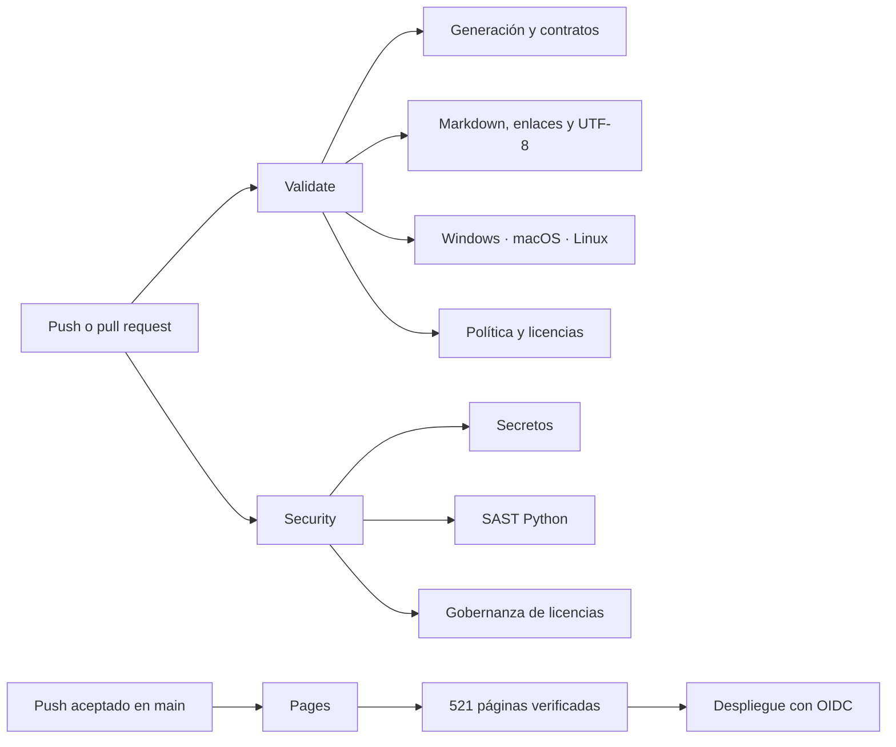

# Arquitectura de workflows

Este documento define qué debe demostrar la automatización del programa. La
referencia de alcance es el Programa de Ciberseguridad Moderna; la implementación se
adapta a este repositorio y no copia jobs para una aplicación Android, contenedores o
artefactos de release que aquí no existen.

## Topología



## Responsabilidades y límites

| Workflow | Disparadores | Evidencia producida | No afirma |
| --- | --- | --- | --- |
| [`validate.yml`](../.github/workflows/validate.yml) | push a `main`, pull request y ejecución manual | salidas generadas al día, contratos de 480 clases, pruebas, Markdown estructural, enlaces, UTF-8, portabilidad y políticas | que el contenido sea pedagógicamente profundo sólo porque compila |
| [`security.yml`](../.github/workflows/security.yml) | push a `main`, pull request, lunes semanal y ejecución manual | árbol sin secretos detectados, scripts sin hallazgos Bandit medios/altos y sistema de licencias coherente | pentest, ausencia total de vulnerabilidades ni revisión jurídica |
| [`pages.yml`](../.github/workflows/pages.yml) | cambios en fuentes publicables de `main` y ejecución manual | sitio regenerable, 521 HTML, enlaces válidos, artefacto y despliegue | disponibilidad permanente de GitHub Pages ni certificación del contenido |

## Profundidad de `Validate`

### Generación y contratos

Los generadores se ejecutan en modo `--check`: no corrigen el árbol dentro de CI,
sino que fallan si una fuente y su salida discrepan. La matriz Python 3.11–3.14
detecta incompatibilidades del lenguaje. Los contratos de clases, actividades,
rúbricas, fuentes, sitio y rutas profesionales se comprueban antes de ejecutar las
pruebas unitarias. Los laboratorios de las Partes 01, 02 y 03 vuelven a ejecutar sus
seis, diez y once pruebas, respectivamente, en el job estructural y en los tres
sistemas operativos de portabilidad. La Parte 02 añade además un smoke test de su adaptador
nativo: PowerShell en Windows y Bash en macOS y Linux.

### Documentación

`markdownlint-cli2` se fija a una versión exacta. La configuración conserva reglas
que detectan Markdown roto y desactiva preferencias incompatibles con tablas,
badges, HTML visual o prosa técnica del programa. El linter complementa —no
reemplaza— el validador de enlaces internos, que exige que cada destino exista.

### Portabilidad

Windows y macOS vuelven a ejecutar el núcleo de generación y validación además de
Linux. Esta matriz comprueba rutas, encoding y supuestos de shell; no prueba todos
los navegadores ni todas las versiones del sistema operativo.

### Política

El gate estricto exige permisos declarados, timeouts y acciones de terceros fijadas
a SHA completo. La validación de licencias comprueba documentos, alcance público,
historia no retroactiva e inventarios. Un job final publica un resumen de resultados
y conteos en GitHub Actions sin ocultar el estado de los jobs anteriores.

## Profundidad de `Security`

Gitleaks revisa el árbol actual con redacción de hallazgos. Su binario y versión
están fijados; la descarga se contrasta con el archivo de checksums de la misma
release. Bandit analiza `scripts/` con severidad media/alta para mantener una señal
accionable. Un tercer job ejecuta los controles de licencia y política sin depender
de los escáneres.

El schedule semanal detecta cambios en reglas o herramientas aun cuando no haya un
push. Todo hallazgo debe revisarse: un resultado verde sólo describe lo que esas
reglas observaron en esa revisión.

## Profundidad de `Pages`

El workflow se activa por todas las fuentes que alimentan el sitio: currículo,
catálogo, clases, contenido editorial, fuentes, esquemas, generadores, validadores y
el propio workflow. Antes de subir el artefacto vuelve a comprobar generación,
encoding, vínculos y el total de 521 páginas. `configure-pages`, upload y deploy
están fijados por SHA; sólo el job de despliegue recibe `pages: write` e
`id-token: write`.

## Correspondencia con la referencia externa

| Capacidad de referencia | Correspondencia aquí | Decisión |
| --- | --- | --- |
| CI de estructura, enlaces y fuentes | `validate.yml` + validadores Python | Igual alcance, con matriz Python y portabilidad adicionales |
| Markdown lint fijado | job `documentation` | Incorporado con la misma versión y configuración adaptada |
| Build de sitio | `pages.yml` y `validate_site.py` | Incorporado sin dependencia Markdown externa porque el generador es propio |
| Escaneo de secretos | `security.yml` / Gitleaks | Incorporado con versión fijada y verificación de checksum |
| SAST Python | `security.yml` / Bandit | Incorporado con la misma versión y umbral medio/alto |
| Release Android, web empaquetada y PDF | no existe equivalente | Excluido: el README declara que esos productos aún no existen |

## Ejecución local

```bash
python scripts/build_program_blueprint.py --check
python scripts/build_phase2.py --check
python scripts/build_phase3.py --check
python scripts/build_phase4.py --check
python scripts/build_role_guides.py --check
python scripts/validate_class_contracts.py
python scripts/validate_phase3.py
python scripts/validate_phase4.py
python scripts/validate_encoding.py
python scripts/validate_site.py
python scripts/validate_licensing.py
python scripts/validate_repository.py --strict
python -m unittest discover -s tests -v
python -m unittest discover -s labs/part-01-machine-observer/tests -v
python -m unittest discover -s labs/part-02-cross-platform-diagnostic-kit/tests -v
python -m unittest discover -s labs/part-03-observable-request/tests -v
python -m compileall -q scripts tests labs/part-01-machine-observer labs/part-02-cross-platform-diagnostic-kit labs/part-03-observable-request
```

El lint Markdown se reproduce con
`npx --yes markdownlint-cli2@0.23.0 "**/*.md"`.

## Mantenimiento

- Actualizar un action exige resolver el tag a SHA y revisar release notes.
- Añadir una superficie publicable exige incorporarla al filtro `paths` de Pages.
- Añadir dependencias o artefactos distribuidos exige actualizar avisos, SBOM y
  controles de seguridad aplicables.
- Un job nuevo necesita permisos mínimos, timeout, dueño y una afirmación explícita
  de qué demuestra y qué no demuestra.
- Un workflow verde no eleva por sí solo la madurez pedagógica de ninguna clase.

