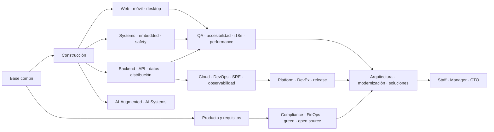

# 🧭 Rutas profesionales de Ingeniería de Software

Las rutas convierten las 40 partes del programa en recorridos orientados a trabajo
real. No reemplazan la secuencia fundamental: indican qué profundizar, qué decisiones
debe dominar cada perfil y qué evidencia conviene construir.

> Los nombres cambian entre empresas. Una oferta puede llamar *Software Engineer* a
> un backend, *DevOps* a un SRE o *Architect* a un Staff Engineer. Lee la misión, las
> responsabilidades y los límites del cargo antes de comparar títulos.

## Cómo leer una ruta

Cada guía contiene:

- qué problema profesional resuelve el rol y qué no le corresponde;
- cómo se ve una jornada plausible, sin idealizarla;
- conocimientos técnicos y habilidades de colaboración;
- partes del programa y **clases asociadas enlazadas una por una**;
- dos gráficos interpretables: sistema profesional y ciclo de respuesta;
- decisiones recurrentes, trade-offs y evidencia mínima para defenderlas;
- escenario de fallo, métricas con trampas y proyecto integrador;
- artefactos de portafolio que demuestran criterio, no solo exposición a herramientas;
- progresión, plan 30/60/90, transiciones vecinas, mitos y preguntas de preparación;
- fuentes primarias u oficiales conectadas con el oficio.

Las cuarenta guías superan **2.200 palabras** sin usar esa cifra como sustituto de
calidad. La profundidad se demuestra en mecanismos, decisiones, fallos, evidencia y
límites específicos; el validador sólo impide que una regresión vuelva a convertirlas
en fichas breves.

La Parte 00 tiene contenido desarrollado; las partes posteriores se encuentran en
distintos grados de construcción. Una ruta describe el recorrido completo previsto,
no certifica que todo el material esté terminado hoy.

## Mapa de 40 roles

El mapa se deriva de las capacidades de las 40 partes: no son cuarenta cursos ni una
promesa de empleo, sino cuarenta lentes profesionales reutilizando el mismo programa.
Los perfiles cercanos se mantienen separados solo cuando cambian responsabilidades,
evidencia y decisiones de salida.

| Familia | Rol | Misión | Ruta principal |
| --- | --- | --- | --- |
| Ingeniería general | [Software Engineer](software-engineer.md) | construir y evolucionar software de extremo a extremo | 00–17 + especialidad |
| Ingeniería general | [Systems Programmer](systems-programmer.md) | controlar memoria, procesos, concurrencia y recursos | 01–09, 18, 22, 24–33 |
| Producto digital | [Backend Engineer](backend-engineer.md) | diseñar servicios, dominio y datos confiables | 05–13, 20, 24–35 |
| Producto digital | [Frontend Engineer](frontend-engineer.md) | construir interfaces accesibles y mantenibles | 05–14, 19, 24, 30–34 |
| Producto digital | [Full-stack Engineer](full-stack-engineer.md) | integrar experiencia, servicios y entrega | 05–20, 24–35 |
| Clientes | [Mobile Engineer](mobile-engineer.md) | operar bajo ciclos interrumpidos y conectividad variable | 05–14, 20–21, 26–35 |
| Clientes | [Desktop Engineer](desktop-engineer.md) | integrar, distribuir y actualizar clientes de escritorio | 01–18, 21, 26, 30–36 |
| Sistemas físicos | [Embedded & IoT Engineer](embedded-iot-engineer.md) | respetar límites de tiempo, memoria, energía y hardware | 01–09, 22–35 |
| Sistemas críticos | [Safety-Critical Software Engineer](safety-critical-software-engineer.md) | trazar hazards hasta controles y evidencia | 00, 04, 10–17, 22–37 |
| Interfaces | [API Engineer](api-engineer.md) | gobernar contratos compatibles y consumibles | 03, 05–13, 17, 20, 25–35 |
| Datos | [Data Engineer](data-engineer.md) | entregar datos trazables, oportunos y evolutivos | 01–13, 26–35 |
| Datos | [Database Reliability Engineer](database-reliability-engineer.md) | asegurar capacidad, cambios y recuperación de datos | 01–09, 18, 20, 25–36 |
| Distribución | [Distributed Systems Engineer](distributed-systems-engineer.md) | preservar garantías frente a fallos parciales | 01–13, 20, 24–35 |
| Calidad | [QA / Test Automation Engineer](qa-test-engineer.md) | convertir riesgos en evidencia y regresión | 04–14, 20, 24, 30–35 |
| Calidad | [Performance Engineer](performance-engineer.md) | medir capacidad y eliminar cuellos de botella reales | 01–08, 19–20, 26–35 |
| Inclusión | [Accessibility Engineer](accessibility-engineer.md) | eliminar barreras en tareas completas | 00, 10–14, 19, 21, 30–37 |
| Globalización | [Internationalization Engineer](internationalization-engineer.md) | separar lógica de idioma, tiempo y cultura | 01, 03–14, 19–21, 26, 30–34 |
| Análisis | [Requirements Engineer / Business Systems Analyst](requirements-engineer.md) | transformar necesidades y conflictos en acuerdos trazables | 00, 04, 10–17, 23, 30, 37 |
| Entrega | [DevOps Engineer](devops-engineer.md) | hacer repetible y segura la entrega de cambios | 02–03, 08–09, 16–18, 29–35 |
| Entrega | [Build & Release Engineer](build-release-engineer.md) | producir artefactos verificables y reversibles | 01–09, 16–18, 29–36 |
| Cloud | [Cloud Engineer](cloud-engineer.md) | automatizar infraestructura segura y recuperable | 01–09, 16–18, 20, 25–36 |
| Confiabilidad | [Site Reliability Engineer](site-reliability-engineer.md) | gestionar confiabilidad mediante software y SLO | 02–03, 20, 26–36 |
| Confiabilidad | [Observability Engineer](observability-engineer.md) | convertir telemetría en diagnóstico y acción | 02–03, 08, 20, 26–39 |
| Plataforma | [Platform Engineer](platform-engineer.md) | ofrecer capacidades internas autoservicio | 08–20, 29, 33–39 |
| Plataforma | [Developer Experience Engineer](developer-experience-engineer.md) | reducir fricción y tiempo de feedback con evidencia | 08–18, 29, 33–39 |
| Seguridad | [Security Engineer](security-engineer.md) | integrar prevención, detección y respuesta | 02–03, 09, 12–14, 20, 29–35 |
| Gobierno | [Compliance Engineer](compliance-engineer.md) | transformar obligaciones en controles y evidencia | 00, 10–17, 23, 32–37 |
| Economía | [FinOps Engineer](finops-engineer.md) | relacionar consumo tecnológico, valor y riesgo | 00, 10–11, 15, 25–38 |
| Sostenibilidad | [Green Software Engineer](green-software-engineer.md) | reducir recursos y carbono con mediciones comparables | 00–11, 19–38 |
| Conocimiento | [Technical Writer / Documentation Engineer](technical-writer.md) | hacer utilizable y mantenible el conocimiento técnico | 00, 04–20, 33–39 |
| Colaboración | [Open Source & InnerSource Engineer](open-source-innersource-engineer.md) | sostener contribución, governance y ownership | 00, 09–17, 32–37 |
| Evolución | [Legacy Modernization Engineer](legacy-modernization-engineer.md) | cambiar sistemas críticos sin perder continuidad | 08, 12–17, 24–36 |
| Diseño sistémico | [Software Architect](software-architect.md) | alinear restricciones, calidad y evolución | 10–17, 20, 23–37 |
| Diseño de soluciones | [Solutions Architect](solutions-architect.md) | integrar contexto, producto, terceros y transición | 00, 10–17, 19–39 |
| Producto técnico | [Technical Product Engineer](technical-product-engineer.md) | unir discovery, economía y factibilidad | 00, 10–20, 24–25, 31, 37–39 |
| Liderazgo técnico | [Staff / Principal / Technical Lead](technical-leadership.md) | multiplicar decisiones más allá de un equipo | 00, 10–17, 24–39 |
| Liderazgo de personas | [Engineering Manager](engineering-manager.md) | sostener personas, flujo, calidad y crecimiento | 00, 10–17, 31, 35–39 |
| Dirección | [CTO / Dirección de Tecnología](cto.md) | responder por estrategia, organización y riesgo | 00, 10–17, 23–39 |
| Ingeniería con IA | [AI-Augmented Software Engineer](ai-augmented-software-engineer.md) | desarrollar con agentes bajo verificación humana | 00, 05, 08–17, 24, 30–39 |
| Sistemas con IA | [AI Systems Engineer](ai-systems-engineer.md) | integrar modelos con evals, guardrails y fallback | 00–13, 20, 24–39 |

<!-- role-index-depth:start -->

**Elige por responsabilidad y problemas a resolver, no por el nombre del cargo.**

## 🧩 Cómo está construida cada guía

Cada ruta conserva el contenido existente y añade un mapa visual del trabajo, clases
enlazadas con propósito, trade-offs, incidente o fallo representativo, métricas con
sus trampas, proyecto integrador, niveles de alcance, plan 30/60/90, preguntas de
revisión y fuentes. La estructura común permite comparar; los mecanismos y decisiones
son específicos de cada profesión.

## 🧱 Parte → clases → evidencia

### Ingeniería general

#### [🧑‍💻 Software Engineer](software-engineer.md)

> Convierte necesidades y restricciones en software comprensible, verificable y capaz de evolucionar. Es el tronco profesional del que parten las especialidades.

- **🧱 Partes núcleo:** [Parte 05 · Fundamentos de programación](../classes/part-05-fundamentos-de-programacion/README.md) · [Parte 24 · Diseño, patrones y refactorización](../classes/part-24-diseno-patrones-y-refactorizacion/README.md) · [Parte 30 · Estrategia y técnicas de prueba](../classes/part-30-estrategia-y-tecnicas-de-prueba/README.md) · [Parte 35 · Observabilidad, SRE e incidentes](../classes/part-35-observabilidad-sre-e-incidentes/README.md).
- **🔗 Clases asociadas:**
  - **Parte 05:** [SE-068](../classes/part-05-fundamentos-de-programacion/se-068-modulos-interfaces-y-separacion-de-responsabilidades/README.md) · [SE-069](../classes/part-05-fundamentos-de-programacion/se-069-pruebas-tempranas-y-diseno-por-ejemplos/README.md) · [SE-070](../classes/part-05-fundamentos-de-programacion/se-070-legibilidad-nombres-y-mantenimiento-basico/README.md).
  - **Parte 24:** [SE-289](../classes/part-24-diseno-patrones-y-refactorizacion/se-289-cohesion-acoplamiento-y-encapsulacion/README.md) · [SE-295](../classes/part-24-diseno-patrones-y-refactorizacion/se-295-refactorizacion-segura-apoyada-por-pruebas/README.md) · [SE-296](../classes/part-24-diseno-patrones-y-refactorizacion/se-296-diseno-para-cambio-prueba-y-operacion/README.md).
  - **Parte 30:** [SE-361](../classes/part-30-estrategia-y-tecnicas-de-prueba/se-361-calidad-por-riesgo-y-proposito-de-las-pruebas/README.md) · [SE-363](../classes/part-30-estrategia-y-tecnicas-de-prueba/se-363-integracion-componentes-y-contratos/README.md) · [SE-371](../classes/part-30-estrategia-y-tecnicas-de-prueba/se-371-taller-demostrar-que-una-prueba-detecta-defectos/README.md).
  - **Parte 35:** [SE-421](../classes/part-35-observabilidad-sre-e-incidentes/se-421-senales-eventos-y-observabilidad-util/README.md) · [SE-428](../classes/part-35-observabilidad-sre-e-incidentes/se-428-gestion-de-incidentes-y-comunicacion/README.md) · [SE-430](../classes/part-35-observabilidad-sre-e-incidentes/se-430-continuidad-disaster-recovery-y-ejercicios/README.md).
- **🧪 Proyecto profesional:** **Producto vertical operable** — entregar una capacidad desde requisito hasta operación y mantenimiento.
- **📖 Guía completa:** [decisiones, escenario, métricas y evidencia →](software-engineer.md)

#### [⚙️ Systems Programmer](systems-programmer.md)

> Construye software cercano al sistema operativo y al runtime con control explícito de memoria, concurrencia, recursos, interfaces y portabilidad.

- **🧱 Partes núcleo:** [Parte 01 · Computadores y representación de información](../classes/part-01-computadores-y-representacion-de-informacion/README.md) · [Parte 02 · Sistemas operativos, terminal y automatización base](../classes/part-02-sistemas-operativos-terminal-y-automatizacion-base/README.md) · [Parte 28 · Concurrencia y sistemas distribuidos](../classes/part-28-concurrencia-y-sistemas-distribuidos/README.md) · [Parte 31 · Calidad, rendimiento y resiliencia](../classes/part-31-calidad-rendimiento-y-resiliencia/README.md).
- **🔗 Clases asociadas:**
  - **Parte 01:** [SE-017](../classes/part-01-computadores-y-representacion-de-informacion/se-017-cpu-instrucciones-registros-y-ciclos-de-ejecucion/README.md) · [SE-018](../classes/part-01-computadores-y-representacion-de-informacion/se-018-memoria-caches-almacenamiento-y-jerarquias/README.md) · [SE-019](../classes/part-01-computadores-y-representacion-de-informacion/se-019-procesos-hilos-interrupciones-y-entrada-salida/README.md).
  - **Parte 02:** [SE-026](../classes/part-02-sistemas-operativos-terminal-y-automatizacion-base/se-026-sistemas-de-archivos-rutas-enlaces-y-metadatos/README.md) · [SE-028](../classes/part-02-sistemas-operativos-terminal-y-automatizacion-base/se-028-procesos-senales-servicios-y-tareas-programadas/README.md) · [SE-033](../classes/part-02-sistemas-operativos-terminal-y-automatizacion-base/se-033-logs-del-sistema-y-diagnostico-de-fallos/README.md).
  - **Parte 28:** [SE-337](../classes/part-28-concurrencia-y-sistemas-distribuidos/se-337-concurrencia-paralelismo-y-asincronia/README.md) · [SE-338](../classes/part-28-concurrencia-y-sistemas-distribuidos/se-338-memoria-compartida-locks-y-condiciones-de-carrera/README.md) · [SE-339](../classes/part-28-concurrencia-y-sistemas-distribuidos/se-339-actores-canales-y-structured-concurrency/README.md).
  - **Parte 31:** [SE-376](../classes/part-31-calidad-rendimiento-y-resiliencia/se-376-latencia-throughput-saturacion-y-capacidad/README.md) · [SE-377](../classes/part-31-calidad-rendimiento-y-resiliencia/se-377-perfiles-benchmarks-y-errores-de-medicion/README.md) · [SE-380](../classes/part-31-calidad-rendimiento-y-resiliencia/se-380-disponibilidad-durabilidad-y-recuperacion/README.md).
- **🧪 Proyecto profesional:** **Servicio de sistema portable** — construir un proceso concurrente observable con límites de recursos.
- **📖 Guía completa:** [decisiones, escenario, métricas y evidencia →](systems-programmer.md)

### Producto digital

#### [⚙️ Backend Engineer](backend-engineer.md)

> Diseña servicios, reglas de negocio, contratos y datos que siguen siendo confiables cuando aparecen concurrencia, fallos parciales y cambios de versión.

- **🧱 Partes núcleo:** [Parte 20 · Backend, APIs y procesamiento asíncrono](../classes/part-20-backend-apis-y-procesamiento-asincrono/README.md) · [Parte 26 · Datos, persistencia y recuperación](../classes/part-26-datos-persistencia-y-recuperacion/README.md) · [Parte 27 · Integración, eventos y mensajería](../classes/part-27-integracion-eventos-y-mensajeria/README.md) · [Parte 35 · Observabilidad, SRE e incidentes](../classes/part-35-observabilidad-sre-e-incidentes/README.md).
- **🔗 Clases asociadas:**
  - **Parte 20:** [SE-241](../classes/part-20-backend-apis-y-procesamiento-asincrono/se-241-responsabilidades-y-fronteras-del-backend/README.md) · [SE-246](../classes/part-20-backend-apis-y-procesamiento-asincrono/se-246-idempotencia-reintentos-y-deduplicacion/README.md) · [SE-250](../classes/part-20-backend-apis-y-procesamiento-asincrono/se-250-health-readiness-y-shutdown-ordenado/README.md).
  - **Parte 26:** [SE-315](../classes/part-26-datos-persistencia-y-recuperacion/se-315-transacciones-aislamiento-y-concurrencia/README.md) · [SE-318](../classes/part-26-datos-persistencia-y-recuperacion/se-318-migraciones-compatibles-y-evolucion-de-esquema/README.md) · [SE-321](../classes/part-26-datos-persistencia-y-recuperacion/se-321-backups-restauracion-y-pruebas-de-recuperacion/README.md).
  - **Parte 27:** [SE-328](../classes/part-27-integracion-eventos-y-mensajeria/se-328-entrega-orden-duplicacion-y-semanticas/README.md) · [SE-329](../classes/part-27-integracion-eventos-y-mensajeria/se-329-outbox-inbox-sagas-y-compensacion/README.md) · [SE-334](../classes/part-27-integracion-eventos-y-mensajeria/se-334-observabilidad-y-seguridad-de-integraciones/README.md).
  - **Parte 35:** [SE-421](../classes/part-35-observabilidad-sre-e-incidentes/se-421-senales-eventos-y-observabilidad-util/README.md) · [SE-425](../classes/part-35-observabilidad-sre-e-incidentes/se-425-sli-slo-sla-y-presupuestos-de-error/README.md) · [SE-431](../classes/part-35-observabilidad-sre-e-incidentes/se-431-taller-diagnosticar-con-telemetria-incompleta/README.md).
- **🧪 Proyecto profesional:** **Servicio contractual recuperable** — operar una capacidad de negocio bajo reintentos degradación y migración.
- **📖 Guía completa:** [decisiones, escenario, métricas y evidencia →](backend-engineer.md)

#### [🎨 Frontend Engineer](frontend-engineer.md)

> Construye interfaces accesibles, rápidas y resistentes que convierten estado, contenido y reglas en una experiencia comprensible para personas reales.

- **🧱 Partes núcleo:** [Parte 14 · Experiencia, accesibilidad e internacionalización](../classes/part-14-experiencia-accesibilidad-e-internacionalizacion/README.md) · [Parte 19 · Web, frontend y aplicaciones progresivas](../classes/part-19-web-frontend-y-aplicaciones-progresivas/README.md) · [Parte 30 · Estrategia y técnicas de prueba](../classes/part-30-estrategia-y-tecnicas-de-prueba/README.md) · [Parte 31 · Calidad, rendimiento y resiliencia](../classes/part-31-calidad-rendimiento-y-resiliencia/README.md).
- **🔗 Clases asociadas:**
  - **Parte 14:** [SE-172](../classes/part-14-experiencia-accesibilidad-e-internacionalizacion/se-172-estados-vacios-carga-error-y-recuperacion/README.md) · [SE-174](../classes/part-14-experiencia-accesibilidad-e-internacionalizacion/se-174-semantica-teclado-foco-y-tecnologias-de-asistencia/README.md) · [SE-176](../classes/part-14-experiencia-accesibilidad-e-internacionalizacion/se-176-responsive-adaptativo-y-preferencias-del-usuario/README.md).
  - **Parte 19:** [SE-229](../classes/part-19-web-frontend-y-aplicaciones-progresivas/se-229-plataforma-web-html-semantico-y-css/README.md) · [SE-232](../classes/part-19-web-frontend-y-aplicaciones-progresivas/se-232-estado-componentes-y-gestion-de-datos/README.md) · [SE-235](../classes/part-19-web-frontend-y-aplicaciones-progresivas/se-235-rendimiento-web-y-presupuestos/README.md).
  - **Parte 30:** [SE-364](../classes/part-30-estrategia-y-tecnicas-de-prueba/se-364-end-to-end-aceptacion-y-recorridos-criticos/README.md) · [SE-369](../classes/part-30-estrategia-y-tecnicas-de-prueba/se-369-pruebas-exploratorias-y-sesiones/README.md) · [SE-370](../classes/part-30-estrategia-y-tecnicas-de-prueba/se-370-flakiness-diagnostico-y-mantenimiento/README.md).
  - **Parte 31:** [SE-373](../classes/part-31-calidad-rendimiento-y-resiliencia/se-373-modelos-de-calidad-y-atributos-medibles/README.md) · [SE-382](../classes/part-31-calidad-rendimiento-y-resiliencia/se-382-calidad-de-experiencia-y-presupuestos/README.md) · [SE-384](../classes/part-31-calidad-rendimiento-y-resiliencia/se-384-proyecto-informe-reproducible-de-calidad/README.md).
- **🧪 Proyecto profesional:** **Flujo web inclusivo y resiliente** — construir una tarea completa que funcione con red degradada teclado y distintos tamaños.
- **📖 Guía completa:** [decisiones, escenario, métricas y evidencia →](frontend-engineer.md)

#### [🧩 Full-stack Engineer](full-stack-engineer.md)

> Entrega fragmentos verticales completos conectando experiencia, servicios, datos y despliegue; conserva profundidad suficiente para no trasladar fallos entre capas.

- **🧱 Partes núcleo:** [Parte 19 · Web, frontend y aplicaciones progresivas](../classes/part-19-web-frontend-y-aplicaciones-progresivas/README.md) · [Parte 20 · Backend, APIs y procesamiento asíncrono](../classes/part-20-backend-apis-y-procesamiento-asincrono/README.md) · [Parte 26 · Datos, persistencia y recuperación](../classes/part-26-datos-persistencia-y-recuperacion/README.md) · [Parte 34 · CI/CD, IaC y platform engineering](../classes/part-34-ci-cd-iac-y-platform-engineering/README.md).
- **🔗 Clases asociadas:**
  - **Parte 19:** [SE-232](../classes/part-19-web-frontend-y-aplicaciones-progresivas/se-232-estado-componentes-y-gestion-de-datos/README.md) · [SE-233](../classes/part-19-web-frontend-y-aplicaciones-progresivas/se-233-formularios-validacion-y-experiencia-de-error/README.md) · [SE-239](../classes/part-19-web-frontend-y-aplicaciones-progresivas/se-239-taller-construir-un-flujo-web-resiliente/README.md).
  - **Parte 20:** [SE-244](../classes/part-20-backend-apis-y-procesamiento-asincrono/se-244-validacion-errores-y-contratos-consistentes/README.md) · [SE-246](../classes/part-20-backend-apis-y-procesamiento-asincrono/se-246-idempotencia-reintentos-y-deduplicacion/README.md) · [SE-250](../classes/part-20-backend-apis-y-procesamiento-asincrono/se-250-health-readiness-y-shutdown-ordenado/README.md).
  - **Parte 26:** [SE-313](../classes/part-26-datos-persistencia-y-recuperacion/se-313-modelado-conceptual-logico-y-fisico/README.md) · [SE-318](../classes/part-26-datos-persistencia-y-recuperacion/se-318-migraciones-compatibles-y-evolucion-de-esquema/README.md) · [SE-321](../classes/part-26-datos-persistencia-y-recuperacion/se-321-backups-restauracion-y-pruebas-de-recuperacion/README.md).
  - **Parte 34:** [SE-409](../classes/part-34-ci-cd-iac-y-platform-engineering/se-409-integracion-continua-y-feedback-temprano/README.md) · [SE-413](../classes/part-34-ci-cd-iac-y-platform-engineering/se-413-entrega-y-despliegue-continuos/README.md) · [SE-420](../classes/part-34-ci-cd-iac-y-platform-engineering/se-420-proyecto-camino-a-produccion-con-rollback/README.md).
- **🧪 Proyecto profesional:** **Fragmento vertical de producto** — entregar una tarea accesible con API datos pipeline y observabilidad.
- **📖 Guía completa:** [decisiones, escenario, métricas y evidencia →](full-stack-engineer.md)

### Clientes

#### [📱 Mobile Engineer](mobile-engineer.md)

> Construye aplicaciones móviles que conservan datos, identidad y experiencia bajo ciclos de vida interrumpidos, conectividad variable y restricciones de plataforma.

- **🧱 Partes núcleo:** [Parte 14 · Experiencia, accesibilidad e internacionalización](../classes/part-14-experiencia-accesibilidad-e-internacionalizacion/README.md) · [Parte 21 · Software móvil, escritorio y multiplataforma](../classes/part-21-software-movil-escritorio-y-multiplataforma/README.md) · [Parte 30 · Estrategia y técnicas de prueba](../classes/part-30-estrategia-y-tecnicas-de-prueba/README.md) · [Parte 33 · Build, release y cadena de suministro](../classes/part-33-build-release-y-cadena-de-suministro/README.md).
- **🔗 Clases asociadas:**
  - **Parte 14:** [SE-173](../classes/part-14-experiencia-accesibilidad-e-internacionalizacion/se-173-accesibilidad-perceptible-operable-y-comprensible/README.md) · [SE-176](../classes/part-14-experiencia-accesibilidad-e-internacionalizacion/se-176-responsive-adaptativo-y-preferencias-del-usuario/README.md) · [SE-177](../classes/part-14-experiencia-accesibilidad-e-internacionalizacion/se-177-internacionalizacion-localizacion-y-formatos-culturales/README.md).
  - **Parte 21:** [SE-254](../classes/part-21-software-movil-escritorio-y-multiplataforma/se-254-ciclo-de-vida-suspension-y-reanudacion/README.md) · [SE-256](../classes/part-21-software-movil-escritorio-y-multiplataforma/se-256-almacenamiento-local-y-sincronizacion/README.md) · [SE-260](../classes/part-21-software-movil-escritorio-y-multiplataforma/se-260-offline-first-y-resolucion-de-conflictos/README.md).
  - **Parte 30:** [SE-364](../classes/part-30-estrategia-y-tecnicas-de-prueba/se-364-end-to-end-aceptacion-y-recorridos-criticos/README.md) · [SE-367](../classes/part-30-estrategia-y-tecnicas-de-prueba/se-367-dobles-virtualizacion-y-entornos-de-prueba/README.md) · [SE-370](../classes/part-30-estrategia-y-tecnicas-de-prueba/se-370-flakiness-diagnostico-y-mantenimiento/README.md).
  - **Parte 33:** [SE-403](../classes/part-33-build-release-y-cadena-de-suministro/se-403-feature-flags-y-entrega-progresiva/README.md) · [SE-405](../classes/part-33-build-release-y-cadena-de-suministro/se-405-instaladores-paquetes-y-actualizaciones/README.md) · [SE-408](../classes/part-33-build-release-y-cadena-de-suministro/se-408-proyecto-release-firmado-y-recuperable/README.md).
- **🧪 Proyecto profesional:** **Cliente offline-first distribuible** — resolver una tarea con conectividad intermitente y actualización segura.
- **📖 Guía completa:** [decisiones, escenario, métricas y evidencia →](mobile-engineer.md)

#### [🖥️ Desktop Engineer](desktop-engineer.md)

> Construye aplicaciones de escritorio integradas con el sistema operativo, capaces de instalarse, actualizarse y recuperar estado con seguridad.

- **🧱 Partes núcleo:** [Parte 02 · Sistemas operativos, terminal y automatización base](../classes/part-02-sistemas-operativos-terminal-y-automatizacion-base/README.md) · [Parte 18 · CLI, TUI, servicios y automatización](../classes/part-18-cli-tui-servicios-y-automatizacion/README.md) · [Parte 21 · Software móvil, escritorio y multiplataforma](../classes/part-21-software-movil-escritorio-y-multiplataforma/README.md) · [Parte 33 · Build, release y cadena de suministro](../classes/part-33-build-release-y-cadena-de-suministro/README.md).
- **🔗 Clases asociadas:**
  - **Parte 02:** [SE-025](../classes/part-02-sistemas-operativos-terminal-y-automatizacion-base/se-025-windows-linux-macos-y-sus-modelos-operativos/README.md) · [SE-026](../classes/part-02-sistemas-operativos-terminal-y-automatizacion-base/se-026-sistemas-de-archivos-rutas-enlaces-y-metadatos/README.md) · [SE-027](../classes/part-02-sistemas-operativos-terminal-y-automatizacion-base/se-027-usuarios-grupos-permisos-y-elevacion-de-privilegios/README.md).
  - **Parte 18:** [SE-217](../classes/part-18-cli-tui-servicios-y-automatizacion/se-217-diseno-de-interfaces-de-linea-de-comandos/README.md) · [SE-222](../classes/part-18-cli-tui-servicios-y-automatizacion/se-222-daemons-servicios-y-ciclo-de-vida/README.md) · [SE-225](../classes/part-18-cli-tui-servicios-y-automatizacion/se-225-distribucion-de-binarios-y-actualizaciones/README.md).
  - **Parte 21:** [SE-253](../classes/part-21-software-movil-escritorio-y-multiplataforma/se-253-modelos-de-aplicacion-movil-y-de-escritorio/README.md) · [SE-259](../classes/part-21-software-movil-escritorio-y-multiplataforma/se-259-actualizaciones-tiendas-y-distribucion-empresarial/README.md) · [SE-262](../classes/part-21-software-movil-escritorio-y-multiplataforma/se-262-firma-sandbox-y-seguridad-del-cliente/README.md).
  - **Parte 33:** [SE-402](../classes/part-33-build-release-y-cadena-de-suministro/se-402-versionado-compatibilidad-y-changelog/README.md) · [SE-405](../classes/part-33-build-release-y-cadena-de-suministro/se-405-instaladores-paquetes-y-actualizaciones/README.md) · [SE-408](../classes/part-33-build-release-y-cadena-de-suministro/se-408-proyecto-release-firmado-y-recuperable/README.md).
- **🧪 Proyecto profesional:** **Aplicación de escritorio mantenible** — distribuir una herramienta accesible con integración nativa y actualización recuperable.
- **📖 Guía completa:** [decisiones, escenario, métricas y evidencia →](desktop-engineer.md)

### Sistemas físicos

#### [🔌 Embedded & IoT Engineer](embedded-iot-engineer.md)

> Integra firmware, hardware, conectividad y operación de dispositivos dentro de presupuestos explícitos de tiempo, memoria, energía y seguridad.

- **🧱 Partes núcleo:** [Parte 01 · Computadores y representación de información](../classes/part-01-computadores-y-representacion-de-informacion/README.md) · [Parte 22 · Embedded, IoT y tiempo real](../classes/part-22-embedded-iot-y-tiempo-real/README.md) · [Parte 31 · Calidad, rendimiento y resiliencia](../classes/part-31-calidad-rendimiento-y-resiliencia/README.md) · [Parte 32 · Seguridad, privacidad y cumplimiento](../classes/part-32-seguridad-privacidad-y-cumplimiento/README.md).
- **🔗 Clases asociadas:**
  - **Parte 01:** [SE-017](../classes/part-01-computadores-y-representacion-de-informacion/se-017-cpu-instrucciones-registros-y-ciclos-de-ejecucion/README.md) · [SE-018](../classes/part-01-computadores-y-representacion-de-informacion/se-018-memoria-caches-almacenamiento-y-jerarquias/README.md) · [SE-022](../classes/part-01-computadores-y-representacion-de-informacion/se-022-rendimiento-consumo-energetico-y-limites-fisicos/README.md).
  - **Parte 22:** [SE-267](../classes/part-22-embedded-iot-y-tiempo-real/se-267-restricciones-de-memoria-energia-y-computo/README.md) · [SE-268](../classes/part-22-embedded-iot-y-tiempo-real/se-268-sistemas-de-tiempo-real-y-deadlines/README.md) · [SE-271](../classes/part-22-embedded-iot-y-tiempo-real/se-271-actualizaciones-ota-y-recuperacion/README.md).
  - **Parte 31:** [SE-376](../classes/part-31-calidad-rendimiento-y-resiliencia/se-376-latencia-throughput-saturacion-y-capacidad/README.md) · [SE-379](../classes/part-31-calidad-rendimiento-y-resiliencia/se-379-circuit-breakers-bulkheads-y-degradacion/README.md) · [SE-380](../classes/part-31-calidad-rendimiento-y-resiliencia/se-380-disponibilidad-durabilidad-y-recuperacion/README.md).
  - **Parte 32:** [SE-385](../classes/part-32-seguridad-privacidad-y-cumplimiento/se-385-principios-de-seguridad-y-modelos-de-amenaza/README.md) · [SE-389](../classes/part-32-seguridad-privacidad-y-cumplimiento/se-389-criptografia-aplicada-y-gestion-de-claves/README.md) · [SE-393](../classes/part-32-seguridad-privacidad-y-cumplimiento/se-393-vulnerabilidades-divulgacion-y-respuesta/README.md).
- **🧪 Proyecto profesional:** **Dispositivo simulado operable** — cumplir un deadline comunicar telemetría y sobrevivir una actualización fallida.
- **📖 Guía completa:** [decisiones, escenario, métricas y evidencia →](embedded-iot-engineer.md)

### Sistemas críticos

#### [🛡️ Safety-Critical Software Engineer](safety-critical-software-engineer.md)

> Traduce peligros del dominio en requisitos, arquitectura, verificación y evidencia capaces de sostener una afirmación de seguridad limitada y auditable.

- **🧱 Partes núcleo:** [Parte 04 · Pensamiento computacional y resolución de problemas](../classes/part-04-pensamiento-computacional-y-resolucion-de-problemas/README.md) · [Parte 13 · Especificaciones, contratos y modelos](../classes/part-13-especificaciones-contratos-y-modelos/README.md) · [Parte 23 · Software especializado y dominios](../classes/part-23-software-especializado-y-dominios/README.md) · [Parte 30 · Estrategia y técnicas de prueba](../classes/part-30-estrategia-y-tecnicas-de-prueba/README.md).
- **🔗 Clases asociadas:**
  - **Parte 04:** [SE-052](../classes/part-04-pensamiento-computacional-y-resolucion-de-problemas/se-052-invariantes-precondiciones-y-poscondiciones/README.md) · [SE-054](../classes/part-04-pensamiento-computacional-y-resolucion-de-problemas/se-054-algoritmos-correccion-y-terminacion/README.md) · [SE-057](../classes/part-04-pensamiento-computacional-y-resolucion-de-problemas/se-057-modelado-de-estado-transiciones-y-eventos/README.md).
  - **Parte 13:** [SE-159](../classes/part-13-especificaciones-contratos-y-modelos/se-159-contratos-invariantes-y-diseno-por-contrato/README.md) · [SE-161](../classes/part-13-especificaciones-contratos-y-modelos/se-161-maquinas-de-estado-y-model-checking-introductorio/README.md) · [SE-166](../classes/part-13-especificaciones-contratos-y-modelos/se-166-especificaciones-ejecutables-y-pruebas-contractuales/README.md).
  - **Parte 23:** [SE-282](../classes/part-23-software-especializado-y-dominios/se-282-fintech-contabilidad-e-invariantes-monetarias/README.md) · [SE-283](../classes/part-23-software-especializado-y-dominios/se-283-salud-datos-sensibles-y-sistemas-regulados/README.md) · [SE-287](../classes/part-23-software-especializado-y-dominios/se-287-taller-comparar-riesgos-entre-dominios/README.md).
  - **Parte 30:** [SE-361](../classes/part-30-estrategia-y-tecnicas-de-prueba/se-361-calidad-por-riesgo-y-proposito-de-las-pruebas/README.md) · [SE-365](../classes/part-30-estrategia-y-tecnicas-de-prueba/se-365-pruebas-basadas-en-propiedades-y-modelos/README.md) · [SE-371](../classes/part-30-estrategia-y-tecnicas-de-prueba/se-371-taller-demostrar-que-una-prueba-detecta-defectos/README.md).
- **🧪 Proyecto profesional:** **Caso de assurance trazable** — demostrar cómo un hazard se convierte en requisito control prueba y evidencia.
- **📖 Guía completa:** [decisiones, escenario, métricas y evidencia →](safety-critical-software-engineer.md)

### Interfaces

#### [🔗 API Engineer](api-engineer.md)

> Diseña contratos consumibles, compatibles y operables entre equipos, sistemas y organizaciones, cualquiera que sea su protocolo.

- **🧱 Partes núcleo:** [Parte 13 · Especificaciones, contratos y modelos](../classes/part-13-especificaciones-contratos-y-modelos/README.md) · [Parte 20 · Backend, APIs y procesamiento asíncrono](../classes/part-20-backend-apis-y-procesamiento-asincrono/README.md) · [Parte 27 · Integración, eventos y mensajería](../classes/part-27-integracion-eventos-y-mensajeria/README.md) · [Parte 30 · Estrategia y técnicas de prueba](../classes/part-30-estrategia-y-tecnicas-de-prueba/README.md).
- **🔗 Clases asociadas:**
  - **Parte 13:** [SE-163](../classes/part-13-especificaciones-contratos-y-modelos/se-163-openapi-asyncapi-graphql-y-contratos-de-eventos/README.md) · [SE-164](../classes/part-13-especificaciones-contratos-y-modelos/se-164-compatibilidad-versionado-y-evolucion-de-contratos/README.md) · [SE-166](../classes/part-13-especificaciones-contratos-y-modelos/se-166-especificaciones-ejecutables-y-pruebas-contractuales/README.md).
  - **Parte 20:** [SE-242](../classes/part-20-backend-apis-y-procesamiento-asincrono/se-242-rest-y-semantica-de-recursos/README.md) · [SE-243](../classes/part-20-backend-apis-y-procesamiento-asincrono/se-243-rpc-graphql-y-seleccion-de-interfaz/README.md) · [SE-246](../classes/part-20-backend-apis-y-procesamiento-asincrono/se-246-idempotencia-reintentos-y-deduplicacion/README.md).
  - **Parte 27:** [SE-331](../classes/part-27-integracion-eventos-y-mensajeria/se-331-webhooks-polling-y-suscripciones/README.md) · [SE-332](../classes/part-27-integracion-eventos-y-mensajeria/se-332-compatibilidad-de-esquemas-y-registros/README.md) · [SE-334](../classes/part-27-integracion-eventos-y-mensajeria/se-334-observabilidad-y-seguridad-de-integraciones/README.md).
  - **Parte 30:** [SE-363](../classes/part-30-estrategia-y-tecnicas-de-prueba/se-363-integracion-componentes-y-contratos/README.md) · [SE-364](../classes/part-30-estrategia-y-tecnicas-de-prueba/se-364-end-to-end-aceptacion-y-recorridos-criticos/README.md) · [SE-371](../classes/part-30-estrategia-y-tecnicas-de-prueba/se-371-taller-demostrar-que-una-prueba-detecta-defectos/README.md).
- **🧪 Proyecto profesional:** **API gobernada de extremo a extremo** — diseñar publicar observar evolucionar y retirar un contrato consumible.
- **📖 Guía completa:** [decisiones, escenario, métricas y evidencia →](api-engineer.md)

### Datos

#### [🧱 Data Engineer](data-engineer.md)

> Construye flujos y productos de datos confiables, trazables y evolutivos desde la captura hasta el consumo analítico u operacional.

- **🧱 Partes núcleo:** [Parte 26 · Datos, persistencia y recuperación](../classes/part-26-datos-persistencia-y-recuperacion/README.md) · [Parte 27 · Integración, eventos y mensajería](../classes/part-27-integracion-eventos-y-mensajeria/README.md) · [Parte 29 · Cloud, plataforma e infraestructura](../classes/part-29-cloud-plataforma-e-infraestructura/README.md) · [Parte 35 · Observabilidad, SRE e incidentes](../classes/part-35-observabilidad-sre-e-incidentes/README.md).
- **🔗 Clases asociadas:**
  - **Parte 26:** [SE-313](../classes/part-26-datos-persistencia-y-recuperacion/se-313-modelado-conceptual-logico-y-fisico/README.md) · [SE-318](../classes/part-26-datos-persistencia-y-recuperacion/se-318-migraciones-compatibles-y-evolucion-de-esquema/README.md) · [SE-322](../classes/part-26-datos-persistencia-y-recuperacion/se-322-privacidad-retencion-y-ciclo-de-vida-del-dato/README.md).
  - **Parte 27:** [SE-330](../classes/part-27-integracion-eventos-y-mensajeria/se-330-cdc-etl-elt-y-sincronizacion/README.md) · [SE-332](../classes/part-27-integracion-eventos-y-mensajeria/se-332-compatibilidad-de-esquemas-y-registros/README.md) · [SE-334](../classes/part-27-integracion-eventos-y-mensajeria/se-334-observabilidad-y-seguridad-de-integraciones/README.md).
  - **Parte 29:** [SE-354](../classes/part-29-cloud-plataforma-e-infraestructura/se-354-infraestructura-como-codigo-y-estado/README.md) · [SE-356](../classes/part-29-cloud-plataforma-e-infraestructura/se-356-escalado-capacidad-y-costos/README.md) · [SE-360](../classes/part-29-cloud-plataforma-e-infraestructura/se-360-proyecto-plataforma-minima-reproducible/README.md).
  - **Parte 35:** [SE-421](../classes/part-35-observabilidad-sre-e-incidentes/se-421-senales-eventos-y-observabilidad-util/README.md) · [SE-423](../classes/part-35-observabilidad-sre-e-incidentes/se-423-metricas-dimensiones-y-cardinalidad/README.md) · [SE-430](../classes/part-35-observabilidad-sre-e-incidentes/se-430-continuidad-disaster-recovery-y-ejercicios/README.md).
- **🧪 Proyecto profesional:** **Producto de datos trazable** — publicar un dataset con contrato calidad lineage replay y coste visible.
- **📖 Guía completa:** [decisiones, escenario, métricas y evidencia →](data-engineer.md)

#### [🗄️ Database Reliability Engineer](database-reliability-engineer.md)

> Mantiene servicios de datos correctos, disponibles, recuperables y comprensibles mientras cambian cargas, esquemas y dependencias.

- **🧱 Partes núcleo:** [Parte 26 · Datos, persistencia y recuperación](../classes/part-26-datos-persistencia-y-recuperacion/README.md) · [Parte 31 · Calidad, rendimiento y resiliencia](../classes/part-31-calidad-rendimiento-y-resiliencia/README.md) · [Parte 35 · Observabilidad, SRE e incidentes](../classes/part-35-observabilidad-sre-e-incidentes/README.md) · [Parte 36 · Mantenimiento y modernización legacy](../classes/part-36-mantenimiento-y-modernizacion-legacy/README.md).
- **🔗 Clases asociadas:**
  - **Parte 26:** [SE-315](../classes/part-26-datos-persistencia-y-recuperacion/se-315-transacciones-aislamiento-y-concurrencia/README.md) · [SE-317](../classes/part-26-datos-persistencia-y-recuperacion/se-317-consultas-indices-y-patrones-de-acceso/README.md) · [SE-321](../classes/part-26-datos-persistencia-y-recuperacion/se-321-backups-restauracion-y-pruebas-de-recuperacion/README.md).
  - **Parte 31:** [SE-375](../classes/part-31-calidad-rendimiento-y-resiliencia/se-375-carga-estres-picos-y-endurance/README.md) · [SE-376](../classes/part-31-calidad-rendimiento-y-resiliencia/se-376-latencia-throughput-saturacion-y-capacidad/README.md) · [SE-380](../classes/part-31-calidad-rendimiento-y-resiliencia/se-380-disponibilidad-durabilidad-y-recuperacion/README.md).
  - **Parte 35:** [SE-423](../classes/part-35-observabilidad-sre-e-incidentes/se-423-metricas-dimensiones-y-cardinalidad/README.md) · [SE-426](../classes/part-35-observabilidad-sre-e-incidentes/se-426-alertas-accionables-y-fatiga/README.md) · [SE-430](../classes/part-35-observabilidad-sre-e-incidentes/se-430-continuidad-disaster-recovery-y-ejercicios/README.md).
  - **Parte 36:** [SE-436](../classes/part-36-mantenimiento-y-modernizacion-legacy/se-436-dependencias-obsoletas-y-riesgo-acumulado/README.md) · [SE-439](../classes/part-36-mantenimiento-y-modernizacion-legacy/se-439-migraciones-de-datos-sin-interrupcion/README.md) · [SE-440](../classes/part-36-mantenimiento-y-modernizacion-legacy/se-440-compatibilidad-coexistencia-y-doble-escritura/README.md).
- **🧪 Proyecto profesional:** **Base de datos recuperable bajo cambio** — migrar una carga realista sin interrupción y demostrar restauración.
- **📖 Guía completa:** [decisiones, escenario, métricas y evidencia →](database-reliability-engineer.md)

### Distribución

#### [🌐 Distributed Systems Engineer](distributed-systems-engineer.md)

> Diseña sistemas que conservan garantías explícitas pese a latencia, concurrencia, particiones, reintentos y fallos parciales.

- **🧱 Partes núcleo:** [Parte 27 · Integración, eventos y mensajería](../classes/part-27-integracion-eventos-y-mensajeria/README.md) · [Parte 28 · Concurrencia y sistemas distribuidos](../classes/part-28-concurrencia-y-sistemas-distribuidos/README.md) · [Parte 31 · Calidad, rendimiento y resiliencia](../classes/part-31-calidad-rendimiento-y-resiliencia/README.md) · [Parte 35 · Observabilidad, SRE e incidentes](../classes/part-35-observabilidad-sre-e-incidentes/README.md).
- **🔗 Clases asociadas:**
  - **Parte 27:** [SE-328](../classes/part-27-integracion-eventos-y-mensajeria/se-328-entrega-orden-duplicacion-y-semanticas/README.md) · [SE-329](../classes/part-27-integracion-eventos-y-mensajeria/se-329-outbox-inbox-sagas-y-compensacion/README.md) · [SE-332](../classes/part-27-integracion-eventos-y-mensajeria/se-332-compatibilidad-de-esquemas-y-registros/README.md).
  - **Parte 28:** [SE-340](../classes/part-28-concurrencia-y-sistemas-distribuidos/se-340-tiempo-relojes-y-orden-parcial/README.md) · [SE-341](../classes/part-28-concurrencia-y-sistemas-distribuidos/se-341-fallos-parciales-y-modelos-de-red/README.md) · [SE-343](../classes/part-28-concurrencia-y-sistemas-distribuidos/se-343-consenso-eleccion-y-coordinacion/README.md).
  - **Parte 31:** [SE-378](../classes/part-31-calidad-rendimiento-y-resiliencia/se-378-timeouts-retries-backoff-y-jitter/README.md) · [SE-379](../classes/part-31-calidad-rendimiento-y-resiliencia/se-379-circuit-breakers-bulkheads-y-degradacion/README.md) · [SE-380](../classes/part-31-calidad-rendimiento-y-resiliencia/se-380-disponibilidad-durabilidad-y-recuperacion/README.md).
  - **Parte 35:** [SE-424](../classes/part-35-observabilidad-sre-e-incidentes/se-424-trazas-distribuidas-y-contexto/README.md) · [SE-425](../classes/part-35-observabilidad-sre-e-incidentes/se-425-sli-slo-sla-y-presupuestos-de-error/README.md) · [SE-431](../classes/part-35-observabilidad-sre-e-incidentes/se-431-taller-diagnosticar-con-telemetria-incompleta/README.md).
- **🧪 Proyecto profesional:** **Servicio distribuido con garantías explícitas** — someter coordinación y replicación a latencia partición reinicio y duplicación.
- **📖 Guía completa:** [decisiones, escenario, métricas y evidencia →](distributed-systems-engineer.md)

### Calidad

#### [🧪 QA / Test Automation Engineer](qa-test-engineer.md)

> Convierte riesgos de producto en experimentos, oráculos y señales que permiten detectar fallos antes de que dañen a usuarios o bloqueen la evolución.

- **🧱 Partes núcleo:** [Parte 12 · Ingeniería de requisitos](../classes/part-12-ingenieria-de-requisitos/README.md) · [Parte 13 · Especificaciones, contratos y modelos](../classes/part-13-especificaciones-contratos-y-modelos/README.md) · [Parte 30 · Estrategia y técnicas de prueba](../classes/part-30-estrategia-y-tecnicas-de-prueba/README.md) · [Parte 31 · Calidad, rendimiento y resiliencia](../classes/part-31-calidad-rendimiento-y-resiliencia/README.md).
- **🔗 Clases asociadas:**
  - **Parte 12:** [SE-147](../classes/part-12-ingenieria-de-requisitos/se-147-atributos-de-calidad-y-restricciones/README.md) · [SE-149](../classes/part-12-ingenieria-de-requisitos/se-149-criterios-de-aceptacion-y-ejemplos/README.md) · [SE-154](../classes/part-12-ingenieria-de-requisitos/se-154-ambiguedad-contradiccion-e-incompletitud/README.md).
  - **Parte 13:** [SE-158](../classes/part-13-especificaciones-contratos-y-modelos/se-158-specification-by-example-y-bdd/README.md) · [SE-166](../classes/part-13-especificaciones-contratos-y-modelos/se-166-especificaciones-ejecutables-y-pruebas-contractuales/README.md) · [SE-167](../classes/part-13-especificaciones-contratos-y-modelos/se-167-taller-convertir-intencion-en-contrato-comprobable/README.md).
  - **Parte 30:** [SE-361](../classes/part-30-estrategia-y-tecnicas-de-prueba/se-361-calidad-por-riesgo-y-proposito-de-las-pruebas/README.md) · [SE-365](../classes/part-30-estrategia-y-tecnicas-de-prueba/se-365-pruebas-basadas-en-propiedades-y-modelos/README.md) · [SE-371](../classes/part-30-estrategia-y-tecnicas-de-prueba/se-371-taller-demostrar-que-una-prueba-detecta-defectos/README.md).
  - **Parte 31:** [SE-373](../classes/part-31-calidad-rendimiento-y-resiliencia/se-373-modelos-de-calidad-y-atributos-medibles/README.md) · [SE-374](../classes/part-31-calidad-rendimiento-y-resiliencia/se-374-revision-analisis-estatico-y-quality-gates/README.md) · [SE-384](../classes/part-31-calidad-rendimiento-y-resiliencia/se-384-proyecto-informe-reproducible-de-calidad/README.md).
- **🧪 Proyecto profesional:** **Estrategia de prueba por riesgo** — proteger un recorrido crítico con técnicas complementarias y límites explícitos.
- **📖 Guía completa:** [decisiones, escenario, métricas y evidencia →](qa-test-engineer.md)

#### [⏱️ Performance Engineer](performance-engineer.md)

> Convierte objetivos de velocidad, capacidad y eficiencia en experimentos reproducibles, diagnósticos causales y decisiones de arquitectura.

- **🧱 Partes núcleo:** [Parte 01 · Computadores y representación de información](../classes/part-01-computadores-y-representacion-de-informacion/README.md) · [Parte 07 · Estructuras de datos y algoritmos](../classes/part-07-estructuras-de-datos-y-algoritmos/README.md) · [Parte 31 · Calidad, rendimiento y resiliencia](../classes/part-31-calidad-rendimiento-y-resiliencia/README.md) · [Parte 35 · Observabilidad, SRE e incidentes](../classes/part-35-observabilidad-sre-e-incidentes/README.md).
- **🔗 Clases asociadas:**
  - **Parte 01:** [SE-018](../classes/part-01-computadores-y-representacion-de-informacion/se-018-memoria-caches-almacenamiento-y-jerarquias/README.md) · [SE-022](../classes/part-01-computadores-y-representacion-de-informacion/se-022-rendimiento-consumo-energetico-y-limites-fisicos/README.md) · [SE-024](../classes/part-01-computadores-y-representacion-de-informacion/se-024-proyecto-informe-reproducible-de-comportamiento-y-recursos/README.md).
  - **Parte 07:** [SE-094](../classes/part-07-estructuras-de-datos-y-algoritmos/se-094-complejidad-empirica-benchmarks-y-perfiles/README.md) · [SE-095](../classes/part-07-estructuras-de-datos-y-algoritmos/se-095-taller-elegir-por-carga-y-no-por-costumbre/README.md) · [SE-096](../classes/part-07-estructuras-de-datos-y-algoritmos/se-096-proyecto-biblioteca-comparada-con-casos-limite/README.md).
  - **Parte 31:** [SE-375](../classes/part-31-calidad-rendimiento-y-resiliencia/se-375-carga-estres-picos-y-endurance/README.md) · [SE-376](../classes/part-31-calidad-rendimiento-y-resiliencia/se-376-latencia-throughput-saturacion-y-capacidad/README.md) · [SE-377](../classes/part-31-calidad-rendimiento-y-resiliencia/se-377-perfiles-benchmarks-y-errores-de-medicion/README.md).
  - **Parte 35:** [SE-423](../classes/part-35-observabilidad-sre-e-incidentes/se-423-metricas-dimensiones-y-cardinalidad/README.md) · [SE-426](../classes/part-35-observabilidad-sre-e-incidentes/se-426-alertas-accionables-y-fatiga/README.md) · [SE-431](../classes/part-35-observabilidad-sre-e-incidentes/se-431-taller-diagnosticar-con-telemetria-incompleta/README.md).
- **🧪 Proyecto profesional:** **Informe de capacidad reproducible** — establecer baseline encontrar cuello y defender una mejora sin mover el problema.
- **📖 Guía completa:** [decisiones, escenario, métricas y evidencia →](performance-engineer.md)

### Inclusión

#### [♿ Accessibility Engineer](accessibility-engineer.md)

> Integra accesibilidad en diseño, código, contenido, pruebas y operación para que personas con distintas capacidades puedan completar tareas reales.

- **🧱 Partes núcleo:** [Parte 14 · Experiencia, accesibilidad e internacionalización](../classes/part-14-experiencia-accesibilidad-e-internacionalizacion/README.md) · [Parte 19 · Web, frontend y aplicaciones progresivas](../classes/part-19-web-frontend-y-aplicaciones-progresivas/README.md) · [Parte 21 · Software móvil, escritorio y multiplataforma](../classes/part-21-software-movil-escritorio-y-multiplataforma/README.md) · [Parte 30 · Estrategia y técnicas de prueba](../classes/part-30-estrategia-y-tecnicas-de-prueba/README.md).
- **🔗 Clases asociadas:**
  - **Parte 14:** [SE-173](../classes/part-14-experiencia-accesibilidad-e-internacionalizacion/se-173-accesibilidad-perceptible-operable-y-comprensible/README.md) · [SE-174](../classes/part-14-experiencia-accesibilidad-e-internacionalizacion/se-174-semantica-teclado-foco-y-tecnologias-de-asistencia/README.md) · [SE-179](../classes/part-14-experiencia-accesibilidad-e-internacionalizacion/se-179-taller-auditar-y-reparar-un-flujo-excluyente/README.md).
  - **Parte 19:** [SE-229](../classes/part-19-web-frontend-y-aplicaciones-progresivas/se-229-plataforma-web-html-semantico-y-css/README.md) · [SE-233](../classes/part-19-web-frontend-y-aplicaciones-progresivas/se-233-formularios-validacion-y-experiencia-de-error/README.md) · [SE-239](../classes/part-19-web-frontend-y-aplicaciones-progresivas/se-239-taller-construir-un-flujo-web-resiliente/README.md).
  - **Parte 21:** [SE-258](../classes/part-21-software-movil-escritorio-y-multiplataforma/se-258-interaccion-tactil-teclado-mouse-y-accesibilidad/README.md) · [SE-263](../classes/part-21-software-movil-escritorio-y-multiplataforma/se-263-taller-adaptar-un-producto-a-dos-plataformas/README.md) · [SE-264](../classes/part-21-software-movil-escritorio-y-multiplataforma/se-264-proyecto-cliente-multiplataforma-con-sincronizacion/README.md).
  - **Parte 30:** [SE-364](../classes/part-30-estrategia-y-tecnicas-de-prueba/se-364-end-to-end-aceptacion-y-recorridos-criticos/README.md) · [SE-369](../classes/part-30-estrategia-y-tecnicas-de-prueba/se-369-pruebas-exploratorias-y-sesiones/README.md) · [SE-371](../classes/part-30-estrategia-y-tecnicas-de-prueba/se-371-taller-demostrar-que-una-prueba-detecta-defectos/README.md).
- **🧪 Proyecto profesional:** **Flujo inclusivo verificable** — reparar una tarea completa y prevenir la misma barrera en el sistema de diseño.
- **📖 Guía completa:** [decisiones, escenario, métricas y evidencia →](accessibility-engineer.md)

### Globalización

#### [🌍 Internationalization Engineer](internationalization-engineer.md)

> Diseña productos que representan idioma, texto, tiempo, número y dirección sin codificar supuestos culturales imposibles de corregir al traducir.

- **🧱 Partes núcleo:** [Parte 01 · Computadores y representación de información](../classes/part-01-computadores-y-representacion-de-informacion/README.md) · [Parte 14 · Experiencia, accesibilidad e internacionalización](../classes/part-14-experiencia-accesibilidad-e-internacionalizacion/README.md) · [Parte 19 · Web, frontend y aplicaciones progresivas](../classes/part-19-web-frontend-y-aplicaciones-progresivas/README.md) · [Parte 21 · Software móvil, escritorio y multiplataforma](../classes/part-21-software-movil-escritorio-y-multiplataforma/README.md).
- **🔗 Clases asociadas:**
  - **Parte 01:** [SE-015](../classes/part-01-computadores-y-representacion-de-informacion/se-015-texto-unicode-codificaciones-y-mojibake/README.md) · [SE-016](../classes/part-01-computadores-y-representacion-de-informacion/se-016-enteros-coma-flotante-precision-y-errores-numericos/README.md) · [SE-024](../classes/part-01-computadores-y-representacion-de-informacion/se-024-proyecto-informe-reproducible-de-comportamiento-y-recursos/README.md).
  - **Parte 14:** [SE-177](../classes/part-14-experiencia-accesibilidad-e-internacionalizacion/se-177-internacionalizacion-localizacion-y-formatos-culturales/README.md) · [SE-178](../classes/part-14-experiencia-accesibilidad-e-internacionalizacion/se-178-investigacion-de-usabilidad-y-medicion/README.md) · [SE-180](../classes/part-14-experiencia-accesibilidad-e-internacionalizacion/se-180-proyecto-prototipo-accesible-evaluado-con-usuarios/README.md).
  - **Parte 19:** [SE-233](../classes/part-19-web-frontend-y-aplicaciones-progresivas/se-233-formularios-validacion-y-experiencia-de-error/README.md) · [SE-234](../classes/part-19-web-frontend-y-aplicaciones-progresivas/se-234-navegacion-routing-y-urls-durables/README.md) · [SE-240](../classes/part-19-web-frontend-y-aplicaciones-progresivas/se-240-proyecto-aplicacion-web-accesible-y-offline/README.md).
  - **Parte 21:** [SE-256](../classes/part-21-software-movil-escritorio-y-multiplataforma/se-256-almacenamiento-local-y-sincronizacion/README.md) · [SE-260](../classes/part-21-software-movil-escritorio-y-multiplataforma/se-260-offline-first-y-resolucion-de-conflictos/README.md) · [SE-263](../classes/part-21-software-movil-escritorio-y-multiplataforma/se-263-taller-adaptar-un-producto-a-dos-plataformas/README.md).
- **🧪 Proyecto profesional:** **Producto preparado para múltiples culturas** — hacer que una misma tarea funcione con locales scripts zonas y formatos distintos.
- **📖 Guía completa:** [decisiones, escenario, métricas y evidencia →](internationalization-engineer.md)

### Análisis

#### [🧾 Requirements Engineer / Business Systems Analyst](requirements-engineer.md)

> Convierte necesidades, restricciones y conflictos del dominio en acuerdos trazables que pueden diseñarse, verificarse y cambiarse conscientemente.

- **🧱 Partes núcleo:** [Parte 10 · Descubrimiento y estrategia de producto](../classes/part-10-descubrimiento-y-estrategia-de-producto/README.md) · [Parte 12 · Ingeniería de requisitos](../classes/part-12-ingenieria-de-requisitos/README.md) · [Parte 13 · Especificaciones, contratos y modelos](../classes/part-13-especificaciones-contratos-y-modelos/README.md) · [Parte 17 · Documentación y conocimiento técnico](../classes/part-17-documentacion-y-conocimiento-tecnico/README.md).
- **🔗 Clases asociadas:**
  - **Parte 10:** [SE-121](../classes/part-10-descubrimiento-y-estrategia-de-producto/se-121-problemas-sintomas-necesidades-y-oportunidades/README.md) · [SE-123](../classes/part-10-descubrimiento-y-estrategia-de-producto/se-123-investigacion-entrevistas-y-evidencia-cualitativa/README.md) · [SE-130](../classes/part-10-descubrimiento-y-estrategia-de-producto/se-130-criterios-de-no-exito-y-decisiones-de-abandono/README.md).
  - **Parte 12:** [SE-145](../classes/part-12-ingenieria-de-requisitos/se-145-elicitacion-analisis-especificacion-y-validacion/README.md) · [SE-151](../classes/part-12-ingenieria-de-requisitos/se-151-trazabilidad-desde-necesidad-hasta-evidencia/README.md) · [SE-154](../classes/part-12-ingenieria-de-requisitos/se-154-ambiguedad-contradiccion-e-incompletitud/README.md).
  - **Parte 13:** [SE-157](../classes/part-13-especificaciones-contratos-y-modelos/se-157-especificacion-informal-semiformal-y-formal/README.md) · [SE-159](../classes/part-13-especificaciones-contratos-y-modelos/se-159-contratos-invariantes-y-diseno-por-contrato/README.md) · [SE-167](../classes/part-13-especificaciones-contratos-y-modelos/se-167-taller-convertir-intencion-en-contrato-comprobable/README.md).
  - **Parte 17:** [SE-205](../classes/part-17-documentacion-y-conocimiento-tecnico/se-205-documentacion-orientada-a-tareas-y-audiencias/README.md) · [SE-208](../classes/part-17-documentacion-y-conocimiento-tecnico/se-208-adrs-rfcs-y-registro-de-decisiones/README.md) · [SE-215](../classes/part-17-documentacion-y-conocimiento-tecnico/se-215-taller-reconstruir-conocimiento-perdido/README.md).
- **🧪 Proyecto profesional:** **Baseline defendible de requisitos** — convertir un problema contradictorio en acuerdos verificables sin ocultar incertidumbre.
- **📖 Guía completa:** [decisiones, escenario, métricas y evidencia →](requirements-engineer.md)

### Entrega

#### [🚚 DevOps Engineer](devops-engineer.md)

> Construye automatización para que cambios pequeños lleguen a entornos reales de forma repetible, segura, observable y reversible.

- **🧱 Partes núcleo:** [Parte 29 · Cloud, plataforma e infraestructura](../classes/part-29-cloud-plataforma-e-infraestructura/README.md) · [Parte 33 · Build, release y cadena de suministro](../classes/part-33-build-release-y-cadena-de-suministro/README.md) · [Parte 34 · CI/CD, IaC y platform engineering](../classes/part-34-ci-cd-iac-y-platform-engineering/README.md) · [Parte 35 · Observabilidad, SRE e incidentes](../classes/part-35-observabilidad-sre-e-incidentes/README.md).
- **🔗 Clases asociadas:**
  - **Parte 29:** [SE-353](../classes/part-29-cloud-plataforma-e-infraestructura/se-353-redes-identidad-y-secretos-en-cloud/README.md) · [SE-354](../classes/part-29-cloud-plataforma-e-infraestructura/se-354-infraestructura-como-codigo-y-estado/README.md) · [SE-359](../classes/part-29-cloud-plataforma-e-infraestructura/se-359-taller-desplegar-y-destruir-un-entorno-seguro/README.md).
  - **Parte 33:** [SE-397](../classes/part-33-build-release-y-cadena-de-suministro/se-397-build-reproducible-y-hermetico/README.md) · [SE-400](../classes/part-33-build-release-y-cadena-de-suministro/se-400-sbom-procedencia-y-atestaciones/README.md) · [SE-404](../classes/part-33-build-release-y-cadena-de-suministro/se-404-canary-blue-green-y-rollback/README.md).
  - **Parte 34:** [SE-409](../classes/part-34-ci-cd-iac-y-platform-engineering/se-409-integracion-continua-y-feedback-temprano/README.md) · [SE-412](../classes/part-34-ci-cd-iac-y-platform-engineering/se-412-credenciales-efimeras-y-oidc/README.md) · [SE-420](../classes/part-34-ci-cd-iac-y-platform-engineering/se-420-proyecto-camino-a-produccion-con-rollback/README.md).
  - **Parte 35:** [SE-422](../classes/part-35-observabilidad-sre-e-incidentes/se-422-logs-estructurados-y-correlacion/README.md) · [SE-428](../classes/part-35-observabilidad-sre-e-incidentes/se-428-gestion-de-incidentes-y-comunicacion/README.md) · [SE-430](../classes/part-35-observabilidad-sre-e-incidentes/se-430-continuidad-disaster-recovery-y-ejercicios/README.md).
- **🧪 Proyecto profesional:** **Camino de entrega reversible** — llevar un artefacto firmado por varios entornos sin reconstrucción y recuperar un fallo.
- **📖 Guía completa:** [decisiones, escenario, métricas y evidencia →](devops-engineer.md)

#### [📦 Build & Release Engineer](build-release-engineer.md)

> Convierte código fuente revisado en artefactos reproducibles, verificables y distribuibles con una historia de procedencia y reversión.

- **🧱 Partes núcleo:** [Parte 09 · Bibliotecas, paquetes, SDK y automatización](../classes/part-09-bibliotecas-paquetes-sdk-y-automatizacion/README.md) · [Parte 16 · Git, colaboración y código abierto](../classes/part-16-git-colaboracion-y-codigo-abierto/README.md) · [Parte 33 · Build, release y cadena de suministro](../classes/part-33-build-release-y-cadena-de-suministro/README.md) · [Parte 34 · CI/CD, IaC y platform engineering](../classes/part-34-ci-cd-iac-y-platform-engineering/README.md).
- **🔗 Clases asociadas:**
  - **Parte 09:** [SE-110](../classes/part-09-bibliotecas-paquetes-sdk-y-automatizacion/se-110-semver-compatibilidad-y-contratos-publicos/README.md) · [SE-111](../classes/part-09-bibliotecas-paquetes-sdk-y-automatizacion/se-111-resolucion-de-dependencias-y-lockfiles/README.md) · [SE-112](../classes/part-09-bibliotecas-paquetes-sdk-y-automatizacion/se-112-paquetes-modulos-y-publicacion/README.md).
  - **Parte 16:** [SE-194](../classes/part-16-git-colaboracion-y-codigo-abierto/se-194-commits-atomicos-historial-y-recuperacion/README.md) · [SE-197](../classes/part-16-git-colaboracion-y-codigo-abierto/se-197-trunk-based-gitflow-y-estrategias-hibridas/README.md) · [SE-202](../classes/part-16-git-colaboracion-y-codigo-abierto/se-202-firmas-procedencia-y-proteccion-del-repositorio/README.md).
  - **Parte 33:** [SE-397](../classes/part-33-build-release-y-cadena-de-suministro/se-397-build-reproducible-y-hermetico/README.md) · [SE-400](../classes/part-33-build-release-y-cadena-de-suministro/se-400-sbom-procedencia-y-atestaciones/README.md) · [SE-407](../classes/part-33-build-release-y-cadena-de-suministro/se-407-taller-verificar-la-procedencia-de-un-release/README.md).
  - **Parte 34:** [SE-409](../classes/part-34-ci-cd-iac-y-platform-engineering/se-409-integracion-continua-y-feedback-temprano/README.md) · [SE-410](../classes/part-34-ci-cd-iac-y-platform-engineering/se-410-pipelines-jobs-matrices-y-caches/README.md) · [SE-419](../classes/part-34-ci-cd-iac-y-platform-engineering/se-419-taller-endurecer-un-pipeline-vulnerable/README.md).
- **🧪 Proyecto profesional:** **Release verificable y recuperable** — producir promover verificar y retirar un artefacto sin ambigüedad.
- **📖 Guía completa:** [decisiones, escenario, métricas y evidencia →](build-release-engineer.md)

### Cloud

#### [☁️ Cloud Engineer](cloud-engineer.md)

> Diseña y automatiza capacidades cloud seguras, observables, recuperables y económicamente defendibles sin quedar atrapado en servicios por accidente.

- **🧱 Partes núcleo:** [Parte 29 · Cloud, plataforma e infraestructura](../classes/part-29-cloud-plataforma-e-infraestructura/README.md) · [Parte 32 · Seguridad, privacidad y cumplimiento](../classes/part-32-seguridad-privacidad-y-cumplimiento/README.md) · [Parte 34 · CI/CD, IaC y platform engineering](../classes/part-34-ci-cd-iac-y-platform-engineering/README.md) · [Parte 35 · Observabilidad, SRE e incidentes](../classes/part-35-observabilidad-sre-e-incidentes/README.md).
- **🔗 Clases asociadas:**
  - **Parte 29:** [SE-349](../classes/part-29-cloud-plataforma-e-infraestructura/se-349-iaas-paas-saas-y-responsabilidad-compartida/README.md) · [SE-353](../classes/part-29-cloud-plataforma-e-infraestructura/se-353-redes-identidad-y-secretos-en-cloud/README.md) · [SE-354](../classes/part-29-cloud-plataforma-e-infraestructura/se-354-infraestructura-como-codigo-y-estado/README.md).
  - **Parte 32:** [SE-387](../classes/part-32-seguridad-privacidad-y-cumplimiento/se-387-autorizacion-recursos-y-minimo-privilegio/README.md) · [SE-390](../classes/part-32-seguridad-privacidad-y-cumplimiento/se-390-secretos-configuracion-y-separacion-de-ambientes/README.md) · [SE-393](../classes/part-32-seguridad-privacidad-y-cumplimiento/se-393-vulnerabilidades-divulgacion-y-respuesta/README.md).
  - **Parte 34:** [SE-412](../classes/part-34-ci-cd-iac-y-platform-engineering/se-412-credenciales-efimeras-y-oidc/README.md) · [SE-414](../classes/part-34-ci-cd-iac-y-platform-engineering/se-414-infraestructura-como-codigo-en-pipeline/README.md) · [SE-415](../classes/part-34-ci-cd-iac-y-platform-engineering/se-415-gitops-y-reconciliacion/README.md).
  - **Parte 35:** [SE-425](../classes/part-35-observabilidad-sre-e-incidentes/se-425-sli-slo-sla-y-presupuestos-de-error/README.md) · [SE-426](../classes/part-35-observabilidad-sre-e-incidentes/se-426-alertas-accionables-y-fatiga/README.md) · [SE-430](../classes/part-35-observabilidad-sre-e-incidentes/se-430-continuidad-disaster-recovery-y-ejercicios/README.md).
- **🧪 Proyecto profesional:** **Entorno cloud mínimo seguro** — crear y destruir una plataforma con identidad efímera separación y recuperación.
- **📖 Guía completa:** [decisiones, escenario, métricas y evidencia →](cloud-engineer.md)

### Confiabilidad

#### [📈 Site Reliability Engineer](site-reliability-engineer.md)

> Aplica ingeniería de software a la confiabilidad: convierte expectativas de servicio en señales, automatización, límites de riesgo y aprendizaje operativo.

- **🧱 Partes núcleo:** [Parte 28 · Concurrencia y sistemas distribuidos](../classes/part-28-concurrencia-y-sistemas-distribuidos/README.md) · [Parte 31 · Calidad, rendimiento y resiliencia](../classes/part-31-calidad-rendimiento-y-resiliencia/README.md) · [Parte 35 · Observabilidad, SRE e incidentes](../classes/part-35-observabilidad-sre-e-incidentes/README.md) · [Parte 36 · Mantenimiento y modernización legacy](../classes/part-36-mantenimiento-y-modernizacion-legacy/README.md).
- **🔗 Clases asociadas:**
  - **Parte 28:** [SE-341](../classes/part-28-concurrencia-y-sistemas-distribuidos/se-341-fallos-parciales-y-modelos-de-red/README.md) · [SE-342](../classes/part-28-concurrencia-y-sistemas-distribuidos/se-342-consistencia-disponibilidad-y-particiones/README.md) · [SE-346](../classes/part-28-concurrencia-y-sistemas-distribuidos/se-346-caos-controlado-y-pruebas-de-distribucion/README.md).
  - **Parte 31:** [SE-376](../classes/part-31-calidad-rendimiento-y-resiliencia/se-376-latencia-throughput-saturacion-y-capacidad/README.md) · [SE-378](../classes/part-31-calidad-rendimiento-y-resiliencia/se-378-timeouts-retries-backoff-y-jitter/README.md) · [SE-380](../classes/part-31-calidad-rendimiento-y-resiliencia/se-380-disponibilidad-durabilidad-y-recuperacion/README.md).
  - **Parte 35:** [SE-425](../classes/part-35-observabilidad-sre-e-incidentes/se-425-sli-slo-sla-y-presupuestos-de-error/README.md) · [SE-427](../classes/part-35-observabilidad-sre-e-incidentes/se-427-runbooks-on-call-y-escalamiento/README.md) · [SE-430](../classes/part-35-observabilidad-sre-e-incidentes/se-430-continuidad-disaster-recovery-y-ejercicios/README.md).
  - **Parte 36:** [SE-433](../classes/part-36-mantenimiento-y-modernizacion-legacy/se-433-mantenimiento-correctivo-adaptativo-y-perfectivo/README.md) · [SE-436](../classes/part-36-mantenimiento-y-modernizacion-legacy/se-436-dependencias-obsoletas-y-riesgo-acumulado/README.md) · [SE-443](../classes/part-36-mantenimiento-y-modernizacion-legacy/se-443-taller-estabilizar-antes-de-modernizar/README.md).
- **🧪 Proyecto profesional:** **Servicio con confiabilidad ensayada** — definir SLO observar degradación y recuperar una falla compuesta.
- **📖 Guía completa:** [decisiones, escenario, métricas y evidencia →](site-reliability-engineer.md)

#### [🔭 Observability Engineer](observability-engineer.md)

> Diseña señales, contexto y herramientas que permiten formular y responder preguntas sobre sistemas en producción sin convertir telemetría en ruido o vigilancia.

- **🧱 Partes núcleo:** [Parte 03 · Redes, Internet y protocolos](../classes/part-03-redes-internet-y-protocolos/README.md) · [Parte 20 · Backend, APIs y procesamiento asíncrono](../classes/part-20-backend-apis-y-procesamiento-asincrono/README.md) · [Parte 35 · Observabilidad, SRE e incidentes](../classes/part-35-observabilidad-sre-e-incidentes/README.md) · [Parte 39 · SPEC, agentes y ciclo de vida agentic](../classes/part-39-spec-agentes-y-ciclo-de-vida-agentic/README.md).
- **🔗 Clases asociadas:**
  - **Parte 03:** [SE-041](../classes/part-03-redes-internet-y-protocolos/se-041-dns-nombres-resolucion-y-fallos/README.md) · [SE-043](../classes/part-03-redes-internet-y-protocolos/se-043-tls-certificados-y-confianza-en-transito/README.md) · [SE-047](../classes/part-03-redes-internet-y-protocolos/se-047-taller-seguir-una-peticion-de-extremo-a-extremo/README.md).
  - **Parte 20:** [SE-244](../classes/part-20-backend-apis-y-procesamiento-asincrono/se-244-validacion-errores-y-contratos-consistentes/README.md) · [SE-250](../classes/part-20-backend-apis-y-procesamiento-asincrono/se-250-health-readiness-y-shutdown-ordenado/README.md) · [SE-252](../classes/part-20-backend-apis-y-procesamiento-asincrono/se-252-proyecto-servicio-contractual-operable/README.md).
  - **Parte 35:** [SE-421](../classes/part-35-observabilidad-sre-e-incidentes/se-421-senales-eventos-y-observabilidad-util/README.md) · [SE-424](../classes/part-35-observabilidad-sre-e-incidentes/se-424-trazas-distribuidas-y-contexto/README.md) · [SE-426](../classes/part-35-observabilidad-sre-e-incidentes/se-426-alertas-accionables-y-fatiga/README.md).
  - **Parte 39:** [SE-473](../classes/part-39-spec-agentes-y-ciclo-de-vida-agentic/se-473-agentes-herramientas-permisos-y-limites-de-autoridad/README.md) · [SE-477](../classes/part-39-spec-agentes-y-ciclo-de-vida-agentic/se-477-human-in-the-loop-aprobacion-y-acciones-reversibles/README.md) · [SE-479](../classes/part-39-spec-agentes-y-ciclo-de-vida-agentic/se-479-taller-detener-recuperar-y-evaluar-un-agente/README.md).
- **🧪 Proyecto profesional:** **Plataforma de diagnóstico interoperable** — responder preguntas de fallo sin depender de dashboards preconstruidos.
- **📖 Guía completa:** [decisiones, escenario, métricas y evidencia →](observability-engineer.md)

### Plataforma

#### [🛤️ Platform Engineer](platform-engineer.md)

> Construye una plataforma interna como producto: capacidades autoservicio que permiten a los equipos entregar software con menos carga cognitiva y mejores defaults.

- **🧱 Partes núcleo:** [Parte 09 · Bibliotecas, paquetes, SDK y automatización](../classes/part-09-bibliotecas-paquetes-sdk-y-automatizacion/README.md) · [Parte 29 · Cloud, plataforma e infraestructura](../classes/part-29-cloud-plataforma-e-infraestructura/README.md) · [Parte 34 · CI/CD, IaC y platform engineering](../classes/part-34-ci-cd-iac-y-platform-engineering/README.md) · [Parte 37 · Gestión, liderazgo y práctica profesional](../classes/part-37-gestion-liderazgo-y-practica-profesional/README.md).
- **🔗 Clases asociadas:**
  - **Parte 09:** [SE-113](../classes/part-09-bibliotecas-paquetes-sdk-y-automatizacion/se-113-cli-flags-configuracion-y-codigos-de-salida/README.md) · [SE-118](../classes/part-09-bibliotecas-paquetes-sdk-y-automatizacion/se-118-diseno-de-experiencia-para-desarrolladores/README.md) · [SE-120](../classes/part-09-bibliotecas-paquetes-sdk-y-automatizacion/se-120-proyecto-sdk-y-cli-con-compatibilidad-verificada/README.md).
  - **Parte 29:** [SE-354](../classes/part-29-cloud-plataforma-e-infraestructura/se-354-infraestructura-como-codigo-y-estado/README.md) · [SE-358](../classes/part-29-cloud-plataforma-e-infraestructura/se-358-plataformas-internas-y-golden-paths/README.md) · [SE-360](../classes/part-29-cloud-plataforma-e-infraestructura/se-360-proyecto-plataforma-minima-reproducible/README.md).
  - **Parte 34:** [SE-417](../classes/part-34-ci-cd-iac-y-platform-engineering/se-417-developer-portals-y-capacidades-de-plataforma/README.md) · [SE-418](../classes/part-34-ci-cd-iac-y-platform-engineering/se-418-metricas-dora-y-mejora-sin-gaming/README.md) · [SE-420](../classes/part-34-ci-cd-iac-y-platform-engineering/se-420-proyecto-camino-a-produccion-con-rollback/README.md).
  - **Parte 37:** [SE-446](../classes/part-37-gestion-liderazgo-y-practica-profesional/se-446-diseno-de-equipos-y-ownership/README.md) · [SE-450](../classes/part-37-gestion-liderazgo-y-practica-profesional/se-450-gestion-de-riesgos-y-decisiones-ejecutivas/README.md) · [SE-455](../classes/part-37-gestion-liderazgo-y-practica-profesional/se-455-taller-conducir-una-revision-de-decision-dificil/README.md).
- **🧪 Proyecto profesional:** **Plataforma interna como producto** — convertir una necesidad repetida en autoservicio medido y versionado.
- **📖 Guía completa:** [decisiones, escenario, métricas y evidencia →](platform-engineer.md)

#### [🧰 Developer Experience Engineer](developer-experience-engineer.md)

> Reduce fricción cognitiva y tiempo de feedback mediante herramientas, flujos y documentación diseñados a partir de evidencia de quienes desarrollan.

- **🧱 Partes núcleo:** [Parte 08 · Entornos, herramientas y depuración](../classes/part-08-entornos-herramientas-y-depuracion/README.md) · [Parte 09 · Bibliotecas, paquetes, SDK y automatización](../classes/part-09-bibliotecas-paquetes-sdk-y-automatizacion/README.md) · [Parte 34 · CI/CD, IaC y platform engineering](../classes/part-34-ci-cd-iac-y-platform-engineering/README.md) · [Parte 37 · Gestión, liderazgo y práctica profesional](../classes/part-37-gestion-liderazgo-y-practica-profesional/README.md).
- **🔗 Clases asociadas:**
  - **Parte 08:** [SE-097](../classes/part-08-entornos-herramientas-y-depuracion/se-097-editores-ide-y-servidores-de-lenguaje/README.md) · [SE-104](../classes/part-08-entornos-herramientas-y-depuracion/se-104-dev-containers-y-entornos-desechables/README.md) · [SE-106](../classes/part-08-entornos-herramientas-y-depuracion/se-106-ergonomia-accesibilidad-y-productividad-del-entorno/README.md).
  - **Parte 09:** [SE-113](../classes/part-09-bibliotecas-paquetes-sdk-y-automatizacion/se-113-cli-flags-configuracion-y-codigos-de-salida/README.md) · [SE-118](../classes/part-09-bibliotecas-paquetes-sdk-y-automatizacion/se-118-diseno-de-experiencia-para-desarrolladores/README.md) · [SE-120](../classes/part-09-bibliotecas-paquetes-sdk-y-automatizacion/se-120-proyecto-sdk-y-cli-con-compatibilidad-verificada/README.md).
  - **Parte 34:** [SE-409](../classes/part-34-ci-cd-iac-y-platform-engineering/se-409-integracion-continua-y-feedback-temprano/README.md) · [SE-417](../classes/part-34-ci-cd-iac-y-platform-engineering/se-417-developer-portals-y-capacidades-de-plataforma/README.md) · [SE-418](../classes/part-34-ci-cd-iac-y-platform-engineering/se-418-metricas-dora-y-mejora-sin-gaming/README.md).
  - **Parte 37:** [SE-446](../classes/part-37-gestion-liderazgo-y-practica-profesional/se-446-diseno-de-equipos-y-ownership/README.md) · [SE-448](../classes/part-37-gestion-liderazgo-y-practica-profesional/se-448-mentoria-feedback-y-crecimiento/README.md) · [SE-455](../classes/part-37-gestion-liderazgo-y-practica-profesional/se-455-taller-conducir-una-revision-de-decision-dificil/README.md).
- **🧪 Proyecto profesional:** **Experiencia de desarrollo medible** — reducir una fricción real desde investigación hasta adopción sostenible.
- **📖 Guía completa:** [decisiones, escenario, métricas y evidencia →](developer-experience-engineer.md)

### Seguridad

#### [🔐 Security Engineer](security-engineer.md)

> Integra prevención, detección y recuperación en productos y plataformas sin convertir seguridad en una revisión tardía o una lista de herramientas.

- **🧱 Partes núcleo:** [Parte 20 · Backend, APIs y procesamiento asíncrono](../classes/part-20-backend-apis-y-procesamiento-asincrono/README.md) · [Parte 32 · Seguridad, privacidad y cumplimiento](../classes/part-32-seguridad-privacidad-y-cumplimiento/README.md) · [Parte 33 · Build, release y cadena de suministro](../classes/part-33-build-release-y-cadena-de-suministro/README.md) · [Parte 35 · Observabilidad, SRE e incidentes](../classes/part-35-observabilidad-sre-e-incidentes/README.md).
- **🔗 Clases asociadas:**
  - **Parte 20:** [SE-245](../classes/part-20-backend-apis-y-procesamiento-asincrono/se-245-autenticacion-autorizacion-y-contexto/README.md) · [SE-249](../classes/part-20-backend-apis-y-procesamiento-asincrono/se-249-caching-rate-limiting-y-proteccion/README.md) · [SE-251](../classes/part-20-backend-apis-y-procesamiento-asincrono/se-251-taller-reparar-una-api-insegura-e-inconsistente/README.md).
  - **Parte 32:** [SE-385](../classes/part-32-seguridad-privacidad-y-cumplimiento/se-385-principios-de-seguridad-y-modelos-de-amenaza/README.md) · [SE-387](../classes/part-32-seguridad-privacidad-y-cumplimiento/se-387-autorizacion-recursos-y-minimo-privilegio/README.md) · [SE-392](../classes/part-32-seguridad-privacidad-y-cumplimiento/se-392-secure-sdlc-abuso-y-pruebas-negativas/README.md).
  - **Parte 33:** [SE-399](../classes/part-33-build-release-y-cadena-de-suministro/se-399-dependencias-directas-transitivas-y-vendorizacion/README.md) · [SE-400](../classes/part-33-build-release-y-cadena-de-suministro/se-400-sbom-procedencia-y-atestaciones/README.md) · [SE-406](../classes/part-33-build-release-y-cadena-de-suministro/se-406-riesgos-de-ci-y-dependencias-comprometidas/README.md).
  - **Parte 35:** [SE-422](../classes/part-35-observabilidad-sre-e-incidentes/se-422-logs-estructurados-y-correlacion/README.md) · [SE-428](../classes/part-35-observabilidad-sre-e-incidentes/se-428-gestion-de-incidentes-y-comunicacion/README.md) · [SE-430](../classes/part-35-observabilidad-sre-e-incidentes/se-430-continuidad-disaster-recovery-y-ejercicios/README.md).
- **🧪 Proyecto profesional:** **Producto con seguridad verificable** — conectar amenazas con controles pruebas telemetría y respuesta.
- **📖 Guía completa:** [decisiones, escenario, métricas y evidencia →](security-engineer.md)

### Gobierno

#### [⚖️ Compliance Engineer](compliance-engineer.md)

> Traduce obligaciones aplicables en controles técnicos verificables y paquetes de evidencia, sin confundir presencia documental con cumplimiento real.

- **🧱 Partes núcleo:** [Parte 12 · Ingeniería de requisitos](../classes/part-12-ingenieria-de-requisitos/README.md) · [Parte 23 · Software especializado y dominios](../classes/part-23-software-especializado-y-dominios/README.md) · [Parte 32 · Seguridad, privacidad y cumplimiento](../classes/part-32-seguridad-privacidad-y-cumplimiento/README.md) · [Parte 37 · Gestión, liderazgo y práctica profesional](../classes/part-37-gestion-liderazgo-y-practica-profesional/README.md).
- **🔗 Clases asociadas:**
  - **Parte 12:** [SE-151](../classes/part-12-ingenieria-de-requisitos/se-151-trazabilidad-desde-necesidad-hasta-evidencia/README.md) · [SE-152](../classes/part-12-ingenieria-de-requisitos/se-152-requisitos-regulatorios-de-datos-y-seguridad/README.md) · [SE-153](../classes/part-12-ingenieria-de-requisitos/se-153-gestion-de-cambios-y-lineas-base/README.md).
  - **Parte 23:** [SE-283](../classes/part-23-software-especializado-y-dominios/se-283-salud-datos-sensibles-y-sistemas-regulados/README.md) · [SE-287](../classes/part-23-software-especializado-y-dominios/se-287-taller-comparar-riesgos-entre-dominios/README.md) · [SE-288](../classes/part-23-software-especializado-y-dominios/se-288-proyecto-diseno-profundo-de-un-dominio-elegido/README.md).
  - **Parte 32:** [SE-391](../classes/part-32-seguridad-privacidad-y-cumplimiento/se-391-privacidad-por-diseno-y-minimizacion/README.md) · [SE-394](../classes/part-32-seguridad-privacidad-y-cumplimiento/se-394-cumplimiento-evidencia-y-limites-legales/README.md) · [SE-396](../classes/part-32-seguridad-privacidad-y-cumplimiento/se-396-proyecto-producto-con-seguridad-verificable/README.md).
  - **Parte 37:** [SE-450](../classes/part-37-gestion-liderazgo-y-practica-profesional/se-450-gestion-de-riesgos-y-decisiones-ejecutivas/README.md) · [SE-451](../classes/part-37-gestion-liderazgo-y-practica-profesional/se-451-compras-proveedores-y-evaluacion-tecnica/README.md) · [SE-452](../classes/part-37-gestion-liderazgo-y-practica-profesional/se-452-propiedad-intelectual-contratos-y-etica/README.md).
- **🧪 Proyecto profesional:** **Paquete de cumplimiento trazable** — traducir una obligación acotada hasta implementación prueba y evidencia revisable.
- **📖 Guía completa:** [decisiones, escenario, métricas y evidencia →](compliance-engineer.md)

### Economía

#### [💸 FinOps Engineer](finops-engineer.md)

> Hace visible y accionable el coste tecnológico para que producto, ingeniería y finanzas decidan con contexto de valor, capacidad y riesgo.

- **🧱 Partes núcleo:** [Parte 11 · Economía, métricas y decisiones de producto](../classes/part-11-economia-metricas-y-decisiones-de-producto/README.md) · [Parte 29 · Cloud, plataforma e infraestructura](../classes/part-29-cloud-plataforma-e-infraestructura/README.md) · [Parte 31 · Calidad, rendimiento y resiliencia](../classes/part-31-calidad-rendimiento-y-resiliencia/README.md) · [Parte 37 · Gestión, liderazgo y práctica profesional](../classes/part-37-gestion-liderazgo-y-practica-profesional/README.md).
- **🔗 Clases asociadas:**
  - **Parte 11:** [SE-134](../classes/part-11-economia-metricas-y-decisiones-de-producto/se-134-costos-de-construccion-operacion-y-oportunidad/README.md) · [SE-140](../classes/part-11-economia-metricas-y-decisiones-de-producto/se-140-finops-de-producto-y-costo-por-resultado/README.md) · [SE-144](../classes/part-11-economia-metricas-y-decisiones-de-producto/se-144-proyecto-caso-de-viabilidad-tecnico-economica/README.md).
  - **Parte 29:** [SE-349](../classes/part-29-cloud-plataforma-e-infraestructura/se-349-iaas-paas-saas-y-responsabilidad-compartida/README.md) · [SE-356](../classes/part-29-cloud-plataforma-e-infraestructura/se-356-escalado-capacidad-y-costos/README.md) · [SE-357](../classes/part-29-cloud-plataforma-e-infraestructura/se-357-multi-cloud-hibrido-y-portabilidad-real/README.md).
  - **Parte 31:** [SE-376](../classes/part-31-calidad-rendimiento-y-resiliencia/se-376-latencia-throughput-saturacion-y-capacidad/README.md) · [SE-380](../classes/part-31-calidad-rendimiento-y-resiliencia/se-380-disponibilidad-durabilidad-y-recuperacion/README.md) · [SE-384](../classes/part-31-calidad-rendimiento-y-resiliencia/se-384-proyecto-informe-reproducible-de-calidad/README.md).
  - **Parte 37:** [SE-450](../classes/part-37-gestion-liderazgo-y-practica-profesional/se-450-gestion-de-riesgos-y-decisiones-ejecutivas/README.md) · [SE-451](../classes/part-37-gestion-liderazgo-y-practica-profesional/se-451-compras-proveedores-y-evaluacion-tecnica/README.md) · [SE-453](../classes/part-37-gestion-liderazgo-y-practica-profesional/se-453-economia-del-software-y-costo-total/README.md).
- **🧪 Proyecto profesional:** **Caso económico operable** — vincular telemetría técnica con coste valor riesgo y decisión reversible.
- **📖 Guía completa:** [decisiones, escenario, métricas y evidencia →](finops-engineer.md)

### Sostenibilidad

#### [🌱 Green Software Engineer](green-software-engineer.md)

> Reduce energía, carbono y recursos del software mediante mediciones comparables y decisiones que conservan calidad, accesibilidad y utilidad.

- **🧱 Partes núcleo:** [Parte 01 · Computadores y representación de información](../classes/part-01-computadores-y-representacion-de-informacion/README.md) · [Parte 11 · Economía, métricas y decisiones de producto](../classes/part-11-economia-metricas-y-decisiones-de-producto/README.md) · [Parte 29 · Cloud, plataforma e infraestructura](../classes/part-29-cloud-plataforma-e-infraestructura/README.md) · [Parte 31 · Calidad, rendimiento y resiliencia](../classes/part-31-calidad-rendimiento-y-resiliencia/README.md).
- **🔗 Clases asociadas:**
  - **Parte 01:** [SE-018](../classes/part-01-computadores-y-representacion-de-informacion/se-018-memoria-caches-almacenamiento-y-jerarquias/README.md) · [SE-022](../classes/part-01-computadores-y-representacion-de-informacion/se-022-rendimiento-consumo-energetico-y-limites-fisicos/README.md) · [SE-024](../classes/part-01-computadores-y-representacion-de-informacion/se-024-proyecto-informe-reproducible-de-comportamiento-y-recursos/README.md).
  - **Parte 11:** [SE-134](../classes/part-11-economia-metricas-y-decisiones-de-producto/se-134-costos-de-construccion-operacion-y-oportunidad/README.md) · [SE-139](../classes/part-11-economia-metricas-y-decisiones-de-producto/se-139-north-star-guardrails-y-metricas-contrarias/README.md) · [SE-140](../classes/part-11-economia-metricas-y-decisiones-de-producto/se-140-finops-de-producto-y-costo-por-resultado/README.md).
  - **Parte 29:** [SE-352](../classes/part-29-cloud-plataforma-e-infraestructura/se-352-serverless-y-ejecucion-gestionada/README.md) · [SE-356](../classes/part-29-cloud-plataforma-e-infraestructura/se-356-escalado-capacidad-y-costos/README.md) · [SE-359](../classes/part-29-cloud-plataforma-e-infraestructura/se-359-taller-desplegar-y-destruir-un-entorno-seguro/README.md).
  - **Parte 31:** [SE-375](../classes/part-31-calidad-rendimiento-y-resiliencia/se-375-carga-estres-picos-y-endurance/README.md) · [SE-376](../classes/part-31-calidad-rendimiento-y-resiliencia/se-376-latencia-throughput-saturacion-y-capacidad/README.md) · [SE-377](../classes/part-31-calidad-rendimiento-y-resiliencia/se-377-perfiles-benchmarks-y-errores-de-medicion/README.md).
- **🧪 Proyecto profesional:** **Mejora sostenible basada en evidencia** — medir una carga definir frontera reducir recursos y explicar trade-offs.
- **📖 Guía completa:** [decisiones, escenario, métricas y evidencia →](green-software-engineer.md)

### Conocimiento

#### [✍️ Technical Writer / Documentation Engineer](technical-writer.md)

> Diseña conocimiento técnico encontrable, verificable y mantenible para que otras personas puedan usar, operar y cambiar sistemas sin depender de memoria tácita.

- **🧱 Partes núcleo:** [Parte 13 · Especificaciones, contratos y modelos](../classes/part-13-especificaciones-contratos-y-modelos/README.md) · [Parte 17 · Documentación y conocimiento técnico](../classes/part-17-documentacion-y-conocimiento-tecnico/README.md) · [Parte 35 · Observabilidad, SRE e incidentes](../classes/part-35-observabilidad-sre-e-incidentes/README.md) · [Parte 39 · SPEC, agentes y ciclo de vida agentic](../classes/part-39-spec-agentes-y-ciclo-de-vida-agentic/README.md).
- **🔗 Clases asociadas:**
  - **Parte 13:** [SE-157](../classes/part-13-especificaciones-contratos-y-modelos/se-157-especificacion-informal-semiformal-y-formal/README.md) · [SE-163](../classes/part-13-especificaciones-contratos-y-modelos/se-163-openapi-asyncapi-graphql-y-contratos-de-eventos/README.md) · [SE-167](../classes/part-13-especificaciones-contratos-y-modelos/se-167-taller-convertir-intencion-en-contrato-comprobable/README.md).
  - **Parte 17:** [SE-205](../classes/part-17-documentacion-y-conocimiento-tecnico/se-205-documentacion-orientada-a-tareas-y-audiencias/README.md) · [SE-206](../classes/part-17-documentacion-y-conocimiento-tecnico/se-206-tutoriales-how-to-referencia-y-explicacion/README.md) · [SE-215](../classes/part-17-documentacion-y-conocimiento-tecnico/se-215-taller-reconstruir-conocimiento-perdido/README.md).
  - **Parte 35:** [SE-427](../classes/part-35-observabilidad-sre-e-incidentes/se-427-runbooks-on-call-y-escalamiento/README.md) · [SE-428](../classes/part-35-observabilidad-sre-e-incidentes/se-428-gestion-de-incidentes-y-comunicacion/README.md) · [SE-429](../classes/part-35-observabilidad-sre-e-incidentes/se-429-postmortems-sin-culpa-y-aprendizaje/README.md).
  - **Parte 39:** [SE-469](../classes/part-39-spec-agentes-y-ciclo-de-vida-agentic/se-469-de-la-intencion-a-la-especificacion-durable/README.md) · [SE-473](../classes/part-39-spec-agentes-y-ciclo-de-vida-agentic/se-473-agentes-herramientas-permisos-y-limites-de-autoridad/README.md) · [SE-477](../classes/part-39-spec-agentes-y-ciclo-de-vida-agentic/se-477-human-in-the-loop-aprobacion-y-acciones-reversibles/README.md).
- **🧪 Proyecto profesional:** **Portal técnico probado por usuarios** — convertir conocimiento disperso en tutorial how-to referencia explicación y operación coherentes.
- **📖 Guía completa:** [decisiones, escenario, métricas y evidencia →](technical-writer.md)

### Colaboración

#### [🤝 Open Source & InnerSource Engineer](open-source-innersource-engineer.md)

> Diseña comunidades, gobernanza y flujos de contribución que permiten compartir software sin diluir ownership, seguridad ni sostenibilidad.

- **🧱 Partes núcleo:** [Parte 09 · Bibliotecas, paquetes, SDK y automatización](../classes/part-09-bibliotecas-paquetes-sdk-y-automatizacion/README.md) · [Parte 16 · Git, colaboración y código abierto](../classes/part-16-git-colaboracion-y-codigo-abierto/README.md) · [Parte 33 · Build, release y cadena de suministro](../classes/part-33-build-release-y-cadena-de-suministro/README.md) · [Parte 37 · Gestión, liderazgo y práctica profesional](../classes/part-37-gestion-liderazgo-y-practica-profesional/README.md).
- **🔗 Clases asociadas:**
  - **Parte 09:** [SE-110](../classes/part-09-bibliotecas-paquetes-sdk-y-automatizacion/se-110-semver-compatibilidad-y-contratos-publicos/README.md) · [SE-117](../classes/part-09-bibliotecas-paquetes-sdk-y-automatizacion/se-117-licencias-procedencia-y-reutilizacion/README.md) · [SE-119](../classes/part-09-bibliotecas-paquetes-sdk-y-automatizacion/se-119-taller-empaquetar-una-capacidad-reusable/README.md).
  - **Parte 16:** [SE-196](../classes/part-16-git-colaboracion-y-codigo-abierto/se-196-pull-requests-y-revision-basada-en-riesgo/README.md) · [SE-199](../classes/part-16-git-colaboracion-y-codigo-abierto/se-199-convenciones-ownership-y-codeowners/README.md) · [SE-200](../classes/part-16-git-colaboracion-y-codigo-abierto/se-200-contribucion-gobernanza-y-comunidades-abiertas/README.md).
  - **Parte 33:** [SE-399](../classes/part-33-build-release-y-cadena-de-suministro/se-399-dependencias-directas-transitivas-y-vendorizacion/README.md) · [SE-400](../classes/part-33-build-release-y-cadena-de-suministro/se-400-sbom-procedencia-y-atestaciones/README.md) · [SE-406](../classes/part-33-build-release-y-cadena-de-suministro/se-406-riesgos-de-ci-y-dependencias-comprometidas/README.md).
  - **Parte 37:** [SE-446](../classes/part-37-gestion-liderazgo-y-practica-profesional/se-446-diseno-de-equipos-y-ownership/README.md) · [SE-448](../classes/part-37-gestion-liderazgo-y-practica-profesional/se-448-mentoria-feedback-y-crecimiento/README.md) · [SE-452](../classes/part-37-gestion-liderazgo-y-practica-profesional/se-452-propiedad-intelectual-contratos-y-etica/README.md).
- **🧪 Proyecto profesional:** **Proyecto abierto sostenible** — diseñar contribución ownership release vulnerabilidades y sucesión.
- **📖 Guía completa:** [decisiones, escenario, métricas y evidencia →](open-source-innersource-engineer.md)

### Evolución

#### [🏚️ Legacy Modernization Engineer](legacy-modernization-engineer.md)

> Comprende y cambia sistemas críticos existentes sin perder continuidad, datos ni conocimiento; moderniza por evidencia, no por desprecio a lo antiguo.

- **🧱 Partes núcleo:** [Parte 08 · Entornos, herramientas y depuración](../classes/part-08-entornos-herramientas-y-depuracion/README.md) · [Parte 24 · Diseño, patrones y refactorización](../classes/part-24-diseno-patrones-y-refactorizacion/README.md) · [Parte 36 · Mantenimiento y modernización legacy](../classes/part-36-mantenimiento-y-modernizacion-legacy/README.md) · [Parte 37 · Gestión, liderazgo y práctica profesional](../classes/part-37-gestion-liderazgo-y-practica-profesional/README.md).
- **🔗 Clases asociadas:**
  - **Parte 08:** [SE-105](../classes/part-08-entornos-herramientas-y-depuracion/se-105-reproduccion-de-errores-y-reduccion-de-casos/README.md) · [SE-107](../classes/part-08-entornos-herramientas-y-depuracion/se-107-taller-diagnosticar-un-fallo-desconocido/README.md) · [SE-108](../classes/part-08-entornos-herramientas-y-depuracion/se-108-proyecto-entorno-de-desarrollo-autocontenido/README.md).
  - **Parte 24:** [SE-294](../classes/part-24-diseno-patrones-y-refactorizacion/se-294-code-smells-y-diagnostico-contextual/README.md) · [SE-295](../classes/part-24-diseno-patrones-y-refactorizacion/se-295-refactorizacion-segura-apoyada-por-pruebas/README.md) · [SE-298](../classes/part-24-diseno-patrones-y-refactorizacion/se-298-deuda-tecnica-interes-y-opciones/README.md).
  - **Parte 36:** [SE-434](../classes/part-36-mantenimiento-y-modernizacion-legacy/se-434-arqueologia-de-codigo-y-recuperacion-de-conocimiento/README.md) · [SE-435](../classes/part-36-mantenimiento-y-modernizacion-legacy/se-435-pruebas-de-caracterizacion-y-seams/README.md) · [SE-444](../classes/part-36-mantenimiento-y-modernizacion-legacy/se-444-proyecto-migracion-incremental-reversible/README.md).
  - **Parte 37:** [SE-450](../classes/part-37-gestion-liderazgo-y-practica-profesional/se-450-gestion-de-riesgos-y-decisiones-ejecutivas/README.md) · [SE-451](../classes/part-37-gestion-liderazgo-y-practica-profesional/se-451-compras-proveedores-y-evaluacion-tecnica/README.md) · [SE-453](../classes/part-37-gestion-liderazgo-y-practica-profesional/se-453-economia-del-software-y-costo-total/README.md).
- **🧪 Proyecto profesional:** **Migración incremental reversible** — comprender un sistema ajeno estabilizarlo y retirar una capacidad sin big bang.
- **📖 Guía completa:** [decisiones, escenario, métricas y evidencia →](legacy-modernization-engineer.md)

### Diseño sistémico

#### [🏛️ Software Architect](software-architect.md)

> Alinea contexto, restricciones, atributos de calidad y evolución; hace explícitas decisiones difíciles sin convertirse en una autoridad separada de la implementación.

- **🧱 Partes núcleo:** [Parte 12 · Ingeniería de requisitos](../classes/part-12-ingenieria-de-requisitos/README.md) · [Parte 25 · Arquitectura de software y dominio](../classes/part-25-arquitectura-de-software-y-dominio/README.md) · [Parte 28 · Concurrencia y sistemas distribuidos](../classes/part-28-concurrencia-y-sistemas-distribuidos/README.md) · [Parte 37 · Gestión, liderazgo y práctica profesional](../classes/part-37-gestion-liderazgo-y-practica-profesional/README.md).
- **🔗 Clases asociadas:**
  - **Parte 12:** [SE-147](../classes/part-12-ingenieria-de-requisitos/se-147-atributos-de-calidad-y-restricciones/README.md) · [SE-151](../classes/part-12-ingenieria-de-requisitos/se-151-trazabilidad-desde-necesidad-hasta-evidencia/README.md) · [SE-154](../classes/part-12-ingenieria-de-requisitos/se-154-ambiguedad-contradiccion-e-incompletitud/README.md).
  - **Parte 25:** [SE-301](../classes/part-25-arquitectura-de-software-y-dominio/se-301-drivers-restricciones-y-atributos-de-arquitectura/README.md) · [SE-303](../classes/part-25-arquitectura-de-software-y-dominio/se-303-monolito-modular-monolith-y-servicios/README.md) · [SE-309](../classes/part-25-arquitectura-de-software-y-dominio/se-309-trade-offs-adr-y-evaluacion-de-alternativas/README.md).
  - **Parte 28:** [SE-341](../classes/part-28-concurrencia-y-sistemas-distribuidos/se-341-fallos-parciales-y-modelos-de-red/README.md) · [SE-342](../classes/part-28-concurrencia-y-sistemas-distribuidos/se-342-consistencia-disponibilidad-y-particiones/README.md) · [SE-346](../classes/part-28-concurrencia-y-sistemas-distribuidos/se-346-caos-controlado-y-pruebas-de-distribucion/README.md).
  - **Parte 37:** [SE-446](../classes/part-37-gestion-liderazgo-y-practica-profesional/se-446-diseno-de-equipos-y-ownership/README.md) · [SE-450](../classes/part-37-gestion-liderazgo-y-practica-profesional/se-450-gestion-de-riesgos-y-decisiones-ejecutivas/README.md) · [SE-455](../classes/part-37-gestion-liderazgo-y-practica-profesional/se-455-taller-conducir-una-revision-de-decision-dificil/README.md).
- **🧪 Proyecto profesional:** **Arquitectura defendible y evolutiva** — comparar alternativas contra atributos de calidad operación y organización.
- **📖 Guía completa:** [decisiones, escenario, métricas y evidencia →](software-architect.md)

### Diseño de soluciones

#### [🧩 Solutions Architect](solutions-architect.md)

> Convierte un contexto de cliente u organización en una solución integrable, operable y económicamente defendible sin vender supuestos como garantías.

- **🧱 Partes núcleo:** [Parte 10 · Descubrimiento y estrategia de producto](../classes/part-10-descubrimiento-y-estrategia-de-producto/README.md) · [Parte 25 · Arquitectura de software y dominio](../classes/part-25-arquitectura-de-software-y-dominio/README.md) · [Parte 29 · Cloud, plataforma e infraestructura](../classes/part-29-cloud-plataforma-e-infraestructura/README.md) · [Parte 37 · Gestión, liderazgo y práctica profesional](../classes/part-37-gestion-liderazgo-y-practica-profesional/README.md).
- **🔗 Clases asociadas:**
  - **Parte 10:** [SE-121](../classes/part-10-descubrimiento-y-estrategia-de-producto/se-121-problemas-sintomas-necesidades-y-oportunidades/README.md) · [SE-126](../classes/part-10-descubrimiento-y-estrategia-de-producto/se-126-segmentacion-mercado-y-alternativas-existentes/README.md) · [SE-128](../classes/part-10-descubrimiento-y-estrategia-de-producto/se-128-priorizacion-por-valor-riesgo-y-aprendizaje/README.md).
  - **Parte 25:** [SE-301](../classes/part-25-arquitectura-de-software-y-dominio/se-301-drivers-restricciones-y-atributos-de-arquitectura/README.md) · [SE-302](../classes/part-25-arquitectura-de-software-y-dominio/se-302-vistas-logica-runtime-datos-y-despliegue/README.md) · [SE-309](../classes/part-25-arquitectura-de-software-y-dominio/se-309-trade-offs-adr-y-evaluacion-de-alternativas/README.md).
  - **Parte 29:** [SE-349](../classes/part-29-cloud-plataforma-e-infraestructura/se-349-iaas-paas-saas-y-responsabilidad-compartida/README.md) · [SE-357](../classes/part-29-cloud-plataforma-e-infraestructura/se-357-multi-cloud-hibrido-y-portabilidad-real/README.md) · [SE-360](../classes/part-29-cloud-plataforma-e-infraestructura/se-360-proyecto-plataforma-minima-reproducible/README.md).
  - **Parte 37:** [SE-450](../classes/part-37-gestion-liderazgo-y-practica-profesional/se-450-gestion-de-riesgos-y-decisiones-ejecutivas/README.md) · [SE-451](../classes/part-37-gestion-liderazgo-y-practica-profesional/se-451-compras-proveedores-y-evaluacion-tecnica/README.md) · [SE-455](../classes/part-37-gestion-liderazgo-y-practica-profesional/se-455-taller-conducir-una-revision-de-decision-dificil/README.md).
- **🧪 Proyecto profesional:** **Solución transitable de contexto a operación** — resolver una necesidad combinando componentes propios y externos con salida explícita.
- **📖 Guía completa:** [decisiones, escenario, métricas y evidencia →](solutions-architect.md)

### Producto técnico

#### [🧭 Technical Product Engineer](technical-product-engineer.md)

> Une discovery, economía, experiencia y factibilidad técnica para convertir problemas inciertos en experimentos y capacidades de producto sostenibles.

- **🧱 Partes núcleo:** [Parte 10 · Descubrimiento y estrategia de producto](../classes/part-10-descubrimiento-y-estrategia-de-producto/README.md) · [Parte 11 · Economía, métricas y decisiones de producto](../classes/part-11-economia-metricas-y-decisiones-de-producto/README.md) · [Parte 12 · Ingeniería de requisitos](../classes/part-12-ingenieria-de-requisitos/README.md) · [Parte 38 · Desarrollo de software asistido por IA](../classes/part-38-desarrollo-de-software-asistido-por-ia/README.md).
- **🔗 Clases asociadas:**
  - **Parte 10:** [SE-121](../classes/part-10-descubrimiento-y-estrategia-de-producto/se-121-problemas-sintomas-necesidades-y-oportunidades/README.md) · [SE-124](../classes/part-10-descubrimiento-y-estrategia-de-producto/se-124-hipotesis-supuestos-y-preguntas-criticas/README.md) · [SE-132](../classes/part-10-descubrimiento-y-estrategia-de-producto/se-132-proyecto-product-brief-respaldado-por-evidencia/README.md).
  - **Parte 11:** [SE-134](../classes/part-11-economia-metricas-y-decisiones-de-producto/se-134-costos-de-construccion-operacion-y-oportunidad/README.md) · [SE-138](../classes/part-11-economia-metricas-y-decisiones-de-producto/se-138-experimentos-sesgos-y-causalidad-basica/README.md) · [SE-144](../classes/part-11-economia-metricas-y-decisiones-de-producto/se-144-proyecto-caso-de-viabilidad-tecnico-economica/README.md).
  - **Parte 12:** [SE-146](../classes/part-12-ingenieria-de-requisitos/se-146-requisitos-funcionales-y-reglas-de-negocio/README.md) · [SE-149](../classes/part-12-ingenieria-de-requisitos/se-149-criterios-de-aceptacion-y-ejemplos/README.md) · [SE-154](../classes/part-12-ingenieria-de-requisitos/se-154-ambiguedad-contradiccion-e-incompletitud/README.md).
  - **Parte 38:** [SE-461](../classes/part-38-desarrollo-de-software-asistido-por-ia/se-461-prototipado-scaffolding-y-exploracion-de-alternativas/README.md) · [SE-465](../classes/part-38-desarrollo-de-software-asistido-por-ia/se-465-evals-de-exactitud-utilidad-costo-y-latencia/README.md) · [SE-468](../classes/part-38-desarrollo-de-software-asistido-por-ia/se-468-proyecto-cambio-real-con-trazabilidad-y-revision-humana/README.md).
- **🧪 Proyecto profesional:** **Decisión de producto técnico** — pasar de problema ambiguo a experimento y entrega evaluable.
- **📖 Guía completa:** [decisiones, escenario, métricas y evidencia →](technical-product-engineer.md)

### Liderazgo técnico

#### [🧭 Staff / Principal Engineer y Technical Lead](technical-leadership.md)

> Multiplica la capacidad técnica de varios equipos mediante dirección, decisiones, estándares y mentoring; su impacto no se mide por apropiarse de todo el código.

- **🧱 Partes núcleo:** [Parte 15 · Procesos, planificación y estimación](../classes/part-15-procesos-planificacion-y-estimacion/README.md) · [Parte 25 · Arquitectura de software y dominio](../classes/part-25-arquitectura-de-software-y-dominio/README.md) · [Parte 35 · Observabilidad, SRE e incidentes](../classes/part-35-observabilidad-sre-e-incidentes/README.md) · [Parte 37 · Gestión, liderazgo y práctica profesional](../classes/part-37-gestion-liderazgo-y-practica-profesional/README.md).
- **🔗 Clases asociadas:**
  - **Parte 15:** [SE-186](../classes/part-15-procesos-planificacion-y-estimacion/se-186-planificacion-de-entregas-y-gestion-de-dependencias/README.md) · [SE-187](../classes/part-15-procesos-planificacion-y-estimacion/se-187-riesgos-supuestos-issues-y-decisiones/README.md) · [SE-190](../classes/part-15-procesos-planificacion-y-estimacion/se-190-retrospectivas-y-mejora-del-sistema-de-trabajo/README.md).
  - **Parte 25:** [SE-309](../classes/part-25-arquitectura-de-software-y-dominio/se-309-trade-offs-adr-y-evaluacion-de-alternativas/README.md) · [SE-310](../classes/part-25-arquitectura-de-software-y-dominio/se-310-arquitectura-socio-tecnica-y-limites-de-equipo/README.md) · [SE-311](../classes/part-25-arquitectura-de-software-y-dominio/se-311-taller-revisar-una-arquitectura-contra-escenarios/README.md).
  - **Parte 35:** [SE-428](../classes/part-35-observabilidad-sre-e-incidentes/se-428-gestion-de-incidentes-y-comunicacion/README.md) · [SE-429](../classes/part-35-observabilidad-sre-e-incidentes/se-429-postmortems-sin-culpa-y-aprendizaje/README.md) · [SE-430](../classes/part-35-observabilidad-sre-e-incidentes/se-430-continuidad-disaster-recovery-y-ejercicios/README.md).
  - **Parte 37:** [SE-445](../classes/part-37-gestion-liderazgo-y-practica-profesional/se-445-liderazgo-tecnico-sin-autoridad-formal/README.md) · [SE-448](../classes/part-37-gestion-liderazgo-y-practica-profesional/se-448-mentoria-feedback-y-crecimiento/README.md) · [SE-455](../classes/part-37-gestion-liderazgo-y-practica-profesional/se-455-taller-conducir-una-revision-de-decision-dificil/README.md).
- **🧪 Proyecto profesional:** **Programa técnico multiequipo** — conducir una decisión transversal desde RFC hasta adopción y aprendizaje.
- **📖 Guía completa:** [decisiones, escenario, métricas y evidencia →](technical-leadership.md)

### Liderazgo de personas

#### [👥 Engineering Manager](engineering-manager.md)

> Construye el sistema de trabajo donde un equipo puede entregar, aprender y crecer; equilibra personas, producto, tecnología y sostenibilidad operacional.

- **🧱 Partes núcleo:** [Parte 15 · Procesos, planificación y estimación](../classes/part-15-procesos-planificacion-y-estimacion/README.md) · [Parte 31 · Calidad, rendimiento y resiliencia](../classes/part-31-calidad-rendimiento-y-resiliencia/README.md) · [Parte 35 · Observabilidad, SRE e incidentes](../classes/part-35-observabilidad-sre-e-incidentes/README.md) · [Parte 37 · Gestión, liderazgo y práctica profesional](../classes/part-37-gestion-liderazgo-y-practica-profesional/README.md).
- **🔗 Clases asociadas:**
  - **Parte 15:** [SE-184](../classes/part-15-procesos-planificacion-y-estimacion/se-184-lean-teoria-de-colas-y-limites-de-trabajo/README.md) · [SE-189](../classes/part-15-procesos-planificacion-y-estimacion/se-189-metricas-de-flujo-calidad-y-resultados/README.md) · [SE-190](../classes/part-15-procesos-planificacion-y-estimacion/se-190-retrospectivas-y-mejora-del-sistema-de-trabajo/README.md).
  - **Parte 31:** [SE-373](../classes/part-31-calidad-rendimiento-y-resiliencia/se-373-modelos-de-calidad-y-atributos-medibles/README.md) · [SE-379](../classes/part-31-calidad-rendimiento-y-resiliencia/se-379-circuit-breakers-bulkheads-y-degradacion/README.md) · [SE-380](../classes/part-31-calidad-rendimiento-y-resiliencia/se-380-disponibilidad-durabilidad-y-recuperacion/README.md).
  - **Parte 35:** [SE-428](../classes/part-35-observabilidad-sre-e-incidentes/se-428-gestion-de-incidentes-y-comunicacion/README.md) · [SE-429](../classes/part-35-observabilidad-sre-e-incidentes/se-429-postmortems-sin-culpa-y-aprendizaje/README.md) · [SE-430](../classes/part-35-observabilidad-sre-e-incidentes/se-430-continuidad-disaster-recovery-y-ejercicios/README.md).
  - **Parte 37:** [SE-446](../classes/part-37-gestion-liderazgo-y-practica-profesional/se-446-diseno-de-equipos-y-ownership/README.md) · [SE-447](../classes/part-37-gestion-liderazgo-y-practica-profesional/se-447-comunicacion-facilitacion-y-conflicto/README.md) · [SE-448](../classes/part-37-gestion-liderazgo-y-practica-profesional/se-448-mentoria-feedback-y-crecimiento/README.md).
- **🧪 Proyecto profesional:** **Sistema de equipo sostenible** — mejorar un flujo real sin sacrificar calidad personas ni operación.
- **📖 Guía completa:** [decisiones, escenario, métricas y evidencia →](engineering-manager.md)

### Dirección

#### [🧭 CTO / Dirección de Tecnología](cto.md)

> Responde por cómo la tecnología sostiene la estrategia, el riesgo, la organización y la economía de la empresa. El título cambia mucho; el mandato debe quedar explícito.

- **🧱 Partes núcleo:** [Parte 11 · Economía, métricas y decisiones de producto](../classes/part-11-economia-metricas-y-decisiones-de-producto/README.md) · [Parte 25 · Arquitectura de software y dominio](../classes/part-25-arquitectura-de-software-y-dominio/README.md) · [Parte 36 · Mantenimiento y modernización legacy](../classes/part-36-mantenimiento-y-modernizacion-legacy/README.md) · [Parte 37 · Gestión, liderazgo y práctica profesional](../classes/part-37-gestion-liderazgo-y-practica-profesional/README.md).
- **🔗 Clases asociadas:**
  - **Parte 11:** [SE-134](../classes/part-11-economia-metricas-y-decisiones-de-producto/se-134-costos-de-construccion-operacion-y-oportunidad/README.md) · [SE-141](../classes/part-11-economia-metricas-y-decisiones-de-producto/se-141-portafolio-opciones-y-secuenciacion-de-inversion/README.md) · [SE-144](../classes/part-11-economia-metricas-y-decisiones-de-producto/se-144-proyecto-caso-de-viabilidad-tecnico-economica/README.md).
  - **Parte 25:** [SE-301](../classes/part-25-arquitectura-de-software-y-dominio/se-301-drivers-restricciones-y-atributos-de-arquitectura/README.md) · [SE-309](../classes/part-25-arquitectura-de-software-y-dominio/se-309-trade-offs-adr-y-evaluacion-de-alternativas/README.md) · [SE-310](../classes/part-25-arquitectura-de-software-y-dominio/se-310-arquitectura-socio-tecnica-y-limites-de-equipo/README.md).
  - **Parte 36:** [SE-441](../classes/part-36-mantenimiento-y-modernizacion-legacy/se-441-retiro-archivado-y-disposicion-de-sistemas/README.md) · [SE-442](../classes/part-36-mantenimiento-y-modernizacion-legacy/se-442-economia-de-reescribir-frente-a-evolucionar/README.md) · [SE-444](../classes/part-36-mantenimiento-y-modernizacion-legacy/se-444-proyecto-migracion-incremental-reversible/README.md).
  - **Parte 37:** [SE-450](../classes/part-37-gestion-liderazgo-y-practica-profesional/se-450-gestion-de-riesgos-y-decisiones-ejecutivas/README.md) · [SE-451](../classes/part-37-gestion-liderazgo-y-practica-profesional/se-451-compras-proveedores-y-evaluacion-tecnica/README.md) · [SE-453](../classes/part-37-gestion-liderazgo-y-practica-profesional/se-453-economia-del-software-y-costo-total/README.md).
- **🧪 Proyecto profesional:** **Estrategia tecnológica defendible** — conectar estrategia de negocio con capacidades inversiones organización riesgos y aprendizaje.
- **📖 Guía completa:** [decisiones, escenario, métricas y evidencia →](cto.md)

### Ingeniería con IA

#### [🤖 AI-Augmented Software Engineer](ai-augmented-software-engineer.md)

> Usa copilots y agentes para acelerar trabajo verificable sin delegar especificación, seguridad, arquitectura ni responsabilidad profesional.

- **🧱 Partes núcleo:** [Parte 13 · Especificaciones, contratos y modelos](../classes/part-13-especificaciones-contratos-y-modelos/README.md) · [Parte 30 · Estrategia y técnicas de prueba](../classes/part-30-estrategia-y-tecnicas-de-prueba/README.md) · [Parte 38 · Desarrollo de software asistido por IA](../classes/part-38-desarrollo-de-software-asistido-por-ia/README.md) · [Parte 39 · SPEC, agentes y ciclo de vida agentic](../classes/part-39-spec-agentes-y-ciclo-de-vida-agentic/README.md).
- **🔗 Clases asociadas:**
  - **Parte 13:** [SE-165](../classes/part-13-especificaciones-contratos-y-modelos/se-165-spec-first-spec-anchored-y-spec-as-source/README.md) · [SE-166](../classes/part-13-especificaciones-contratos-y-modelos/se-166-especificaciones-ejecutables-y-pruebas-contractuales/README.md) · [SE-168](../classes/part-13-especificaciones-contratos-y-modelos/se-168-proyecto-paquete-de-especificaciones-trazables/README.md).
  - **Parte 30:** [SE-365](../classes/part-30-estrategia-y-tecnicas-de-prueba/se-365-pruebas-basadas-en-propiedades-y-modelos/README.md) · [SE-366](../classes/part-30-estrategia-y-tecnicas-de-prueba/se-366-mutacion-fuzzing-y-generacion-de-casos/README.md) · [SE-371](../classes/part-30-estrategia-y-tecnicas-de-prueba/se-371-taller-demostrar-que-una-prueba-detecta-defectos/README.md).
  - **Parte 38:** [SE-457](../classes/part-38-desarrollo-de-software-asistido-por-ia/se-457-capacidades-y-limites-de-los-modelos-generativos/README.md) · [SE-465](../classes/part-38-desarrollo-de-software-asistido-por-ia/se-465-evals-de-exactitud-utilidad-costo-y-latencia/README.md) · [SE-468](../classes/part-38-desarrollo-de-software-asistido-por-ia/se-468-proyecto-cambio-real-con-trazabilidad-y-revision-humana/README.md).
  - **Parte 39:** [SE-473](../classes/part-39-spec-agentes-y-ciclo-de-vida-agentic/se-473-agentes-herramientas-permisos-y-limites-de-autoridad/README.md) · [SE-477](../classes/part-39-spec-agentes-y-ciclo-de-vida-agentic/se-477-human-in-the-loop-aprobacion-y-acciones-reversibles/README.md) · [SE-479](../classes/part-39-spec-agentes-y-ciclo-de-vida-agentic/se-479-taller-detener-recuperar-y-evaluar-un-agente/README.md).
- **🧪 Proyecto profesional:** **Cambio asistido auditable** — comparar flujo manual asistido y agentic sobre una mejora real.
- **📖 Guía completa:** [decisiones, escenario, métricas y evidencia →](ai-augmented-software-engineer.md)

### Sistemas con IA

#### [🧠 AI Systems Engineer](ai-systems-engineer.md)

> Integra modelos en productos mediante datos, evaluaciones, guardrails y operación, sin confundir una demo probabilística con una capacidad confiable.

- **🧱 Partes núcleo:** [Parte 11 · Economía, métricas y decisiones de producto](../classes/part-11-economia-metricas-y-decisiones-de-producto/README.md) · [Parte 23 · Software especializado y dominios](../classes/part-23-software-especializado-y-dominios/README.md) · [Parte 38 · Desarrollo de software asistido por IA](../classes/part-38-desarrollo-de-software-asistido-por-ia/README.md) · [Parte 39 · SPEC, agentes y ciclo de vida agentic](../classes/part-39-spec-agentes-y-ciclo-de-vida-agentic/README.md).
- **🔗 Clases asociadas:**
  - **Parte 11:** [SE-137](../classes/part-11-economia-metricas-y-decisiones-de-producto/se-137-telemetria-de-producto-y-consentimiento/README.md) · [SE-138](../classes/part-11-economia-metricas-y-decisiones-de-producto/se-138-experimentos-sesgos-y-causalidad-basica/README.md) · [SE-139](../classes/part-11-economia-metricas-y-decisiones-de-producto/se-139-north-star-guardrails-y-metricas-contrarias/README.md).
  - **Parte 23:** [SE-279](../classes/part-23-software-especializado-y-dominios/se-279-machine-learning-como-componente-de-producto/README.md) · [SE-287](../classes/part-23-software-especializado-y-dominios/se-287-taller-comparar-riesgos-entre-dominios/README.md) · [SE-288](../classes/part-23-software-especializado-y-dominios/se-288-proyecto-diseno-profundo-de-un-dominio-elegido/README.md).
  - **Parte 38:** [SE-457](../classes/part-38-desarrollo-de-software-asistido-por-ia/se-457-capacidades-y-limites-de-los-modelos-generativos/README.md) · [SE-465](../classes/part-38-desarrollo-de-software-asistido-por-ia/se-465-evals-de-exactitud-utilidad-costo-y-latencia/README.md) · [SE-466](../classes/part-38-desarrollo-de-software-asistido-por-ia/se-466-privacidad-propiedad-intelectual-y-codigo-inseguro/README.md).
  - **Parte 39:** [SE-473](../classes/part-39-spec-agentes-y-ciclo-de-vida-agentic/se-473-agentes-herramientas-permisos-y-limites-de-autoridad/README.md) · [SE-475](../classes/part-39-spec-agentes-y-ciclo-de-vida-agentic/se-475-mcp-recursos-prompts-tools-y-confianza/README.md) · [SE-478](../classes/part-39-spec-agentes-y-ciclo-de-vida-agentic/se-478-seguridad-agentic-prompt-injection-y-auditoria/README.md).
- **🧪 Proyecto profesional:** **Capacidad de IA operable y reversible** — integrar un modelo con evaluación guardrails observabilidad privacidad y fallback.
- **📖 Guía completa:** [decisiones, escenario, métricas y evidencia →](ai-systems-engineer.md)
<!-- role-index-depth:end -->

## Fuentes y criterios del mapa

Las guías no intentan fijar una taxonomía universal de cargos. Sus fronteras se
derivan de responsabilidades y cuerpos de práctica reconocibles:

| Decisión del mapa | Referencia primaria u oficial | Qué sustenta |
| --- | --- | --- |
| base común de ingeniería | [SWEBOK v4.0a — IEEE Computer Society](https://www.computer.org/education/bodies-of-knowledge/software-engineering) | amplitud profesional más allá de escribir código |
| requisitos y análisis | [ISO/IEC/IEEE 29148:2018](https://www.iso.org/standard/72089.html) | elicitación, especificación, validación y trazabilidad |
| calidad y especialización | [ISO/IEC 25010:2023](https://www.iso.org/standard/78176.html) | atributos que separan focos como rendimiento y confiabilidad |
| accesibilidad | [WCAG — W3C](https://www.w3.org/WAI/standards-guidelines/wcag/) | criterios verificables de accesibilidad digital |
| confiabilidad y operación | [Site Reliability Engineering — Google](https://sre.google/books/) | SLO, error budgets, toil e incidentes |
| desarrollo seguro | [Secure Software Development Framework — NIST](https://csrc.nist.gov/pubs/sp/800/218/final) | prácticas de seguridad dentro del ciclo de vida |
| observabilidad | [OpenTelemetry](https://opentelemetry.io/docs/) | instrumentación interoperable de logs, métricas y trazas |
| plataforma cloud native | [Kubernetes Documentation](https://kubernetes.io/docs/) | una referencia de implementación, no la definición completa del rol |
| sostenibilidad | [Software Carbon Intensity — Green Software Foundation](https://greensoftware.foundation/standards/sci/) | unidad funcional y medición de intensidad de carbono |
| sistemas con IA | [AI Risk Management Framework — NIST](https://www.nist.gov/itl/ai-risk-management-framework) | riesgo, evaluación, gobierno y supervisión |

Las certificaciones pueden ayudar a estructurar estudio en un proveedor o dominio,
pero ninguna sustituye la evidencia descrita en cada guía. No se publican bandas
salariales estáticas: varían por país, moneda, fecha, industria, modalidad y nivel;
presentarlas sin esos datos daría una precisión falsa. Para evaluar una vacante,
compara su misión y responsabilidades con la guía, no sólo el título.

## Familias y transiciones

El diagrama muestra transiciones frecuentes, no ascensos obligatorios. SRE no es
“DevOps senior”, arquitectura no es el premio por dejar de programar y management no
es el único camino de crecimiento. Es válido profundizar durante años en un oficio
individual contributor.

## Base común antes de especializarse

1. [Parte 00 — Ingeniería de software como profesión](../classes/part-00-ingenieria-de-software-como-profesion/README.md).
2. Partes 01–04 para comprender máquina, sistema operativo, red y resolución de problemas.
3. Partes 05–09 para programar, depurar, medir y empaquetar.
4. Partes 10–17 para entender producto, requisitos, estimación, colaboración y documentación.
5. Después, elige la especialidad y vuelve sobre calidad, seguridad, operación e IA
   según el riesgo real de los sistemas que construyas.

## Cómo demostrar preparación

Una ruta no se completa marcando enlaces. Construye evidencia acumulativa:

- decisiones registradas en ADR/RFC y conectadas con requisitos;
- código y contratos revisables con pruebas que detectan fallos reales;
- mediciones reproducibles de rendimiento, calidad o confiabilidad;
- incidentes simulados con diagnóstico, recuperación y aprendizaje;
- una migración o cambio compatible con rollback;
- explicación clara de alternativas, límites y deuda residual.

La [rúbrica transversal](../assessments/rubric.md) y el
[proyecto integrador](../projects/capstone.md) permiten revisar esa evidencia.

---

[⬅️ Volver al programa](../README.md) · [📚 Abrir las 480 clases](../classes/README.md) · [🗺️ Consultar el roadmap](../ROADMAP.md)
