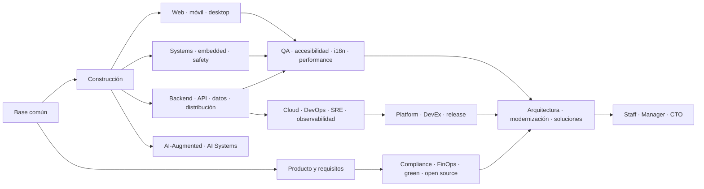

# 🧭 Rutas profesionales de Ingeniería de Software

Las rutas convierten las 40 partes del programa en recorridos orientados a trabajo
real. No reemplazan la secuencia fundamental: indican qué profundizar, qué decisiones
debe dominar cada perfil y qué evidencia conviene construir.

> Los nombres cambian entre empresas. Una oferta puede llamar *Software Engineer* a
> un backend, *DevOps* a un SRE o *Architect* a un Staff Engineer. Lee la misión, las
> responsabilidades y los límites del cargo antes de comparar títulos.

## Cómo leer una ruta

Cada guía contiene:

- qué problema profesional resuelve el rol y qué no le corresponde;
- cómo se ve una jornada plausible, sin idealizarla;
- conocimientos técnicos y habilidades de colaboración;
- partes del programa en orden recomendado;
- artefactos de portafolio que demuestran criterio, no solo exposición a herramientas;
- progresión, transiciones vecinas, mitos y preguntas de preparación.

La Parte 00 tiene contenido desarrollado; las partes posteriores se encuentran en
distintos grados de construcción. Una ruta describe el recorrido completo previsto,
no certifica que todo el material esté terminado hoy.

## Mapa de 40 roles

El mapa se deriva de las capacidades de las 40 partes: no son cuarenta cursos ni una
promesa de empleo, sino cuarenta lentes profesionales reutilizando el mismo programa.
Los perfiles cercanos se mantienen separados solo cuando cambian responsabilidades,
evidencia y decisiones de salida.

| Familia | Rol | Misión | Ruta principal |
| --- | --- | --- | --- |
| Ingeniería general | [Software Engineer](software-engineer.md) | construir y evolucionar software de extremo a extremo | 00–17 + especialidad |
| Ingeniería general | [Systems Programmer](systems-programmer.md) | controlar memoria, procesos, concurrencia y recursos | 01–09, 18, 22, 24–33 |
| Producto digital | [Backend Engineer](backend-engineer.md) | diseñar servicios, dominio y datos confiables | 05–13, 20, 24–35 |
| Producto digital | [Frontend Engineer](frontend-engineer.md) | construir interfaces accesibles y mantenibles | 05–14, 19, 24, 30–34 |
| Producto digital | [Full-stack Engineer](full-stack-engineer.md) | integrar experiencia, servicios y entrega | 05–20, 24–35 |
| Clientes | [Mobile Engineer](mobile-engineer.md) | operar bajo ciclos interrumpidos y conectividad variable | 05–14, 20–21, 26–35 |
| Clientes | [Desktop Engineer](desktop-engineer.md) | integrar, distribuir y actualizar clientes de escritorio | 01–18, 21, 26, 30–36 |
| Sistemas físicos | [Embedded & IoT Engineer](embedded-iot-engineer.md) | respetar límites de tiempo, memoria, energía y hardware | 01–09, 22–35 |
| Sistemas críticos | [Safety-Critical Software Engineer](safety-critical-software-engineer.md) | trazar hazards hasta controles y evidencia | 00, 04, 10–17, 22–37 |
| Interfaces | [API Engineer](api-engineer.md) | gobernar contratos compatibles y consumibles | 03, 05–13, 17, 20, 25–35 |
| Datos | [Data Engineer](data-engineer.md) | entregar datos trazables, oportunos y evolutivos | 01–13, 26–35 |
| Datos | [Database Reliability Engineer](database-reliability-engineer.md) | asegurar capacidad, cambios y recuperación de datos | 01–09, 18, 20, 25–36 |
| Distribución | [Distributed Systems Engineer](distributed-systems-engineer.md) | preservar garantías frente a fallos parciales | 01–13, 20, 24–35 |
| Calidad | [QA / Test Automation Engineer](qa-test-engineer.md) | convertir riesgos en evidencia y regresión | 04–14, 20, 24, 30–35 |
| Calidad | [Performance Engineer](performance-engineer.md) | medir capacidad y eliminar cuellos de botella reales | 01–08, 19–20, 26–35 |
| Inclusión | [Accessibility Engineer](accessibility-engineer.md) | eliminar barreras en tareas completas | 00, 10–14, 19, 21, 30–37 |
| Globalización | [Internationalization Engineer](internationalization-engineer.md) | separar lógica de idioma, tiempo y cultura | 01, 03–14, 19–21, 26, 30–34 |
| Análisis | [Requirements Engineer / Business Systems Analyst](requirements-engineer.md) | transformar necesidades y conflictos en acuerdos trazables | 00, 04, 10–17, 23, 30, 37 |
| Entrega | [DevOps Engineer](devops-engineer.md) | hacer repetible y segura la entrega de cambios | 02–03, 08–09, 16–18, 29–35 |
| Entrega | [Build & Release Engineer](build-release-engineer.md) | producir artefactos verificables y reversibles | 01–09, 16–18, 29–36 |
| Cloud | [Cloud Engineer](cloud-engineer.md) | automatizar infraestructura segura y recuperable | 01–09, 16–18, 20, 25–36 |
| Confiabilidad | [Site Reliability Engineer](site-reliability-engineer.md) | gestionar confiabilidad mediante software y SLO | 02–03, 20, 26–36 |
| Confiabilidad | [Observability Engineer](observability-engineer.md) | convertir telemetría en diagnóstico y acción | 02–03, 08, 20, 26–39 |
| Plataforma | [Platform Engineer](platform-engineer.md) | ofrecer capacidades internas autoservicio | 08–20, 29, 33–39 |
| Plataforma | [Developer Experience Engineer](developer-experience-engineer.md) | reducir fricción y tiempo de feedback con evidencia | 08–18, 29, 33–39 |
| Seguridad | [Security Engineer](security-engineer.md) | integrar prevención, detección y respuesta | 02–03, 09, 12–14, 20, 29–35 |
| Gobierno | [Compliance Engineer](compliance-engineer.md) | transformar obligaciones en controles y evidencia | 00, 10–17, 23, 32–37 |
| Economía | [FinOps Engineer](finops-engineer.md) | relacionar consumo tecnológico, valor y riesgo | 00, 10–11, 15, 25–38 |
| Sostenibilidad | [Green Software Engineer](green-software-engineer.md) | reducir recursos y carbono con mediciones comparables | 00–11, 19–38 |
| Conocimiento | [Technical Writer / Documentation Engineer](technical-writer.md) | hacer utilizable y mantenible el conocimiento técnico | 00, 04–20, 33–39 |
| Colaboración | [Open Source & InnerSource Engineer](open-source-innersource-engineer.md) | sostener contribución, governance y ownership | 00, 09–17, 32–37 |
| Evolución | [Legacy Modernization Engineer](legacy-modernization-engineer.md) | cambiar sistemas críticos sin perder continuidad | 08, 12–17, 24–36 |
| Diseño sistémico | [Software Architect](software-architect.md) | alinear restricciones, calidad y evolución | 10–17, 20, 23–37 |
| Diseño de soluciones | [Solutions Architect](solutions-architect.md) | integrar contexto, producto, terceros y transición | 00, 10–17, 19–39 |
| Producto técnico | [Technical Product Engineer](technical-product-engineer.md) | unir discovery, economía y factibilidad | 00, 10–20, 24–25, 31, 37–39 |
| Liderazgo técnico | [Staff / Principal / Technical Lead](technical-leadership.md) | multiplicar decisiones más allá de un equipo | 00, 10–17, 24–39 |
| Liderazgo de personas | [Engineering Manager](engineering-manager.md) | sostener personas, flujo, calidad y crecimiento | 00, 10–17, 31, 35–39 |
| Dirección | [CTO / Dirección de Tecnología](cto.md) | responder por estrategia, organización y riesgo | 00, 10–17, 23–39 |
| Ingeniería con IA | [AI-Augmented Software Engineer](ai-augmented-software-engineer.md) | desarrollar con agentes bajo verificación humana | 00, 05, 08–17, 24, 30–39 |
| Sistemas con IA | [AI Systems Engineer](ai-systems-engineer.md) | integrar modelos con evals, guardrails y fallback | 00–13, 20, 24–39 |

## Fuentes y criterios del mapa

Las guías no intentan fijar una taxonomía universal de cargos. Sus fronteras se
derivan de responsabilidades y cuerpos de práctica reconocibles:

| Decisión del mapa | Referencia primaria u oficial | Qué sustenta |
| --- | --- | --- |
| base común de ingeniería | [SWEBOK v4.0a — IEEE Computer Society](https://www.computer.org/education/bodies-of-knowledge/software-engineering) | amplitud profesional más allá de escribir código |
| requisitos y análisis | [ISO/IEC/IEEE 29148:2018](https://www.iso.org/standard/72089.html) | elicitación, especificación, validación y trazabilidad |
| calidad y especialización | [ISO/IEC 25010:2023](https://www.iso.org/standard/78176.html) | atributos que separan focos como rendimiento y confiabilidad |
| accesibilidad | [WCAG — W3C](https://www.w3.org/WAI/standards-guidelines/wcag/) | criterios verificables de accesibilidad digital |
| confiabilidad y operación | [Site Reliability Engineering — Google](https://sre.google/books/) | SLO, error budgets, toil e incidentes |
| desarrollo seguro | [Secure Software Development Framework — NIST](https://csrc.nist.gov/pubs/sp/800/218/final) | prácticas de seguridad dentro del ciclo de vida |
| observabilidad | [OpenTelemetry](https://opentelemetry.io/docs/) | instrumentación interoperable de logs, métricas y trazas |
| plataforma cloud native | [Kubernetes Documentation](https://kubernetes.io/docs/) | una referencia de implementación, no la definición completa del rol |
| sostenibilidad | [Software Carbon Intensity — Green Software Foundation](https://greensoftware.foundation/standards/sci/) | unidad funcional y medición de intensidad de carbono |
| sistemas con IA | [AI Risk Management Framework — NIST](https://www.nist.gov/itl/ai-risk-management-framework) | riesgo, evaluación, gobierno y supervisión |

Las certificaciones pueden ayudar a estructurar estudio en un proveedor o dominio,
pero ninguna sustituye la evidencia descrita en cada guía. No se publican bandas
salariales estáticas: varían por país, moneda, fecha, industria, modalidad y nivel;
presentarlas sin esos datos daría una precisión falsa. Para evaluar una vacante,
compara su misión y responsabilidades con la guía, no sólo el título.

## Familias y transiciones

El diagrama muestra transiciones frecuentes, no ascensos obligatorios. SRE no es
“DevOps senior”, arquitectura no es el premio por dejar de programar y management no
es el único camino de crecimiento. Es válido profundizar durante años en un oficio
individual contributor.

## Base común antes de especializarse

1. [Parte 00 — Ingeniería de software como profesión](../classes/part-00-ingenieria-de-software-como-profesion/README.md).
2. Partes 01–04 para comprender máquina, sistema operativo, red y resolución de problemas.
3. Partes 05–09 para programar, depurar, medir y empaquetar.
4. Partes 10–17 para entender producto, requisitos, estimación, colaboración y documentación.
5. Después, elige la especialidad y vuelve sobre calidad, seguridad, operación e IA
   según el riesgo real de los sistemas que construyas.

## Cómo demostrar preparación

Una ruta no se completa marcando enlaces. Construye evidencia acumulativa:

- decisiones registradas en ADR/RFC y conectadas con requisitos;
- código y contratos revisables con pruebas que detectan fallos reales;
- mediciones reproducibles de rendimiento, calidad o confiabilidad;
- incidentes simulados con diagnóstico, recuperación y aprendizaje;
- una migración o cambio compatible con rollback;
- explicación clara de alternativas, límites y deuda residual.

La [rúbrica transversal](../assessments/rubric.md) y el
[proyecto integrador](../projects/capstone.md) permiten revisar esa evidencia.

---

[⬅️ Volver al programa](../README.md) · [📚 Abrir las 480 clases](../classes/README.md) · [🗺️ Consultar el roadmap](../ROADMAP.md)
