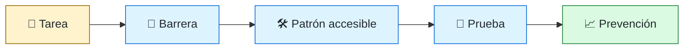
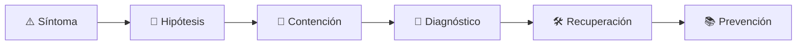

# ♿ Accessibility Engineer
<!-- role-visual:start -->

**La guía conecta trabajo real, decisiones, clases concretas y evidencia defendible.**

<!-- role-visual:end -->

> Integra accesibilidad en diseño, código, contenido, pruebas y operación para que
> personas con distintas capacidades puedan completar tareas reales.
>
> **Entrada habitual:** semi-senior · **Foco:** inclusión y calidad de interacción
> · **Evidencia central:** flujo probado con herramientas automáticas y uso manual

## 🧭 Qué es y por qué importa

Accessibility engineering convierte principios y WCAG en decisiones concretas de
semántica, navegación, contenido y componentes. No es una auditoría al final: evita
barreras desde requisitos y diseño y comprueba la experiencia con más de una técnica.

## 🗓️ Un día en el puesto

- revisar un flujo con teclado y lector de pantalla;
- diagnosticar nombre, rol, foco, contraste o anuncio incorrecto;
- asesorar diseño y componentes compartidos;
- combinar pruebas automáticas, manuales y con usuarios;
- priorizar barreras por impacto y prevenir regresiones.

## ✅ Responsabilidades y límites

- Responde por criterios, habilitación y evidencia de accesibilidad.
- Involucra personas con discapacidad sin convertirlas en único mecanismo de QA.
- No declara conformidad por pasar una herramienta automática.
- No reduce accesibilidad a color, ARIA o cumplimiento legal.

## 🧠 Qué necesitas saber

HTML semántico, accesibilidad de plataformas, teclado, foco, lectores de pantalla,
contraste, zoom, movimiento, contenido, formularios, multimedia, WCAG, inclusive
design, testing manual/automático y gestión de defectos.

## 📚 Tu ruta en el programa

1. Partes 00, 10–13 para ética, usuarios y requisitos.
2. [Parte 14 — Experiencia, accesibilidad e i18n](../classes/part-14-experiencia-accesibilidad-e-internacionalizacion/README.md).
3. Partes 19 y 21 para web y clientes.
4. Partes 30–32 para estrategia de prueba, calidad y cumplimiento.
5. Partes 34 y 37 para gates y cambio organizacional.

<!-- role-depth:start -->
## 🗺️ Sistema profesional del rol

El gráfico no representa una cascada rígida. Muestra el bucle profesional que este rol
debe poder recorrer: comprender el contexto, tomar una decisión, intervenir, observar
el efecto y convertir lo aprendido en una mejora. En **♿ Accessibility Engineer**, saltar directamente a
la herramienta suele ocultar el problema, mientras que terminar sin evidencia deja la
decisión en una opinión. La misión concreta es: Integra accesibilidad en diseño, código, contenido, pruebas y operación para que personas con distintas capacidades puedan completar tareas reales. Cada transición
debe conservar supuestos, responsables y una forma de volver atrás.

<table>
<tr>
<td valign="top" width="50%">

### 🎯 Responde por

- decisiones propias de la familia **Inclusión**;
- el resultado observable, no sólo la actividad ejecutada;
- límites, riesgos, operación y deuda residual de su intervención;
- evidencia que otra persona pueda revisar o reproducir.

</td>
<td valign="top" width="50%">

### 🤝 Coordina con

- [🎨 Frontend Engineer](frontend-engineer.md); [🧪 QA / Test Automation Engineer](qa-test-engineer.md); [✍️ Technical Writer / Documentation Engineer](technical-writer.md);
- producto y personas usuarias cuando cambia una tarea o outcome;
- seguridad, privacidad, accesibilidad y operación según el riesgo;
- quienes mantendrán el sistema después de la entrega.

</td>
</tr>
</table>

El título no concede autoridad automática. El alcance real depende del equipo, la
industria y la criticidad. Esta guía describe un recorrido desde **semi-senior → lead**, pero una
vacante se evalúa por las decisiones que permite tomar, los sistemas que pone bajo
responsabilidad y la evidencia exigida, no por el nombre del cargo.

## 🧱 Partes y clases asociadas

La ruta distingue **parte** —unidad curricular con una capacidad acumulativa— de
**clase asociada** —punto concreto donde se estudia un mecanismo o una decisión. Las
clases siguientes forman el núcleo; no eliminan los prerrequisitos indicados en sus
propias páginas ni convierten en opcional la base común.

| Orden | Parte del programa | Clases clave | Por qué entra en esta ruta | Evidencia de transferencia |
| ---: | --- | --- | --- | --- |
| 1 | [Parte 14 · Experiencia, accesibilidad e internacionalización](../classes/part-14-experiencia-accesibilidad-e-internacionalizacion/README.md) | [SE-173 · Accesibilidad perceptible, operable y comprensible](../classes/part-14-experiencia-accesibilidad-e-internacionalizacion/se-173-accesibilidad-perceptible-operable-y-comprensible/README.md) [SE-174 · Semántica, teclado, foco y tecnologías de asistencia](../classes/part-14-experiencia-accesibilidad-e-internacionalizacion/se-174-semantica-teclado-foco-y-tecnologias-de-asistencia/README.md) [SE-179 · Taller: auditar y reparar un flujo excluyente](../classes/part-14-experiencia-accesibilidad-e-internacionalizacion/se-179-taller-auditar-y-reparar-un-flujo-excluyente/README.md) | Profundiza **experiencia, accesibilidad e internacionalización** desde la responsabilidad del rol. | Flujo inclusivo evaluado. |
| 2 | [Parte 19 · Web, frontend y aplicaciones progresivas](../classes/part-19-web-frontend-y-aplicaciones-progresivas/README.md) | [SE-229 · Plataforma web, HTML semántico y CSS](../classes/part-19-web-frontend-y-aplicaciones-progresivas/se-229-plataforma-web-html-semantico-y-css/README.md) [SE-233 · Formularios, validación y experiencia de error](../classes/part-19-web-frontend-y-aplicaciones-progresivas/se-233-formularios-validacion-y-experiencia-de-error/README.md) [SE-239 · Taller: construir un flujo web resiliente](../classes/part-19-web-frontend-y-aplicaciones-progresivas/se-239-taller-construir-un-flujo-web-resiliente/README.md) | Profundiza **plataforma web, estado y experiencia cliente** desde la responsabilidad del rol. | Aplicación accesible y observable. |
| 3 | [Parte 21 · Software móvil, escritorio y multiplataforma](../classes/part-21-software-movil-escritorio-y-multiplataforma/README.md) | [SE-258 · Interacción táctil, teclado, mouse y accesibilidad](../classes/part-21-software-movil-escritorio-y-multiplataforma/se-258-interaccion-tactil-teclado-mouse-y-accesibilidad/README.md) [SE-263 · Taller: adaptar un producto a dos plataformas](../classes/part-21-software-movil-escritorio-y-multiplataforma/se-263-taller-adaptar-un-producto-a-dos-plataformas/README.md) [SE-264 · Proyecto: cliente multiplataforma con sincronización](../classes/part-21-software-movil-escritorio-y-multiplataforma/se-264-proyecto-cliente-multiplataforma-con-sincronizacion/README.md) | Profundiza **clientes, sincronización y distribución** desde la responsabilidad del rol. | Cliente offline con actualización segura. |
| 4 | [Parte 30 · Estrategia y técnicas de prueba](../classes/part-30-estrategia-y-tecnicas-de-prueba/README.md) | [SE-364 · End-to-end, aceptación y recorridos críticos](../classes/part-30-estrategia-y-tecnicas-de-prueba/se-364-end-to-end-aceptacion-y-recorridos-criticos/README.md) [SE-369 · Pruebas exploratorias y sesiones](../classes/part-30-estrategia-y-tecnicas-de-prueba/se-369-pruebas-exploratorias-y-sesiones/README.md) [SE-371 · Taller: demostrar que una prueba detecta defectos](../classes/part-30-estrategia-y-tecnicas-de-prueba/se-371-taller-demostrar-que-una-prueba-detecta-defectos/README.md) | Profundiza **estrategia de pruebas guiada por riesgo** desde la responsabilidad del rol. | Suite que demuestra detección de defectos. |

**Cómo recorrerla.** Empieza por [SE-173](../classes/part-14-experiencia-accesibilidad-e-internacionalizacion/se-173-accesibilidad-perceptible-operable-y-comprensible/README.md) para fijar el
primer mecanismo, usa [SE-258](../classes/part-21-software-movil-escritorio-y-multiplataforma/se-258-interaccion-tactil-teclado-mouse-y-accesibilidad/README.md) para integrar el
centro de la especialidad y llega a [SE-371](../classes/part-30-estrategia-y-tecnicas-de-prueba/se-371-taller-demostrar-que-una-prueba-detecta-defectos/README.md) cuando ya
puedas explicar cómo detectar y recuperar un fallo. Una clase se considera estudiada
sólo cuando su concepto cambia una decisión y deja evidencia; abrir todos los enlaces
no constituye competencia.

> [!IMPORTANT]
> El mapa expresa el currículo previsto. Las Partes 00–03 están desarrolladas; las
> posteriores conservan borradores o estructuras que deben superar revisión
> cualitativa. Esta ruta no declara terminadas esas clases ni reemplaza el
> [roadmap](../ROADMAP.md).

## ⚖️ Decisiones y trade-offs que debes defender

| Decisión recurrente | Criterio profesional | Evidencia mínima antes de defenderla |
| --- | --- | --- |
| **Semántica nativa o ARIA** | Usar el mecanismo más interoperable y simple. | Matriz navegador tecnología asistiva. |
| **Automático o manual** | Combinar detección rápida con evaluación de tarea y comprensión. | Evidencia de teclado lector zoom y contraste. |
| **Conformidad o usabilidad** | Cumplir criterios sin perder el objetivo real de la persona. | Prueba de tarea con barreras priorizadas. |

La calidad de una decisión no se juzga porque coincida con una herramienta popular.
Debe hacer explícitos contexto, restricciones, alternativas descartadas, coste de
cambio y condición de revisión. En especial, **Semántica nativa o ARIA**, **Automático o manual**
y **Conformidad o usabilidad** cambian de respuesta cuando cambia el riesgo. Una solución
correcta en un prototipo puede ser irresponsable en un sistema regulado; una solución
robusta para un servicio crítico puede ser desperdicio en una herramienta interna.

## 🚨 Escenario profesional: Un modal visible deja el foco detrás y atrapa a un lector

**Síntoma.** La implementación cambia apariencia sin gestionar nombre foco y retorno. La respuesta madura evita convertir la primera
correlación en causa y conserva evidencia antes de modificar el sistema.

1. **Detectar y delimitar:** identifica quién o qué está afectado, desde cuándo y qué
   cambió. Conserva timestamps, versiones, entradas y señales suficientes para no
   destruir la escena al intentar arreglarla.
2. **Investigar:** Recorrer DOM árbol accesible teclado anuncios y cierre. Formula al menos dos hipótesis rivales
   y define qué observación refutaría cada una.
3. **Contener:** reduce blast radius y daño sin prometer una corrección todavía. La
   contención debe ser reversible, visible y compatible con las obligaciones del
   sistema.
4. **Recuperar:** Restaurar semántica probar variantes y convertir la solución en patrón. Verifica la tarea completa, no sólo que un
   proceso volvió a estar verde.
5. **Aprender:** añade una regresión, señal o control que detecte la misma clase de
   fallo. Documenta qué deuda permanece y quién revisará la acción.

El escenario evalúa método además de resultado. Una recuperación rápida que borra la
causa, oculta pérdida de datos o deja al equipo sin mecanismo preventivo no demuestra
dominio del rol.

## 📊 Señales útiles y límites de las métricas

| Señal | Qué ayuda a observar | Trampa que debe evitarse |
| --- | --- | --- |
| **Éxito de tarea asistida** | Personas que completan el flujo con distintas técnicas. | Contar issues cerrados. |
| **Regresiones por componente** | Barreras reintroducidas en patrones compartidos. | Medir páginas y no sistema de diseño. |
| **Tiempo de remediación** | Velocidad desde barrera confirmada hasta solución verificada. | Cerrar tickets sin revalidación. |

Ninguna señal debe convertirse en ranking individual. Combina tendencia cuantitativa,
muestreo de casos, feedback cualitativo y contexto de carga. Declara ventana,
denominador, fuente, exclusiones y quién puede actuar sobre el resultado. Si una
métrica mejora mientras el outcome o el riesgo empeoran, el sistema está optimizando
el indicador y no el trabajo.

## 🧩 Proyecto integrador del rol: Flujo inclusivo verificable

**Propósito:** reparar una tarea completa y prevenir la misma barrera en el sistema de diseño. El resultado esperado es **auditoría priorizada componente accesible pruebas manuales automatizadas y guía de adopción**.

Entrega un expediente revisable con estas piezas:

1. **Contexto y alcance:** usuario, sistema, restricción, supuestos, fuera de alcance y
   criterio de no éxito.
2. **Decisión:** al menos dos alternativas reales, trade-offs, coste de reversión y un
   ADR o memo que indique cuándo revisar la elección.
3. **Artefacto principal:** una implementación, modelo, flujo o política coherente con
   las clases núcleo; no una captura aislada ni una presentación sin mecanismo.
4. **Fallo controlado:** introduce una condición adversa relacionada con el escenario
   anterior y conserva el resultado observado, sin inventar una ejecución.
5. **Verificación:** prueba, rúbrica, revisión o medición que pueda fallar y que conecte
   directamente con el resultado profesional.
6. **Operación y salida:** telemetría, recuperación, mantenimiento, deprecación o retiro
   según corresponda; incluye límites y deuda residual.

**Criterio de aceptación:** otra persona puede reconstruir el razonamiento, reproducir
la comprobación y distinguir claramente qué quedó demostrado de lo que sólo se propone.
El proyecto no se aprueba por cantidad de archivos ni por utilizar una marca concreta.

## 📈 Dominio esperado por alcance

| Alcance | Qué resuelve | Qué evidencia su autonomía |
| --- | --- | --- |
| **Inicial** | ejecuta una tarea acotada con criterios y acompañamiento | reproduce el caso, pregunta por supuestos y entrega evidencia legible |
| **Intermedio** | decide dentro de un componente o flujo conocido | compara alternativas, prueba fallos previsibles y coordina dependencias |
| **Senior** | conduce problemas ambiguos que cruzan sistemas o equipos | hace explícito el riesgo, diseña recuperación y mejora el mecanismo de trabajo |
| **Staff / Lead** | cambia capacidades compartidas y decisiones de largo plazo | multiplica criterio, define guardrails, mide adopción y conserva opciones futuras |

Progresar no significa alejarse de la práctica. Significa aumentar ambigüedad, horizonte,
blast radius y responsabilidad por consecuencias. La persona senior todavía debe poder
explicar el mecanismo; la persona Staff además crea condiciones para que otros lo
operen sin depender de ella.

## 🗓️ Plan de práctica 30 · 60 · 90 días

- **Días 1–30 — comprender y reproducir.** Estudia las primeras clases de cada parte,
  reproduce un caso pequeño y escribe un mapa de responsabilidades. El entregable es
  una baseline con preguntas abiertas, no una transformación prematura.
- **Días 31–60 — intervenir y fallar con control.** Construye el artefacto central,
  introduce el escenario de fallo y mide el comportamiento. Revisa el trabajo con una
  persona de una ruta vecina para descubrir supuestos de frontera.
- **Días 61–90 — operar y transferir.** Ejecuta recuperación, corrige la causa, publica
  runbook o guía de uso y presenta la decisión con trade-offs. Termina con una
  retrospectiva que separe resultado, evidencia, límites y siguiente inversión.

Este plan es una secuencia de práctica, no una promesa de empleabilidad en noventa días.
La experiencia previa, el dominio y el acceso a sistemas reales cambian el tiempo
necesario.

## 🎤 Preguntas para revisión o entrevista

1. ¿En qué contexto elegirías **Semántica nativa o ARIA** y qué evidencia te haría cambiar?
2. ¿Cómo distinguirías síntoma, causa y daño en el escenario **Un modal visible deja el foco detrás y atrapa a un lector**?
3. ¿Qué clase asociada usarías para diseñar el mecanismo y cuál para verificarlo?
4. ¿Qué parte de **Flujo inclusivo verificable** no automatizarías todavía y por qué?
5. ¿Qué métrica podría mejorar mientras el sistema empeora y qué guardrail añadirías?
6. ¿Dónde termina la autoridad de este rol y cuándo debe escalar o pedir revisión?

Una respuesta fuerte usa un caso, reconoce incertidumbre y propone una comprobación.
Nombrar una herramienta sin explicar mecanismo, fallo y límite no demuestra la
competencia.

## 🔗 Fuentes primarias y oficiales

- [Web Content Accessibility Guidelines 2.2](https://www.w3.org/TR/WCAG22/) — **W3C**. Se usa como referencia primaria u oficial; la guía no sustituye la fuente.
- [ISO/IEC 25010:2023](https://www.iso.org/standard/78176.html) — **ISO**. Se usa como referencia primaria u oficial; la guía no sustituye la fuente.
- [ACM Code of Ethics and Professional Conduct](https://www.acm.org/code-of-ethics) — **ACM**. Se usa como referencia primaria u oficial; la guía no sustituye la fuente.

Las fuentes orientan principios, vocabulario y prácticas; no convierten la guía en una
certificación ni sustituyen la documentación específica del sistema, la jurisdicción
o la tecnología utilizada.
<!-- role-depth:end -->

## 🧪 Evidencia de portafolio

- mapa de tareas, barreras, impacto y criterio de aceptación;
- flujo operable con teclado y lector de pantalla;
- pruebas automáticas y manuales con sus límites;
- patrón accesible documentado y prueba de regresión.

## 📈 Progresión

Frontend/QA/UX → Accessibility Engineer → Senior/Lead Accessibility o Inclusive Design.

## ⚠️ Mitos frecuentes

- “Un scanner cubre accesibilidad.” No evalúa comprensión ni recorrido completo.
- “ARIA arregla HTML.” La semántica nativa suele ser más robusta.
- “Es un grupo pequeño.” Las barreras cambian con contexto y situación.

## 🚀 Siguientes pasos

1. Selecciona una tarea completa, no componentes aislados.
2. Pruébala con teclado, zoom y lector de pantalla.
3. Convierte el defecto en patrón y regresión automatizada cuando proceda.

---

[⬅️ Volver a las rutas](README.md) · [🏠 Inicio del programa](../README.md)
