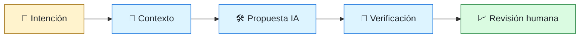
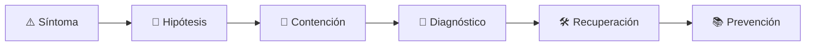

# 🤖 AI-Augmented Software Engineer
<!-- role-visual:start -->

**La guía conecta trabajo real, decisiones, clases concretas y evidencia defendible.**

<!-- role-visual:end -->

> Usa copilots y agentes para acelerar trabajo verificable sin delegar especificación,
> seguridad, arquitectura ni responsabilidad profesional.
>
> **Entrada habitual:** después de fundamentos de ingeniería · **Foco:** contexto,
> herramientas, evals y guardrails · **Evidencia central:** cambio asistido reproducible

## 🧭 Qué es y por qué importa

No es un oficio separado de la ingeniería: es una forma aumentada de ejercerla. El rol
selecciona tareas apropiadas, prepara contexto, limita herramientas, exige comprobaciones
deterministas y revisa resultados. Puede coordinar coding agents, terminal agents y
flujos multiagente, pero nunca interpreta “el agente terminó” como “el software funciona”.

## 🗓️ Un día en el puesto

- convertir una necesidad en criterios de salida observables;
- preparar instrucciones, archivos y límites de herramientas;
- pedir alternativas y revisar supuestos del modelo;
- ejecutar tests, linters, análisis y benchmarks;
- investigar una regresión o API inventada;
- registrar coste, latencia, provenance y decisión humana.

## ✅ Responsabilidades y límites

- Mantiene el ciclo HUMANO ESPECIFICA → IA PROPONE → HERRAMIENTAS VERIFICAN →
  HUMANO REVISA → SISTEMA VALIDA.
- Protege secretos, licencias y datos sensibles.
- No permite cambios irreversibles sin autorización y límites.
- No acepta tests generados que solo confirman la implementación.
- No usa agentes para saltarse comprensión del repositorio.

## 🧠 Qué necesitas saber

- ingeniería de software suficiente para evaluar la salida;
- prompting, context engineering, tools, MCP, skills y memoria;
- repository instructions, permisos y sandboxing;
- evals, benchmarks, regression suites y deterministic checks;
- hallucinated APIs, dependencias falsas, drift y loops;
- coste, latencia, confiabilidad, reproducibilidad y revisión humana.

## 📚 Tu ruta en el programa

1. Parte 00, partes 05 y 08–09: criterio, programación, debugging y dependencias.
2. Partes 12–13 y 16–17: requisitos, SPEC, colaboración y documentación.
3. Partes 24 y 30–35: diseño, pruebas, seguridad, pipeline y operación.
4. [Parte 38 — Desarrollo de software asistido por IA](../classes/part-38-desarrollo-de-software-asistido-por-ia/README.md).
5. [Parte 39 — SPEC, agentes y ciclo de vida agentic](../classes/part-39-spec-agentes-y-ciclo-de-vida-agentic/README.md).

<!-- role-depth:start -->
## 🗺️ Sistema profesional del rol

El gráfico no representa una cascada rígida. Muestra el bucle profesional que este rol
debe poder recorrer: comprender el contexto, tomar una decisión, intervenir, observar
el efecto y convertir lo aprendido en una mejora. En **🤖 AI-Augmented Software Engineer**, saltar directamente a
la herramienta suele ocultar el problema, mientras que terminar sin evidencia deja la
decisión en una opinión. La misión concreta es: Usa copilots y agentes para acelerar trabajo verificable sin delegar especificación, seguridad, arquitectura ni responsabilidad profesional. Cada transición
debe conservar supuestos, responsables y una forma de volver atrás.

<table>
<tr>
<td valign="top" width="50%">

### 🎯 Responde por

- decisiones propias de la familia **Ingeniería con IA**;
- el resultado observable, no sólo la actividad ejecutada;
- límites, riesgos, operación y deuda residual de su intervención;
- evidencia que otra persona pueda revisar o reproducir.

</td>
<td valign="top" width="50%">

### 🤝 Coordina con

- [🧑‍💻 Software Engineer](software-engineer.md); [🧠 AI Systems Engineer](ai-systems-engineer.md); [🧭 Staff / Principal Engineer y Technical Lead](technical-leadership.md);
- producto y personas usuarias cuando cambia una tarea o outcome;
- seguridad, privacidad, accesibilidad y operación según el riesgo;
- quienes mantendrán el sistema después de la entrega.

</td>
</tr>
</table>

El título no concede autoridad automática. El alcance real depende del equipo, la
industria y la criticidad. Esta guía describe un recorrido desde **junior → principal**, pero una
vacante se evalúa por las decisiones que permite tomar, los sistemas que pone bajo
responsabilidad y la evidencia exigida, no por el nombre del cargo.

## 🧱 Partes y clases asociadas

La ruta distingue **parte** —unidad curricular con una capacidad acumulativa— de
**clase asociada** —punto concreto donde se estudia un mecanismo o una decisión. Las
clases siguientes forman el núcleo; no eliminan los prerrequisitos indicados en sus
propias páginas ni convierten en opcional la base común.

| Orden | Parte del programa | Clases clave | Por qué entra en esta ruta | Evidencia de transferencia |
| ---: | --- | --- | --- | --- |
| 1 | [Parte 13 · Especificaciones, contratos y modelos](../classes/part-13-especificaciones-contratos-y-modelos/README.md) | [SE-165 · Spec-first, spec-anchored y spec-as-source](../classes/part-13-especificaciones-contratos-y-modelos/se-165-spec-first-spec-anchored-y-spec-as-source/README.md) [SE-166 · Especificaciones ejecutables y pruebas contractuales](../classes/part-13-especificaciones-contratos-y-modelos/se-166-especificaciones-ejecutables-y-pruebas-contractuales/README.md) [SE-168 · Proyecto: paquete de especificaciones trazables](../classes/part-13-especificaciones-contratos-y-modelos/se-168-proyecto-paquete-de-especificaciones-trazables/README.md) | Profundiza **contratos, modelos e invariantes verificables** desde la responsabilidad del rol. | Especificación trazable. |
| 2 | [Parte 30 · Estrategia y técnicas de prueba](../classes/part-30-estrategia-y-tecnicas-de-prueba/README.md) | [SE-365 · Pruebas basadas en propiedades y modelos](../classes/part-30-estrategia-y-tecnicas-de-prueba/se-365-pruebas-basadas-en-propiedades-y-modelos/README.md) [SE-366 · Mutación, fuzzing y generación de casos](../classes/part-30-estrategia-y-tecnicas-de-prueba/se-366-mutacion-fuzzing-y-generacion-de-casos/README.md) [SE-371 · Taller: demostrar que una prueba detecta defectos](../classes/part-30-estrategia-y-tecnicas-de-prueba/se-371-taller-demostrar-que-una-prueba-detecta-defectos/README.md) | Profundiza **estrategia de pruebas guiada por riesgo** desde la responsabilidad del rol. | Suite que demuestra detección de defectos. |
| 3 | [Parte 38 · Desarrollo de software asistido por IA](../classes/part-38-desarrollo-de-software-asistido-por-ia/README.md) | [SE-457 · Capacidades y límites de los modelos generativos](../classes/part-38-desarrollo-de-software-asistido-por-ia/se-457-capacidades-y-limites-de-los-modelos-generativos/README.md) [SE-465 · Evals de exactitud, utilidad, costo y latencia](../classes/part-38-desarrollo-de-software-asistido-por-ia/se-465-evals-de-exactitud-utilidad-costo-y-latencia/README.md) [SE-468 · Proyecto: cambio real con trazabilidad y revisión humana](../classes/part-38-desarrollo-de-software-asistido-por-ia/se-468-proyecto-cambio-real-con-trazabilidad-y-revision-humana/README.md) | Profundiza **ingeniería asistida por IA y evaluaciones** desde la responsabilidad del rol. | Cambio asistido con trazabilidad. |
| 4 | [Parte 39 · SPEC, agentes y ciclo de vida agentic](../classes/part-39-spec-agentes-y-ciclo-de-vida-agentic/README.md) | [SE-473 · Agentes, herramientas, permisos y límites de autoridad](../classes/part-39-spec-agentes-y-ciclo-de-vida-agentic/se-473-agentes-herramientas-permisos-y-limites-de-autoridad/README.md) [SE-477 · Human-in-the-loop, aprobación y acciones reversibles](../classes/part-39-spec-agentes-y-ciclo-de-vida-agentic/se-477-human-in-the-loop-aprobacion-y-acciones-reversibles/README.md) [SE-479 · Taller: detener, recuperar y evaluar un agente](../classes/part-39-spec-agentes-y-ciclo-de-vida-agentic/se-479-taller-detener-recuperar-y-evaluar-un-agente/README.md) | Profundiza **SPEC, agentes, herramientas y guardrails** desde la responsabilidad del rol. | Flujo agentic controlado. |

**Cómo recorrerla.** Empieza por [SE-165](../classes/part-13-especificaciones-contratos-y-modelos/se-165-spec-first-spec-anchored-y-spec-as-source/README.md) para fijar el
primer mecanismo, usa [SE-457](../classes/part-38-desarrollo-de-software-asistido-por-ia/se-457-capacidades-y-limites-de-los-modelos-generativos/README.md) para integrar el
centro de la especialidad y llega a [SE-479](../classes/part-39-spec-agentes-y-ciclo-de-vida-agentic/se-479-taller-detener-recuperar-y-evaluar-un-agente/README.md) cuando ya
puedas explicar cómo detectar y recuperar un fallo. Una clase se considera estudiada
sólo cuando su concepto cambia una decisión y deja evidencia; abrir todos los enlaces
no constituye competencia.

> [!IMPORTANT]
> El mapa expresa el currículo previsto. Las Partes 00–02 están desarrolladas; las
> posteriores conservan borradores o estructuras que deben superar revisión
> cualitativa. Esta ruta no declara terminadas esas clases ni reemplaza el
> [roadmap](../ROADMAP.md).

## ⚖️ Decisiones y trade-offs que debes defender

| Decisión recurrente | Criterio profesional | Evidencia mínima antes de defenderla |
| --- | --- | --- |
| **Automatizar o asistir** | Ceder ejecución sólo cuando autoridad pruebas y reversión son adecuadas. | Eval más log de herramientas. |
| **Contexto amplio o mínimo** | Aportar evidencia suficiente sin filtrar secretos ni saturar atención. | Prueba de recuperación y coste. |
| **Aceptar o regenerar** | Diagnosticar causa y cambiar especificación herramienta o modelo. | Regresión determinista no preferencia estética. |

La calidad de una decisión no se juzga porque coincida con una herramienta popular.
Debe hacer explícitos contexto, restricciones, alternativas descartadas, coste de
cambio y condición de revisión. En especial, **Automatizar o asistir**, **Contexto amplio o mínimo**
y **Aceptar o regenerar** cambian de respuesta cuando cambia el riesgo. Una solución
correcta en un prototipo puede ser irresponsable en un sistema regulado; una solución
robusta para un servicio crítico puede ser desperdicio en una herramienta interna.

## 🚨 Escenario profesional: Agente declara terminado pero inventa una API y tests que no ejercen el fallo

**Síntoma.** La señal de éxito proviene del mismo contexto que generó la solución. La respuesta madura evita convertir la primera
correlación en causa y conserva evidencia antes de modificar el sistema.

1. **Detectar y delimitar:** identifica quién o qué está afectado, desde cuándo y qué
   cambió. Conserva timestamps, versiones, entradas y señales suficientes para no
   destruir la escena al intentar arreglarla.
2. **Investigar:** Revisar diff dependencias documentación oficial oráculos permisos y pruebas externas. Formula al menos dos hipótesis rivales
   y define qué observación refutaría cada una.
3. **Contener:** reduce blast radius y daño sin prometer una corrección todavía. La
   contención debe ser reversible, visible y compatible con las obligaciones del
   sistema.
4. **Recuperar:** Detener revertir corregir SPEC y añadir eval que capture el patrón. Verifica la tarea completa, no sólo que un
   proceso volvió a estar verde.
5. **Aprender:** añade una regresión, señal o control que detecte la misma clase de
   fallo. Documenta qué deuda permanece y quién revisará la acción.

El escenario evalúa método además de resultado. Una recuperación rápida que borra la
causa, oculta pérdida de datos o deja al equipo sin mecanismo preventivo no demuestra
dominio del rol.

## 📊 Señales útiles y límites de las métricas

| Señal | Qué ayuda a observar | Trampa que debe evitarse |
| --- | --- | --- |
| **Tasa de aceptación verificada** | Propuestas que pasan revisión y sistema sin regresión. | Contar sugerencias aceptadas. |
| **Costo por cambio válido** | Tokens latencia revisión y retrabajo por outcome. | Comparar precio de llamada. |
| **Regresiones asistidas** | Defectos introducidos o no detectados por flujo IA. | Atribuir éxito al agente. |

Ninguna señal debe convertirse en ranking individual. Combina tendencia cuantitativa,
muestreo de casos, feedback cualitativo y contexto de carga. Declara ventana,
denominador, fuente, exclusiones y quién puede actuar sobre el resultado. Si una
métrica mejora mientras el outcome o el riesgo empeoran, el sistema está optimizando
el indicador y no el trabajo.

## 🧩 Proyecto integrador del rol: Cambio asistido auditable

**Propósito:** comparar flujo manual asistido y agentic sobre una mejora real. El resultado esperado es **SPEC contexto prompts tool log diff pruebas eval seguridad revisión humana coste y retrospectiva**.

Entrega un expediente revisable con estas piezas:

1. **Contexto y alcance:** usuario, sistema, restricción, supuestos, fuera de alcance y
   criterio de no éxito.
2. **Decisión:** al menos dos alternativas reales, trade-offs, coste de reversión y un
   ADR o memo que indique cuándo revisar la elección.
3. **Artefacto principal:** una implementación, modelo, flujo o política coherente con
   las clases núcleo; no una captura aislada ni una presentación sin mecanismo.
4. **Fallo controlado:** introduce una condición adversa relacionada con el escenario
   anterior y conserva el resultado observado, sin inventar una ejecución.
5. **Verificación:** prueba, rúbrica, revisión o medición que pueda fallar y que conecte
   directamente con el resultado profesional.
6. **Operación y salida:** telemetría, recuperación, mantenimiento, deprecación o retiro
   según corresponda; incluye límites y deuda residual.

**Criterio de aceptación:** otra persona puede reconstruir el razonamiento, reproducir
la comprobación y distinguir claramente qué quedó demostrado de lo que sólo se propone.
El proyecto no se aprueba por cantidad de archivos ni por utilizar una marca concreta.

## 📈 Dominio esperado por alcance

| Alcance | Qué resuelve | Qué evidencia su autonomía |
| --- | --- | --- |
| **Inicial** | ejecuta una tarea acotada con criterios y acompañamiento | reproduce el caso, pregunta por supuestos y entrega evidencia legible |
| **Intermedio** | decide dentro de un componente o flujo conocido | compara alternativas, prueba fallos previsibles y coordina dependencias |
| **Senior** | conduce problemas ambiguos que cruzan sistemas o equipos | hace explícito el riesgo, diseña recuperación y mejora el mecanismo de trabajo |
| **Staff / Lead** | cambia capacidades compartidas y decisiones de largo plazo | multiplica criterio, define guardrails, mide adopción y conserva opciones futuras |

Progresar no significa alejarse de la práctica. Significa aumentar ambigüedad, horizonte,
blast radius y responsabilidad por consecuencias. La persona senior todavía debe poder
explicar el mecanismo; la persona Staff además crea condiciones para que otros lo
operen sin depender de ella.

## 🗓️ Plan de práctica 30 · 60 · 90 días

- **Días 1–30 — comprender y reproducir.** Estudia las primeras clases de cada parte,
  reproduce un caso pequeño y escribe un mapa de responsabilidades. El entregable es
  una baseline con preguntas abiertas, no una transformación prematura.
- **Días 31–60 — intervenir y fallar con control.** Construye el artefacto central,
  introduce el escenario de fallo y mide el comportamiento. Revisa el trabajo con una
  persona de una ruta vecina para descubrir supuestos de frontera.
- **Días 61–90 — operar y transferir.** Ejecuta recuperación, corrige la causa, publica
  runbook o guía de uso y presenta la decisión con trade-offs. Termina con una
  retrospectiva que separe resultado, evidencia, límites y siguiente inversión.

Este plan es una secuencia de práctica, no una promesa de empleabilidad en noventa días.
La experiencia previa, el dominio y el acceso a sistemas reales cambian el tiempo
necesario.

## 🎤 Preguntas para revisión o entrevista

1. ¿En qué contexto elegirías **Automatizar o asistir** y qué evidencia te haría cambiar?
2. ¿Cómo distinguirías síntoma, causa y daño en el escenario **Agente declara terminado pero inventa una API y tests que no ejercen el fallo**?
3. ¿Qué clase asociada usarías para diseñar el mecanismo y cuál para verificarlo?
4. ¿Qué parte de **Cambio asistido auditable** no automatizarías todavía y por qué?
5. ¿Qué métrica podría mejorar mientras el sistema empeora y qué guardrail añadirías?
6. ¿Dónde termina la autoridad de este rol y cuándo debe escalar o pedir revisión?

Una respuesta fuerte usa un caso, reconoce incertidumbre y propone una comprobación.
Nombrar una herramienta sin explicar mecanismo, fallo y límite no demuestra la
competencia.

## 🔗 Fuentes primarias y oficiales

- [AI Risk Management Framework](https://www.nist.gov/itl/ai-risk-management-framework) — **NIST**. Se usa como referencia primaria u oficial; la guía no sustituye la fuente.
- [Model Context Protocol](https://modelcontextprotocol.io/specification/) — **MCP maintainers**. Se usa como referencia primaria u oficial; la guía no sustituye la fuente.
- [Secure Software Development Framework SP 800-218](https://csrc.nist.gov/pubs/sp/800/218/final) — **NIST**. Se usa como referencia primaria u oficial; la guía no sustituye la fuente.

Las fuentes orientan principios, vocabulario y prácticas; no convierten la guía en una
certificación ni sustituyen la documentación específica del sistema, la jurisdicción
o la tecnología utilizada.
<!-- role-depth:end -->

## 🧪 Evidencia de portafolio

- especificación y criterios antes de la generación;
- registro de herramientas, permisos y contexto entregado;
- comparación manual/asistida en calidad, coste y tiempo;
- eval que captura APIs falsas, regresiones o supuestos ocultos;
- cambio con tests independientes y revisión de seguridad/licencia;
- recuperación de un loop o acción fallida sin pérdida de estado.

## 📈 Progresión

La progresión sigue la ruta base —Junior, Senior, Staff— y añade capacidad de
orquestación. Un principiante no se vuelve senior por generar más código; necesita
reconocer fallos, operar el resultado y justificar decisiones.

## ⚠️ Mitos frecuentes

- “El modelo conoce el repositorio.” Solo conoce el contexto suministrado.
- “Más agentes producen mejor resultado.” También aumentan coordinación y coste.
- “Los tests generados verifican objetivamente.” Pueden repetir el mismo supuesto falso.
- “Autónomo significa sin supervisión.” La autonomía debe limitarse por riesgo.

## 🚀 Siguientes pasos

1. Elige una tarea pequeña con oráculo determinista.
2. Escribe criterios y límites antes de invocar el modelo.
3. Compara resultado manual y asistido con la misma suite.
4. Conserva fallos, coste y latencia; ajusta el flujo, no solo el prompt.

---

[⬅️ Volver a las rutas](README.md) · [🏠 Inicio del programa](../README.md)
