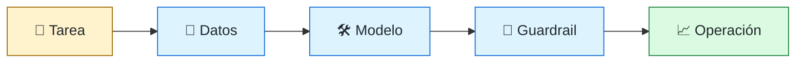
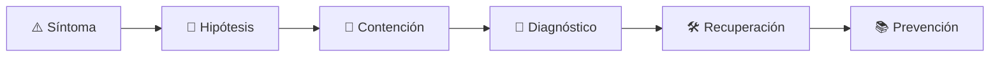

# 🧠 AI Systems Engineer
<!-- role-visual:start -->

**La guía conecta trabajo real, decisiones, clases concretas y evidencia defendible.**

<!-- role-visual:end -->

> Integra modelos en productos mediante datos, evaluaciones, guardrails y operación,
> sin confundir una demo probabilística con una capacidad confiable.
>
> **Entrada habitual:** semi-senior/senior · **Foco:** sistemas con modelos y evals
> · **Evidencia central:** capacidad de IA evaluada contra baseline, coste y riesgo

## 🧭 Qué es y por qué importa

Este rol construye el sistema alrededor del modelo: contrato, recuperación de contexto,
herramientas, seguridad, evaluación, fallback, observabilidad y revisión humana. No es
investigación de modelos fundacionales; integra capacidades probabilísticas en software.

## 🗓️ Un día en el puesto

- convertir un caso de uso en dataset y criterios de evaluación;
- comparar prompt, modelo, recuperación o herramienta;
- investigar alucinación, fuga de datos o regresión;
- revisar latencia, tokens, coste y fallback;
- desplegar un cambio controlado y analizar resultados.

## ✅ Responsabilidades y límites

- Responde por comportamiento del sistema completo, no sólo del modelo.
- Separa evaluación offline, online y revisión humana.
- No usa output del modelo como autorización o evidencia por sí solo.
- No promete determinismo donde el componente es probabilístico.

## 🧠 Qué necesitas saber

APIs y datos, prompts, embeddings y recuperación según caso, tool use, agentes, MCP,
datasets, evals, model grading con límites, seguridad, privacidad, provenance,
observabilidad, experimentación, coste, latencia y fallback.

## 📚 Tu ruta en el programa

1. Partes 00–13 para ingeniería, datos, contratos y evaluación de decisiones.
2. Partes 20 y 24–35 para integración, arquitectura, pruebas, seguridad y operación.
3. [Parte 38 — Desarrollo asistido por IA](../classes/part-38-desarrollo-de-software-asistido-por-ia/README.md).
4. [Parte 39 — SPEC y agentes](../classes/part-39-spec-agentes-y-ciclo-de-vida-agentic/README.md).

<!-- role-depth:start -->
## 🗺️ Sistema profesional del rol

El gráfico no representa una cascada rígida. Muestra el bucle profesional que este rol
debe poder recorrer: comprender el contexto, tomar una decisión, intervenir, observar
el efecto y convertir lo aprendido en una mejora. En **🧠 AI Systems Engineer**, saltar directamente a
la herramienta suele ocultar el problema, mientras que terminar sin evidencia deja la
decisión en una opinión. La misión concreta es: Integra modelos en productos mediante datos, evaluaciones, guardrails y operación, sin confundir una demo probabilística con una capacidad confiable. Cada transición
debe conservar supuestos, responsables y una forma de volver atrás.

<table>
<tr>
<td valign="top" width="50%">

### 🎯 Responde por

- decisiones propias de la familia **Sistemas con IA**;
- el resultado observable, no sólo la actividad ejecutada;
- límites, riesgos, operación y deuda residual de su intervención;
- evidencia que otra persona pueda revisar o reproducir.

</td>
<td valign="top" width="50%">

### 🤝 Coordina con

- [🤖 AI-Augmented Software Engineer](ai-augmented-software-engineer.md); [🧱 Data Engineer](data-engineer.md); [🔐 Security Engineer](security-engineer.md);
- producto y personas usuarias cuando cambia una tarea o outcome;
- seguridad, privacidad, accesibilidad y operación según el riesgo;
- quienes mantendrán el sistema después de la entrega.

</td>
</tr>
</table>

El título no concede autoridad automática. El alcance real depende del equipo, la
industria y la criticidad. Esta guía describe un recorrido desde **semi-senior → principal**, pero una
vacante se evalúa por las decisiones que permite tomar, los sistemas que pone bajo
responsabilidad y la evidencia exigida, no por el nombre del cargo.

## 🧱 Partes y clases asociadas

La ruta distingue **parte** —unidad curricular con una capacidad acumulativa— de
**clase asociada** —punto concreto donde se estudia un mecanismo o una decisión. Las
clases siguientes forman el núcleo; no eliminan los prerrequisitos indicados en sus
propias páginas ni convierten en opcional la base común.

| Orden | Parte del programa | Clases clave | Por qué entra en esta ruta | Evidencia de transferencia |
| ---: | --- | --- | --- | --- |
| 1 | [Parte 11 · Economía, métricas y decisiones de producto](../classes/part-11-economia-metricas-y-decisiones-de-producto/README.md) | [SE-137 · Telemetría de producto y consentimiento](../classes/part-11-economia-metricas-y-decisiones-de-producto/se-137-telemetria-de-producto-y-consentimiento/README.md) [SE-138 · Experimentos, sesgos y causalidad básica](../classes/part-11-economia-metricas-y-decisiones-de-producto/se-138-experimentos-sesgos-y-causalidad-basica/README.md) [SE-139 · North Star, guardrails y métricas contrarias](../classes/part-11-economia-metricas-y-decisiones-de-producto/se-139-north-star-guardrails-y-metricas-contrarias/README.md) | Profundiza **economía, métricas y experimentación** desde la responsabilidad del rol. | Caso económico con sensibilidad. |
| 2 | [Parte 23 · Software especializado y dominios](../classes/part-23-software-especializado-y-dominios/README.md) | [SE-279 · Machine learning como componente de producto](../classes/part-23-software-especializado-y-dominios/se-279-machine-learning-como-componente-de-producto/README.md) [SE-287 · Taller: comparar riesgos entre dominios](../classes/part-23-software-especializado-y-dominios/se-287-taller-comparar-riesgos-entre-dominios/README.md) [SE-288 · Proyecto: diseño profundo de un dominio elegido](../classes/part-23-software-especializado-y-dominios/se-288-proyecto-diseno-profundo-de-un-dominio-elegido/README.md) | Profundiza **dominios especializados, regulación y safety** desde la responsabilidad del rol. | Análisis de riesgo de dominio. |
| 3 | [Parte 38 · Desarrollo de software asistido por IA](../classes/part-38-desarrollo-de-software-asistido-por-ia/README.md) | [SE-457 · Capacidades y límites de los modelos generativos](../classes/part-38-desarrollo-de-software-asistido-por-ia/se-457-capacidades-y-limites-de-los-modelos-generativos/README.md) [SE-465 · Evals de exactitud, utilidad, costo y latencia](../classes/part-38-desarrollo-de-software-asistido-por-ia/se-465-evals-de-exactitud-utilidad-costo-y-latencia/README.md) [SE-466 · Privacidad, propiedad intelectual y código inseguro](../classes/part-38-desarrollo-de-software-asistido-por-ia/se-466-privacidad-propiedad-intelectual-y-codigo-inseguro/README.md) | Profundiza **ingeniería asistida por IA y evaluaciones** desde la responsabilidad del rol. | Cambio asistido con trazabilidad. |
| 4 | [Parte 39 · SPEC, agentes y ciclo de vida agentic](../classes/part-39-spec-agentes-y-ciclo-de-vida-agentic/README.md) | [SE-473 · Agentes, herramientas, permisos y límites de autoridad](../classes/part-39-spec-agentes-y-ciclo-de-vida-agentic/se-473-agentes-herramientas-permisos-y-limites-de-autoridad/README.md) [SE-475 · MCP, recursos, prompts, tools y confianza](../classes/part-39-spec-agentes-y-ciclo-de-vida-agentic/se-475-mcp-recursos-prompts-tools-y-confianza/README.md) [SE-478 · Seguridad agentic, prompt injection y auditoría](../classes/part-39-spec-agentes-y-ciclo-de-vida-agentic/se-478-seguridad-agentic-prompt-injection-y-auditoria/README.md) | Profundiza **SPEC, agentes, herramientas y guardrails** desde la responsabilidad del rol. | Flujo agentic controlado. |

**Cómo recorrerla.** Empieza por [SE-137](../classes/part-11-economia-metricas-y-decisiones-de-producto/se-137-telemetria-de-producto-y-consentimiento/README.md) para fijar el
primer mecanismo, usa [SE-457](../classes/part-38-desarrollo-de-software-asistido-por-ia/se-457-capacidades-y-limites-de-los-modelos-generativos/README.md) para integrar el
centro de la especialidad y llega a [SE-478](../classes/part-39-spec-agentes-y-ciclo-de-vida-agentic/se-478-seguridad-agentic-prompt-injection-y-auditoria/README.md) cuando ya
puedas explicar cómo detectar y recuperar un fallo. Una clase se considera estudiada
sólo cuando su concepto cambia una decisión y deja evidencia; abrir todos los enlaces
no constituye competencia.

> [!IMPORTANT]
> El mapa expresa el currículo previsto. Las Partes 00–04 están desarrolladas; las
> posteriores conservan borradores o estructuras que deben superar revisión
> cualitativa. Esta ruta no declara terminadas esas clases ni reemplaza el
> [roadmap](../ROADMAP.md).

## ⚖️ Decisiones y trade-offs que debes defender

| Decisión recurrente | Criterio profesional | Evidencia mínima antes de defenderla |
| --- | --- | --- |
| **Modelo grande o pequeño** | Comparar calidad latencia coste privacidad y control. | Eval por segmento y presupuesto. |
| **Prompt o ajuste** | Elegir intervención por estabilidad datos y mantenimiento. | Baseline versionado y conjunto de regresión. |
| **Responder o abstener** | Definir incertidumbre daño fallback y escalamiento humano. | Pruebas de negativa y recuperación. |

La calidad de una decisión no se juzga porque coincida con una herramienta popular.
Debe hacer explícitos contexto, restricciones, alternativas descartadas, coste de
cambio y condición de revisión. En especial, **Modelo grande o pequeño**, **Prompt o ajuste**
y **Responder o abstener** cambian de respuesta cuando cambia el riesgo. Una solución
correcta en un prototipo puede ser irresponsable en un sistema regulado; una solución
robusta para un servicio crítico puede ser desperdicio en una herramienta interna.

## 🚨 Escenario profesional: Modelo responde con seguridad aparente pero dato falso en flujo crítico

**Síntoma.** El sistema carece de grounding cita umbral o fallback adecuado. La respuesta madura evita convertir la primera
correlación en causa y conserva evidencia antes de modificar el sistema.

1. **Detectar y delimitar:** identifica quién o qué está afectado, desde cuándo y qué
   cambió. Conserva timestamps, versiones, entradas y señales suficientes para no
   destruir la escena al intentar arreglarla.
2. **Investigar:** Rastrear entrada contexto retrieval modelo versión salida guardrail y decisión. Formula al menos dos hipótesis rivales
   y define qué observación refutaría cada una.
3. **Contener:** reduce blast radius y daño sin prometer una corrección todavía. La
   contención debe ser reversible, visible y compatible con las obligaciones del
   sistema.
4. **Recuperar:** Contener bajar autoridad activar fallback revisar dataset y añadir eval adversarial. Verifica la tarea completa, no sólo que un
   proceso volvió a estar verde.
5. **Aprender:** añade una regresión, señal o control que detecte la misma clase de
   fallo. Documenta qué deuda permanece y quién revisará la acción.

El escenario evalúa método además de resultado. Una recuperación rápida que borra la
causa, oculta pérdida de datos o deja al equipo sin mecanismo preventivo no demuestra
dominio del rol.

## 📊 Señales útiles y límites de las métricas

| Señal | Qué ayuda a observar | Trampa que debe evitarse |
| --- | --- | --- |
| **Calidad por segmento** | Resultado útil y daño para grupos y casos distintos. | Publicar un promedio global. |
| **Costo y latencia por tarea** | Recursos desde entrada hasta decisión útil. | Medir sólo inferencia. |
| **Tasa de fallback** | Veces que el sistema se abstiene deriva o escala. | Tratar toda abstención como fracaso. |

Ninguna señal debe convertirse en ranking individual. Combina tendencia cuantitativa,
muestreo de casos, feedback cualitativo y contexto de carga. Declara ventana,
denominador, fuente, exclusiones y quién puede actuar sobre el resultado. Si una
métrica mejora mientras el outcome o el riesgo empeoran, el sistema está optimizando
el indicador y no el trabajo.

## 🧩 Proyecto integrador del rol: Capacidad de IA operable y reversible

**Propósito:** integrar un modelo con evaluación guardrails observabilidad privacidad y fallback. El resultado esperado es **dataset card evals baseline contrato de modelo threat model trazas control humano y runbook**.

Entrega un expediente revisable con estas piezas:

1. **Contexto y alcance:** usuario, sistema, restricción, supuestos, fuera de alcance y
   criterio de no éxito.
2. **Decisión:** al menos dos alternativas reales, trade-offs, coste de reversión y un
   ADR o memo que indique cuándo revisar la elección.
3. **Artefacto principal:** una implementación, modelo, flujo o política coherente con
   las clases núcleo; no una captura aislada ni una presentación sin mecanismo.
4. **Fallo controlado:** introduce una condición adversa relacionada con el escenario
   anterior y conserva el resultado observado, sin inventar una ejecución.
5. **Verificación:** prueba, rúbrica, revisión o medición que pueda fallar y que conecte
   directamente con el resultado profesional.
6. **Operación y salida:** telemetría, recuperación, mantenimiento, deprecación o retiro
   según corresponda; incluye límites y deuda residual.

**Criterio de aceptación:** otra persona puede reconstruir el razonamiento, reproducir
la comprobación y distinguir claramente qué quedó demostrado de lo que sólo se propone.
El proyecto no se aprueba por cantidad de archivos ni por utilizar una marca concreta.

## 📈 Dominio esperado por alcance

| Alcance | Qué resuelve | Qué evidencia su autonomía |
| --- | --- | --- |
| **Inicial** | ejecuta una tarea acotada con criterios y acompañamiento | reproduce el caso, pregunta por supuestos y entrega evidencia legible |
| **Intermedio** | decide dentro de un componente o flujo conocido | compara alternativas, prueba fallos previsibles y coordina dependencias |
| **Senior** | conduce problemas ambiguos que cruzan sistemas o equipos | hace explícito el riesgo, diseña recuperación y mejora el mecanismo de trabajo |
| **Staff / Lead** | cambia capacidades compartidas y decisiones de largo plazo | multiplica criterio, define guardrails, mide adopción y conserva opciones futuras |

Progresar no significa alejarse de la práctica. Significa aumentar ambigüedad, horizonte,
blast radius y responsabilidad por consecuencias. La persona senior todavía debe poder
explicar el mecanismo; la persona Staff además crea condiciones para que otros lo
operen sin depender de ella.

## 🗓️ Plan de práctica 30 · 60 · 90 días

- **Días 1–30 — comprender y reproducir.** Estudia las primeras clases de cada parte,
  reproduce un caso pequeño y escribe un mapa de responsabilidades. El entregable es
  una baseline con preguntas abiertas, no una transformación prematura.
- **Días 31–60 — intervenir y fallar con control.** Construye el artefacto central,
  introduce el escenario de fallo y mide el comportamiento. Revisa el trabajo con una
  persona de una ruta vecina para descubrir supuestos de frontera.
- **Días 61–90 — operar y transferir.** Ejecuta recuperación, corrige la causa, publica
  runbook o guía de uso y presenta la decisión con trade-offs. Termina con una
  retrospectiva que separe resultado, evidencia, límites y siguiente inversión.

Este plan es una secuencia de práctica, no una promesa de empleabilidad en noventa días.
La experiencia previa, el dominio y el acceso a sistemas reales cambian el tiempo
necesario.

## 🎤 Preguntas para revisión o entrevista

1. ¿En qué contexto elegirías **Modelo grande o pequeño** y qué evidencia te haría cambiar?
2. ¿Cómo distinguirías síntoma, causa y daño en el escenario **Modelo responde con seguridad aparente pero dato falso en flujo crítico**?
3. ¿Qué clase asociada usarías para diseñar el mecanismo y cuál para verificarlo?
4. ¿Qué parte de **Capacidad de IA operable y reversible** no automatizarías todavía y por qué?
5. ¿Qué métrica podría mejorar mientras el sistema empeora y qué guardrail añadirías?
6. ¿Dónde termina la autoridad de este rol y cuándo debe escalar o pedir revisión?

Una respuesta fuerte usa un caso, reconoce incertidumbre y propone una comprobación.
Nombrar una herramienta sin explicar mecanismo, fallo y límite no demuestra la
competencia.

## 🔗 Fuentes primarias y oficiales

- [AI Risk Management Framework](https://www.nist.gov/itl/ai-risk-management-framework) — **NIST**. Se usa como referencia primaria u oficial; la guía no sustituye la fuente.
- [Model Context Protocol](https://modelcontextprotocol.io/specification/) — **MCP maintainers**. Se usa como referencia primaria u oficial; la guía no sustituye la fuente.
- [ISO/IEC 25010:2023](https://www.iso.org/standard/78176.html) — **ISO**. Se usa como referencia primaria u oficial; la guía no sustituye la fuente.

Las fuentes orientan principios, vocabulario y prácticas; no convierten la guía en una
certificación ni sustituyen la documentación específica del sistema, la jurisdicción
o la tecnología utilizada.
<!-- role-depth:end -->

## 🧪 Evidencia de portafolio

- dataset versionado con criterios y casos adversos;
- baseline sin IA y comparación de calidad/coste/latencia;
- pruebas deterministas alrededor de herramientas y permisos;
- rollout, fallback y registro de revisión humana.

## 📈 Progresión

Software/Data Engineer → AI Systems Engineer → Senior/Staff AI Platform o Architect.

## ⚠️ Mitos frecuentes

- “Una demo buena demuestra producción.” No cubre distribución ni fallos reales.
- “El modelo grande resuelve contexto.” También puede amplificar coste y datos irrelevantes.
- “El agente terminó.” El sistema debe verificar artefactos y comportamiento.

## 🚀 Siguientes pasos

1. Define baseline, dataset y fallo inaceptable antes del prompt.
2. Encierra herramientas con permisos mínimos y salidas verificables.
3. Mide regresión, coste y latencia al cambiar cualquier componente.

---

[⬅️ Volver a las rutas](README.md) · [🏠 Inicio del programa](../README.md)
