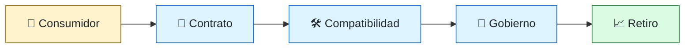
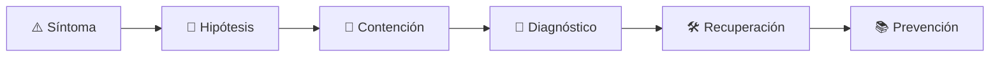

# 🔗 API Engineer
<!-- role-visual:start -->

**La guía conecta trabajo real, decisiones, clases concretas y evidencia defendible.**

<!-- role-visual:end -->

> Diseña contratos consumibles, compatibles y operables entre equipos, sistemas y
> organizaciones, cualquiera que sea su protocolo.
>
> **Entrada habitual:** semi-senior · **Foco:** contratos, experiencia y gobernanza
> · **Evidencia central:** API versionada con consumidores y fallos contractuales probados

## 🧭 Qué es y por qué importa

Una API es una promesa de comportamiento, no una lista de endpoints. API engineering
integra semántica, modelo de dominio, seguridad, compatibilidad, documentación y
operación para que productores y consumidores evolucionen sin coordinación perfecta.

## 🗓️ Un día en el puesto

- modelar un caso de uso y elegir REST, RPC, eventos o tiempo real;
- revisar OpenAPI/AsyncAPI y ejemplos de error;
- negociar compatibilidad y deprecación con consumidores;
- analizar abuso, cuotas, latencia e idempotencia;
- observar adopción y fallos por versión.

## ✅ Responsabilidades y límites

- Responde por contrato, ergonomía, seguridad y ciclo de vida de la interfaz.
- No convierte una preferencia de protocolo en arquitectura universal.
- No versiona para evitar comprender compatibilidad.
- No publica una API sin ownership, soporte y política de retirada.

## 🧠 Qué necesitas saber

HTTP y protocolos, REST/RPC/GraphQL/gRPC, WebSockets/SSE, eventos y webhooks;
modelado, esquemas, errores, paginación, idempotencia, authn/authz, rate limiting,
contract testing, SDK, observabilidad y developer experience.

## 📚 Tu ruta en el programa

1. Partes 03, 05–09 para red, programación y APIs internas.
2. Partes 10–13 y 17 para usuarios, contratos y documentación.
3. [Parte 20 — Backend y APIs](../classes/part-20-backend-apis-y-procesamiento-asincrono/README.md).
4. Partes 25–28 para límites, datos, eventos y distribución.
5. Partes 30–35 para pruebas, seguridad, gateways y operación.

<!-- role-depth:start -->
## 🗺️ Sistema profesional del rol

El gráfico no representa una cascada rígida. Muestra el bucle profesional que este rol
debe poder recorrer: comprender el contexto, tomar una decisión, intervenir, observar
el efecto y convertir lo aprendido en una mejora. En **🔗 API Engineer**, saltar directamente a
la herramienta suele ocultar el problema, mientras que terminar sin evidencia deja la
decisión en una opinión. La misión concreta es: Diseña contratos consumibles, compatibles y operables entre equipos, sistemas y organizaciones, cualquiera que sea su protocolo. Cada transición
debe conservar supuestos, responsables y una forma de volver atrás.

<table>
<tr>
<td valign="top" width="50%">

### 🎯 Responde por

- decisiones propias de la familia **Interfaces**;
- el resultado observable, no sólo la actividad ejecutada;
- límites, riesgos, operación y deuda residual de su intervención;
- evidencia que otra persona pueda revisar o reproducir.

</td>
<td valign="top" width="50%">

### 🤝 Coordina con

- [⚙️ Backend Engineer](backend-engineer.md); [✍️ Technical Writer / Documentation Engineer](technical-writer.md); [🧩 Solutions Architect](solutions-architect.md);
- producto y personas usuarias cuando cambia una tarea o outcome;
- seguridad, privacidad, accesibilidad y operación según el riesgo;
- quienes mantendrán el sistema después de la entrega.

</td>
</tr>
</table>

El título no concede autoridad automática. El alcance real depende del equipo, la
industria y la criticidad. Esta guía describe un recorrido desde **semi-senior → principal**, pero una
vacante se evalúa por las decisiones que permite tomar, los sistemas que pone bajo
responsabilidad y la evidencia exigida, no por el nombre del cargo.

## 🧱 Partes y clases asociadas

La ruta distingue **parte** —unidad curricular con una capacidad acumulativa— de
**clase asociada** —punto concreto donde se estudia un mecanismo o una decisión. Las
clases siguientes forman el núcleo; no eliminan los prerrequisitos indicados en sus
propias páginas ni convierten en opcional la base común.

| Orden | Parte del programa | Clases clave | Por qué entra en esta ruta | Evidencia de transferencia |
| ---: | --- | --- | --- | --- |
| 1 | [Parte 13 · Especificaciones, contratos y modelos](../classes/part-13-especificaciones-contratos-y-modelos/README.md) | [SE-163 · OpenAPI, AsyncAPI, GraphQL y contratos de eventos](../classes/part-13-especificaciones-contratos-y-modelos/se-163-openapi-asyncapi-graphql-y-contratos-de-eventos/README.md) [SE-164 · Compatibilidad, versionado y evolución de contratos](../classes/part-13-especificaciones-contratos-y-modelos/se-164-compatibilidad-versionado-y-evolucion-de-contratos/README.md) [SE-166 · Especificaciones ejecutables y pruebas contractuales](../classes/part-13-especificaciones-contratos-y-modelos/se-166-especificaciones-ejecutables-y-pruebas-contractuales/README.md) | Profundiza **contratos, modelos e invariantes verificables** desde la responsabilidad del rol. | Especificación trazable. |
| 2 | [Parte 20 · Backend, APIs y procesamiento asíncrono](../classes/part-20-backend-apis-y-procesamiento-asincrono/README.md) | [SE-242 · REST y semántica de recursos](../classes/part-20-backend-apis-y-procesamiento-asincrono/se-242-rest-y-semantica-de-recursos/README.md) [SE-243 · RPC, GraphQL y selección de interfaz](../classes/part-20-backend-apis-y-procesamiento-asincrono/se-243-rpc-graphql-y-seleccion-de-interfaz/README.md) [SE-246 · Idempotencia, reintentos y deduplicación](../classes/part-20-backend-apis-y-procesamiento-asincrono/se-246-idempotencia-reintentos-y-deduplicacion/README.md) | Profundiza **servicios, APIs y procesamiento asíncrono** desde la responsabilidad del rol. | Servicio contractual operable. |
| 3 | [Parte 27 · Integración, eventos y mensajería](../classes/part-27-integracion-eventos-y-mensajeria/README.md) | [SE-331 · Webhooks, polling y suscripciones](../classes/part-27-integracion-eventos-y-mensajeria/se-331-webhooks-polling-y-suscripciones/README.md) [SE-332 · Compatibilidad de esquemas y registros](../classes/part-27-integracion-eventos-y-mensajeria/se-332-compatibilidad-de-esquemas-y-registros/README.md) [SE-334 · Observabilidad y seguridad de integraciones](../classes/part-27-integracion-eventos-y-mensajeria/se-334-observabilidad-y-seguridad-de-integraciones/README.md) | Profundiza **eventos, mensajería y compatibilidad** desde la responsabilidad del rol. | Flujo tolerante a duplicados. |
| 4 | [Parte 30 · Estrategia y técnicas de prueba](../classes/part-30-estrategia-y-tecnicas-de-prueba/README.md) | [SE-363 · Integración, componentes y contratos](../classes/part-30-estrategia-y-tecnicas-de-prueba/se-363-integracion-componentes-y-contratos/README.md) [SE-364 · End-to-end, aceptación y recorridos críticos](../classes/part-30-estrategia-y-tecnicas-de-prueba/se-364-end-to-end-aceptacion-y-recorridos-criticos/README.md) [SE-371 · Taller: demostrar que una prueba detecta defectos](../classes/part-30-estrategia-y-tecnicas-de-prueba/se-371-taller-demostrar-que-una-prueba-detecta-defectos/README.md) | Profundiza **estrategia de pruebas guiada por riesgo** desde la responsabilidad del rol. | Suite que demuestra detección de defectos. |

**Cómo recorrerla.** Empieza por [SE-163](../classes/part-13-especificaciones-contratos-y-modelos/se-163-openapi-asyncapi-graphql-y-contratos-de-eventos/README.md) para fijar el
primer mecanismo, usa [SE-331](../classes/part-27-integracion-eventos-y-mensajeria/se-331-webhooks-polling-y-suscripciones/README.md) para integrar el
centro de la especialidad y llega a [SE-371](../classes/part-30-estrategia-y-tecnicas-de-prueba/se-371-taller-demostrar-que-una-prueba-detecta-defectos/README.md) cuando ya
puedas explicar cómo detectar y recuperar un fallo. Una clase se considera estudiada
sólo cuando su concepto cambia una decisión y deja evidencia; abrir todos los enlaces
no constituye competencia.

> [!IMPORTANT]
> El mapa expresa el currículo previsto. Las Partes 00–03 están desarrolladas; las
> posteriores conservan borradores o estructuras que deben superar revisión
> cualitativa. Esta ruta no declara terminadas esas clases ni reemplaza el
> [roadmap](../ROADMAP.md).

## ⚖️ Decisiones y trade-offs que debes defender

| Decisión recurrente | Criterio profesional | Evidencia mínima antes de defenderla |
| --- | --- | --- |
| **REST RPC o eventos** | Elegir semántica por interacción acoplamiento y tooling. | Prototipo contractual y escenario de fallo. |
| **Versión nueva o evolución compatible** | Preferir cambios aditivos con deprecación observable. | Consumer contract y análisis de uso. |
| **Gateway o lógica distribuida** | Centralizar capacidades transversales sin ocultar dominio. | Políticas versionadas y trazas extremo a extremo. |

La calidad de una decisión no se juzga porque coincida con una herramienta popular.
Debe hacer explícitos contexto, restricciones, alternativas descartadas, coste de
cambio y condición de revisión. En especial, **REST RPC o eventos**, **Versión nueva o evolución compatible**
y **Gateway o lógica distribuida** cambian de respuesta cuando cambia el riesgo. Una solución
correcta en un prototipo puede ser irresponsable en un sistema regulado; una solución
robusta para un servicio crítico puede ser desperdicio en una herramienta interna.

## 🚨 Escenario profesional: Un cambio opcional rompe un consumidor generado

**Síntoma.** La forma del esquema cambió aunque el endpoint conserve URL. La respuesta madura evita convertir la primera
correlación en causa y conserva evidencia antes de modificar el sistema.

1. **Detectar y delimitar:** identifica quién o qué está afectado, desde cuándo y qué
   cambió. Conserva timestamps, versiones, entradas y señales suficientes para no
   destruir la escena al intentar arreglarla.
2. **Investigar:** Comparar especificaciones SDK serialización y pruebas de consumidores. Formula al menos dos hipótesis rivales
   y define qué observación refutaría cada una.
3. **Contener:** reduce blast radius y daño sin prometer una corrección todavía. La
   contención debe ser reversible, visible y compatible con las obligaciones del
   sistema.
4. **Recuperar:** Restaurar compatibilidad publicar deprecación y añadir contract test. Verifica la tarea completa, no sólo que un
   proceso volvió a estar verde.
5. **Aprender:** añade una regresión, señal o control que detecte la misma clase de
   fallo. Documenta qué deuda permanece y quién revisará la acción.

El escenario evalúa método además de resultado. Una recuperación rápida que borra la
causa, oculta pérdida de datos o deja al equipo sin mecanismo preventivo no demuestra
dominio del rol.

## 📊 Señales útiles y límites de las métricas

| Señal | Qué ayuda a observar | Trampa que debe evitarse |
| --- | --- | --- |
| **Éxito por operación** | Resultado contractual no sólo código HTTP. | Agrupar errores de cliente y servidor. |
| **Adopción de versión** | Consumidores migrados antes de retiro. | Medir llamadas sin identificar dependencia. |
| **Incidentes de compatibilidad** | Rupturas causadas por cambio de contrato. | Culpar consumidores sin test previo. |

Ninguna señal debe convertirse en ranking individual. Combina tendencia cuantitativa,
muestreo de casos, feedback cualitativo y contexto de carga. Declara ventana,
denominador, fuente, exclusiones y quién puede actuar sobre el resultado. Si una
métrica mejora mientras el outcome o el riesgo empeoran, el sistema está optimizando
el indicador y no el trabajo.

## 🧩 Proyecto integrador del rol: API gobernada de extremo a extremo

**Propósito:** diseñar publicar observar evolucionar y retirar un contrato consumible. El resultado esperado es **OpenAPI o AsyncAPI SDK ejemplos pruebas contractuales métricas de adopción y política de deprecación**.

Entrega un expediente revisable con estas piezas:

1. **Contexto y alcance:** usuario, sistema, restricción, supuestos, fuera de alcance y
   criterio de no éxito.
2. **Decisión:** al menos dos alternativas reales, trade-offs, coste de reversión y un
   ADR o memo que indique cuándo revisar la elección.
3. **Artefacto principal:** una implementación, modelo, flujo o política coherente con
   las clases núcleo; no una captura aislada ni una presentación sin mecanismo.
4. **Fallo controlado:** introduce una condición adversa relacionada con el escenario
   anterior y conserva el resultado observado, sin inventar una ejecución.
5. **Verificación:** prueba, rúbrica, revisión o medición que pueda fallar y que conecte
   directamente con el resultado profesional.
6. **Operación y salida:** telemetría, recuperación, mantenimiento, deprecación o retiro
   según corresponda; incluye límites y deuda residual.

**Criterio de aceptación:** otra persona puede reconstruir el razonamiento, reproducir
la comprobación y distinguir claramente qué quedó demostrado de lo que sólo se propone.
El proyecto no se aprueba por cantidad de archivos ni por utilizar una marca concreta.

## 📈 Dominio esperado por alcance

| Alcance | Qué resuelve | Qué evidencia su autonomía |
| --- | --- | --- |
| **Inicial** | ejecuta una tarea acotada con criterios y acompañamiento | reproduce el caso, pregunta por supuestos y entrega evidencia legible |
| **Intermedio** | decide dentro de un componente o flujo conocido | compara alternativas, prueba fallos previsibles y coordina dependencias |
| **Senior** | conduce problemas ambiguos que cruzan sistemas o equipos | hace explícito el riesgo, diseña recuperación y mejora el mecanismo de trabajo |
| **Staff / Lead** | cambia capacidades compartidas y decisiones de largo plazo | multiplica criterio, define guardrails, mide adopción y conserva opciones futuras |

Progresar no significa alejarse de la práctica. Significa aumentar ambigüedad, horizonte,
blast radius y responsabilidad por consecuencias. La persona senior todavía debe poder
explicar el mecanismo; la persona Staff además crea condiciones para que otros lo
operen sin depender de ella.

## 🗓️ Plan de práctica 30 · 60 · 90 días

- **Días 1–30 — comprender y reproducir.** Estudia las primeras clases de cada parte,
  reproduce un caso pequeño y escribe un mapa de responsabilidades. El entregable es
  una baseline con preguntas abiertas, no una transformación prematura.
- **Días 31–60 — intervenir y fallar con control.** Construye el artefacto central,
  introduce el escenario de fallo y mide el comportamiento. Revisa el trabajo con una
  persona de una ruta vecina para descubrir supuestos de frontera.
- **Días 61–90 — operar y transferir.** Ejecuta recuperación, corrige la causa, publica
  runbook o guía de uso y presenta la decisión con trade-offs. Termina con una
  retrospectiva que separe resultado, evidencia, límites y siguiente inversión.

Este plan es una secuencia de práctica, no una promesa de empleabilidad en noventa días.
La experiencia previa, el dominio y el acceso a sistemas reales cambian el tiempo
necesario.

## 🎤 Preguntas para revisión o entrevista

1. ¿En qué contexto elegirías **REST RPC o eventos** y qué evidencia te haría cambiar?
2. ¿Cómo distinguirías síntoma, causa y daño en el escenario **Un cambio opcional rompe un consumidor generado**?
3. ¿Qué clase asociada usarías para diseñar el mecanismo y cuál para verificarlo?
4. ¿Qué parte de **API gobernada de extremo a extremo** no automatizarías todavía y por qué?
5. ¿Qué métrica podría mejorar mientras el sistema empeora y qué guardrail añadirías?
6. ¿Dónde termina la autoridad de este rol y cuándo debe escalar o pedir revisión?

Una respuesta fuerte usa un caso, reconoce incertidumbre y propone una comprobación.
Nombrar una herramienta sin explicar mecanismo, fallo y límite no demuestra la
competencia.

## 🔗 Fuentes primarias y oficiales

- [OpenAPI Specification](https://spec.openapis.org/oas/latest.html) — **OpenAPI Initiative**. Se usa como referencia primaria u oficial; la guía no sustituye la fuente.
- [AsyncAPI Specification](https://www.asyncapi.com/docs/reference/specification/latest) — **AsyncAPI Initiative**. Se usa como referencia primaria u oficial; la guía no sustituye la fuente.
- [HTTP Semantics](https://www.rfc-editor.org/rfc/rfc9110) — **IETF**. Se usa como referencia primaria u oficial; la guía no sustituye la fuente.

Las fuentes orientan principios, vocabulario y prácticas; no convierten la guía en una
certificación ni sustituyen la documentación específica del sistema, la jurisdicción
o la tecnología utilizada.
<!-- role-depth:end -->

## 🧪 Evidencia de portafolio

- contrato con casos positivos, negativos y ejemplos ejecutables;
- prueba proveedor-consumidor y detección de breaking change;
- política de versionado y deprecación aplicada;
- dashboard por operación, consumidor y versión.

## 📈 Progresión

Backend Engineer → API Engineer → Senior/Staff API → API Platform o Architect.

## ⚠️ Mitos frecuentes

- “REST es JSON sobre HTTP.” La semántica y el contrato importan más que el formato.
- “GraphQL elimina versionado.” Los cambios incompatibles siguen existiendo.
- “La documentación se genera sola.” Un esquema no explica intención ni decisiones.

## 🚀 Siguientes pasos

1. Diseña primero ejemplos y errores de un caso de uso.
2. Añade un consumidor real y rompe el contrato de forma controlada.
3. Practica deprecación, observación y retirada.

---

[⬅️ Volver a las rutas](README.md) · [🏠 Inicio del programa](../README.md)
