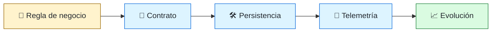
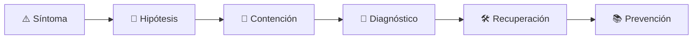

# ⚙️ Backend Engineer
<!-- role-visual:start -->

**La guía conecta trabajo real, decisiones, clases concretas y evidencia defendible.**

<!-- role-visual:end -->

> Diseña servicios, reglas de negocio, contratos y datos que siguen siendo confiables
> cuando aparecen concurrencia, fallos parciales y cambios de versión.
>
> **Entrada habitual:** junior/semi-senior · **Foco:** APIs, dominio, datos y operación
> · **Evidencia central:** servicio observable con contrato y recuperación probados

## 🧭 Qué es y por qué importa

Backend engineering construye las capacidades que viven detrás de una interfaz:
autorización, reglas, persistencia, integración y procesos asíncronos. El reto no es
solo responder HTTP; es conservar invariantes frente a duplicados, reintentos,
concurrencia, migraciones y dependencias degradadas.

## 🗓️ Un día en el puesto

- refinar una regla de negocio y convertirla en casos verificables;
- diseñar o evolucionar una API sin romper consumidores;
- investigar una consulta lenta, un timeout o un mensaje duplicado;
- revisar esquemas, migraciones y límites transaccionales;
- desplegar un cambio gradual y observar latencia, errores y saturación;
- coordinar con frontend, datos, seguridad, plataforma y producto.

## ✅ Responsabilidades y límites

- Responde por contratos, invariantes, datos y comportamiento bajo fallo.
- Debe comprender autenticación, autorización, privacidad y abuso.
- No convierte cada módulo en microservicio por defecto.
- No usa una cola para ocultar inconsistencias ni una caché para evitar modelar datos.
- No promete “exactly once” sin explicar el mecanismo y sus límites.

## 🧠 Qué necesitas saber

- estructuras de datos, concurrencia, procesos y redes;
- modelado de dominio, modularidad, errores e idempotencia;
- REST/RPC/GraphQL/gRPC, eventos, webhooks y contratos;
- transacciones, índices, caché, partición, réplica y migraciones;
- pruebas unitarias, integración, contrato, rendimiento y seguridad;
- logs estructurados, métricas, trazas, SLO y respuesta a incidentes.

## 📚 Tu ruta en el programa

1. Partes 00–09 para fundamentos y construcción.
2. Partes 10–13 para producto, requisitos, dominio y contratos.
3. [Parte 20 — Backend, APIs y procesamiento asíncrono](../classes/part-20-backend-apis-y-procesamiento-asincrono/README.md).
4. [Parte 24 — Diseño, patrones y refactorización](../classes/part-24-diseno-patrones-y-refactorizacion/README.md) y Parte 25.
5. Partes 26–28 para persistencia, eventos y distribución.
6. Partes 30–35 para pruebas, seguridad, entrega y operación.
7. Partes 36, 38 y 39 para evolución y trabajo asistido por agentes.

<!-- role-depth:start -->
## 🗺️ Sistema profesional del rol

El gráfico no representa una cascada rígida. Muestra el bucle profesional que este rol
debe poder recorrer: comprender el contexto, tomar una decisión, intervenir, observar
el efecto y convertir lo aprendido en una mejora. En **⚙️ Backend Engineer**, saltar directamente a
la herramienta suele ocultar el problema, mientras que terminar sin evidencia deja la
decisión en una opinión. La misión concreta es: Diseña servicios, reglas de negocio, contratos y datos que siguen siendo confiables cuando aparecen concurrencia, fallos parciales y cambios de versión. Cada transición
debe conservar supuestos, responsables y una forma de volver atrás.

<table>
<tr>
<td valign="top" width="50%">

### 🎯 Responde por

- decisiones propias de la familia **Producto digital**;
- el resultado observable, no sólo la actividad ejecutada;
- límites, riesgos, operación y deuda residual de su intervención;
- evidencia que otra persona pueda revisar o reproducir.

</td>
<td valign="top" width="50%">

### 🤝 Coordina con

- [🔗 API Engineer](api-engineer.md); [🧱 Data Engineer](data-engineer.md); [🌐 Distributed Systems Engineer](distributed-systems-engineer.md);
- producto y personas usuarias cuando cambia una tarea o outcome;
- seguridad, privacidad, accesibilidad y operación según el riesgo;
- quienes mantendrán el sistema después de la entrega.

</td>
</tr>
</table>

El título no concede autoridad automática. El alcance real depende del equipo, la
industria y la criticidad. Esta guía describe un recorrido desde **junior → principal**, pero una
vacante se evalúa por las decisiones que permite tomar, los sistemas que pone bajo
responsabilidad y la evidencia exigida, no por el nombre del cargo.

## 🧱 Partes y clases asociadas

La ruta distingue **parte** —unidad curricular con una capacidad acumulativa— de
**clase asociada** —punto concreto donde se estudia un mecanismo o una decisión. Las
clases siguientes forman el núcleo; no eliminan los prerrequisitos indicados en sus
propias páginas ni convierten en opcional la base común.

| Orden | Parte del programa | Clases clave | Por qué entra en esta ruta | Evidencia de transferencia |
| ---: | --- | --- | --- | --- |
| 1 | [Parte 20 · Backend, APIs y procesamiento asíncrono](../classes/part-20-backend-apis-y-procesamiento-asincrono/README.md) | [SE-241 · Responsabilidades y fronteras del backend](../classes/part-20-backend-apis-y-procesamiento-asincrono/se-241-responsabilidades-y-fronteras-del-backend/README.md) [SE-246 · Idempotencia, reintentos y deduplicación](../classes/part-20-backend-apis-y-procesamiento-asincrono/se-246-idempotencia-reintentos-y-deduplicacion/README.md) [SE-250 · Health, readiness y shutdown ordenado](../classes/part-20-backend-apis-y-procesamiento-asincrono/se-250-health-readiness-y-shutdown-ordenado/README.md) | Profundiza **servicios, APIs y procesamiento asíncrono** desde la responsabilidad del rol. | Servicio contractual operable. |
| 2 | [Parte 26 · Datos, persistencia y recuperación](../classes/part-26-datos-persistencia-y-recuperacion/README.md) | [SE-315 · Transacciones, aislamiento y concurrencia](../classes/part-26-datos-persistencia-y-recuperacion/se-315-transacciones-aislamiento-y-concurrencia/README.md) [SE-318 · Migraciones compatibles y evolución de esquema](../classes/part-26-datos-persistencia-y-recuperacion/se-318-migraciones-compatibles-y-evolucion-de-esquema/README.md) [SE-321 · Backups, restauración y pruebas de recuperación](../classes/part-26-datos-persistencia-y-recuperacion/se-321-backups-restauracion-y-pruebas-de-recuperacion/README.md) | Profundiza **persistencia, transacciones y recuperación** desde la responsabilidad del rol. | Capa de datos restaurable. |
| 3 | [Parte 27 · Integración, eventos y mensajería](../classes/part-27-integracion-eventos-y-mensajeria/README.md) | [SE-328 · Entrega, orden, duplicación y semánticas](../classes/part-27-integracion-eventos-y-mensajeria/se-328-entrega-orden-duplicacion-y-semanticas/README.md) [SE-329 · Outbox, inbox, sagas y compensación](../classes/part-27-integracion-eventos-y-mensajeria/se-329-outbox-inbox-sagas-y-compensacion/README.md) [SE-334 · Observabilidad y seguridad de integraciones](../classes/part-27-integracion-eventos-y-mensajeria/se-334-observabilidad-y-seguridad-de-integraciones/README.md) | Profundiza **eventos, mensajería y compatibilidad** desde la responsabilidad del rol. | Flujo tolerante a duplicados. |
| 4 | [Parte 35 · Observabilidad, SRE e incidentes](../classes/part-35-observabilidad-sre-e-incidentes/README.md) | [SE-421 · Señales, eventos y observabilidad útil](../classes/part-35-observabilidad-sre-e-incidentes/se-421-senales-eventos-y-observabilidad-util/README.md) [SE-425 · SLI, SLO, SLA y presupuestos de error](../classes/part-35-observabilidad-sre-e-incidentes/se-425-sli-slo-sla-y-presupuestos-de-error/README.md) [SE-431 · Taller: diagnosticar con telemetría incompleta](../classes/part-35-observabilidad-sre-e-incidentes/se-431-taller-diagnosticar-con-telemetria-incompleta/README.md) | Profundiza **observabilidad, SRE e incidentes** desde la responsabilidad del rol. | Incidente diagnosticado y recuperado. |

**Cómo recorrerla.** Empieza por [SE-241](../classes/part-20-backend-apis-y-procesamiento-asincrono/se-241-responsabilidades-y-fronteras-del-backend/README.md) para fijar el
primer mecanismo, usa [SE-328](../classes/part-27-integracion-eventos-y-mensajeria/se-328-entrega-orden-duplicacion-y-semanticas/README.md) para integrar el
centro de la especialidad y llega a [SE-431](../classes/part-35-observabilidad-sre-e-incidentes/se-431-taller-diagnosticar-con-telemetria-incompleta/README.md) cuando ya
puedas explicar cómo detectar y recuperar un fallo. Una clase se considera estudiada
sólo cuando su concepto cambia una decisión y deja evidencia; abrir todos los enlaces
no constituye competencia.

> [!IMPORTANT]
> El mapa expresa el currículo previsto. La Parte 00 está desarrollada; las partes
> posteriores conservan borradores o estructuras que deben superar revisión
> cualitativa. Esta ruta no declara terminadas esas clases ni reemplaza el
> [roadmap](../ROADMAP.md).

## ⚖️ Decisiones y trade-offs que debes defender

| Decisión recurrente | Criterio profesional | Evidencia mínima antes de defenderla |
| --- | --- | --- |
| **Síncrono o asíncrono** | Evaluar latencia acoplamiento confirmación y reintentos. | Prueba contractual más experimento de duplicación. |
| **Consistencia o disponibilidad** | Declarar qué invariantes no se negocian durante particiones. | Historial de operaciones y reconciliación verificable. |
| **Monolito o servicio** | Separar por límites y autonomía reales no por moda. | ADR con costes de operación y estrategia de retorno. |

La calidad de una decisión no se juzga porque coincida con una herramienta popular.
Debe hacer explícitos contexto, restricciones, alternativas descartadas, coste de
cambio y condición de revisión. En especial, **Síncrono o asíncrono**, **Consistencia o disponibilidad**
y **Monolito o servicio** cambian de respuesta cuando cambia el riesgo. Una solución
correcta en un prototipo puede ser irresponsable en un sistema regulado; una solución
robusta para un servicio crítico puede ser desperdicio en una herramienta interna.

## 🚨 Escenario profesional: Cobro o comando aplicado dos veces

**Síntoma.** Un cliente reintenta después de perder la respuesta. La respuesta madura evita convertir la primera
correlación en causa y conserva evidencia antes de modificar el sistema.

1. **Detectar y delimitar:** identifica quién o qué está afectado, desde cuándo y qué
   cambió. Conserva timestamps, versiones, entradas y señales suficientes para no
   destruir la escena al intentar arreglarla.
2. **Investigar:** Correlacionar request key transacción outbox y efectos externos. Formula al menos dos hipótesis rivales
   y define qué observación refutaría cada una.
3. **Contener:** reduce blast radius y daño sin prometer una corrección todavía. La
   contención debe ser reversible, visible y compatible con las obligaciones del
   sistema.
4. **Recuperar:** Contener compensar y probar que el mismo intento conserva el invariante. Verifica la tarea completa, no sólo que un
   proceso volvió a estar verde.
5. **Aprender:** añade una regresión, señal o control que detecte la misma clase de
   fallo. Documenta qué deuda permanece y quién revisará la acción.

El escenario evalúa método además de resultado. Una recuperación rápida que borra la
causa, oculta pérdida de datos o deja al equipo sin mecanismo preventivo no demuestra
dominio del rol.

## 📊 Señales útiles y límites de las métricas

| Señal | Qué ayuda a observar | Trampa que debe evitarse |
| --- | --- | --- |
| **Errores por operación** | Corrección observada por contrato y tipo de fallo. | Mezclar validación con dependencia caída. |
| **Latencia p50 p95 p99** | Distribución y cola bajo carga conocida. | Publicar percentiles sin volumen ni ventana. |
| **Duplicados reconciliados** | Eficacia de idempotencia y deduplicación. | Ocultar el problema descartando mensajes. |

Ninguna señal debe convertirse en ranking individual. Combina tendencia cuantitativa,
muestreo de casos, feedback cualitativo y contexto de carga. Declara ventana,
denominador, fuente, exclusiones y quién puede actuar sobre el resultado. Si una
métrica mejora mientras el outcome o el riesgo empeoran, el sistema está optimizando
el indicador y no el trabajo.

## 🧩 Proyecto integrador del rol: Servicio contractual recuperable

**Propósito:** operar una capacidad de negocio bajo reintentos degradación y migración. El resultado esperado es **OpenAPI migración compatible pruebas de contrato dashboard SLO y runbook**.

Entrega un expediente revisable con estas piezas:

1. **Contexto y alcance:** usuario, sistema, restricción, supuestos, fuera de alcance y
   criterio de no éxito.
2. **Decisión:** al menos dos alternativas reales, trade-offs, coste de reversión y un
   ADR o memo que indique cuándo revisar la elección.
3. **Artefacto principal:** una implementación, modelo, flujo o política coherente con
   las clases núcleo; no una captura aislada ni una presentación sin mecanismo.
4. **Fallo controlado:** introduce una condición adversa relacionada con el escenario
   anterior y conserva el resultado observado, sin inventar una ejecución.
5. **Verificación:** prueba, rúbrica, revisión o medición que pueda fallar y que conecte
   directamente con el resultado profesional.
6. **Operación y salida:** telemetría, recuperación, mantenimiento, deprecación o retiro
   según corresponda; incluye límites y deuda residual.

**Criterio de aceptación:** otra persona puede reconstruir el razonamiento, reproducir
la comprobación y distinguir claramente qué quedó demostrado de lo que sólo se propone.
El proyecto no se aprueba por cantidad de archivos ni por utilizar una marca concreta.

## 📈 Dominio esperado por alcance

| Alcance | Qué resuelve | Qué evidencia su autonomía |
| --- | --- | --- |
| **Inicial** | ejecuta una tarea acotada con criterios y acompañamiento | reproduce el caso, pregunta por supuestos y entrega evidencia legible |
| **Intermedio** | decide dentro de un componente o flujo conocido | compara alternativas, prueba fallos previsibles y coordina dependencias |
| **Senior** | conduce problemas ambiguos que cruzan sistemas o equipos | hace explícito el riesgo, diseña recuperación y mejora el mecanismo de trabajo |
| **Staff / Lead** | cambia capacidades compartidas y decisiones de largo plazo | multiplica criterio, define guardrails, mide adopción y conserva opciones futuras |

Progresar no significa alejarse de la práctica. Significa aumentar ambigüedad, horizonte,
blast radius y responsabilidad por consecuencias. La persona senior todavía debe poder
explicar el mecanismo; la persona Staff además crea condiciones para que otros lo
operen sin depender de ella.

## 🗓️ Plan de práctica 30 · 60 · 90 días

- **Días 1–30 — comprender y reproducir.** Estudia las primeras clases de cada parte,
  reproduce un caso pequeño y escribe un mapa de responsabilidades. El entregable es
  una baseline con preguntas abiertas, no una transformación prematura.
- **Días 31–60 — intervenir y fallar con control.** Construye el artefacto central,
  introduce el escenario de fallo y mide el comportamiento. Revisa el trabajo con una
  persona de una ruta vecina para descubrir supuestos de frontera.
- **Días 61–90 — operar y transferir.** Ejecuta recuperación, corrige la causa, publica
  runbook o guía de uso y presenta la decisión con trade-offs. Termina con una
  retrospectiva que separe resultado, evidencia, límites y siguiente inversión.

Este plan es una secuencia de práctica, no una promesa de empleabilidad en noventa días.
La experiencia previa, el dominio y el acceso a sistemas reales cambian el tiempo
necesario.

## 🎤 Preguntas para revisión o entrevista

1. ¿En qué contexto elegirías **Síncrono o asíncrono** y qué evidencia te haría cambiar?
2. ¿Cómo distinguirías síntoma, causa y daño en el escenario **Cobro o comando aplicado dos veces**?
3. ¿Qué clase asociada usarías para diseñar el mecanismo y cuál para verificarlo?
4. ¿Qué parte de **Servicio contractual recuperable** no automatizarías todavía y por qué?
5. ¿Qué métrica podría mejorar mientras el sistema empeora y qué guardrail añadirías?
6. ¿Dónde termina la autoridad de este rol y cuándo debe escalar o pedir revisión?

Una respuesta fuerte usa un caso, reconoce incertidumbre y propone una comprobación.
Nombrar una herramienta sin explicar mecanismo, fallo y límite no demuestra la
competencia.

## 🔗 Fuentes primarias y oficiales

- [OpenAPI Specification](https://spec.openapis.org/oas/latest.html) — **OpenAPI Initiative**. Se usa como referencia primaria u oficial; la guía no sustituye la fuente.
- [HTTP Semantics](https://www.rfc-editor.org/rfc/rfc9110) — **IETF**. Se usa como referencia primaria u oficial; la guía no sustituye la fuente.
- [Site Reliability Engineering](https://sre.google/books/) — **Google**. Se usa como referencia primaria u oficial; la guía no sustituye la fuente.

Las fuentes orientan principios, vocabulario y prácticas; no convierten la guía en una
certificación ni sustituyen la documentación específica del sistema, la jurisdicción
o la tecnología utilizada.
<!-- role-depth:end -->

## 🧪 Evidencia de portafolio

- OpenAPI o contrato equivalente con ejemplos positivos y negativos;
- API idempotente con pruebas de duplicación y reintento;
- migración de esquema compatible con rollback;
- consumidor asíncrono que recupera poison messages;
- dashboard y runbook para una degradación de dependencia;
- ADR comparando monolito modular, servicio separado y alternativa comprada.

## 📈 Progresión

Backend Junior → Backend Engineer → Senior → Staff/Principal o especialización en
datos, distribución, seguridad, plataforma o arquitectura. El crecimiento consiste
en proteger más invariantes y coordinar más consumidores, no en sumar endpoints.

## ⚠️ Mitos frecuentes

- “Backend es CRUD.” El CRUD trivial termina donde empiezan reglas, concurrencia y fallos.
- “Microservicios escalan equipos.” También multiplican contratos y operación.
- “La base de datos resuelve consistencia.” Solo dentro de garantías bien entendidas.
- “Más caché siempre mejora.” Puede empeorar corrección, coste y diagnóstico.

## 🚀 Siguientes pasos

1. Construye un monolito modular pequeño antes de distribuirlo.
2. Define invariantes y pruebas contractuales antes de optimizar.
3. Introduce una falla de dependencia y demuestra recuperación.
4. Mide p50/p95/p99 y explica qué carga produjo esos datos.

---

[⬅️ Volver a las rutas](README.md) · [🏠 Inicio del programa](../README.md)
