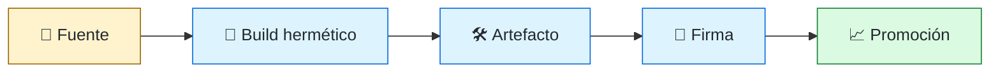
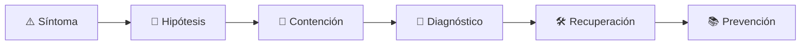

# 📦 Build & Release Engineer
<!-- role-visual:start -->

**La guía conecta trabajo real, decisiones, clases concretas y evidencia defendible.**

<!-- role-visual:end -->

> Convierte código fuente revisado en artefactos reproducibles, verificables y
> distribuibles con una historia de procedencia y reversión.
>
> **Entrada habitual:** semi-senior · **Foco:** builds, artefactos y releases
> · **Evidencia central:** release reconstruible, firmado y reversible

## 🧭 Qué es y por qué importa

El software que no puede reconstruirse ni atribuirse es difícil de parchear y confiar.
Build & Release Engineering gobierna toolchains, dependencias, versionado, artefactos,
promoción y entrega para reducir variación y riesgo de supply chain.

## 🗓️ Un día en el puesto

- investigar una compilación no determinista;
- actualizar toolchain o dependencia fijada;
- revisar SBOM, provenance y firmas;
- coordinar freeze, promoción, notas y rollback;
- medir duración, flakiness y tasa de fallos del pipeline.

## ✅ Responsabilidades y límites

- Responde por reproducibilidad, integridad y trazabilidad del artefacto.
- Separa construir, promover y desplegar.
- No firma artefactos que no puede relacionar con fuente y proceso.
- No sacrifica recuperabilidad para aumentar frecuencia de releases.

## 🧠 Qué necesitas saber

Compiladores, gestores de paquetes, lockfiles, cachés, hermeticidad, versionado,
repositorios de artefactos, SBOM, signing, provenance, SLSA, CI/CD, secretos,
release strategies y respuesta a dependencias comprometidas.

## 📚 Tu ruta en el programa

1. Partes 01–09 para toolchains, paquetes y automatización.
2. Partes 16–18 para Git, releases y documentación.
3. Parte 29 y [Parte 33 — Build, release y supply chain](../classes/part-33-build-release-y-cadena-de-suministro/README.md).
4. Partes 30–35 para gates, seguridad, despliegue y observación.
5. Parte 36 para parches y EOL.

<!-- role-depth:start -->
## 🗺️ Sistema profesional del rol

El gráfico no representa una cascada rígida. Muestra el bucle profesional que este rol
debe poder recorrer: comprender el contexto, tomar una decisión, intervenir, observar
el efecto y convertir lo aprendido en una mejora. En **📦 Build & Release Engineer**, saltar directamente a
la herramienta suele ocultar el problema, mientras que terminar sin evidencia deja la
decisión en una opinión. La misión concreta es: Convierte código fuente revisado en artefactos reproducibles, verificables y distribuibles con una historia de procedencia y reversión. Cada transición
debe conservar supuestos, responsables y una forma de volver atrás.

<table>
<tr>
<td valign="top" width="50%">

### 🎯 Responde por

- decisiones propias de la familia **Entrega**;
- el resultado observable, no sólo la actividad ejecutada;
- límites, riesgos, operación y deuda residual de su intervención;
- evidencia que otra persona pueda revisar o reproducir.

</td>
<td valign="top" width="50%">

### 🤝 Coordina con

- [🚚 DevOps Engineer](devops-engineer.md); [🔐 Security Engineer](security-engineer.md); [🖥️ Desktop Engineer](desktop-engineer.md);
- producto y personas usuarias cuando cambia una tarea o outcome;
- seguridad, privacidad, accesibilidad y operación según el riesgo;
- quienes mantendrán el sistema después de la entrega.

</td>
</tr>
</table>

El título no concede autoridad automática. El alcance real depende del equipo, la
industria y la criticidad. Esta guía describe un recorrido desde **semi-senior → principal**, pero una
vacante se evalúa por las decisiones que permite tomar, los sistemas que pone bajo
responsabilidad y la evidencia exigida, no por el nombre del cargo.

## 🧱 Partes y clases asociadas

La ruta distingue **parte** —unidad curricular con una capacidad acumulativa— de
**clase asociada** —punto concreto donde se estudia un mecanismo o una decisión. Las
clases siguientes forman el núcleo; no eliminan los prerrequisitos indicados en sus
propias páginas ni convierten en opcional la base común.

| Orden | Parte del programa | Clases clave | Por qué entra en esta ruta | Evidencia de transferencia |
| ---: | --- | --- | --- | --- |
| 1 | [Parte 09 · Bibliotecas, paquetes, SDK y automatización](../classes/part-09-bibliotecas-paquetes-sdk-y-automatizacion/README.md) | [SE-110 · SemVer, compatibilidad y contratos públicos](../classes/part-09-bibliotecas-paquetes-sdk-y-automatizacion/se-110-semver-compatibilidad-y-contratos-publicos/README.md) [SE-111 · Resolución de dependencias y lockfiles](../classes/part-09-bibliotecas-paquetes-sdk-y-automatizacion/se-111-resolucion-de-dependencias-y-lockfiles/README.md) [SE-112 · Paquetes, módulos y publicación](../classes/part-09-bibliotecas-paquetes-sdk-y-automatizacion/se-112-paquetes-modulos-y-publicacion/README.md) | Profundiza **paquetes, SDK, dependencias y compatibilidad** desde la responsabilidad del rol. | Paquete versionado y consumible. |
| 2 | [Parte 16 · Git, colaboración y código abierto](../classes/part-16-git-colaboracion-y-codigo-abierto/README.md) | [SE-194 · Commits atómicos, historial y recuperación](../classes/part-16-git-colaboracion-y-codigo-abierto/se-194-commits-atomicos-historial-y-recuperacion/README.md) [SE-197 · Trunk-based, GitFlow y estrategias híbridas](../classes/part-16-git-colaboracion-y-codigo-abierto/se-197-trunk-based-gitflow-y-estrategias-hibridas/README.md) [SE-202 · Firmas, procedencia y protección del repositorio](../classes/part-16-git-colaboracion-y-codigo-abierto/se-202-firmas-procedencia-y-proteccion-del-repositorio/README.md) | Profundiza **Git, revisión, ownership y colaboración abierta** desde la responsabilidad del rol. | Contribución completa y auditable. |
| 3 | [Parte 33 · Build, release y cadena de suministro](../classes/part-33-build-release-y-cadena-de-suministro/README.md) | [SE-397 · Build reproducible y hermético](../classes/part-33-build-release-y-cadena-de-suministro/se-397-build-reproducible-y-hermetico/README.md) [SE-400 · SBOM, procedencia y atestaciones](../classes/part-33-build-release-y-cadena-de-suministro/se-400-sbom-procedencia-y-atestaciones/README.md) [SE-407 · Taller: verificar la procedencia de un release](../classes/part-33-build-release-y-cadena-de-suministro/se-407-taller-verificar-la-procedencia-de-un-release/README.md) | Profundiza **build, release y cadena de suministro** desde la responsabilidad del rol. | Release firmado y verificable. |
| 4 | [Parte 34 · CI/CD, IaC y platform engineering](../classes/part-34-ci-cd-iac-y-platform-engineering/README.md) | [SE-409 · Integración continua y feedback temprano](../classes/part-34-ci-cd-iac-y-platform-engineering/se-409-integracion-continua-y-feedback-temprano/README.md) [SE-410 · Pipelines, jobs, matrices y cachés](../classes/part-34-ci-cd-iac-y-platform-engineering/se-410-pipelines-jobs-matrices-y-caches/README.md) [SE-419 · Taller: endurecer un pipeline vulnerable](../classes/part-34-ci-cd-iac-y-platform-engineering/se-419-taller-endurecer-un-pipeline-vulnerable/README.md) | Profundiza **CI/CD, IaC, plataforma y DevEx** desde la responsabilidad del rol. | Camino autoservicio con rollback. |

**Cómo recorrerla.** Empieza por [SE-110](../classes/part-09-bibliotecas-paquetes-sdk-y-automatizacion/se-110-semver-compatibilidad-y-contratos-publicos/README.md) para fijar el
primer mecanismo, usa [SE-397](../classes/part-33-build-release-y-cadena-de-suministro/se-397-build-reproducible-y-hermetico/README.md) para integrar el
centro de la especialidad y llega a [SE-419](../classes/part-34-ci-cd-iac-y-platform-engineering/se-419-taller-endurecer-un-pipeline-vulnerable/README.md) cuando ya
puedas explicar cómo detectar y recuperar un fallo. Una clase se considera estudiada
sólo cuando su concepto cambia una decisión y deja evidencia; abrir todos los enlaces
no constituye competencia.

> [!IMPORTANT]
> El mapa expresa el currículo previsto. Las Partes 00–02 están desarrolladas; las
> posteriores conservan borradores o estructuras que deben superar revisión
> cualitativa. Esta ruta no declara terminadas esas clases ni reemplaza el
> [roadmap](../ROADMAP.md).

## ⚖️ Decisiones y trade-offs que debes defender

| Decisión recurrente | Criterio profesional | Evidencia mínima antes de defenderla |
| --- | --- | --- |
| **Reproducibilidad o velocidad** | Controlar entradas y cachés sin perder trazabilidad. | Rebuild independiente con mismo resultado. |
| **Versión automática o deliberada** | Derivar SemVer de compatibilidad y política de producto. | Pruebas de consumidor más changelog. |
| **Disponibilidad o cuarentena** | Publicar rápido sin promover artefacto no verificado. | Repositorios separados y atestación. |

La calidad de una decisión no se juzga porque coincida con una herramienta popular.
Debe hacer explícitos contexto, restricciones, alternativas descartadas, coste de
cambio y condición de revisión. En especial, **Reproducibilidad o velocidad**, **Versión automática o deliberada**
y **Disponibilidad o cuarentena** cambian de respuesta cuando cambia el riesgo. Una solución
correcta en un prototipo puede ser irresponsable en un sistema regulado; una solución
robusta para un servicio crítico puede ser desperdicio en una herramienta interna.

## 🚨 Escenario profesional: Un release no puede reconstruirse tras una vulnerabilidad

**Síntoma.** Dependencias y herramientas flotantes cambiaron desde el tag. La respuesta madura evita convertir la primera
correlación en causa y conserva evidencia antes de modificar el sistema.

1. **Detectar y delimitar:** identifica quién o qué está afectado, desde cuándo y qué
   cambió. Conserva timestamps, versiones, entradas y señales suficientes para no
   destruir la escena al intentar arreglarla.
2. **Investigar:** Inventariar fuente lockfiles builder entorno y caché. Formula al menos dos hipótesis rivales
   y define qué observación refutaría cada una.
3. **Contener:** reduce blast radius y daño sin prometer una corrección todavía. La
   contención debe ser reversible, visible y compatible con las obligaciones del
   sistema.
4. **Recuperar:** Aislar artefacto fijar entradas reconstruir comparar y documentar diferencia. Verifica la tarea completa, no sólo que un
   proceso volvió a estar verde.
5. **Aprender:** añade una regresión, señal o control que detecte la misma clase de
   fallo. Documenta qué deuda permanece y quién revisará la acción.

El escenario evalúa método además de resultado. Una recuperación rápida que borra la
causa, oculta pérdida de datos o deja al equipo sin mecanismo preventivo no demuestra
dominio del rol.

## 📊 Señales útiles y límites de las métricas

| Señal | Qué ayuda a observar | Trampa que debe evitarse |
| --- | --- | --- |
| **Builds reproducibles** | Resultados equivalentes desde entradas declaradas. | Aceptar sólo que compiló. |
| **Tiempo de pipeline** | Feedback y capacidad de release. | Acelerar quitando controles críticos. |
| **Artefactos verificables** | Paquetes con checksum firma SBOM y procedencia. | Generar evidencia que nadie comprueba. |

Ninguna señal debe convertirse en ranking individual. Combina tendencia cuantitativa,
muestreo de casos, feedback cualitativo y contexto de carga. Declara ventana,
denominador, fuente, exclusiones y quién puede actuar sobre el resultado. Si una
métrica mejora mientras el outcome o el riesgo empeoran, el sistema está optimizando
el indicador y no el trabajo.

## 🧩 Proyecto integrador del rol: Release verificable y recuperable

**Propósito:** producir promover verificar y retirar un artefacto sin ambigüedad. El resultado esperado es **build hermético paquete SBOM firma atestación changelog canales y rollback**.

Entrega un expediente revisable con estas piezas:

1. **Contexto y alcance:** usuario, sistema, restricción, supuestos, fuera de alcance y
   criterio de no éxito.
2. **Decisión:** al menos dos alternativas reales, trade-offs, coste de reversión y un
   ADR o memo que indique cuándo revisar la elección.
3. **Artefacto principal:** una implementación, modelo, flujo o política coherente con
   las clases núcleo; no una captura aislada ni una presentación sin mecanismo.
4. **Fallo controlado:** introduce una condición adversa relacionada con el escenario
   anterior y conserva el resultado observado, sin inventar una ejecución.
5. **Verificación:** prueba, rúbrica, revisión o medición que pueda fallar y que conecte
   directamente con el resultado profesional.
6. **Operación y salida:** telemetría, recuperación, mantenimiento, deprecación o retiro
   según corresponda; incluye límites y deuda residual.

**Criterio de aceptación:** otra persona puede reconstruir el razonamiento, reproducir
la comprobación y distinguir claramente qué quedó demostrado de lo que sólo se propone.
El proyecto no se aprueba por cantidad de archivos ni por utilizar una marca concreta.

## 📈 Dominio esperado por alcance

| Alcance | Qué resuelve | Qué evidencia su autonomía |
| --- | --- | --- |
| **Inicial** | ejecuta una tarea acotada con criterios y acompañamiento | reproduce el caso, pregunta por supuestos y entrega evidencia legible |
| **Intermedio** | decide dentro de un componente o flujo conocido | compara alternativas, prueba fallos previsibles y coordina dependencias |
| **Senior** | conduce problemas ambiguos que cruzan sistemas o equipos | hace explícito el riesgo, diseña recuperación y mejora el mecanismo de trabajo |
| **Staff / Lead** | cambia capacidades compartidas y decisiones de largo plazo | multiplica criterio, define guardrails, mide adopción y conserva opciones futuras |

Progresar no significa alejarse de la práctica. Significa aumentar ambigüedad, horizonte,
blast radius y responsabilidad por consecuencias. La persona senior todavía debe poder
explicar el mecanismo; la persona Staff además crea condiciones para que otros lo
operen sin depender de ella.

## 🗓️ Plan de práctica 30 · 60 · 90 días

- **Días 1–30 — comprender y reproducir.** Estudia las primeras clases de cada parte,
  reproduce un caso pequeño y escribe un mapa de responsabilidades. El entregable es
  una baseline con preguntas abiertas, no una transformación prematura.
- **Días 31–60 — intervenir y fallar con control.** Construye el artefacto central,
  introduce el escenario de fallo y mide el comportamiento. Revisa el trabajo con una
  persona de una ruta vecina para descubrir supuestos de frontera.
- **Días 61–90 — operar y transferir.** Ejecuta recuperación, corrige la causa, publica
  runbook o guía de uso y presenta la decisión con trade-offs. Termina con una
  retrospectiva que separe resultado, evidencia, límites y siguiente inversión.

Este plan es una secuencia de práctica, no una promesa de empleabilidad en noventa días.
La experiencia previa, el dominio y el acceso a sistemas reales cambian el tiempo
necesario.

## 🎤 Preguntas para revisión o entrevista

1. ¿En qué contexto elegirías **Reproducibilidad o velocidad** y qué evidencia te haría cambiar?
2. ¿Cómo distinguirías síntoma, causa y daño en el escenario **Un release no puede reconstruirse tras una vulnerabilidad**?
3. ¿Qué clase asociada usarías para diseñar el mecanismo y cuál para verificarlo?
4. ¿Qué parte de **Release verificable y recuperable** no automatizarías todavía y por qué?
5. ¿Qué métrica podría mejorar mientras el sistema empeora y qué guardrail añadirías?
6. ¿Dónde termina la autoridad de este rol y cuándo debe escalar o pedir revisión?

Una respuesta fuerte usa un caso, reconoce incertidumbre y propone una comprobación.
Nombrar una herramienta sin explicar mecanismo, fallo y límite no demuestra la
competencia.

## 🔗 Fuentes primarias y oficiales

- [SLSA specification v1.2](https://slsa.dev/spec/v1.2/) — **OpenSSF**. Se usa como referencia primaria u oficial; la guía no sustituye la fuente.
- [SPDX Specification](https://spdx.dev/use/specifications/) — **Linux Foundation**. Se usa como referencia primaria u oficial; la guía no sustituye la fuente.
- [Semantic Versioning 2.0.0](https://semver.org/spec/v2.0.0.html) — **Semantic Versioning project**. Se usa como referencia primaria u oficial; la guía no sustituye la fuente.

Las fuentes orientan principios, vocabulario y prácticas; no convierten la guía en una
certificación ni sustituyen la documentación específica del sistema, la jurisdicción
o la tecnología utilizada.
<!-- role-depth:end -->

## 🧪 Evidencia de portafolio

- build repetido con comparación de artefactos;
- SBOM, firma y provenance verificables;
- pipeline con separación de permisos y promoción;
- simulación de dependencia comprometida y revocación.

## 📈 Progresión

Developer/DevOps → Build Engineer → Release Engineer → Staff Developer Productivity.

## ⚠️ Mitos frecuentes

- “CI verde significa release confiable.” Puede faltar procedencia o recuperación.
- “El lockfile resuelve supply chain.” Fija selección, no legitimidad ni seguridad.
- “Rollback es volver al binario.” Datos y contratos también evolucionan.

## 🚀 Siguientes pasos

1. Reconstruye el mismo commit en dos entornos.
2. Verifica firma, SBOM y origen antes de promover.
3. Revierte una entrega que incluya cambio compatible de datos.

---

[⬅️ Volver a las rutas](README.md) · [🏠 Inicio del programa](../README.md)
