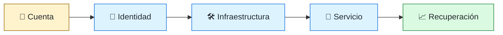
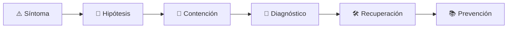

# ☁️ Cloud Engineer
<!-- role-visual:start -->

**La guía conecta trabajo real, decisiones, clases concretas y evidencia defendible.**

<!-- role-visual:end -->

> Diseña y automatiza capacidades cloud seguras, observables, recuperables y
> económicamente defendibles sin quedar atrapado en servicios por accidente.
>
> **Entrada habitual:** semi-senior · **Foco:** infraestructura, IAM y operación
> · **Evidencia central:** entorno reproducible con coste y recuperación comprobados

## 🧭 Qué es y por qué importa

Cloud engineering convierte servicios de proveedor en una plataforma operable. El
trabajo real abarca identidad, redes, datos, automatización, límites, facturación y
responsabilidad compartida; no consiste en hacer clic hasta que algo responda.

## 🗓️ Un día en el puesto

- revisar un cambio IaC y su impacto de permisos y coste;
- diagnosticar red, cuota, identidad o capacidad;
- diseñar aislamiento entre ambientes y cuentas;
- ensayar recuperación y destrucción segura;
- evaluar un servicio gestionado frente a alternativas.

## ✅ Responsabilidades y límites

- Responde por infraestructura declarada, seguridad base y operabilidad.
- Aplica mínimo privilegio y ownership de recursos.
- No confunde servicio gestionado con responsabilidad transferida.
- No construye multi-cloud sin amenaza, requisito o poder de negociación concreto.

## 🧠 Qué necesitas saber

Redes, IAM, cómputo, storage, containers, Kubernetes según necesidad, serverless,
IaC, GitOps, políticas, secretos, observabilidad, backup, DR, supply chain, FinOps
y modelos de responsabilidad compartida.

## 📚 Tu ruta en el programa

1. Partes 01–09 y 16–18 para sistemas, automatización y colaboración.
2. Partes 20, 25–28 para cargas, arquitectura, datos y distribución.
3. [Parte 29 — Cloud, plataforma e infraestructura](../classes/part-29-cloud-plataforma-e-infraestructura/README.md).
4. Partes 31–36 para resiliencia, seguridad, entrega, SRE y continuidad.

<!-- role-depth:start -->
## 🗺️ Sistema profesional del rol

El gráfico no representa una cascada rígida. Muestra el bucle profesional que este rol
debe poder recorrer: comprender el contexto, tomar una decisión, intervenir, observar
el efecto y convertir lo aprendido en una mejora. En **☁️ Cloud Engineer**, saltar directamente a
la herramienta suele ocultar el problema, mientras que terminar sin evidencia deja la
decisión en una opinión. La misión concreta es: Diseña y automatiza capacidades cloud seguras, observables, recuperables y económicamente defendibles sin quedar atrapado en servicios por accidente. Cada transición
debe conservar supuestos, responsables y una forma de volver atrás.

<table>
<tr>
<td valign="top" width="50%">

### 🎯 Responde por

- decisiones propias de la familia **Cloud**;
- el resultado observable, no sólo la actividad ejecutada;
- límites, riesgos, operación y deuda residual de su intervención;
- evidencia que otra persona pueda revisar o reproducir.

</td>
<td valign="top" width="50%">

### 🤝 Coordina con

- [🚚 DevOps Engineer](devops-engineer.md); [🛤️ Platform Engineer](platform-engineer.md); [🔐 Security Engineer](security-engineer.md);
- producto y personas usuarias cuando cambia una tarea o outcome;
- seguridad, privacidad, accesibilidad y operación según el riesgo;
- quienes mantendrán el sistema después de la entrega.

</td>
</tr>
</table>

El título no concede autoridad automática. El alcance real depende del equipo, la
industria y la criticidad. Esta guía describe un recorrido desde **semi-senior → principal**, pero una
vacante se evalúa por las decisiones que permite tomar, los sistemas que pone bajo
responsabilidad y la evidencia exigida, no por el nombre del cargo.

## 🧱 Partes y clases asociadas

La ruta distingue **parte** —unidad curricular con una capacidad acumulativa— de
**clase asociada** —punto concreto donde se estudia un mecanismo o una decisión. Las
clases siguientes forman el núcleo; no eliminan los prerrequisitos indicados en sus
propias páginas ni convierten en opcional la base común.

| Orden | Parte del programa | Clases clave | Por qué entra en esta ruta | Evidencia de transferencia |
| ---: | --- | --- | --- | --- |
| 1 | [Parte 29 · Cloud, plataforma e infraestructura](../classes/part-29-cloud-plataforma-e-infraestructura/README.md) | [SE-349 · IaaS, PaaS, SaaS y responsabilidad compartida](../classes/part-29-cloud-plataforma-e-infraestructura/se-349-iaas-paas-saas-y-responsabilidad-compartida/README.md) [SE-353 · Redes, identidad y secretos en cloud](../classes/part-29-cloud-plataforma-e-infraestructura/se-353-redes-identidad-y-secretos-en-cloud/README.md) [SE-354 · Infraestructura como código y estado](../classes/part-29-cloud-plataforma-e-infraestructura/se-354-infraestructura-como-codigo-y-estado/README.md) | Profundiza **cloud, infraestructura y plataformas** desde la responsabilidad del rol. | Entorno reproducible y eliminable. |
| 2 | [Parte 32 · Seguridad, privacidad y cumplimiento](../classes/part-32-seguridad-privacidad-y-cumplimiento/README.md) | [SE-387 · Autorización, recursos y mínimo privilegio](../classes/part-32-seguridad-privacidad-y-cumplimiento/se-387-autorizacion-recursos-y-minimo-privilegio/README.md) [SE-390 · Secretos, configuración y separación de ambientes](../classes/part-32-seguridad-privacidad-y-cumplimiento/se-390-secretos-configuracion-y-separacion-de-ambientes/README.md) [SE-393 · Vulnerabilidades, divulgación y respuesta](../classes/part-32-seguridad-privacidad-y-cumplimiento/se-393-vulnerabilidades-divulgacion-y-respuesta/README.md) | Profundiza **seguridad, privacidad y cumplimiento** desde la responsabilidad del rol. | Controles con pruebas y evidencia. |
| 3 | [Parte 34 · CI/CD, IaC y platform engineering](../classes/part-34-ci-cd-iac-y-platform-engineering/README.md) | [SE-412 · Credenciales efímeras y OIDC](../classes/part-34-ci-cd-iac-y-platform-engineering/se-412-credenciales-efimeras-y-oidc/README.md) [SE-414 · Infraestructura como código en pipeline](../classes/part-34-ci-cd-iac-y-platform-engineering/se-414-infraestructura-como-codigo-en-pipeline/README.md) [SE-415 · GitOps y reconciliación](../classes/part-34-ci-cd-iac-y-platform-engineering/se-415-gitops-y-reconciliacion/README.md) | Profundiza **CI/CD, IaC, plataforma y DevEx** desde la responsabilidad del rol. | Camino autoservicio con rollback. |
| 4 | [Parte 35 · Observabilidad, SRE e incidentes](../classes/part-35-observabilidad-sre-e-incidentes/README.md) | [SE-425 · SLI, SLO, SLA y presupuestos de error](../classes/part-35-observabilidad-sre-e-incidentes/se-425-sli-slo-sla-y-presupuestos-de-error/README.md) [SE-426 · Alertas accionables y fatiga](../classes/part-35-observabilidad-sre-e-incidentes/se-426-alertas-accionables-y-fatiga/README.md) [SE-430 · Continuidad, disaster recovery y ejercicios](../classes/part-35-observabilidad-sre-e-incidentes/se-430-continuidad-disaster-recovery-y-ejercicios/README.md) | Profundiza **observabilidad, SRE e incidentes** desde la responsabilidad del rol. | Incidente diagnosticado y recuperado. |

**Cómo recorrerla.** Empieza por [SE-349](../classes/part-29-cloud-plataforma-e-infraestructura/se-349-iaas-paas-saas-y-responsabilidad-compartida/README.md) para fijar el
primer mecanismo, usa [SE-412](../classes/part-34-ci-cd-iac-y-platform-engineering/se-412-credenciales-efimeras-y-oidc/README.md) para integrar el
centro de la especialidad y llega a [SE-430](../classes/part-35-observabilidad-sre-e-incidentes/se-430-continuidad-disaster-recovery-y-ejercicios/README.md) cuando ya
puedas explicar cómo detectar y recuperar un fallo. Una clase se considera estudiada
sólo cuando su concepto cambia una decisión y deja evidencia; abrir todos los enlaces
no constituye competencia.

> [!IMPORTANT]
> El mapa expresa el currículo previsto. Las Partes 00–03 están desarrolladas; las
> posteriores conservan borradores o estructuras que deben superar revisión
> cualitativa. Esta ruta no declara terminadas esas clases ni reemplaza el
> [roadmap](../ROADMAP.md).

## ⚖️ Decisiones y trade-offs que debes defender

| Decisión recurrente | Criterio profesional | Evidencia mínima antes de defenderla |
| --- | --- | --- |
| **Gestionado o autogestionado** | Comparar control carga operativa lock-in y recuperación. | TCO más prueba de salida. |
| **Una cuenta o separación** | Aislar riesgo blast radius facturación y deberes. | Policy y ejercicio de credenciales. |
| **Multi-cloud o profundidad** | Exigir necesidad de negocio antes de duplicar complejidad. | Escenario de continuidad y costes reales. |

La calidad de una decisión no se juzga porque coincida con una herramienta popular.
Debe hacer explícitos contexto, restricciones, alternativas descartadas, coste de
cambio y condición de revisión. En especial, **Gestionado o autogestionado**, **Una cuenta o separación**
y **Multi-cloud o profundidad** cambian de respuesta cuando cambia el riesgo. Una solución
correcta en un prototipo puede ser irresponsable en un sistema regulado; una solución
robusta para un servicio crítico puede ser desperdicio en una herramienta interna.

## 🚨 Escenario profesional: Una credencial comprometida modifica infraestructura crítica

**Síntoma.** Un principal de CI tiene permisos y duración excesivos. La respuesta madura evita convertir la primera
correlación en causa y conserva evidencia antes de modificar el sistema.

1. **Detectar y delimitar:** identifica quién o qué está afectado, desde cuándo y qué
   cambió. Conserva timestamps, versiones, entradas y señales suficientes para no
   destruir la escena al intentar arreglarla.
2. **Investigar:** Rastrear identidad sesión policy cloud trail estado y recursos. Formula al menos dos hipótesis rivales
   y define qué observación refutaría cada una.
3. **Contener:** reduce blast radius y daño sin prometer una corrección todavía. La
   contención debe ser reversible, visible y compatible con las obligaciones del
   sistema.
4. **Recuperar:** Revocar contener reconciliar IaC rotar confianza y verificar impacto. Verifica la tarea completa, no sólo que un
   proceso volvió a estar verde.
5. **Aprender:** añade una regresión, señal o control que detecte la misma clase de
   fallo. Documenta qué deuda permanece y quién revisará la acción.

El escenario evalúa método además de resultado. Una recuperación rápida que borra la
causa, oculta pérdida de datos o deja al equipo sin mecanismo preventivo no demuestra
dominio del rol.

## 📊 Señales útiles y límites de las métricas

| Señal | Qué ayuda a observar | Trampa que debe evitarse |
| --- | --- | --- |
| **Cambios fuera de IaC** | Drift que rompe reproducibilidad y control. | Medir sólo recursos importados. |
| **Costo por servicio** | Consumo asociado a outcome y capacidad. | Premiar ahorro que reduce resiliencia. |
| **Recuperación por región** | RTO y RPO observados ante pérdida. | Aceptar arquitectura en papel. |

Ninguna señal debe convertirse en ranking individual. Combina tendencia cuantitativa,
muestreo de casos, feedback cualitativo y contexto de carga. Declara ventana,
denominador, fuente, exclusiones y quién puede actuar sobre el resultado. Si una
métrica mejora mientras el outcome o el riesgo empeoran, el sistema está optimizando
el indicador y no el trabajo.

## 🧩 Proyecto integrador del rol: Entorno cloud mínimo seguro

**Propósito:** crear y destruir una plataforma con identidad efímera separación y recuperación. El resultado esperado es **IaC policy OIDC estimación de coste despliegue multi-entorno alertas y ejercicio de restauración**.

Entrega un expediente revisable con estas piezas:

1. **Contexto y alcance:** usuario, sistema, restricción, supuestos, fuera de alcance y
   criterio de no éxito.
2. **Decisión:** al menos dos alternativas reales, trade-offs, coste de reversión y un
   ADR o memo que indique cuándo revisar la elección.
3. **Artefacto principal:** una implementación, modelo, flujo o política coherente con
   las clases núcleo; no una captura aislada ni una presentación sin mecanismo.
4. **Fallo controlado:** introduce una condición adversa relacionada con el escenario
   anterior y conserva el resultado observado, sin inventar una ejecución.
5. **Verificación:** prueba, rúbrica, revisión o medición que pueda fallar y que conecte
   directamente con el resultado profesional.
6. **Operación y salida:** telemetría, recuperación, mantenimiento, deprecación o retiro
   según corresponda; incluye límites y deuda residual.

**Criterio de aceptación:** otra persona puede reconstruir el razonamiento, reproducir
la comprobación y distinguir claramente qué quedó demostrado de lo que sólo se propone.
El proyecto no se aprueba por cantidad de archivos ni por utilizar una marca concreta.

## 📈 Dominio esperado por alcance

| Alcance | Qué resuelve | Qué evidencia su autonomía |
| --- | --- | --- |
| **Inicial** | ejecuta una tarea acotada con criterios y acompañamiento | reproduce el caso, pregunta por supuestos y entrega evidencia legible |
| **Intermedio** | decide dentro de un componente o flujo conocido | compara alternativas, prueba fallos previsibles y coordina dependencias |
| **Senior** | conduce problemas ambiguos que cruzan sistemas o equipos | hace explícito el riesgo, diseña recuperación y mejora el mecanismo de trabajo |
| **Staff / Lead** | cambia capacidades compartidas y decisiones de largo plazo | multiplica criterio, define guardrails, mide adopción y conserva opciones futuras |

Progresar no significa alejarse de la práctica. Significa aumentar ambigüedad, horizonte,
blast radius y responsabilidad por consecuencias. La persona senior todavía debe poder
explicar el mecanismo; la persona Staff además crea condiciones para que otros lo
operen sin depender de ella.

## 🗓️ Plan de práctica 30 · 60 · 90 días

- **Días 1–30 — comprender y reproducir.** Estudia las primeras clases de cada parte,
  reproduce un caso pequeño y escribe un mapa de responsabilidades. El entregable es
  una baseline con preguntas abiertas, no una transformación prematura.
- **Días 31–60 — intervenir y fallar con control.** Construye el artefacto central,
  introduce el escenario de fallo y mide el comportamiento. Revisa el trabajo con una
  persona de una ruta vecina para descubrir supuestos de frontera.
- **Días 61–90 — operar y transferir.** Ejecuta recuperación, corrige la causa, publica
  runbook o guía de uso y presenta la decisión con trade-offs. Termina con una
  retrospectiva que separe resultado, evidencia, límites y siguiente inversión.

Este plan es una secuencia de práctica, no una promesa de empleabilidad en noventa días.
La experiencia previa, el dominio y el acceso a sistemas reales cambian el tiempo
necesario.

## 🎤 Preguntas para revisión o entrevista

1. ¿En qué contexto elegirías **Gestionado o autogestionado** y qué evidencia te haría cambiar?
2. ¿Cómo distinguirías síntoma, causa y daño en el escenario **Una credencial comprometida modifica infraestructura crítica**?
3. ¿Qué clase asociada usarías para diseñar el mecanismo y cuál para verificarlo?
4. ¿Qué parte de **Entorno cloud mínimo seguro** no automatizarías todavía y por qué?
5. ¿Qué métrica podría mejorar mientras el sistema empeora y qué guardrail añadirías?
6. ¿Dónde termina la autoridad de este rol y cuándo debe escalar o pedir revisión?

Una respuesta fuerte usa un caso, reconoce incertidumbre y propone una comprobación.
Nombrar una herramienta sin explicar mecanismo, fallo y límite no demuestra la
competencia.

## 🔗 Fuentes primarias y oficiales

- [Kubernetes Documentation](https://kubernetes.io/docs/) — **CNCF / Kubernetes**. Se usa como referencia primaria u oficial; la guía no sustituye la fuente.
- [Terraform language documentation](https://developer.hashicorp.com/terraform/language) — **HashiCorp**. Se usa como referencia primaria u oficial; la guía no sustituye la fuente.
- [Secure Software Development Framework SP 800-218](https://csrc.nist.gov/pubs/sp/800/218/final) — **NIST**. Se usa como referencia primaria u oficial; la guía no sustituye la fuente.

Las fuentes orientan principios, vocabulario y prácticas; no convierten la guía en una
certificación ni sustituyen la documentación específica del sistema, la jurisdicción
o la tecnología utilizada.
<!-- role-depth:end -->

## 🧪 Evidencia de portafolio

- IaC reproducible con plan, políticas y destrucción segura;
- matriz IAM con prueba de privilegio negativo;
- estimación de coste y alertas de anomalía;
- ejercicio de restauración y failover documentado.

## 📈 Progresión

Systems/DevOps Engineer → Cloud Engineer → Senior/Staff Cloud → Platform o Architect.

## ⚠️ Mitos frecuentes

- “Cloud elimina operaciones.” Cambia su interfaz y reparto de responsabilidades.
- “Serverless no tiene servidores.” Tiene límites, regiones, cold starts y coste.
- “IaC garantiza reproducibilidad.” También importan estado, imágenes y dependencias.

## 🚀 Siguientes pasos

1. Modela identidad, red, datos y coste antes del servicio.
2. Aprovisiona y destruye un entorno sin pasos manuales ocultos.
3. Pierde una dependencia y ejecuta recuperación.

---

[⬅️ Volver a las rutas](README.md) · [🏠 Inicio del programa](../README.md)
