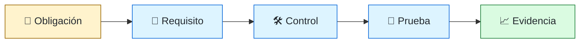
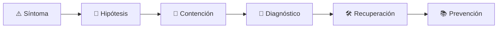

# ⚖️ Compliance Engineer
<!-- role-visual:start -->

**La guía conecta trabajo real, decisiones, clases concretas y evidencia defendible.**

<!-- role-visual:end -->

> Traduce obligaciones aplicables en controles técnicos verificables y paquetes de
> evidencia, sin confundir presencia documental con cumplimiento real.
>
> **Entrada habitual:** semi-senior/senior · **Foco:** controles, evidencia y auditoría
> · **Evidencia central:** regulación → requisito → control → prueba → evidencia

## 🧭 Qué es y por qué importa

Compliance engineering conecta especialistas legales, riesgo, seguridad, desarrollo
y operación. Su valor está en hacer ejecutables y auditables las obligaciones dentro
del ciclo de software, declarar alcance y mantener evidencia cuando el sistema cambia.

## 🗓️ Un día en el puesto

- precisar jurisdicción, sistema y obligación con asesoría competente;
- mapear un requisito a control y responsable;
- diseñar prueba y colección de evidencia;
- evaluar excepción y riesgo residual;
- preparar auditoría y corregir hallazgos sin teatro documental.

## ✅ Responsabilidades y límites

- Responde por trazabilidad, automatización y calidad de evidencia técnica.
- Conserva independencia entre quien implementa y quien evalúa cuando corresponda.
- No ofrece asesoría legal fuera de competencia.
- No declara cumplimiento universal por aprobar un checklist.

## 🧠 Qué necesitas saber

Requisitos, controles, IAM, logging, privacidad, retención, secure SDLC, change
management, testing, evidence-as-code, auditoría, excepciones, terceros, incidentes
y límites jurisdiccionales.

## 📚 Tu ruta en el programa

1. Partes 00 y 10–17 para ética, requisitos, riesgo y documentación.
2. Parte 23 para dominios regulados.
3. [Parte 32 — Seguridad, privacidad y cumplimiento](../classes/part-32-seguridad-privacidad-y-cumplimiento/README.md).
4. Partes 33–37 para supply chain, operación, retiro y gobierno.

<!-- role-depth:start -->
## 🗺️ Sistema profesional del rol

El gráfico no representa una cascada rígida. Muestra el bucle profesional que este rol
debe poder recorrer: comprender el contexto, tomar una decisión, intervenir, observar
el efecto y convertir lo aprendido en una mejora. En **⚖️ Compliance Engineer**, saltar directamente a
la herramienta suele ocultar el problema, mientras que terminar sin evidencia deja la
decisión en una opinión. La misión concreta es: Traduce obligaciones aplicables en controles técnicos verificables y paquetes de evidencia, sin confundir presencia documental con cumplimiento real. Cada transición
debe conservar supuestos, responsables y una forma de volver atrás.

<table>
<tr>
<td valign="top" width="50%">

### 🎯 Responde por

- decisiones propias de la familia **Gobierno**;
- el resultado observable, no sólo la actividad ejecutada;
- límites, riesgos, operación y deuda residual de su intervención;
- evidencia que otra persona pueda revisar o reproducir.

</td>
<td valign="top" width="50%">

### 🤝 Coordina con

- [🔐 Security Engineer](security-engineer.md); [🧾 Requirements Engineer / Business Systems Analyst](requirements-engineer.md); [🧭 CTO / Dirección de Tecnología](cto.md);
- producto y personas usuarias cuando cambia una tarea o outcome;
- seguridad, privacidad, accesibilidad y operación según el riesgo;
- quienes mantendrán el sistema después de la entrega.

</td>
</tr>
</table>

El título no concede autoridad automática. El alcance real depende del equipo, la
industria y la criticidad. Esta guía describe un recorrido desde **semi-senior → principal**, pero una
vacante se evalúa por las decisiones que permite tomar, los sistemas que pone bajo
responsabilidad y la evidencia exigida, no por el nombre del cargo.

## 🧱 Partes y clases asociadas

La ruta distingue **parte** —unidad curricular con una capacidad acumulativa— de
**clase asociada** —punto concreto donde se estudia un mecanismo o una decisión. Las
clases siguientes forman el núcleo; no eliminan los prerrequisitos indicados en sus
propias páginas ni convierten en opcional la base común.

| Orden | Parte del programa | Clases clave | Por qué entra en esta ruta | Evidencia de transferencia |
| ---: | --- | --- | --- | --- |
| 1 | [Parte 12 · Ingeniería de requisitos](../classes/part-12-ingenieria-de-requisitos/README.md) | [SE-151 · Trazabilidad desde necesidad hasta evidencia](../classes/part-12-ingenieria-de-requisitos/se-151-trazabilidad-desde-necesidad-hasta-evidencia/README.md) [SE-152 · Requisitos regulatorios, de datos y seguridad](../classes/part-12-ingenieria-de-requisitos/se-152-requisitos-regulatorios-de-datos-y-seguridad/README.md) [SE-153 · Gestión de cambios y líneas base](../classes/part-12-ingenieria-de-requisitos/se-153-gestion-de-cambios-y-lineas-base/README.md) | Profundiza **requisitos, restricciones y trazabilidad** desde la responsabilidad del rol. | Baseline de requisitos revisable. |
| 2 | [Parte 23 · Software especializado y dominios](../classes/part-23-software-especializado-y-dominios/README.md) | [SE-283 · Salud, datos sensibles y sistemas regulados](../classes/part-23-software-especializado-y-dominios/se-283-salud-datos-sensibles-y-sistemas-regulados/README.md) [SE-287 · Taller: comparar riesgos entre dominios](../classes/part-23-software-especializado-y-dominios/se-287-taller-comparar-riesgos-entre-dominios/README.md) [SE-288 · Proyecto: diseño profundo de un dominio elegido](../classes/part-23-software-especializado-y-dominios/se-288-proyecto-diseno-profundo-de-un-dominio-elegido/README.md) | Profundiza **dominios especializados, regulación y safety** desde la responsabilidad del rol. | Análisis de riesgo de dominio. |
| 3 | [Parte 32 · Seguridad, privacidad y cumplimiento](../classes/part-32-seguridad-privacidad-y-cumplimiento/README.md) | [SE-391 · Privacidad por diseño y minimización](../classes/part-32-seguridad-privacidad-y-cumplimiento/se-391-privacidad-por-diseno-y-minimizacion/README.md) [SE-394 · Cumplimiento, evidencia y límites legales](../classes/part-32-seguridad-privacidad-y-cumplimiento/se-394-cumplimiento-evidencia-y-limites-legales/README.md) [SE-396 · Proyecto: producto con seguridad verificable](../classes/part-32-seguridad-privacidad-y-cumplimiento/se-396-proyecto-producto-con-seguridad-verificable/README.md) | Profundiza **seguridad, privacidad y cumplimiento** desde la responsabilidad del rol. | Controles con pruebas y evidencia. |
| 4 | [Parte 37 · Gestión, liderazgo y práctica profesional](../classes/part-37-gestion-liderazgo-y-practica-profesional/README.md) | [SE-450 · Gestión de riesgos y decisiones ejecutivas](../classes/part-37-gestion-liderazgo-y-practica-profesional/se-450-gestion-de-riesgos-y-decisiones-ejecutivas/README.md) [SE-451 · Compras, proveedores y evaluación técnica](../classes/part-37-gestion-liderazgo-y-practica-profesional/se-451-compras-proveedores-y-evaluacion-tecnica/README.md) [SE-452 · Propiedad intelectual, contratos y ética](../classes/part-37-gestion-liderazgo-y-practica-profesional/se-452-propiedad-intelectual-contratos-y-etica/README.md) | Profundiza **liderazgo, organización y decisiones** desde la responsabilidad del rol. | Propuesta defendida ante conflicto. |

**Cómo recorrerla.** Empieza por [SE-151](../classes/part-12-ingenieria-de-requisitos/se-151-trazabilidad-desde-necesidad-hasta-evidencia/README.md) para fijar el
primer mecanismo, usa [SE-391](../classes/part-32-seguridad-privacidad-y-cumplimiento/se-391-privacidad-por-diseno-y-minimizacion/README.md) para integrar el
centro de la especialidad y llega a [SE-452](../classes/part-37-gestion-liderazgo-y-practica-profesional/se-452-propiedad-intelectual-contratos-y-etica/README.md) cuando ya
puedas explicar cómo detectar y recuperar un fallo. Una clase se considera estudiada
sólo cuando su concepto cambia una decisión y deja evidencia; abrir todos los enlaces
no constituye competencia.

> [!IMPORTANT]
> El mapa expresa el currículo previsto. Las Partes 00–05 están desarrolladas; las
> posteriores conservan borradores o estructuras que deben superar revisión
> cualitativa. Esta ruta no declara terminadas esas clases ni reemplaza el
> [roadmap](../ROADMAP.md).

## ⚖️ Decisiones y trade-offs que debes defender

| Decisión recurrente | Criterio profesional | Evidencia mínima antes de defenderla |
| --- | --- | --- |
| **Control común o específico** | Reutilizar capacidad cuando la obligación y riesgo coinciden. | Matriz de trazabilidad y brecha explícita. |
| **Evidencia continua o puntual** | Automatizar recolección sin perder contexto y custodia. | Muestra reproducible con propietario. |
| **Cumplir o reducir riesgo** | Distinguir obligación legal criterio auditor y decisión técnica. | Opinión legal identificada y límite documentado. |

La calidad de una decisión no se juzga porque coincida con una herramienta popular.
Debe hacer explícitos contexto, restricciones, alternativas descartadas, coste de
cambio y condición de revisión. En especial, **Control común o específico**, **Evidencia continua o puntual**
y **Cumplir o reducir riesgo** cambian de respuesta cuando cambia el riesgo. Una solución
correcta en un prototipo puede ser irresponsable en un sistema regulado; una solución
robusta para un servicio crítico puede ser desperdicio en una herramienta interna.

## 🚨 Escenario profesional: Auditor solicita prueba y el dashboard actual no demuestra el periodo

**Síntoma.** La organización confunde estado presente con evidencia histórica. La respuesta madura evita convertir la primera
correlación en causa y conserva evidencia antes de modificar el sistema.

1. **Detectar y delimitar:** identifica quién o qué está afectado, desde cuándo y qué
   cambió. Conserva timestamps, versiones, entradas y señales suficientes para no
   destruir la escena al intentar arreglarla.
2. **Investigar:** Rastrear obligación población control frecuencia fuente custodia y excepción. Formula al menos dos hipótesis rivales
   y define qué observación refutaría cada una.
3. **Contener:** reduce blast radius y daño sin prometer una corrección todavía. La
   contención debe ser reversible, visible y compatible con las obligaciones del
   sistema.
4. **Recuperar:** Reconstruir muestra declarar límite corregir retención y probar extracción. Verifica la tarea completa, no sólo que un
   proceso volvió a estar verde.
5. **Aprender:** añade una regresión, señal o control que detecte la misma clase de
   fallo. Documenta qué deuda permanece y quién revisará la acción.

El escenario evalúa método además de resultado. Una recuperación rápida que borra la
causa, oculta pérdida de datos o deja al equipo sin mecanismo preventivo no demuestra
dominio del rol.

## 📊 Señales útiles y límites de las métricas

| Señal | Qué ayuda a observar | Trampa que debe evitarse |
| --- | --- | --- |
| **Controles con evidencia vigente** | Implementaciones demostrables durante la ventana auditada. | Contar políticas aprobadas. |
| **Hallazgos reincidentes** | Causas que reaparecen entre auditorías. | Cerrar por documentación. |
| **Tiempo de obtención** | Capacidad de producir evidencia sin operación heroica. | Automatizar datos irrelevantes. |

Ninguna señal debe convertirse en ranking individual. Combina tendencia cuantitativa,
muestreo de casos, feedback cualitativo y contexto de carga. Declara ventana,
denominador, fuente, exclusiones y quién puede actuar sobre el resultado. Si una
métrica mejora mientras el outcome o el riesgo empeoran, el sistema está optimizando
el indicador y no el trabajo.

## 🧩 Proyecto integrador del rol: Paquete de cumplimiento trazable

**Propósito:** traducir una obligación acotada hasta implementación prueba y evidencia revisable. El resultado esperado es **mapa normativo requisitos controles owners pruebas evidencias excepciones y memo de límites**.

Entrega un expediente revisable con estas piezas:

1. **Contexto y alcance:** usuario, sistema, restricción, supuestos, fuera de alcance y
   criterio de no éxito.
2. **Decisión:** al menos dos alternativas reales, trade-offs, coste de reversión y un
   ADR o memo que indique cuándo revisar la elección.
3. **Artefacto principal:** una implementación, modelo, flujo o política coherente con
   las clases núcleo; no una captura aislada ni una presentación sin mecanismo.
4. **Fallo controlado:** introduce una condición adversa relacionada con el escenario
   anterior y conserva el resultado observado, sin inventar una ejecución.
5. **Verificación:** prueba, rúbrica, revisión o medición que pueda fallar y que conecte
   directamente con el resultado profesional.
6. **Operación y salida:** telemetría, recuperación, mantenimiento, deprecación o retiro
   según corresponda; incluye límites y deuda residual.

**Criterio de aceptación:** otra persona puede reconstruir el razonamiento, reproducir
la comprobación y distinguir claramente qué quedó demostrado de lo que sólo se propone.
El proyecto no se aprueba por cantidad de archivos ni por utilizar una marca concreta.

## 📈 Dominio esperado por alcance

| Alcance | Qué resuelve | Qué evidencia su autonomía |
| --- | --- | --- |
| **Inicial** | ejecuta una tarea acotada con criterios y acompañamiento | reproduce el caso, pregunta por supuestos y entrega evidencia legible |
| **Intermedio** | decide dentro de un componente o flujo conocido | compara alternativas, prueba fallos previsibles y coordina dependencias |
| **Senior** | conduce problemas ambiguos que cruzan sistemas o equipos | hace explícito el riesgo, diseña recuperación y mejora el mecanismo de trabajo |
| **Staff / Lead** | cambia capacidades compartidas y decisiones de largo plazo | multiplica criterio, define guardrails, mide adopción y conserva opciones futuras |

Progresar no significa alejarse de la práctica. Significa aumentar ambigüedad, horizonte,
blast radius y responsabilidad por consecuencias. La persona senior todavía debe poder
explicar el mecanismo; la persona Staff además crea condiciones para que otros lo
operen sin depender de ella.

## 🗓️ Plan de práctica 30 · 60 · 90 días

- **Días 1–30 — comprender y reproducir.** Estudia las primeras clases de cada parte,
  reproduce un caso pequeño y escribe un mapa de responsabilidades. El entregable es
  una baseline con preguntas abiertas, no una transformación prematura.
- **Días 31–60 — intervenir y fallar con control.** Construye el artefacto central,
  introduce el escenario de fallo y mide el comportamiento. Revisa el trabajo con una
  persona de una ruta vecina para descubrir supuestos de frontera.
- **Días 61–90 — operar y transferir.** Ejecuta recuperación, corrige la causa, publica
  runbook o guía de uso y presenta la decisión con trade-offs. Termina con una
  retrospectiva que separe resultado, evidencia, límites y siguiente inversión.

Este plan es una secuencia de práctica, no una promesa de empleabilidad en noventa días.
La experiencia previa, el dominio y el acceso a sistemas reales cambian el tiempo
necesario.

## 🎤 Preguntas para revisión o entrevista

1. ¿En qué contexto elegirías **Control común o específico** y qué evidencia te haría cambiar?
2. ¿Cómo distinguirías síntoma, causa y daño en el escenario **Auditor solicita prueba y el dashboard actual no demuestra el periodo**?
3. ¿Qué clase asociada usarías para diseñar el mecanismo y cuál para verificarlo?
4. ¿Qué parte de **Paquete de cumplimiento trazable** no automatizarías todavía y por qué?
5. ¿Qué métrica podría mejorar mientras el sistema empeora y qué guardrail añadirías?
6. ¿Dónde termina la autoridad de este rol y cuándo debe escalar o pedir revisión?

Una respuesta fuerte usa un caso, reconoce incertidumbre y propone una comprobación.
Nombrar una herramienta sin explicar mecanismo, fallo y límite no demuestra la
competencia.

## 🔗 Fuentes primarias y oficiales

- [ISO/IEC/IEEE 29148:2018](https://www.iso.org/standard/72089.html) — **ISO**. Se usa como referencia primaria u oficial; la guía no sustituye la fuente.
- [Secure Software Development Framework SP 800-218](https://csrc.nist.gov/pubs/sp/800/218/final) — **NIST**. Se usa como referencia primaria u oficial; la guía no sustituye la fuente.
- [ACM Code of Ethics and Professional Conduct](https://www.acm.org/code-of-ethics) — **ACM**. Se usa como referencia primaria u oficial; la guía no sustituye la fuente.

Las fuentes orientan principios, vocabulario y prácticas; no convierten la guía en una
certificación ni sustituyen la documentación específica del sistema, la jurisdicción
o la tecnología utilizada.
<!-- role-depth:end -->

## 🧪 Evidencia de portafolio

- matriz con alcance, fuente, requisito, control y owner;
- control implementado con prueba positiva y negativa;
- evidencia fechada, íntegra y reproducible;
- excepción con riesgo, expiración y aprobación explícita.

## 📈 Progresión

Security/QA/Systems Analyst → Compliance Engineer → Senior GRC/Compliance Architect.

## ⚠️ Mitos frecuentes

- “Cumplimiento equivale a seguridad.” Es un mínimo contextual, no ausencia de riesgo.
- “Una captura de pantalla es evidencia suficiente.” Puede carecer de origen y repetibilidad.
- “La herramienta conoce la ley.” Automatiza controles definidos, no interpretación jurídica.

## 🚀 Siguientes pasos

1. Elige una obligación pública y declara el caso hipotético.
2. Traza una sola cadena completa con prueba negativa.
3. Cambia el sistema y verifica si la evidencia sigue siendo válida.

---

[⬅️ Volver a las rutas](README.md) · [🏠 Inicio del programa](../README.md)
