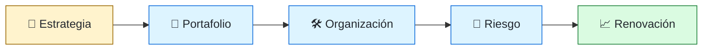
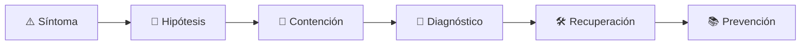

# 🧭 CTO / Dirección de Tecnología
<!-- role-visual:start -->

**La guía conecta trabajo real, decisiones, clases concretas y evidencia defendible.**

<!-- role-visual:end -->

> Responde por cómo la tecnología sostiene la estrategia, el riesgo, la organización y
> la economía de la empresa. El título cambia mucho; el mandato debe quedar explícito.
>
> **Entrada habitual:** liderazgo senior · **Foco:** estrategia tecnológica y sistema
> organizacional · **Evidencia central:** decisiones de portafolio con outcomes y riesgos

## 🧭 Qué es y por qué importa

CTO puede significar fundador que programa, líder de ingeniería, responsable de
arquitectura o ejecutivo de tecnología. La escala de la empresa cambia el trabajo. Lo
común es responder por la capacidad tecnológica futura: dónde invertir, qué comprar,
qué retirar, cómo organizar equipos y qué riesgos aceptar o elevar.

## 🗓️ Un día en el puesto

- alinear estrategia de producto, tecnología y finanzas;
- revisar portafolio, capacidad y riesgos críticos;
- decidir build-vs-buy, modernización o retiro;
- desarrollar líderes y diseño organizacional;
- comunicar al directorio o stakeholders no técnicos;
- responder durante incidentes de alto impacto.

## ✅ Responsabilidades y límites

- Explicita mandato, accountability y relación con CIO/CPO/VP Engineering.
- Responde por trade-offs y sostenibilidad del sistema sociotécnico.
- No sustituye dirección por seleccionar herramientas.
- No impone arquitectura desde presentaciones sin feedback operativo.
- No delega riesgo ético, seguridad o continuidad como asuntos puramente técnicos.

## 🧠 Qué necesitas saber

- estrategia, economía, TCO, FinOps y asignación de capital;
- arquitectura, datos, seguridad, confiabilidad y modernización;
- organización, Team Topologies, liderazgo y sucesión;
- métricas de producto, entrega y operación con límites;
- compliance, privacidad, propiedad intelectual y proveedores;
- IA, agentes, gobernanza y riesgo emergente.

## 📚 Tu ruta en el programa

1. Parte 00 para responsabilidad profesional.
2. Partes 10–17 para producto, economía, requisitos, proceso y conocimiento.
3. Partes 23–29 para dominios, arquitectura, datos y plataforma.
4. Partes 31–36 para calidad, seguridad, entrega, confiabilidad y modernización.
5. [Parte 37 — Gestión, liderazgo y práctica profesional](../classes/part-37-gestion-liderazgo-y-practica-profesional/README.md).
6. Partes 38–39 para estrategia y gobernanza de IA.

<!-- role-depth:start -->
## 🗺️ Sistema profesional del rol

El gráfico no representa una cascada rígida. Muestra el bucle profesional que este rol
debe poder recorrer: comprender el contexto, tomar una decisión, intervenir, observar
el efecto y convertir lo aprendido en una mejora. En **🧭 CTO / Dirección de Tecnología**, saltar directamente a
la herramienta suele ocultar el problema, mientras que terminar sin evidencia deja la
decisión en una opinión. La misión concreta es: Responde por cómo la tecnología sostiene la estrategia, el riesgo, la organización y la economía de la empresa. El título cambia mucho; el mandato debe quedar explícito. Cada transición
debe conservar supuestos, responsables y una forma de volver atrás.

<table>
<tr>
<td valign="top" width="50%">

### 🎯 Responde por

- decisiones propias de la familia **Dirección**;
- el resultado observable, no sólo la actividad ejecutada;
- límites, riesgos, operación y deuda residual de su intervención;
- evidencia que otra persona pueda revisar o reproducir.

</td>
<td valign="top" width="50%">

### 🤝 Coordina con

- [🧭 Staff / Principal Engineer y Technical Lead](technical-leadership.md); [🏛️ Software Architect](software-architect.md); [👥 Engineering Manager](engineering-manager.md);
- producto y personas usuarias cuando cambia una tarea o outcome;
- seguridad, privacidad, accesibilidad y operación según el riesgo;
- quienes mantendrán el sistema después de la entrega.

</td>
</tr>
</table>

El título no concede autoridad automática. El alcance real depende del equipo, la
industria y la criticidad. Esta guía describe un recorrido desde **dirección ejecutiva**, pero una
vacante se evalúa por las decisiones que permite tomar, los sistemas que pone bajo
responsabilidad y la evidencia exigida, no por el nombre del cargo.

## 🧱 Partes y clases asociadas

La ruta distingue **parte** —unidad curricular con una capacidad acumulativa— de
**clase asociada** —punto concreto donde se estudia un mecanismo o una decisión. Las
clases siguientes forman el núcleo; no eliminan los prerrequisitos indicados en sus
propias páginas ni convierten en opcional la base común.

| Orden | Parte del programa | Clases clave | Por qué entra en esta ruta | Evidencia de transferencia |
| ---: | --- | --- | --- | --- |
| 1 | [Parte 11 · Economía, métricas y decisiones de producto](../classes/part-11-economia-metricas-y-decisiones-de-producto/README.md) | [SE-134 · Costos de construcción, operación y oportunidad](../classes/part-11-economia-metricas-y-decisiones-de-producto/se-134-costos-de-construccion-operacion-y-oportunidad/README.md) [SE-141 · Portafolio, opciones y secuenciación de inversión](../classes/part-11-economia-metricas-y-decisiones-de-producto/se-141-portafolio-opciones-y-secuenciacion-de-inversion/README.md) [SE-144 · Proyecto: caso de viabilidad técnico-económica](../classes/part-11-economia-metricas-y-decisiones-de-producto/se-144-proyecto-caso-de-viabilidad-tecnico-economica/README.md) | Profundiza **economía, métricas y experimentación** desde la responsabilidad del rol. | Caso económico con sensibilidad. |
| 2 | [Parte 25 · Arquitectura de software y dominio](../classes/part-25-arquitectura-de-software-y-dominio/README.md) | [SE-301 · Drivers, restricciones y atributos de arquitectura](../classes/part-25-arquitectura-de-software-y-dominio/se-301-drivers-restricciones-y-atributos-de-arquitectura/README.md) [SE-309 · Trade-offs, ADR y evaluación de alternativas](../classes/part-25-arquitectura-de-software-y-dominio/se-309-trade-offs-adr-y-evaluacion-de-alternativas/README.md) [SE-310 · Arquitectura socio-técnica y límites de equipo](../classes/part-25-arquitectura-de-software-y-dominio/se-310-arquitectura-socio-tecnica-y-limites-de-equipo/README.md) | Profundiza **arquitectura, dominio y atributos de calidad** desde la responsabilidad del rol. | Arquitectura defendible con ADR. |
| 3 | [Parte 36 · Mantenimiento y modernización legacy](../classes/part-36-mantenimiento-y-modernizacion-legacy/README.md) | [SE-441 · Retiro, archivado y disposición de sistemas](../classes/part-36-mantenimiento-y-modernizacion-legacy/se-441-retiro-archivado-y-disposicion-de-sistemas/README.md) [SE-442 · Economía de reescribir frente a evolucionar](../classes/part-36-mantenimiento-y-modernizacion-legacy/se-442-economia-de-reescribir-frente-a-evolucionar/README.md) [SE-444 · Proyecto: migración incremental reversible](../classes/part-36-mantenimiento-y-modernizacion-legacy/se-444-proyecto-migracion-incremental-reversible/README.md) | Profundiza **mantenimiento, modernización y retiro** desde la responsabilidad del rol. | Migración incremental reversible. |
| 4 | [Parte 37 · Gestión, liderazgo y práctica profesional](../classes/part-37-gestion-liderazgo-y-practica-profesional/README.md) | [SE-450 · Gestión de riesgos y decisiones ejecutivas](../classes/part-37-gestion-liderazgo-y-practica-profesional/se-450-gestion-de-riesgos-y-decisiones-ejecutivas/README.md) [SE-451 · Compras, proveedores y evaluación técnica](../classes/part-37-gestion-liderazgo-y-practica-profesional/se-451-compras-proveedores-y-evaluacion-tecnica/README.md) [SE-453 · Economía del software y costo total](../classes/part-37-gestion-liderazgo-y-practica-profesional/se-453-economia-del-software-y-costo-total/README.md) | Profundiza **liderazgo, organización y decisiones** desde la responsabilidad del rol. | Propuesta defendida ante conflicto. |

**Cómo recorrerla.** Empieza por [SE-134](../classes/part-11-economia-metricas-y-decisiones-de-producto/se-134-costos-de-construccion-operacion-y-oportunidad/README.md) para fijar el
primer mecanismo, usa [SE-441](../classes/part-36-mantenimiento-y-modernizacion-legacy/se-441-retiro-archivado-y-disposicion-de-sistemas/README.md) para integrar el
centro de la especialidad y llega a [SE-453](../classes/part-37-gestion-liderazgo-y-practica-profesional/se-453-economia-del-software-y-costo-total/README.md) cuando ya
puedas explicar cómo detectar y recuperar un fallo. Una clase se considera estudiada
sólo cuando su concepto cambia una decisión y deja evidencia; abrir todos los enlaces
no constituye competencia.

> [!IMPORTANT]
> El mapa expresa el currículo previsto. Las Partes 00–02 están desarrolladas; las
> posteriores conservan borradores o estructuras que deben superar revisión
> cualitativa. Esta ruta no declara terminadas esas clases ni reemplaza el
> [roadmap](../ROADMAP.md).

## ⚖️ Decisiones y trade-offs que debes defender

| Decisión recurrente | Criterio profesional | Evidencia mínima antes de defenderla |
| --- | --- | --- |
| **Invertir construir o comprar** | Asignar capital por capacidad diferenciación riesgo y opción de salida. | Caso económico con revisión. |
| **Centralizar o federar tecnología** | Alinear plataformas estándares y autonomía a estrategia. | Coste de coordinación y ownership. |
| **Explotar o modernizar** | Equilibrar continuidad deuda talento y oportunidad. | Roadmap financiable con hitos reversibles. |

La calidad de una decisión no se juzga porque coincida con una herramienta popular.
Debe hacer explícitos contexto, restricciones, alternativas descartadas, coste de
cambio y condición de revisión. En especial, **Invertir construir o comprar**, **Centralizar o federar tecnología**
y **Explotar o modernizar** cambian de respuesta cuando cambia el riesgo. Una solución
correcta en un prototipo puede ser irresponsable en un sistema regulado; una solución
robusta para un servicio crítico puede ser desperdicio en una herramienta interna.

## 🚨 Escenario profesional: Incidente revela dependencia estratégica de un proveedor sin salida

**Síntoma.** La organización optimizó corto plazo y perdió conocimiento y control. La respuesta madura evita convertir la primera
correlación en causa y conserva evidencia antes de modificar el sistema.

1. **Detectar y delimitar:** identifica quién o qué está afectado, desde cuándo y qué
   cambió. Conserva timestamps, versiones, entradas y señales suficientes para no
   destruir la escena al intentar arreglarla.
2. **Investigar:** Reconstruir contrato arquitectura datos costes riesgo regulatorio y alternativas. Formula al menos dos hipótesis rivales
   y define qué observación refutaría cada una.
3. **Contener:** reduce blast radius y daño sin prometer una corrección todavía. La
   contención debe ser reversible, visible y compatible con las obligaciones del
   sistema.
4. **Recuperar:** Estabilizar comunicar decidir horizonte de salida y financiar capacidades críticas. Verifica la tarea completa, no sólo que un
   proceso volvió a estar verde.
5. **Aprender:** añade una regresión, señal o control que detecte la misma clase de
   fallo. Documenta qué deuda permanece y quién revisará la acción.

El escenario evalúa método además de resultado. Una recuperación rápida que borra la
causa, oculta pérdida de datos o deja al equipo sin mecanismo preventivo no demuestra
dominio del rol.

## 📊 Señales útiles y límites de las métricas

| Señal | Qué ayuda a observar | Trampa que debe evitarse |
| --- | --- | --- |
| **Valor y riesgo del portafolio** | Outcomes opciones exposición y concentración. | Sumar proyectos verdes. |
| **Costo total de capacidades** | Construcción operación cambio proveedores y retiro. | Mirar presupuesto anual. |
| **Resiliencia organizacional** | Sucesión bus factor y respuesta a crisis. | Medir headcount. |

Ninguna señal debe convertirse en ranking individual. Combina tendencia cuantitativa,
muestreo de casos, feedback cualitativo y contexto de carga. Declara ventana,
denominador, fuente, exclusiones y quién puede actuar sobre el resultado. Si una
métrica mejora mientras el outcome o el riesgo empeoran, el sistema está optimizando
el indicador y no el trabajo.

## 🧩 Proyecto integrador del rol: Estrategia tecnológica defendible

**Propósito:** conectar estrategia de negocio con capacidades inversiones organización riesgos y aprendizaje. El resultado esperado es **mapa de capacidades portfolio TCO escenarios build-buy roadmap operating model indicadores y memo al directorio**.

Entrega un expediente revisable con estas piezas:

1. **Contexto y alcance:** usuario, sistema, restricción, supuestos, fuera de alcance y
   criterio de no éxito.
2. **Decisión:** al menos dos alternativas reales, trade-offs, coste de reversión y un
   ADR o memo que indique cuándo revisar la elección.
3. **Artefacto principal:** una implementación, modelo, flujo o política coherente con
   las clases núcleo; no una captura aislada ni una presentación sin mecanismo.
4. **Fallo controlado:** introduce una condición adversa relacionada con el escenario
   anterior y conserva el resultado observado, sin inventar una ejecución.
5. **Verificación:** prueba, rúbrica, revisión o medición que pueda fallar y que conecte
   directamente con el resultado profesional.
6. **Operación y salida:** telemetría, recuperación, mantenimiento, deprecación o retiro
   según corresponda; incluye límites y deuda residual.

**Criterio de aceptación:** otra persona puede reconstruir el razonamiento, reproducir
la comprobación y distinguir claramente qué quedó demostrado de lo que sólo se propone.
El proyecto no se aprueba por cantidad de archivos ni por utilizar una marca concreta.

## 📈 Dominio esperado por alcance

| Alcance | Qué resuelve | Qué evidencia su autonomía |
| --- | --- | --- |
| **Inicial** | ejecuta una tarea acotada con criterios y acompañamiento | reproduce el caso, pregunta por supuestos y entrega evidencia legible |
| **Intermedio** | decide dentro de un componente o flujo conocido | compara alternativas, prueba fallos previsibles y coordina dependencias |
| **Senior** | conduce problemas ambiguos que cruzan sistemas o equipos | hace explícito el riesgo, diseña recuperación y mejora el mecanismo de trabajo |
| **Staff / Lead** | cambia capacidades compartidas y decisiones de largo plazo | multiplica criterio, define guardrails, mide adopción y conserva opciones futuras |

Progresar no significa alejarse de la práctica. Significa aumentar ambigüedad, horizonte,
blast radius y responsabilidad por consecuencias. La persona senior todavía debe poder
explicar el mecanismo; la persona Staff además crea condiciones para que otros lo
operen sin depender de ella.

## 🗓️ Plan de práctica 30 · 60 · 90 días

- **Días 1–30 — comprender y reproducir.** Estudia las primeras clases de cada parte,
  reproduce un caso pequeño y escribe un mapa de responsabilidades. El entregable es
  una baseline con preguntas abiertas, no una transformación prematura.
- **Días 31–60 — intervenir y fallar con control.** Construye el artefacto central,
  introduce el escenario de fallo y mide el comportamiento. Revisa el trabajo con una
  persona de una ruta vecina para descubrir supuestos de frontera.
- **Días 61–90 — operar y transferir.** Ejecuta recuperación, corrige la causa, publica
  runbook o guía de uso y presenta la decisión con trade-offs. Termina con una
  retrospectiva que separe resultado, evidencia, límites y siguiente inversión.

Este plan es una secuencia de práctica, no una promesa de empleabilidad en noventa días.
La experiencia previa, el dominio y el acceso a sistemas reales cambian el tiempo
necesario.

## 🎤 Preguntas para revisión o entrevista

1. ¿En qué contexto elegirías **Invertir construir o comprar** y qué evidencia te haría cambiar?
2. ¿Cómo distinguirías síntoma, causa y daño en el escenario **Incidente revela dependencia estratégica de un proveedor sin salida**?
3. ¿Qué clase asociada usarías para diseñar el mecanismo y cuál para verificarlo?
4. ¿Qué parte de **Estrategia tecnológica defendible** no automatizarías todavía y por qué?
5. ¿Qué métrica podría mejorar mientras el sistema empeora y qué guardrail añadirías?
6. ¿Dónde termina la autoridad de este rol y cuándo debe escalar o pedir revisión?

Una respuesta fuerte usa un caso, reconoce incertidumbre y propone una comprobación.
Nombrar una herramienta sin explicar mecanismo, fallo y límite no demuestra la
competencia.

## 🔗 Fuentes primarias y oficiales

- [SWEBOK Guide v4.0a](https://www.computer.org/education/bodies-of-knowledge/software-engineering) — **IEEE Computer Society**. Se usa como referencia primaria u oficial; la guía no sustituye la fuente.
- [ISO/IEC 25010:2023](https://www.iso.org/standard/78176.html) — **ISO**. Se usa como referencia primaria u oficial; la guía no sustituye la fuente.
- [ACM Code of Ethics and Professional Conduct](https://www.acm.org/code-of-ethics) — **ACM**. Se usa como referencia primaria u oficial; la guía no sustituye la fuente.

Las fuentes orientan principios, vocabulario y prácticas; no convierten la guía en una
certificación ni sustituyen la documentación específica del sistema, la jurisdicción
o la tecnología utilizada.
<!-- role-depth:end -->

## 🧪 Evidencia de portafolio

- estrategia tecnológica con hipótesis, horizontes y criterios de revisión;
- mapa de capacidades y riesgos del portafolio;
- decisión build-vs-buy con TCO, lock-in y salida;
- plan de modernización financiable y compatible con operación;
- modelo de equipos y ownership alineado a arquitectura;
- briefing de incidente o inversión para una audiencia ejecutiva.

## 📈 Progresión

Staff/Principal, Architect, Director o VP Engineering pueden llegar a CTO por rutas
distintas. En una startup puede comenzar como cofundador técnico. El título no acredita
alcance: verifica presupuesto, personas, riesgo y decisiones que realmente controla.

## ⚠️ Mitos frecuentes

- “CTO es el mejor programador.” El oficio central es decisión sistémica.
- “Debe elegir el stack.” Debe crear criterios y ownership adecuados.
- “Transformación digital es comprar una plataforma.” Sin proceso y adopción es coste.
- “La estrategia de IA es contratar un modelo.” Incluye datos, evals, seguridad y operación.

## 🚀 Siguientes pasos

1. Define el mandato real del rol para una organización concreta.
2. Construye un mapa de capacidades, riesgos y costes actuales.
3. Prioriza pocas apuestas con criterios de abandonar.
4. Diseña cómo aprenderás si la estrategia funciona.

---

[⬅️ Volver a las rutas](README.md) · [🏠 Inicio del programa](../README.md)
