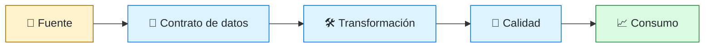
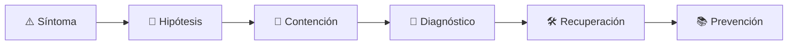

# 🧱 Data Engineer
<!-- role-visual:start -->

**La guía conecta trabajo real, decisiones, clases concretas y evidencia defendible.**

<!-- role-visual:end -->

> Construye flujos y productos de datos confiables, trazables y evolutivos desde la
> captura hasta el consumo analítico u operacional.
>
> **Entrada habitual:** semi-senior · **Foco:** pipelines, contratos y calidad de datos
> · **Evidencia central:** flujo reproducible con lineage, controles y backfill probado

## 🧭 Qué es y por qué importa

Data engineering convierte eventos, tablas y archivos en datos utilizables sin perder
semántica. El reto central es conservar calidad, tiempo, privacidad y compatibilidad
cuando productores cambian y los consumidores toman decisiones con el resultado.

## 🗓️ Un día en el puesto

- revisar un contrato de datos con productor y consumidor;
- investigar retraso, duplicados o una dimensión inconsistente;
- diseñar ingestión batch, streaming o CDC;
- ejecutar backfill y reconciliar resultados;
- vigilar frescura, completitud, coste y acceso.

## ✅ Responsabilidades y límites

- Responde por contratos, lineage, calidad y operación del pipeline.
- Distingue dato faltante, tardío, incorrecto y semánticamente ambiguo.
- No crea un lago para posponer gobierno y modelado.
- No interpreta causalidad ni significado de dominio sin sus responsables.

## 🧠 Qué necesitas saber

Modelado relacional y analítico, OLTP/OLAP, SQL, archivos columnares, colas, streams,
CDC, partición, esquemas, orquestación, data quality, lineage, privacidad, IAM,
observabilidad, recuperación y costes.

## 📚 Tu ruta en el programa

1. Partes 01–09 para representación, programación y automatización.
2. Partes 10–13 para dominio, economía y contratos.
3. [Parte 26 — Datos, persistencia y recuperación](../classes/part-26-datos-persistencia-y-recuperacion/README.md).
4. Partes 27–29 para eventos, distribución y cloud.
5. Partes 30–35 para calidad, seguridad, supply chain y operación.

<!-- role-depth:start -->
## 🗺️ Sistema profesional del rol

El gráfico no representa una cascada rígida. Muestra el bucle profesional que este rol
debe poder recorrer: comprender el contexto, tomar una decisión, intervenir, observar
el efecto y convertir lo aprendido en una mejora. En **🧱 Data Engineer**, saltar directamente a
la herramienta suele ocultar el problema, mientras que terminar sin evidencia deja la
decisión en una opinión. La misión concreta es: Construye flujos y productos de datos confiables, trazables y evolutivos desde la captura hasta el consumo analítico u operacional. Cada transición
debe conservar supuestos, responsables y una forma de volver atrás.

<table>
<tr>
<td valign="top" width="50%">

### 🎯 Responde por

- decisiones propias de la familia **Datos**;
- el resultado observable, no sólo la actividad ejecutada;
- límites, riesgos, operación y deuda residual de su intervención;
- evidencia que otra persona pueda revisar o reproducir.

</td>
<td valign="top" width="50%">

### 🤝 Coordina con

- [🗄️ Database Reliability Engineer](database-reliability-engineer.md); [🌐 Distributed Systems Engineer](distributed-systems-engineer.md); [💸 FinOps Engineer](finops-engineer.md);
- producto y personas usuarias cuando cambia una tarea o outcome;
- seguridad, privacidad, accesibilidad y operación según el riesgo;
- quienes mantendrán el sistema después de la entrega.

</td>
</tr>
</table>

El título no concede autoridad automática. El alcance real depende del equipo, la
industria y la criticidad. Esta guía describe un recorrido desde **semi-senior → principal**, pero una
vacante se evalúa por las decisiones que permite tomar, los sistemas que pone bajo
responsabilidad y la evidencia exigida, no por el nombre del cargo.

## 🧱 Partes y clases asociadas

La ruta distingue **parte** —unidad curricular con una capacidad acumulativa— de
**clase asociada** —punto concreto donde se estudia un mecanismo o una decisión. Las
clases siguientes forman el núcleo; no eliminan los prerrequisitos indicados en sus
propias páginas ni convierten en opcional la base común.

| Orden | Parte del programa | Clases clave | Por qué entra en esta ruta | Evidencia de transferencia |
| ---: | --- | --- | --- | --- |
| 1 | [Parte 26 · Datos, persistencia y recuperación](../classes/part-26-datos-persistencia-y-recuperacion/README.md) | [SE-313 · Modelado conceptual, lógico y físico](../classes/part-26-datos-persistencia-y-recuperacion/se-313-modelado-conceptual-logico-y-fisico/README.md) [SE-318 · Migraciones compatibles y evolución de esquema](../classes/part-26-datos-persistencia-y-recuperacion/se-318-migraciones-compatibles-y-evolucion-de-esquema/README.md) [SE-322 · Privacidad, retención y ciclo de vida del dato](../classes/part-26-datos-persistencia-y-recuperacion/se-322-privacidad-retencion-y-ciclo-de-vida-del-dato/README.md) | Profundiza **persistencia, transacciones y recuperación** desde la responsabilidad del rol. | Capa de datos restaurable. |
| 2 | [Parte 27 · Integración, eventos y mensajería](../classes/part-27-integracion-eventos-y-mensajeria/README.md) | [SE-330 · CDC, ETL, ELT y sincronización](../classes/part-27-integracion-eventos-y-mensajeria/se-330-cdc-etl-elt-y-sincronizacion/README.md) [SE-332 · Compatibilidad de esquemas y registros](../classes/part-27-integracion-eventos-y-mensajeria/se-332-compatibilidad-de-esquemas-y-registros/README.md) [SE-334 · Observabilidad y seguridad de integraciones](../classes/part-27-integracion-eventos-y-mensajeria/se-334-observabilidad-y-seguridad-de-integraciones/README.md) | Profundiza **eventos, mensajería y compatibilidad** desde la responsabilidad del rol. | Flujo tolerante a duplicados. |
| 3 | [Parte 29 · Cloud, plataforma e infraestructura](../classes/part-29-cloud-plataforma-e-infraestructura/README.md) | [SE-354 · Infraestructura como código y estado](../classes/part-29-cloud-plataforma-e-infraestructura/se-354-infraestructura-como-codigo-y-estado/README.md) [SE-356 · Escalado, capacidad y costos](../classes/part-29-cloud-plataforma-e-infraestructura/se-356-escalado-capacidad-y-costos/README.md) [SE-360 · Proyecto: plataforma mínima reproducible](../classes/part-29-cloud-plataforma-e-infraestructura/se-360-proyecto-plataforma-minima-reproducible/README.md) | Profundiza **cloud, infraestructura y plataformas** desde la responsabilidad del rol. | Entorno reproducible y eliminable. |
| 4 | [Parte 35 · Observabilidad, SRE e incidentes](../classes/part-35-observabilidad-sre-e-incidentes/README.md) | [SE-421 · Señales, eventos y observabilidad útil](../classes/part-35-observabilidad-sre-e-incidentes/se-421-senales-eventos-y-observabilidad-util/README.md) [SE-423 · Métricas, dimensiones y cardinalidad](../classes/part-35-observabilidad-sre-e-incidentes/se-423-metricas-dimensiones-y-cardinalidad/README.md) [SE-430 · Continuidad, disaster recovery y ejercicios](../classes/part-35-observabilidad-sre-e-incidentes/se-430-continuidad-disaster-recovery-y-ejercicios/README.md) | Profundiza **observabilidad, SRE e incidentes** desde la responsabilidad del rol. | Incidente diagnosticado y recuperado. |

**Cómo recorrerla.** Empieza por [SE-313](../classes/part-26-datos-persistencia-y-recuperacion/se-313-modelado-conceptual-logico-y-fisico/README.md) para fijar el
primer mecanismo, usa [SE-354](../classes/part-29-cloud-plataforma-e-infraestructura/se-354-infraestructura-como-codigo-y-estado/README.md) para integrar el
centro de la especialidad y llega a [SE-430](../classes/part-35-observabilidad-sre-e-incidentes/se-430-continuidad-disaster-recovery-y-ejercicios/README.md) cuando ya
puedas explicar cómo detectar y recuperar un fallo. Una clase se considera estudiada
sólo cuando su concepto cambia una decisión y deja evidencia; abrir todos los enlaces
no constituye competencia.

> [!IMPORTANT]
> El mapa expresa el currículo previsto. Las Partes 00–05 están desarrolladas; las
> posteriores conservan borradores o estructuras que deben superar revisión
> cualitativa. Esta ruta no declara terminadas esas clases ni reemplaza el
> [roadmap](../ROADMAP.md).

## ⚖️ Decisiones y trade-offs que debes defender

| Decisión recurrente | Criterio profesional | Evidencia mínima antes de defenderla |
| --- | --- | --- |
| **Batch o streaming** | Comparar frescura coste complejidad y corrección. | SLO de dato y replay controlado. |
| **Esquema central o evolución distribuida** | Asignar ownership y compatibilidad por productor. | Registro de esquemas y contract test. |
| **Recalcular o corregir en sitio** | Preservar lineage reproducibilidad y auditoría. | Backfill ensayado con reconciliación. |

La calidad de una decisión no se juzga porque coincida con una herramienta popular.
Debe hacer explícitos contexto, restricciones, alternativas descartadas, coste de
cambio y condición de revisión. En especial, **Batch o streaming**, **Esquema central o evolución distribuida**
y **Recalcular o corregir en sitio** cambian de respuesta cuando cambia el riesgo. Una solución
correcta en un prototipo puede ser irresponsable en un sistema regulado; una solución
robusta para un servicio crítico puede ser desperdicio en una herramienta interna.

## 🚨 Escenario profesional: Un backfill duplica agregados y cambia métricas históricas

**Síntoma.** El job no distingue evento nuevo de reproducción. La respuesta madura evita convertir la primera
correlación en causa y conserva evidencia antes de modificar el sistema.

1. **Detectar y delimitar:** identifica quién o qué está afectado, desde cuándo y qué
   cambió. Conserva timestamps, versiones, entradas y señales suficientes para no
   destruir la escena al intentar arreglarla.
2. **Investigar:** Rastrear lineage claves ventanas esquema y checkpoints. Formula al menos dos hipótesis rivales
   y define qué observación refutaría cada una.
3. **Contener:** reduce blast radius y daño sin prometer una corrección todavía. La
   contención debe ser reversible, visible y compatible con las obligaciones del
   sistema.
4. **Recuperar:** Aislar partición recomputar de forma idempotente y reconciliar consumidores. Verifica la tarea completa, no sólo que un
   proceso volvió a estar verde.
5. **Aprender:** añade una regresión, señal o control que detecte la misma clase de
   fallo. Documenta qué deuda permanece y quién revisará la acción.

El escenario evalúa método además de resultado. Una recuperación rápida que borra la
causa, oculta pérdida de datos o deja al equipo sin mecanismo preventivo no demuestra
dominio del rol.

## 📊 Señales útiles y límites de las métricas

| Señal | Qué ayuda a observar | Trampa que debe evitarse |
| --- | --- | --- |
| **Frescura del dato** | Retraso desde evento hasta consumo útil. | Medir reloj de pipeline sin reloj de fuente. |
| **Calidad por regla** | Completitud validez unicidad y coherencia contextual. | Crear un score único sin impacto. |
| **Costo por unidad procesada** | Eficiencia por volumen y nivel de servicio. | Reducir costo degradando confiabilidad. |

Ninguna señal debe convertirse en ranking individual. Combina tendencia cuantitativa,
muestreo de casos, feedback cualitativo y contexto de carga. Declara ventana,
denominador, fuente, exclusiones y quién puede actuar sobre el resultado. Si una
métrica mejora mientras el outcome o el riesgo empeoran, el sistema está optimizando
el indicador y no el trabajo.

## 🧩 Proyecto integrador del rol: Producto de datos trazable

**Propósito:** publicar un dataset con contrato calidad lineage replay y coste visible. El resultado esperado es **pipeline contrato pruebas de calidad backfill dashboard y runbook**.

Entrega un expediente revisable con estas piezas:

1. **Contexto y alcance:** usuario, sistema, restricción, supuestos, fuera de alcance y
   criterio de no éxito.
2. **Decisión:** al menos dos alternativas reales, trade-offs, coste de reversión y un
   ADR o memo que indique cuándo revisar la elección.
3. **Artefacto principal:** una implementación, modelo, flujo o política coherente con
   las clases núcleo; no una captura aislada ni una presentación sin mecanismo.
4. **Fallo controlado:** introduce una condición adversa relacionada con el escenario
   anterior y conserva el resultado observado, sin inventar una ejecución.
5. **Verificación:** prueba, rúbrica, revisión o medición que pueda fallar y que conecte
   directamente con el resultado profesional.
6. **Operación y salida:** telemetría, recuperación, mantenimiento, deprecación o retiro
   según corresponda; incluye límites y deuda residual.

**Criterio de aceptación:** otra persona puede reconstruir el razonamiento, reproducir
la comprobación y distinguir claramente qué quedó demostrado de lo que sólo se propone.
El proyecto no se aprueba por cantidad de archivos ni por utilizar una marca concreta.

## 📈 Dominio esperado por alcance

| Alcance | Qué resuelve | Qué evidencia su autonomía |
| --- | --- | --- |
| **Inicial** | ejecuta una tarea acotada con criterios y acompañamiento | reproduce el caso, pregunta por supuestos y entrega evidencia legible |
| **Intermedio** | decide dentro de un componente o flujo conocido | compara alternativas, prueba fallos previsibles y coordina dependencias |
| **Senior** | conduce problemas ambiguos que cruzan sistemas o equipos | hace explícito el riesgo, diseña recuperación y mejora el mecanismo de trabajo |
| **Staff / Lead** | cambia capacidades compartidas y decisiones de largo plazo | multiplica criterio, define guardrails, mide adopción y conserva opciones futuras |

Progresar no significa alejarse de la práctica. Significa aumentar ambigüedad, horizonte,
blast radius y responsabilidad por consecuencias. La persona senior todavía debe poder
explicar el mecanismo; la persona Staff además crea condiciones para que otros lo
operen sin depender de ella.

## 🗓️ Plan de práctica 30 · 60 · 90 días

- **Días 1–30 — comprender y reproducir.** Estudia las primeras clases de cada parte,
  reproduce un caso pequeño y escribe un mapa de responsabilidades. El entregable es
  una baseline con preguntas abiertas, no una transformación prematura.
- **Días 31–60 — intervenir y fallar con control.** Construye el artefacto central,
  introduce el escenario de fallo y mide el comportamiento. Revisa el trabajo con una
  persona de una ruta vecina para descubrir supuestos de frontera.
- **Días 61–90 — operar y transferir.** Ejecuta recuperación, corrige la causa, publica
  runbook o guía de uso y presenta la decisión con trade-offs. Termina con una
  retrospectiva que separe resultado, evidencia, límites y siguiente inversión.

Este plan es una secuencia de práctica, no una promesa de empleabilidad en noventa días.
La experiencia previa, el dominio y el acceso a sistemas reales cambian el tiempo
necesario.

## 🎤 Preguntas para revisión o entrevista

1. ¿En qué contexto elegirías **Batch o streaming** y qué evidencia te haría cambiar?
2. ¿Cómo distinguirías síntoma, causa y daño en el escenario **Un backfill duplica agregados y cambia métricas históricas**?
3. ¿Qué clase asociada usarías para diseñar el mecanismo y cuál para verificarlo?
4. ¿Qué parte de **Producto de datos trazable** no automatizarías todavía y por qué?
5. ¿Qué métrica podría mejorar mientras el sistema empeora y qué guardrail añadirías?
6. ¿Dónde termina la autoridad de este rol y cuándo debe escalar o pedir revisión?

Una respuesta fuerte usa un caso, reconoce incertidumbre y propone una comprobación.
Nombrar una herramienta sin explicar mecanismo, fallo y límite no demuestra la
competencia.

## 🔗 Fuentes primarias y oficiales

- [PostgreSQL Documentation](https://www.postgresql.org/docs/current/) — **PostgreSQL Global Development Group**. Se usa como referencia primaria u oficial; la guía no sustituye la fuente.
- [AsyncAPI Specification](https://www.asyncapi.com/docs/reference/specification/latest) — **AsyncAPI Initiative**. Se usa como referencia primaria u oficial; la guía no sustituye la fuente.
- [ISO/IEC 25010:2023](https://www.iso.org/standard/78176.html) — **ISO**. Se usa como referencia primaria u oficial; la guía no sustituye la fuente.

Las fuentes orientan principios, vocabulario y prácticas; no convierten la guía en una
certificación ni sustituyen la documentación específica del sistema, la jurisdicción
o la tecnología utilizada.
<!-- role-depth:end -->

## 🧪 Evidencia de portafolio

- contrato versionado entre productor y consumidor;
- pipeline idempotente con datos tardíos y duplicados;
- backfill con reconciliación y rollback lógico;
- tablero de frescura, calidad, coste y lineage.

## 📈 Progresión

Data Engineer → Senior → Staff Data, Data Platform o Data Architect.

## ⚠️ Mitos frecuentes

- “ETL es mover datos.” También transforma significado y responsabilidad.
- “Streaming es más moderno.” Añade orden, tiempo y operación si no es necesario.
- “La calidad se limpia al final.” El contrato debe acercarla al origen.

## 🚀 Siguientes pasos

1. Define consumidores, semántica y SLO antes del pipeline.
2. Inyecta duplicados, retraso y cambio de esquema.
3. Ejecuta un backfill y reconcilia sin borrar evidencia.

---

[⬅️ Volver a las rutas](README.md) · [🏠 Inicio del programa](../README.md)
