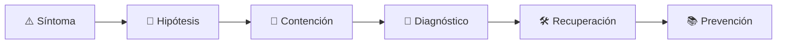

# 🗄️ Database Reliability Engineer
<!-- role-visual:start -->

**La guía conecta trabajo real, decisiones, clases concretas y evidencia defendible.**

<!-- role-visual:end -->

> Mantiene servicios de datos correctos, disponibles, recuperables y comprensibles
> mientras cambian cargas, esquemas y dependencias.
>
> **Entrada habitual:** senior · **Foco:** operación de datos y automatización
> · **Evidencia central:** restauración ensayada y cambio compatible bajo carga

## 🧭 Qué es y por qué importa

Database Reliability Engineering aplica prácticas de software y SRE a bases de datos.
Equilibra corrección, disponibilidad, latencia y coste; automatiza operaciones sin
ocultar los límites de consistencia, replicación y recuperación.

## 🗓️ Un día en el puesto

- analizar contención, planes de consulta y saturación;
- revisar migraciones y capacidad antes de desplegar;
- comprobar réplica, backups y restauración;
- responder a degradación o corrupción;
- mejorar guardrails y autoservicio para equipos de producto.

## ✅ Responsabilidades y límites

- Responde por confiabilidad, recuperación y capacidad del servicio de datos.
- Exige RPO/RTO verificables, no backups “exitosos”.
- No es operador manual de tickets ni dueño del significado de todos los datos.
- No promete alta disponibilidad sin analizar modos de fallo comunes.

## 🧠 Qué necesitas saber

Transacciones, aislamiento, índices, locking, replicación, partición, consenso,
backups, PITR, migraciones, observabilidad, capacity planning, automatización,
seguridad, privacidad, incidentes y coste.

## 📚 Tu ruta en el programa

1. Partes 01–09 y 18 para sistemas, programación y automatización.
2. Partes 20 y 25 para consumidores, dominio y arquitectura.
3. [Parte 26](../classes/part-26-datos-persistencia-y-recuperacion/README.md) y partes 27–29.
4. Partes 31–36 para rendimiento, seguridad, entrega, SRE y modernización.

<!-- role-depth:start -->
## 🗺️ Sistema profesional del rol

El gráfico no representa una cascada rígida. Muestra el bucle profesional que este rol
debe poder recorrer: comprender el contexto, tomar una decisión, intervenir, observar
el efecto y convertir lo aprendido en una mejora. En **🗄️ Database Reliability Engineer**, saltar directamente a
la herramienta suele ocultar el problema, mientras que terminar sin evidencia deja la
decisión en una opinión. La misión concreta es: Mantiene servicios de datos correctos, disponibles, recuperables y comprensibles mientras cambian cargas, esquemas y dependencias. Cada transición
debe conservar supuestos, responsables y una forma de volver atrás.

<table>
<tr>
<td valign="top" width="50%">

### 🎯 Responde por

- decisiones propias de la familia **Datos**;
- el resultado observable, no sólo la actividad ejecutada;
- límites, riesgos, operación y deuda residual de su intervención;
- evidencia que otra persona pueda revisar o reproducir.

</td>
<td valign="top" width="50%">

### 🤝 Coordina con

- [🧱 Data Engineer](data-engineer.md); [📈 Site Reliability Engineer](site-reliability-engineer.md); [🏚️ Legacy Modernization Engineer](legacy-modernization-engineer.md);
- producto y personas usuarias cuando cambia una tarea o outcome;
- seguridad, privacidad, accesibilidad y operación según el riesgo;
- quienes mantendrán el sistema después de la entrega.

</td>
</tr>
</table>

El título no concede autoridad automática. El alcance real depende del equipo, la
industria y la criticidad. Esta guía describe un recorrido desde **senior → principal**, pero una
vacante se evalúa por las decisiones que permite tomar, los sistemas que pone bajo
responsabilidad y la evidencia exigida, no por el nombre del cargo.

## 🧱 Partes y clases asociadas

La ruta distingue **parte** —unidad curricular con una capacidad acumulativa— de
**clase asociada** —punto concreto donde se estudia un mecanismo o una decisión. Las
clases siguientes forman el núcleo; no eliminan los prerrequisitos indicados en sus
propias páginas ni convierten en opcional la base común.

| Orden | Parte del programa | Clases clave | Por qué entra en esta ruta | Evidencia de transferencia |
| ---: | --- | --- | --- | --- |
| 1 | [Parte 26 · Datos, persistencia y recuperación](../classes/part-26-datos-persistencia-y-recuperacion/README.md) | [SE-315 · Transacciones, aislamiento y concurrencia](../classes/part-26-datos-persistencia-y-recuperacion/se-315-transacciones-aislamiento-y-concurrencia/README.md) [SE-317 · Consultas, índices y patrones de acceso](../classes/part-26-datos-persistencia-y-recuperacion/se-317-consultas-indices-y-patrones-de-acceso/README.md) [SE-321 · Backups, restauración y pruebas de recuperación](../classes/part-26-datos-persistencia-y-recuperacion/se-321-backups-restauracion-y-pruebas-de-recuperacion/README.md) | Profundiza **persistencia, transacciones y recuperación** desde la responsabilidad del rol. | Capa de datos restaurable. |
| 2 | [Parte 31 · Calidad, rendimiento y resiliencia](../classes/part-31-calidad-rendimiento-y-resiliencia/README.md) | [SE-375 · Carga, estrés, picos y endurance](../classes/part-31-calidad-rendimiento-y-resiliencia/se-375-carga-estres-picos-y-endurance/README.md) [SE-376 · Latencia, throughput, saturación y capacidad](../classes/part-31-calidad-rendimiento-y-resiliencia/se-376-latencia-throughput-saturacion-y-capacidad/README.md) [SE-380 · Disponibilidad, durabilidad y recuperación](../classes/part-31-calidad-rendimiento-y-resiliencia/se-380-disponibilidad-durabilidad-y-recuperacion/README.md) | Profundiza **calidad, rendimiento y resiliencia** desde la responsabilidad del rol. | Informe medido y game day. |
| 3 | [Parte 35 · Observabilidad, SRE e incidentes](../classes/part-35-observabilidad-sre-e-incidentes/README.md) | [SE-423 · Métricas, dimensiones y cardinalidad](../classes/part-35-observabilidad-sre-e-incidentes/se-423-metricas-dimensiones-y-cardinalidad/README.md) [SE-426 · Alertas accionables y fatiga](../classes/part-35-observabilidad-sre-e-incidentes/se-426-alertas-accionables-y-fatiga/README.md) [SE-430 · Continuidad, disaster recovery y ejercicios](../classes/part-35-observabilidad-sre-e-incidentes/se-430-continuidad-disaster-recovery-y-ejercicios/README.md) | Profundiza **observabilidad, SRE e incidentes** desde la responsabilidad del rol. | Incidente diagnosticado y recuperado. |
| 4 | [Parte 36 · Mantenimiento y modernización legacy](../classes/part-36-mantenimiento-y-modernizacion-legacy/README.md) | [SE-436 · Dependencias obsoletas y riesgo acumulado](../classes/part-36-mantenimiento-y-modernizacion-legacy/se-436-dependencias-obsoletas-y-riesgo-acumulado/README.md) [SE-439 · Migraciones de datos sin interrupción](../classes/part-36-mantenimiento-y-modernizacion-legacy/se-439-migraciones-de-datos-sin-interrupcion/README.md) [SE-440 · Compatibilidad, coexistencia y doble escritura](../classes/part-36-mantenimiento-y-modernizacion-legacy/se-440-compatibilidad-coexistencia-y-doble-escritura/README.md) | Profundiza **mantenimiento, modernización y retiro** desde la responsabilidad del rol. | Migración incremental reversible. |

**Cómo recorrerla.** Empieza por [SE-315](../classes/part-26-datos-persistencia-y-recuperacion/se-315-transacciones-aislamiento-y-concurrencia/README.md) para fijar el
primer mecanismo, usa [SE-423](../classes/part-35-observabilidad-sre-e-incidentes/se-423-metricas-dimensiones-y-cardinalidad/README.md) para integrar el
centro de la especialidad y llega a [SE-440](../classes/part-36-mantenimiento-y-modernizacion-legacy/se-440-compatibilidad-coexistencia-y-doble-escritura/README.md) cuando ya
puedas explicar cómo detectar y recuperar un fallo. Una clase se considera estudiada
sólo cuando su concepto cambia una decisión y deja evidencia; abrir todos los enlaces
no constituye competencia.

> [!IMPORTANT]
> El mapa expresa el currículo previsto. Las Partes 00–02 están desarrolladas; las
> posteriores conservan borradores o estructuras que deben superar revisión
> cualitativa. Esta ruta no declara terminadas esas clases ni reemplaza el
> [roadmap](../ROADMAP.md).

## ⚖️ Decisiones y trade-offs que debes defender

| Decisión recurrente | Criterio profesional | Evidencia mínima antes de defenderla |
| --- | --- | --- |
| **Índice o coste de escritura** | Equilibrar patrón de acceso espacio y mantenimiento. | Plan real más benchmark comparable. |
| **Disponibilidad o consistencia** | Definir garantía por operación y modo degradado. | Prueba de failover y reconciliación. |
| **Migrar en línea o ventana** | Comparar doble escritura lock impacto y reversión. | Ensayo sobre volumen representativo. |

La calidad de una decisión no se juzga porque coincida con una herramienta popular.
Debe hacer explícitos contexto, restricciones, alternativas descartadas, coste de
cambio y condición de revisión. En especial, **Índice o coste de escritura**, **Disponibilidad o consistencia**
y **Migrar en línea o ventana** cambian de respuesta cuando cambia el riesgo. Una solución
correcta en un prototipo puede ser irresponsable en un sistema regulado; una solución
robusta para un servicio crítico puede ser desperdicio en una herramienta interna.

## 🚨 Escenario profesional: La base acepta tráfico pero las operaciones se acumulan

**Síntoma.** Un cambio de consulta provoca locks y agota conexiones. La respuesta madura evita convertir la primera
correlación en causa y conserva evidencia antes de modificar el sistema.

1. **Detectar y delimitar:** identifica quién o qué está afectado, desde cuándo y qué
   cambió. Conserva timestamps, versiones, entradas y señales suficientes para no
   destruir la escena al intentar arreglarla.
2. **Investigar:** Correlacionar espera plan índice pool replica y despliegue. Formula al menos dos hipótesis rivales
   y define qué observación refutaría cada una.
3. **Contener:** reduce blast radius y daño sin prometer una corrección todavía. La
   contención debe ser reversible, visible y compatible con las obligaciones del
   sistema.
4. **Recuperar:** Limitar carga cancelar trabajo dañino restaurar capacidad y verificar datos. Verifica la tarea completa, no sólo que un
   proceso volvió a estar verde.
5. **Aprender:** añade una regresión, señal o control que detecte la misma clase de
   fallo. Documenta qué deuda permanece y quién revisará la acción.

El escenario evalúa método además de resultado. Una recuperación rápida que borra la
causa, oculta pérdida de datos o deja al equipo sin mecanismo preventivo no demuestra
dominio del rol.

## 📊 Señales útiles y límites de las métricas

| Señal | Qué ayuda a observar | Trampa que debe evitarse |
| --- | --- | --- |
| **Saturación por recurso** | CPU I/O locks conexiones y almacenamiento. | Mirar sólo CPU. |
| **Lag de réplica** | Riesgo de lectura obsoleta y pérdida ante failover. | Promediar entre réplicas. |
| **Restore time observado** | Tiempo real para recuperar una copia válida. | Confundir backup exitoso con restauración. |

Ninguna señal debe convertirse en ranking individual. Combina tendencia cuantitativa,
muestreo de casos, feedback cualitativo y contexto de carga. Declara ventana,
denominador, fuente, exclusiones y quién puede actuar sobre el resultado. Si una
métrica mejora mientras el outcome o el riesgo empeoran, el sistema está optimizando
el indicador y no el trabajo.

## 🧩 Proyecto integrador del rol: Base de datos recuperable bajo cambio

**Propósito:** migrar una carga realista sin interrupción y demostrar restauración. El resultado esperado es **modelo índices benchmark migración compatible backup restore telemetría y runbook**.

Entrega un expediente revisable con estas piezas:

1. **Contexto y alcance:** usuario, sistema, restricción, supuestos, fuera de alcance y
   criterio de no éxito.
2. **Decisión:** al menos dos alternativas reales, trade-offs, coste de reversión y un
   ADR o memo que indique cuándo revisar la elección.
3. **Artefacto principal:** una implementación, modelo, flujo o política coherente con
   las clases núcleo; no una captura aislada ni una presentación sin mecanismo.
4. **Fallo controlado:** introduce una condición adversa relacionada con el escenario
   anterior y conserva el resultado observado, sin inventar una ejecución.
5. **Verificación:** prueba, rúbrica, revisión o medición que pueda fallar y que conecte
   directamente con el resultado profesional.
6. **Operación y salida:** telemetría, recuperación, mantenimiento, deprecación o retiro
   según corresponda; incluye límites y deuda residual.

**Criterio de aceptación:** otra persona puede reconstruir el razonamiento, reproducir
la comprobación y distinguir claramente qué quedó demostrado de lo que sólo se propone.
El proyecto no se aprueba por cantidad de archivos ni por utilizar una marca concreta.

## 📈 Dominio esperado por alcance

| Alcance | Qué resuelve | Qué evidencia su autonomía |
| --- | --- | --- |
| **Inicial** | ejecuta una tarea acotada con criterios y acompañamiento | reproduce el caso, pregunta por supuestos y entrega evidencia legible |
| **Intermedio** | decide dentro de un componente o flujo conocido | compara alternativas, prueba fallos previsibles y coordina dependencias |
| **Senior** | conduce problemas ambiguos que cruzan sistemas o equipos | hace explícito el riesgo, diseña recuperación y mejora el mecanismo de trabajo |
| **Staff / Lead** | cambia capacidades compartidas y decisiones de largo plazo | multiplica criterio, define guardrails, mide adopción y conserva opciones futuras |

Progresar no significa alejarse de la práctica. Significa aumentar ambigüedad, horizonte,
blast radius y responsabilidad por consecuencias. La persona senior todavía debe poder
explicar el mecanismo; la persona Staff además crea condiciones para que otros lo
operen sin depender de ella.

## 🗓️ Plan de práctica 30 · 60 · 90 días

- **Días 1–30 — comprender y reproducir.** Estudia las primeras clases de cada parte,
  reproduce un caso pequeño y escribe un mapa de responsabilidades. El entregable es
  una baseline con preguntas abiertas, no una transformación prematura.
- **Días 31–60 — intervenir y fallar con control.** Construye el artefacto central,
  introduce el escenario de fallo y mide el comportamiento. Revisa el trabajo con una
  persona de una ruta vecina para descubrir supuestos de frontera.
- **Días 61–90 — operar y transferir.** Ejecuta recuperación, corrige la causa, publica
  runbook o guía de uso y presenta la decisión con trade-offs. Termina con una
  retrospectiva que separe resultado, evidencia, límites y siguiente inversión.

Este plan es una secuencia de práctica, no una promesa de empleabilidad en noventa días.
La experiencia previa, el dominio y el acceso a sistemas reales cambian el tiempo
necesario.

## 🎤 Preguntas para revisión o entrevista

1. ¿En qué contexto elegirías **Índice o coste de escritura** y qué evidencia te haría cambiar?
2. ¿Cómo distinguirías síntoma, causa y daño en el escenario **La base acepta tráfico pero las operaciones se acumulan**?
3. ¿Qué clase asociada usarías para diseñar el mecanismo y cuál para verificarlo?
4. ¿Qué parte de **Base de datos recuperable bajo cambio** no automatizarías todavía y por qué?
5. ¿Qué métrica podría mejorar mientras el sistema empeora y qué guardrail añadirías?
6. ¿Dónde termina la autoridad de este rol y cuándo debe escalar o pedir revisión?

Una respuesta fuerte usa un caso, reconoce incertidumbre y propone una comprobación.
Nombrar una herramienta sin explicar mecanismo, fallo y límite no demuestra la
competencia.

## 🔗 Fuentes primarias y oficiales

- [PostgreSQL Documentation](https://www.postgresql.org/docs/current/) — **PostgreSQL Global Development Group**. Se usa como referencia primaria u oficial; la guía no sustituye la fuente.
- [Site Reliability Engineering](https://sre.google/books/) — **Google**. Se usa como referencia primaria u oficial; la guía no sustituye la fuente.
- [ISO/IEC 25010:2023](https://www.iso.org/standard/78176.html) — **ISO**. Se usa como referencia primaria u oficial; la guía no sustituye la fuente.

Las fuentes orientan principios, vocabulario y prácticas; no convierten la guía en una
certificación ni sustituyen la documentación específica del sistema, la jurisdicción
o la tecnología utilizada.
<!-- role-depth:end -->

## 🧪 Evidencia de portafolio

- restauración cronometrada contra RPO/RTO;
- migración expand/contract bajo tráfico;
- diagnóstico de bloqueo o consulta lenta con evidencia;
- runbook de corrupción, failover y reconciliación.

## 📈 Progresión

DBA/Backend/SRE → DBRE → Senior/Staff DBRE → Data Platform Lead.

## ⚠️ Mitos frecuentes

- “Backup completado significa recuperación.” Solo una restauración lo demuestra.
- “La réplica es un backup.” Puede replicar corrupción y borrados.
- “El proveedor gestiona todo.” El cliente conserva datos, acceso y objetivos.

## 🚀 Siguientes pasos

1. Define pérdida y tiempo tolerables con el negocio.
2. Restaura en un entorno aislado y verifica consistencia.
3. Ejecuta una migración compatible y su reversión.

---

[⬅️ Volver a las rutas](README.md) · [🏠 Inicio del programa](../README.md)
