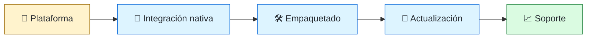
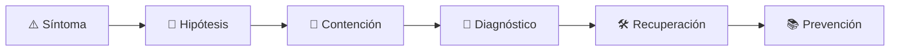

# 🖥️ Desktop Engineer
<!-- role-visual:start -->

**La guía conecta trabajo real, decisiones, clases concretas y evidencia defendible.**

<!-- role-visual:end -->

> Construye aplicaciones de escritorio integradas con el sistema operativo, capaces
> de instalarse, actualizarse y recuperar estado con seguridad.
>
> **Entrada habitual:** junior/semi-senior · **Foco:** clientes ricos y distribución
> · **Evidencia central:** aplicación instalable con actualización y rollback probados

## 🧭 Qué es y por qué importa

Una aplicación de escritorio administra ventanas, archivos, procesos, integración
nativa y largos periodos de uso. Debe sobrevivir a cierres abruptos, configuraciones
heterogéneas y actualizaciones que no pueden dejar al usuario sin herramienta.

## 🗓️ Un día en el puesto

- depurar un fallo específico de Windows, macOS o Linux;
- diseñar persistencia local y recuperación tras cierre inesperado;
- revisar firma, empaquetado, permisos e instalador;
- medir arranque, memoria y responsividad;
- validar teclado, escalado, lectores de pantalla y actualización.

## ✅ Responsabilidades y límites

- Responde por ciclo de vida, integración nativa y distribución del cliente.
- Declara con precisión plataformas y versiones probadas.
- No trata el sistema de archivos del usuario como almacenamiento descartable.
- No afirma portabilidad basándose solo en que el framework compila.

## 🧠 Qué necesitas saber

Procesos, archivos, IPC, UI y accesibilidad; almacenamiento y migración local;
empaquetado, firma y actualización; concurrencia, rendimiento, crash diagnostics,
seguridad de plugins y diferencias entre plataformas.

## 📚 Tu ruta en el programa

1. Partes 01–09 para máquina, sistema operativo y construcción.
2. Partes 13–14 y 17–18 para contratos, UX, documentación y procesos.
3. [Parte 21](../classes/part-21-software-movil-escritorio-y-multiplataforma/README.md) como núcleo.
4. Partes 26, 30–33 y 35 para persistencia, pruebas, supply chain y diagnóstico.
5. Parte 36 para migración, compatibilidad y retiro.

<!-- role-depth:start -->
## 🗺️ Sistema profesional del rol

El gráfico no representa una cascada rígida. Muestra el bucle profesional que este rol
debe poder recorrer: comprender el contexto, tomar una decisión, intervenir, observar
el efecto y convertir lo aprendido en una mejora. En **🖥️ Desktop Engineer**, saltar directamente a
la herramienta suele ocultar el problema, mientras que terminar sin evidencia deja la
decisión en una opinión. La misión concreta es: Construye aplicaciones de escritorio integradas con el sistema operativo, capaces de instalarse, actualizarse y recuperar estado con seguridad. Cada transición
debe conservar supuestos, responsables y una forma de volver atrás.

<table>
<tr>
<td valign="top" width="50%">

### 🎯 Responde por

- decisiones propias de la familia **Clientes**;
- el resultado observable, no sólo la actividad ejecutada;
- límites, riesgos, operación y deuda residual de su intervención;
- evidencia que otra persona pueda revisar o reproducir.

</td>
<td valign="top" width="50%">

### 🤝 Coordina con

- [📱 Mobile Engineer](mobile-engineer.md); [⚙️ Systems Programmer](systems-programmer.md); [📦 Build & Release Engineer](build-release-engineer.md);
- producto y personas usuarias cuando cambia una tarea o outcome;
- seguridad, privacidad, accesibilidad y operación según el riesgo;
- quienes mantendrán el sistema después de la entrega.

</td>
</tr>
</table>

El título no concede autoridad automática. El alcance real depende del equipo, la
industria y la criticidad. Esta guía describe un recorrido desde **junior → principal**, pero una
vacante se evalúa por las decisiones que permite tomar, los sistemas que pone bajo
responsabilidad y la evidencia exigida, no por el nombre del cargo.

## 🧱 Partes y clases asociadas

La ruta distingue **parte** —unidad curricular con una capacidad acumulativa— de
**clase asociada** —punto concreto donde se estudia un mecanismo o una decisión. Las
clases siguientes forman el núcleo; no eliminan los prerrequisitos indicados en sus
propias páginas ni convierten en opcional la base común.

| Orden | Parte del programa | Clases clave | Por qué entra en esta ruta | Evidencia de transferencia |
| ---: | --- | --- | --- | --- |
| 1 | [Parte 02 · Sistemas operativos, terminal y automatización base](../classes/part-02-sistemas-operativos-terminal-y-automatizacion-base/README.md) | [SE-025 · Windows, Linux, macOS y sus modelos operativos](../classes/part-02-sistemas-operativos-terminal-y-automatizacion-base/se-025-windows-linux-macos-y-sus-modelos-operativos/README.md) [SE-026 · Sistemas de archivos, rutas, enlaces y metadatos](../classes/part-02-sistemas-operativos-terminal-y-automatizacion-base/se-026-sistemas-de-archivos-rutas-enlaces-y-metadatos/README.md) [SE-027 · Usuarios, grupos, permisos y elevación de privilegios](../classes/part-02-sistemas-operativos-terminal-y-automatizacion-base/se-027-usuarios-grupos-permisos-y-elevacion-de-privilegios/README.md) | Profundiza **sistemas operativos, automatización y diagnóstico** desde la responsabilidad del rol. | Kit de preparación y recuperación. |
| 2 | [Parte 18 · CLI, TUI, servicios y automatización](../classes/part-18-cli-tui-servicios-y-automatizacion/README.md) | [SE-217 · Diseño de interfaces de línea de comandos](../classes/part-18-cli-tui-servicios-y-automatizacion/se-217-diseno-de-interfaces-de-linea-de-comandos/README.md) [SE-222 · Daemons, servicios y ciclo de vida](../classes/part-18-cli-tui-servicios-y-automatizacion/se-222-daemons-servicios-y-ciclo-de-vida/README.md) [SE-225 · Distribución de binarios y actualizaciones](../classes/part-18-cli-tui-servicios-y-automatizacion/se-225-distribucion-de-binarios-y-actualizaciones/README.md) | Profundiza **interfaces de automatización y procesos durables** desde la responsabilidad del rol. | Herramienta operable e idempotente. |
| 3 | [Parte 21 · Software móvil, escritorio y multiplataforma](../classes/part-21-software-movil-escritorio-y-multiplataforma/README.md) | [SE-253 · Modelos de aplicación móvil y de escritorio](../classes/part-21-software-movil-escritorio-y-multiplataforma/se-253-modelos-de-aplicacion-movil-y-de-escritorio/README.md) [SE-259 · Actualizaciones, tiendas y distribución empresarial](../classes/part-21-software-movil-escritorio-y-multiplataforma/se-259-actualizaciones-tiendas-y-distribucion-empresarial/README.md) [SE-262 · Firma, sandbox y seguridad del cliente](../classes/part-21-software-movil-escritorio-y-multiplataforma/se-262-firma-sandbox-y-seguridad-del-cliente/README.md) | Profundiza **clientes, sincronización y distribución** desde la responsabilidad del rol. | Cliente offline con actualización segura. |
| 4 | [Parte 33 · Build, release y cadena de suministro](../classes/part-33-build-release-y-cadena-de-suministro/README.md) | [SE-402 · Versionado, compatibilidad y changelog](../classes/part-33-build-release-y-cadena-de-suministro/se-402-versionado-compatibilidad-y-changelog/README.md) [SE-405 · Instaladores, paquetes y actualizaciones](../classes/part-33-build-release-y-cadena-de-suministro/se-405-instaladores-paquetes-y-actualizaciones/README.md) [SE-408 · Proyecto: release firmado y recuperable](../classes/part-33-build-release-y-cadena-de-suministro/se-408-proyecto-release-firmado-y-recuperable/README.md) | Profundiza **build, release y cadena de suministro** desde la responsabilidad del rol. | Release firmado y verificable. |

**Cómo recorrerla.** Empieza por [SE-025](../classes/part-02-sistemas-operativos-terminal-y-automatizacion-base/se-025-windows-linux-macos-y-sus-modelos-operativos/README.md) para fijar el
primer mecanismo, usa [SE-253](../classes/part-21-software-movil-escritorio-y-multiplataforma/se-253-modelos-de-aplicacion-movil-y-de-escritorio/README.md) para integrar el
centro de la especialidad y llega a [SE-408](../classes/part-33-build-release-y-cadena-de-suministro/se-408-proyecto-release-firmado-y-recuperable/README.md) cuando ya
puedas explicar cómo detectar y recuperar un fallo. Una clase se considera estudiada
sólo cuando su concepto cambia una decisión y deja evidencia; abrir todos los enlaces
no constituye competencia.

> [!IMPORTANT]
> El mapa expresa el currículo previsto. Las Partes 00–02 están desarrolladas; las
> posteriores conservan borradores o estructuras que deben superar revisión
> cualitativa. Esta ruta no declara terminadas esas clases ni reemplaza el
> [roadmap](../ROADMAP.md).

## ⚖️ Decisiones y trade-offs que debes defender

| Decisión recurrente | Criterio profesional | Evidencia mínima antes de defenderla |
| --- | --- | --- |
| **Nativo o cross-platform** | Comparar integración accesibilidad tamaño y mantenimiento. | Matriz funcional por sistema operativo. |
| **Autoactualización o control administrado** | Respetar permisos canales empresariales y reversión. | Instalación limpia upgrade downgrade y desinstalación. |
| **Privilegio o comodidad** | Reducir superficie y elevar sólo operaciones necesarias. | Pruebas con usuario estándar y auditoría de permisos. |

La calidad de una decisión no se juzga porque coincida con una herramienta popular.
Debe hacer explícitos contexto, restricciones, alternativas descartadas, coste de
cambio y condición de revisión. En especial, **Nativo o cross-platform**, **Autoactualización o control administrado**
y **Privilegio o comodidad** cambian de respuesta cuando cambia el riesgo. Una solución
correcta en un prototipo puede ser irresponsable en un sistema regulado; una solución
robusta para un servicio crítico puede ser desperdicio en una herramienta interna.

## 🚨 Escenario profesional: Actualización deja la aplicación sin arrancar

**Síntoma.** El instalador migró configuración antes de verificar el binario. La respuesta madura evita convertir la primera
correlación en causa y conserva evidencia antes de modificar el sistema.

1. **Detectar y delimitar:** identifica quién o qué está afectado, desde cuándo y qué
   cambió. Conserva timestamps, versiones, entradas y señales suficientes para no
   destruir la escena al intentar arreglarla.
2. **Investigar:** Revisar firma canal permisos migración y rollback. Formula al menos dos hipótesis rivales
   y define qué observación refutaría cada una.
3. **Contener:** reduce blast radius y daño sin prometer una corrección todavía. La
   contención debe ser reversible, visible y compatible con las obligaciones del
   sistema.
4. **Recuperar:** Restaurar versión anterior y probar upgrade downgrade y reparación. Verifica la tarea completa, no sólo que un
   proceso volvió a estar verde.
5. **Aprender:** añade una regresión, señal o control que detecte la misma clase de
   fallo. Documenta qué deuda permanece y quién revisará la acción.

El escenario evalúa método además de resultado. Una recuperación rápida que borra la
causa, oculta pérdida de datos o deja al equipo sin mecanismo preventivo no demuestra
dominio del rol.

## 📊 Señales útiles y límites de las métricas

| Señal | Qué ayuda a observar | Trampa que debe evitarse |
| --- | --- | --- |
| **Éxito de instalación** | Instalaciones y actualizaciones completas por plataforma. | Ignorar instalaciones silenciosas. |
| **Fallos por versión de SO** | Compatibilidad real con ambientes soportados. | Probar sólo la máquina del equipo. |
| **Tiempo de diagnóstico** | Capacidad de soporte con logs y códigos útiles. | Añadir telemetría invasiva. |

Ninguna señal debe convertirse en ranking individual. Combina tendencia cuantitativa,
muestreo de casos, feedback cualitativo y contexto de carga. Declara ventana,
denominador, fuente, exclusiones y quién puede actuar sobre el resultado. Si una
métrica mejora mientras el outcome o el riesgo empeoran, el sistema está optimizando
el indicador y no el trabajo.

## 🧩 Proyecto integrador del rol: Aplicación de escritorio mantenible

**Propósito:** distribuir una herramienta accesible con integración nativa y actualización recuperable. El resultado esperado es **paquetes firmados matriz multi-OS migración telemetría opt-in y runbook de soporte**.

Entrega un expediente revisable con estas piezas:

1. **Contexto y alcance:** usuario, sistema, restricción, supuestos, fuera de alcance y
   criterio de no éxito.
2. **Decisión:** al menos dos alternativas reales, trade-offs, coste de reversión y un
   ADR o memo que indique cuándo revisar la elección.
3. **Artefacto principal:** una implementación, modelo, flujo o política coherente con
   las clases núcleo; no una captura aislada ni una presentación sin mecanismo.
4. **Fallo controlado:** introduce una condición adversa relacionada con el escenario
   anterior y conserva el resultado observado, sin inventar una ejecución.
5. **Verificación:** prueba, rúbrica, revisión o medición que pueda fallar y que conecte
   directamente con el resultado profesional.
6. **Operación y salida:** telemetría, recuperación, mantenimiento, deprecación o retiro
   según corresponda; incluye límites y deuda residual.

**Criterio de aceptación:** otra persona puede reconstruir el razonamiento, reproducir
la comprobación y distinguir claramente qué quedó demostrado de lo que sólo se propone.
El proyecto no se aprueba por cantidad de archivos ni por utilizar una marca concreta.

## 📈 Dominio esperado por alcance

| Alcance | Qué resuelve | Qué evidencia su autonomía |
| --- | --- | --- |
| **Inicial** | ejecuta una tarea acotada con criterios y acompañamiento | reproduce el caso, pregunta por supuestos y entrega evidencia legible |
| **Intermedio** | decide dentro de un componente o flujo conocido | compara alternativas, prueba fallos previsibles y coordina dependencias |
| **Senior** | conduce problemas ambiguos que cruzan sistemas o equipos | hace explícito el riesgo, diseña recuperación y mejora el mecanismo de trabajo |
| **Staff / Lead** | cambia capacidades compartidas y decisiones de largo plazo | multiplica criterio, define guardrails, mide adopción y conserva opciones futuras |

Progresar no significa alejarse de la práctica. Significa aumentar ambigüedad, horizonte,
blast radius y responsabilidad por consecuencias. La persona senior todavía debe poder
explicar el mecanismo; la persona Staff además crea condiciones para que otros lo
operen sin depender de ella.

## 🗓️ Plan de práctica 30 · 60 · 90 días

- **Días 1–30 — comprender y reproducir.** Estudia las primeras clases de cada parte,
  reproduce un caso pequeño y escribe un mapa de responsabilidades. El entregable es
  una baseline con preguntas abiertas, no una transformación prematura.
- **Días 31–60 — intervenir y fallar con control.** Construye el artefacto central,
  introduce el escenario de fallo y mide el comportamiento. Revisa el trabajo con una
  persona de una ruta vecina para descubrir supuestos de frontera.
- **Días 61–90 — operar y transferir.** Ejecuta recuperación, corrige la causa, publica
  runbook o guía de uso y presenta la decisión con trade-offs. Termina con una
  retrospectiva que separe resultado, evidencia, límites y siguiente inversión.

Este plan es una secuencia de práctica, no una promesa de empleabilidad en noventa días.
La experiencia previa, el dominio y el acceso a sistemas reales cambian el tiempo
necesario.

## 🎤 Preguntas para revisión o entrevista

1. ¿En qué contexto elegirías **Nativo o cross-platform** y qué evidencia te haría cambiar?
2. ¿Cómo distinguirías síntoma, causa y daño en el escenario **Actualización deja la aplicación sin arrancar**?
3. ¿Qué clase asociada usarías para diseñar el mecanismo y cuál para verificarlo?
4. ¿Qué parte de **Aplicación de escritorio mantenible** no automatizarías todavía y por qué?
5. ¿Qué métrica podría mejorar mientras el sistema empeora y qué guardrail añadirías?
6. ¿Dónde termina la autoridad de este rol y cuándo debe escalar o pedir revisión?

Una respuesta fuerte usa un caso, reconoce incertidumbre y propone una comprobación.
Nombrar una herramienta sin explicar mecanismo, fallo y límite no demuestra la
competencia.

## 🔗 Fuentes primarias y oficiales

- [Windows developer documentation](https://learn.microsoft.com/windows/) — **Microsoft**. Se usa como referencia primaria u oficial; la guía no sustituye la fuente.
- [The Open Group Base Specifications, Issue 8](https://pubs.opengroup.org/onlinepubs/9799919799/) — **The Open Group / IEEE**. Se usa como referencia primaria u oficial; la guía no sustituye la fuente.
- [Semantic Versioning 2.0.0](https://semver.org/spec/v2.0.0.html) — **Semantic Versioning project**. Se usa como referencia primaria u oficial; la guía no sustituye la fuente.

Las fuentes orientan principios, vocabulario y prácticas; no convierten la guía en una
certificación ni sustituyen la documentación específica del sistema, la jurisdicción
o la tecnología utilizada.
<!-- role-depth:end -->

## 🧪 Evidencia de portafolio

- instaladores reproducibles para dos plataformas declaradas;
- recuperación de documento tras cierre forzado;
- actualización firmada con rollback;
- matriz de accesibilidad, rendimiento y compatibilidad observada.

## 📈 Progresión

Desktop Junior → Desktop Engineer → Senior → Staff Client Platform o Architect.

## ⚠️ Mitos frecuentes

- “Desktop está obsoleto.” Sigue siendo apropiado para integración, offline y trabajo intensivo.
- “Electron/nativo resuelve portabilidad.” Cada opción cambia coste, superficie y operación.
- “Actualizar es reemplazar un binario.” Incluye datos, plugins y procesos activos.

## 🚀 Siguientes pasos

1. Define plataformas soportadas y un entorno de prueba real.
2. Provoca una interrupción durante guardado y recuperación.
3. Empaqueta, firma y revierte una actualización controlada.

---

[⬅️ Volver a las rutas](README.md) · [🏠 Inicio del programa](../README.md)
