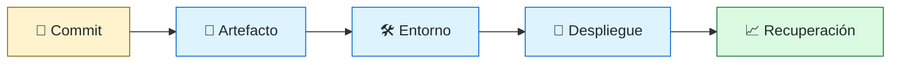
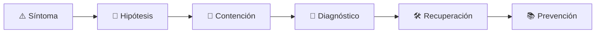

# 🚚 DevOps Engineer
<!-- role-visual:start -->

**La guía conecta trabajo real, decisiones, clases concretas y evidencia defendible.**

<!-- role-visual:end -->

> Construye automatización para que cambios pequeños lleguen a entornos reales de
> forma repetible, segura, observable y reversible.
>
> **Entrada habitual:** semi-senior · **Foco:** CI/CD, infraestructura y entrega ·
> **Evidencia central:** pipeline reproducible con promoción y rollback comprobados

## 🧭 Qué es y por qué importa

DevOps nació como una forma de trabajo que une desarrollo y operación; en muchas
empresas también nombra a quienes construyen pipelines, infraestructura y automatización.
El rol reduce variabilidad y tiempo de feedback sin convertir el equipo en una mesa
de tickets. Su producto es un flujo de entrega que otros pueden usar y comprender.

## 🗓️ Un día en el puesto

- corregir un pipeline fallido o reducir su tiempo de feedback;
- modelar infraestructura declarativa y revisar su plan;
- publicar, promover o retirar un artefacto verificable;
- mejorar secretos, identidad y permisos de un workflow;
- automatizar despliegue progresivo y rollback;
- investigar con desarrollo una falla que cruza aplicación e infraestructura.

## ✅ Responsabilidades y límites

- Responde por repetibilidad, trazabilidad y seguridad del camino de entrega.
- Diseña autoservicio y documentación, no dependencia personal.
- No es “la persona que hace deploys” para todos.
- No usa YAML como sustituto de diseño ni crea pipelines imposibles de depurar.
- No mide éxito solo por frecuencia; también importan fallos y recuperación.

## 🧠 Qué necesitas saber

- Linux/Windows, shells, redes, procesos, paquetes y contenedores;
- Git, artefactos, SemVer, configuración y secretos;
- CI/CD, IaC, GitOps, entornos y progressive delivery;
- IAM, supply chain, SBOM, firma y procedencia;
- observabilidad, capacidad, backups y recuperación;
- DORA, feedback loops y límites de las métricas.

## 📚 Tu ruta en el programa

1. Partes 02–03 y 08–09 para sistemas, redes, depuración y empaquetado.
2. Partes 16–18 para Git, documentación y automatización.
3. [Parte 29 — Cloud, plataforma e infraestructura](../classes/part-29-cloud-plataforma-e-infraestructura/README.md).
4. Partes 31 y 33 para resiliencia, build, release y supply chain.
5. [Parte 34 — CI/CD, IaC y platform engineering](../classes/part-34-ci-cd-iac-y-platform-engineering/README.md).
6. Parte 35 para observabilidad e incidentes; partes 38–39 para automatización con agentes.

<!-- role-depth:start -->
## 🗺️ Sistema profesional del rol

El gráfico no representa una cascada rígida. Muestra el bucle profesional que este rol
debe poder recorrer: comprender el contexto, tomar una decisión, intervenir, observar
el efecto y convertir lo aprendido en una mejora. En **🚚 DevOps Engineer**, saltar directamente a
la herramienta suele ocultar el problema, mientras que terminar sin evidencia deja la
decisión en una opinión. La misión concreta es: Construye automatización para que cambios pequeños lleguen a entornos reales de forma repetible, segura, observable y reversible. Cada transición
debe conservar supuestos, responsables y una forma de volver atrás.

<table>
<tr>
<td valign="top" width="50%">

### 🎯 Responde por

- decisiones propias de la familia **Entrega**;
- el resultado observable, no sólo la actividad ejecutada;
- límites, riesgos, operación y deuda residual de su intervención;
- evidencia que otra persona pueda revisar o reproducir.

</td>
<td valign="top" width="50%">

### 🤝 Coordina con

- [📦 Build & Release Engineer](build-release-engineer.md); [🛤️ Platform Engineer](platform-engineer.md); [📈 Site Reliability Engineer](site-reliability-engineer.md);
- producto y personas usuarias cuando cambia una tarea o outcome;
- seguridad, privacidad, accesibilidad y operación según el riesgo;
- quienes mantendrán el sistema después de la entrega.

</td>
</tr>
</table>

El título no concede autoridad automática. El alcance real depende del equipo, la
industria y la criticidad. Esta guía describe un recorrido desde **semi-senior → principal**, pero una
vacante se evalúa por las decisiones que permite tomar, los sistemas que pone bajo
responsabilidad y la evidencia exigida, no por el nombre del cargo.

## 🧱 Partes y clases asociadas

La ruta distingue **parte** —unidad curricular con una capacidad acumulativa— de
**clase asociada** —punto concreto donde se estudia un mecanismo o una decisión. Las
clases siguientes forman el núcleo; no eliminan los prerrequisitos indicados en sus
propias páginas ni convierten en opcional la base común.

| Orden | Parte del programa | Clases clave | Por qué entra en esta ruta | Evidencia de transferencia |
| ---: | --- | --- | --- | --- |
| 1 | [Parte 29 · Cloud, plataforma e infraestructura](../classes/part-29-cloud-plataforma-e-infraestructura/README.md) | [SE-353 · Redes, identidad y secretos en cloud](../classes/part-29-cloud-plataforma-e-infraestructura/se-353-redes-identidad-y-secretos-en-cloud/README.md) [SE-354 · Infraestructura como código y estado](../classes/part-29-cloud-plataforma-e-infraestructura/se-354-infraestructura-como-codigo-y-estado/README.md) [SE-359 · Taller: desplegar y destruir un entorno seguro](../classes/part-29-cloud-plataforma-e-infraestructura/se-359-taller-desplegar-y-destruir-un-entorno-seguro/README.md) | Profundiza **cloud, infraestructura y plataformas** desde la responsabilidad del rol. | Entorno reproducible y eliminable. |
| 2 | [Parte 33 · Build, release y cadena de suministro](../classes/part-33-build-release-y-cadena-de-suministro/README.md) | [SE-397 · Build reproducible y hermético](../classes/part-33-build-release-y-cadena-de-suministro/se-397-build-reproducible-y-hermetico/README.md) [SE-400 · SBOM, procedencia y atestaciones](../classes/part-33-build-release-y-cadena-de-suministro/se-400-sbom-procedencia-y-atestaciones/README.md) [SE-404 · Canary, blue-green y rollback](../classes/part-33-build-release-y-cadena-de-suministro/se-404-canary-blue-green-y-rollback/README.md) | Profundiza **build, release y cadena de suministro** desde la responsabilidad del rol. | Release firmado y verificable. |
| 3 | [Parte 34 · CI/CD, IaC y platform engineering](../classes/part-34-ci-cd-iac-y-platform-engineering/README.md) | [SE-409 · Integración continua y feedback temprano](../classes/part-34-ci-cd-iac-y-platform-engineering/se-409-integracion-continua-y-feedback-temprano/README.md) [SE-412 · Credenciales efímeras y OIDC](../classes/part-34-ci-cd-iac-y-platform-engineering/se-412-credenciales-efimeras-y-oidc/README.md) [SE-420 · Proyecto: camino a producción con rollback](../classes/part-34-ci-cd-iac-y-platform-engineering/se-420-proyecto-camino-a-produccion-con-rollback/README.md) | Profundiza **CI/CD, IaC, plataforma y DevEx** desde la responsabilidad del rol. | Camino autoservicio con rollback. |
| 4 | [Parte 35 · Observabilidad, SRE e incidentes](../classes/part-35-observabilidad-sre-e-incidentes/README.md) | [SE-422 · Logs estructurados y correlación](../classes/part-35-observabilidad-sre-e-incidentes/se-422-logs-estructurados-y-correlacion/README.md) [SE-428 · Gestión de incidentes y comunicación](../classes/part-35-observabilidad-sre-e-incidentes/se-428-gestion-de-incidentes-y-comunicacion/README.md) [SE-430 · Continuidad, disaster recovery y ejercicios](../classes/part-35-observabilidad-sre-e-incidentes/se-430-continuidad-disaster-recovery-y-ejercicios/README.md) | Profundiza **observabilidad, SRE e incidentes** desde la responsabilidad del rol. | Incidente diagnosticado y recuperado. |

**Cómo recorrerla.** Empieza por [SE-353](../classes/part-29-cloud-plataforma-e-infraestructura/se-353-redes-identidad-y-secretos-en-cloud/README.md) para fijar el
primer mecanismo, usa [SE-409](../classes/part-34-ci-cd-iac-y-platform-engineering/se-409-integracion-continua-y-feedback-temprano/README.md) para integrar el
centro de la especialidad y llega a [SE-430](../classes/part-35-observabilidad-sre-e-incidentes/se-430-continuidad-disaster-recovery-y-ejercicios/README.md) cuando ya
puedas explicar cómo detectar y recuperar un fallo. Una clase se considera estudiada
sólo cuando su concepto cambia una decisión y deja evidencia; abrir todos los enlaces
no constituye competencia.

> [!IMPORTANT]
> El mapa expresa el currículo previsto. Las Partes 00–01 están desarrolladas; las
> posteriores conservan borradores o estructuras que deben superar revisión
> cualitativa. Esta ruta no declara terminadas esas clases ni reemplaza el
> [roadmap](../ROADMAP.md).

## ⚖️ Decisiones y trade-offs que debes defender

| Decisión recurrente | Criterio profesional | Evidencia mínima antes de defenderla |
| --- | --- | --- |
| **Velocidad o control** | Automatizar evidencia y aprobación proporcional al riesgo. | Lead time más change failure rate. |
| **Mutable o inmutable** | Promover el mismo artefacto y externalizar configuración. | Checksum entre entornos. |
| **Centralizar o autoservicio** | Crear paved road sin bloquear casos excepcionales. | Adopción tiempo de feedback y salida documentada. |

La calidad de una decisión no se juzga porque coincida con una herramienta popular.
Debe hacer explícitos contexto, restricciones, alternativas descartadas, coste de
cambio y condición de revisión. En especial, **Velocidad o control**, **Mutable o inmutable**
y **Centralizar o autoservicio** cambian de respuesta cuando cambia el riesgo. Una solución
correcta en un prototipo puede ser irresponsable en un sistema regulado; una solución
robusta para un servicio crítico puede ser desperdicio en una herramienta interna.

## 🚨 Escenario profesional: Pipeline verde despliega configuración inválida

**Síntoma.** Los checks validan sintaxis pero no comportamiento del entorno. La respuesta madura evita convertir la primera
correlación en causa y conserva evidencia antes de modificar el sistema.

1. **Detectar y delimitar:** identifica quién o qué está afectado, desde cuándo y qué
   cambió. Conserva timestamps, versiones, entradas y señales suficientes para no
   destruir la escena al intentar arreglarla.
2. **Investigar:** Seguir artefacto identidad configuración policy y señal posterior. Formula al menos dos hipótesis rivales
   y define qué observación refutaría cada una.
3. **Contener:** reduce blast radius y daño sin prometer una corrección todavía. La
   contención debe ser reversible, visible y compatible con las obligaciones del
   sistema.
4. **Recuperar:** Detener promoción revertir conservar evidencia y añadir validación del fallo. Verifica la tarea completa, no sólo que un
   proceso volvió a estar verde.
5. **Aprender:** añade una regresión, señal o control que detecte la misma clase de
   fallo. Documenta qué deuda permanece y quién revisará la acción.

El escenario evalúa método además de resultado. Una recuperación rápida que borra la
causa, oculta pérdida de datos o deja al equipo sin mecanismo preventivo no demuestra
dominio del rol.

## 📊 Señales útiles y límites de las métricas

| Señal | Qué ayuda a observar | Trampa que debe evitarse |
| --- | --- | --- |
| **Lead time verificable** | Tiempo desde cambio aceptado hasta valor desplegado. | Medir desde un punto conveniente. |
| **Change failure rate** | Cambios que exigen remediación o rollback. | Ocultar hotfix como éxito. |
| **Tiempo de recuperación** | Capacidad de revertir o corregir con evidencia. | Medir sólo incidentes simples. |

Ninguna señal debe convertirse en ranking individual. Combina tendencia cuantitativa,
muestreo de casos, feedback cualitativo y contexto de carga. Declara ventana,
denominador, fuente, exclusiones y quién puede actuar sobre el resultado. Si una
métrica mejora mientras el outcome o el riesgo empeoran, el sistema está optimizando
el indicador y no el trabajo.

## 🧩 Proyecto integrador del rol: Camino de entrega reversible

**Propósito:** llevar un artefacto firmado por varios entornos sin reconstrucción y recuperar un fallo. El resultado esperado es **pipeline IaC OIDC SBOM promoción canary rollback observabilidad y runbook**.

Entrega un expediente revisable con estas piezas:

1. **Contexto y alcance:** usuario, sistema, restricción, supuestos, fuera de alcance y
   criterio de no éxito.
2. **Decisión:** al menos dos alternativas reales, trade-offs, coste de reversión y un
   ADR o memo que indique cuándo revisar la elección.
3. **Artefacto principal:** una implementación, modelo, flujo o política coherente con
   las clases núcleo; no una captura aislada ni una presentación sin mecanismo.
4. **Fallo controlado:** introduce una condición adversa relacionada con el escenario
   anterior y conserva el resultado observado, sin inventar una ejecución.
5. **Verificación:** prueba, rúbrica, revisión o medición que pueda fallar y que conecte
   directamente con el resultado profesional.
6. **Operación y salida:** telemetría, recuperación, mantenimiento, deprecación o retiro
   según corresponda; incluye límites y deuda residual.

**Criterio de aceptación:** otra persona puede reconstruir el razonamiento, reproducir
la comprobación y distinguir claramente qué quedó demostrado de lo que sólo se propone.
El proyecto no se aprueba por cantidad de archivos ni por utilizar una marca concreta.

## 📈 Dominio esperado por alcance

| Alcance | Qué resuelve | Qué evidencia su autonomía |
| --- | --- | --- |
| **Inicial** | ejecuta una tarea acotada con criterios y acompañamiento | reproduce el caso, pregunta por supuestos y entrega evidencia legible |
| **Intermedio** | decide dentro de un componente o flujo conocido | compara alternativas, prueba fallos previsibles y coordina dependencias |
| **Senior** | conduce problemas ambiguos que cruzan sistemas o equipos | hace explícito el riesgo, diseña recuperación y mejora el mecanismo de trabajo |
| **Staff / Lead** | cambia capacidades compartidas y decisiones de largo plazo | multiplica criterio, define guardrails, mide adopción y conserva opciones futuras |

Progresar no significa alejarse de la práctica. Significa aumentar ambigüedad, horizonte,
blast radius y responsabilidad por consecuencias. La persona senior todavía debe poder
explicar el mecanismo; la persona Staff además crea condiciones para que otros lo
operen sin depender de ella.

## 🗓️ Plan de práctica 30 · 60 · 90 días

- **Días 1–30 — comprender y reproducir.** Estudia las primeras clases de cada parte,
  reproduce un caso pequeño y escribe un mapa de responsabilidades. El entregable es
  una baseline con preguntas abiertas, no una transformación prematura.
- **Días 31–60 — intervenir y fallar con control.** Construye el artefacto central,
  introduce el escenario de fallo y mide el comportamiento. Revisa el trabajo con una
  persona de una ruta vecina para descubrir supuestos de frontera.
- **Días 61–90 — operar y transferir.** Ejecuta recuperación, corrige la causa, publica
  runbook o guía de uso y presenta la decisión con trade-offs. Termina con una
  retrospectiva que separe resultado, evidencia, límites y siguiente inversión.

Este plan es una secuencia de práctica, no una promesa de empleabilidad en noventa días.
La experiencia previa, el dominio y el acceso a sistemas reales cambian el tiempo
necesario.

## 🎤 Preguntas para revisión o entrevista

1. ¿En qué contexto elegirías **Velocidad o control** y qué evidencia te haría cambiar?
2. ¿Cómo distinguirías síntoma, causa y daño en el escenario **Pipeline verde despliega configuración inválida**?
3. ¿Qué clase asociada usarías para diseñar el mecanismo y cuál para verificarlo?
4. ¿Qué parte de **Camino de entrega reversible** no automatizarías todavía y por qué?
5. ¿Qué métrica podría mejorar mientras el sistema empeora y qué guardrail añadirías?
6. ¿Dónde termina la autoridad de este rol y cuándo debe escalar o pedir revisión?

Una respuesta fuerte usa un caso, reconoce incertidumbre y propone una comprobación.
Nombrar una herramienta sin explicar mecanismo, fallo y límite no demuestra la
competencia.

## 🔗 Fuentes primarias y oficiales

- [DORA software delivery performance metrics](https://dora.dev/guides/dora-metrics/) — **Google Cloud**. Se usa como referencia primaria u oficial; la guía no sustituye la fuente.
- [SLSA specification v1.2](https://slsa.dev/spec/v1.2/) — **OpenSSF**. Se usa como referencia primaria u oficial; la guía no sustituye la fuente.
- [Terraform language documentation](https://developer.hashicorp.com/terraform/language) — **HashiCorp**. Se usa como referencia primaria u oficial; la guía no sustituye la fuente.

Las fuentes orientan principios, vocabulario y prácticas; no convierten la guía en una
certificación ni sustituyen la documentación específica del sistema, la jurisdicción
o la tecnología utilizada.
<!-- role-depth:end -->

## 🧪 Evidencia de portafolio

- pipeline desde commit hasta entorno con artefacto inmutable;
- IaC con plan, política, destrucción y recuperación;
- identidad efímera y permisos mínimos por job;
- SBOM, firma y procedencia verificadas al desplegar;
- canary o blue/green con criterio automático y rollback;
- medición de lead time, failure rate y recovery con interpretación honesta.

## 📈 Progresión

Systems/Software Engineer → DevOps Engineer → Senior → Platform, SRE, DevSecOps o
Staff Infrastructure. Crecer significa convertir conocimiento operativo en una
capacidad compartida y sostenible.

## ⚠️ Mitos frecuentes

- “DevOps es un equipo que recibe tickets.” Eso recrea el silo que intentaba resolver.
- “Automatizado significa confiable.” Un error automatizado escala más rápido.
- “Contenedor significa reproducible.” Imagen, dependencias y entorno también importan.
- “Más despliegues siempre es mejor.” Sin demanda, calidad y recuperación es gaming.

## 🚀 Siguientes pasos

1. Automatiza build y prueba de un artefacto pequeño.
2. Añade procedencia y promoción entre entornos sin reconstruir.
3. Implementa un despliegue fallido deliberado y recupera.
4. Documenta el golden path y observa a otra persona usarlo.

---

[⬅️ Volver a las rutas](README.md) · [🏠 Inicio del programa](../README.md)
