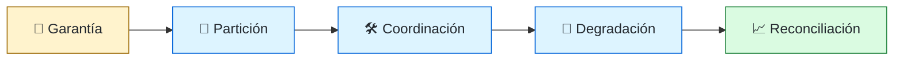
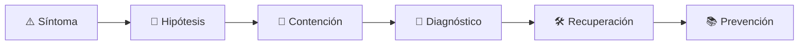

# 🌐 Distributed Systems Engineer
<!-- role-visual:start -->

**La guía conecta trabajo real, decisiones, clases concretas y evidencia defendible.**

<!-- role-visual:end -->

> Diseña sistemas que conservan garantías explícitas pese a latencia, concurrencia,
> particiones, reintentos y fallos parciales.
>
> **Entrada habitual:** senior · **Foco:** coordinación, consistencia y resiliencia
> · **Evidencia central:** experimento de fallos que demuestra garantías y pérdidas

## 🧭 Qué es y por qué importa

Al distribuir estado, el sistema pierde un reloj y un destino universalmente fiables.
Este rol decide qué coordinar, qué aceptar como eventual, cómo detectar duplicados y
qué comportamiento ofrecer cuando una dependencia responde tarde o de forma incierta.

## 🗓️ Un día en el puesto

- precisar invariantes y modelo de consistencia;
- revisar timeout, retry, backoff e idempotencia;
- investigar un split-brain, duplicado o retraso;
- ejecutar pruebas de partición y reinicio;
- documentar trade-offs para producto y operación.

## ✅ Responsabilidades y límites

- Responde por garantías observables y comportamiento bajo fallo.
- Usa CAP/PACELC como marco, no como eslogan.
- No distribuye un monolito para resolver límites organizacionales vagos.
- No afirma exactly-once sin alcance, protocolo y evidencia.

## 🧠 Qué necesitas saber

Concurrencia, relojes, fallos parciales, consistencia, replicación, quorum, consenso,
leader election, idempotencia, sagas, event sourcing, partición, service discovery,
observabilidad y chaos engineering.

## 📚 Tu ruta en el programa

1. Partes 01–09, especialmente redes, algoritmos y debugging.
2. Partes 13, 20 y 24–27 para contratos, arquitectura, datos y eventos.
3. [Parte 28 — Concurrencia y sistemas distribuidos](../classes/part-28-concurrencia-y-sistemas-distribuidos/README.md).
4. Partes 29–35 para infraestructura, pruebas, resiliencia y operación.

<!-- role-depth:start -->
## 🗺️ Sistema profesional del rol

El gráfico no representa una cascada rígida. Muestra el bucle profesional que este rol
debe poder recorrer: comprender el contexto, tomar una decisión, intervenir, observar
el efecto y convertir lo aprendido en una mejora. En **🌐 Distributed Systems Engineer**, saltar directamente a
la herramienta suele ocultar el problema, mientras que terminar sin evidencia deja la
decisión en una opinión. La misión concreta es: Diseña sistemas que conservan garantías explícitas pese a latencia, concurrencia, particiones, reintentos y fallos parciales. Cada transición
debe conservar supuestos, responsables y una forma de volver atrás.

<table>
<tr>
<td valign="top" width="50%">

### 🎯 Responde por

- decisiones propias de la familia **Distribución**;
- el resultado observable, no sólo la actividad ejecutada;
- límites, riesgos, operación y deuda residual de su intervención;
- evidencia que otra persona pueda revisar o reproducir.

</td>
<td valign="top" width="50%">

### 🤝 Coordina con

- [⚙️ Backend Engineer](backend-engineer.md); [🗄️ Database Reliability Engineer](database-reliability-engineer.md); [🏛️ Software Architect](software-architect.md);
- producto y personas usuarias cuando cambia una tarea o outcome;
- seguridad, privacidad, accesibilidad y operación según el riesgo;
- quienes mantendrán el sistema después de la entrega.

</td>
</tr>
</table>

El título no concede autoridad automática. El alcance real depende del equipo, la
industria y la criticidad. Esta guía describe un recorrido desde **senior → principal**, pero una
vacante se evalúa por las decisiones que permite tomar, los sistemas que pone bajo
responsabilidad y la evidencia exigida, no por el nombre del cargo.

## 🧱 Partes y clases asociadas

La ruta distingue **parte** —unidad curricular con una capacidad acumulativa— de
**clase asociada** —punto concreto donde se estudia un mecanismo o una decisión. Las
clases siguientes forman el núcleo; no eliminan los prerrequisitos indicados en sus
propias páginas ni convierten en opcional la base común.

| Orden | Parte del programa | Clases clave | Por qué entra en esta ruta | Evidencia de transferencia |
| ---: | --- | --- | --- | --- |
| 1 | [Parte 27 · Integración, eventos y mensajería](../classes/part-27-integracion-eventos-y-mensajeria/README.md) | [SE-328 · Entrega, orden, duplicación y semánticas](../classes/part-27-integracion-eventos-y-mensajeria/se-328-entrega-orden-duplicacion-y-semanticas/README.md) [SE-329 · Outbox, inbox, sagas y compensación](../classes/part-27-integracion-eventos-y-mensajeria/se-329-outbox-inbox-sagas-y-compensacion/README.md) [SE-332 · Compatibilidad de esquemas y registros](../classes/part-27-integracion-eventos-y-mensajeria/se-332-compatibilidad-de-esquemas-y-registros/README.md) | Profundiza **eventos, mensajería y compatibilidad** desde la responsabilidad del rol. | Flujo tolerante a duplicados. |
| 2 | [Parte 28 · Concurrencia y sistemas distribuidos](../classes/part-28-concurrencia-y-sistemas-distribuidos/README.md) | [SE-340 · Tiempo, relojes y orden parcial](../classes/part-28-concurrencia-y-sistemas-distribuidos/se-340-tiempo-relojes-y-orden-parcial/README.md) [SE-341 · Fallos parciales y modelos de red](../classes/part-28-concurrencia-y-sistemas-distribuidos/se-341-fallos-parciales-y-modelos-de-red/README.md) [SE-343 · Consenso, elección y coordinación](../classes/part-28-concurrencia-y-sistemas-distribuidos/se-343-consenso-eleccion-y-coordinacion/README.md) | Profundiza **concurrencia, coordinación y fallos parciales** desde la responsabilidad del rol. | Experimento distribuido de degradación. |
| 3 | [Parte 31 · Calidad, rendimiento y resiliencia](../classes/part-31-calidad-rendimiento-y-resiliencia/README.md) | [SE-378 · Timeouts, retries, backoff y jitter](../classes/part-31-calidad-rendimiento-y-resiliencia/se-378-timeouts-retries-backoff-y-jitter/README.md) [SE-379 · Circuit breakers, bulkheads y degradación](../classes/part-31-calidad-rendimiento-y-resiliencia/se-379-circuit-breakers-bulkheads-y-degradacion/README.md) [SE-380 · Disponibilidad, durabilidad y recuperación](../classes/part-31-calidad-rendimiento-y-resiliencia/se-380-disponibilidad-durabilidad-y-recuperacion/README.md) | Profundiza **calidad, rendimiento y resiliencia** desde la responsabilidad del rol. | Informe medido y game day. |
| 4 | [Parte 35 · Observabilidad, SRE e incidentes](../classes/part-35-observabilidad-sre-e-incidentes/README.md) | [SE-424 · Trazas distribuidas y contexto](../classes/part-35-observabilidad-sre-e-incidentes/se-424-trazas-distribuidas-y-contexto/README.md) [SE-425 · SLI, SLO, SLA y presupuestos de error](../classes/part-35-observabilidad-sre-e-incidentes/se-425-sli-slo-sla-y-presupuestos-de-error/README.md) [SE-431 · Taller: diagnosticar con telemetría incompleta](../classes/part-35-observabilidad-sre-e-incidentes/se-431-taller-diagnosticar-con-telemetria-incompleta/README.md) | Profundiza **observabilidad, SRE e incidentes** desde la responsabilidad del rol. | Incidente diagnosticado y recuperado. |

**Cómo recorrerla.** Empieza por [SE-328](../classes/part-27-integracion-eventos-y-mensajeria/se-328-entrega-orden-duplicacion-y-semanticas/README.md) para fijar el
primer mecanismo, usa [SE-378](../classes/part-31-calidad-rendimiento-y-resiliencia/se-378-timeouts-retries-backoff-y-jitter/README.md) para integrar el
centro de la especialidad y llega a [SE-431](../classes/part-35-observabilidad-sre-e-incidentes/se-431-taller-diagnosticar-con-telemetria-incompleta/README.md) cuando ya
puedas explicar cómo detectar y recuperar un fallo. Una clase se considera estudiada
sólo cuando su concepto cambia una decisión y deja evidencia; abrir todos los enlaces
no constituye competencia.

> [!IMPORTANT]
> El mapa expresa el currículo previsto. La Parte 00 está desarrollada; las partes
> posteriores conservan borradores o estructuras que deben superar revisión
> cualitativa. Esta ruta no declara terminadas esas clases ni reemplaza el
> [roadmap](../ROADMAP.md).

## ⚖️ Decisiones y trade-offs que debes defender

| Decisión recurrente | Criterio profesional | Evidencia mínima antes de defenderla |
| --- | --- | --- |
| **Consistencia o disponibilidad** | Definir operación por operación durante partición. | Historial verificable y modelo de fallos. |
| **Consenso o coordinación local** | Pagar consenso sólo por invariantes globales necesarias. | Simulación de pérdida líder y split brain. |
| **Retry o fail-fast** | Acotar por presupuesto temporal idempotencia y carga. | Experimento de tormenta de reintentos. |

La calidad de una decisión no se juzga porque coincida con una herramienta popular.
Debe hacer explícitos contexto, restricciones, alternativas descartadas, coste de
cambio y condición de revisión. En especial, **Consistencia o disponibilidad**, **Consenso o coordinación local**
y **Retry o fail-fast** cambian de respuesta cuando cambia el riesgo. Una solución
correcta en un prototipo puede ser irresponsable en un sistema regulado; una solución
robusta para un servicio crítico puede ser desperdicio en una herramienta interna.

## 🚨 Escenario profesional: Dos líderes aceptan escrituras incompatibles

**Síntoma.** Una partición y relojes divergentes rompen el supuesto de unicidad. La respuesta madura evita convertir la primera
correlación en causa y conserva evidencia antes de modificar el sistema.

1. **Detectar y delimitar:** identifica quién o qué está afectado, desde cuándo y qué
   cambió. Conserva timestamps, versiones, entradas y señales suficientes para no
   destruir la escena al intentar arreglarla.
2. **Investigar:** Reconstruir términos quórum fencing orden y persistencia. Formula al menos dos hipótesis rivales
   y define qué observación refutaría cada una.
3. **Contener:** reduce blast radius y daño sin prometer una corrección todavía. La
   contención debe ser reversible, visible y compatible con las obligaciones del
   sistema.
4. **Recuperar:** Detener escrituras inseguras elegir autoridad y reconciliar con evidencia. Verifica la tarea completa, no sólo que un
   proceso volvió a estar verde.
5. **Aprender:** añade una regresión, señal o control que detecte la misma clase de
   fallo. Documenta qué deuda permanece y quién revisará la acción.

El escenario evalúa método además de resultado. Una recuperación rápida que borra la
causa, oculta pérdida de datos o deja al equipo sin mecanismo preventivo no demuestra
dominio del rol.

## 📊 Señales útiles y límites de las métricas

| Señal | Qué ayuda a observar | Trampa que debe evitarse |
| --- | --- | --- |
| **Violaciones de invariante** | Estados imposibles observados entre nodos. | Contar sólo errores de transporte. |
| **Tiempo de convergencia** | Duración hasta acuerdo después de una partición. | Ocultar colas y reloj. |
| **Amplificación de reintentos** | Trabajo adicional causado por recuperación. | Medir tasa de solicitudes externas solamente. |

Ninguna señal debe convertirse en ranking individual. Combina tendencia cuantitativa,
muestreo de casos, feedback cualitativo y contexto de carga. Declara ventana,
denominador, fuente, exclusiones y quién puede actuar sobre el resultado. Si una
métrica mejora mientras el outcome o el riesgo empeoran, el sistema está optimizando
el indicador y no el trabajo.

## 🧩 Proyecto integrador del rol: Servicio distribuido con garantías explícitas

**Propósito:** someter coordinación y replicación a latencia partición reinicio y duplicación. El resultado esperado es **modelo de fallos protocolo pruebas de caos trazas invariantes y plan de reconciliación**.

Entrega un expediente revisable con estas piezas:

1. **Contexto y alcance:** usuario, sistema, restricción, supuestos, fuera de alcance y
   criterio de no éxito.
2. **Decisión:** al menos dos alternativas reales, trade-offs, coste de reversión y un
   ADR o memo que indique cuándo revisar la elección.
3. **Artefacto principal:** una implementación, modelo, flujo o política coherente con
   las clases núcleo; no una captura aislada ni una presentación sin mecanismo.
4. **Fallo controlado:** introduce una condición adversa relacionada con el escenario
   anterior y conserva el resultado observado, sin inventar una ejecución.
5. **Verificación:** prueba, rúbrica, revisión o medición que pueda fallar y que conecte
   directamente con el resultado profesional.
6. **Operación y salida:** telemetría, recuperación, mantenimiento, deprecación o retiro
   según corresponda; incluye límites y deuda residual.

**Criterio de aceptación:** otra persona puede reconstruir el razonamiento, reproducir
la comprobación y distinguir claramente qué quedó demostrado de lo que sólo se propone.
El proyecto no se aprueba por cantidad de archivos ni por utilizar una marca concreta.

## 📈 Dominio esperado por alcance

| Alcance | Qué resuelve | Qué evidencia su autonomía |
| --- | --- | --- |
| **Inicial** | ejecuta una tarea acotada con criterios y acompañamiento | reproduce el caso, pregunta por supuestos y entrega evidencia legible |
| **Intermedio** | decide dentro de un componente o flujo conocido | compara alternativas, prueba fallos previsibles y coordina dependencias |
| **Senior** | conduce problemas ambiguos que cruzan sistemas o equipos | hace explícito el riesgo, diseña recuperación y mejora el mecanismo de trabajo |
| **Staff / Lead** | cambia capacidades compartidas y decisiones de largo plazo | multiplica criterio, define guardrails, mide adopción y conserva opciones futuras |

Progresar no significa alejarse de la práctica. Significa aumentar ambigüedad, horizonte,
blast radius y responsabilidad por consecuencias. La persona senior todavía debe poder
explicar el mecanismo; la persona Staff además crea condiciones para que otros lo
operen sin depender de ella.

## 🗓️ Plan de práctica 30 · 60 · 90 días

- **Días 1–30 — comprender y reproducir.** Estudia las primeras clases de cada parte,
  reproduce un caso pequeño y escribe un mapa de responsabilidades. El entregable es
  una baseline con preguntas abiertas, no una transformación prematura.
- **Días 31–60 — intervenir y fallar con control.** Construye el artefacto central,
  introduce el escenario de fallo y mide el comportamiento. Revisa el trabajo con una
  persona de una ruta vecina para descubrir supuestos de frontera.
- **Días 61–90 — operar y transferir.** Ejecuta recuperación, corrige la causa, publica
  runbook o guía de uso y presenta la decisión con trade-offs. Termina con una
  retrospectiva que separe resultado, evidencia, límites y siguiente inversión.

Este plan es una secuencia de práctica, no una promesa de empleabilidad en noventa días.
La experiencia previa, el dominio y el acceso a sistemas reales cambian el tiempo
necesario.

## 🎤 Preguntas para revisión o entrevista

1. ¿En qué contexto elegirías **Consistencia o disponibilidad** y qué evidencia te haría cambiar?
2. ¿Cómo distinguirías síntoma, causa y daño en el escenario **Dos líderes aceptan escrituras incompatibles**?
3. ¿Qué clase asociada usarías para diseñar el mecanismo y cuál para verificarlo?
4. ¿Qué parte de **Servicio distribuido con garantías explícitas** no automatizarías todavía y por qué?
5. ¿Qué métrica podría mejorar mientras el sistema empeora y qué guardrail añadirías?
6. ¿Dónde termina la autoridad de este rol y cuándo debe escalar o pedir revisión?

Una respuesta fuerte usa un caso, reconoce incertidumbre y propone una comprobación.
Nombrar una herramienta sin explicar mecanismo, fallo y límite no demuestra la
competencia.

## 🔗 Fuentes primarias y oficiales

- [In Search of an Understandable Consensus Algorithm](https://raft.github.io/raft.pdf) — **Diego Ongaro y John Ousterhout**. Se usa como referencia primaria u oficial; la guía no sustituye la fuente.
- [Site Reliability Engineering](https://sre.google/books/) — **Google**. Se usa como referencia primaria u oficial; la guía no sustituye la fuente.
- [OpenTelemetry Documentation](https://opentelemetry.io/docs/) — **CNCF / OpenTelemetry**. Se usa como referencia primaria u oficial; la guía no sustituye la fuente.

Las fuentes orientan principios, vocabulario y prácticas; no convierten la guía en una
certificación ni sustituyen la documentación específica del sistema, la jurisdicción
o la tecnología utilizada.
<!-- role-depth:end -->

## 🧪 Evidencia de portafolio

- modelo de invariantes y consistencia;
- servicio idempotente probado ante duplicación y timeout incierto;
- laboratorio de partición, reloj y reinicio;
- ADR que compare coordinación fuerte, compensación y rediseño.

## 📈 Progresión

Backend/Data/SRE Senior → Distributed Systems Engineer → Staff/Principal o Architect.

## ⚠️ Mitos frecuentes

- “La red es confiable en cloud.” Cambia el proveedor, no la física.
- “Eventual consistency significa datos incorrectos.” Requiere semántica temporal explícita.
- “Retries aumentan resiliencia.” Sin límites pueden amplificar una caída.

## 🚀 Siguientes pasos

1. Escribe invariantes antes de elegir protocolo.
2. Introduce latencia, pérdida y duplicación de forma controlada.
3. Explica qué garantía se conserva y cuál se sacrifica.

---

[⬅️ Volver a las rutas](README.md) · [🏠 Inicio del programa](../README.md)
