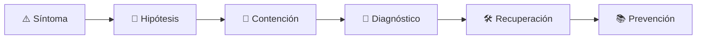

# 🔌 Embedded & IoT Engineer
<!-- role-visual:start -->

**La guía conecta trabajo real, decisiones, clases concretas y evidencia defendible.**

<!-- role-visual:end -->

> Integra firmware, hardware, conectividad y operación de dispositivos dentro de
> presupuestos explícitos de tiempo, memoria, energía y seguridad.
>
> **Entrada habitual:** semi-senior · **Foco:** firmware, RTOS, telemetría y OTA
> · **Evidencia central:** dispositivo o simulación con deadlines y recuperación medidos

## 🧭 Qué es y por qué importa

Embedded engineering trabaja donde el software toca el mundo físico. Un bloqueo puede
agotar batería, perder telemetría o afectar un proceso real. IoT añade flotas, identidad,
redes inestables y actualizaciones remotas que deben fallar de forma segura.

## 🗓️ Un día en el puesto

- leer una hoja de datos y verificar una interfaz hardware/software;
- medir latencia, jitter, memoria o consumo;
- depurar una carrera, interrupción o watchdog;
- revisar protocolo, identidad y amenaza física;
- desplegar OTA por etapas y confirmar recuperación.

## ✅ Responsabilidades y límites

- Responde por comportamiento temporal, recursos y actualización del dispositivo.
- Distingue hard real-time de baja latencia deseable.
- No oculta incertidumbre física detrás de una abstracción de software.
- No ejecuta pruebas peligrosas en hardware sin entorno y procedimiento seguros.

## 🧠 Qué necesitas saber

Arquitectura de computadores, C/C++ o Rust según contexto, memoria, interrupciones,
RTOS, buses y protocolos; energía, telemetría, criptografía aplicada, secure boot,
OTA, edge, safety y diagnóstico con instrumentación.

## 📚 Tu ruta en el programa

1. Partes 00–09, con énfasis en 01–04 y 07–08.
2. [Parte 22 — Embedded, IoT y tiempo real](../classes/part-22-embedded-iot-y-tiempo-real/README.md).
3. Partes 23, 27–28 para dominio crítico, mensajería y concurrencia.
4. Partes 30–35 para pruebas, resiliencia, seguridad, entrega y telemetría.
5. Parte 36 para EOL y retirada de flotas.

<!-- role-depth:start -->
## 🗺️ Sistema profesional del rol

El gráfico no representa una cascada rígida. Muestra el bucle profesional que este rol
debe poder recorrer: comprender el contexto, tomar una decisión, intervenir, observar
el efecto y convertir lo aprendido en una mejora. En **🔌 Embedded & IoT Engineer**, saltar directamente a
la herramienta suele ocultar el problema, mientras que terminar sin evidencia deja la
decisión en una opinión. La misión concreta es: Integra firmware, hardware, conectividad y operación de dispositivos dentro de presupuestos explícitos de tiempo, memoria, energía y seguridad. Cada transición
debe conservar supuestos, responsables y una forma de volver atrás.

<table>
<tr>
<td valign="top" width="50%">

### 🎯 Responde por

- decisiones propias de la familia **Sistemas físicos**;
- el resultado observable, no sólo la actividad ejecutada;
- límites, riesgos, operación y deuda residual de su intervención;
- evidencia que otra persona pueda revisar o reproducir.

</td>
<td valign="top" width="50%">

### 🤝 Coordina con

- [⚙️ Systems Programmer](systems-programmer.md); [🛡️ Safety-Critical Software Engineer](safety-critical-software-engineer.md); [☁️ Cloud Engineer](cloud-engineer.md);
- producto y personas usuarias cuando cambia una tarea o outcome;
- seguridad, privacidad, accesibilidad y operación según el riesgo;
- quienes mantendrán el sistema después de la entrega.

</td>
</tr>
</table>

El título no concede autoridad automática. El alcance real depende del equipo, la
industria y la criticidad. Esta guía describe un recorrido desde **semi-senior → principal**, pero una
vacante se evalúa por las decisiones que permite tomar, los sistemas que pone bajo
responsabilidad y la evidencia exigida, no por el nombre del cargo.

## 🧱 Partes y clases asociadas

La ruta distingue **parte** —unidad curricular con una capacidad acumulativa— de
**clase asociada** —punto concreto donde se estudia un mecanismo o una decisión. Las
clases siguientes forman el núcleo; no eliminan los prerrequisitos indicados en sus
propias páginas ni convierten en opcional la base común.

| Orden | Parte del programa | Clases clave | Por qué entra en esta ruta | Evidencia de transferencia |
| ---: | --- | --- | --- | --- |
| 1 | [Parte 01 · Computadores y representación de información](../classes/part-01-computadores-y-representacion-de-informacion/README.md) | [SE-017 · CPU, instrucciones, registros y ciclos de ejecución](../classes/part-01-computadores-y-representacion-de-informacion/se-017-cpu-instrucciones-registros-y-ciclos-de-ejecucion/README.md) [SE-018 · Memoria, cachés, almacenamiento y jerarquías](../classes/part-01-computadores-y-representacion-de-informacion/se-018-memoria-caches-almacenamiento-y-jerarquias/README.md) [SE-022 · Rendimiento, consumo energético y límites físicos](../classes/part-01-computadores-y-representacion-de-informacion/se-022-rendimiento-consumo-energetico-y-limites-fisicos/README.md) | Profundiza **máquina, memoria, representación y coste físico** desde la responsabilidad del rol. | Experimento reproducible de recursos. |
| 2 | [Parte 22 · Embedded, IoT y tiempo real](../classes/part-22-embedded-iot-y-tiempo-real/README.md) | [SE-267 · Restricciones de memoria, energía y cómputo](../classes/part-22-embedded-iot-y-tiempo-real/se-267-restricciones-de-memoria-energia-y-computo/README.md) [SE-268 · Sistemas de tiempo real y deadlines](../classes/part-22-embedded-iot-y-tiempo-real/se-268-sistemas-de-tiempo-real-y-deadlines/README.md) [SE-271 · Actualizaciones OTA y recuperación](../classes/part-22-embedded-iot-y-tiempo-real/se-271-actualizaciones-ota-y-recuperacion/README.md) | Profundiza **firmware, tiempo real, OTA y dispositivo** desde la responsabilidad del rol. | Sistema simulado recuperable. |
| 3 | [Parte 31 · Calidad, rendimiento y resiliencia](../classes/part-31-calidad-rendimiento-y-resiliencia/README.md) | [SE-376 · Latencia, throughput, saturación y capacidad](../classes/part-31-calidad-rendimiento-y-resiliencia/se-376-latencia-throughput-saturacion-y-capacidad/README.md) [SE-379 · Circuit breakers, bulkheads y degradación](../classes/part-31-calidad-rendimiento-y-resiliencia/se-379-circuit-breakers-bulkheads-y-degradacion/README.md) [SE-380 · Disponibilidad, durabilidad y recuperación](../classes/part-31-calidad-rendimiento-y-resiliencia/se-380-disponibilidad-durabilidad-y-recuperacion/README.md) | Profundiza **calidad, rendimiento y resiliencia** desde la responsabilidad del rol. | Informe medido y game day. |
| 4 | [Parte 32 · Seguridad, privacidad y cumplimiento](../classes/part-32-seguridad-privacidad-y-cumplimiento/README.md) | [SE-385 · Principios de seguridad y modelos de amenaza](../classes/part-32-seguridad-privacidad-y-cumplimiento/se-385-principios-de-seguridad-y-modelos-de-amenaza/README.md) [SE-389 · Criptografía aplicada y gestión de claves](../classes/part-32-seguridad-privacidad-y-cumplimiento/se-389-criptografia-aplicada-y-gestion-de-claves/README.md) [SE-393 · Vulnerabilidades, divulgación y respuesta](../classes/part-32-seguridad-privacidad-y-cumplimiento/se-393-vulnerabilidades-divulgacion-y-respuesta/README.md) | Profundiza **seguridad, privacidad y cumplimiento** desde la responsabilidad del rol. | Controles con pruebas y evidencia. |

**Cómo recorrerla.** Empieza por [SE-017](../classes/part-01-computadores-y-representacion-de-informacion/se-017-cpu-instrucciones-registros-y-ciclos-de-ejecucion/README.md) para fijar el
primer mecanismo, usa [SE-376](../classes/part-31-calidad-rendimiento-y-resiliencia/se-376-latencia-throughput-saturacion-y-capacidad/README.md) para integrar el
centro de la especialidad y llega a [SE-393](../classes/part-32-seguridad-privacidad-y-cumplimiento/se-393-vulnerabilidades-divulgacion-y-respuesta/README.md) cuando ya
puedas explicar cómo detectar y recuperar un fallo. Una clase se considera estudiada
sólo cuando su concepto cambia una decisión y deja evidencia; abrir todos los enlaces
no constituye competencia.

> [!IMPORTANT]
> El mapa expresa el currículo previsto. Las Partes 00–01 están desarrolladas; las
> posteriores conservan borradores o estructuras que deben superar revisión
> cualitativa. Esta ruta no declara terminadas esas clases ni reemplaza el
> [roadmap](../ROADMAP.md).

## ⚖️ Decisiones y trade-offs que debes defender

| Decisión recurrente | Criterio profesional | Evidencia mínima antes de defenderla |
| --- | --- | --- |
| **Procesar en dispositivo o edge** | Comparar latencia energía privacidad y conectividad. | Presupuesto por unidad funcional. |
| **Seguridad o disponibilidad física** | Diseñar modos degradados sin exponer control peligroso. | Hazard analysis y pruebas de transición. |
| **OTA rápida o conservadora** | Equilibrar parcheo flota ancho de banda y brick risk. | Actualización A/B y recuperación ante corte. |

La calidad de una decisión no se juzga porque coincida con una herramienta popular.
Debe hacer explícitos contexto, restricciones, alternativas descartadas, coste de
cambio y condición de revisión. En especial, **Procesar en dispositivo o edge**, **Seguridad o disponibilidad física**
y **OTA rápida o conservadora** cambian de respuesta cuando cambia el riesgo. Una solución
correcta en un prototipo puede ser irresponsable en un sistema regulado; una solución
robusta para un servicio crítico puede ser desperdicio en una herramienta interna.

## 🚨 Escenario profesional: Una actualización OTA interrumpida deja dispositivos en boot loop

**Síntoma.** Se pierde energía después de escribir estado parcial. La respuesta madura evita convertir la primera
correlación en causa y conserva evidencia antes de modificar el sistema.

1. **Detectar y delimitar:** identifica quién o qué está afectado, desde cuándo y qué
   cambió. Conserva timestamps, versiones, entradas y señales suficientes para no
   destruir la escena al intentar arreglarla.
2. **Investigar:** Examinar particiones bootloader firma versión y watchdog. Formula al menos dos hipótesis rivales
   y define qué observación refutaría cada una.
3. **Contener:** reduce blast radius y daño sin prometer una corrección todavía. La
   contención debe ser reversible, visible y compatible con las obligaciones del
   sistema.
4. **Recuperar:** Arrancar imagen conocida registrar causa y reintentar de forma acotada. Verifica la tarea completa, no sólo que un
   proceso volvió a estar verde.
5. **Aprender:** añade una regresión, señal o control que detecte la misma clase de
   fallo. Documenta qué deuda permanece y quién revisará la acción.

El escenario evalúa método además de resultado. Una recuperación rápida que borra la
causa, oculta pérdida de datos o deja al equipo sin mecanismo preventivo no demuestra
dominio del rol.

## 📊 Señales útiles y límites de las métricas

| Señal | Qué ayuda a observar | Trampa que debe evitarse |
| --- | --- | --- |
| **Deadlines incumplidos** | Respuestas fuera de ventana temporal. | Promediar y ocultar el peor caso. |
| **Energía por ciclo** | Autonomía asociada a una función útil. | Medir sólo CPU. |
| **Flota recuperable** | Dispositivos que vuelven a versión sana tras fallo OTA. | Confundir entrega con activación. |

Ninguna señal debe convertirse en ranking individual. Combina tendencia cuantitativa,
muestreo de casos, feedback cualitativo y contexto de carga. Declara ventana,
denominador, fuente, exclusiones y quién puede actuar sobre el resultado. Si una
métrica mejora mientras el outcome o el riesgo empeoran, el sistema está optimizando
el indicador y no el trabajo.

## 🧩 Proyecto integrador del rol: Dispositivo simulado operable

**Propósito:** cumplir un deadline comunicar telemetría y sobrevivir una actualización fallida. El resultado esperado es **firmware o simulador presupuesto temporal amenaza OTA A/B métricas y procedimiento de recuperación**.

Entrega un expediente revisable con estas piezas:

1. **Contexto y alcance:** usuario, sistema, restricción, supuestos, fuera de alcance y
   criterio de no éxito.
2. **Decisión:** al menos dos alternativas reales, trade-offs, coste de reversión y un
   ADR o memo que indique cuándo revisar la elección.
3. **Artefacto principal:** una implementación, modelo, flujo o política coherente con
   las clases núcleo; no una captura aislada ni una presentación sin mecanismo.
4. **Fallo controlado:** introduce una condición adversa relacionada con el escenario
   anterior y conserva el resultado observado, sin inventar una ejecución.
5. **Verificación:** prueba, rúbrica, revisión o medición que pueda fallar y que conecte
   directamente con el resultado profesional.
6. **Operación y salida:** telemetría, recuperación, mantenimiento, deprecación o retiro
   según corresponda; incluye límites y deuda residual.

**Criterio de aceptación:** otra persona puede reconstruir el razonamiento, reproducir
la comprobación y distinguir claramente qué quedó demostrado de lo que sólo se propone.
El proyecto no se aprueba por cantidad de archivos ni por utilizar una marca concreta.

## 📈 Dominio esperado por alcance

| Alcance | Qué resuelve | Qué evidencia su autonomía |
| --- | --- | --- |
| **Inicial** | ejecuta una tarea acotada con criterios y acompañamiento | reproduce el caso, pregunta por supuestos y entrega evidencia legible |
| **Intermedio** | decide dentro de un componente o flujo conocido | compara alternativas, prueba fallos previsibles y coordina dependencias |
| **Senior** | conduce problemas ambiguos que cruzan sistemas o equipos | hace explícito el riesgo, diseña recuperación y mejora el mecanismo de trabajo |
| **Staff / Lead** | cambia capacidades compartidas y decisiones de largo plazo | multiplica criterio, define guardrails, mide adopción y conserva opciones futuras |

Progresar no significa alejarse de la práctica. Significa aumentar ambigüedad, horizonte,
blast radius y responsabilidad por consecuencias. La persona senior todavía debe poder
explicar el mecanismo; la persona Staff además crea condiciones para que otros lo
operen sin depender de ella.

## 🗓️ Plan de práctica 30 · 60 · 90 días

- **Días 1–30 — comprender y reproducir.** Estudia las primeras clases de cada parte,
  reproduce un caso pequeño y escribe un mapa de responsabilidades. El entregable es
  una baseline con preguntas abiertas, no una transformación prematura.
- **Días 31–60 — intervenir y fallar con control.** Construye el artefacto central,
  introduce el escenario de fallo y mide el comportamiento. Revisa el trabajo con una
  persona de una ruta vecina para descubrir supuestos de frontera.
- **Días 61–90 — operar y transferir.** Ejecuta recuperación, corrige la causa, publica
  runbook o guía de uso y presenta la decisión con trade-offs. Termina con una
  retrospectiva que separe resultado, evidencia, límites y siguiente inversión.

Este plan es una secuencia de práctica, no una promesa de empleabilidad en noventa días.
La experiencia previa, el dominio y el acceso a sistemas reales cambian el tiempo
necesario.

## 🎤 Preguntas para revisión o entrevista

1. ¿En qué contexto elegirías **Procesar en dispositivo o edge** y qué evidencia te haría cambiar?
2. ¿Cómo distinguirías síntoma, causa y daño en el escenario **Una actualización OTA interrumpida deja dispositivos en boot loop**?
3. ¿Qué clase asociada usarías para diseñar el mecanismo y cuál para verificarlo?
4. ¿Qué parte de **Dispositivo simulado operable** no automatizarías todavía y por qué?
5. ¿Qué métrica podría mejorar mientras el sistema empeora y qué guardrail añadirías?
6. ¿Dónde termina la autoridad de este rol y cuándo debe escalar o pedir revisión?

Una respuesta fuerte usa un caso, reconoce incertidumbre y propone una comprobación.
Nombrar una herramienta sin explicar mecanismo, fallo y límite no demuestra la
competencia.

## 🔗 Fuentes primarias y oficiales

- [FreeRTOS Documentation](https://www.freertos.org/Documentation/RTOS_book.html) — **FreeRTOS project**. Se usa como referencia primaria u oficial; la guía no sustituye la fuente.
- [Zephyr Project Documentation](https://docs.zephyrproject.org/latest/) — **Zephyr Project**. Se usa como referencia primaria u oficial; la guía no sustituye la fuente.
- [Secure Software Development Framework SP 800-218](https://csrc.nist.gov/pubs/sp/800/218/final) — **NIST**. Se usa como referencia primaria u oficial; la guía no sustituye la fuente.

Las fuentes orientan principios, vocabulario y prácticas; no convierten la guía en una
certificación ni sustituyen la documentación específica del sistema, la jurisdicción
o la tecnología utilizada.
<!-- role-depth:end -->

## 🧪 Evidencia de portafolio

- simulación o placa con presupuesto temporal y energético;
- prueba de watchdog, brownout y pérdida de red;
- modelo de amenazas físicas y remotas;
- OTA firmada con partición de recuperación y plan de flota.

## 📈 Progresión

Firmware Junior → Embedded Engineer → Senior → Systems/Platform Lead o Architect.

## ⚠️ Mitos frecuentes

- “Tiempo real significa rápido.” Significa cumplir límites temporales definidos.
- “El dispositivo está aislado.” Fabricación, debug y OTA forman una cadena de confianza.
- “Una vez vendido, termina el soporte.” Vulnerabilidades y certificados siguen venciendo.

## 🚀 Siguientes pasos

1. Define presupuesto de memoria, tiempo y energía antes de implementar.
2. Inyecta reinicio y pérdida de conectividad en una simulación segura.
3. Documenta actualización, recuperación y retiro del dispositivo.

---

[⬅️ Volver a las rutas](README.md) · [🏠 Inicio del programa](../README.md)
