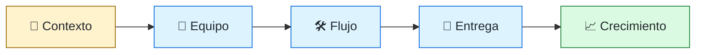
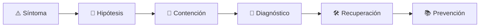

# 👥 Engineering Manager
<!-- role-visual:start -->

**La guía conecta trabajo real, decisiones, clases concretas y evidencia defendible.**

<!-- role-visual:end -->

> Construye el sistema de trabajo donde un equipo puede entregar, aprender y crecer;
> equilibra personas, producto, tecnología y sostenibilidad operacional.
>
> **Entrada habitual:** senior con experiencia de liderazgo · **Foco:** equipo y entrega
> · **Evidencia central:** resultados sostenibles sin dependencia heroica

## 🧭 Qué es y por qué importa

Engineering Manager es responsable del entorno en el que ocurre la ingeniería:
claridad de objetivos, composición del equipo, feedback, desarrollo, coordinación y
remoción de impedimentos. Mantiene criterio técnico suficiente para evaluar riesgo,
pero no compite con el equipo por ser quien implementa más.

## 🗓️ Un día en el puesto

- conversar en uno a uno y dar feedback específico;
- alinear prioridades con producto y stakeholders;
- revisar riesgos de entrega, calidad o guardia;
- contratar, hacer onboarding o planificar crecimiento;
- resolver dependencias y conflictos entre equipos;
- mejorar el sistema de trabajo a partir de datos y conversaciones.

## ✅ Responsabilidades y límites

- Responde por salud, claridad, capacidad y resultados del equipo.
- Protege tiempo para calidad, aprendizaje y operación.
- No reemplaza al Tech Lead ni toma todas las decisiones técnicas.
- No usa métricas individuales de commits o tickets como productividad.
- No confunde estar ocupado con entregar outcomes.

## 🧠 Qué necesitas saber

- ciclo de vida, calidad, operación y deuda técnica;
- planificación, flujo, forecasting y gestión de riesgo;
- feedback, coaching, desempeño y desarrollo profesional;
- Team Topologies, Conway, ownership y carga cognitiva;
- DORA/SPACE y riesgos de gaming;
- incident leadership, comunicación y negociación.

## 📚 Tu ruta en el programa

1. Parte 00 para ética, roles y responsabilidad.
2. Partes 10–17 para producto, economía, requisitos, planificación y colaboración.
3. Parte 31 para calidad y resiliencia; Parte 35 para incidentes.
4. [Parte 37 — Gestión, liderazgo y práctica profesional](../classes/part-37-gestion-liderazgo-y-practica-profesional/README.md).
5. Partes 38–39 para gobernar adopción responsable de IA.

<!-- role-depth:start -->
## 🗺️ Sistema profesional del rol

El gráfico no representa una cascada rígida. Muestra el bucle profesional que este rol
debe poder recorrer: comprender el contexto, tomar una decisión, intervenir, observar
el efecto y convertir lo aprendido en una mejora. En **👥 Engineering Manager**, saltar directamente a
la herramienta suele ocultar el problema, mientras que terminar sin evidencia deja la
decisión en una opinión. La misión concreta es: Construye el sistema de trabajo donde un equipo puede entregar, aprender y crecer; equilibra personas, producto, tecnología y sostenibilidad operacional. Cada transición
debe conservar supuestos, responsables y una forma de volver atrás.

<table>
<tr>
<td valign="top" width="50%">

### 🎯 Responde por

- decisiones propias de la familia **Liderazgo de personas**;
- el resultado observable, no sólo la actividad ejecutada;
- límites, riesgos, operación y deuda residual de su intervención;
- evidencia que otra persona pueda revisar o reproducir.

</td>
<td valign="top" width="50%">

### 🤝 Coordina con

- [🧭 Staff / Principal Engineer y Technical Lead](technical-leadership.md); [🧰 Developer Experience Engineer](developer-experience-engineer.md); [🧭 CTO / Dirección de Tecnología](cto.md);
- producto y personas usuarias cuando cambia una tarea o outcome;
- seguridad, privacidad, accesibilidad y operación según el riesgo;
- quienes mantendrán el sistema después de la entrega.

</td>
</tr>
</table>

El título no concede autoridad automática. El alcance real depende del equipo, la
industria y la criticidad. Esta guía describe un recorrido desde **senior → dirección**, pero una
vacante se evalúa por las decisiones que permite tomar, los sistemas que pone bajo
responsabilidad y la evidencia exigida, no por el nombre del cargo.

## 🧱 Partes y clases asociadas

La ruta distingue **parte** —unidad curricular con una capacidad acumulativa— de
**clase asociada** —punto concreto donde se estudia un mecanismo o una decisión. Las
clases siguientes forman el núcleo; no eliminan los prerrequisitos indicados en sus
propias páginas ni convierten en opcional la base común.

| Orden | Parte del programa | Clases clave | Por qué entra en esta ruta | Evidencia de transferencia |
| ---: | --- | --- | --- | --- |
| 1 | [Parte 15 · Procesos, planificación y estimación](../classes/part-15-procesos-planificacion-y-estimacion/README.md) | [SE-184 · Lean, teoría de colas y límites de trabajo](../classes/part-15-procesos-planificacion-y-estimacion/se-184-lean-teoria-de-colas-y-limites-de-trabajo/README.md) [SE-189 · Métricas de flujo, calidad y resultados](../classes/part-15-procesos-planificacion-y-estimacion/se-189-metricas-de-flujo-calidad-y-resultados/README.md) [SE-190 · Retrospectivas y mejora del sistema de trabajo](../classes/part-15-procesos-planificacion-y-estimacion/se-190-retrospectivas-y-mejora-del-sistema-de-trabajo/README.md) | Profundiza **flujo, estimación y planificación incierta** desde la responsabilidad del rol. | Plan probabilístico adaptable. |
| 2 | [Parte 31 · Calidad, rendimiento y resiliencia](../classes/part-31-calidad-rendimiento-y-resiliencia/README.md) | [SE-373 · Modelos de calidad y atributos medibles](../classes/part-31-calidad-rendimiento-y-resiliencia/se-373-modelos-de-calidad-y-atributos-medibles/README.md) [SE-379 · Circuit breakers, bulkheads y degradación](../classes/part-31-calidad-rendimiento-y-resiliencia/se-379-circuit-breakers-bulkheads-y-degradacion/README.md) [SE-380 · Disponibilidad, durabilidad y recuperación](../classes/part-31-calidad-rendimiento-y-resiliencia/se-380-disponibilidad-durabilidad-y-recuperacion/README.md) | Profundiza **calidad, rendimiento y resiliencia** desde la responsabilidad del rol. | Informe medido y game day. |
| 3 | [Parte 35 · Observabilidad, SRE e incidentes](../classes/part-35-observabilidad-sre-e-incidentes/README.md) | [SE-428 · Gestión de incidentes y comunicación](../classes/part-35-observabilidad-sre-e-incidentes/se-428-gestion-de-incidentes-y-comunicacion/README.md) [SE-429 · Postmortems sin culpa y aprendizaje](../classes/part-35-observabilidad-sre-e-incidentes/se-429-postmortems-sin-culpa-y-aprendizaje/README.md) [SE-430 · Continuidad, disaster recovery y ejercicios](../classes/part-35-observabilidad-sre-e-incidentes/se-430-continuidad-disaster-recovery-y-ejercicios/README.md) | Profundiza **observabilidad, SRE e incidentes** desde la responsabilidad del rol. | Incidente diagnosticado y recuperado. |
| 4 | [Parte 37 · Gestión, liderazgo y práctica profesional](../classes/part-37-gestion-liderazgo-y-practica-profesional/README.md) | [SE-446 · Diseño de equipos y ownership](../classes/part-37-gestion-liderazgo-y-practica-profesional/se-446-diseno-de-equipos-y-ownership/README.md) [SE-447 · Comunicación, facilitación y conflicto](../classes/part-37-gestion-liderazgo-y-practica-profesional/se-447-comunicacion-facilitacion-y-conflicto/README.md) [SE-448 · Mentoría, feedback y crecimiento](../classes/part-37-gestion-liderazgo-y-practica-profesional/se-448-mentoria-feedback-y-crecimiento/README.md) | Profundiza **liderazgo, organización y decisiones** desde la responsabilidad del rol. | Propuesta defendida ante conflicto. |

**Cómo recorrerla.** Empieza por [SE-184](../classes/part-15-procesos-planificacion-y-estimacion/se-184-lean-teoria-de-colas-y-limites-de-trabajo/README.md) para fijar el
primer mecanismo, usa [SE-428](../classes/part-35-observabilidad-sre-e-incidentes/se-428-gestion-de-incidentes-y-comunicacion/README.md) para integrar el
centro de la especialidad y llega a [SE-448](../classes/part-37-gestion-liderazgo-y-practica-profesional/se-448-mentoria-feedback-y-crecimiento/README.md) cuando ya
puedas explicar cómo detectar y recuperar un fallo. Una clase se considera estudiada
sólo cuando su concepto cambia una decisión y deja evidencia; abrir todos los enlaces
no constituye competencia.

> [!IMPORTANT]
> El mapa expresa el currículo previsto. La Parte 00 está desarrollada; las partes
> posteriores conservan borradores o estructuras que deben superar revisión
> cualitativa. Esta ruta no declara terminadas esas clases ni reemplaza el
> [roadmap](../ROADMAP.md).

## ⚖️ Decisiones y trade-offs que debes defender

| Decisión recurrente | Criterio profesional | Evidencia mínima antes de defenderla |
| --- | --- | --- |
| **Compromiso o forecast** | Comunicar rango riesgo y capacidad sin convertir incertidumbre en promesa. | Revisión de supuestos y flujo. |
| **Autonomía o coordinación** | Dar ownership claro con mecanismos de alineación. | Dependencias y decisiones escaladas. |
| **Rendimiento o sostenibilidad** | Proteger ritmo calidad guardia y aprendizaje. | Tendencias de salud y outcomes. |

La calidad de una decisión no se juzga porque coincida con una herramienta popular.
Debe hacer explícitos contexto, restricciones, alternativas descartadas, coste de
cambio y condición de revisión. En especial, **Compromiso o forecast**, **Autonomía o coordinación**
y **Rendimiento o sostenibilidad** cambian de respuesta cuando cambia el riesgo. Una solución
correcta en un prototipo puede ser irresponsable en un sistema regulado; una solución
robusta para un servicio crítico puede ser desperdicio en una herramienta interna.

## 🚨 Escenario profesional: Equipo cumple fechas a costa de incidentes y desgaste

**Síntoma.** Los incentivos premian output y ocultan calidad capacidad y toil. La respuesta madura evita convertir la primera
correlación en causa y conserva evidencia antes de modificar el sistema.

1. **Detectar y delimitar:** identifica quién o qué está afectado, desde cuándo y qué
   cambió. Conserva timestamps, versiones, entradas y señales suficientes para no
   destruir la escena al intentar arreglarla.
2. **Investigar:** Revisar demanda WIP ownership guardia deuda feedback y seguridad psicológica. Formula al menos dos hipótesis rivales
   y define qué observación refutaría cada una.
3. **Contener:** reduce blast radius y daño sin prometer una corrección todavía. La
   contención debe ser reversible, visible y compatible con las obligaciones del
   sistema.
4. **Recuperar:** Reducir carga renegociar compromiso reparar sistema y aprender sin culpabilizar. Verifica la tarea completa, no sólo que un
   proceso volvió a estar verde.
5. **Aprender:** añade una regresión, señal o control que detecte la misma clase de
   fallo. Documenta qué deuda permanece y quién revisará la acción.

El escenario evalúa método además de resultado. Una recuperación rápida que borra la
causa, oculta pérdida de datos o deja al equipo sin mecanismo preventivo no demuestra
dominio del rol.

## 📊 Señales útiles y límites de las métricas

| Señal | Qué ayuda a observar | Trampa que debe evitarse |
| --- | --- | --- |
| **Throughput y cycle time** | Flujo del sistema no productividad individual. | Rankear personas. |
| **Carga de guardia** | Impacto operativo y distribución justa. | Normalizar heroísmo. |
| **Crecimiento y movilidad** | Capacidad asumida con feedback y oportunidades. | Contar promociones como única señal. |

Ninguna señal debe convertirse en ranking individual. Combina tendencia cuantitativa,
muestreo de casos, feedback cualitativo y contexto de carga. Declara ventana,
denominador, fuente, exclusiones y quién puede actuar sobre el resultado. Si una
métrica mejora mientras el outcome o el riesgo empeoran, el sistema está optimizando
el indicador y no el trabajo.

## 🧩 Proyecto integrador del rol: Sistema de equipo sostenible

**Propósito:** mejorar un flujo real sin sacrificar calidad personas ni operación. El resultado esperado es **baseline de flujo mapa de carga acuerdos ownership plan de capacidad feedback y retrospectiva**.

Entrega un expediente revisable con estas piezas:

1. **Contexto y alcance:** usuario, sistema, restricción, supuestos, fuera de alcance y
   criterio de no éxito.
2. **Decisión:** al menos dos alternativas reales, trade-offs, coste de reversión y un
   ADR o memo que indique cuándo revisar la elección.
3. **Artefacto principal:** una implementación, modelo, flujo o política coherente con
   las clases núcleo; no una captura aislada ni una presentación sin mecanismo.
4. **Fallo controlado:** introduce una condición adversa relacionada con el escenario
   anterior y conserva el resultado observado, sin inventar una ejecución.
5. **Verificación:** prueba, rúbrica, revisión o medición que pueda fallar y que conecte
   directamente con el resultado profesional.
6. **Operación y salida:** telemetría, recuperación, mantenimiento, deprecación o retiro
   según corresponda; incluye límites y deuda residual.

**Criterio de aceptación:** otra persona puede reconstruir el razonamiento, reproducir
la comprobación y distinguir claramente qué quedó demostrado de lo que sólo se propone.
El proyecto no se aprueba por cantidad de archivos ni por utilizar una marca concreta.

## 📈 Dominio esperado por alcance

| Alcance | Qué resuelve | Qué evidencia su autonomía |
| --- | --- | --- |
| **Inicial** | ejecuta una tarea acotada con criterios y acompañamiento | reproduce el caso, pregunta por supuestos y entrega evidencia legible |
| **Intermedio** | decide dentro de un componente o flujo conocido | compara alternativas, prueba fallos previsibles y coordina dependencias |
| **Senior** | conduce problemas ambiguos que cruzan sistemas o equipos | hace explícito el riesgo, diseña recuperación y mejora el mecanismo de trabajo |
| **Staff / Lead** | cambia capacidades compartidas y decisiones de largo plazo | multiplica criterio, define guardrails, mide adopción y conserva opciones futuras |

Progresar no significa alejarse de la práctica. Significa aumentar ambigüedad, horizonte,
blast radius y responsabilidad por consecuencias. La persona senior todavía debe poder
explicar el mecanismo; la persona Staff además crea condiciones para que otros lo
operen sin depender de ella.

## 🗓️ Plan de práctica 30 · 60 · 90 días

- **Días 1–30 — comprender y reproducir.** Estudia las primeras clases de cada parte,
  reproduce un caso pequeño y escribe un mapa de responsabilidades. El entregable es
  una baseline con preguntas abiertas, no una transformación prematura.
- **Días 31–60 — intervenir y fallar con control.** Construye el artefacto central,
  introduce el escenario de fallo y mide el comportamiento. Revisa el trabajo con una
  persona de una ruta vecina para descubrir supuestos de frontera.
- **Días 61–90 — operar y transferir.** Ejecuta recuperación, corrige la causa, publica
  runbook o guía de uso y presenta la decisión con trade-offs. Termina con una
  retrospectiva que separe resultado, evidencia, límites y siguiente inversión.

Este plan es una secuencia de práctica, no una promesa de empleabilidad en noventa días.
La experiencia previa, el dominio y el acceso a sistemas reales cambian el tiempo
necesario.

## 🎤 Preguntas para revisión o entrevista

1. ¿En qué contexto elegirías **Compromiso o forecast** y qué evidencia te haría cambiar?
2. ¿Cómo distinguirías síntoma, causa y daño en el escenario **Equipo cumple fechas a costa de incidentes y desgaste**?
3. ¿Qué clase asociada usarías para diseñar el mecanismo y cuál para verificarlo?
4. ¿Qué parte de **Sistema de equipo sostenible** no automatizarías todavía y por qué?
5. ¿Qué métrica podría mejorar mientras el sistema empeora y qué guardrail añadirías?
6. ¿Dónde termina la autoridad de este rol y cuándo debe escalar o pedir revisión?

Una respuesta fuerte usa un caso, reconoce incertidumbre y propone una comprobación.
Nombrar una herramienta sin explicar mecanismo, fallo y límite no demuestra la
competencia.

## 🔗 Fuentes primarias y oficiales

- [The Kanban Guide](https://kanbanguides.org/english/) — **Kanban Guide authors**. Se usa como referencia primaria u oficial; la guía no sustituye la fuente.
- [DORA software delivery performance metrics](https://dora.dev/guides/dora-metrics/) — **Google Cloud**. Se usa como referencia primaria u oficial; la guía no sustituye la fuente.
- [ACM Code of Ethics and Professional Conduct](https://www.acm.org/code-of-ethics) — **ACM**. Se usa como referencia primaria u oficial; la guía no sustituye la fuente.

Las fuentes orientan principios, vocabulario y prácticas; no convierten la guía en una
certificación ni sustituyen la documentación específica del sistema, la jurisdicción
o la tecnología utilizada.
<!-- role-depth:end -->

## 🧪 Evidencia de portafolio

- plan de equipo conectado con outcomes y capacidad real;
- forecast probabilístico con riesgos y revisión periódica;
- marco de crecimiento y ejemplos de feedback;
- mejora de onboarding o reducción de carga cognitiva;
- retrospectiva de incidente con acciones sistémicas;
- decisión de priorización que explicita coste de oportunidad.

## 📈 Progresión

Senior/Tech Lead → Engineering Manager → Senior EM → Director → VP Engineering. Es
posible volver a la ruta individual contributor; no debe tratarse como degradación.
La gestión es otra disciplina, no el “siguiente nivel natural” de programación.

## ⚠️ Mitos frecuentes

- “Manager es el mejor programador ascendido.” El oficio cambia y requiere formación.
- “Más utilización produce más output.” Sin slack desaparecen aprendizaje y resiliencia.
- “Los números eliminan conversaciones difíciles.” Las métricas necesitan contexto.
- “Proteger al equipo es ocultarle problemas.” Es dar contexto sin ruido innecesario.

## 🚀 Siguientes pasos

1. Practica feedback basado en observación e impacto.
2. Construye un forecast con intervalos, no una promesa falsa.
3. Identifica una restricción del sistema de trabajo y mide su mejora.
4. Aclara la división de responsabilidades con producto y liderazgo técnico.

---

[⬅️ Volver a las rutas](README.md) · [🏠 Inicio del programa](../README.md)
