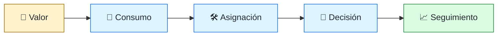
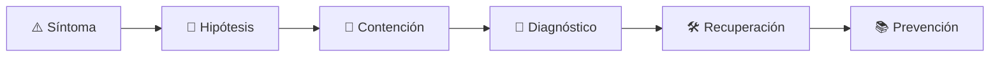

# 💸 FinOps Engineer
<!-- role-visual:start -->

**La guía conecta trabajo real, decisiones, clases concretas y evidencia defendible.**

<!-- role-visual:end -->

> Hace visible y accionable el coste tecnológico para que producto, ingeniería y
> finanzas decidan con contexto de valor, capacidad y riesgo.
>
> **Entrada habitual:** semi-senior/senior · **Foco:** coste unitario y accountability
> · **Evidencia central:** modelo de coste trazable que cambia una decisión técnica

## 🧭 Qué es y por qué importa

FinOps no es recortar facturas de forma aislada. Relaciona consumo cloud, ownership,
unidad de negocio y arquitectura para optimizar valor. Una reducción que destruye
resiliencia o desplaza trabajo humano puede aumentar el coste total.

## 🗓️ Un día en el puesto

- asignar consumo a producto, equipo y ambiente;
- investigar una anomalía o recurso ocioso;
- modelar coste por transacción, cliente o capacidad;
- evaluar compromiso, elasticidad y build-vs-buy;
- negociar una acción con ingeniería, finanzas y producto.

## ✅ Responsabilidades y límites

- Responde por datos, modelos, guardrails y facilitación de decisiones.
- Expone incertidumbre, amortización y coste de oportunidad.
- No optimiza sólo la factura del proveedor.
- No usa rankings de coste para castigar equipos sin contexto.

## 🧠 Qué necesitas saber

TCO, CAPEX/OPEX, facturación cloud, tags y allocation, costes fijos/variables,
unit economics, forecast, capacidad, compromiso, anomalías, arquitectura,
observabilidad, sostenibilidad y comunicación financiera.

## 📚 Tu ruta en el programa

1. Partes 00 y 10, seguidas por [Parte 11 — Economía, métricas y decisiones de producto](../classes/part-11-economia-metricas-y-decisiones-de-producto/README.md).
2. Partes 15 y 25–29 para estimación, arquitectura y cloud.
3. Partes 31, 34–35 para capacidad, plataforma y operación.
4. Partes 36–38 para vida útil, liderazgo y coste de IA.

<!-- role-depth:start -->
## 🗺️ Sistema profesional del rol

El gráfico no representa una cascada rígida. Muestra el bucle profesional que este rol
debe poder recorrer: comprender el contexto, tomar una decisión, intervenir, observar
el efecto y convertir lo aprendido en una mejora. En **💸 FinOps Engineer**, saltar directamente a
la herramienta suele ocultar el problema, mientras que terminar sin evidencia deja la
decisión en una opinión. La misión concreta es: Hace visible y accionable el coste tecnológico para que producto, ingeniería y finanzas decidan con contexto de valor, capacidad y riesgo. Cada transición
debe conservar supuestos, responsables y una forma de volver atrás.

<table>
<tr>
<td valign="top" width="50%">

### 🎯 Responde por

- decisiones propias de la familia **Economía**;
- el resultado observable, no sólo la actividad ejecutada;
- límites, riesgos, operación y deuda residual de su intervención;
- evidencia que otra persona pueda revisar o reproducir.

</td>
<td valign="top" width="50%">

### 🤝 Coordina con

- [☁️ Cloud Engineer](cloud-engineer.md); [🧭 Technical Product Engineer](technical-product-engineer.md); [🧭 CTO / Dirección de Tecnología](cto.md);
- producto y personas usuarias cuando cambia una tarea o outcome;
- seguridad, privacidad, accesibilidad y operación según el riesgo;
- quienes mantendrán el sistema después de la entrega.

</td>
</tr>
</table>

El título no concede autoridad automática. El alcance real depende del equipo, la
industria y la criticidad. Esta guía describe un recorrido desde **semi-senior → principal**, pero una
vacante se evalúa por las decisiones que permite tomar, los sistemas que pone bajo
responsabilidad y la evidencia exigida, no por el nombre del cargo.

## 🧱 Partes y clases asociadas

La ruta distingue **parte** —unidad curricular con una capacidad acumulativa— de
**clase asociada** —punto concreto donde se estudia un mecanismo o una decisión. Las
clases siguientes forman el núcleo; no eliminan los prerrequisitos indicados en sus
propias páginas ni convierten en opcional la base común.

| Orden | Parte del programa | Clases clave | Por qué entra en esta ruta | Evidencia de transferencia |
| ---: | --- | --- | --- | --- |
| 1 | [Parte 11 · Economía, métricas y decisiones de producto](../classes/part-11-economia-metricas-y-decisiones-de-producto/README.md) | [SE-134 · Costos de construcción, operación y oportunidad](../classes/part-11-economia-metricas-y-decisiones-de-producto/se-134-costos-de-construccion-operacion-y-oportunidad/README.md) [SE-140 · FinOps de producto y costo por resultado](../classes/part-11-economia-metricas-y-decisiones-de-producto/se-140-finops-de-producto-y-costo-por-resultado/README.md) [SE-144 · Proyecto: caso de viabilidad técnico-económica](../classes/part-11-economia-metricas-y-decisiones-de-producto/se-144-proyecto-caso-de-viabilidad-tecnico-economica/README.md) | Profundiza **economía, métricas y experimentación** desde la responsabilidad del rol. | Caso económico con sensibilidad. |
| 2 | [Parte 29 · Cloud, plataforma e infraestructura](../classes/part-29-cloud-plataforma-e-infraestructura/README.md) | [SE-349 · IaaS, PaaS, SaaS y responsabilidad compartida](../classes/part-29-cloud-plataforma-e-infraestructura/se-349-iaas-paas-saas-y-responsabilidad-compartida/README.md) [SE-356 · Escalado, capacidad y costos](../classes/part-29-cloud-plataforma-e-infraestructura/se-356-escalado-capacidad-y-costos/README.md) [SE-357 · Multi-cloud, híbrido y portabilidad real](../classes/part-29-cloud-plataforma-e-infraestructura/se-357-multi-cloud-hibrido-y-portabilidad-real/README.md) | Profundiza **cloud, infraestructura y plataformas** desde la responsabilidad del rol. | Entorno reproducible y eliminable. |
| 3 | [Parte 31 · Calidad, rendimiento y resiliencia](../classes/part-31-calidad-rendimiento-y-resiliencia/README.md) | [SE-376 · Latencia, throughput, saturación y capacidad](../classes/part-31-calidad-rendimiento-y-resiliencia/se-376-latencia-throughput-saturacion-y-capacidad/README.md) [SE-380 · Disponibilidad, durabilidad y recuperación](../classes/part-31-calidad-rendimiento-y-resiliencia/se-380-disponibilidad-durabilidad-y-recuperacion/README.md) [SE-384 · Proyecto: informe reproducible de calidad](../classes/part-31-calidad-rendimiento-y-resiliencia/se-384-proyecto-informe-reproducible-de-calidad/README.md) | Profundiza **calidad, rendimiento y resiliencia** desde la responsabilidad del rol. | Informe medido y game day. |
| 4 | [Parte 37 · Gestión, liderazgo y práctica profesional](../classes/part-37-gestion-liderazgo-y-practica-profesional/README.md) | [SE-450 · Gestión de riesgos y decisiones ejecutivas](../classes/part-37-gestion-liderazgo-y-practica-profesional/se-450-gestion-de-riesgos-y-decisiones-ejecutivas/README.md) [SE-451 · Compras, proveedores y evaluación técnica](../classes/part-37-gestion-liderazgo-y-practica-profesional/se-451-compras-proveedores-y-evaluacion-tecnica/README.md) [SE-453 · Economía del software y costo total](../classes/part-37-gestion-liderazgo-y-practica-profesional/se-453-economia-del-software-y-costo-total/README.md) | Profundiza **liderazgo, organización y decisiones** desde la responsabilidad del rol. | Propuesta defendida ante conflicto. |

**Cómo recorrerla.** Empieza por [SE-134](../classes/part-11-economia-metricas-y-decisiones-de-producto/se-134-costos-de-construccion-operacion-y-oportunidad/README.md) para fijar el
primer mecanismo, usa [SE-376](../classes/part-31-calidad-rendimiento-y-resiliencia/se-376-latencia-throughput-saturacion-y-capacidad/README.md) para integrar el
centro de la especialidad y llega a [SE-453](../classes/part-37-gestion-liderazgo-y-practica-profesional/se-453-economia-del-software-y-costo-total/README.md) cuando ya
puedas explicar cómo detectar y recuperar un fallo. Una clase se considera estudiada
sólo cuando su concepto cambia una decisión y deja evidencia; abrir todos los enlaces
no constituye competencia.

> [!IMPORTANT]
> El mapa expresa el currículo previsto. Las Partes 00–04 están desarrolladas; las
> posteriores conservan borradores o estructuras que deben superar revisión
> cualitativa. Esta ruta no declara terminadas esas clases ni reemplaza el
> [roadmap](../ROADMAP.md).

## ⚖️ Decisiones y trade-offs que debes defender

| Decisión recurrente | Criterio profesional | Evidencia mínima antes de defenderla |
| --- | --- | --- |
| **Ahorro o resiliencia** | Reducir desperdicio sin erosionar SLO ni opciones de recuperación. | Coste unitario más riesgo. |
| **Reservar o mantener elasticidad** | Comparar demanda incertidumbre compromiso y salida. | Escenarios de sensibilidad. |
| **Showback o chargeback** | Elegir incentivo que mejora decisiones sin castigar equipos. | Calidad de etiquetas y comportamiento observado. |

La calidad de una decisión no se juzga porque coincida con una herramienta popular.
Debe hacer explícitos contexto, restricciones, alternativas descartadas, coste de
cambio y condición de revisión. En especial, **Ahorro o resiliencia**, **Reservar o mantener elasticidad**
y **Showback o chargeback** cambian de respuesta cuando cambia el riesgo. Una solución
correcta en un prototipo puede ser irresponsable en un sistema regulado; una solución
robusta para un servicio crítico puede ser desperdicio en una herramienta interna.

## 🚨 Escenario profesional: Factura sube mientras el tráfico permanece estable

**Síntoma.** Un cambio de arquitectura altera transferencia retención o unidad de cómputo. La respuesta madura evita convertir la primera
correlación en causa y conserva evidencia antes de modificar el sistema.

1. **Detectar y delimitar:** identifica quién o qué está afectado, desde cuándo y qué
   cambió. Conserva timestamps, versiones, entradas y señales suficientes para no
   destruir la escena al intentar arreglarla.
2. **Investigar:** Descomponer precio uso volumen compromiso y resultado. Formula al menos dos hipótesis rivales
   y define qué observación refutaría cada una.
3. **Contener:** reduce blast radius y daño sin prometer una corrección todavía. La
   contención debe ser reversible, visible y compatible con las obligaciones del
   sistema.
4. **Recuperar:** Contener anomalía preservar servicio y presentar opciones con sensibilidad. Verifica la tarea completa, no sólo que un
   proceso volvió a estar verde.
5. **Aprender:** añade una regresión, señal o control que detecte la misma clase de
   fallo. Documenta qué deuda permanece y quién revisará la acción.

El escenario evalúa método además de resultado. Una recuperación rápida que borra la
causa, oculta pérdida de datos o deja al equipo sin mecanismo preventivo no demuestra
dominio del rol.

## 📊 Señales útiles y límites de las métricas

| Señal | Qué ayuda a observar | Trampa que debe evitarse |
| --- | --- | --- |
| **Costo por unidad útil** | Gasto asociado a transacción cliente o capacidad. | Usar coste total sin denominador. |
| **Cobertura de asignación** | Consumo atribuible a propietario y producto. | Forzar etiquetas sin corregir shared cost. |
| **Forecast y desviación** | Capacidad de anticipar demanda y explicar cambio. | Premiar exactitud falsa. |

Ninguna señal debe convertirse en ranking individual. Combina tendencia cuantitativa,
muestreo de casos, feedback cualitativo y contexto de carga. Declara ventana,
denominador, fuente, exclusiones y quién puede actuar sobre el resultado. Si una
métrica mejora mientras el outcome o el riesgo empeoran, el sistema está optimizando
el indicador y no el trabajo.

## 🧩 Proyecto integrador del rol: Caso económico operable

**Propósito:** vincular telemetría técnica con coste valor riesgo y decisión reversible. El resultado esperado es **modelo unitario dashboard forecast anomalías alternativas ADR y plan de seguimiento**.

Entrega un expediente revisable con estas piezas:

1. **Contexto y alcance:** usuario, sistema, restricción, supuestos, fuera de alcance y
   criterio de no éxito.
2. **Decisión:** al menos dos alternativas reales, trade-offs, coste de reversión y un
   ADR o memo que indique cuándo revisar la elección.
3. **Artefacto principal:** una implementación, modelo, flujo o política coherente con
   las clases núcleo; no una captura aislada ni una presentación sin mecanismo.
4. **Fallo controlado:** introduce una condición adversa relacionada con el escenario
   anterior y conserva el resultado observado, sin inventar una ejecución.
5. **Verificación:** prueba, rúbrica, revisión o medición que pueda fallar y que conecte
   directamente con el resultado profesional.
6. **Operación y salida:** telemetría, recuperación, mantenimiento, deprecación o retiro
   según corresponda; incluye límites y deuda residual.

**Criterio de aceptación:** otra persona puede reconstruir el razonamiento, reproducir
la comprobación y distinguir claramente qué quedó demostrado de lo que sólo se propone.
El proyecto no se aprueba por cantidad de archivos ni por utilizar una marca concreta.

## 📈 Dominio esperado por alcance

| Alcance | Qué resuelve | Qué evidencia su autonomía |
| --- | --- | --- |
| **Inicial** | ejecuta una tarea acotada con criterios y acompañamiento | reproduce el caso, pregunta por supuestos y entrega evidencia legible |
| **Intermedio** | decide dentro de un componente o flujo conocido | compara alternativas, prueba fallos previsibles y coordina dependencias |
| **Senior** | conduce problemas ambiguos que cruzan sistemas o equipos | hace explícito el riesgo, diseña recuperación y mejora el mecanismo de trabajo |
| **Staff / Lead** | cambia capacidades compartidas y decisiones de largo plazo | multiplica criterio, define guardrails, mide adopción y conserva opciones futuras |

Progresar no significa alejarse de la práctica. Significa aumentar ambigüedad, horizonte,
blast radius y responsabilidad por consecuencias. La persona senior todavía debe poder
explicar el mecanismo; la persona Staff además crea condiciones para que otros lo
operen sin depender de ella.

## 🗓️ Plan de práctica 30 · 60 · 90 días

- **Días 1–30 — comprender y reproducir.** Estudia las primeras clases de cada parte,
  reproduce un caso pequeño y escribe un mapa de responsabilidades. El entregable es
  una baseline con preguntas abiertas, no una transformación prematura.
- **Días 31–60 — intervenir y fallar con control.** Construye el artefacto central,
  introduce el escenario de fallo y mide el comportamiento. Revisa el trabajo con una
  persona de una ruta vecina para descubrir supuestos de frontera.
- **Días 61–90 — operar y transferir.** Ejecuta recuperación, corrige la causa, publica
  runbook o guía de uso y presenta la decisión con trade-offs. Termina con una
  retrospectiva que separe resultado, evidencia, límites y siguiente inversión.

Este plan es una secuencia de práctica, no una promesa de empleabilidad en noventa días.
La experiencia previa, el dominio y el acceso a sistemas reales cambian el tiempo
necesario.

## 🎤 Preguntas para revisión o entrevista

1. ¿En qué contexto elegirías **Ahorro o resiliencia** y qué evidencia te haría cambiar?
2. ¿Cómo distinguirías síntoma, causa y daño en el escenario **Factura sube mientras el tráfico permanece estable**?
3. ¿Qué clase asociada usarías para diseñar el mecanismo y cuál para verificarlo?
4. ¿Qué parte de **Caso económico operable** no automatizarías todavía y por qué?
5. ¿Qué métrica podría mejorar mientras el sistema empeora y qué guardrail añadirías?
6. ¿Dónde termina la autoridad de este rol y cuándo debe escalar o pedir revisión?

Una respuesta fuerte usa un caso, reconoce incertidumbre y propone una comprobación.
Nombrar una herramienta sin explicar mecanismo, fallo y límite no demuestra la
competencia.

## 🔗 Fuentes primarias y oficiales

- [Software Carbon Intensity Specification](https://greensoftware.foundation/standards/sci/) — **Green Software Foundation**. Se usa como referencia primaria u oficial; la guía no sustituye la fuente.
- [DORA software delivery performance metrics](https://dora.dev/guides/dora-metrics/) — **Google Cloud**. Se usa como referencia primaria u oficial; la guía no sustituye la fuente.
- [ISO/IEC 25010:2023](https://www.iso.org/standard/78176.html) — **ISO**. Se usa como referencia primaria u oficial; la guía no sustituye la fuente.

Las fuentes orientan principios, vocabulario y prácticas; no convierten la guía en una
certificación ni sustituyen la documentación específica del sistema, la jurisdicción
o la tecnología utilizada.
<!-- role-depth:end -->

## 🧪 Evidencia de portafolio

- modelo de allocation y coste unitario;
- forecast con escenarios y sensibilidad;
- caso build-vs-buy con TCO y riesgo;
- acción de optimización con impacto en coste, SLO y carbono.

## 📈 Progresión

Cloud/Finance/Data Analyst → FinOps Engineer → Senior FinOps Practitioner/Lead.

## ⚠️ Mitos frecuentes

- “FinOps es apagar recursos.” También decide arquitectura y demanda.
- “Reservar siempre ahorra.” Añade riesgo si la carga cambia.
- “Coste menor es mejor.” El objetivo es valor sostenible, no mínimo absoluto.

## 🚀 Siguientes pasos

1. Define una unidad de valor antes del dashboard.
2. Explica una factura desde recurso hasta producto.
3. Propón una acción y mide efectos en SLO y trabajo humano.

---

[⬅️ Volver a las rutas](README.md) · [🏠 Inicio del programa](../README.md)
