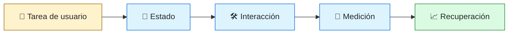
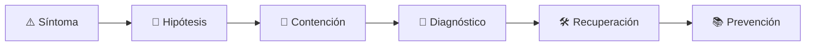

# 🎨 Frontend Engineer
<!-- role-visual:start -->

**La guía conecta trabajo real, decisiones, clases concretas y evidencia defendible.**

<!-- role-visual:end -->

> Construye interfaces accesibles, rápidas y resistentes que convierten estado,
> contenido y reglas en una experiencia comprensible para personas reales.
>
> **Entrada habitual:** junior/semi-senior · **Foco:** plataforma web, interacción,
> accesibilidad y rendimiento · **Evidencia central:** flujo usable medido y probado

## 🧭 Qué es y por qué importa

Frontend engineering vive en la frontera entre sistemas y personas. Integra la
plataforma web, diseño de interacción, datos remotos, seguridad del navegador,
accesibilidad y rendimiento. No es “hacer que se vea bonito”: decide cómo se
comprende, completa y recupera una tarea bajo dispositivos, redes y capacidades
distintas.

## 🗓️ Un día en el puesto

- traducir un flujo de usuario en estados visibles y criterios de aceptación;
- implementar componentes semánticos y navegación por teclado;
- integrar una API manejando carga, vacío, error, reintento y datos obsoletos;
- investigar una regresión de rendimiento o incompatibilidad;
- revisar diseño con UX, contenido, backend y accesibilidad;
- observar errores cliente y comportamiento después del despliegue.

## ✅ Responsabilidades y límites

- Responde por semántica, accesibilidad, rendimiento y claridad del flujo.
- Trata el navegador como plataforma distribuida y hostil, no como lienzo neutro.
- No reemplaza HTML semántico con componentes sin comportamiento accesible.
- No almacena secretos en el cliente ni confunde ocultar con autorizar.
- No convierte cada estado local en dependencia global.

## 🧠 Qué necesitas saber

- HTML, CSS, JavaScript/TypeScript y APIs del navegador;
- componentes, estado, formularios, routing, caché y sincronización;
- HTTP, seguridad web, contratos y manejo de errores;
- WCAG, teclado, lectores de pantalla, contraste y movimiento reducido;
- Unicode, localización, zonas horarias, pluralización y RTL;
- pruebas de componentes, integración, E2E, visuales y rendimiento.

## 📚 Tu ruta en el programa

1. Partes 00–09 para fundamentos, programación y depuración.
2. Partes 10, 12–14 para discovery, requisitos, UX, accesibilidad e i18n.
3. [Parte 19 — Web, frontend y aplicaciones progresivas](../classes/part-19-web-frontend-y-aplicaciones-progresivas/README.md).
4. Parte 20 para contratos con backend y Parte 24 para diseño/refactorización.
5. Partes 30–34 para pruebas, calidad, seguridad y entrega.
6. Partes 35 y 38 para observabilidad cliente e IA supervisada.

<!-- role-depth:start -->
## 🗺️ Sistema profesional del rol

El gráfico no representa una cascada rígida. Muestra el bucle profesional que este rol
debe poder recorrer: comprender el contexto, tomar una decisión, intervenir, observar
el efecto y convertir lo aprendido en una mejora. En **🎨 Frontend Engineer**, saltar directamente a
la herramienta suele ocultar el problema, mientras que terminar sin evidencia deja la
decisión en una opinión. La misión concreta es: Construye interfaces accesibles, rápidas y resistentes que convierten estado, contenido y reglas en una experiencia comprensible para personas reales. Cada transición
debe conservar supuestos, responsables y una forma de volver atrás.

<table>
<tr>
<td valign="top" width="50%">

### 🎯 Responde por

- decisiones propias de la familia **Producto digital**;
- el resultado observable, no sólo la actividad ejecutada;
- límites, riesgos, operación y deuda residual de su intervención;
- evidencia que otra persona pueda revisar o reproducir.

</td>
<td valign="top" width="50%">

### 🤝 Coordina con

- [♿ Accessibility Engineer](accessibility-engineer.md); [🧩 Full-stack Engineer](full-stack-engineer.md); [⏱️ Performance Engineer](performance-engineer.md);
- producto y personas usuarias cuando cambia una tarea o outcome;
- seguridad, privacidad, accesibilidad y operación según el riesgo;
- quienes mantendrán el sistema después de la entrega.

</td>
</tr>
</table>

El título no concede autoridad automática. El alcance real depende del equipo, la
industria y la criticidad. Esta guía describe un recorrido desde **junior → principal**, pero una
vacante se evalúa por las decisiones que permite tomar, los sistemas que pone bajo
responsabilidad y la evidencia exigida, no por el nombre del cargo.

## 🧱 Partes y clases asociadas

La ruta distingue **parte** —unidad curricular con una capacidad acumulativa— de
**clase asociada** —punto concreto donde se estudia un mecanismo o una decisión. Las
clases siguientes forman el núcleo; no eliminan los prerrequisitos indicados en sus
propias páginas ni convierten en opcional la base común.

| Orden | Parte del programa | Clases clave | Por qué entra en esta ruta | Evidencia de transferencia |
| ---: | --- | --- | --- | --- |
| 1 | [Parte 14 · Experiencia, accesibilidad e internacionalización](../classes/part-14-experiencia-accesibilidad-e-internacionalizacion/README.md) | [SE-172 · Estados vacíos, carga, error y recuperación](../classes/part-14-experiencia-accesibilidad-e-internacionalizacion/se-172-estados-vacios-carga-error-y-recuperacion/README.md) [SE-174 · Semántica, teclado, foco y tecnologías de asistencia](../classes/part-14-experiencia-accesibilidad-e-internacionalizacion/se-174-semantica-teclado-foco-y-tecnologias-de-asistencia/README.md) [SE-176 · Responsive, adaptativo y preferencias del usuario](../classes/part-14-experiencia-accesibilidad-e-internacionalizacion/se-176-responsive-adaptativo-y-preferencias-del-usuario/README.md) | Profundiza **experiencia, accesibilidad e internacionalización** desde la responsabilidad del rol. | Flujo inclusivo evaluado. |
| 2 | [Parte 19 · Web, frontend y aplicaciones progresivas](../classes/part-19-web-frontend-y-aplicaciones-progresivas/README.md) | [SE-229 · Plataforma web, HTML semántico y CSS](../classes/part-19-web-frontend-y-aplicaciones-progresivas/se-229-plataforma-web-html-semantico-y-css/README.md) [SE-232 · Estado, componentes y gestión de datos](../classes/part-19-web-frontend-y-aplicaciones-progresivas/se-232-estado-componentes-y-gestion-de-datos/README.md) [SE-235 · Rendimiento web y presupuestos](../classes/part-19-web-frontend-y-aplicaciones-progresivas/se-235-rendimiento-web-y-presupuestos/README.md) | Profundiza **plataforma web, estado y experiencia cliente** desde la responsabilidad del rol. | Aplicación accesible y observable. |
| 3 | [Parte 30 · Estrategia y técnicas de prueba](../classes/part-30-estrategia-y-tecnicas-de-prueba/README.md) | [SE-364 · End-to-end, aceptación y recorridos críticos](../classes/part-30-estrategia-y-tecnicas-de-prueba/se-364-end-to-end-aceptacion-y-recorridos-criticos/README.md) [SE-369 · Pruebas exploratorias y sesiones](../classes/part-30-estrategia-y-tecnicas-de-prueba/se-369-pruebas-exploratorias-y-sesiones/README.md) [SE-370 · Flakiness, diagnóstico y mantenimiento](../classes/part-30-estrategia-y-tecnicas-de-prueba/se-370-flakiness-diagnostico-y-mantenimiento/README.md) | Profundiza **estrategia de pruebas guiada por riesgo** desde la responsabilidad del rol. | Suite que demuestra detección de defectos. |
| 4 | [Parte 31 · Calidad, rendimiento y resiliencia](../classes/part-31-calidad-rendimiento-y-resiliencia/README.md) | [SE-373 · Modelos de calidad y atributos medibles](../classes/part-31-calidad-rendimiento-y-resiliencia/se-373-modelos-de-calidad-y-atributos-medibles/README.md) [SE-382 · Calidad de experiencia y presupuestos](../classes/part-31-calidad-rendimiento-y-resiliencia/se-382-calidad-de-experiencia-y-presupuestos/README.md) [SE-384 · Proyecto: informe reproducible de calidad](../classes/part-31-calidad-rendimiento-y-resiliencia/se-384-proyecto-informe-reproducible-de-calidad/README.md) | Profundiza **calidad, rendimiento y resiliencia** desde la responsabilidad del rol. | Informe medido y game day. |

**Cómo recorrerla.** Empieza por [SE-172](../classes/part-14-experiencia-accesibilidad-e-internacionalizacion/se-172-estados-vacios-carga-error-y-recuperacion/README.md) para fijar el
primer mecanismo, usa [SE-364](../classes/part-30-estrategia-y-tecnicas-de-prueba/se-364-end-to-end-aceptacion-y-recorridos-criticos/README.md) para integrar el
centro de la especialidad y llega a [SE-384](../classes/part-31-calidad-rendimiento-y-resiliencia/se-384-proyecto-informe-reproducible-de-calidad/README.md) cuando ya
puedas explicar cómo detectar y recuperar un fallo. Una clase se considera estudiada
sólo cuando su concepto cambia una decisión y deja evidencia; abrir todos los enlaces
no constituye competencia.

> [!IMPORTANT]
> El mapa expresa el currículo previsto. Las Partes 00–02 están desarrolladas; las
> posteriores conservan borradores o estructuras que deben superar revisión
> cualitativa. Esta ruta no declara terminadas esas clases ni reemplaza el
> [roadmap](../ROADMAP.md).

## ⚖️ Decisiones y trade-offs que debes defender

| Decisión recurrente | Criterio profesional | Evidencia mínima antes de defenderla |
| --- | --- | --- |
| **Renderizado cliente o servidor** | Comparar tiempo de interacción caché complejidad y SEO. | Presupuesto medido en una ruta real. |
| **Estado local o compartido** | Colocar cada dato donde tenga propietario y ciclo de vida claro. | Pruebas de transición y recuperación. |
| **Componente propio o dependencia** | Evaluar accesibilidad peso mantenimiento y contrato. | Auditoría de bundle y prueba con teclado. |

La calidad de una decisión no se juzga porque coincida con una herramienta popular.
Debe hacer explícitos contexto, restricciones, alternativas descartadas, coste de
cambio y condición de revisión. En especial, **Renderizado cliente o servidor**, **Estado local o compartido**
y **Componente propio o dependencia** cambian de respuesta cuando cambia el riesgo. Una solución
correcta en un prototipo puede ser irresponsable en un sistema regulado; una solución
robusta para un servicio crítico puede ser desperdicio en una herramienta interna.

## 🚨 Escenario profesional: Formulario pierde información al fallar la red

**Síntoma.** La petición expira y el estado visual diverge del servidor. La respuesta madura evita convertir la primera
correlación en causa y conserva evidencia antes de modificar el sistema.

1. **Detectar y delimitar:** identifica quién o qué está afectado, desde cuándo y qué
   cambió. Conserva timestamps, versiones, entradas y señales suficientes para no
   destruir la escena al intentar arreglarla.
2. **Investigar:** Reproducir navegación foco caché y reintento en una sesión. Formula al menos dos hipótesis rivales
   y define qué observación refutaría cada una.
3. **Contener:** reduce blast radius y daño sin prometer una corrección todavía. La
   contención debe ser reversible, visible y compatible con las obligaciones del
   sistema.
4. **Recuperar:** Preservar entrada explicar estado y verificar recuperación accesible. Verifica la tarea completa, no sólo que un
   proceso volvió a estar verde.
5. **Aprender:** añade una regresión, señal o control que detecte la misma clase de
   fallo. Documenta qué deuda permanece y quién revisará la acción.

El escenario evalúa método además de resultado. Una recuperación rápida que borra la
causa, oculta pérdida de datos o deja al equipo sin mecanismo preventivo no demuestra
dominio del rol.

## 📊 Señales útiles y límites de las métricas

| Señal | Qué ayuda a observar | Trampa que debe evitarse |
| --- | --- | --- |
| **Éxito de tarea** | Personas que completan el flujo sin asistencia. | Confundir clics con valor. |
| **Core Web Vitals por ruta** | Experiencia real de carga respuesta y estabilidad. | Optimizar laboratorio ignorando dispositivos. |
| **Errores recuperables** | Fallos que ofrecen salida y preservan trabajo. | Contar sólo excepciones JavaScript. |

Ninguna señal debe convertirse en ranking individual. Combina tendencia cuantitativa,
muestreo de casos, feedback cualitativo y contexto de carga. Declara ventana,
denominador, fuente, exclusiones y quién puede actuar sobre el resultado. Si una
métrica mejora mientras el outcome o el riesgo empeoran, el sistema está optimizando
el indicador y no el trabajo.

## 🧩 Proyecto integrador del rol: Flujo web inclusivo y resiliente

**Propósito:** construir una tarea completa que funcione con red degradada teclado y distintos tamaños. El resultado esperado es **aplicación presupuesto de rendimiento pruebas por capas auditoría accesible y telemetría cliente**.

Entrega un expediente revisable con estas piezas:

1. **Contexto y alcance:** usuario, sistema, restricción, supuestos, fuera de alcance y
   criterio de no éxito.
2. **Decisión:** al menos dos alternativas reales, trade-offs, coste de reversión y un
   ADR o memo que indique cuándo revisar la elección.
3. **Artefacto principal:** una implementación, modelo, flujo o política coherente con
   las clases núcleo; no una captura aislada ni una presentación sin mecanismo.
4. **Fallo controlado:** introduce una condición adversa relacionada con el escenario
   anterior y conserva el resultado observado, sin inventar una ejecución.
5. **Verificación:** prueba, rúbrica, revisión o medición que pueda fallar y que conecte
   directamente con el resultado profesional.
6. **Operación y salida:** telemetría, recuperación, mantenimiento, deprecación o retiro
   según corresponda; incluye límites y deuda residual.

**Criterio de aceptación:** otra persona puede reconstruir el razonamiento, reproducir
la comprobación y distinguir claramente qué quedó demostrado de lo que sólo se propone.
El proyecto no se aprueba por cantidad de archivos ni por utilizar una marca concreta.

## 📈 Dominio esperado por alcance

| Alcance | Qué resuelve | Qué evidencia su autonomía |
| --- | --- | --- |
| **Inicial** | ejecuta una tarea acotada con criterios y acompañamiento | reproduce el caso, pregunta por supuestos y entrega evidencia legible |
| **Intermedio** | decide dentro de un componente o flujo conocido | compara alternativas, prueba fallos previsibles y coordina dependencias |
| **Senior** | conduce problemas ambiguos que cruzan sistemas o equipos | hace explícito el riesgo, diseña recuperación y mejora el mecanismo de trabajo |
| **Staff / Lead** | cambia capacidades compartidas y decisiones de largo plazo | multiplica criterio, define guardrails, mide adopción y conserva opciones futuras |

Progresar no significa alejarse de la práctica. Significa aumentar ambigüedad, horizonte,
blast radius y responsabilidad por consecuencias. La persona senior todavía debe poder
explicar el mecanismo; la persona Staff además crea condiciones para que otros lo
operen sin depender de ella.

## 🗓️ Plan de práctica 30 · 60 · 90 días

- **Días 1–30 — comprender y reproducir.** Estudia las primeras clases de cada parte,
  reproduce un caso pequeño y escribe un mapa de responsabilidades. El entregable es
  una baseline con preguntas abiertas, no una transformación prematura.
- **Días 31–60 — intervenir y fallar con control.** Construye el artefacto central,
  introduce el escenario de fallo y mide el comportamiento. Revisa el trabajo con una
  persona de una ruta vecina para descubrir supuestos de frontera.
- **Días 61–90 — operar y transferir.** Ejecuta recuperación, corrige la causa, publica
  runbook o guía de uso y presenta la decisión con trade-offs. Termina con una
  retrospectiva que separe resultado, evidencia, límites y siguiente inversión.

Este plan es una secuencia de práctica, no una promesa de empleabilidad en noventa días.
La experiencia previa, el dominio y el acceso a sistemas reales cambian el tiempo
necesario.

## 🎤 Preguntas para revisión o entrevista

1. ¿En qué contexto elegirías **Renderizado cliente o servidor** y qué evidencia te haría cambiar?
2. ¿Cómo distinguirías síntoma, causa y daño en el escenario **Formulario pierde información al fallar la red**?
3. ¿Qué clase asociada usarías para diseñar el mecanismo y cuál para verificarlo?
4. ¿Qué parte de **Flujo web inclusivo y resiliente** no automatizarías todavía y por qué?
5. ¿Qué métrica podría mejorar mientras el sistema empeora y qué guardrail añadirías?
6. ¿Dónde termina la autoridad de este rol y cuándo debe escalar o pedir revisión?

Una respuesta fuerte usa un caso, reconoce incertidumbre y propone una comprobación.
Nombrar una herramienta sin explicar mecanismo, fallo y límite no demuestra la
competencia.

## 🔗 Fuentes primarias y oficiales

- [Web Content Accessibility Guidelines 2.2](https://www.w3.org/TR/WCAG22/) — **W3C**. Se usa como referencia primaria u oficial; la guía no sustituye la fuente.
- [HTTP Semantics](https://www.rfc-editor.org/rfc/rfc9110) — **IETF**. Se usa como referencia primaria u oficial; la guía no sustituye la fuente.
- [ISO/IEC 25010:2023](https://www.iso.org/standard/78176.html) — **ISO**. Se usa como referencia primaria u oficial; la guía no sustituye la fuente.

Las fuentes orientan principios, vocabulario y prácticas; no convierten la guía en una
certificación ni sustituyen la documentación específica del sistema, la jurisdicción
o la tecnología utilizada.
<!-- role-depth:end -->

## 🧪 Evidencia de portafolio

- flujo completo operable solo con teclado y probado con zoom;
- componentes documentados con estados de error y vacío;
- presupuesto de rendimiento y mediciones reproducibles;
- contrato de API con mocks que no oculten incompatibilidades;
- prueba E2E enfocada en riesgo, no una copia de cada detalle visual;
- informe de accesibilidad con hallazgo, impacto, corrección y retest.

## 📈 Progresión

Frontend Junior → Frontend Engineer → Senior → Staff/Principal, Design Systems,
Web Performance, Accessibility o Architecture. La progresión aumenta el alcance de
la experiencia y la plataforma compartida, no la complejidad accidental del framework.

## ⚠️ Mitos frecuentes

- “Accesibilidad se agrega al final.” Las decisiones semánticas nacen en el diseño.
- “El framework es la arquitectura.” Es una dependencia dentro de decisiones mayores.
- “E2E prueba todo.” Es costoso y frágil; necesita capas inferiores.
- “Funciona en mi navegador.” No demuestra compatibilidad ni uso real.

## 🚀 Siguientes pasos

1. Construye primero el flujo con HTML semántico y sin JavaScript innecesario.
2. Añade estados de red y recuperación antes de animaciones.
3. Ejecuta auditoría automática y revisión manual con teclado.
4. Mide rendimiento en una condición degradada y conserva el baseline.

---

[⬅️ Volver a las rutas](README.md) · [🏠 Inicio del programa](../README.md)
