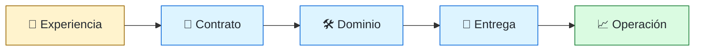
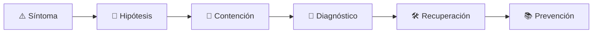

# 🧩 Full-stack Engineer
<!-- role-visual:start -->

**La guía conecta trabajo real, decisiones, clases concretas y evidencia defendible.**

<!-- role-visual:end -->

> Entrega fragmentos verticales completos conectando experiencia, servicios, datos y
> despliegue; conserva profundidad suficiente para no trasladar fallos entre capas.
>
> **Entrada habitual:** semi-senior · **Foco:** integración de extremo a extremo ·
> **Evidencia central:** capacidad de producto operable con contratos explícitos

## 🧭 Qué es y por qué importa

Full-stack no significa dominar cada tecnología. Significa poder seguir una necesidad
desde la interfaz hasta los datos y la operación, reconocer dónde falta profundidad y
coordinar especialistas. Es valioso en productos pequeños, discovery técnico y equipos
que entregan por capacidades, no por capas aisladas.

## 🗓️ Un día en el puesto

- refinar un flujo con producto y UX;
- cambiar interfaz, contrato, regla y persistencia de forma compatible;
- escribir pruebas en la capa más económica que detecte cada riesgo;
- revisar logs de cliente y servidor para localizar una falla transversal;
- preparar migración y despliegue gradual;
- pedir revisión especializada cuando seguridad, datos o escala lo exigen.

## ✅ Responsabilidades y límites

- Responde por el recorrido completo del usuario y su evidencia.
- Mantiene contratos explícitos entre navegador, servicio y almacenamiento.
- No usa “full-stack” como excusa para ignorar accesibilidad, datos u operación.
- No reemplaza especialistas en dominios críticos.
- No duplica reglas de negocio silenciosamente en varias capas.

## 🧠 Qué necesitas saber

- fundamentos de frontend y backend;
- HTTP, APIs, identidad, autorización y sesiones;
- modelado de datos, transacciones y migraciones;
- diseño modular, pruebas por capas y contratos;
- CI/CD, configuración, observabilidad y rollback;
- discovery, accesibilidad, seguridad y costes de operación.

## 📚 Tu ruta en el programa

1. Partes 00–09 para base técnica compartida.
2. Partes 10–17 para producto, requisitos, proceso y documentación.
3. [Parte 19 — Web y frontend](../classes/part-19-web-frontend-y-aplicaciones-progresivas/README.md), Parte 20 para backend y Parte 26 para persistencia.
4. Partes 24–25 para diseño y arquitectura.
5. Partes 30–35 para pruebas, seguridad, entrega y operación.
6. Partes 36, 38 y 39 para evolución y agentes supervisados.

<!-- role-depth:start -->
## 🗺️ Sistema profesional del rol

El gráfico no representa una cascada rígida. Muestra el bucle profesional que este rol
debe poder recorrer: comprender el contexto, tomar una decisión, intervenir, observar
el efecto y convertir lo aprendido en una mejora. En **🧩 Full-stack Engineer**, saltar directamente a
la herramienta suele ocultar el problema, mientras que terminar sin evidencia deja la
decisión en una opinión. La misión concreta es: Entrega fragmentos verticales completos conectando experiencia, servicios, datos y despliegue; conserva profundidad suficiente para no trasladar fallos entre capas. Cada transición
debe conservar supuestos, responsables y una forma de volver atrás.

<table>
<tr>
<td valign="top" width="50%">

### 🎯 Responde por

- decisiones propias de la familia **Producto digital**;
- el resultado observable, no sólo la actividad ejecutada;
- límites, riesgos, operación y deuda residual de su intervención;
- evidencia que otra persona pueda revisar o reproducir.

</td>
<td valign="top" width="50%">

### 🤝 Coordina con

- [🎨 Frontend Engineer](frontend-engineer.md); [⚙️ Backend Engineer](backend-engineer.md); [🧑‍💻 Software Engineer](software-engineer.md);
- producto y personas usuarias cuando cambia una tarea o outcome;
- seguridad, privacidad, accesibilidad y operación según el riesgo;
- quienes mantendrán el sistema después de la entrega.

</td>
</tr>
</table>

El título no concede autoridad automática. El alcance real depende del equipo, la
industria y la criticidad. Esta guía describe un recorrido desde **junior → senior**, pero una
vacante se evalúa por las decisiones que permite tomar, los sistemas que pone bajo
responsabilidad y la evidencia exigida, no por el nombre del cargo.

## 🧱 Partes y clases asociadas

La ruta distingue **parte** —unidad curricular con una capacidad acumulativa— de
**clase asociada** —punto concreto donde se estudia un mecanismo o una decisión. Las
clases siguientes forman el núcleo; no eliminan los prerrequisitos indicados en sus
propias páginas ni convierten en opcional la base común.

| Orden | Parte del programa | Clases clave | Por qué entra en esta ruta | Evidencia de transferencia |
| ---: | --- | --- | --- | --- |
| 1 | [Parte 19 · Web, frontend y aplicaciones progresivas](../classes/part-19-web-frontend-y-aplicaciones-progresivas/README.md) | [SE-232 · Estado, componentes y gestión de datos](../classes/part-19-web-frontend-y-aplicaciones-progresivas/se-232-estado-componentes-y-gestion-de-datos/README.md) [SE-233 · Formularios, validación y experiencia de error](../classes/part-19-web-frontend-y-aplicaciones-progresivas/se-233-formularios-validacion-y-experiencia-de-error/README.md) [SE-239 · Taller: construir un flujo web resiliente](../classes/part-19-web-frontend-y-aplicaciones-progresivas/se-239-taller-construir-un-flujo-web-resiliente/README.md) | Profundiza **plataforma web, estado y experiencia cliente** desde la responsabilidad del rol. | Aplicación accesible y observable. |
| 2 | [Parte 20 · Backend, APIs y procesamiento asíncrono](../classes/part-20-backend-apis-y-procesamiento-asincrono/README.md) | [SE-244 · Validación, errores y contratos consistentes](../classes/part-20-backend-apis-y-procesamiento-asincrono/se-244-validacion-errores-y-contratos-consistentes/README.md) [SE-246 · Idempotencia, reintentos y deduplicación](../classes/part-20-backend-apis-y-procesamiento-asincrono/se-246-idempotencia-reintentos-y-deduplicacion/README.md) [SE-250 · Health, readiness y shutdown ordenado](../classes/part-20-backend-apis-y-procesamiento-asincrono/se-250-health-readiness-y-shutdown-ordenado/README.md) | Profundiza **servicios, APIs y procesamiento asíncrono** desde la responsabilidad del rol. | Servicio contractual operable. |
| 3 | [Parte 26 · Datos, persistencia y recuperación](../classes/part-26-datos-persistencia-y-recuperacion/README.md) | [SE-313 · Modelado conceptual, lógico y físico](../classes/part-26-datos-persistencia-y-recuperacion/se-313-modelado-conceptual-logico-y-fisico/README.md) [SE-318 · Migraciones compatibles y evolución de esquema](../classes/part-26-datos-persistencia-y-recuperacion/se-318-migraciones-compatibles-y-evolucion-de-esquema/README.md) [SE-321 · Backups, restauración y pruebas de recuperación](../classes/part-26-datos-persistencia-y-recuperacion/se-321-backups-restauracion-y-pruebas-de-recuperacion/README.md) | Profundiza **persistencia, transacciones y recuperación** desde la responsabilidad del rol. | Capa de datos restaurable. |
| 4 | [Parte 34 · CI/CD, IaC y platform engineering](../classes/part-34-ci-cd-iac-y-platform-engineering/README.md) | [SE-409 · Integración continua y feedback temprano](../classes/part-34-ci-cd-iac-y-platform-engineering/se-409-integracion-continua-y-feedback-temprano/README.md) [SE-413 · Entrega y despliegue continuos](../classes/part-34-ci-cd-iac-y-platform-engineering/se-413-entrega-y-despliegue-continuos/README.md) [SE-420 · Proyecto: camino a producción con rollback](../classes/part-34-ci-cd-iac-y-platform-engineering/se-420-proyecto-camino-a-produccion-con-rollback/README.md) | Profundiza **CI/CD, IaC, plataforma y DevEx** desde la responsabilidad del rol. | Camino autoservicio con rollback. |

**Cómo recorrerla.** Empieza por [SE-232](../classes/part-19-web-frontend-y-aplicaciones-progresivas/se-232-estado-componentes-y-gestion-de-datos/README.md) para fijar el
primer mecanismo, usa [SE-313](../classes/part-26-datos-persistencia-y-recuperacion/se-313-modelado-conceptual-logico-y-fisico/README.md) para integrar el
centro de la especialidad y llega a [SE-420](../classes/part-34-ci-cd-iac-y-platform-engineering/se-420-proyecto-camino-a-produccion-con-rollback/README.md) cuando ya
puedas explicar cómo detectar y recuperar un fallo. Una clase se considera estudiada
sólo cuando su concepto cambia una decisión y deja evidencia; abrir todos los enlaces
no constituye competencia.

> [!IMPORTANT]
> El mapa expresa el currículo previsto. Las Partes 00–02 están desarrolladas; las
> posteriores conservan borradores o estructuras que deben superar revisión
> cualitativa. Esta ruta no declara terminadas esas clases ni reemplaza el
> [roadmap](../ROADMAP.md).

## ⚖️ Decisiones y trade-offs que debes defender

| Decisión recurrente | Criterio profesional | Evidencia mínima antes de defenderla |
| --- | --- | --- |
| **Validar en cliente o servidor** | Usar cliente para feedback y servidor para autoridad. | Pruebas negativas en ambos límites. |
| **Consulta directa o API** | Proteger invariantes y evolución sin capas ceremoniales. | Contrato más perfil de una ruta vertical. |
| **Generalismo o profundidad** | Asumir una capacidad completa y pedir revisión experta donde el riesgo lo exige. | Evidencia de coordinación y límites documentados. |

La calidad de una decisión no se juzga porque coincida con una herramienta popular.
Debe hacer explícitos contexto, restricciones, alternativas descartadas, coste de
cambio y condición de revisión. En especial, **Validar en cliente o servidor**, **Consulta directa o API**
y **Generalismo o profundidad** cambian de respuesta cuando cambia el riesgo. Una solución
correcta en un prototipo puede ser irresponsable en un sistema regulado; una solución
robusta para un servicio crítico puede ser desperdicio en una herramienta interna.

## 🚨 Escenario profesional: Despliegue cambia el esquema y rompe clientes antiguos

**Síntoma.** Frontend backend y base quedan temporalmente en versiones distintas. La respuesta madura evita convertir la primera
correlación en causa y conserva evidencia antes de modificar el sistema.

1. **Detectar y delimitar:** identifica quién o qué está afectado, desde cuándo y qué
   cambió. Conserva timestamps, versiones, entradas y señales suficientes para no
   destruir la escena al intentar arreglarla.
2. **Investigar:** Seguir contrato migración flags y orden de rollout. Formula al menos dos hipótesis rivales
   y define qué observación refutaría cada una.
3. **Contener:** reduce blast radius y daño sin prometer una corrección todavía. La
   contención debe ser reversible, visible y compatible con las obligaciones del
   sistema.
4. **Recuperar:** Restaurar compatibilidad y ensayar expansión migración y contracción. Verifica la tarea completa, no sólo que un
   proceso volvió a estar verde.
5. **Aprender:** añade una regresión, señal o control que detecte la misma clase de
   fallo. Documenta qué deuda permanece y quién revisará la acción.

El escenario evalúa método además de resultado. Una recuperación rápida que borra la
causa, oculta pérdida de datos o deja al equipo sin mecanismo preventivo no demuestra
dominio del rol.

## 📊 Señales útiles y límites de las métricas

| Señal | Qué ayuda a observar | Trampa que debe evitarse |
| --- | --- | --- |
| **Tiempo de una tarea completa** | Latencia percibida entre interfaz API y datos. | Optimizar una capa aislada. |
| **Fallos por despliegue** | Regresiones que atraviesan contratos. | Atribuir todo al último commit. |
| **Cobertura de flujo crítico** | Protección real de la ruta de negocio. | Sumar cobertura de líneas sin escenarios. |

Ninguna señal debe convertirse en ranking individual. Combina tendencia cuantitativa,
muestreo de casos, feedback cualitativo y contexto de carga. Declara ventana,
denominador, fuente, exclusiones y quién puede actuar sobre el resultado. Si una
métrica mejora mientras el outcome o el riesgo empeoran, el sistema está optimizando
el indicador y no el trabajo.

## 🧩 Proyecto integrador del rol: Fragmento vertical de producto

**Propósito:** entregar una tarea accesible con API datos pipeline y observabilidad. El resultado esperado es **UI contrato servicio migración suites de riesgo despliegue gradual y runbook**.

Entrega un expediente revisable con estas piezas:

1. **Contexto y alcance:** usuario, sistema, restricción, supuestos, fuera de alcance y
   criterio de no éxito.
2. **Decisión:** al menos dos alternativas reales, trade-offs, coste de reversión y un
   ADR o memo que indique cuándo revisar la elección.
3. **Artefacto principal:** una implementación, modelo, flujo o política coherente con
   las clases núcleo; no una captura aislada ni una presentación sin mecanismo.
4. **Fallo controlado:** introduce una condición adversa relacionada con el escenario
   anterior y conserva el resultado observado, sin inventar una ejecución.
5. **Verificación:** prueba, rúbrica, revisión o medición que pueda fallar y que conecte
   directamente con el resultado profesional.
6. **Operación y salida:** telemetría, recuperación, mantenimiento, deprecación o retiro
   según corresponda; incluye límites y deuda residual.

**Criterio de aceptación:** otra persona puede reconstruir el razonamiento, reproducir
la comprobación y distinguir claramente qué quedó demostrado de lo que sólo se propone.
El proyecto no se aprueba por cantidad de archivos ni por utilizar una marca concreta.

## 📈 Dominio esperado por alcance

| Alcance | Qué resuelve | Qué evidencia su autonomía |
| --- | --- | --- |
| **Inicial** | ejecuta una tarea acotada con criterios y acompañamiento | reproduce el caso, pregunta por supuestos y entrega evidencia legible |
| **Intermedio** | decide dentro de un componente o flujo conocido | compara alternativas, prueba fallos previsibles y coordina dependencias |
| **Senior** | conduce problemas ambiguos que cruzan sistemas o equipos | hace explícito el riesgo, diseña recuperación y mejora el mecanismo de trabajo |
| **Staff / Lead** | cambia capacidades compartidas y decisiones de largo plazo | multiplica criterio, define guardrails, mide adopción y conserva opciones futuras |

Progresar no significa alejarse de la práctica. Significa aumentar ambigüedad, horizonte,
blast radius y responsabilidad por consecuencias. La persona senior todavía debe poder
explicar el mecanismo; la persona Staff además crea condiciones para que otros lo
operen sin depender de ella.

## 🗓️ Plan de práctica 30 · 60 · 90 días

- **Días 1–30 — comprender y reproducir.** Estudia las primeras clases de cada parte,
  reproduce un caso pequeño y escribe un mapa de responsabilidades. El entregable es
  una baseline con preguntas abiertas, no una transformación prematura.
- **Días 31–60 — intervenir y fallar con control.** Construye el artefacto central,
  introduce el escenario de fallo y mide el comportamiento. Revisa el trabajo con una
  persona de una ruta vecina para descubrir supuestos de frontera.
- **Días 61–90 — operar y transferir.** Ejecuta recuperación, corrige la causa, publica
  runbook o guía de uso y presenta la decisión con trade-offs. Termina con una
  retrospectiva que separe resultado, evidencia, límites y siguiente inversión.

Este plan es una secuencia de práctica, no una promesa de empleabilidad en noventa días.
La experiencia previa, el dominio y el acceso a sistemas reales cambian el tiempo
necesario.

## 🎤 Preguntas para revisión o entrevista

1. ¿En qué contexto elegirías **Validar en cliente o servidor** y qué evidencia te haría cambiar?
2. ¿Cómo distinguirías síntoma, causa y daño en el escenario **Despliegue cambia el esquema y rompe clientes antiguos**?
3. ¿Qué clase asociada usarías para diseñar el mecanismo y cuál para verificarlo?
4. ¿Qué parte de **Fragmento vertical de producto** no automatizarías todavía y por qué?
5. ¿Qué métrica podría mejorar mientras el sistema empeora y qué guardrail añadirías?
6. ¿Dónde termina la autoridad de este rol y cuándo debe escalar o pedir revisión?

Una respuesta fuerte usa un caso, reconoce incertidumbre y propone una comprobación.
Nombrar una herramienta sin explicar mecanismo, fallo y límite no demuestra la
competencia.

## 🔗 Fuentes primarias y oficiales

- [OpenAPI Specification](https://spec.openapis.org/oas/latest.html) — **OpenAPI Initiative**. Se usa como referencia primaria u oficial; la guía no sustituye la fuente.
- [Web Content Accessibility Guidelines 2.2](https://www.w3.org/TR/WCAG22/) — **W3C**. Se usa como referencia primaria u oficial; la guía no sustituye la fuente.
- [DORA software delivery performance metrics](https://dora.dev/guides/dora-metrics/) — **Google Cloud**. Se usa como referencia primaria u oficial; la guía no sustituye la fuente.

Las fuentes orientan principios, vocabulario y prácticas; no convierten la guía en una
certificación ni sustituyen la documentación específica del sistema, la jurisdicción
o la tecnología utilizada.
<!-- role-depth:end -->

## 🧪 Evidencia de portafolio

- fragmento vertical desde criterio de aceptación hasta telemetría;
- contrato versionado entre cliente y API;
- migración de datos compatible con dos versiones de aplicación;
- suite equilibrada: unidad, integración, contrato y un E2E crítico;
- despliegue gradual con feature flag y rollback ensayado;
- informe de incidente que atraviesa cliente, red, servicio y datos.

## 📈 Progresión

Software Engineer → Full-stack Engineer → Senior → Tech Lead, Staff o especialización
en una de las capas. La amplitud útil incluye saber cuándo detenerse y convocar a una
persona experta.

## ⚠️ Mitos frecuentes

- “Full-stack es saber dos frameworks.” El valor está en integrar decisiones.
- “Una persona puede reemplazar a todo el equipo.” Aumenta el bus factor y el riesgo.
- “La regla puede vivir donde sea.” Duplicarla destruye consistencia.
- “El E2E compensa pruebas ausentes.” Produce diagnóstico lento y frágil.

## 🚀 Siguientes pasos

1. Construye una sola capacidad vertical con alcance pequeño.
2. Define contratos y observabilidad antes de añadir funciones.
3. Pide revisiones separadas de accesibilidad, seguridad y datos.
4. Demuestra un cambio compatible y un rollback, no solo el camino feliz.

---

[⬅️ Volver a las rutas](README.md) · [🏠 Inicio del programa](../README.md)
