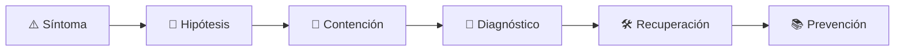

# 🌱 Green Software Engineer
<!-- role-visual:start -->

**La guía conecta trabajo real, decisiones, clases concretas y evidencia defendible.**

<!-- role-visual:end -->

> Reduce energía, carbono y recursos del software mediante mediciones comparables y
> decisiones que conservan calidad, accesibilidad y utilidad.
>
> **Entrada habitual:** semi-senior/senior · **Foco:** eficiencia y carbon awareness
> · **Evidencia central:** reducción medida con unidad funcional y límites declarados

## 🧭 Qué es y por qué importa

Green software engineering relaciona demanda de producto, utilización de hardware,
energía y carbono. Evita afirmaciones vagas: define una unidad funcional, frontera
del sistema, baseline y posibles efectos rebote antes de recomendar cambios.

## 🗓️ Un día en el puesto

- establecer baseline de cómputo, red y almacenamiento;
- identificar trabajo desperdiciado o sobredimensionamiento;
- comparar arquitectura, región, horario o política de retención;
- revisar impacto en latencia, resiliencia y coste;
- comunicar incertidumbre y mantener la medición.

## ✅ Responsabilidades y límites

- Responde por método, límites y trazabilidad de la afirmación ambiental.
- Prioriza evitar trabajo y mejorar utilización antes de compensaciones.
- No confunde coste monetario con carbono.
- No publica porcentajes sin unidad, periodo y fuente de datos.

## 🧠 Qué necesitas saber

Profiling, capacidad, elasticidad, eficiencia energética, intensidad de carbono,
Software Carbon Intensity, scheduling, almacenamiento y retención, lifecycle,
GreenOps, FinOps, observabilidad, estadística y efectos rebote.

## 📚 Tu ruta en el programa

1. Partes 00–04 y 08 para ética, sistemas y medición.
2. Partes 11 y 19–29 para economía y arquitectura.
3. [Parte 31 — Calidad, rendimiento y resiliencia](../classes/part-31-calidad-rendimiento-y-resiliencia/README.md) y partes 34–35 para plataforma y observabilidad.
4. Partes 36–38 para vida útil, liderazgo y coste de IA.

<!-- role-depth:start -->
## 🗺️ Sistema profesional del rol

El gráfico no representa una cascada rígida. Muestra el bucle profesional que este rol
debe poder recorrer: comprender el contexto, tomar una decisión, intervenir, observar
el efecto y convertir lo aprendido en una mejora. En **🌱 Green Software Engineer**, saltar directamente a
la herramienta suele ocultar el problema, mientras que terminar sin evidencia deja la
decisión en una opinión. La misión concreta es: Reduce energía, carbono y recursos del software mediante mediciones comparables y decisiones que conservan calidad, accesibilidad y utilidad. Cada transición
debe conservar supuestos, responsables y una forma de volver atrás.

<table>
<tr>
<td valign="top" width="50%">

### 🎯 Responde por

- decisiones propias de la familia **Sostenibilidad**;
- el resultado observable, no sólo la actividad ejecutada;
- límites, riesgos, operación y deuda residual de su intervención;
- evidencia que otra persona pueda revisar o reproducir.

</td>
<td valign="top" width="50%">

### 🤝 Coordina con

- [⏱️ Performance Engineer](performance-engineer.md); [💸 FinOps Engineer](finops-engineer.md); [☁️ Cloud Engineer](cloud-engineer.md);
- producto y personas usuarias cuando cambia una tarea o outcome;
- seguridad, privacidad, accesibilidad y operación según el riesgo;
- quienes mantendrán el sistema después de la entrega.

</td>
</tr>
</table>

El título no concede autoridad automática. El alcance real depende del equipo, la
industria y la criticidad. Esta guía describe un recorrido desde **semi-senior → lead**, pero una
vacante se evalúa por las decisiones que permite tomar, los sistemas que pone bajo
responsabilidad y la evidencia exigida, no por el nombre del cargo.

## 🧱 Partes y clases asociadas

La ruta distingue **parte** —unidad curricular con una capacidad acumulativa— de
**clase asociada** —punto concreto donde se estudia un mecanismo o una decisión. Las
clases siguientes forman el núcleo; no eliminan los prerrequisitos indicados en sus
propias páginas ni convierten en opcional la base común.

| Orden | Parte del programa | Clases clave | Por qué entra en esta ruta | Evidencia de transferencia |
| ---: | --- | --- | --- | --- |
| 1 | [Parte 01 · Computadores y representación de información](../classes/part-01-computadores-y-representacion-de-informacion/README.md) | [SE-018 · Memoria, cachés, almacenamiento y jerarquías](../classes/part-01-computadores-y-representacion-de-informacion/se-018-memoria-caches-almacenamiento-y-jerarquias/README.md) [SE-022 · Rendimiento, consumo energético y límites físicos](../classes/part-01-computadores-y-representacion-de-informacion/se-022-rendimiento-consumo-energetico-y-limites-fisicos/README.md) [SE-024 · Proyecto: informe reproducible de comportamiento y recursos](../classes/part-01-computadores-y-representacion-de-informacion/se-024-proyecto-informe-reproducible-de-comportamiento-y-recursos/README.md) | Profundiza **máquina, memoria, representación y coste físico** desde la responsabilidad del rol. | Experimento reproducible de recursos. |
| 2 | [Parte 11 · Economía, métricas y decisiones de producto](../classes/part-11-economia-metricas-y-decisiones-de-producto/README.md) | [SE-134 · Costos de construcción, operación y oportunidad](../classes/part-11-economia-metricas-y-decisiones-de-producto/se-134-costos-de-construccion-operacion-y-oportunidad/README.md) [SE-139 · North Star, guardrails y métricas contrarias](../classes/part-11-economia-metricas-y-decisiones-de-producto/se-139-north-star-guardrails-y-metricas-contrarias/README.md) [SE-140 · FinOps de producto y costo por resultado](../classes/part-11-economia-metricas-y-decisiones-de-producto/se-140-finops-de-producto-y-costo-por-resultado/README.md) | Profundiza **economía, métricas y experimentación** desde la responsabilidad del rol. | Caso económico con sensibilidad. |
| 3 | [Parte 29 · Cloud, plataforma e infraestructura](../classes/part-29-cloud-plataforma-e-infraestructura/README.md) | [SE-352 · Serverless y ejecución gestionada](../classes/part-29-cloud-plataforma-e-infraestructura/se-352-serverless-y-ejecucion-gestionada/README.md) [SE-356 · Escalado, capacidad y costos](../classes/part-29-cloud-plataforma-e-infraestructura/se-356-escalado-capacidad-y-costos/README.md) [SE-359 · Taller: desplegar y destruir un entorno seguro](../classes/part-29-cloud-plataforma-e-infraestructura/se-359-taller-desplegar-y-destruir-un-entorno-seguro/README.md) | Profundiza **cloud, infraestructura y plataformas** desde la responsabilidad del rol. | Entorno reproducible y eliminable. |
| 4 | [Parte 31 · Calidad, rendimiento y resiliencia](../classes/part-31-calidad-rendimiento-y-resiliencia/README.md) | [SE-375 · Carga, estrés, picos y endurance](../classes/part-31-calidad-rendimiento-y-resiliencia/se-375-carga-estres-picos-y-endurance/README.md) [SE-376 · Latencia, throughput, saturación y capacidad](../classes/part-31-calidad-rendimiento-y-resiliencia/se-376-latencia-throughput-saturacion-y-capacidad/README.md) [SE-377 · Perfiles, benchmarks y errores de medición](../classes/part-31-calidad-rendimiento-y-resiliencia/se-377-perfiles-benchmarks-y-errores-de-medicion/README.md) | Profundiza **calidad, rendimiento y resiliencia** desde la responsabilidad del rol. | Informe medido y game day. |

**Cómo recorrerla.** Empieza por [SE-018](../classes/part-01-computadores-y-representacion-de-informacion/se-018-memoria-caches-almacenamiento-y-jerarquias/README.md) para fijar el
primer mecanismo, usa [SE-352](../classes/part-29-cloud-plataforma-e-infraestructura/se-352-serverless-y-ejecucion-gestionada/README.md) para integrar el
centro de la especialidad y llega a [SE-377](../classes/part-31-calidad-rendimiento-y-resiliencia/se-377-perfiles-benchmarks-y-errores-de-medicion/README.md) cuando ya
puedas explicar cómo detectar y recuperar un fallo. Una clase se considera estudiada
sólo cuando su concepto cambia una decisión y deja evidencia; abrir todos los enlaces
no constituye competencia.

> [!IMPORTANT]
> El mapa expresa el currículo previsto. La Parte 00 está desarrollada; las partes
> posteriores conservan borradores o estructuras que deben superar revisión
> cualitativa. Esta ruta no declara terminadas esas clases ni reemplaza el
> [roadmap](../ROADMAP.md).

## ⚖️ Decisiones y trade-offs que debes defender

| Decisión recurrente | Criterio profesional | Evidencia mínima antes de defenderla |
| --- | --- | --- |
| **Eficiencia o desplazamiento temporal** | Comparar energía carbono intensidad y deadline. | SCI con frontera y datos declarados. |
| **Menos cómputo o mejor experiencia** | Proteger resultado útil accesibilidad y confiabilidad. | Presupuesto por tarea. |
| **Optimizar o retirar** | Considerar embodied carbon vida útil migración y datos retenidos. | Análisis de ciclo y plan de salida. |

La calidad de una decisión no se juzga porque coincida con una herramienta popular.
Debe hacer explícitos contexto, restricciones, alternativas descartadas, coste de
cambio y condición de revisión. En especial, **Eficiencia o desplazamiento temporal**, **Menos cómputo o mejor experiencia**
y **Optimizar o retirar** cambian de respuesta cuando cambia el riesgo. Una solución
correcta en un prototipo puede ser irresponsable en un sistema regulado; una solución
robusta para un servicio crítico puede ser desperdicio en una herramienta interna.

## 🚨 Escenario profesional: Optimización reduce coste unitario pero aumenta consumo total

**Síntoma.** La capacidad liberada incentiva más frecuencia o retención. La respuesta madura evita convertir la primera
correlación en causa y conserva evidencia antes de modificar el sistema.

1. **Detectar y delimitar:** identifica quién o qué está afectado, desde cuándo y qué
   cambió. Conserva timestamps, versiones, entradas y señales suficientes para no
   destruir la escena al intentar arreglarla.
2. **Investigar:** Comparar unidad funcional demanda intensidad región y ventana. Formula al menos dos hipótesis rivales
   y define qué observación refutaría cada una.
3. **Contener:** reduce blast radius y daño sin prometer una corrección todavía. La
   contención debe ser reversible, visible y compatible con las obligaciones del
   sistema.
4. **Recuperar:** Ajustar producto presupuesto y scheduling y reportar efecto neto. Verifica la tarea completa, no sólo que un
   proceso volvió a estar verde.
5. **Aprender:** añade una regresión, señal o control que detecte la misma clase de
   fallo. Documenta qué deuda permanece y quién revisará la acción.

El escenario evalúa método además de resultado. Una recuperación rápida que borra la
causa, oculta pérdida de datos o deja al equipo sin mecanismo preventivo no demuestra
dominio del rol.

## 📊 Señales útiles y límites de las métricas

| Señal | Qué ayuda a observar | Trampa que debe evitarse |
| --- | --- | --- |
| **SCI por unidad funcional** | Emisiones asociadas a una tarea definida. | Cambiar frontera para mejorar cifra. |
| **Energía por operación** | Consumo físico o estimado con método declarado. | Convertir CPU directamente a carbono. |
| **Efecto rebote** | Demanda adicional causada por menor coste. | Declarar ahorro sin observar volumen. |

Ninguna señal debe convertirse en ranking individual. Combina tendencia cuantitativa,
muestreo de casos, feedback cualitativo y contexto de carga. Declara ventana,
denominador, fuente, exclusiones y quién puede actuar sobre el resultado. Si una
métrica mejora mientras el outcome o el riesgo empeoran, el sistema está optimizando
el indicador y no el trabajo.

## 🧩 Proyecto integrador del rol: Mejora sostenible basada en evidencia

**Propósito:** medir una carga definir frontera reducir recursos y explicar trade-offs. El resultado esperado es **baseline SCI experimento rendimiento coste calidad efecto rebote y recomendación**.

Entrega un expediente revisable con estas piezas:

1. **Contexto y alcance:** usuario, sistema, restricción, supuestos, fuera de alcance y
   criterio de no éxito.
2. **Decisión:** al menos dos alternativas reales, trade-offs, coste de reversión y un
   ADR o memo que indique cuándo revisar la elección.
3. **Artefacto principal:** una implementación, modelo, flujo o política coherente con
   las clases núcleo; no una captura aislada ni una presentación sin mecanismo.
4. **Fallo controlado:** introduce una condición adversa relacionada con el escenario
   anterior y conserva el resultado observado, sin inventar una ejecución.
5. **Verificación:** prueba, rúbrica, revisión o medición que pueda fallar y que conecte
   directamente con el resultado profesional.
6. **Operación y salida:** telemetría, recuperación, mantenimiento, deprecación o retiro
   según corresponda; incluye límites y deuda residual.

**Criterio de aceptación:** otra persona puede reconstruir el razonamiento, reproducir
la comprobación y distinguir claramente qué quedó demostrado de lo que sólo se propone.
El proyecto no se aprueba por cantidad de archivos ni por utilizar una marca concreta.

## 📈 Dominio esperado por alcance

| Alcance | Qué resuelve | Qué evidencia su autonomía |
| --- | --- | --- |
| **Inicial** | ejecuta una tarea acotada con criterios y acompañamiento | reproduce el caso, pregunta por supuestos y entrega evidencia legible |
| **Intermedio** | decide dentro de un componente o flujo conocido | compara alternativas, prueba fallos previsibles y coordina dependencias |
| **Senior** | conduce problemas ambiguos que cruzan sistemas o equipos | hace explícito el riesgo, diseña recuperación y mejora el mecanismo de trabajo |
| **Staff / Lead** | cambia capacidades compartidas y decisiones de largo plazo | multiplica criterio, define guardrails, mide adopción y conserva opciones futuras |

Progresar no significa alejarse de la práctica. Significa aumentar ambigüedad, horizonte,
blast radius y responsabilidad por consecuencias. La persona senior todavía debe poder
explicar el mecanismo; la persona Staff además crea condiciones para que otros lo
operen sin depender de ella.

## 🗓️ Plan de práctica 30 · 60 · 90 días

- **Días 1–30 — comprender y reproducir.** Estudia las primeras clases de cada parte,
  reproduce un caso pequeño y escribe un mapa de responsabilidades. El entregable es
  una baseline con preguntas abiertas, no una transformación prematura.
- **Días 31–60 — intervenir y fallar con control.** Construye el artefacto central,
  introduce el escenario de fallo y mide el comportamiento. Revisa el trabajo con una
  persona de una ruta vecina para descubrir supuestos de frontera.
- **Días 61–90 — operar y transferir.** Ejecuta recuperación, corrige la causa, publica
  runbook o guía de uso y presenta la decisión con trade-offs. Termina con una
  retrospectiva que separe resultado, evidencia, límites y siguiente inversión.

Este plan es una secuencia de práctica, no una promesa de empleabilidad en noventa días.
La experiencia previa, el dominio y el acceso a sistemas reales cambian el tiempo
necesario.

## 🎤 Preguntas para revisión o entrevista

1. ¿En qué contexto elegirías **Eficiencia o desplazamiento temporal** y qué evidencia te haría cambiar?
2. ¿Cómo distinguirías síntoma, causa y daño en el escenario **Optimización reduce coste unitario pero aumenta consumo total**?
3. ¿Qué clase asociada usarías para diseñar el mecanismo y cuál para verificarlo?
4. ¿Qué parte de **Mejora sostenible basada en evidencia** no automatizarías todavía y por qué?
5. ¿Qué métrica podría mejorar mientras el sistema empeora y qué guardrail añadirías?
6. ¿Dónde termina la autoridad de este rol y cuándo debe escalar o pedir revisión?

Una respuesta fuerte usa un caso, reconoce incertidumbre y propone una comprobación.
Nombrar una herramienta sin explicar mecanismo, fallo y límite no demuestra la
competencia.

## 🔗 Fuentes primarias y oficiales

- [Software Carbon Intensity Specification](https://greensoftware.foundation/standards/sci/) — **Green Software Foundation**. Se usa como referencia primaria u oficial; la guía no sustituye la fuente.
- [ISO/IEC 25010:2023](https://www.iso.org/standard/78176.html) — **ISO**. Se usa como referencia primaria u oficial; la guía no sustituye la fuente.
- [ACM Code of Ethics and Professional Conduct](https://www.acm.org/code-of-ethics) — **ACM**. Se usa como referencia primaria u oficial; la guía no sustituye la fuente.

Las fuentes orientan principios, vocabulario y prácticas; no convierten la guía en una
certificación ni sustituyen la documentación específica del sistema, la jurisdicción
o la tecnología utilizada.
<!-- role-depth:end -->

## 🧪 Evidencia de portafolio

- baseline con unidad funcional y frontera;
- perfil de trabajo desperdiciado y capacidad;
- experimento antes/después con incertidumbre;
- ADR que compare carbono, coste, confiabilidad y experiencia.

## 📈 Progresión

Software/Cloud/Performance Engineer → Green Software Engineer → Sustainability Tech Lead.

## ⚠️ Mitos frecuentes

- “Menos cloud spend siempre es más verde.” Región y utilización pueden cambiar el resultado.
- “Mover la carga basta.” Puede desplazar impacto sin reducirlo.
- “La IA optimiza automáticamente.” También añade inferencia, datos y opacidad.

## 🚀 Siguientes pasos

1. Define una transacción o tarea como unidad funcional.
2. Mide recursos antes de optimizar.
3. Documenta reducción, trade-offs y posible efecto rebote.

---

[⬅️ Volver a las rutas](README.md) · [🏠 Inicio del programa](../README.md)
