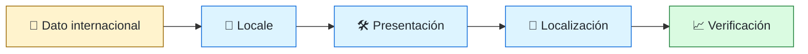
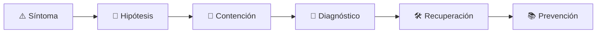

# 🌍 Internationalization Engineer
<!-- role-visual:start -->

**La guía conecta trabajo real, decisiones, clases concretas y evidencia defendible.**

<!-- role-visual:end -->

> Diseña productos que representan idioma, texto, tiempo, número y dirección sin
> codificar supuestos culturales imposibles de corregir al traducir.
>
> **Entrada habitual:** semi-senior · **Foco:** i18n, l10n y datos globales
> · **Evidencia central:** flujo probado en varios locales, zonas horarias y RTL

## 🧭 Qué es y por qué importa

Internationalization engineering separa contenido, representación y lógica para que
un producto pueda localizarse sin bifurcar código. Atiende Unicode, pluralización,
calendarios, moneda, zonas horarias, layout y operación del catálogo de traducciones.

## 🗓️ Un día en el puesto

- detectar texto concatenado o supuesto de formato;
- revisar identificadores y contexto de traducción;
- reproducir un fallo de zona horaria o normalización Unicode;
- probar expansión de texto y dirección RTL;
- coordinar localización, QA, contenido y release.

## ✅ Responsabilidades y límites

- Responde por arquitectura y herramientas de internacionalización.
- Distingue almacenar un instante de presentarlo en un contexto humano.
- No traduce mecánicamente términos de dominio sin contexto.
- No afirma soporte de un locale que no fue probado ni mantenido.

## 🧠 Qué necesitas saber

Unicode, normalización, graphemes, locale, CLDR, pluralización, fechas, calendarios,
zonas horarias, monedas, collation, RTL, recursos, pseudo-localización, accesibilidad,
testing y workflow de traducción.

## 📚 Tu ruta en el programa

1. Partes 01 y 03–09 para representación y software base.
2. Partes 10–13 para usuarios, dominio y contratos.
3. [Parte 14](../classes/part-14-experiencia-accesibilidad-e-internacionalizacion/README.md) como núcleo.
4. Partes 19–21 y 26 para interfaces, APIs y persistencia.
5. Partes 30, 33–34 para pruebas, release y automatización.

<!-- role-depth:start -->
## 🗺️ Sistema profesional del rol

El gráfico no representa una cascada rígida. Muestra el bucle profesional que este rol
debe poder recorrer: comprender el contexto, tomar una decisión, intervenir, observar
el efecto y convertir lo aprendido en una mejora. En **🌍 Internationalization Engineer**, saltar directamente a
la herramienta suele ocultar el problema, mientras que terminar sin evidencia deja la
decisión en una opinión. La misión concreta es: Diseña productos que representan idioma, texto, tiempo, número y dirección sin codificar supuestos culturales imposibles de corregir al traducir. Cada transición
debe conservar supuestos, responsables y una forma de volver atrás.

<table>
<tr>
<td valign="top" width="50%">

### 🎯 Responde por

- decisiones propias de la familia **Globalización**;
- el resultado observable, no sólo la actividad ejecutada;
- límites, riesgos, operación y deuda residual de su intervención;
- evidencia que otra persona pueda revisar o reproducir.

</td>
<td valign="top" width="50%">

### 🤝 Coordina con

- [🎨 Frontend Engineer](frontend-engineer.md); [📱 Mobile Engineer](mobile-engineer.md); [♿ Accessibility Engineer](accessibility-engineer.md);
- producto y personas usuarias cuando cambia una tarea o outcome;
- seguridad, privacidad, accesibilidad y operación según el riesgo;
- quienes mantendrán el sistema después de la entrega.

</td>
</tr>
</table>

El título no concede autoridad automática. El alcance real depende del equipo, la
industria y la criticidad. Esta guía describe un recorrido desde **semi-senior → lead**, pero una
vacante se evalúa por las decisiones que permite tomar, los sistemas que pone bajo
responsabilidad y la evidencia exigida, no por el nombre del cargo.

## 🧱 Partes y clases asociadas

La ruta distingue **parte** —unidad curricular con una capacidad acumulativa— de
**clase asociada** —punto concreto donde se estudia un mecanismo o una decisión. Las
clases siguientes forman el núcleo; no eliminan los prerrequisitos indicados en sus
propias páginas ni convierten en opcional la base común.

| Orden | Parte del programa | Clases clave | Por qué entra en esta ruta | Evidencia de transferencia |
| ---: | --- | --- | --- | --- |
| 1 | [Parte 01 · Computadores y representación de información](../classes/part-01-computadores-y-representacion-de-informacion/README.md) | [SE-015 · Texto, Unicode, codificaciones y mojibake](../classes/part-01-computadores-y-representacion-de-informacion/se-015-texto-unicode-codificaciones-y-mojibake/README.md) [SE-016 · Enteros, coma flotante, precisión y errores numéricos](../classes/part-01-computadores-y-representacion-de-informacion/se-016-enteros-coma-flotante-precision-y-errores-numericos/README.md) [SE-024 · Proyecto: informe reproducible de comportamiento y recursos](../classes/part-01-computadores-y-representacion-de-informacion/se-024-proyecto-informe-reproducible-de-comportamiento-y-recursos/README.md) | Profundiza **máquina, memoria, representación y coste físico** desde la responsabilidad del rol. | Experimento reproducible de recursos. |
| 2 | [Parte 14 · Experiencia, accesibilidad e internacionalización](../classes/part-14-experiencia-accesibilidad-e-internacionalizacion/README.md) | [SE-177 · Internacionalización, localización y formatos culturales](../classes/part-14-experiencia-accesibilidad-e-internacionalizacion/se-177-internacionalizacion-localizacion-y-formatos-culturales/README.md) [SE-178 · Investigación de usabilidad y medición](../classes/part-14-experiencia-accesibilidad-e-internacionalizacion/se-178-investigacion-de-usabilidad-y-medicion/README.md) [SE-180 · Proyecto: prototipo accesible evaluado con usuarios](../classes/part-14-experiencia-accesibilidad-e-internacionalizacion/se-180-proyecto-prototipo-accesible-evaluado-con-usuarios/README.md) | Profundiza **experiencia, accesibilidad e internacionalización** desde la responsabilidad del rol. | Flujo inclusivo evaluado. |
| 3 | [Parte 19 · Web, frontend y aplicaciones progresivas](../classes/part-19-web-frontend-y-aplicaciones-progresivas/README.md) | [SE-233 · Formularios, validación y experiencia de error](../classes/part-19-web-frontend-y-aplicaciones-progresivas/se-233-formularios-validacion-y-experiencia-de-error/README.md) [SE-234 · Navegación, routing y URLs durables](../classes/part-19-web-frontend-y-aplicaciones-progresivas/se-234-navegacion-routing-y-urls-durables/README.md) [SE-240 · Proyecto: aplicación web accesible y offline](../classes/part-19-web-frontend-y-aplicaciones-progresivas/se-240-proyecto-aplicacion-web-accesible-y-offline/README.md) | Profundiza **plataforma web, estado y experiencia cliente** desde la responsabilidad del rol. | Aplicación accesible y observable. |
| 4 | [Parte 21 · Software móvil, escritorio y multiplataforma](../classes/part-21-software-movil-escritorio-y-multiplataforma/README.md) | [SE-256 · Almacenamiento local y sincronización](../classes/part-21-software-movil-escritorio-y-multiplataforma/se-256-almacenamiento-local-y-sincronizacion/README.md) [SE-260 · Offline-first y resolución de conflictos](../classes/part-21-software-movil-escritorio-y-multiplataforma/se-260-offline-first-y-resolucion-de-conflictos/README.md) [SE-263 · Taller: adaptar un producto a dos plataformas](../classes/part-21-software-movil-escritorio-y-multiplataforma/se-263-taller-adaptar-un-producto-a-dos-plataformas/README.md) | Profundiza **clientes, sincronización y distribución** desde la responsabilidad del rol. | Cliente offline con actualización segura. |

**Cómo recorrerla.** Empieza por [SE-015](../classes/part-01-computadores-y-representacion-de-informacion/se-015-texto-unicode-codificaciones-y-mojibake/README.md) para fijar el
primer mecanismo, usa [SE-233](../classes/part-19-web-frontend-y-aplicaciones-progresivas/se-233-formularios-validacion-y-experiencia-de-error/README.md) para integrar el
centro de la especialidad y llega a [SE-263](../classes/part-21-software-movil-escritorio-y-multiplataforma/se-263-taller-adaptar-un-producto-a-dos-plataformas/README.md) cuando ya
puedas explicar cómo detectar y recuperar un fallo. Una clase se considera estudiada
sólo cuando su concepto cambia una decisión y deja evidencia; abrir todos los enlaces
no constituye competencia.

> [!IMPORTANT]
> El mapa expresa el currículo previsto. Las Partes 00–05 están desarrolladas; las
> posteriores conservan borradores o estructuras que deben superar revisión
> cualitativa. Esta ruta no declara terminadas esas clases ni reemplaza el
> [roadmap](../ROADMAP.md).

## ⚖️ Decisiones y trade-offs que debes defender

| Decisión recurrente | Criterio profesional | Evidencia mínima antes de defenderla |
| --- | --- | --- |
| **Almacenar o formatear** | Conservar representación canónica y aplicar locale en el borde. | Pruebas de ida y vuelta. |
| **Traducir texto o rediseñar contenido** | Preservar intención espacio y pluralización. | Pseudo-localización más revisión lingüística. |
| **Hora local o instante** | Distinguir evento zona calendario y regla futura. | Casos de DST y cambios de zona. |

La calidad de una decisión no se juzga porque coincida con una herramienta popular.
Debe hacer explícitos contexto, restricciones, alternativas descartadas, coste de
cambio y condición de revisión. En especial, **Almacenar o formatear**, **Traducir texto o rediseñar contenido**
y **Hora local o instante** cambian de respuesta cuando cambia el riesgo. Una solución
correcta en un prototipo puede ser irresponsable en un sistema regulado; una solución
robusta para un servicio crítico puede ser desperdicio en una herramienta interna.

## 🚨 Escenario profesional: Una reserva cambia de día para ciertos usuarios

**Síntoma.** Se mezcla instante UTC con fecha local y zona implícita. La respuesta madura evita convertir la primera
correlación en causa y conserva evidencia antes de modificar el sistema.

1. **Detectar y delimitar:** identifica quién o qué está afectado, desde cuándo y qué
   cambió. Conserva timestamps, versiones, entradas y señales suficientes para no
   destruir la escena al intentar arreglarla.
2. **Investigar:** Rastrear tipo serialización regla de zona locale y calendario. Formula al menos dos hipótesis rivales
   y define qué observación refutaría cada una.
3. **Contener:** reduce blast radius y daño sin prometer una corrección todavía. La
   contención debe ser reversible, visible y compatible con las obligaciones del
   sistema.
4. **Recuperar:** Corregir modelo migrar datos afectados y añadir matrices de frontera temporal. Verifica la tarea completa, no sólo que un
   proceso volvió a estar verde.
5. **Aprender:** añade una regresión, señal o control que detecte la misma clase de
   fallo. Documenta qué deuda permanece y quién revisará la acción.

El escenario evalúa método además de resultado. Una recuperación rápida que borra la
causa, oculta pérdida de datos o deja al equipo sin mecanismo preventivo no demuestra
dominio del rol.

## 📊 Señales útiles y límites de las métricas

| Señal | Qué ayuda a observar | Trampa que debe evitarse |
| --- | --- | --- |
| **Defectos por locale** | Fallos funcionales y visuales asociados a configuración cultural. | Contar cadenas sin contexto. |
| **Cobertura de mensajes** | Interfaces externalizadas y traducibles. | Confundir extracción con calidad. |
| **Errores de tiempo y moneda** | Impacto de conversiones y redondeo incorrectos. | Probar sólo en UTC y dólares. |

Ninguna señal debe convertirse en ranking individual. Combina tendencia cuantitativa,
muestreo de casos, feedback cualitativo y contexto de carga. Declara ventana,
denominador, fuente, exclusiones y quién puede actuar sobre el resultado. Si una
métrica mejora mientras el outcome o el riesgo empeoran, el sistema está optimizando
el indicador y no el trabajo.

## 🧩 Proyecto integrador del rol: Producto preparado para múltiples culturas

**Propósito:** hacer que una misma tarea funcione con locales scripts zonas y formatos distintos. El resultado esperado es **modelo de datos catálogos pseudo-localización RTL matrices temporales y reporte de defectos**.

Entrega un expediente revisable con estas piezas:

1. **Contexto y alcance:** usuario, sistema, restricción, supuestos, fuera de alcance y
   criterio de no éxito.
2. **Decisión:** al menos dos alternativas reales, trade-offs, coste de reversión y un
   ADR o memo que indique cuándo revisar la elección.
3. **Artefacto principal:** una implementación, modelo, flujo o política coherente con
   las clases núcleo; no una captura aislada ni una presentación sin mecanismo.
4. **Fallo controlado:** introduce una condición adversa relacionada con el escenario
   anterior y conserva el resultado observado, sin inventar una ejecución.
5. **Verificación:** prueba, rúbrica, revisión o medición que pueda fallar y que conecte
   directamente con el resultado profesional.
6. **Operación y salida:** telemetría, recuperación, mantenimiento, deprecación o retiro
   según corresponda; incluye límites y deuda residual.

**Criterio de aceptación:** otra persona puede reconstruir el razonamiento, reproducir
la comprobación y distinguir claramente qué quedó demostrado de lo que sólo se propone.
El proyecto no se aprueba por cantidad de archivos ni por utilizar una marca concreta.

## 📈 Dominio esperado por alcance

| Alcance | Qué resuelve | Qué evidencia su autonomía |
| --- | --- | --- |
| **Inicial** | ejecuta una tarea acotada con criterios y acompañamiento | reproduce el caso, pregunta por supuestos y entrega evidencia legible |
| **Intermedio** | decide dentro de un componente o flujo conocido | compara alternativas, prueba fallos previsibles y coordina dependencias |
| **Senior** | conduce problemas ambiguos que cruzan sistemas o equipos | hace explícito el riesgo, diseña recuperación y mejora el mecanismo de trabajo |
| **Staff / Lead** | cambia capacidades compartidas y decisiones de largo plazo | multiplica criterio, define guardrails, mide adopción y conserva opciones futuras |

Progresar no significa alejarse de la práctica. Significa aumentar ambigüedad, horizonte,
blast radius y responsabilidad por consecuencias. La persona senior todavía debe poder
explicar el mecanismo; la persona Staff además crea condiciones para que otros lo
operen sin depender de ella.

## 🗓️ Plan de práctica 30 · 60 · 90 días

- **Días 1–30 — comprender y reproducir.** Estudia las primeras clases de cada parte,
  reproduce un caso pequeño y escribe un mapa de responsabilidades. El entregable es
  una baseline con preguntas abiertas, no una transformación prematura.
- **Días 31–60 — intervenir y fallar con control.** Construye el artefacto central,
  introduce el escenario de fallo y mide el comportamiento. Revisa el trabajo con una
  persona de una ruta vecina para descubrir supuestos de frontera.
- **Días 61–90 — operar y transferir.** Ejecuta recuperación, corrige la causa, publica
  runbook o guía de uso y presenta la decisión con trade-offs. Termina con una
  retrospectiva que separe resultado, evidencia, límites y siguiente inversión.

Este plan es una secuencia de práctica, no una promesa de empleabilidad en noventa días.
La experiencia previa, el dominio y el acceso a sistemas reales cambian el tiempo
necesario.

## 🎤 Preguntas para revisión o entrevista

1. ¿En qué contexto elegirías **Almacenar o formatear** y qué evidencia te haría cambiar?
2. ¿Cómo distinguirías síntoma, causa y daño en el escenario **Una reserva cambia de día para ciertos usuarios**?
3. ¿Qué clase asociada usarías para diseñar el mecanismo y cuál para verificarlo?
4. ¿Qué parte de **Producto preparado para múltiples culturas** no automatizarías todavía y por qué?
5. ¿Qué métrica podría mejorar mientras el sistema empeora y qué guardrail añadirías?
6. ¿Dónde termina la autoridad de este rol y cuándo debe escalar o pedir revisión?

Una respuesta fuerte usa un caso, reconoce incertidumbre y propone una comprobación.
Nombrar una herramienta sin explicar mecanismo, fallo y límite no demuestra la
competencia.

## 🔗 Fuentes primarias y oficiales

- [Internationalization techniques](https://www.w3.org/International/techniques/) — **W3C**. Se usa como referencia primaria u oficial; la guía no sustituye la fuente.
- [The Unicode Standard 18.0](https://www.unicode.org/versions/Unicode18.0.0/) — **Unicode Consortium**. Se usa como referencia primaria u oficial; la guía no sustituye la fuente.
- [Web Content Accessibility Guidelines 2.2](https://www.w3.org/TR/WCAG22/) — **W3C**. Se usa como referencia primaria u oficial; la guía no sustituye la fuente.

Las fuentes orientan principios, vocabulario y prácticas; no convierten la guía en una
certificación ni sustituyen la documentación específica del sistema, la jurisdicción
o la tecnología utilizada.
<!-- role-depth:end -->

## 🧪 Evidencia de portafolio

- matriz de locales, formatos, zonas y fallback;
- pseudo-localización en CI;
- pruebas de cambio horario, Unicode compuesto y RTL;
- proceso versionado de extracción, traducción y entrega.

## 📈 Progresión

Frontend/Mobile/Localization Engineer → I18n Engineer → Globalization Architect.

## ⚠️ Mitos frecuentes

- “i18n es traducir strings.” Los supuestos viven también en datos y layout.
- “UTF-8 resuelve Unicode.” No resuelve segmentación, normalización ni visualización.
- “UTC evita zonas horarias.” Ayuda a almacenar instantes, no decisiones civiles.

## 🚀 Siguientes pasos

1. Audita supuestos de idioma, longitud, tiempo y número.
2. Activa pseudo-localización y RTL antes de traducir.
3. Reproduce un cambio de horario y documenta la semántica correcta.

---

[⬅️ Volver a las rutas](README.md) · [🏠 Inicio del programa](../README.md)
