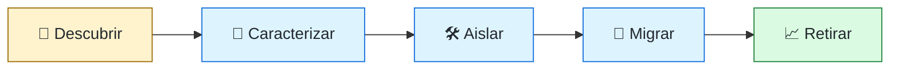
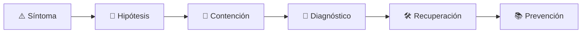

# 🏚️ Legacy Modernization Engineer
<!-- role-visual:start -->

**La guía conecta trabajo real, decisiones, clases concretas y evidencia defendible.**

<!-- role-visual:end -->

> Comprende y cambia sistemas críticos existentes sin perder continuidad, datos ni
> conocimiento; moderniza por evidencia, no por desprecio a lo antiguo.
>
> **Entrada habitual:** senior · **Foco:** brownfield, compatibilidad y migraciones ·
> **Evidencia central:** cambio incremental reversible sobre un sistema ajeno

## 🧭 Qué es y por qué importa

Legacy no significa simplemente tecnología vieja. Es software valioso cuyo cambio es
arriesgado por acoplamiento, conocimiento perdido, dependencias obsoletas o falta de
pruebas. Modernizar requiere arqueología, caracterización y estrategia. Reescribir es
una opción extrema, no el punto de partida.

## 🗓️ Un día en el puesto

- entrevistar usuarios y operadores para recuperar conocimiento;
- mapear dependencias, datos y flujos sin documentación confiable;
- capturar comportamiento con pruebas de caracterización;
- aislar un límite mediante adapter o anti-corruption layer;
- ejecutar migración progresiva y reconciliar resultados;
- planificar deprecación, archivo, retención y retiro seguro.

## ✅ Responsabilidades y límites

- Preserva comportamiento valioso antes de cambiarlo.
- Declara incertidumbre y crea checkpoints reversibles.
- No reescribe para mejorar estética ni adoptar una moda.
- No migra datos sin conciliación, backup y rollback.
- No retira un sistema sin ownership, retención y dependencias verificadas.

## 🧠 Qué necesitas saber

- lectura de código, depuración e ingeniería inversa;
- characterization tests, dependency mapping y análisis de datos;
- strangler fig, branch by abstraction y anti-corruption layer;
- rehost, replatform, refactor, rearchitect y rewrite;
- migraciones de API, esquema y datos con compatibilidad;
- EOL, decommissioning, archivo, retención y borrado seguro.

## 📚 Tu ruta en el programa

1. Parte 08 para investigación y debugging; partes 12–13 para reconstruir contratos.
2. Partes 16–17 para historia, colaboración y documentación.
3. Partes 24–28 para refactorización, arquitectura, datos e integración.
4. Partes 30–35 para caracterización, resiliencia, seguridad, entrega y observabilidad.
5. [Parte 36 — Mantenimiento y modernización legacy](../classes/part-36-mantenimiento-y-modernizacion-legacy/README.md).
6. Partes 37–39 para cambio organizacional e IA controlada sobre brownfield.

<!-- role-depth:start -->
## 🗺️ Sistema profesional del rol

El gráfico no representa una cascada rígida. Muestra el bucle profesional que este rol
debe poder recorrer: comprender el contexto, tomar una decisión, intervenir, observar
el efecto y convertir lo aprendido en una mejora. En **🏚️ Legacy Modernization Engineer**, saltar directamente a
la herramienta suele ocultar el problema, mientras que terminar sin evidencia deja la
decisión en una opinión. La misión concreta es: Comprende y cambia sistemas críticos existentes sin perder continuidad, datos ni conocimiento; moderniza por evidencia, no por desprecio a lo antiguo. Cada transición
debe conservar supuestos, responsables y una forma de volver atrás.

<table>
<tr>
<td valign="top" width="50%">

### 🎯 Responde por

- decisiones propias de la familia **Evolución**;
- el resultado observable, no sólo la actividad ejecutada;
- límites, riesgos, operación y deuda residual de su intervención;
- evidencia que otra persona pueda revisar o reproducir.

</td>
<td valign="top" width="50%">

### 🤝 Coordina con

- [🏛️ Software Architect](software-architect.md); [🗄️ Database Reliability Engineer](database-reliability-engineer.md); [🧭 Staff / Principal Engineer y Technical Lead](technical-leadership.md);
- producto y personas usuarias cuando cambia una tarea o outcome;
- seguridad, privacidad, accesibilidad y operación según el riesgo;
- quienes mantendrán el sistema después de la entrega.

</td>
</tr>
</table>

El título no concede autoridad automática. El alcance real depende del equipo, la
industria y la criticidad. Esta guía describe un recorrido desde **senior → principal**, pero una
vacante se evalúa por las decisiones que permite tomar, los sistemas que pone bajo
responsabilidad y la evidencia exigida, no por el nombre del cargo.

## 🧱 Partes y clases asociadas

La ruta distingue **parte** —unidad curricular con una capacidad acumulativa— de
**clase asociada** —punto concreto donde se estudia un mecanismo o una decisión. Las
clases siguientes forman el núcleo; no eliminan los prerrequisitos indicados en sus
propias páginas ni convierten en opcional la base común.

| Orden | Parte del programa | Clases clave | Por qué entra en esta ruta | Evidencia de transferencia |
| ---: | --- | --- | --- | --- |
| 1 | [Parte 08 · Entornos, herramientas y depuración](../classes/part-08-entornos-herramientas-y-depuracion/README.md) | [SE-105 · Reproducción de errores y reducción de casos](../classes/part-08-entornos-herramientas-y-depuracion/se-105-reproduccion-de-errores-y-reduccion-de-casos/README.md) [SE-107 · Taller: diagnosticar un fallo desconocido](../classes/part-08-entornos-herramientas-y-depuracion/se-107-taller-diagnosticar-un-fallo-desconocido/README.md) [SE-108 · Proyecto: entorno de desarrollo autocontenido](../classes/part-08-entornos-herramientas-y-depuracion/se-108-proyecto-entorno-de-desarrollo-autocontenido/README.md) | Profundiza **depuración, profiling y reproducción de fallos** desde la responsabilidad del rol. | Expediente de causa raíz. |
| 2 | [Parte 24 · Diseño, patrones y refactorización](../classes/part-24-diseno-patrones-y-refactorizacion/README.md) | [SE-294 · Code smells y diagnóstico contextual](../classes/part-24-diseno-patrones-y-refactorizacion/se-294-code-smells-y-diagnostico-contextual/README.md) [SE-295 · Refactorización segura apoyada por pruebas](../classes/part-24-diseno-patrones-y-refactorizacion/se-295-refactorizacion-segura-apoyada-por-pruebas/README.md) [SE-298 · Deuda técnica, interés y opciones](../classes/part-24-diseno-patrones-y-refactorizacion/se-298-deuda-tecnica-interes-y-opciones/README.md) | Profundiza **diseño, patrones y refactorización segura** desde la responsabilidad del rol. | Evolución compatible protegida por pruebas. |
| 3 | [Parte 36 · Mantenimiento y modernización legacy](../classes/part-36-mantenimiento-y-modernizacion-legacy/README.md) | [SE-434 · Arqueología de código y recuperación de conocimiento](../classes/part-36-mantenimiento-y-modernizacion-legacy/se-434-arqueologia-de-codigo-y-recuperacion-de-conocimiento/README.md) [SE-435 · Pruebas de caracterización y seams](../classes/part-36-mantenimiento-y-modernizacion-legacy/se-435-pruebas-de-caracterizacion-y-seams/README.md) [SE-444 · Proyecto: migración incremental reversible](../classes/part-36-mantenimiento-y-modernizacion-legacy/se-444-proyecto-migracion-incremental-reversible/README.md) | Profundiza **mantenimiento, modernización y retiro** desde la responsabilidad del rol. | Migración incremental reversible. |
| 4 | [Parte 37 · Gestión, liderazgo y práctica profesional](../classes/part-37-gestion-liderazgo-y-practica-profesional/README.md) | [SE-450 · Gestión de riesgos y decisiones ejecutivas](../classes/part-37-gestion-liderazgo-y-practica-profesional/se-450-gestion-de-riesgos-y-decisiones-ejecutivas/README.md) [SE-451 · Compras, proveedores y evaluación técnica](../classes/part-37-gestion-liderazgo-y-practica-profesional/se-451-compras-proveedores-y-evaluacion-tecnica/README.md) [SE-453 · Economía del software y costo total](../classes/part-37-gestion-liderazgo-y-practica-profesional/se-453-economia-del-software-y-costo-total/README.md) | Profundiza **liderazgo, organización y decisiones** desde la responsabilidad del rol. | Propuesta defendida ante conflicto. |

**Cómo recorrerla.** Empieza por [SE-105](../classes/part-08-entornos-herramientas-y-depuracion/se-105-reproduccion-de-errores-y-reduccion-de-casos/README.md) para fijar el
primer mecanismo, usa [SE-434](../classes/part-36-mantenimiento-y-modernizacion-legacy/se-434-arqueologia-de-codigo-y-recuperacion-de-conocimiento/README.md) para integrar el
centro de la especialidad y llega a [SE-453](../classes/part-37-gestion-liderazgo-y-practica-profesional/se-453-economia-del-software-y-costo-total/README.md) cuando ya
puedas explicar cómo detectar y recuperar un fallo. Una clase se considera estudiada
sólo cuando su concepto cambia una decisión y deja evidencia; abrir todos los enlaces
no constituye competencia.

> [!IMPORTANT]
> El mapa expresa el currículo previsto. Las Partes 00–01 están desarrolladas; las
> posteriores conservan borradores o estructuras que deben superar revisión
> cualitativa. Esta ruta no declara terminadas esas clases ni reemplaza el
> [roadmap](../ROADMAP.md).

## ⚖️ Decisiones y trade-offs que debes defender

| Decisión recurrente | Criterio profesional | Evidencia mínima antes de defenderla |
| --- | --- | --- |
| **Reescribir o evolucionar** | Comparar valor riesgo coexistencia y conocimiento perdido. | Caso económico más prueba de caracterización. |
| **Strangler o branch by abstraction** | Elegir frontera según tráfico datos y ciclo de despliegue. | Migración reversible. |
| **Compatibilidad o limpieza inmediata** | Pagar coexistencia temporal para reducir riesgo. | Telemetría de consumidores y criterio de retiro. |

La calidad de una decisión no se juzga porque coincida con una herramienta popular.
Debe hacer explícitos contexto, restricciones, alternativas descartadas, coste de
cambio y condición de revisión. En especial, **Reescribir o evolucionar**, **Strangler o branch by abstraction**
y **Compatibilidad o limpieza inmediata** cambian de respuesta cuando cambia el riesgo. Una solución
correcta en un prototipo puede ser irresponsable en un sistema regulado; una solución
robusta para un servicio crítico puede ser desperdicio en una herramienta interna.

## 🚨 Escenario profesional: Nueva implementación produce totales distintos sin especificación confiable

**Síntoma.** El comportamiento real incluye reglas implícitas y datos históricos. La respuesta madura evita convertir la primera
correlación en causa y conserva evidencia antes de modificar el sistema.

1. **Detectar y delimitar:** identifica quién o qué está afectado, desde cuándo y qué
   cambió. Conserva timestamps, versiones, entradas y señales suficientes para no
   destruir la escena al intentar arreglarla.
2. **Investigar:** Comparar salidas fixtures trazas decisiones y excepciones de negocio. Formula al menos dos hipótesis rivales
   y define qué observación refutaría cada una.
3. **Contener:** reduce blast radius y daño sin prometer una corrección todavía. La
   contención debe ser reversible, visible y compatible con las obligaciones del
   sistema.
4. **Recuperar:** Detener migración preservar ambos caminos y convertir diferencia en requisito. Verifica la tarea completa, no sólo que un
   proceso volvió a estar verde.
5. **Aprender:** añade una regresión, señal o control que detecte la misma clase de
   fallo. Documenta qué deuda permanece y quién revisará la acción.

El escenario evalúa método además de resultado. Una recuperación rápida que borra la
causa, oculta pérdida de datos o deja al equipo sin mecanismo preventivo no demuestra
dominio del rol.

## 📊 Señales útiles y límites de las métricas

| Señal | Qué ayuda a observar | Trampa que debe evitarse |
| --- | --- | --- |
| **Cobertura de comportamiento crítico** | Rutas legacy protegidas por caracterización. | Usar cobertura de líneas. |
| **Porcentaje de tráfico migrado** | Adopción real de la nueva ruta con calidad equivalente. | Mover tráfico sin datos. |
| **Tiempo de rollback** | Capacidad de volver ante divergencia. | Confiar en backup no ensayado. |

Ninguna señal debe convertirse en ranking individual. Combina tendencia cuantitativa,
muestreo de casos, feedback cualitativo y contexto de carga. Declara ventana,
denominador, fuente, exclusiones y quién puede actuar sobre el resultado. Si una
métrica mejora mientras el outcome o el riesgo empeoran, el sistema está optimizando
el indicador y no el trabajo.

## 🧩 Proyecto integrador del rol: Migración incremental reversible

**Propósito:** comprender un sistema ajeno estabilizarlo y retirar una capacidad sin big bang. El resultado esperado es **mapa dependencias caracterización ADR strangler migración datos observabilidad rollout rollback y decommission**.

Entrega un expediente revisable con estas piezas:

1. **Contexto y alcance:** usuario, sistema, restricción, supuestos, fuera de alcance y
   criterio de no éxito.
2. **Decisión:** al menos dos alternativas reales, trade-offs, coste de reversión y un
   ADR o memo que indique cuándo revisar la elección.
3. **Artefacto principal:** una implementación, modelo, flujo o política coherente con
   las clases núcleo; no una captura aislada ni una presentación sin mecanismo.
4. **Fallo controlado:** introduce una condición adversa relacionada con el escenario
   anterior y conserva el resultado observado, sin inventar una ejecución.
5. **Verificación:** prueba, rúbrica, revisión o medición que pueda fallar y que conecte
   directamente con el resultado profesional.
6. **Operación y salida:** telemetría, recuperación, mantenimiento, deprecación o retiro
   según corresponda; incluye límites y deuda residual.

**Criterio de aceptación:** otra persona puede reconstruir el razonamiento, reproducir
la comprobación y distinguir claramente qué quedó demostrado de lo que sólo se propone.
El proyecto no se aprueba por cantidad de archivos ni por utilizar una marca concreta.

## 📈 Dominio esperado por alcance

| Alcance | Qué resuelve | Qué evidencia su autonomía |
| --- | --- | --- |
| **Inicial** | ejecuta una tarea acotada con criterios y acompañamiento | reproduce el caso, pregunta por supuestos y entrega evidencia legible |
| **Intermedio** | decide dentro de un componente o flujo conocido | compara alternativas, prueba fallos previsibles y coordina dependencias |
| **Senior** | conduce problemas ambiguos que cruzan sistemas o equipos | hace explícito el riesgo, diseña recuperación y mejora el mecanismo de trabajo |
| **Staff / Lead** | cambia capacidades compartidas y decisiones de largo plazo | multiplica criterio, define guardrails, mide adopción y conserva opciones futuras |

Progresar no significa alejarse de la práctica. Significa aumentar ambigüedad, horizonte,
blast radius y responsabilidad por consecuencias. La persona senior todavía debe poder
explicar el mecanismo; la persona Staff además crea condiciones para que otros lo
operen sin depender de ella.

## 🗓️ Plan de práctica 30 · 60 · 90 días

- **Días 1–30 — comprender y reproducir.** Estudia las primeras clases de cada parte,
  reproduce un caso pequeño y escribe un mapa de responsabilidades. El entregable es
  una baseline con preguntas abiertas, no una transformación prematura.
- **Días 31–60 — intervenir y fallar con control.** Construye el artefacto central,
  introduce el escenario de fallo y mide el comportamiento. Revisa el trabajo con una
  persona de una ruta vecina para descubrir supuestos de frontera.
- **Días 61–90 — operar y transferir.** Ejecuta recuperación, corrige la causa, publica
  runbook o guía de uso y presenta la decisión con trade-offs. Termina con una
  retrospectiva que separe resultado, evidencia, límites y siguiente inversión.

Este plan es una secuencia de práctica, no una promesa de empleabilidad en noventa días.
La experiencia previa, el dominio y el acceso a sistemas reales cambian el tiempo
necesario.

## 🎤 Preguntas para revisión o entrevista

1. ¿En qué contexto elegirías **Reescribir o evolucionar** y qué evidencia te haría cambiar?
2. ¿Cómo distinguirías síntoma, causa y daño en el escenario **Nueva implementación produce totales distintos sin especificación confiable**?
3. ¿Qué clase asociada usarías para diseñar el mecanismo y cuál para verificarlo?
4. ¿Qué parte de **Migración incremental reversible** no automatizarías todavía y por qué?
5. ¿Qué métrica podría mejorar mientras el sistema empeora y qué guardrail añadirías?
6. ¿Dónde termina la autoridad de este rol y cuándo debe escalar o pedir revisión?

Una respuesta fuerte usa un caso, reconoce incertidumbre y propone una comprobación.
Nombrar una herramienta sin explicar mecanismo, fallo y límite no demuestra la
competencia.

## 🔗 Fuentes primarias y oficiales

- [SWEBOK Guide v4.0a](https://www.computer.org/education/bodies-of-knowledge/software-engineering) — **IEEE Computer Society**. Se usa como referencia primaria u oficial; la guía no sustituye la fuente.
- [ISO/IEC 25010:2023](https://www.iso.org/standard/78176.html) — **ISO**. Se usa como referencia primaria u oficial; la guía no sustituye la fuente.
- [Semantic Versioning 2.0.0](https://semver.org/spec/v2.0.0.html) — **Semantic Versioning project**. Se usa como referencia primaria u oficial; la guía no sustituye la fuente.

Las fuentes orientan principios, vocabulario y prácticas; no convierten la guía en una
certificación ni sustituyen la documentación específica del sistema, la jurisdicción
o la tecnología utilizada.
<!-- role-depth:end -->

## 🧪 Evidencia de portafolio

- mapa de contexto, dependencias y conocimiento faltante;
- suite de caracterización que captura comportamientos relevantes;
- ADR comparando seis estrategias de modernización;
- migración dual-read/dual-write o equivalente con conciliación;
- rollout progresivo con criterios de abortar;
- plan de retiro con archivo, retención y borrado verificable.

## 📈 Progresión

Senior Engineer → Modernization Lead → Staff/Principal o Architect. También existe como
especialidad temporal en consultoría. El valor está en reducir riesgo y recuperar
capacidad de cambio, no en la cantidad de código reemplazado.

## ⚠️ Mitos frecuentes

- “Legacy es código malo.” Puede contener décadas de reglas no documentadas.
- “Una rewrite será más rápida.” Reinicia aprendizaje y suele subestimar paridad.
- “Mover a cloud moderniza.” Rehost cambia ubicación, no diseño ni operación.
- “Cuando el nuevo sistema arranca, el viejo se apaga.” Dependencias y datos pueden sobrevivir años.

## 🚀 Siguientes pasos

1. Toma un sistema pequeño ajeno y reconstruye su mapa de comportamiento.
2. Añade caracterización antes de refactorizar.
3. Extrae una capacidad detrás de un contrato compatible.
4. Ensaya reversión y documenta qué incertidumbre permanece.

---

[⬅️ Volver a las rutas](README.md) · [🏠 Inicio del programa](../README.md)
