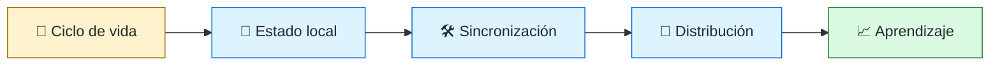
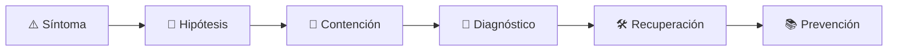

# 📱 Mobile Engineer
<!-- role-visual:start -->

**La guía conecta trabajo real, decisiones, clases concretas y evidencia defendible.**

<!-- role-visual:end -->

> Construye aplicaciones móviles que conservan datos, identidad y experiencia bajo
> ciclos de vida interrumpidos, conectividad variable y restricciones de plataforma.
>
> **Entrada habitual:** junior/semi-senior · **Foco:** cliente móvil y sincronización
> · **Evidencia central:** aplicación offline-first con actualización recuperable

## 🧭 Qué es y por qué importa

Mobile engineering no es reducir una web a una pantalla pequeña. El sistema pierde
conectividad, cambia de proceso, recibe permisos revocables y debe convivir con tiendas,
versiones del sistema operativo, energía limitada y datos locales sensibles.

## 🗓️ Un día en el puesto

- convertir un flujo de producto en estados de interfaz y navegación;
- investigar un cierre, consumo de batería o sincronización duplicada;
- revisar permisos, almacenamiento y telemetría respetuosa;
- probar varios tamaños, lectores de pantalla y conectividad degradada;
- preparar una entrega gradual y vigilar regresiones por versión.

## ✅ Responsabilidades y límites

- Responde por experiencia, ciclo de vida, datos locales y compatibilidad del cliente.
- Decide entre nativo, multiplataforma y web según restricciones, no por moda.
- No supone red permanente ni proceso siempre vivo.
- No almacena secretos del servidor ni datos sensibles sin modelo de amenaza.

## 🧠 Qué necesitas saber

Plataformas móviles, UI y estado; concurrencia y ciclo de vida; HTTP, caché y
sincronización; almacenamiento, permisos y privacidad; accesibilidad, i18n, pruebas,
profiling, distribución, crash reporting y rollback.

## 📚 Tu ruta en el programa

1. Partes 00–09 para fundamentos, programación y depuración.
2. Partes 10–14 para producto, requisitos, UX, accesibilidad e i18n.
3. [Parte 21 — Software móvil, escritorio y multiplataforma](../classes/part-21-software-movil-escritorio-y-multiplataforma/README.md).
4. Partes 20 y 26–28 para APIs, sincronización, datos y concurrencia.
5. Partes 30–35 para pruebas, seguridad, release y observabilidad.

<!-- role-depth:start -->
## 🗺️ Sistema profesional del rol

El gráfico no representa una cascada rígida. Muestra el bucle profesional que este rol
debe poder recorrer: comprender el contexto, tomar una decisión, intervenir, observar
el efecto y convertir lo aprendido en una mejora. En **📱 Mobile Engineer**, saltar directamente a
la herramienta suele ocultar el problema, mientras que terminar sin evidencia deja la
decisión en una opinión. La misión concreta es: Construye aplicaciones móviles que conservan datos, identidad y experiencia bajo ciclos de vida interrumpidos, conectividad variable y restricciones de plataforma. Cada transición
debe conservar supuestos, responsables y una forma de volver atrás.

<table>
<tr>
<td valign="top" width="50%">

### 🎯 Responde por

- decisiones propias de la familia **Clientes**;
- el resultado observable, no sólo la actividad ejecutada;
- límites, riesgos, operación y deuda residual de su intervención;
- evidencia que otra persona pueda revisar o reproducir.

</td>
<td valign="top" width="50%">

### 🤝 Coordina con

- [🎨 Frontend Engineer](frontend-engineer.md); [🖥️ Desktop Engineer](desktop-engineer.md); [⚙️ Backend Engineer](backend-engineer.md);
- producto y personas usuarias cuando cambia una tarea o outcome;
- seguridad, privacidad, accesibilidad y operación según el riesgo;
- quienes mantendrán el sistema después de la entrega.

</td>
</tr>
</table>

El título no concede autoridad automática. El alcance real depende del equipo, la
industria y la criticidad. Esta guía describe un recorrido desde **junior → principal**, pero una
vacante se evalúa por las decisiones que permite tomar, los sistemas que pone bajo
responsabilidad y la evidencia exigida, no por el nombre del cargo.

## 🧱 Partes y clases asociadas

La ruta distingue **parte** —unidad curricular con una capacidad acumulativa— de
**clase asociada** —punto concreto donde se estudia un mecanismo o una decisión. Las
clases siguientes forman el núcleo; no eliminan los prerrequisitos indicados en sus
propias páginas ni convierten en opcional la base común.

| Orden | Parte del programa | Clases clave | Por qué entra en esta ruta | Evidencia de transferencia |
| ---: | --- | --- | --- | --- |
| 1 | [Parte 14 · Experiencia, accesibilidad e internacionalización](../classes/part-14-experiencia-accesibilidad-e-internacionalizacion/README.md) | [SE-173 · Accesibilidad perceptible, operable y comprensible](../classes/part-14-experiencia-accesibilidad-e-internacionalizacion/se-173-accesibilidad-perceptible-operable-y-comprensible/README.md) [SE-176 · Responsive, adaptativo y preferencias del usuario](../classes/part-14-experiencia-accesibilidad-e-internacionalizacion/se-176-responsive-adaptativo-y-preferencias-del-usuario/README.md) [SE-177 · Internacionalización, localización y formatos culturales](../classes/part-14-experiencia-accesibilidad-e-internacionalizacion/se-177-internacionalizacion-localizacion-y-formatos-culturales/README.md) | Profundiza **experiencia, accesibilidad e internacionalización** desde la responsabilidad del rol. | Flujo inclusivo evaluado. |
| 2 | [Parte 21 · Software móvil, escritorio y multiplataforma](../classes/part-21-software-movil-escritorio-y-multiplataforma/README.md) | [SE-254 · Ciclo de vida, suspensión y reanudación](../classes/part-21-software-movil-escritorio-y-multiplataforma/se-254-ciclo-de-vida-suspension-y-reanudacion/README.md) [SE-256 · Almacenamiento local y sincronización](../classes/part-21-software-movil-escritorio-y-multiplataforma/se-256-almacenamiento-local-y-sincronizacion/README.md) [SE-260 · Offline-first y resolución de conflictos](../classes/part-21-software-movil-escritorio-y-multiplataforma/se-260-offline-first-y-resolucion-de-conflictos/README.md) | Profundiza **clientes, sincronización y distribución** desde la responsabilidad del rol. | Cliente offline con actualización segura. |
| 3 | [Parte 30 · Estrategia y técnicas de prueba](../classes/part-30-estrategia-y-tecnicas-de-prueba/README.md) | [SE-364 · End-to-end, aceptación y recorridos críticos](../classes/part-30-estrategia-y-tecnicas-de-prueba/se-364-end-to-end-aceptacion-y-recorridos-criticos/README.md) [SE-367 · Dobles, virtualización y entornos de prueba](../classes/part-30-estrategia-y-tecnicas-de-prueba/se-367-dobles-virtualizacion-y-entornos-de-prueba/README.md) [SE-370 · Flakiness, diagnóstico y mantenimiento](../classes/part-30-estrategia-y-tecnicas-de-prueba/se-370-flakiness-diagnostico-y-mantenimiento/README.md) | Profundiza **estrategia de pruebas guiada por riesgo** desde la responsabilidad del rol. | Suite que demuestra detección de defectos. |
| 4 | [Parte 33 · Build, release y cadena de suministro](../classes/part-33-build-release-y-cadena-de-suministro/README.md) | [SE-403 · Feature flags y entrega progresiva](../classes/part-33-build-release-y-cadena-de-suministro/se-403-feature-flags-y-entrega-progresiva/README.md) [SE-405 · Instaladores, paquetes y actualizaciones](../classes/part-33-build-release-y-cadena-de-suministro/se-405-instaladores-paquetes-y-actualizaciones/README.md) [SE-408 · Proyecto: release firmado y recuperable](../classes/part-33-build-release-y-cadena-de-suministro/se-408-proyecto-release-firmado-y-recuperable/README.md) | Profundiza **build, release y cadena de suministro** desde la responsabilidad del rol. | Release firmado y verificable. |

**Cómo recorrerla.** Empieza por [SE-173](../classes/part-14-experiencia-accesibilidad-e-internacionalizacion/se-173-accesibilidad-perceptible-operable-y-comprensible/README.md) para fijar el
primer mecanismo, usa [SE-364](../classes/part-30-estrategia-y-tecnicas-de-prueba/se-364-end-to-end-aceptacion-y-recorridos-criticos/README.md) para integrar el
centro de la especialidad y llega a [SE-408](../classes/part-33-build-release-y-cadena-de-suministro/se-408-proyecto-release-firmado-y-recuperable/README.md) cuando ya
puedas explicar cómo detectar y recuperar un fallo. Una clase se considera estudiada
sólo cuando su concepto cambia una decisión y deja evidencia; abrir todos los enlaces
no constituye competencia.

> [!IMPORTANT]
> El mapa expresa el currículo previsto. Las Partes 00–03 están desarrolladas; las
> posteriores conservan borradores o estructuras que deben superar revisión
> cualitativa. Esta ruta no declara terminadas esas clases ni reemplaza el
> [roadmap](../ROADMAP.md).

## ⚖️ Decisiones y trade-offs que debes defender

| Decisión recurrente | Criterio profesional | Evidencia mínima antes de defenderla |
| --- | --- | --- |
| **Nativo o multiplataforma** | Comparar capacidad dispositivo rendimiento equipo y vida útil. | Prototipo medido en plataformas objetivo. |
| **Offline o conexión obligatoria** | Definir qué tareas deben sobrevivir y cómo reconciliar. | Escenarios de conflicto y reloj. |
| **Actualización rápida o conservadora** | Equilibrar adopción compatibilidad y rollback limitado por tiendas. | Telemetría por versión y plan de retirada. |

La calidad de una decisión no se juzga porque coincida con una herramienta popular.
Debe hacer explícitos contexto, restricciones, alternativas descartadas, coste de
cambio y condición de revisión. En especial, **Nativo o multiplataforma**, **Offline o conexión obligatoria**
y **Actualización rápida o conservadora** cambian de respuesta cuando cambia el riesgo. Una solución
correcta en un prototipo puede ser irresponsable en un sistema regulado; una solución
robusta para un servicio crítico puede ser desperdicio en una herramienta interna.

## 🚨 Escenario profesional: La aplicación reanuda con estado obsoleto y duplica una acción

**Síntoma.** El sistema suspendió el proceso durante una operación parcial. La respuesta madura evita convertir la primera
correlación en causa y conserva evidencia antes de modificar el sistema.

1. **Detectar y delimitar:** identifica quién o qué está afectado, desde cuándo y qué
   cambió. Conserva timestamps, versiones, entradas y señales suficientes para no
   destruir la escena al intentar arreglarla.
2. **Investigar:** Reconstruir lifecycle persistencia reloj y protocolo de idempotencia. Formula al menos dos hipótesis rivales
   y define qué observación refutaría cada una.
3. **Contener:** reduce blast radius y daño sin prometer una corrección todavía. La
   contención debe ser reversible, visible y compatible con las obligaciones del
   sistema.
4. **Recuperar:** Reconciliar sin pérdida y probar suspensión cierre y actualización. Verifica la tarea completa, no sólo que un
   proceso volvió a estar verde.
5. **Aprender:** añade una regresión, señal o control que detecte la misma clase de
   fallo. Documenta qué deuda permanece y quién revisará la acción.

El escenario evalúa método además de resultado. Una recuperación rápida que borra la
causa, oculta pérdida de datos o deja al equipo sin mecanismo preventivo no demuestra
dominio del rol.

## 📊 Señales útiles y límites de las métricas

| Señal | Qué ayuda a observar | Trampa que debe evitarse |
| --- | --- | --- |
| **Sesiones sin crash** | Estabilidad por versión dispositivo y sistema. | Celebrar un promedio que oculta modelos afectados. |
| **Éxito de sincronización** | Operaciones convergentes después de desconexión. | Contar reintentos como éxito. |
| **Consumo por tarea** | Batería red y almacenamiento de una acción útil. | Medir sólo en emulador. |

Ninguna señal debe convertirse en ranking individual. Combina tendencia cuantitativa,
muestreo de casos, feedback cualitativo y contexto de carga. Declara ventana,
denominador, fuente, exclusiones y quién puede actuar sobre el resultado. Si una
métrica mejora mientras el outcome o el riesgo empeoran, el sistema está optimizando
el indicador y no el trabajo.

## 🧩 Proyecto integrador del rol: Cliente offline-first distribuible

**Propósito:** resolver una tarea con conectividad intermitente y actualización segura. El resultado esperado es **cliente sincronización conflicto accesibilidad telemetría matriz de dispositivos y plan de rollback**.

Entrega un expediente revisable con estas piezas:

1. **Contexto y alcance:** usuario, sistema, restricción, supuestos, fuera de alcance y
   criterio de no éxito.
2. **Decisión:** al menos dos alternativas reales, trade-offs, coste de reversión y un
   ADR o memo que indique cuándo revisar la elección.
3. **Artefacto principal:** una implementación, modelo, flujo o política coherente con
   las clases núcleo; no una captura aislada ni una presentación sin mecanismo.
4. **Fallo controlado:** introduce una condición adversa relacionada con el escenario
   anterior y conserva el resultado observado, sin inventar una ejecución.
5. **Verificación:** prueba, rúbrica, revisión o medición que pueda fallar y que conecte
   directamente con el resultado profesional.
6. **Operación y salida:** telemetría, recuperación, mantenimiento, deprecación o retiro
   según corresponda; incluye límites y deuda residual.

**Criterio de aceptación:** otra persona puede reconstruir el razonamiento, reproducir
la comprobación y distinguir claramente qué quedó demostrado de lo que sólo se propone.
El proyecto no se aprueba por cantidad de archivos ni por utilizar una marca concreta.

## 📈 Dominio esperado por alcance

| Alcance | Qué resuelve | Qué evidencia su autonomía |
| --- | --- | --- |
| **Inicial** | ejecuta una tarea acotada con criterios y acompañamiento | reproduce el caso, pregunta por supuestos y entrega evidencia legible |
| **Intermedio** | decide dentro de un componente o flujo conocido | compara alternativas, prueba fallos previsibles y coordina dependencias |
| **Senior** | conduce problemas ambiguos que cruzan sistemas o equipos | hace explícito el riesgo, diseña recuperación y mejora el mecanismo de trabajo |
| **Staff / Lead** | cambia capacidades compartidas y decisiones de largo plazo | multiplica criterio, define guardrails, mide adopción y conserva opciones futuras |

Progresar no significa alejarse de la práctica. Significa aumentar ambigüedad, horizonte,
blast radius y responsabilidad por consecuencias. La persona senior todavía debe poder
explicar el mecanismo; la persona Staff además crea condiciones para que otros lo
operen sin depender de ella.

## 🗓️ Plan de práctica 30 · 60 · 90 días

- **Días 1–30 — comprender y reproducir.** Estudia las primeras clases de cada parte,
  reproduce un caso pequeño y escribe un mapa de responsabilidades. El entregable es
  una baseline con preguntas abiertas, no una transformación prematura.
- **Días 31–60 — intervenir y fallar con control.** Construye el artefacto central,
  introduce el escenario de fallo y mide el comportamiento. Revisa el trabajo con una
  persona de una ruta vecina para descubrir supuestos de frontera.
- **Días 61–90 — operar y transferir.** Ejecuta recuperación, corrige la causa, publica
  runbook o guía de uso y presenta la decisión con trade-offs. Termina con una
  retrospectiva que separe resultado, evidencia, límites y siguiente inversión.

Este plan es una secuencia de práctica, no una promesa de empleabilidad en noventa días.
La experiencia previa, el dominio y el acceso a sistemas reales cambian el tiempo
necesario.

## 🎤 Preguntas para revisión o entrevista

1. ¿En qué contexto elegirías **Nativo o multiplataforma** y qué evidencia te haría cambiar?
2. ¿Cómo distinguirías síntoma, causa y daño en el escenario **La aplicación reanuda con estado obsoleto y duplica una acción**?
3. ¿Qué clase asociada usarías para diseñar el mecanismo y cuál para verificarlo?
4. ¿Qué parte de **Cliente offline-first distribuible** no automatizarías todavía y por qué?
5. ¿Qué métrica podría mejorar mientras el sistema empeora y qué guardrail añadirías?
6. ¿Dónde termina la autoridad de este rol y cuándo debe escalar o pedir revisión?

Una respuesta fuerte usa un caso, reconoce incertidumbre y propone una comprobación.
Nombrar una herramienta sin explicar mecanismo, fallo y límite no demuestra la
competencia.

## 🔗 Fuentes primarias y oficiales

- [Web Content Accessibility Guidelines 2.2](https://www.w3.org/TR/WCAG22/) — **W3C**. Se usa como referencia primaria u oficial; la guía no sustituye la fuente.
- [ISO/IEC 25010:2023](https://www.iso.org/standard/78176.html) — **ISO**. Se usa como referencia primaria u oficial; la guía no sustituye la fuente.
- [Semantic Versioning 2.0.0](https://semver.org/spec/v2.0.0.html) — **Semantic Versioning project**. Se usa como referencia primaria u oficial; la guía no sustituye la fuente.

Las fuentes orientan principios, vocabulario y prácticas; no convierten la guía en una
certificación ni sustituyen la documentación específica del sistema, la jurisdicción
o la tecnología utilizada.
<!-- role-depth:end -->

## 🧪 Evidencia de portafolio

- cliente offline-first con reconciliación de conflictos;
- pruebas de ciclo de vida, permisos y accesibilidad;
- medición de arranque, memoria, red y energía;
- plan de migración local y rollout con rollback.

## 📈 Progresión

Mobile Junior → Mobile Engineer → Senior → Staff Mobile, Platform Mobile o Architect.
Crecer significa dominar más estados, plataformas y riesgos, no sumar pantallas.

## ⚠️ Mitos frecuentes

- “Multiplataforma elimina diferencias.” Las abstrae hasta que una capacidad las expone.
- “Funciona en el emulador.” No demuestra energía, sensores ni redes reales.
- “La tienda es el despliegue.” También existen adopción, compatibilidad y retirada.

## 🚀 Siguientes pasos

1. Modela el ciclo de vida y los estados offline antes de elegir framework.
2. Implementa sincronización idempotente con conflictos deliberados.
3. Mide una versión y demuestra actualización y recuperación.

---

[⬅️ Volver a las rutas](README.md) · [🏠 Inicio del programa](../README.md)
