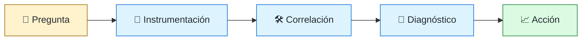
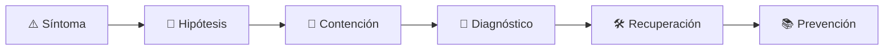

# 🔭 Observability Engineer
<!-- role-visual:start -->

**La guía conecta trabajo real, decisiones, clases concretas y evidencia defendible.**

<!-- role-visual:end -->

> Diseña señales, contexto y herramientas que permiten formular y responder preguntas
> sobre sistemas en producción sin convertir telemetría en ruido o vigilancia.
>
> **Entrada habitual:** senior · **Foco:** logs, métricas, trazas y diagnóstico
> · **Evidencia central:** recorrido de fallo correlacionado desde síntoma hasta causa

## 🧭 Qué es y por qué importa

Observabilidad es la capacidad práctica de inferir el estado interno a partir de
señales útiles. Este rol normaliza contexto, instrumentación y experiencia de consulta
para reducir tiempo de diagnóstico, coste y alertas sin dueño.

## 🗓️ Un día en el puesto

- diseñar convenciones de atributos y correlation IDs;
- revisar cardinalidad, muestreo y retención;
- instrumentar un recorrido distribuido con OpenTelemetry;
- mejorar dashboard, alerta o flujo de investigación;
- controlar acceso, datos sensibles y coste de telemetría.

## ✅ Responsabilidades y límites

- Responde por calidad, gobernanza y utilidad de señales compartidas.
- Conecta telemetría con preguntas, SLO y runbooks.
- No confunde almacenar muchos logs con comprender el sistema.
- No expone PII ni usa telemetría de ingeniería para vigilar individuos.

## 🧠 Qué necesitas saber

Logs estructurados, métricas, traces, profiling, OpenTelemetry, propagación de
contexto, sampling, cardinalidad, almacenamiento, consultas, SLO, alerting,
privacidad, seguridad, coste y experiencia de diagnóstico.

## 📚 Tu ruta en el programa

1. Partes 02–03 y 08 para sistemas, redes y debugging.
2. Partes 20 y 26–29 para instrumentar servicios y datos distribuidos.
3. Partes 31 y [35 — Observabilidad, SRE e incidentes](../classes/part-35-observabilidad-sre-e-incidentes/README.md).
4. Partes 34 y 37–39 para plataforma, ownership y agentes operativos.

<!-- role-depth:start -->
## 🗺️ Sistema profesional del rol

El gráfico no representa una cascada rígida. Muestra el bucle profesional que este rol
debe poder recorrer: comprender el contexto, tomar una decisión, intervenir, observar
el efecto y convertir lo aprendido en una mejora. En **🔭 Observability Engineer**, saltar directamente a
la herramienta suele ocultar el problema, mientras que terminar sin evidencia deja la
decisión en una opinión. La misión concreta es: Diseña señales, contexto y herramientas que permiten formular y responder preguntas sobre sistemas en producción sin convertir telemetría en ruido o vigilancia. Cada transición
debe conservar supuestos, responsables y una forma de volver atrás.

<table>
<tr>
<td valign="top" width="50%">

### 🎯 Responde por

- decisiones propias de la familia **Confiabilidad**;
- el resultado observable, no sólo la actividad ejecutada;
- límites, riesgos, operación y deuda residual de su intervención;
- evidencia que otra persona pueda revisar o reproducir.

</td>
<td valign="top" width="50%">

### 🤝 Coordina con

- [📈 Site Reliability Engineer](site-reliability-engineer.md); [⏱️ Performance Engineer](performance-engineer.md); [🛤️ Platform Engineer](platform-engineer.md);
- producto y personas usuarias cuando cambia una tarea o outcome;
- seguridad, privacidad, accesibilidad y operación según el riesgo;
- quienes mantendrán el sistema después de la entrega.

</td>
</tr>
</table>

El título no concede autoridad automática. El alcance real depende del equipo, la
industria y la criticidad. Esta guía describe un recorrido desde **semi-senior → principal**, pero una
vacante se evalúa por las decisiones que permite tomar, los sistemas que pone bajo
responsabilidad y la evidencia exigida, no por el nombre del cargo.

## 🧱 Partes y clases asociadas

La ruta distingue **parte** —unidad curricular con una capacidad acumulativa— de
**clase asociada** —punto concreto donde se estudia un mecanismo o una decisión. Las
clases siguientes forman el núcleo; no eliminan los prerrequisitos indicados en sus
propias páginas ni convierten en opcional la base común.

| Orden | Parte del programa | Clases clave | Por qué entra en esta ruta | Evidencia de transferencia |
| ---: | --- | --- | --- | --- |
| 1 | [Parte 03 · Redes, Internet y protocolos](../classes/part-03-redes-internet-y-protocolos/README.md) | [SE-041 · DNS, nombres, resolución y fallos](../classes/part-03-redes-internet-y-protocolos/se-041-dns-nombres-resolucion-y-fallos/README.md) [SE-043 · TLS, certificados y confianza en tránsito](../classes/part-03-redes-internet-y-protocolos/se-043-tls-certificados-y-confianza-en-transito/README.md) [SE-047 · Taller: seguir una petición de extremo a extremo](../classes/part-03-redes-internet-y-protocolos/se-047-taller-seguir-una-peticion-de-extremo-a-extremo/README.md) | Profundiza **redes, protocolos y fallos de comunicación** desde la responsabilidad del rol. | Traza de una petición bajo fallos. |
| 2 | [Parte 20 · Backend, APIs y procesamiento asíncrono](../classes/part-20-backend-apis-y-procesamiento-asincrono/README.md) | [SE-244 · Validación, errores y contratos consistentes](../classes/part-20-backend-apis-y-procesamiento-asincrono/se-244-validacion-errores-y-contratos-consistentes/README.md) [SE-250 · Health, readiness y shutdown ordenado](../classes/part-20-backend-apis-y-procesamiento-asincrono/se-250-health-readiness-y-shutdown-ordenado/README.md) [SE-252 · Proyecto: servicio contractual operable](../classes/part-20-backend-apis-y-procesamiento-asincrono/se-252-proyecto-servicio-contractual-operable/README.md) | Profundiza **servicios, APIs y procesamiento asíncrono** desde la responsabilidad del rol. | Servicio contractual operable. |
| 3 | [Parte 35 · Observabilidad, SRE e incidentes](../classes/part-35-observabilidad-sre-e-incidentes/README.md) | [SE-421 · Señales, eventos y observabilidad útil](../classes/part-35-observabilidad-sre-e-incidentes/se-421-senales-eventos-y-observabilidad-util/README.md) [SE-424 · Trazas distribuidas y contexto](../classes/part-35-observabilidad-sre-e-incidentes/se-424-trazas-distribuidas-y-contexto/README.md) [SE-426 · Alertas accionables y fatiga](../classes/part-35-observabilidad-sre-e-incidentes/se-426-alertas-accionables-y-fatiga/README.md) | Profundiza **observabilidad, SRE e incidentes** desde la responsabilidad del rol. | Incidente diagnosticado y recuperado. |
| 4 | [Parte 39 · SPEC, agentes y ciclo de vida agentic](../classes/part-39-spec-agentes-y-ciclo-de-vida-agentic/README.md) | [SE-473 · Agentes, herramientas, permisos y límites de autoridad](../classes/part-39-spec-agentes-y-ciclo-de-vida-agentic/se-473-agentes-herramientas-permisos-y-limites-de-autoridad/README.md) [SE-477 · Human-in-the-loop, aprobación y acciones reversibles](../classes/part-39-spec-agentes-y-ciclo-de-vida-agentic/se-477-human-in-the-loop-aprobacion-y-acciones-reversibles/README.md) [SE-479 · Taller: detener, recuperar y evaluar un agente](../classes/part-39-spec-agentes-y-ciclo-de-vida-agentic/se-479-taller-detener-recuperar-y-evaluar-un-agente/README.md) | Profundiza **SPEC, agentes, herramientas y guardrails** desde la responsabilidad del rol. | Flujo agentic controlado. |

**Cómo recorrerla.** Empieza por [SE-041](../classes/part-03-redes-internet-y-protocolos/se-041-dns-nombres-resolucion-y-fallos/README.md) para fijar el
primer mecanismo, usa [SE-421](../classes/part-35-observabilidad-sre-e-incidentes/se-421-senales-eventos-y-observabilidad-util/README.md) para integrar el
centro de la especialidad y llega a [SE-479](../classes/part-39-spec-agentes-y-ciclo-de-vida-agentic/se-479-taller-detener-recuperar-y-evaluar-un-agente/README.md) cuando ya
puedas explicar cómo detectar y recuperar un fallo. Una clase se considera estudiada
sólo cuando su concepto cambia una decisión y deja evidencia; abrir todos los enlaces
no constituye competencia.

> [!IMPORTANT]
> El mapa expresa el currículo previsto. Las Partes 00–04 están desarrolladas; las
> posteriores conservan borradores o estructuras que deben superar revisión
> cualitativa. Esta ruta no declara terminadas esas clases ni reemplaza el
> [roadmap](../ROADMAP.md).

## ⚖️ Decisiones y trade-offs que debes defender

| Decisión recurrente | Criterio profesional | Evidencia mínima antes de defenderla |
| --- | --- | --- |
| **Más datos o mejor señal** | Capturar contexto necesario con coste cardinalidad y privacidad controlados. | Preguntas diagnósticas respondidas por señal. |
| **Logs métricas o trazas** | Combinar según evento tendencia y causalidad distribuida. | Escenario de investigación con presupuesto. |
| **Centralizar o federar** | Equilibrar consistencia ownership y acceso. | SLO de plataforma y contrato de telemetría. |

La calidad de una decisión no se juzga porque coincida con una herramienta popular.
Debe hacer explícitos contexto, restricciones, alternativas descartadas, coste de
cambio y condición de revisión. En especial, **Más datos o mejor señal**, **Logs métricas o trazas**
y **Centralizar o federar** cambian de respuesta cuando cambia el riesgo. Una solución
correcta en un prototipo puede ser irresponsable en un sistema regulado; una solución
robusta para un servicio crítico puede ser desperdicio en una herramienta interna.

## 🚨 Escenario profesional: Una petición lenta cruza servicios sin identificador común

**Síntoma.** Cada componente registra tiempo pero no conserva contexto. La respuesta madura evita convertir la primera
correlación en causa y conserva evidencia antes de modificar el sistema.

1. **Detectar y delimitar:** identifica quién o qué está afectado, desde cuándo y qué
   cambió. Conserva timestamps, versiones, entradas y señales suficientes para no
   destruir la escena al intentar arreglarla.
2. **Investigar:** Seguir propagación sampling reloj atributos y límites de privacidad. Formula al menos dos hipótesis rivales
   y define qué observación refutaría cada una.
3. **Contener:** reduce blast radius y daño sin prometer una corrección todavía. La
   contención debe ser reversible, visible y compatible con las obligaciones del
   sistema.
4. **Recuperar:** Restaurar correlación capturar evidencia mínima y añadir contrato de instrumentación. Verifica la tarea completa, no sólo que un
   proceso volvió a estar verde.
5. **Aprender:** añade una regresión, señal o control que detecte la misma clase de
   fallo. Documenta qué deuda permanece y quién revisará la acción.

El escenario evalúa método además de resultado. Una recuperación rápida que borra la
causa, oculta pérdida de datos o deja al equipo sin mecanismo preventivo no demuestra
dominio del rol.

## 📊 Señales útiles y límites de las métricas

| Señal | Qué ayuda a observar | Trampa que debe evitarse |
| --- | --- | --- |
| **Preguntas diagnosticables** | Incidentes que pueden explicarse con datos disponibles. | Contar terabytes ingeridos. |
| **Costo por señal útil** | Valor diagnóstico frente a almacenamiento y procesamiento. | Reducir retención sin evaluar investigación. |
| **Cardinalidad controlada** | Dimensiones que no saturan backend ni presupuesto. | Bloquear etiquetas útiles de forma global. |

Ninguna señal debe convertirse en ranking individual. Combina tendencia cuantitativa,
muestreo de casos, feedback cualitativo y contexto de carga. Declara ventana,
denominador, fuente, exclusiones y quién puede actuar sobre el resultado. Si una
métrica mejora mientras el outcome o el riesgo empeoran, el sistema está optimizando
el indicador y no el trabajo.

## 🧩 Proyecto integrador del rol: Plataforma de diagnóstico interoperable

**Propósito:** responder preguntas de fallo sin depender de dashboards preconstruidos. El resultado esperado es **convenciones OTel collector logs métricas trazas presupuesto de cardinalidad y guía de instrumentación**.

Entrega un expediente revisable con estas piezas:

1. **Contexto y alcance:** usuario, sistema, restricción, supuestos, fuera de alcance y
   criterio de no éxito.
2. **Decisión:** al menos dos alternativas reales, trade-offs, coste de reversión y un
   ADR o memo que indique cuándo revisar la elección.
3. **Artefacto principal:** una implementación, modelo, flujo o política coherente con
   las clases núcleo; no una captura aislada ni una presentación sin mecanismo.
4. **Fallo controlado:** introduce una condición adversa relacionada con el escenario
   anterior y conserva el resultado observado, sin inventar una ejecución.
5. **Verificación:** prueba, rúbrica, revisión o medición que pueda fallar y que conecte
   directamente con el resultado profesional.
6. **Operación y salida:** telemetría, recuperación, mantenimiento, deprecación o retiro
   según corresponda; incluye límites y deuda residual.

**Criterio de aceptación:** otra persona puede reconstruir el razonamiento, reproducir
la comprobación y distinguir claramente qué quedó demostrado de lo que sólo se propone.
El proyecto no se aprueba por cantidad de archivos ni por utilizar una marca concreta.

## 📈 Dominio esperado por alcance

| Alcance | Qué resuelve | Qué evidencia su autonomía |
| --- | --- | --- |
| **Inicial** | ejecuta una tarea acotada con criterios y acompañamiento | reproduce el caso, pregunta por supuestos y entrega evidencia legible |
| **Intermedio** | decide dentro de un componente o flujo conocido | compara alternativas, prueba fallos previsibles y coordina dependencias |
| **Senior** | conduce problemas ambiguos que cruzan sistemas o equipos | hace explícito el riesgo, diseña recuperación y mejora el mecanismo de trabajo |
| **Staff / Lead** | cambia capacidades compartidas y decisiones de largo plazo | multiplica criterio, define guardrails, mide adopción y conserva opciones futuras |

Progresar no significa alejarse de la práctica. Significa aumentar ambigüedad, horizonte,
blast radius y responsabilidad por consecuencias. La persona senior todavía debe poder
explicar el mecanismo; la persona Staff además crea condiciones para que otros lo
operen sin depender de ella.

## 🗓️ Plan de práctica 30 · 60 · 90 días

- **Días 1–30 — comprender y reproducir.** Estudia las primeras clases de cada parte,
  reproduce un caso pequeño y escribe un mapa de responsabilidades. El entregable es
  una baseline con preguntas abiertas, no una transformación prematura.
- **Días 31–60 — intervenir y fallar con control.** Construye el artefacto central,
  introduce el escenario de fallo y mide el comportamiento. Revisa el trabajo con una
  persona de una ruta vecina para descubrir supuestos de frontera.
- **Días 61–90 — operar y transferir.** Ejecuta recuperación, corrige la causa, publica
  runbook o guía de uso y presenta la decisión con trade-offs. Termina con una
  retrospectiva que separe resultado, evidencia, límites y siguiente inversión.

Este plan es una secuencia de práctica, no una promesa de empleabilidad en noventa días.
La experiencia previa, el dominio y el acceso a sistemas reales cambian el tiempo
necesario.

## 🎤 Preguntas para revisión o entrevista

1. ¿En qué contexto elegirías **Más datos o mejor señal** y qué evidencia te haría cambiar?
2. ¿Cómo distinguirías síntoma, causa y daño en el escenario **Una petición lenta cruza servicios sin identificador común**?
3. ¿Qué clase asociada usarías para diseñar el mecanismo y cuál para verificarlo?
4. ¿Qué parte de **Plataforma de diagnóstico interoperable** no automatizarías todavía y por qué?
5. ¿Qué métrica podría mejorar mientras el sistema empeora y qué guardrail añadirías?
6. ¿Dónde termina la autoridad de este rol y cuándo debe escalar o pedir revisión?

Una respuesta fuerte usa un caso, reconoce incertidumbre y propone una comprobación.
Nombrar una herramienta sin explicar mecanismo, fallo y límite no demuestra la
competencia.

## 🔗 Fuentes primarias y oficiales

- [OpenTelemetry Documentation](https://opentelemetry.io/docs/) — **CNCF / OpenTelemetry**. Se usa como referencia primaria u oficial; la guía no sustituye la fuente.
- [Site Reliability Engineering](https://sre.google/books/) — **Google**. Se usa como referencia primaria u oficial; la guía no sustituye la fuente.
- [ISO/IEC 25010:2023](https://www.iso.org/standard/78176.html) — **ISO**. Se usa como referencia primaria u oficial; la guía no sustituye la fuente.

Las fuentes orientan principios, vocabulario y prácticas; no convierten la guía en una
certificación ni sustituyen la documentación específica del sistema, la jurisdicción
o la tecnología utilizada.
<!-- role-depth:end -->

## 🧪 Evidencia de portafolio

- convención de telemetría y modelo de ownership;
- traza correlacionada entre cliente, API, cola y base de datos;
- alerta basada en impacto con runbook;
- análisis de cardinalidad, privacidad, retención y coste.

## 📈 Progresión

SRE/Backend/Data Engineer → Observability Engineer → Staff Telemetry Platform.

## ⚠️ Mitos frecuentes

- “Tres pilares bastan.” Importa la pregunta que pueden responder juntos.
- “Más retención siempre ayuda.” También aumenta coste y exposición.
- “Un dashboard previene incidentes.” Sin acción y ownership es decoración.

## 🚀 Siguientes pasos

1. Formula una pregunta de diagnóstico antes de instrumentar.
2. Sigue una solicitud y un evento de extremo a extremo.
3. Retira una señal inútil y documenta el ahorro.

---

[⬅️ Volver a las rutas](README.md) · [🏠 Inicio del programa](../README.md)
