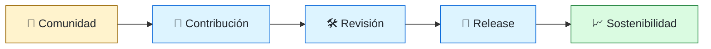
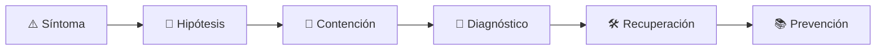

# 🤝 Open Source & InnerSource Engineer
<!-- role-visual:start -->

**La guía conecta trabajo real, decisiones, clases concretas y evidencia defendible.**

<!-- role-visual:end -->

> Diseña comunidades, gobernanza y flujos de contribución que permiten compartir
> software sin diluir ownership, seguridad ni sostenibilidad.
>
> **Entrada habitual:** semi-senior/senior · **Foco:** colaboración y gobernanza
> · **Evidencia central:** proyecto con contribución externa, revisión y release trazables

## 🧭 Qué es y por qué importa

Publicar un repositorio no crea una comunidad. Este rol define licencias, expectativas,
ownership, procesos de decisión, disclosure y sostenibilidad. InnerSource adapta esas
prácticas dentro de una organización para reducir silos sin crear código huérfano.

## 🗓️ Un día en el puesto

- mejorar CONTRIBUTING, plantillas o discoverability;
- triagear issues y acompañar una contribución;
- revisar licencia, dependencia o vulnerabilidad;
- facilitar una decisión de governance;
- medir salud sin premiar volumen ni burnout.

## ✅ Responsabilidades y límites

- Responde por reglas claras, acceso, ownership y experiencia del contribuidor.
- Distingue licencia, copyright, marca y política de seguridad.
- No exige trabajo gratuito ni convierte maintainer en soporte ilimitado.
- No abre código que contiene secretos, datos o derechos incompatibles.

## 🧠 Qué necesitas saber

Git y code review, MIT/Apache/GPL y compatibilidad básica, governance, maintainers,
CODEOWNERS, issues, releases, vulnerability disclosure, supply chain, OSPO,
InnerSource, comunidades, financiación, métricas y bus factor.

## 📚 Tu ruta en el programa

1. Partes 00, 09–11 para ética, paquetes y sostenibilidad.
2. [Parte 16 — Git, colaboración y código abierto](../classes/part-16-git-colaboracion-y-codigo-abierto/README.md).
3. Partes 17, 32–34 para documentación, seguridad y releases.
4. Partes 36–37 para EOL, ownership y organización.

<!-- role-depth:start -->
## 🗺️ Sistema profesional del rol

El gráfico no representa una cascada rígida. Muestra el bucle profesional que este rol
debe poder recorrer: comprender el contexto, tomar una decisión, intervenir, observar
el efecto y convertir lo aprendido en una mejora. En **🤝 Open Source & InnerSource Engineer**, saltar directamente a
la herramienta suele ocultar el problema, mientras que terminar sin evidencia deja la
decisión en una opinión. La misión concreta es: Diseña comunidades, gobernanza y flujos de contribución que permiten compartir software sin diluir ownership, seguridad ni sostenibilidad. Cada transición
debe conservar supuestos, responsables y una forma de volver atrás.

<table>
<tr>
<td valign="top" width="50%">

### 🎯 Responde por

- decisiones propias de la familia **Colaboración**;
- el resultado observable, no sólo la actividad ejecutada;
- límites, riesgos, operación y deuda residual de su intervención;
- evidencia que otra persona pueda revisar o reproducir.

</td>
<td valign="top" width="50%">

### 🤝 Coordina con

- [✍️ Technical Writer / Documentation Engineer](technical-writer.md); [📦 Build & Release Engineer](build-release-engineer.md); [🧭 Staff / Principal Engineer y Technical Lead](technical-leadership.md);
- producto y personas usuarias cuando cambia una tarea o outcome;
- seguridad, privacidad, accesibilidad y operación según el riesgo;
- quienes mantendrán el sistema después de la entrega.

</td>
</tr>
</table>

El título no concede autoridad automática. El alcance real depende del equipo, la
industria y la criticidad. Esta guía describe un recorrido desde **semi-senior → principal**, pero una
vacante se evalúa por las decisiones que permite tomar, los sistemas que pone bajo
responsabilidad y la evidencia exigida, no por el nombre del cargo.

## 🧱 Partes y clases asociadas

La ruta distingue **parte** —unidad curricular con una capacidad acumulativa— de
**clase asociada** —punto concreto donde se estudia un mecanismo o una decisión. Las
clases siguientes forman el núcleo; no eliminan los prerrequisitos indicados en sus
propias páginas ni convierten en opcional la base común.

| Orden | Parte del programa | Clases clave | Por qué entra en esta ruta | Evidencia de transferencia |
| ---: | --- | --- | --- | --- |
| 1 | [Parte 09 · Bibliotecas, paquetes, SDK y automatización](../classes/part-09-bibliotecas-paquetes-sdk-y-automatizacion/README.md) | [SE-110 · SemVer, compatibilidad y contratos públicos](../classes/part-09-bibliotecas-paquetes-sdk-y-automatizacion/se-110-semver-compatibilidad-y-contratos-publicos/README.md) [SE-117 · Licencias, procedencia y reutilización](../classes/part-09-bibliotecas-paquetes-sdk-y-automatizacion/se-117-licencias-procedencia-y-reutilizacion/README.md) [SE-119 · Taller: empaquetar una capacidad reusable](../classes/part-09-bibliotecas-paquetes-sdk-y-automatizacion/se-119-taller-empaquetar-una-capacidad-reusable/README.md) | Profundiza **paquetes, SDK, dependencias y compatibilidad** desde la responsabilidad del rol. | Paquete versionado y consumible. |
| 2 | [Parte 16 · Git, colaboración y código abierto](../classes/part-16-git-colaboracion-y-codigo-abierto/README.md) | [SE-196 · Pull requests y revisión basada en riesgo](../classes/part-16-git-colaboracion-y-codigo-abierto/se-196-pull-requests-y-revision-basada-en-riesgo/README.md) [SE-199 · Convenciones, ownership y CODEOWNERS](../classes/part-16-git-colaboracion-y-codigo-abierto/se-199-convenciones-ownership-y-codeowners/README.md) [SE-200 · Contribución, gobernanza y comunidades abiertas](../classes/part-16-git-colaboracion-y-codigo-abierto/se-200-contribucion-gobernanza-y-comunidades-abiertas/README.md) | Profundiza **Git, revisión, ownership y colaboración abierta** desde la responsabilidad del rol. | Contribución completa y auditable. |
| 3 | [Parte 33 · Build, release y cadena de suministro](../classes/part-33-build-release-y-cadena-de-suministro/README.md) | [SE-399 · Dependencias directas, transitivas y vendorización](../classes/part-33-build-release-y-cadena-de-suministro/se-399-dependencias-directas-transitivas-y-vendorizacion/README.md) [SE-400 · SBOM, procedencia y atestaciones](../classes/part-33-build-release-y-cadena-de-suministro/se-400-sbom-procedencia-y-atestaciones/README.md) [SE-406 · Riesgos de CI y dependencias comprometidas](../classes/part-33-build-release-y-cadena-de-suministro/se-406-riesgos-de-ci-y-dependencias-comprometidas/README.md) | Profundiza **build, release y cadena de suministro** desde la responsabilidad del rol. | Release firmado y verificable. |
| 4 | [Parte 37 · Gestión, liderazgo y práctica profesional](../classes/part-37-gestion-liderazgo-y-practica-profesional/README.md) | [SE-446 · Diseño de equipos y ownership](../classes/part-37-gestion-liderazgo-y-practica-profesional/se-446-diseno-de-equipos-y-ownership/README.md) [SE-448 · Mentoría, feedback y crecimiento](../classes/part-37-gestion-liderazgo-y-practica-profesional/se-448-mentoria-feedback-y-crecimiento/README.md) [SE-452 · Propiedad intelectual, contratos y ética](../classes/part-37-gestion-liderazgo-y-practica-profesional/se-452-propiedad-intelectual-contratos-y-etica/README.md) | Profundiza **liderazgo, organización y decisiones** desde la responsabilidad del rol. | Propuesta defendida ante conflicto. |

**Cómo recorrerla.** Empieza por [SE-110](../classes/part-09-bibliotecas-paquetes-sdk-y-automatizacion/se-110-semver-compatibilidad-y-contratos-publicos/README.md) para fijar el
primer mecanismo, usa [SE-399](../classes/part-33-build-release-y-cadena-de-suministro/se-399-dependencias-directas-transitivas-y-vendorizacion/README.md) para integrar el
centro de la especialidad y llega a [SE-452](../classes/part-37-gestion-liderazgo-y-practica-profesional/se-452-propiedad-intelectual-contratos-y-etica/README.md) cuando ya
puedas explicar cómo detectar y recuperar un fallo. Una clase se considera estudiada
sólo cuando su concepto cambia una decisión y deja evidencia; abrir todos los enlaces
no constituye competencia.

> [!IMPORTANT]
> El mapa expresa el currículo previsto. Las Partes 00–02 están desarrolladas; las
> posteriores conservan borradores o estructuras que deben superar revisión
> cualitativa. Esta ruta no declara terminadas esas clases ni reemplaza el
> [roadmap](../ROADMAP.md).

## ⚖️ Decisiones y trade-offs que debes defender

| Decisión recurrente | Criterio profesional | Evidencia mínima antes de defenderla |
| --- | --- | --- |
| **Apertura o control** | Definir decisiones transparentes y límites de seguridad. | Governance y log de decisiones. |
| **Velocidad o mantenedor sostenible** | Reducir cola con ownership documentación y automatización. | Tiempo de revisión más carga humana. |
| **Dependencia o fork** | Comparar influencia upstream urgencia y coste de mantener divergencia. | Plan de contribución y salida. |

La calidad de una decisión no se juzga porque coincida con una herramienta popular.
Debe hacer explícitos contexto, restricciones, alternativas descartadas, coste de
cambio y condición de revisión. En especial, **Apertura o control**, **Velocidad o mantenedor sostenible**
y **Dependencia o fork** cambian de respuesta cuando cambia el riesgo. Una solución
correcta en un prototipo puede ser irresponsable en un sistema regulado; una solución
robusta para un servicio crítico puede ser desperdicio en una herramienta interna.

## 🚨 Escenario profesional: Paquete comprometido exige coordinar usuarios y mantenedores

**Síntoma.** No existe inventario claro de versiones afectadas ni canal de divulgación. La respuesta madura evita convertir la primera
correlación en causa y conserva evidencia antes de modificar el sistema.

1. **Detectar y delimitar:** identifica quién o qué está afectado, desde cuándo y qué
   cambió. Conserva timestamps, versiones, entradas y señales suficientes para no
   destruir la escena al intentar arreglarla.
2. **Investigar:** Rastrear governance owners SBOM releases consumidores y embargo. Formula al menos dos hipótesis rivales
   y define qué observación refutaría cada una.
3. **Contener:** reduce blast radius y daño sin prometer una corrección todavía. La
   contención debe ser reversible, visible y compatible con las obligaciones del
   sistema.
4. **Recuperar:** Contener publicar fix coordinar aviso y revisar proceso. Verifica la tarea completa, no sólo que un
   proceso volvió a estar verde.
5. **Aprender:** añade una regresión, señal o control que detecte la misma clase de
   fallo. Documenta qué deuda permanece y quién revisará la acción.

El escenario evalúa método además de resultado. Una recuperación rápida que borra la
causa, oculta pérdida de datos o deja al equipo sin mecanismo preventivo no demuestra
dominio del rol.

## 📊 Señales útiles y límites de las métricas

| Señal | Qué ayuda a observar | Trampa que debe evitarse |
| --- | --- | --- |
| **Tiempo de primera contribución** | Fricción desde intención hasta cambio aceptable. | Medir sólo PR abierto. |
| **Bus factor** | Concentración de conocimiento y permisos críticos. | Contar contribuidores ocasionales. |
| **Carga de mantenedores** | Revisión soporte release y seguridad por persona. | Premiar volumen de issues cerrados. |

Ninguna señal debe convertirse en ranking individual. Combina tendencia cuantitativa,
muestreo de casos, feedback cualitativo y contexto de carga. Declara ventana,
denominador, fuente, exclusiones y quién puede actuar sobre el resultado. Si una
métrica mejora mientras el outcome o el riesgo empeoran, el sistema está optimizando
el indicador y no el trabajo.

## 🧩 Proyecto integrador del rol: Proyecto abierto sostenible

**Propósito:** diseñar contribución ownership release vulnerabilidades y sucesión. El resultado esperado es **CONTRIBUTING governance CODEOWNERS plantillas release firmado disclosure métricas y plan de continuidad**.

Entrega un expediente revisable con estas piezas:

1. **Contexto y alcance:** usuario, sistema, restricción, supuestos, fuera de alcance y
   criterio de no éxito.
2. **Decisión:** al menos dos alternativas reales, trade-offs, coste de reversión y un
   ADR o memo que indique cuándo revisar la elección.
3. **Artefacto principal:** una implementación, modelo, flujo o política coherente con
   las clases núcleo; no una captura aislada ni una presentación sin mecanismo.
4. **Fallo controlado:** introduce una condición adversa relacionada con el escenario
   anterior y conserva el resultado observado, sin inventar una ejecución.
5. **Verificación:** prueba, rúbrica, revisión o medición que pueda fallar y que conecte
   directamente con el resultado profesional.
6. **Operación y salida:** telemetría, recuperación, mantenimiento, deprecación o retiro
   según corresponda; incluye límites y deuda residual.

**Criterio de aceptación:** otra persona puede reconstruir el razonamiento, reproducir
la comprobación y distinguir claramente qué quedó demostrado de lo que sólo se propone.
El proyecto no se aprueba por cantidad de archivos ni por utilizar una marca concreta.

## 📈 Dominio esperado por alcance

| Alcance | Qué resuelve | Qué evidencia su autonomía |
| --- | --- | --- |
| **Inicial** | ejecuta una tarea acotada con criterios y acompañamiento | reproduce el caso, pregunta por supuestos y entrega evidencia legible |
| **Intermedio** | decide dentro de un componente o flujo conocido | compara alternativas, prueba fallos previsibles y coordina dependencias |
| **Senior** | conduce problemas ambiguos que cruzan sistemas o equipos | hace explícito el riesgo, diseña recuperación y mejora el mecanismo de trabajo |
| **Staff / Lead** | cambia capacidades compartidas y decisiones de largo plazo | multiplica criterio, define guardrails, mide adopción y conserva opciones futuras |

Progresar no significa alejarse de la práctica. Significa aumentar ambigüedad, horizonte,
blast radius y responsabilidad por consecuencias. La persona senior todavía debe poder
explicar el mecanismo; la persona Staff además crea condiciones para que otros lo
operen sin depender de ella.

## 🗓️ Plan de práctica 30 · 60 · 90 días

- **Días 1–30 — comprender y reproducir.** Estudia las primeras clases de cada parte,
  reproduce un caso pequeño y escribe un mapa de responsabilidades. El entregable es
  una baseline con preguntas abiertas, no una transformación prematura.
- **Días 31–60 — intervenir y fallar con control.** Construye el artefacto central,
  introduce el escenario de fallo y mide el comportamiento. Revisa el trabajo con una
  persona de una ruta vecina para descubrir supuestos de frontera.
- **Días 61–90 — operar y transferir.** Ejecuta recuperación, corrige la causa, publica
  runbook o guía de uso y presenta la decisión con trade-offs. Termina con una
  retrospectiva que separe resultado, evidencia, límites y siguiente inversión.

Este plan es una secuencia de práctica, no una promesa de empleabilidad en noventa días.
La experiencia previa, el dominio y el acceso a sistemas reales cambian el tiempo
necesario.

## 🎤 Preguntas para revisión o entrevista

1. ¿En qué contexto elegirías **Apertura o control** y qué evidencia te haría cambiar?
2. ¿Cómo distinguirías síntoma, causa y daño en el escenario **Paquete comprometido exige coordinar usuarios y mantenedores**?
3. ¿Qué clase asociada usarías para diseñar el mecanismo y cuál para verificarlo?
4. ¿Qué parte de **Proyecto abierto sostenible** no automatizarías todavía y por qué?
5. ¿Qué métrica podría mejorar mientras el sistema empeora y qué guardrail añadirías?
6. ¿Dónde termina la autoridad de este rol y cuándo debe escalar o pedir revisión?

Una respuesta fuerte usa un caso, reconoce incertidumbre y propone una comprobación.
Nombrar una herramienta sin explicar mecanismo, fallo y límite no demuestra la
competencia.

## 🔗 Fuentes primarias y oficiales

- [Git Documentation](https://git-scm.com/docs) — **Git project**. Se usa como referencia primaria u oficial; la guía no sustituye la fuente.
- [Collaborating with pull requests](https://docs.github.com/pull-requests/collaborating-with-pull-requests) — **GitHub**. Se usa como referencia primaria u oficial; la guía no sustituye la fuente.
- [SPDX Specification](https://spdx.dev/use/specifications/) — **Linux Foundation**. Se usa como referencia primaria u oficial; la guía no sustituye la fuente.

Las fuentes orientan principios, vocabulario y prácticas; no convierten la guía en una
certificación ni sustituyen la documentación específica del sistema, la jurisdicción
o la tecnología utilizada.
<!-- role-depth:end -->

## 🧪 Evidencia de portafolio

- modelo de governance y matriz de decisión;
- recorrido de contribución probado por una persona nueva;
- release con licencia, SBOM y disclosure;
- plan de sucesión, financiación o retiro sostenible.

## 📈 Progresión

Maintainer/Developer Advocate/Engineer → OSS/InnerSource Engineer → OSPO o Program Lead.

## ⚠️ Mitos frecuentes

- “Open source significa sin dueño.” Ownership y licencia siguen existiendo.
- “Más contribuidores siempre es salud.” También importan revisión y carga del maintainer.
- “InnerSource es copiar GitHub.” Requiere incentivos y fronteras organizacionales.

## 🚀 Siguientes pasos

1. Audita licencia, ownership y seguridad de un proyecto propio.
2. Pide a otra persona completar la ruta de contribución.
3. Diseña sucesión y EOL antes de que sean urgentes.

---

[⬅️ Volver a las rutas](README.md) · [🏠 Inicio del programa](../README.md)
