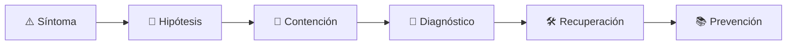

# ⏱️ Performance Engineer
<!-- role-visual:start -->

**La guía conecta trabajo real, decisiones, clases concretas y evidencia defendible.**

<!-- role-visual:end -->

> Convierte objetivos de velocidad, capacidad y eficiencia en experimentos
> reproducibles, diagnósticos causales y decisiones de arquitectura.
>
> **Entrada habitual:** semi-senior/senior · **Foco:** profiling, carga y capacidad
> · **Evidencia central:** cuello de botella demostrado y mejora medida sin regresión

## 🧭 Qué es y por qué importa

Performance engineering no optimiza por intuición. Define carga, presupuesto y
percentiles; mide el sistema completo, localiza la restricción y comprueba que la
mejora no trasladó el problema a coste, corrección o mantenibilidad.

## 🗓️ Un día en el puesto

- diseñar benchmark o perfil de carga representativo;
- analizar CPU, memoria, I/O, red y colas;
- correlacionar trazas con percentiles y saturación;
- validar una optimización y sus trade-offs;
- proyectar capacidad y riesgo de crecimiento.

## ✅ Responsabilidades y límites

- Responde por método, representatividad y reproducibilidad de mediciones.
- Distingue latencia, throughput, utilización y saturación.
- No publica un promedio cuando la cola importa.
- No optimiza código sin confirmar el cuello de botella.

## 🧠 Qué necesitas saber

Arquitectura de computadores, runtimes, profiling, benchmarking, estadística básica,
carga/stress/spike/soak, colas, caché, bases de datos, redes, tracing, capacity
planning, performance budgets y coste.

## 📚 Tu ruta en el programa

1. Partes 01–08 para máquina, algoritmos, medición y profiling.
2. Partes 19–20 y 26–29 para superficies, datos y distribución.
3. [Parte 31 — Calidad, rendimiento y resiliencia](../classes/part-31-calidad-rendimiento-y-resiliencia/README.md).
4. Partes 34–35 para entrega, observación y capacidad.

<!-- role-depth:start -->
## 🗺️ Sistema profesional del rol

El gráfico no representa una cascada rígida. Muestra el bucle profesional que este rol
debe poder recorrer: comprender el contexto, tomar una decisión, intervenir, observar
el efecto y convertir lo aprendido en una mejora. En **⏱️ Performance Engineer**, saltar directamente a
la herramienta suele ocultar el problema, mientras que terminar sin evidencia deja la
decisión en una opinión. La misión concreta es: Convierte objetivos de velocidad, capacidad y eficiencia en experimentos reproducibles, diagnósticos causales y decisiones de arquitectura. Cada transición
debe conservar supuestos, responsables y una forma de volver atrás.

<table>
<tr>
<td valign="top" width="50%">

### 🎯 Responde por

- decisiones propias de la familia **Calidad**;
- el resultado observable, no sólo la actividad ejecutada;
- límites, riesgos, operación y deuda residual de su intervención;
- evidencia que otra persona pueda revisar o reproducir.

</td>
<td valign="top" width="50%">

### 🤝 Coordina con

- [📈 Site Reliability Engineer](site-reliability-engineer.md); [⚙️ Systems Programmer](systems-programmer.md); [💸 FinOps Engineer](finops-engineer.md);
- producto y personas usuarias cuando cambia una tarea o outcome;
- seguridad, privacidad, accesibilidad y operación según el riesgo;
- quienes mantendrán el sistema después de la entrega.

</td>
</tr>
</table>

El título no concede autoridad automática. El alcance real depende del equipo, la
industria y la criticidad. Esta guía describe un recorrido desde **semi-senior → principal**, pero una
vacante se evalúa por las decisiones que permite tomar, los sistemas que pone bajo
responsabilidad y la evidencia exigida, no por el nombre del cargo.

## 🧱 Partes y clases asociadas

La ruta distingue **parte** —unidad curricular con una capacidad acumulativa— de
**clase asociada** —punto concreto donde se estudia un mecanismo o una decisión. Las
clases siguientes forman el núcleo; no eliminan los prerrequisitos indicados en sus
propias páginas ni convierten en opcional la base común.

| Orden | Parte del programa | Clases clave | Por qué entra en esta ruta | Evidencia de transferencia |
| ---: | --- | --- | --- | --- |
| 1 | [Parte 01 · Computadores y representación de información](../classes/part-01-computadores-y-representacion-de-informacion/README.md) | [SE-018 · Memoria, cachés, almacenamiento y jerarquías](../classes/part-01-computadores-y-representacion-de-informacion/se-018-memoria-caches-almacenamiento-y-jerarquias/README.md) [SE-022 · Rendimiento, consumo energético y límites físicos](../classes/part-01-computadores-y-representacion-de-informacion/se-022-rendimiento-consumo-energetico-y-limites-fisicos/README.md) [SE-024 · Proyecto: informe reproducible de comportamiento y recursos](../classes/part-01-computadores-y-representacion-de-informacion/se-024-proyecto-informe-reproducible-de-comportamiento-y-recursos/README.md) | Profundiza **máquina, memoria, representación y coste físico** desde la responsabilidad del rol. | Experimento reproducible de recursos. |
| 2 | [Parte 07 · Estructuras de datos y algoritmos](../classes/part-07-estructuras-de-datos-y-algoritmos/README.md) | [SE-094 · Complejidad empírica, benchmarks y perfiles](../classes/part-07-estructuras-de-datos-y-algoritmos/se-094-complejidad-empirica-benchmarks-y-perfiles/README.md) [SE-095 · Taller: elegir por carga y no por costumbre](../classes/part-07-estructuras-de-datos-y-algoritmos/se-095-taller-elegir-por-carga-y-no-por-costumbre/README.md) [SE-096 · Proyecto: biblioteca comparada con casos límite](../classes/part-07-estructuras-de-datos-y-algoritmos/se-096-proyecto-biblioteca-comparada-con-casos-limite/README.md) | Profundiza **estructuras, algoritmos y medición empírica** desde la responsabilidad del rol. | Benchmark con selección justificada. |
| 3 | [Parte 31 · Calidad, rendimiento y resiliencia](../classes/part-31-calidad-rendimiento-y-resiliencia/README.md) | [SE-375 · Carga, estrés, picos y endurance](../classes/part-31-calidad-rendimiento-y-resiliencia/se-375-carga-estres-picos-y-endurance/README.md) [SE-376 · Latencia, throughput, saturación y capacidad](../classes/part-31-calidad-rendimiento-y-resiliencia/se-376-latencia-throughput-saturacion-y-capacidad/README.md) [SE-377 · Perfiles, benchmarks y errores de medición](../classes/part-31-calidad-rendimiento-y-resiliencia/se-377-perfiles-benchmarks-y-errores-de-medicion/README.md) | Profundiza **calidad, rendimiento y resiliencia** desde la responsabilidad del rol. | Informe medido y game day. |
| 4 | [Parte 35 · Observabilidad, SRE e incidentes](../classes/part-35-observabilidad-sre-e-incidentes/README.md) | [SE-423 · Métricas, dimensiones y cardinalidad](../classes/part-35-observabilidad-sre-e-incidentes/se-423-metricas-dimensiones-y-cardinalidad/README.md) [SE-426 · Alertas accionables y fatiga](../classes/part-35-observabilidad-sre-e-incidentes/se-426-alertas-accionables-y-fatiga/README.md) [SE-431 · Taller: diagnosticar con telemetría incompleta](../classes/part-35-observabilidad-sre-e-incidentes/se-431-taller-diagnosticar-con-telemetria-incompleta/README.md) | Profundiza **observabilidad, SRE e incidentes** desde la responsabilidad del rol. | Incidente diagnosticado y recuperado. |

**Cómo recorrerla.** Empieza por [SE-018](../classes/part-01-computadores-y-representacion-de-informacion/se-018-memoria-caches-almacenamiento-y-jerarquias/README.md) para fijar el
primer mecanismo, usa [SE-375](../classes/part-31-calidad-rendimiento-y-resiliencia/se-375-carga-estres-picos-y-endurance/README.md) para integrar el
centro de la especialidad y llega a [SE-431](../classes/part-35-observabilidad-sre-e-incidentes/se-431-taller-diagnosticar-con-telemetria-incompleta/README.md) cuando ya
puedas explicar cómo detectar y recuperar un fallo. Una clase se considera estudiada
sólo cuando su concepto cambia una decisión y deja evidencia; abrir todos los enlaces
no constituye competencia.

> [!IMPORTANT]
> El mapa expresa el currículo previsto. La Parte 00 está desarrollada; las partes
> posteriores conservan borradores o estructuras que deben superar revisión
> cualitativa. Esta ruta no declara terminadas esas clases ni reemplaza el
> [roadmap](../ROADMAP.md).

## ⚖️ Decisiones y trade-offs que debes defender

| Decisión recurrente | Criterio profesional | Evidencia mínima antes de defenderla |
| --- | --- | --- |
| **Latencia o throughput** | Definir objetivo y saturación según la tarea de negocio. | Curva de carga con percentiles. |
| **Optimizar código o arquitectura** | Localizar primero el recurso limitante y la cola. | Perfil antes y después con intervalo. |
| **Escalar o reducir demanda** | Comparar coste cache backpressure y degradación. | Prueba de capacidad con presupuesto. |

La calidad de una decisión no se juzga porque coincida con una herramienta popular.
Debe hacer explícitos contexto, restricciones, alternativas descartadas, coste de
cambio y condición de revisión. En especial, **Latencia o throughput**, **Optimizar código o arquitectura**
y **Escalar o reducir demanda** cambian de respuesta cuando cambia el riesgo. Una solución
correcta en un prototipo puede ser irresponsable en un sistema regulado; una solución
robusta para un servicio crítico puede ser desperdicio en una herramienta interna.

## 🚨 Escenario profesional: La latencia p99 crece aunque el promedio parece estable

**Síntoma.** Una cola o pausa periódica afecta una minoría crítica. La respuesta madura evita convertir la primera
correlación en causa y conserva evidencia antes de modificar el sistema.

1. **Detectar y delimitar:** identifica quién o qué está afectado, desde cuándo y qué
   cambió. Conserva timestamps, versiones, entradas y señales suficientes para no
   destruir la escena al intentar arreglarla.
2. **Investigar:** Controlar carga warmup GC I/O locks red y cardinalidad. Formula al menos dos hipótesis rivales
   y define qué observación refutaría cada una.
3. **Contener:** reduce blast radius y daño sin prometer una corrección todavía. La
   contención debe ser reversible, visible y compatible con las obligaciones del
   sistema.
4. **Recuperar:** Aislar cuello aplicar cambio mínimo y repetir experimento comparable. Verifica la tarea completa, no sólo que un
   proceso volvió a estar verde.
5. **Aprender:** añade una regresión, señal o control que detecte la misma clase de
   fallo. Documenta qué deuda permanece y quién revisará la acción.

El escenario evalúa método además de resultado. Una recuperación rápida que borra la
causa, oculta pérdida de datos o deja al equipo sin mecanismo preventivo no demuestra
dominio del rol.

## 📊 Señales útiles y límites de las métricas

| Señal | Qué ayuda a observar | Trampa que debe evitarse |
| --- | --- | --- |
| **p50 p95 p99** | Distribución de latencia por operación y carga. | Publicar un percentil sin muestra. |
| **Utilización y saturación** | Recurso ocupado y trabajo en espera. | Confundir alta utilización con problema. |
| **Costo por transacción** | Recursos necesarios para resultado útil. | Abaratar degradando SLO. |

Ninguna señal debe convertirse en ranking individual. Combina tendencia cuantitativa,
muestreo de casos, feedback cualitativo y contexto de carga. Declara ventana,
denominador, fuente, exclusiones y quién puede actuar sobre el resultado. Si una
métrica mejora mientras el outcome o el riesgo empeoran, el sistema está optimizando
el indicador y no el trabajo.

## 🧩 Proyecto integrador del rol: Informe de capacidad reproducible

**Propósito:** establecer baseline encontrar cuello y defender una mejora sin mover el problema. El resultado esperado es **generador de carga dataset perfiles gráficos presupuesto modelo de capacidad y límites**.

Entrega un expediente revisable con estas piezas:

1. **Contexto y alcance:** usuario, sistema, restricción, supuestos, fuera de alcance y
   criterio de no éxito.
2. **Decisión:** al menos dos alternativas reales, trade-offs, coste de reversión y un
   ADR o memo que indique cuándo revisar la elección.
3. **Artefacto principal:** una implementación, modelo, flujo o política coherente con
   las clases núcleo; no una captura aislada ni una presentación sin mecanismo.
4. **Fallo controlado:** introduce una condición adversa relacionada con el escenario
   anterior y conserva el resultado observado, sin inventar una ejecución.
5. **Verificación:** prueba, rúbrica, revisión o medición que pueda fallar y que conecte
   directamente con el resultado profesional.
6. **Operación y salida:** telemetría, recuperación, mantenimiento, deprecación o retiro
   según corresponda; incluye límites y deuda residual.

**Criterio de aceptación:** otra persona puede reconstruir el razonamiento, reproducir
la comprobación y distinguir claramente qué quedó demostrado de lo que sólo se propone.
El proyecto no se aprueba por cantidad de archivos ni por utilizar una marca concreta.

## 📈 Dominio esperado por alcance

| Alcance | Qué resuelve | Qué evidencia su autonomía |
| --- | --- | --- |
| **Inicial** | ejecuta una tarea acotada con criterios y acompañamiento | reproduce el caso, pregunta por supuestos y entrega evidencia legible |
| **Intermedio** | decide dentro de un componente o flujo conocido | compara alternativas, prueba fallos previsibles y coordina dependencias |
| **Senior** | conduce problemas ambiguos que cruzan sistemas o equipos | hace explícito el riesgo, diseña recuperación y mejora el mecanismo de trabajo |
| **Staff / Lead** | cambia capacidades compartidas y decisiones de largo plazo | multiplica criterio, define guardrails, mide adopción y conserva opciones futuras |

Progresar no significa alejarse de la práctica. Significa aumentar ambigüedad, horizonte,
blast radius y responsabilidad por consecuencias. La persona senior todavía debe poder
explicar el mecanismo; la persona Staff además crea condiciones para que otros lo
operen sin depender de ella.

## 🗓️ Plan de práctica 30 · 60 · 90 días

- **Días 1–30 — comprender y reproducir.** Estudia las primeras clases de cada parte,
  reproduce un caso pequeño y escribe un mapa de responsabilidades. El entregable es
  una baseline con preguntas abiertas, no una transformación prematura.
- **Días 31–60 — intervenir y fallar con control.** Construye el artefacto central,
  introduce el escenario de fallo y mide el comportamiento. Revisa el trabajo con una
  persona de una ruta vecina para descubrir supuestos de frontera.
- **Días 61–90 — operar y transferir.** Ejecuta recuperación, corrige la causa, publica
  runbook o guía de uso y presenta la decisión con trade-offs. Termina con una
  retrospectiva que separe resultado, evidencia, límites y siguiente inversión.

Este plan es una secuencia de práctica, no una promesa de empleabilidad en noventa días.
La experiencia previa, el dominio y el acceso a sistemas reales cambian el tiempo
necesario.

## 🎤 Preguntas para revisión o entrevista

1. ¿En qué contexto elegirías **Latencia o throughput** y qué evidencia te haría cambiar?
2. ¿Cómo distinguirías síntoma, causa y daño en el escenario **La latencia p99 crece aunque el promedio parece estable**?
3. ¿Qué clase asociada usarías para diseñar el mecanismo y cuál para verificarlo?
4. ¿Qué parte de **Informe de capacidad reproducible** no automatizarías todavía y por qué?
5. ¿Qué métrica podría mejorar mientras el sistema empeora y qué guardrail añadirías?
6. ¿Dónde termina la autoridad de este rol y cuándo debe escalar o pedir revisión?

Una respuesta fuerte usa un caso, reconoce incertidumbre y propone una comprobación.
Nombrar una herramienta sin explicar mecanismo, fallo y límite no demuestra la
competencia.

## 🔗 Fuentes primarias y oficiales

- [ISO/IEC 25010:2023](https://www.iso.org/standard/78176.html) — **ISO**. Se usa como referencia primaria u oficial; la guía no sustituye la fuente.
- [OpenTelemetry Documentation](https://opentelemetry.io/docs/) — **CNCF / OpenTelemetry**. Se usa como referencia primaria u oficial; la guía no sustituye la fuente.
- [Site Reliability Engineering](https://sre.google/books/) — **Google**. Se usa como referencia primaria u oficial; la guía no sustituye la fuente.

Las fuentes orientan principios, vocabulario y prácticas; no convierten la guía en una
certificación ni sustituyen la documentación específica del sistema, la jurisdicción
o la tecnología utilizada.
<!-- role-depth:end -->

## 🧪 Evidencia de portafolio

- benchmark con entorno, carga, warm-up y variabilidad declarados;
- perfil que localice el cuello de botella;
- resultados p50/p95/p99 antes/después;
- modelo de capacidad y presupuesto con límites.

## 📈 Progresión

Software/SRE Engineer → Performance Engineer → Senior/Staff Performance o Architect.

## ⚠️ Mitos frecuentes

- “Más rápido en mi equipo es mejor.” Sin entorno y carga no hay comparación.
- “El promedio representa usuarios.” Las colas aparecen en percentiles y tails.
- “Optimizar siempre compensa.” Puede añadir complejidad mayor que el beneficio.

## 🚀 Siguientes pasos

1. Define una pregunta y presupuesto antes de medir.
2. Repite la carga y cuantifica variabilidad.
3. Cambia una causa, vuelve a medir y busca regresiones.

---

[⬅️ Volver a las rutas](README.md) · [🏠 Inicio del programa](../README.md)
