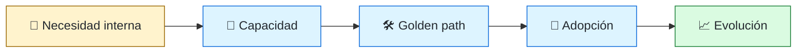
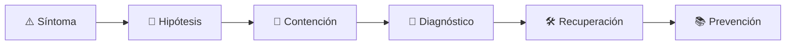

# 🛤️ Platform Engineer
<!-- role-visual:start -->

**La guía conecta trabajo real, decisiones, clases concretas y evidencia defendible.**

<!-- role-visual:end -->

> Construye una plataforma interna como producto: capacidades autoservicio que permiten
> a los equipos entregar software con menos carga cognitiva y mejores defaults.
>
> **Entrada habitual:** senior · **Foco:** IDP, golden paths y experiencia de desarrollo
> · **Evidencia central:** camino autoservicio adoptado y medido por sus usuarios

## 🧭 Qué es y por qué importa

Platform engineering aparece cuando cada equipo reinventa pipelines, observabilidad,
identidad y despliegue. La plataforma empaqueta capacidades repetibles detrás de APIs,
plantillas y documentación. Se gestiona como producto interno: discovery, roadmap,
soporte, métricas y posibilidad de decir no.

## 🗓️ Un día en el puesto

- entrevistar equipos para detectar fricción recurrente;
- diseñar una API o plantilla de plataforma;
- mantener pipelines y componentes compartidos;
- mejorar onboarding, documentación y feedback;
- medir adopción, tiempo hasta producción y fallos del camino;
- gestionar compatibilidad y deprecación sin bloquear a consumidores.

## ✅ Responsabilidades y límites

- Responde por una capacidad interna útil, confiable y comprensible.
- Define defaults seguros con escapes explícitos.
- No impone herramientas sin discovery ni evidencia de beneficio.
- No se convierte en equipo de tickets para cada despliegue.
- No mide éxito por recursos aprovisionados, sino por outcomes de equipos.

## 🧠 Qué necesitas saber

- APIs, identidad, automatización, cloud, containers e IaC;
- CI/CD, artefactos, supply chain y observabilidad;
- diseño de producto, entrevistas y priorización;
- developer portals, service catalogs, golden paths y Backstage como caso;
- DevEx, cognitive load, DORA y SPACE con guardrails;
- contratos, versionado, soporte, SLO y FinOps.

## 📚 Tu ruta en el programa

1. Partes 08–09 para herramientas, entornos y experiencia de desarrollo.
2. Partes 10–11 para discovery, economía y medición.
3. Partes 16–20 para colaboración, documentación, automatización y APIs.
4. Parte 29 para cloud e infraestructura.
5. Parte 33, [Parte 34 — CI/CD, IaC y platform engineering](../classes/part-34-ci-cd-iac-y-platform-engineering/README.md) y Parte 35 para supply chain, entrega, DevEx, observabilidad y SRE.
6. Parte 37 para diseño organizacional; partes 38–39 para plataforma de agentes.

<!-- role-depth:start -->
## 🗺️ Sistema profesional del rol

El gráfico no representa una cascada rígida. Muestra el bucle profesional que este rol
debe poder recorrer: comprender el contexto, tomar una decisión, intervenir, observar
el efecto y convertir lo aprendido en una mejora. En **🛤️ Platform Engineer**, saltar directamente a
la herramienta suele ocultar el problema, mientras que terminar sin evidencia deja la
decisión en una opinión. La misión concreta es: Construye una plataforma interna como producto: capacidades autoservicio que permiten a los equipos entregar software con menos carga cognitiva y mejores defaults. Cada transición
debe conservar supuestos, responsables y una forma de volver atrás.

<table>
<tr>
<td valign="top" width="50%">

### 🎯 Responde por

- decisiones propias de la familia **Plataforma**;
- el resultado observable, no sólo la actividad ejecutada;
- límites, riesgos, operación y deuda residual de su intervención;
- evidencia que otra persona pueda revisar o reproducir.

</td>
<td valign="top" width="50%">

### 🤝 Coordina con

- [🧰 Developer Experience Engineer](developer-experience-engineer.md); [🚚 DevOps Engineer](devops-engineer.md); [🧭 Staff / Principal Engineer y Technical Lead](technical-leadership.md);
- producto y personas usuarias cuando cambia una tarea o outcome;
- seguridad, privacidad, accesibilidad y operación según el riesgo;
- quienes mantendrán el sistema después de la entrega.

</td>
</tr>
</table>

El título no concede autoridad automática. El alcance real depende del equipo, la
industria y la criticidad. Esta guía describe un recorrido desde **senior → principal**, pero una
vacante se evalúa por las decisiones que permite tomar, los sistemas que pone bajo
responsabilidad y la evidencia exigida, no por el nombre del cargo.

## 🧱 Partes y clases asociadas

La ruta distingue **parte** —unidad curricular con una capacidad acumulativa— de
**clase asociada** —punto concreto donde se estudia un mecanismo o una decisión. Las
clases siguientes forman el núcleo; no eliminan los prerrequisitos indicados en sus
propias páginas ni convierten en opcional la base común.

| Orden | Parte del programa | Clases clave | Por qué entra en esta ruta | Evidencia de transferencia |
| ---: | --- | --- | --- | --- |
| 1 | [Parte 09 · Bibliotecas, paquetes, SDK y automatización](../classes/part-09-bibliotecas-paquetes-sdk-y-automatizacion/README.md) | [SE-113 · CLI, flags, configuración y códigos de salida](../classes/part-09-bibliotecas-paquetes-sdk-y-automatizacion/se-113-cli-flags-configuracion-y-codigos-de-salida/README.md) [SE-118 · Diseño de experiencia para desarrolladores](../classes/part-09-bibliotecas-paquetes-sdk-y-automatizacion/se-118-diseno-de-experiencia-para-desarrolladores/README.md) [SE-120 · Proyecto: SDK y CLI con compatibilidad verificada](../classes/part-09-bibliotecas-paquetes-sdk-y-automatizacion/se-120-proyecto-sdk-y-cli-con-compatibilidad-verificada/README.md) | Profundiza **paquetes, SDK, dependencias y compatibilidad** desde la responsabilidad del rol. | Paquete versionado y consumible. |
| 2 | [Parte 29 · Cloud, plataforma e infraestructura](../classes/part-29-cloud-plataforma-e-infraestructura/README.md) | [SE-354 · Infraestructura como código y estado](../classes/part-29-cloud-plataforma-e-infraestructura/se-354-infraestructura-como-codigo-y-estado/README.md) [SE-358 · Plataformas internas y golden paths](../classes/part-29-cloud-plataforma-e-infraestructura/se-358-plataformas-internas-y-golden-paths/README.md) [SE-360 · Proyecto: plataforma mínima reproducible](../classes/part-29-cloud-plataforma-e-infraestructura/se-360-proyecto-plataforma-minima-reproducible/README.md) | Profundiza **cloud, infraestructura y plataformas** desde la responsabilidad del rol. | Entorno reproducible y eliminable. |
| 3 | [Parte 34 · CI/CD, IaC y platform engineering](../classes/part-34-ci-cd-iac-y-platform-engineering/README.md) | [SE-417 · Developer portals y capacidades de plataforma](../classes/part-34-ci-cd-iac-y-platform-engineering/se-417-developer-portals-y-capacidades-de-plataforma/README.md) [SE-418 · Métricas DORA y mejora sin gaming](../classes/part-34-ci-cd-iac-y-platform-engineering/se-418-metricas-dora-y-mejora-sin-gaming/README.md) [SE-420 · Proyecto: camino a producción con rollback](../classes/part-34-ci-cd-iac-y-platform-engineering/se-420-proyecto-camino-a-produccion-con-rollback/README.md) | Profundiza **CI/CD, IaC, plataforma y DevEx** desde la responsabilidad del rol. | Camino autoservicio con rollback. |
| 4 | [Parte 37 · Gestión, liderazgo y práctica profesional](../classes/part-37-gestion-liderazgo-y-practica-profesional/README.md) | [SE-446 · Diseño de equipos y ownership](../classes/part-37-gestion-liderazgo-y-practica-profesional/se-446-diseno-de-equipos-y-ownership/README.md) [SE-450 · Gestión de riesgos y decisiones ejecutivas](../classes/part-37-gestion-liderazgo-y-practica-profesional/se-450-gestion-de-riesgos-y-decisiones-ejecutivas/README.md) [SE-455 · Taller: conducir una revisión de decisión difícil](../classes/part-37-gestion-liderazgo-y-practica-profesional/se-455-taller-conducir-una-revision-de-decision-dificil/README.md) | Profundiza **liderazgo, organización y decisiones** desde la responsabilidad del rol. | Propuesta defendida ante conflicto. |

**Cómo recorrerla.** Empieza por [SE-113](../classes/part-09-bibliotecas-paquetes-sdk-y-automatizacion/se-113-cli-flags-configuracion-y-codigos-de-salida/README.md) para fijar el
primer mecanismo, usa [SE-417](../classes/part-34-ci-cd-iac-y-platform-engineering/se-417-developer-portals-y-capacidades-de-plataforma/README.md) para integrar el
centro de la especialidad y llega a [SE-455](../classes/part-37-gestion-liderazgo-y-practica-profesional/se-455-taller-conducir-una-revision-de-decision-dificil/README.md) cuando ya
puedas explicar cómo detectar y recuperar un fallo. Una clase se considera estudiada
sólo cuando su concepto cambia una decisión y deja evidencia; abrir todos los enlaces
no constituye competencia.

> [!IMPORTANT]
> El mapa expresa el currículo previsto. Las Partes 00–02 están desarrolladas; las
> posteriores conservan borradores o estructuras que deben superar revisión
> cualitativa. Esta ruta no declara terminadas esas clases ni reemplaza el
> [roadmap](../ROADMAP.md).

## ⚖️ Decisiones y trade-offs que debes defender

| Decisión recurrente | Criterio profesional | Evidencia mínima antes de defenderla |
| --- | --- | --- |
| **Estandarizar o permitir excepción** | Ofrecer camino recomendado con escape explícito y soporte. | Adopción voluntaria más coste de excepción. |
| **Build o comprar plataforma** | Comparar diferenciación integración TCO y salida. | Experimento de onboarding y análisis económico. |
| **API o portal** | Diseñar capacidad estable antes que interfaz vistosa. | Tiempo hasta primer éxito y consumo automatizado. |

La calidad de una decisión no se juzga porque coincida con una herramienta popular.
Debe hacer explícitos contexto, restricciones, alternativas descartadas, coste de
cambio y condición de revisión. En especial, **Estandarizar o permitir excepción**, **Build o comprar plataforma**
y **API o portal** cambian de respuesta cuando cambia el riesgo. Una solución
correcta en un prototipo puede ser irresponsable en un sistema regulado; una solución
robusta para un servicio crítico puede ser desperdicio en una herramienta interna.

## 🚨 Escenario profesional: Golden path falla y bloquea decenas de equipos

**Síntoma.** Una actualización central rompe un supuesto no versionado. La respuesta madura evita convertir la primera
correlación en causa y conserva evidencia antes de modificar el sistema.

1. **Detectar y delimitar:** identifica quién o qué está afectado, desde cuándo y qué
   cambió. Conserva timestamps, versiones, entradas y señales suficientes para no
   destruir la escena al intentar arreglarla.
2. **Investigar:** Identificar contrato plantilla versión dependencia blast radius y salida. Formula al menos dos hipótesis rivales
   y define qué observación refutaría cada una.
3. **Contener:** reduce blast radius y daño sin prometer una corrección todavía. La
   contención debe ser reversible, visible y compatible con las obligaciones del
   sistema.
4. **Recuperar:** Pausar rollout revertir ofrecer bypass seguro y añadir compatibilidad. Verifica la tarea completa, no sólo que un
   proceso volvió a estar verde.
5. **Aprender:** añade una regresión, señal o control que detecte la misma clase de
   fallo. Documenta qué deuda permanece y quién revisará la acción.

El escenario evalúa método además de resultado. Una recuperación rápida que borra la
causa, oculta pérdida de datos o deja al equipo sin mecanismo preventivo no demuestra
dominio del rol.

## 📊 Señales útiles y límites de las métricas

| Señal | Qué ayuda a observar | Trampa que debe evitarse |
| --- | --- | --- |
| **Tiempo hasta primer despliegue** | Fricción desde repositorio nuevo hasta entorno útil. | Ensayar sólo con expertos. |
| **Adopción activa** | Equipos que usan y conservan la capacidad. | Contar repos creados. |
| **Carga cognitiva percibida** | Decisiones y conocimiento exigidos al consumidor. | Reducir opciones ocultando fallos. |

Ninguna señal debe convertirse en ranking individual. Combina tendencia cuantitativa,
muestreo de casos, feedback cualitativo y contexto de carga. Declara ventana,
denominador, fuente, exclusiones y quién puede actuar sobre el resultado. Si una
métrica mejora mientras el outcome o el riesgo empeoran, el sistema está optimizando
el indicador y no el trabajo.

## 🧩 Proyecto integrador del rol: Plataforma interna como producto

**Propósito:** convertir una necesidad repetida en autoservicio medido y versionado. El resultado esperado es **API plantilla portal documentación SLO telemetría feedback modelo de soporte y deprecación**.

Entrega un expediente revisable con estas piezas:

1. **Contexto y alcance:** usuario, sistema, restricción, supuestos, fuera de alcance y
   criterio de no éxito.
2. **Decisión:** al menos dos alternativas reales, trade-offs, coste de reversión y un
   ADR o memo que indique cuándo revisar la elección.
3. **Artefacto principal:** una implementación, modelo, flujo o política coherente con
   las clases núcleo; no una captura aislada ni una presentación sin mecanismo.
4. **Fallo controlado:** introduce una condición adversa relacionada con el escenario
   anterior y conserva el resultado observado, sin inventar una ejecución.
5. **Verificación:** prueba, rúbrica, revisión o medición que pueda fallar y que conecte
   directamente con el resultado profesional.
6. **Operación y salida:** telemetría, recuperación, mantenimiento, deprecación o retiro
   según corresponda; incluye límites y deuda residual.

**Criterio de aceptación:** otra persona puede reconstruir el razonamiento, reproducir
la comprobación y distinguir claramente qué quedó demostrado de lo que sólo se propone.
El proyecto no se aprueba por cantidad de archivos ni por utilizar una marca concreta.

## 📈 Dominio esperado por alcance

| Alcance | Qué resuelve | Qué evidencia su autonomía |
| --- | --- | --- |
| **Inicial** | ejecuta una tarea acotada con criterios y acompañamiento | reproduce el caso, pregunta por supuestos y entrega evidencia legible |
| **Intermedio** | decide dentro de un componente o flujo conocido | compara alternativas, prueba fallos previsibles y coordina dependencias |
| **Senior** | conduce problemas ambiguos que cruzan sistemas o equipos | hace explícito el riesgo, diseña recuperación y mejora el mecanismo de trabajo |
| **Staff / Lead** | cambia capacidades compartidas y decisiones de largo plazo | multiplica criterio, define guardrails, mide adopción y conserva opciones futuras |

Progresar no significa alejarse de la práctica. Significa aumentar ambigüedad, horizonte,
blast radius y responsabilidad por consecuencias. La persona senior todavía debe poder
explicar el mecanismo; la persona Staff además crea condiciones para que otros lo
operen sin depender de ella.

## 🗓️ Plan de práctica 30 · 60 · 90 días

- **Días 1–30 — comprender y reproducir.** Estudia las primeras clases de cada parte,
  reproduce un caso pequeño y escribe un mapa de responsabilidades. El entregable es
  una baseline con preguntas abiertas, no una transformación prematura.
- **Días 31–60 — intervenir y fallar con control.** Construye el artefacto central,
  introduce el escenario de fallo y mide el comportamiento. Revisa el trabajo con una
  persona de una ruta vecina para descubrir supuestos de frontera.
- **Días 61–90 — operar y transferir.** Ejecuta recuperación, corrige la causa, publica
  runbook o guía de uso y presenta la decisión con trade-offs. Termina con una
  retrospectiva que separe resultado, evidencia, límites y siguiente inversión.

Este plan es una secuencia de práctica, no una promesa de empleabilidad en noventa días.
La experiencia previa, el dominio y el acceso a sistemas reales cambian el tiempo
necesario.

## 🎤 Preguntas para revisión o entrevista

1. ¿En qué contexto elegirías **Estandarizar o permitir excepción** y qué evidencia te haría cambiar?
2. ¿Cómo distinguirías síntoma, causa y daño en el escenario **Golden path falla y bloquea decenas de equipos**?
3. ¿Qué clase asociada usarías para diseñar el mecanismo y cuál para verificarlo?
4. ¿Qué parte de **Plataforma interna como producto** no automatizarías todavía y por qué?
5. ¿Qué métrica podría mejorar mientras el sistema empeora y qué guardrail añadirías?
6. ¿Dónde termina la autoridad de este rol y cuándo debe escalar o pedir revisión?

Una respuesta fuerte usa un caso, reconoce incertidumbre y propone una comprobación.
Nombrar una herramienta sin explicar mecanismo, fallo y límite no demuestra la
competencia.

## 🔗 Fuentes primarias y oficiales

- [Kubernetes Documentation](https://kubernetes.io/docs/) — **CNCF / Kubernetes**. Se usa como referencia primaria u oficial; la guía no sustituye la fuente.
- [DORA software delivery performance metrics](https://dora.dev/guides/dora-metrics/) — **Google Cloud**. Se usa como referencia primaria u oficial; la guía no sustituye la fuente.
- [SWEBOK Guide v4.0a](https://www.computer.org/education/bodies-of-knowledge/software-engineering) — **IEEE Computer Society**. Se usa como referencia primaria u oficial; la guía no sustituye la fuente.

Las fuentes orientan principios, vocabulario y prácticas; no convierten la guía en una
certificación ni sustituyen la documentación específica del sistema, la jurisdicción
o la tecnología utilizada.
<!-- role-depth:end -->

## 🧪 Evidencia de portafolio

- entrevista y mapa de fricción de equipos consumidores;
- golden path que crea, prueba, publica y observa un servicio;
- API de plataforma con compatibilidad y deprecación;
- portal o catálogo mínimo con ownership y documentación;
- métricas de adopción, satisfacción y tiempo de feedback con límites;
- cálculo de coste y decisión build-vs-buy.

## 📈 Progresión

DevOps/SRE/Backend Senior → Platform Engineer → Senior/Staff Platform → Platform Lead
o Architect. El crecimiento cambia de automatizar recursos a diseñar un ecosistema
que muchos equipos pueden evolucionar.

## ⚠️ Mitos frecuentes

- “Plataforma es Kubernetes.” Kubernetes puede ser una implementación, no el producto.
- “El portal es la plataforma.” Sin capacidades detrás es solo una interfaz.
- “Golden path significa único camino.” Debe ser recomendado, no una cárcel.
- “Los desarrolladores son usuarios cautivos.” La baja adopción sigue siendo un fallo de producto.

## 🚀 Siguientes pasos

1. Identifica una fricción repetida en tres equipos.
2. Diseña la capacidad mínima y su contrato antes del portal.
3. Prueba el onboarding con una persona no autora.
4. Mide adopción y feedback; retira lo que no resuelva el problema.

---

[⬅️ Volver a las rutas](README.md) · [🏠 Inicio del programa](../README.md)
