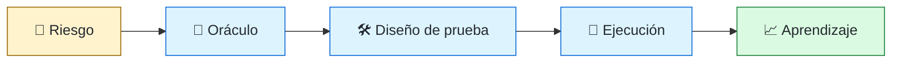
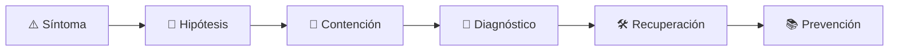

# 🧪 QA / Test Automation Engineer
<!-- role-visual:start -->

**La guía conecta trabajo real, decisiones, clases concretas y evidencia defendible.**

<!-- role-visual:end -->

> Convierte riesgos de producto en experimentos, oráculos y señales que permiten
> detectar fallos antes de que dañen a usuarios o bloqueen la evolución.
>
> **Entrada habitual:** junior/semi-senior · **Foco:** estrategia, exploración y
> automatización · **Evidencia central:** defectos relevantes detectados con bajo ruido

## 🧭 Qué es y por qué importa

Quality engineering no es ejecutar casos al final de un sprint. El rol ayuda a que el
equipo comprenda qué puede fallar, seleccione la técnica adecuada, diseñe software
observable y construya feedback temprano. Combina pensamiento exploratorio,
automatización, análisis de producto y comprensión técnica.

## 🗓️ Un día en el puesto

- revisar un requisito y encontrar ambigüedades o estados faltantes;
- diseñar una sesión exploratoria basada en riesgo;
- crear datos y oráculos reproducibles;
- automatizar en la capa más estable y económica;
- investigar una prueba flaky o un escape a producción;
- comunicar calidad como evidencia y riesgo, no como porcentaje de cobertura.

## ✅ Responsabilidades y límites

- Lidera estrategia y facilita calidad compartida; no “posee” toda la calidad.
- Distingue prevención, detección y observación en producción.
- No automatiza un proceso defectuoso solo para aumentar conteos.
- No bloquea releases por métricas sin contexto.
- No confunde que una prueba pase con que el producto sea útil o accesible.

## 🧠 Qué necesitas saber

- modelado de riesgos, criterios de aceptación y diseño de casos;
- unit, integration, system, E2E, contract y regression testing;
- property-based, mutation, fuzzing, performance, security y accessibility testing;
- automatización, datos, entornos, aislamiento y diagnóstico de flaky tests;
- CI/CD, observabilidad, feature flags e incidentes;
- comunicación de hallazgos, severidad, probabilidad y límites.

## 📚 Tu ruta en el programa

1. Partes 00, 04–08 para razonamiento, programación y depuración.
2. Partes 10, 12–14 para producto, requisitos y experiencia.
3. Partes 20, 24–25 para APIs, diseño y testabilidad.
4. [Parte 30 — Estrategia y técnicas de prueba](../classes/part-30-estrategia-y-tecnicas-de-prueba/README.md).
5. Parte 31 para calidad, rendimiento y resiliencia.
6. Partes 32–35 para seguridad, pipeline, despliegue e incidentes.
7. Parte 38 para generación y evaluación de pruebas con IA.

<!-- role-depth:start -->
## 🗺️ Sistema profesional del rol

El gráfico no representa una cascada rígida. Muestra el bucle profesional que este rol
debe poder recorrer: comprender el contexto, tomar una decisión, intervenir, observar
el efecto y convertir lo aprendido en una mejora. En **🧪 QA / Test Automation Engineer**, saltar directamente a
la herramienta suele ocultar el problema, mientras que terminar sin evidencia deja la
decisión en una opinión. La misión concreta es: Convierte riesgos de producto en experimentos, oráculos y señales que permiten detectar fallos antes de que dañen a usuarios o bloqueen la evolución. Cada transición
debe conservar supuestos, responsables y una forma de volver atrás.

<table>
<tr>
<td valign="top" width="50%">

### 🎯 Responde por

- decisiones propias de la familia **Calidad**;
- el resultado observable, no sólo la actividad ejecutada;
- límites, riesgos, operación y deuda residual de su intervención;
- evidencia que otra persona pueda revisar o reproducir.

</td>
<td valign="top" width="50%">

### 🤝 Coordina con

- [🧑‍💻 Software Engineer](software-engineer.md); [⏱️ Performance Engineer](performance-engineer.md); [♿ Accessibility Engineer](accessibility-engineer.md);
- producto y personas usuarias cuando cambia una tarea o outcome;
- seguridad, privacidad, accesibilidad y operación según el riesgo;
- quienes mantendrán el sistema después de la entrega.

</td>
</tr>
</table>

El título no concede autoridad automática. El alcance real depende del equipo, la
industria y la criticidad. Esta guía describe un recorrido desde **junior → principal**, pero una
vacante se evalúa por las decisiones que permite tomar, los sistemas que pone bajo
responsabilidad y la evidencia exigida, no por el nombre del cargo.

## 🧱 Partes y clases asociadas

La ruta distingue **parte** —unidad curricular con una capacidad acumulativa— de
**clase asociada** —punto concreto donde se estudia un mecanismo o una decisión. Las
clases siguientes forman el núcleo; no eliminan los prerrequisitos indicados en sus
propias páginas ni convierten en opcional la base común.

| Orden | Parte del programa | Clases clave | Por qué entra en esta ruta | Evidencia de transferencia |
| ---: | --- | --- | --- | --- |
| 1 | [Parte 12 · Ingeniería de requisitos](../classes/part-12-ingenieria-de-requisitos/README.md) | [SE-147 · Atributos de calidad y restricciones](../classes/part-12-ingenieria-de-requisitos/se-147-atributos-de-calidad-y-restricciones/README.md) [SE-149 · Criterios de aceptación y ejemplos](../classes/part-12-ingenieria-de-requisitos/se-149-criterios-de-aceptacion-y-ejemplos/README.md) [SE-154 · Ambigüedad, contradicción e incompletitud](../classes/part-12-ingenieria-de-requisitos/se-154-ambiguedad-contradiccion-e-incompletitud/README.md) | Profundiza **requisitos, restricciones y trazabilidad** desde la responsabilidad del rol. | Baseline de requisitos revisable. |
| 2 | [Parte 13 · Especificaciones, contratos y modelos](../classes/part-13-especificaciones-contratos-y-modelos/README.md) | [SE-158 · Specification by Example y BDD](../classes/part-13-especificaciones-contratos-y-modelos/se-158-specification-by-example-y-bdd/README.md) [SE-166 · Especificaciones ejecutables y pruebas contractuales](../classes/part-13-especificaciones-contratos-y-modelos/se-166-especificaciones-ejecutables-y-pruebas-contractuales/README.md) [SE-167 · Taller: convertir intención en contrato comprobable](../classes/part-13-especificaciones-contratos-y-modelos/se-167-taller-convertir-intencion-en-contrato-comprobable/README.md) | Profundiza **contratos, modelos e invariantes verificables** desde la responsabilidad del rol. | Especificación trazable. |
| 3 | [Parte 30 · Estrategia y técnicas de prueba](../classes/part-30-estrategia-y-tecnicas-de-prueba/README.md) | [SE-361 · Calidad por riesgo y propósito de las pruebas](../classes/part-30-estrategia-y-tecnicas-de-prueba/se-361-calidad-por-riesgo-y-proposito-de-las-pruebas/README.md) [SE-365 · Pruebas basadas en propiedades y modelos](../classes/part-30-estrategia-y-tecnicas-de-prueba/se-365-pruebas-basadas-en-propiedades-y-modelos/README.md) [SE-371 · Taller: demostrar que una prueba detecta defectos](../classes/part-30-estrategia-y-tecnicas-de-prueba/se-371-taller-demostrar-que-una-prueba-detecta-defectos/README.md) | Profundiza **estrategia de pruebas guiada por riesgo** desde la responsabilidad del rol. | Suite que demuestra detección de defectos. |
| 4 | [Parte 31 · Calidad, rendimiento y resiliencia](../classes/part-31-calidad-rendimiento-y-resiliencia/README.md) | [SE-373 · Modelos de calidad y atributos medibles](../classes/part-31-calidad-rendimiento-y-resiliencia/se-373-modelos-de-calidad-y-atributos-medibles/README.md) [SE-374 · Revisión, análisis estático y quality gates](../classes/part-31-calidad-rendimiento-y-resiliencia/se-374-revision-analisis-estatico-y-quality-gates/README.md) [SE-384 · Proyecto: informe reproducible de calidad](../classes/part-31-calidad-rendimiento-y-resiliencia/se-384-proyecto-informe-reproducible-de-calidad/README.md) | Profundiza **calidad, rendimiento y resiliencia** desde la responsabilidad del rol. | Informe medido y game day. |

**Cómo recorrerla.** Empieza por [SE-147](../classes/part-12-ingenieria-de-requisitos/se-147-atributos-de-calidad-y-restricciones/README.md) para fijar el
primer mecanismo, usa [SE-361](../classes/part-30-estrategia-y-tecnicas-de-prueba/se-361-calidad-por-riesgo-y-proposito-de-las-pruebas/README.md) para integrar el
centro de la especialidad y llega a [SE-384](../classes/part-31-calidad-rendimiento-y-resiliencia/se-384-proyecto-informe-reproducible-de-calidad/README.md) cuando ya
puedas explicar cómo detectar y recuperar un fallo. Una clase se considera estudiada
sólo cuando su concepto cambia una decisión y deja evidencia; abrir todos los enlaces
no constituye competencia.

> [!IMPORTANT]
> El mapa expresa el currículo previsto. Las Partes 00–02 están desarrolladas; las
> posteriores conservan borradores o estructuras que deben superar revisión
> cualitativa. Esta ruta no declara terminadas esas clases ni reemplaza el
> [roadmap](../ROADMAP.md).

## ⚖️ Decisiones y trade-offs que debes defender

| Decisión recurrente | Criterio profesional | Evidencia mínima antes de defenderla |
| --- | --- | --- |
| **Automatizar o explorar** | Automatizar repetición estable y explorar incertidumbre nueva. | Charter más regresión que captura el hallazgo. |
| **Mock o sistema real** | Elegir aislamiento según el riesgo contractual. | Test que falla ante defecto intencional. |
| **Cobertura o señal** | Usar métricas como pistas y no equivalentes de confianza. | Mutation o fault injection proporcional. |

La calidad de una decisión no se juzga porque coincida con una herramienta popular.
Debe hacer explícitos contexto, restricciones, alternativas descartadas, coste de
cambio y condición de revisión. En especial, **Automatizar o explorar**, **Mock o sistema real**
y **Cobertura o señal** cambian de respuesta cuando cambia el riesgo. Una solución
correcta en un prototipo puede ser irresponsable en un sistema regulado; una solución
robusta para un servicio crítico puede ser desperdicio en una herramienta interna.

## 🚨 Escenario profesional: La suite pasa pero el flujo crítico falla en producción

**Síntoma.** Los tests verifican implementación aislada y no contrato ni datos reales. La respuesta madura evita convertir la primera
correlación en causa y conserva evidencia antes de modificar el sistema.

1. **Detectar y delimitar:** identifica quién o qué está afectado, desde cuándo y qué
   cambió. Conserva timestamps, versiones, entradas y señales suficientes para no
   destruir la escena al intentar arreglarla.
2. **Investigar:** Mapear riesgo oráculos dobles fixtures ambiente y cobertura de interacción. Formula al menos dos hipótesis rivales
   y define qué observación refutaría cada una.
3. **Contener:** reduce blast radius y daño sin prometer una corrección todavía. La
   contención debe ser reversible, visible y compatible con las obligaciones del
   sistema.
4. **Recuperar:** Reproducir con el nivel mínimo adecuado y demostrar que la nueva prueba detecta el defecto. Verifica la tarea completa, no sólo que un
   proceso volvió a estar verde.
5. **Aprender:** añade una regresión, señal o control que detecte la misma clase de
   fallo. Documenta qué deuda permanece y quién revisará la acción.

El escenario evalúa método además de resultado. Una recuperación rápida que borra la
causa, oculta pérdida de datos o deja al equipo sin mecanismo preventivo no demuestra
dominio del rol.

## 📊 Señales útiles y límites de las métricas

| Señal | Qué ayuda a observar | Trampa que debe evitarse |
| --- | --- | --- |
| **Defectos detectados antes de producción** | Capacidad de encontrar riesgo relevante temprano. | Premiar cantidad de casos. |
| **Flakiness** | Pruebas no deterministas que erosionan feedback. | Reintentar hasta verde. |
| **Tiempo hasta diagnóstico** | Velocidad para convertir fallo en causa accionable. | Optimizar sólo duración de suite. |

Ninguna señal debe convertirse en ranking individual. Combina tendencia cuantitativa,
muestreo de casos, feedback cualitativo y contexto de carga. Declara ventana,
denominador, fuente, exclusiones y quién puede actuar sobre el resultado. Si una
métrica mejora mientras el outcome o el riesgo empeoran, el sistema está optimizando
el indicador y no el trabajo.

## 🧩 Proyecto integrador del rol: Estrategia de prueba por riesgo

**Propósito:** proteger un recorrido crítico con técnicas complementarias y límites explícitos. El resultado esperado es **mapa de riesgos suites por nivel sesión exploratoria mutation informe de huecos y quality gate**.

Entrega un expediente revisable con estas piezas:

1. **Contexto y alcance:** usuario, sistema, restricción, supuestos, fuera de alcance y
   criterio de no éxito.
2. **Decisión:** al menos dos alternativas reales, trade-offs, coste de reversión y un
   ADR o memo que indique cuándo revisar la elección.
3. **Artefacto principal:** una implementación, modelo, flujo o política coherente con
   las clases núcleo; no una captura aislada ni una presentación sin mecanismo.
4. **Fallo controlado:** introduce una condición adversa relacionada con el escenario
   anterior y conserva el resultado observado, sin inventar una ejecución.
5. **Verificación:** prueba, rúbrica, revisión o medición que pueda fallar y que conecte
   directamente con el resultado profesional.
6. **Operación y salida:** telemetría, recuperación, mantenimiento, deprecación o retiro
   según corresponda; incluye límites y deuda residual.

**Criterio de aceptación:** otra persona puede reconstruir el razonamiento, reproducir
la comprobación y distinguir claramente qué quedó demostrado de lo que sólo se propone.
El proyecto no se aprueba por cantidad de archivos ni por utilizar una marca concreta.

## 📈 Dominio esperado por alcance

| Alcance | Qué resuelve | Qué evidencia su autonomía |
| --- | --- | --- |
| **Inicial** | ejecuta una tarea acotada con criterios y acompañamiento | reproduce el caso, pregunta por supuestos y entrega evidencia legible |
| **Intermedio** | decide dentro de un componente o flujo conocido | compara alternativas, prueba fallos previsibles y coordina dependencias |
| **Senior** | conduce problemas ambiguos que cruzan sistemas o equipos | hace explícito el riesgo, diseña recuperación y mejora el mecanismo de trabajo |
| **Staff / Lead** | cambia capacidades compartidas y decisiones de largo plazo | multiplica criterio, define guardrails, mide adopción y conserva opciones futuras |

Progresar no significa alejarse de la práctica. Significa aumentar ambigüedad, horizonte,
blast radius y responsabilidad por consecuencias. La persona senior todavía debe poder
explicar el mecanismo; la persona Staff además crea condiciones para que otros lo
operen sin depender de ella.

## 🗓️ Plan de práctica 30 · 60 · 90 días

- **Días 1–30 — comprender y reproducir.** Estudia las primeras clases de cada parte,
  reproduce un caso pequeño y escribe un mapa de responsabilidades. El entregable es
  una baseline con preguntas abiertas, no una transformación prematura.
- **Días 31–60 — intervenir y fallar con control.** Construye el artefacto central,
  introduce el escenario de fallo y mide el comportamiento. Revisa el trabajo con una
  persona de una ruta vecina para descubrir supuestos de frontera.
- **Días 61–90 — operar y transferir.** Ejecuta recuperación, corrige la causa, publica
  runbook o guía de uso y presenta la decisión con trade-offs. Termina con una
  retrospectiva que separe resultado, evidencia, límites y siguiente inversión.

Este plan es una secuencia de práctica, no una promesa de empleabilidad en noventa días.
La experiencia previa, el dominio y el acceso a sistemas reales cambian el tiempo
necesario.

## 🎤 Preguntas para revisión o entrevista

1. ¿En qué contexto elegirías **Automatizar o explorar** y qué evidencia te haría cambiar?
2. ¿Cómo distinguirías síntoma, causa y daño en el escenario **La suite pasa pero el flujo crítico falla en producción**?
3. ¿Qué clase asociada usarías para diseñar el mecanismo y cuál para verificarlo?
4. ¿Qué parte de **Estrategia de prueba por riesgo** no automatizarías todavía y por qué?
5. ¿Qué métrica podría mejorar mientras el sistema empeora y qué guardrail añadirías?
6. ¿Dónde termina la autoridad de este rol y cuándo debe escalar o pedir revisión?

Una respuesta fuerte usa un caso, reconoce incertidumbre y propone una comprobación.
Nombrar una herramienta sin explicar mecanismo, fallo y límite no demuestra la
competencia.

## 🔗 Fuentes primarias y oficiales

- [ISO/IEC 25010:2023](https://www.iso.org/standard/78176.html) — **ISO**. Se usa como referencia primaria u oficial; la guía no sustituye la fuente.
- [SWEBOK Guide v4.0a](https://www.computer.org/education/bodies-of-knowledge/software-engineering) — **IEEE Computer Society**. Se usa como referencia primaria u oficial; la guía no sustituye la fuente.
- [Secure Software Development Framework SP 800-218](https://csrc.nist.gov/pubs/sp/800/218/final) — **NIST**. Se usa como referencia primaria u oficial; la guía no sustituye la fuente.

Las fuentes orientan principios, vocabulario y prácticas; no convierten la guía en una
certificación ni sustituyen la documentación específica del sistema, la jurisdicción
o la tecnología utilizada.
<!-- role-depth:end -->

## 🧪 Evidencia de portafolio

- estrategia de pruebas trazada a riesgos y requisitos;
- sesión exploratoria con charter, observaciones y decisiones;
- suite contractual que detecta una incompatibilidad real;
- mutación o propiedad que revela una prueba débil;
- diagnóstico de flakiness con causa y corrección;
- informe de rendimiento o accesibilidad con baseline y retest.

## 📈 Progresión

QA Analyst / Junior → QA Engineer → Test Automation / Quality Engineer → Senior →
Quality Architect, Staff QE o liderazgo. La progresión aumenta influencia sobre diseño,
pipeline y producto, no solo el volumen de scripts.

## ⚠️ Mitos frecuentes

- “QA prueba cuando desarrollo termina.” Llegar tarde encarece cada hallazgo.
- “100 % de cobertura significa calidad.” Cobertura mide ejecución, no buenos oráculos.
- “Todo debe automatizarse.” Exploración y evaluación humana siguen siendo necesarias.
- “Una prueba flaky solo se reintenta.” El reintento puede ocultar un fallo real.

## 🚀 Siguientes pasos

1. Elige un flujo y construye su mapa de riesgos.
2. Distribuye verificaciones entre unidad, integración, contrato y E2E.
3. Inyecta un defecto deliberado y comprueba qué capa lo detecta.
4. Publica resultados, límites y deuda de prueba restante.

---

[⬅️ Volver a las rutas](README.md) · [🏠 Inicio del programa](../README.md)
