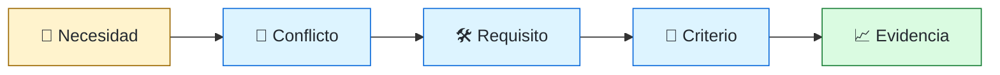
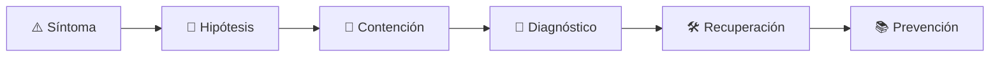

# 🧾 Requirements Engineer / Business Systems Analyst
<!-- role-visual:start -->

**La guía conecta trabajo real, decisiones, clases concretas y evidencia defendible.**

<!-- role-visual:end -->

> Convierte necesidades, restricciones y conflictos del dominio en acuerdos
> trazables que pueden diseñarse, verificarse y cambiarse conscientemente.
>
> **Entrada habitual:** junior/semi-senior · **Foco:** discovery, reglas y trazabilidad
> · **Evidencia central:** baseline validada con ambigüedades y conflictos resueltos

## 🧭 Qué es y por qué importa

Requirements engineering reduce el riesgo de construir correctamente la solución
equivocada. Elicita hechos y perspectivas, modela reglas, descubre contradicciones y
conecta cada requisito con su origen, criterio de aceptación e impacto de cambio.

## 🗓️ Un día en el puesto

- entrevistar u observar stakeholders;
- facilitar un workshop de reglas y excepciones;
- modelar casos de uso, estados o decisiones;
- detectar términos ambiguos y requisitos incompatibles;
- revisar aceptación, trazabilidad y solicitudes de cambio.

## ✅ Responsabilidades y límites

- Responde por calidad, negociación y trazabilidad del requisito.
- Separa necesidad, solución propuesta y restricción verdadera.
- No actúa como transcriptor ni inventa consenso.
- No congela el aprendizaje para proteger un documento.

## 🧠 Qué necesitas saber

Stakeholders, dominio, entrevistas, observación, workshops, prototipos, historias,
casos de uso, requisitos funcionales/no funcionales, reglas, restricciones,
priorización, aceptación, trazabilidad, validación y gestión de cambios.

## 📚 Tu ruta en el programa

1. Partes 00 y 04 para ética, abstracción y razonamiento.
2. Partes 10–11 para discovery, valor y economía.
3. [Parte 12 — Ingeniería de requisitos](../classes/part-12-ingenieria-de-requisitos/README.md).
4. Partes 13–15 para especificación, experiencia y planificación.
5. Partes 17, 23, 30 y 37 para documentación, dominios, aceptación y negociación.

<!-- role-depth:start -->
## 🗺️ Sistema profesional del rol

El gráfico no representa una cascada rígida. Muestra el bucle profesional que este rol
debe poder recorrer: comprender el contexto, tomar una decisión, intervenir, observar
el efecto y convertir lo aprendido en una mejora. En **🧾 Requirements Engineer / Business Systems Analyst**, saltar directamente a
la herramienta suele ocultar el problema, mientras que terminar sin evidencia deja la
decisión en una opinión. La misión concreta es: Convierte necesidades, restricciones y conflictos del dominio en acuerdos trazables que pueden diseñarse, verificarse y cambiarse conscientemente. Cada transición
debe conservar supuestos, responsables y una forma de volver atrás.

<table>
<tr>
<td valign="top" width="50%">

### 🎯 Responde por

- decisiones propias de la familia **Análisis**;
- el resultado observable, no sólo la actividad ejecutada;
- límites, riesgos, operación y deuda residual de su intervención;
- evidencia que otra persona pueda revisar o reproducir.

</td>
<td valign="top" width="50%">

### 🤝 Coordina con

- [🧭 Technical Product Engineer](technical-product-engineer.md); [🔗 API Engineer](api-engineer.md); [🏛️ Software Architect](software-architect.md);
- producto y personas usuarias cuando cambia una tarea o outcome;
- seguridad, privacidad, accesibilidad y operación según el riesgo;
- quienes mantendrán el sistema después de la entrega.

</td>
</tr>
</table>

El título no concede autoridad automática. El alcance real depende del equipo, la
industria y la criticidad. Esta guía describe un recorrido desde **junior → principal**, pero una
vacante se evalúa por las decisiones que permite tomar, los sistemas que pone bajo
responsabilidad y la evidencia exigida, no por el nombre del cargo.

## 🧱 Partes y clases asociadas

La ruta distingue **parte** —unidad curricular con una capacidad acumulativa— de
**clase asociada** —punto concreto donde se estudia un mecanismo o una decisión. Las
clases siguientes forman el núcleo; no eliminan los prerrequisitos indicados en sus
propias páginas ni convierten en opcional la base común.

| Orden | Parte del programa | Clases clave | Por qué entra en esta ruta | Evidencia de transferencia |
| ---: | --- | --- | --- | --- |
| 1 | [Parte 10 · Descubrimiento y estrategia de producto](../classes/part-10-descubrimiento-y-estrategia-de-producto/README.md) | [SE-121 · Problemas, síntomas, necesidades y oportunidades](../classes/part-10-descubrimiento-y-estrategia-de-producto/se-121-problemas-sintomas-necesidades-y-oportunidades/README.md) [SE-123 · Investigación, entrevistas y evidencia cualitativa](../classes/part-10-descubrimiento-y-estrategia-de-producto/se-123-investigacion-entrevistas-y-evidencia-cualitativa/README.md) [SE-130 · Criterios de no éxito y decisiones de abandono](../classes/part-10-descubrimiento-y-estrategia-de-producto/se-130-criterios-de-no-exito-y-decisiones-de-abandono/README.md) | Profundiza **discovery, usuarios, hipótesis y valor** desde la responsabilidad del rol. | Dossier de problema y decisión. |
| 2 | [Parte 12 · Ingeniería de requisitos](../classes/part-12-ingenieria-de-requisitos/README.md) | [SE-145 · Elicitación, análisis, especificación y validación](../classes/part-12-ingenieria-de-requisitos/se-145-elicitacion-analisis-especificacion-y-validacion/README.md) [SE-151 · Trazabilidad desde necesidad hasta evidencia](../classes/part-12-ingenieria-de-requisitos/se-151-trazabilidad-desde-necesidad-hasta-evidencia/README.md) [SE-154 · Ambigüedad, contradicción e incompletitud](../classes/part-12-ingenieria-de-requisitos/se-154-ambiguedad-contradiccion-e-incompletitud/README.md) | Profundiza **requisitos, restricciones y trazabilidad** desde la responsabilidad del rol. | Baseline de requisitos revisable. |
| 3 | [Parte 13 · Especificaciones, contratos y modelos](../classes/part-13-especificaciones-contratos-y-modelos/README.md) | [SE-157 · Especificación informal, semiformal y formal](../classes/part-13-especificaciones-contratos-y-modelos/se-157-especificacion-informal-semiformal-y-formal/README.md) [SE-159 · Contratos, invariantes y diseño por contrato](../classes/part-13-especificaciones-contratos-y-modelos/se-159-contratos-invariantes-y-diseno-por-contrato/README.md) [SE-167 · Taller: convertir intención en contrato comprobable](../classes/part-13-especificaciones-contratos-y-modelos/se-167-taller-convertir-intencion-en-contrato-comprobable/README.md) | Profundiza **contratos, modelos e invariantes verificables** desde la responsabilidad del rol. | Especificación trazable. |
| 4 | [Parte 17 · Documentación y conocimiento técnico](../classes/part-17-documentacion-y-conocimiento-tecnico/README.md) | [SE-205 · Documentación orientada a tareas y audiencias](../classes/part-17-documentacion-y-conocimiento-tecnico/se-205-documentacion-orientada-a-tareas-y-audiencias/README.md) [SE-208 · ADRs, RFCs y registro de decisiones](../classes/part-17-documentacion-y-conocimiento-tecnico/se-208-adrs-rfcs-y-registro-de-decisiones/README.md) [SE-215 · Taller: reconstruir conocimiento perdido](../classes/part-17-documentacion-y-conocimiento-tecnico/se-215-taller-reconstruir-conocimiento-perdido/README.md) | Profundiza **documentación, decisiones y conocimiento operativo** desde la responsabilidad del rol. | Paquete documental probado por terceros. |

**Cómo recorrerla.** Empieza por [SE-121](../classes/part-10-descubrimiento-y-estrategia-de-producto/se-121-problemas-sintomas-necesidades-y-oportunidades/README.md) para fijar el
primer mecanismo, usa [SE-157](../classes/part-13-especificaciones-contratos-y-modelos/se-157-especificacion-informal-semiformal-y-formal/README.md) para integrar el
centro de la especialidad y llega a [SE-215](../classes/part-17-documentacion-y-conocimiento-tecnico/se-215-taller-reconstruir-conocimiento-perdido/README.md) cuando ya
puedas explicar cómo detectar y recuperar un fallo. Una clase se considera estudiada
sólo cuando su concepto cambia una decisión y deja evidencia; abrir todos los enlaces
no constituye competencia.

> [!IMPORTANT]
> El mapa expresa el currículo previsto. Las Partes 00–01 están desarrolladas; las
> posteriores conservan borradores o estructuras que deben superar revisión
> cualitativa. Esta ruta no declara terminadas esas clases ni reemplaza el
> [roadmap](../ROADMAP.md).

## ⚖️ Decisiones y trade-offs que debes defender

| Decisión recurrente | Criterio profesional | Evidencia mínima antes de defenderla |
| --- | --- | --- |
| **Detalle temprano o aprendizaje** | Especificar lo irreversible y explorar lo incierto. | Mapa de supuestos y criterios de abandono. |
| **Deseo o requisito** | Separar solución propuesta necesidad restricción y regla. | Trazabilidad hasta fuente y aceptación. |
| **Consenso o desacuerdo explícito** | Registrar conflicto propietario y decisión sin fabricar unanimidad. | Baseline y log de decisiones. |

La calidad de una decisión no se juzga porque coincida con una herramienta popular.
Debe hacer explícitos contexto, restricciones, alternativas descartadas, coste de
cambio y condición de revisión. En especial, **Detalle temprano o aprendizaje**, **Deseo o requisito**
y **Consenso o desacuerdo explícito** cambian de respuesta cuando cambia el riesgo. Una solución
correcta en un prototipo puede ser irresponsable en un sistema regulado; una solución
robusta para un servicio crítico puede ser desperdicio en una herramienta interna.

## 🚨 Escenario profesional: Dos stakeholders aprueban frases incompatibles

**Síntoma.** Cada uno interpreta disponibilidad y recuperación de forma distinta. La respuesta madura evita convertir la primera
correlación en causa y conserva evidencia antes de modificar el sistema.

1. **Detectar y delimitar:** identifica quién o qué está afectado, desde cuándo y qué
   cambió. Conserva timestamps, versiones, entradas y señales suficientes para no
   destruir la escena al intentar arreglarla.
2. **Investigar:** Identificar términos cuantificadores contexto autoridad y consecuencias. Formula al menos dos hipótesis rivales
   y define qué observación refutaría cada una.
3. **Contener:** reduce blast radius y daño sin prometer una corrección todavía. La
   contención debe ser reversible, visible y compatible con las obligaciones del
   sistema.
4. **Recuperar:** Facilitar escenarios medibles registrar decisión y actualizar trazabilidad. Verifica la tarea completa, no sólo que un
   proceso volvió a estar verde.
5. **Aprender:** añade una regresión, señal o control que detecte la misma clase de
   fallo. Documenta qué deuda permanece y quién revisará la acción.

El escenario evalúa método además de resultado. Una recuperación rápida que borra la
causa, oculta pérdida de datos o deja al equipo sin mecanismo preventivo no demuestra
dominio del rol.

## 📊 Señales útiles y límites de las métricas

| Señal | Qué ayuda a observar | Trampa que debe evitarse |
| --- | --- | --- |
| **Requisitos verificables** | Afirmaciones con condición resultado y criterio observable. | Contar historias escritas. |
| **Cambios con impacto trazado** | Modificaciones conectadas a diseño prueba y riesgo. | Congelar alcance para mejorar métrica. |
| **Defectos por ambigüedad** | Fallos originados en interpretación divergente. | Culpar a implementación sin revisar lenguaje. |

Ninguna señal debe convertirse en ranking individual. Combina tendencia cuantitativa,
muestreo de casos, feedback cualitativo y contexto de carga. Declara ventana,
denominador, fuente, exclusiones y quién puede actuar sobre el resultado. Si una
métrica mejora mientras el outcome o el riesgo empeoran, el sistema está optimizando
el indicador y no el trabajo.

## 🧩 Proyecto integrador del rol: Baseline defendible de requisitos

**Propósito:** convertir un problema contradictorio en acuerdos verificables sin ocultar incertidumbre. El resultado esperado es **mapa de stakeholders entrevistas modelos requisitos NFR criterios matriz de trazabilidad y change log**.

Entrega un expediente revisable con estas piezas:

1. **Contexto y alcance:** usuario, sistema, restricción, supuestos, fuera de alcance y
   criterio de no éxito.
2. **Decisión:** al menos dos alternativas reales, trade-offs, coste de reversión y un
   ADR o memo que indique cuándo revisar la elección.
3. **Artefacto principal:** una implementación, modelo, flujo o política coherente con
   las clases núcleo; no una captura aislada ni una presentación sin mecanismo.
4. **Fallo controlado:** introduce una condición adversa relacionada con el escenario
   anterior y conserva el resultado observado, sin inventar una ejecución.
5. **Verificación:** prueba, rúbrica, revisión o medición que pueda fallar y que conecte
   directamente con el resultado profesional.
6. **Operación y salida:** telemetría, recuperación, mantenimiento, deprecación o retiro
   según corresponda; incluye límites y deuda residual.

**Criterio de aceptación:** otra persona puede reconstruir el razonamiento, reproducir
la comprobación y distinguir claramente qué quedó demostrado de lo que sólo se propone.
El proyecto no se aprueba por cantidad de archivos ni por utilizar una marca concreta.

## 📈 Dominio esperado por alcance

| Alcance | Qué resuelve | Qué evidencia su autonomía |
| --- | --- | --- |
| **Inicial** | ejecuta una tarea acotada con criterios y acompañamiento | reproduce el caso, pregunta por supuestos y entrega evidencia legible |
| **Intermedio** | decide dentro de un componente o flujo conocido | compara alternativas, prueba fallos previsibles y coordina dependencias |
| **Senior** | conduce problemas ambiguos que cruzan sistemas o equipos | hace explícito el riesgo, diseña recuperación y mejora el mecanismo de trabajo |
| **Staff / Lead** | cambia capacidades compartidas y decisiones de largo plazo | multiplica criterio, define guardrails, mide adopción y conserva opciones futuras |

Progresar no significa alejarse de la práctica. Significa aumentar ambigüedad, horizonte,
blast radius y responsabilidad por consecuencias. La persona senior todavía debe poder
explicar el mecanismo; la persona Staff además crea condiciones para que otros lo
operen sin depender de ella.

## 🗓️ Plan de práctica 30 · 60 · 90 días

- **Días 1–30 — comprender y reproducir.** Estudia las primeras clases de cada parte,
  reproduce un caso pequeño y escribe un mapa de responsabilidades. El entregable es
  una baseline con preguntas abiertas, no una transformación prematura.
- **Días 31–60 — intervenir y fallar con control.** Construye el artefacto central,
  introduce el escenario de fallo y mide el comportamiento. Revisa el trabajo con una
  persona de una ruta vecina para descubrir supuestos de frontera.
- **Días 61–90 — operar y transferir.** Ejecuta recuperación, corrige la causa, publica
  runbook o guía de uso y presenta la decisión con trade-offs. Termina con una
  retrospectiva que separe resultado, evidencia, límites y siguiente inversión.

Este plan es una secuencia de práctica, no una promesa de empleabilidad en noventa días.
La experiencia previa, el dominio y el acceso a sistemas reales cambian el tiempo
necesario.

## 🎤 Preguntas para revisión o entrevista

1. ¿En qué contexto elegirías **Detalle temprano o aprendizaje** y qué evidencia te haría cambiar?
2. ¿Cómo distinguirías síntoma, causa y daño en el escenario **Dos stakeholders aprueban frases incompatibles**?
3. ¿Qué clase asociada usarías para diseñar el mecanismo y cuál para verificarlo?
4. ¿Qué parte de **Baseline defendible de requisitos** no automatizarías todavía y por qué?
5. ¿Qué métrica podría mejorar mientras el sistema empeora y qué guardrail añadirías?
6. ¿Dónde termina la autoridad de este rol y cuándo debe escalar o pedir revisión?

Una respuesta fuerte usa un caso, reconoce incertidumbre y propone una comprobación.
Nombrar una herramienta sin explicar mecanismo, fallo y límite no demuestra la
competencia.

## 🔗 Fuentes primarias y oficiales

- [ISO/IEC/IEEE 29148:2018](https://www.iso.org/standard/72089.html) — **ISO**. Se usa como referencia primaria u oficial; la guía no sustituye la fuente.
- [SWEBOK Guide v4.0a](https://www.computer.org/education/bodies-of-knowledge/software-engineering) — **IEEE Computer Society**. Se usa como referencia primaria u oficial; la guía no sustituye la fuente.
- [ACM Code of Ethics and Professional Conduct](https://www.acm.org/code-of-ethics) — **ACM**. Se usa como referencia primaria u oficial; la guía no sustituye la fuente.

Las fuentes orientan principios, vocabulario y prácticas; no convierten la guía en una
certificación ni sustituyen la documentación específica del sistema, la jurisdicción
o la tecnología utilizada.
<!-- role-depth:end -->

## 🧪 Evidencia de portafolio

- mapa de stakeholders y evidencia de elicitación;
- glosario de dominio y matriz de reglas/excepciones;
- requisitos trazados a fuente y aceptación;
- registro de conflicto, decisión e impacto de cambio.

## 📈 Progresión

Business Analyst → Requirements Engineer → Senior/Lead Analyst o Product/Systems Architect.

## ⚠️ Mitos frecuentes

- “El cliente sabe exactamente qué pedir.” Conoce problemas y contexto, no siempre solución.
- “Una historia de usuario es un requisito completo.” Puede omitir reglas y cualidades.
- “Trazabilidad es burocracia.” Es memoria para evaluar cambios y evidencia.

## 🚀 Siguientes pasos

1. Entrevista dos perspectivas y registra contradicciones.
2. Convierte términos vagos en ejemplos y límites medibles.
3. Simula un cambio y sigue su impacto hasta pruebas y operación.

---

[⬅️ Volver a las rutas](README.md) · [🏠 Inicio del programa](../README.md)
