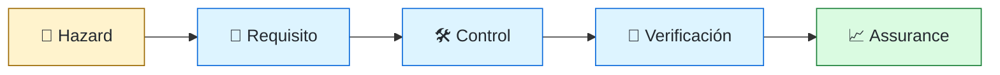
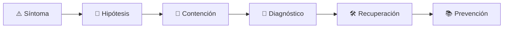

# 🛡️ Safety-Critical Software Engineer
<!-- role-visual:start -->

**La guía conecta trabajo real, decisiones, clases concretas y evidencia defendible.**

<!-- role-visual:end -->

> Traduce peligros del dominio en requisitos, arquitectura, verificación y evidencia
> capaces de sostener una afirmación de seguridad limitada y auditable.
>
> **Entrada habitual:** semi-senior/senior · **Foco:** safety, hazards y assurance
> · **Evidencia central:** cadena peligro → requisito → control → prueba → evidencia

## 🧭 Qué es y por qué importa

En medicina, transporte, industria o aeroespacio, un fallo puede causar daño físico.
Este rol no “certifica” por intuición: define contexto, analiza hazards, diseña
controles independientes y conserva evidencia bajo el estándar aplicable.

## 🗓️ Un día en el puesto

- revisar un hazard y sus supuestos operacionales;
- convertir mitigaciones en requisitos trazables;
- analizar modos de fallo y cobertura diagnóstica;
- revisar independencia, cambios y evidencia de pruebas;
- coordinar con dominio, hardware, calidad y autoridad evaluadora.

## ✅ Responsabilidades y límites

- Responde por rigor, trazabilidad y límites de las afirmaciones de safety.
- Separa seguridad funcional de ciberseguridad y conecta ambas cuando interactúan.
- No declara conformidad sin jurisdicción, estándar y evidencia aplicables.
- No sustituye especialistas médicos, industriales o regulatorios.

## 🧠 Qué necesitas saber

Requisitos, invariantes, máquinas de estado, métodos formales, hazard analysis,
redundancia, independencia, testing basado en riesgo, configuración, cambios,
factores humanos, incidentes y ciclos de vida largos.

## 📚 Tu ruta en el programa

1. Partes 00, 04 y 10–17 para ética, modelos y trazabilidad.
2. [Parte 23 — Software especializado y dominios](../classes/part-23-software-especializado-y-dominios/README.md).
3. Partes 22 y 24–28 para tiempo real, arquitectura y fallos.
4. Partes 30–33 para verificación, resiliencia, seguridad y configuración.
5. Partes 35–37 para incidentes, retiro y liderazgo.

<!-- role-depth:start -->
## 🗺️ Sistema profesional del rol

El gráfico no representa una cascada rígida. Muestra el bucle profesional que este rol
debe poder recorrer: comprender el contexto, tomar una decisión, intervenir, observar
el efecto y convertir lo aprendido en una mejora. En **🛡️ Safety-Critical Software Engineer**, saltar directamente a
la herramienta suele ocultar el problema, mientras que terminar sin evidencia deja la
decisión en una opinión. La misión concreta es: Traduce peligros del dominio en requisitos, arquitectura, verificación y evidencia capaces de sostener una afirmación de seguridad limitada y auditable. Cada transición
debe conservar supuestos, responsables y una forma de volver atrás.

<table>
<tr>
<td valign="top" width="50%">

### 🎯 Responde por

- decisiones propias de la familia **Sistemas críticos**;
- el resultado observable, no sólo la actividad ejecutada;
- límites, riesgos, operación y deuda residual de su intervención;
- evidencia que otra persona pueda revisar o reproducir.

</td>
<td valign="top" width="50%">

### 🤝 Coordina con

- [🔌 Embedded & IoT Engineer](embedded-iot-engineer.md); [🧾 Requirements Engineer / Business Systems Analyst](requirements-engineer.md); [⚖️ Compliance Engineer](compliance-engineer.md);
- producto y personas usuarias cuando cambia una tarea o outcome;
- seguridad, privacidad, accesibilidad y operación según el riesgo;
- quienes mantendrán el sistema después de la entrega.

</td>
</tr>
</table>

El título no concede autoridad automática. El alcance real depende del equipo, la
industria y la criticidad. Esta guía describe un recorrido desde **senior → principal**, pero una
vacante se evalúa por las decisiones que permite tomar, los sistemas que pone bajo
responsabilidad y la evidencia exigida, no por el nombre del cargo.

## 🧱 Partes y clases asociadas

La ruta distingue **parte** —unidad curricular con una capacidad acumulativa— de
**clase asociada** —punto concreto donde se estudia un mecanismo o una decisión. Las
clases siguientes forman el núcleo; no eliminan los prerrequisitos indicados en sus
propias páginas ni convierten en opcional la base común.

| Orden | Parte del programa | Clases clave | Por qué entra en esta ruta | Evidencia de transferencia |
| ---: | --- | --- | --- | --- |
| 1 | [Parte 04 · Pensamiento computacional y resolución de problemas](../classes/part-04-pensamiento-computacional-y-resolucion-de-problemas/README.md) | [SE-052 · Invariantes, precondiciones y poscondiciones](../classes/part-04-pensamiento-computacional-y-resolucion-de-problemas/se-052-invariantes-precondiciones-y-poscondiciones/README.md) [SE-054 · Algoritmos, corrección y terminación](../classes/part-04-pensamiento-computacional-y-resolucion-de-problemas/se-054-algoritmos-correccion-y-terminacion/README.md) [SE-057 · Modelado de estado, transiciones y eventos](../classes/part-04-pensamiento-computacional-y-resolucion-de-problemas/se-057-modelado-de-estado-transiciones-y-eventos/README.md) | Profundiza **invariantes, complejidad y resolución sistemática** desde la responsabilidad del rol. | Especificación contrastable. |
| 2 | [Parte 13 · Especificaciones, contratos y modelos](../classes/part-13-especificaciones-contratos-y-modelos/README.md) | [SE-159 · Contratos, invariantes y diseño por contrato](../classes/part-13-especificaciones-contratos-y-modelos/se-159-contratos-invariantes-y-diseno-por-contrato/README.md) [SE-161 · Máquinas de estado y model checking introductorio](../classes/part-13-especificaciones-contratos-y-modelos/se-161-maquinas-de-estado-y-model-checking-introductorio/README.md) [SE-166 · Especificaciones ejecutables y pruebas contractuales](../classes/part-13-especificaciones-contratos-y-modelos/se-166-especificaciones-ejecutables-y-pruebas-contractuales/README.md) | Profundiza **contratos, modelos e invariantes verificables** desde la responsabilidad del rol. | Especificación trazable. |
| 3 | [Parte 23 · Software especializado y dominios](../classes/part-23-software-especializado-y-dominios/README.md) | [SE-282 · Fintech, contabilidad e invariantes monetarias](../classes/part-23-software-especializado-y-dominios/se-282-fintech-contabilidad-e-invariantes-monetarias/README.md) [SE-283 · Salud, datos sensibles y sistemas regulados](../classes/part-23-software-especializado-y-dominios/se-283-salud-datos-sensibles-y-sistemas-regulados/README.md) [SE-287 · Taller: comparar riesgos entre dominios](../classes/part-23-software-especializado-y-dominios/se-287-taller-comparar-riesgos-entre-dominios/README.md) | Profundiza **dominios especializados, regulación y safety** desde la responsabilidad del rol. | Análisis de riesgo de dominio. |
| 4 | [Parte 30 · Estrategia y técnicas de prueba](../classes/part-30-estrategia-y-tecnicas-de-prueba/README.md) | [SE-361 · Calidad por riesgo y propósito de las pruebas](../classes/part-30-estrategia-y-tecnicas-de-prueba/se-361-calidad-por-riesgo-y-proposito-de-las-pruebas/README.md) [SE-365 · Pruebas basadas en propiedades y modelos](../classes/part-30-estrategia-y-tecnicas-de-prueba/se-365-pruebas-basadas-en-propiedades-y-modelos/README.md) [SE-371 · Taller: demostrar que una prueba detecta defectos](../classes/part-30-estrategia-y-tecnicas-de-prueba/se-371-taller-demostrar-que-una-prueba-detecta-defectos/README.md) | Profundiza **estrategia de pruebas guiada por riesgo** desde la responsabilidad del rol. | Suite que demuestra detección de defectos. |

**Cómo recorrerla.** Empieza por [SE-052](../classes/part-04-pensamiento-computacional-y-resolucion-de-problemas/se-052-invariantes-precondiciones-y-poscondiciones/README.md) para fijar el
primer mecanismo, usa [SE-282](../classes/part-23-software-especializado-y-dominios/se-282-fintech-contabilidad-e-invariantes-monetarias/README.md) para integrar el
centro de la especialidad y llega a [SE-371](../classes/part-30-estrategia-y-tecnicas-de-prueba/se-371-taller-demostrar-que-una-prueba-detecta-defectos/README.md) cuando ya
puedas explicar cómo detectar y recuperar un fallo. Una clase se considera estudiada
sólo cuando su concepto cambia una decisión y deja evidencia; abrir todos los enlaces
no constituye competencia.

> [!IMPORTANT]
> El mapa expresa el currículo previsto. Las Partes 00–03 están desarrolladas; las
> posteriores conservan borradores o estructuras que deben superar revisión
> cualitativa. Esta ruta no declara terminadas esas clases ni reemplaza el
> [roadmap](../ROADMAP.md).

## ⚖️ Decisiones y trade-offs que debes defender

| Decisión recurrente | Criterio profesional | Evidencia mínima antes de defenderla |
| --- | --- | --- |
| **Disponibilidad o estado seguro** | Definir qué degradación evita daño y cuál lo incrementa. | Análisis de hazards más prueba de transición. |
| **Prueba o demostración formal** | Usar rigor proporcional a criticidad y modelo disponible. | Trazabilidad de propiedades supuestos y contraejemplos. |
| **Cambio o recertificación** | Aislar impacto y conservar evidencia de configuración. | Baseline revisada y análisis de regresión. |

La calidad de una decisión no se juzga porque coincida con una herramienta popular.
Debe hacer explícitos contexto, restricciones, alternativas descartadas, coste de
cambio y condición de revisión. En especial, **Disponibilidad o estado seguro**, **Prueba o demostración formal**
y **Cambio o recertificación** cambian de respuesta cuando cambia el riesgo. Una solución
correcta en un prototipo puede ser irresponsable en un sistema regulado; una solución
robusta para un servicio crítico puede ser desperdicio en una herramienta interna.

## 🚨 Escenario profesional: Sensor inconsistente activa una decisión peligrosa

**Síntoma.** Dos entradas plausibles violan un supuesto no documentado. La respuesta madura evita convertir la primera
correlación en causa y conserva evidencia antes de modificar el sistema.

1. **Detectar y delimitar:** identifica quién o qué está afectado, desde cuándo y qué
   cambió. Conserva timestamps, versiones, entradas y señales suficientes para no
   destruir la escena al intentar arreglarla.
2. **Investigar:** Rastrear hazard requisito invariante modelo y evidencia de prueba. Formula al menos dos hipótesis rivales
   y define qué observación refutaría cada una.
3. **Contener:** reduce blast radius y daño sin prometer una corrección todavía. La
   contención debe ser reversible, visible y compatible con las obligaciones del
   sistema.
4. **Recuperar:** Pasar a estado seguro aislar entrada y revisar el argumento de assurance. Verifica la tarea completa, no sólo que un
   proceso volvió a estar verde.
5. **Aprender:** añade una regresión, señal o control que detecte la misma clase de
   fallo. Documenta qué deuda permanece y quién revisará la acción.

El escenario evalúa método además de resultado. Una recuperación rápida que borra la
causa, oculta pérdida de datos o deja al equipo sin mecanismo preventivo no demuestra
dominio del rol.

## 📊 Señales útiles y límites de las métricas

| Señal | Qué ayuda a observar | Trampa que debe evitarse |
| --- | --- | --- |
| **Cobertura de hazards** | Peligros con controles y pruebas trazables. | Contar requisitos sin severidad. |
| **Defectos de escape críticos** | Fallos que invalidan una garantía de seguridad. | Mezclar incidentes menores y catastróficos. |
| **Tiempo hasta estado seguro** | Capacidad de detectar y mitigar condición peligrosa. | Optimizar disponibilidad sobre seguridad. |

Ninguna señal debe convertirse en ranking individual. Combina tendencia cuantitativa,
muestreo de casos, feedback cualitativo y contexto de carga. Declara ventana,
denominador, fuente, exclusiones y quién puede actuar sobre el resultado. Si una
métrica mejora mientras el outcome o el riesgo empeoran, el sistema está optimizando
el indicador y no el trabajo.

## 🧩 Proyecto integrador del rol: Caso de assurance trazable

**Propósito:** demostrar cómo un hazard se convierte en requisito control prueba y evidencia. El resultado esperado es **modelo de estados invariantes matriz de trazabilidad pruebas negativas y revisión independiente**.

Entrega un expediente revisable con estas piezas:

1. **Contexto y alcance:** usuario, sistema, restricción, supuestos, fuera de alcance y
   criterio de no éxito.
2. **Decisión:** al menos dos alternativas reales, trade-offs, coste de reversión y un
   ADR o memo que indique cuándo revisar la elección.
3. **Artefacto principal:** una implementación, modelo, flujo o política coherente con
   las clases núcleo; no una captura aislada ni una presentación sin mecanismo.
4. **Fallo controlado:** introduce una condición adversa relacionada con el escenario
   anterior y conserva el resultado observado, sin inventar una ejecución.
5. **Verificación:** prueba, rúbrica, revisión o medición que pueda fallar y que conecte
   directamente con el resultado profesional.
6. **Operación y salida:** telemetría, recuperación, mantenimiento, deprecación o retiro
   según corresponda; incluye límites y deuda residual.

**Criterio de aceptación:** otra persona puede reconstruir el razonamiento, reproducir
la comprobación y distinguir claramente qué quedó demostrado de lo que sólo se propone.
El proyecto no se aprueba por cantidad de archivos ni por utilizar una marca concreta.

## 📈 Dominio esperado por alcance

| Alcance | Qué resuelve | Qué evidencia su autonomía |
| --- | --- | --- |
| **Inicial** | ejecuta una tarea acotada con criterios y acompañamiento | reproduce el caso, pregunta por supuestos y entrega evidencia legible |
| **Intermedio** | decide dentro de un componente o flujo conocido | compara alternativas, prueba fallos previsibles y coordina dependencias |
| **Senior** | conduce problemas ambiguos que cruzan sistemas o equipos | hace explícito el riesgo, diseña recuperación y mejora el mecanismo de trabajo |
| **Staff / Lead** | cambia capacidades compartidas y decisiones de largo plazo | multiplica criterio, define guardrails, mide adopción y conserva opciones futuras |

Progresar no significa alejarse de la práctica. Significa aumentar ambigüedad, horizonte,
blast radius y responsabilidad por consecuencias. La persona senior todavía debe poder
explicar el mecanismo; la persona Staff además crea condiciones para que otros lo
operen sin depender de ella.

## 🗓️ Plan de práctica 30 · 60 · 90 días

- **Días 1–30 — comprender y reproducir.** Estudia las primeras clases de cada parte,
  reproduce un caso pequeño y escribe un mapa de responsabilidades. El entregable es
  una baseline con preguntas abiertas, no una transformación prematura.
- **Días 31–60 — intervenir y fallar con control.** Construye el artefacto central,
  introduce el escenario de fallo y mide el comportamiento. Revisa el trabajo con una
  persona de una ruta vecina para descubrir supuestos de frontera.
- **Días 61–90 — operar y transferir.** Ejecuta recuperación, corrige la causa, publica
  runbook o guía de uso y presenta la decisión con trade-offs. Termina con una
  retrospectiva que separe resultado, evidencia, límites y siguiente inversión.

Este plan es una secuencia de práctica, no una promesa de empleabilidad en noventa días.
La experiencia previa, el dominio y el acceso a sistemas reales cambian el tiempo
necesario.

## 🎤 Preguntas para revisión o entrevista

1. ¿En qué contexto elegirías **Disponibilidad o estado seguro** y qué evidencia te haría cambiar?
2. ¿Cómo distinguirías síntoma, causa y daño en el escenario **Sensor inconsistente activa una decisión peligrosa**?
3. ¿Qué clase asociada usarías para diseñar el mecanismo y cuál para verificarlo?
4. ¿Qué parte de **Caso de assurance trazable** no automatizarías todavía y por qué?
5. ¿Qué métrica podría mejorar mientras el sistema empeora y qué guardrail añadirías?
6. ¿Dónde termina la autoridad de este rol y cuándo debe escalar o pedir revisión?

Una respuesta fuerte usa un caso, reconoce incertidumbre y propone una comprobación.
Nombrar una herramienta sin explicar mecanismo, fallo y límite no demuestra la
competencia.

## 🔗 Fuentes primarias y oficiales

- [ISO/IEC 25010:2023](https://www.iso.org/standard/78176.html) — **ISO**. Se usa como referencia primaria u oficial; la guía no sustituye la fuente.
- [ACM Code of Ethics and Professional Conduct](https://www.acm.org/code-of-ethics) — **ACM**. Se usa como referencia primaria u oficial; la guía no sustituye la fuente.
- [SWEBOK Guide v4.0a](https://www.computer.org/education/bodies-of-knowledge/software-engineering) — **IEEE Computer Society**. Se usa como referencia primaria u oficial; la guía no sustituye la fuente.

Las fuentes orientan principios, vocabulario y prácticas; no convierten la guía en una
certificación ni sustituyen la documentación específica del sistema, la jurisdicción
o la tecnología utilizada.
<!-- role-depth:end -->

## 🧪 Evidencia de portafolio

- análisis de hazards con contexto y límites;
- matriz trazable de requisitos, controles y pruebas;
- modelo de estado con propiedad y contraejemplo;
- caso de assurance que distingue evidencia de afirmación.

## 📈 Progresión

Software/Verification Engineer → Safety Engineer → Senior → Safety Architect/Lead.

## ⚠️ Mitos frecuentes

- “Más pruebas garantizan seguridad.” Sin modelo de riesgo no se conoce su suficiencia.
- “Cumplir un estándar elimina responsabilidad.” El contexto real sigue mandando.
- “Formal significa infalible.” Un modelo puede omitir el supuesto decisivo.

## 🚀 Siguientes pasos

1. Selecciona un caso hipotético y declara su contexto sin afirmar certificación.
2. Traza un hazard hasta una prueba y un límite residual.
3. Revisa qué cambio invalidaría la evidencia.

---

[⬅️ Volver a las rutas](README.md) · [🏠 Inicio del programa](../README.md)
